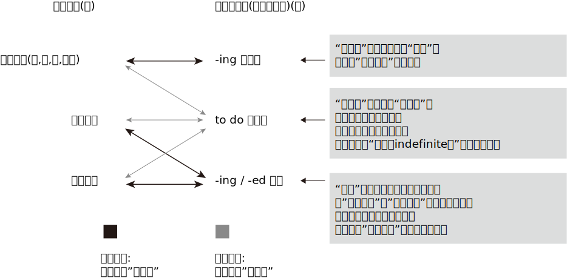

= 时态
:toc:

---

---

== 定语从句的简化(降格为"非句子")

---

---

==== 定语从句与分词

如果 ①关系词, 是充当定语从句的"主语"成分; 并且②从句的谓语是实义动词. => 则该定语从句, 可以简化成"分词短语"，包括"现在分词短语"和"过去分词短语"。

上面说过, 将从句(比如定语从句), 简化为"非句子"的"非谓语动词"时, 会丢失"谓语动词"所能表达的丰富时态. 因此, 导致有的"定语从句"可以简化为"分词短语"，有的"定语从句"则不能简化。*判断能不能简化的关键, 是看该"定语从句的谓语时间", 与"主句的谓语时间"之间的关系。*

"现在分词"和"过去分词"的不同意义:

|===
|非谓语动词 |可以表示的意义

|现在分词
|- "主动一般"的动作 +
- "主动进行"的动作

|过去分词
|- "被动一般"的动作 或 "完成"的动作 +
- "主动完成"的动作
|===
*以上只是说明了"分词"作定语的"语态"（voice）和"体态"（aspect）的特点，并没有涉及动作完成的"具体时间"上的概念*，比如没有说"现在分词"是表示“现在进行的动作”, 还是“过去进行的动作”。*这是因为"分词动作"的时间, 要通过句子"谓语动作"的时间体现出来，且两者一般是一致的，比如同样表示"过去"，或同样表示"现在"。*

- The men (*working* on the site) *were* in some danger. 当时在工地上工作的那些人处境非常危险。 +
=The men (who *were working* on the site) were in some danger. +
-> *主句谓语were, 表明时间是"过去"，所以分词working的时间也是"过去"*，故原句可改为 The men (who *were working*...) √.  而不能改写成 The men (who *are working*...). ×

- The men (*working* on the site) *are* in some danger. 现在正在工地上工作的那些人处境非常危险。 +
=The men (who *are working* on the site) are in some danger. +
-> 主句的谓语are, 表明时间是"现在"，所以分词working的时间也是"现在"，故原句可改为 The men (who *are working*...) √. 而不能改写成 The men (who *were working*...). ×

又如

- *Do* you know the boy (who *broke* the window)? 你认识打破了窗户的那个男孩吗？ +

-> *从主句的谓语do, 和从句的谓语broke, 我们能够知道，这两者之间在时间上是不一致的，前者是"一般现在时态"，而后者是"一般过去时态"，两者之间有一个时间差。因此，我们不能把这里的"定语从句"简化为"分词短语"*，比如不能说成：*Do* you know the boy (*breaking* the window)? ×

*根据我们上面说过的“分词动作的时间, 与句子谓语的时间一致性原则”，此时的分词breaking(非谓语动词), 还原成定语从句(升级成句子)时, 只能是用"现在时态"*，即说成： +
*Do* you know the boy (who *is breaking* the window)? +
但这样句子的意思就变成了：你认识现在正在那里砸窗户的那个男孩吗？

*简言之, 妾(非谓语动词)的动作时间, 要与妻子(主句谓语)的动作时间保持一致. 妻什么时候做, 妾也必须在那个时候做.* (分词动作的时间, 与句子谓语的时间一致性原则)

举例

- *Do* you know the fire __ yesterday? +
你知道昨天发生的那场大火吗？ +
A.which broke out <-正确选项 +
B.breaking out

这道题, 就是关于"分词"的时间, 与"句子谓语"的时间要一致的问题。*句子谓语动作的时间, 与分词动作的时间, 必须要一致，否则只好用(升级成)定语从句。*  +
这个句子就是遇到了不一致的情况：*由do知道句子的谓语是"现在时态"，而由yesterday知道分词是"过去时态"，所以此时只好用定语从句。* 故A 正确，而B 即 breaking out 违背了这个一致性原则。所以这句话应该说成： +
*Do* you know the fire 定从(*which* broke out yesterday)? +
而不能说：Do you know the fire (*breaking* out *yesterday*)? × <- 这个分词定语中的时态本身就已经错误了.

如果将 *Do* you know the fire (*breaking* out)? 改成定语从句后, 只能是 Do you know the fire (which *is breaking out* now)? 那么翻译成中文的意思就是“你知道现在正在燃烧的大火吗？”此时就不能用yesterday这样的表示过去时间的状语。

综上所述，*"分词动作"的时间, 一般须与"句子谓语"的时间一致，若不一致, 则不能用"分词"造句，而只能用"定语从句"。*

---

==== 哪些定语从句, 可以简化成分词短语?

==== 01. 主从句的谓语, 同为"现在"时间, 则该"定语从句"可以简化成"分词短语"

（1）*主句谓语*(现在时:一般(即"*一般现在*"时态)) + *定从谓语*(现在时:一般(即"*一般现在*"时态)) -> 则"定从"可以进行简化成"分词短语"

-  China *is* a developing country *which belongs to* the third world. ? +
=> 简化成 : China *is* a developing country *belonging to* the third world. +
中国还是一个发展中国家，属于第三世界国家。 +
-> 1.主句谓语 is , 定从谓语 belongs, 都是"现在时"(此处是"一般现在时态"), 因此可以对"定从"进行简化成"非谓语"(分词). +
-> 2.*那么是简化成 -ing 还是 -ed 呢? 看"定从"本身的主谓关系, 是主动还是被动.* 显然, which 和 belongs 是"主动"关系, 所以简化成非谓语的分词后, 要用"-ing 现在分词".

|===
||主句谓语 |定语从句的谓语 |结论

|1.*主句谓语, 和定从谓语, 是否都是"现在时"*? +
都是"现在时",则该"定语从句"可以简化成"非谓语"(分词).
|is +
(现在时 : 一般式)
|belongs to +
(现在时 : 一般式)
|定从 -> 分词 √ +
(可以进行简化)

|2.*定义从句中的"主谓关系", 是"主动"还是"被动"关系?* +
若是主动关系, 则简化成 -ing 现在分词 +
若是被动关系, 则简化成 -ed 过去分词
|
|定从"主语": which  +
定从"谓语": belongs to +
-> 是"主动关系"
|使用 "-ing 现在分词"
|===

- English *has* an alphabet that *consists of* 26 letters. +
=> 简化成:  English has an alphabet *consisting of* 26 letters. +
英语字母表是由26个字母组成的。 +
-> 1.主句谓语 has, 定从谓语 consists, 都是"现在时(一般式)", 因此"定从"可以简化成非谓语(分词) +
-> 2."定从"中的主谓, 即that 和consists of 是"主动"关系, 因此"定从"要简化成 "-ing 现在分词".

- Books *which are written* in English *are* more expensive. +
=> 简化成: Books *written* in English *are* more expensive. +
英文书一般都较贵。 +
-> 1.主句谓语are, 定从谓语 are written, 同为"现在时(一般式)"(一般现在时态)， 因此"定从"可以简化成非谓语(分词) +
-> 2."定从"中的主谓, 即 which 和 are written 是"被动"关系, 因此"定从"要简化成 "-ed 过去分词".

（2）*主句谓语*(现在时:一般(即"*一般现在*"时态)) + *定从谓语*(现在时:进行(即"*现在进行*"时态)) -> 则"定从"可以进行简化成"分词短语"

- *Do* you know the boy *who is playing* the violin? +
=> 简化成: Do you know the boy *playing* the violin? +
你认识那个正在拉小提琴的男孩吗？ +
-> 1.主句谓语do, 是"现在时(一般)"; 定从谓语 is playing, 是"现在时(进行)"，因此该"定从"可以简化成非谓语(分词) +
-> 2."定从"中的主谓, 即who 和is playing 是"主动"关系, 因此"定从"要简化成 "-ing 现在分词".

- The man (who *is standing* at the gate) *is* my English teacher. +
=> 简化成: The man *standing* at the gate is my English teacher. +
站在大门口的那个男子是我的英文老师。 +
-> 1.主句谓语is, 是"现在时(一般)"; 定从谓语 is standing, 是"现在时(进行)"，因此该"定从"可以简化成非谓语(分词) +
-> 2."定从"中的主谓, 即who 和is standing 是"主动"关系, 因此"定从"要简化成 "-ing 现在分词".

- The car (that *is being repaired*) *is* mine. +
=> 简化成: The car *being repaired* is mine. +
现在正在修的那辆汽车是我的。 +
-> 1.主句谓语is, 是"现在时(一般)"; 定从谓语 is being repaired, 是"现在时(进行)"，因此"定从"可以简化成非谓语(分词) +
-> 2."定从"中的主谓, 即 that 和 is being repaired 是"被动"关系, 因此"定从"要简化成 "-ed 过去分词".

---

==== 01. 主从句的谓语, 同为"过去"时间, 则该"定语从句"可以简化成"分词短语"

- He *used to live* in the house (which *faced* south). +
=> 简化成:  He used to live in the house *facing* south. +
他曾经住在一间朝南的房子里。 +
-> 1.主句谓语 used to live, 是"过去时(一般)"; 定从谓语 faced, 是"过去时(一般)"，因此"定从"可以简化成非谓语(分词) +
-> 2."定从"中的主谓, 即 which 和 faced 是"主动"关系, 因此"定从"要简化成 "-ing 现在分词".

- The man (who *stole* into the room) *was caught* immediately. +
=> 简化成: The man *stealing* into the room was caught immediately. +
偷偷溜进房间里的那个男子立即被逮住了。 +
-> 1.主句谓语 was caught, 是"过去时(一般)"; 定从谓语 stole, 是"过去时(一般)"，因此"定从"可以简化成非谓语(分词) +
-> 2."定从"中的主谓, 即 who 和 stole 是"主动"关系, 因此"定从"要简化成 "-ing 现在分词".

==== 01. 某些特殊的"主句, 从句的谓语时间不一致"的情况, 如果简化后, 对句子意思的理解, 扭曲不大, 则该"定语从句"也能简化成"分词短语"

在某些特殊情况下，尽管主句与从句谓语的时间不一致，但在不影响句子意思表达的情况下，可以把"定语从句"简化为"分词短语"。

- The girl (who *is playing* basketball) *used to be* very weak. +
=> 简化成: The girl *playing* basketball used to be very weak. +
正在踢足球的那个姑娘以前曾经身体瘦弱。 +
-> 1.主句谓语 used to be, 是"过去时(一般)"; 定从谓语 is playing, 是"现在时(进行)"，虽然它们的时间不一致, 但由于简化后对句子意思的理解并无太大扭曲, 因此该"定从"可以简化成非谓语(分词) +
-> 2."定从"中的主谓, 即 who 和 is playing 是"主动"关系, 因此"定从"要简化成 "-ing 现在分词".

- The car (that *was repaired* yesterday by him) *is* mine. +
=> 简化成: The car *repaired* yesterday by him is mine. +
昨天修的那辆汽车是我的。 +
-> 1.主句谓语 is, 是"现在时(一般)"; 定从谓语 was repaired, 是"过去时(一般)"，虽然它们的时间不一致, 但由于简化后对句子意思的理解并无太大扭曲, 因此该"定从"可以简化成非谓语(分词) +
-> 2."定从"中的主谓, 即 that 和 was repaired 是"被动"关系, 因此"定从"要简化成 "-ed 过去分词".

*但是，若定语从句简化成分词后, 影响了句子意思的表达，则就该定语从句就不能被简化。*

== 哪些"定语从句"无法简化成"分词短语"?

==== 因时态限制不能转换 -> 主句谓语(后发生), 从句谓语(先发生) => 则从句不能简化为分词.

一般来讲，若从句谓语比主句谓语"先发生"，则从句不能简化为分词。

- *Do* you *know*(后发生) the boy (who *broke*(先发生) the window)? <- 该定从就不能简化为分词

- The girl (who *stood*(先发生) at the gate *yesterday*) *is*(后发生) my sister. <- 该定从不能简化为分词 +
-> 为什么不能进行简化? 因为非谓语动词,本身是缺乏像谓语动词那样的"时间内涵"的(即: 有"态",无"时"). 因为若简化为分词说成： +
The girl *standing* at the gate yesterday is my sister. +
那么还原后只能是： +
The girl (who *is standing* at the gate *yesterday*) is my sister. <- 显然, 这个时态就错了! 昨天yesterday发生的事怎么能用"现在时"呢?

此外，*因为分词的"完成式" having done(完成时/主动) 或 having been done(完成时/被动) 这两种形式, 都是不能用作"定语"的*（详见6.5.2小节），*所以当定语从句的时态为"完成时态"的时候，也不能将"从句"简化为"分词"*. +

*因为"分词"具有形容词属性呀, 用来作定语(比如后置定语)的. 我们对定语从句进行简化, 目的本来就是为了让它变成分词作后置定语来用. 但既然"分词的完成时"不能作定语, 所以它简化前的原型 -- 定语从句(完成时), 也不能来简化它了。 你简化之后它也无法作定语. 就没用了.* 如下:

- Those (who *have finished* their exercises) may go now. +
那些已经做完练习的人现在可能走了。 +
=> 不能简化成: Those (*having finished* their exercises) may go now. × <- *这是错句! 英语中没有这样的句子构造形式。*

==== "定语从句"中含有"情态动词"时 -> 则从句不能简化为分词.

如果"定语从句"中含有"情态动词"，具有特定的情态含义，*那么若简化为分词，则会失去"情态"的意味，因此一般不能简化。*

- Is there anyone (who *can* answer the question)? +
有人能回答这个问题吗？ +
-> 这句话里含有can，所以不能简化为分词说成： +
Is there anyone *answering* the question? × <- 简化后就失去了 can 这个情态意思. 造成简化后的句子的意思扭曲了.

不过, *帮助构成"将来时"的 will 和 shall 不在此列。* 比如:

- The boy (who *will come* to see you tomorrow) will bring you that book. +
明天要来看你的那个男孩会把那本书带给你。 +
=> 可以简化为 : The boy *coming* to see you tomorrow will bring you that book. +

==== 定语从句由be动词作谓语时 -> 则从句不能简化为分词.

- Those (who *are* busy) don't have to go. +
那些正在忙着的人不必去。 +
-> 不能简化为分词说成： +
Those (*being* busy) don't have to go. × +
*因为在英语中，“being+形容词”这样的结构, 不能作后置定语。*

==== 在一些特殊的句子里，有时由于语义上的原因，不能转换 -> 则从句不能简化为分词.

在一些特殊的句子里，有时由于语义上的原因，该定语从句不能简化成分词形式.

- The man (who *cooked*(过去时:一般) for the students) *has died*(现在时:完成). +
曾经为学生们做饭的那位男厨师已经去世。 +
-> 这里从句的谓语cooked, 是"过去时态"; 主句的谓语has died, 是"现在完成时态"。如果改写成分词后说成： +
The man (*cooking* for the students) *has died*. +
那么还原后只能是： +
The man (who *is cooking/cooks* for the students) *has died*. × <- 这个句子的时间意思就很荒诞了, 一方面, 定语从句谓语 is cooking 或 cooks 表明这个人现在还活着，另一方面, 主句的谓语 has died 却说他已经死了，造成主句与从句的意思相悖。所以, 该定语从句, 无法被简化.

---

== 定语从句与不定式

上面讨论的主要是将"定语从句"替换成"分词"的形式，这是因为"分词"具备"形容词"的功能，主要用来作"定语"。而"不定式"也可当作形容词来用，在句中作定语。 +
一般来说，*被 the only，the last，the next，序数词和最高级形容词, 修饰的名词，其后所接的定语从句, 往往要用"to do 不定式"来替换。*

-  You are *the only* one (that can understand me). +
=> 简化成 : You are *the only* one (*to understand* me). +
你是唯一能够理解我的人。

- *The next* train (that arrives) is from New York. +
=> 简化成 : *The next* train (*to arrive*) is from New York. +
下一列到达的火车是从纽约开来的。

- Clint was *the second* person (that fell into this trap). +
=> 简化成 : Clint was *the second* person (*to fall* into this trap). +
克林特是第二个掉进陷阱的人。

在本节中，读者首先要明确一点：*把"定语从句", 简化为"非谓语"的形式, 是以明晰性（clarity）为代价的，即逻辑语义关系的明晰性降低了，意思变得模糊了。*

本节重点讨论了"分词"与"定语从句"之间的关系，强调了 *"分词"动作的时间, 要通过"句子谓语动作"的时间体现出来，且两者一般是一致的，即所谓的"分词动作的时间与句子谓语的时间一致性原则"。这个原则对定语从句的简化, 有重要影响，可能直接导致某些定语从句不能简化为分词短语。*

---

== 状语从句的简化

什么样的状语从句, 才能被简化?  +
一般来说，*只有当"状语从句的主语", 和"主句的主语"相同时，才能把"状语从句"转换成短语。否则，会引起句义的改变。*

- While *the teacher* was lecturing to the class, *I* fell asleep. +
在老师上课的时候，我睡着了。 +
-> 这里从句的主语是the teacher，而主句的主语是I，两者不一致，因此状语从句不能简化成短语。此句若简化成现在分词短语说成：While lecturing to the class, *I* fell asleep.  *从该分词是"-ing现在分词", 而非"-ed过去分词"来看, 那么显然该分词与其逻辑主语是"主动关系", 但由于本句中分词的逻辑主语缺失, 没有给出, 因此其逻辑主语显然就由主句的主语来充当了.* 这样整个句子的意思就会变成 “当我在给这个班上课时，我睡着了”，这个意思显然不妥。

*在三大非谓语当中，只有"不定式"和"分词"才可能作"状语"，因而"状语从句"自然也只能简化成这两种非谓语形式。*

即

|===
|非谓语(是"非句子"身份) |升级或降级 |从句(是"句子"身份)

|不定式,分词 : 能做状语
| -> 升级成 -> +
<- 降级(简化)成 <-
|状语从句

|===

==== 状语从句与分词

由于分词具有副词的功能，可以在句中作"状语"，所以 *"状语从句"往往可以简化成"分词短语"。*

具体的简化操作是：

|===
|状从 ->简化成 : "分词" |举例

|"状从"中 *有be动词* 的话  +
-> 则 *删除"状从"中的 ①主语 和 ② be动词*, 这两个即可.
|- A zero can have its meaning only [*when (删 it is) used* with real numbers]; thoughts can give off brilliant light only [*when they are put into* actions]. +
=> 简化成 A zero can have its meaning only *when used* with real numbers; thoughts can give off brilliant light only *when put into* actions. +
零，只有和实数用在一起才有意义；思想，只有付诸行动才能发出光芒。 +
-> 这里两个when引导的从句中, 分别省去了it is和they are。这里的it指主句的主语zero，they指主句的主语thoughts。

- A tiger can't be tamed [*unless (删 it is) caught* very young]. +
=> 简化成 A tiger can't be tamed *unless caught* very young. +
老虎只有在年幼时抓来才能被驯服。

|"状从"中 *没有be动词* 的话  +
-> 则 *① 删除"状从"中的主语, ② 并且把"状从"中的动词, 变成"-ing 现在分词"*, 即可. +
对于这种"状语从句"的简化，其实就相当于"分词"作"状语".
|- [Since *(删 I) came(变-ing分词)* to Beijing], I have made many new friends. +
=> 简化成 Since *coming* to Beijing, I have made many new friends. +
来到北京之后我交了很多朋友。

- [After *he jumped* out of a boat], the man was bitten by a shark. +
=> 简化成 After *jumping* out of a boat, the man was bitten by a shark. +
那名男子从船上跳出后，就被一条鲨鱼咬了。
|===

---

==== 状语从句与不定式

*能够简化为"不定式"的状语从句, 一般只有"目的状语从句"，因为在英语中，作"目的状语"几乎成了"不定式"的专属功能。*

-  I spoke slowly and clearly 目的状从 [*so that/in order that* the audience *could understand* me]. +
=> 简化成 I spoke slowly and clearly 降格为"不定式"作"目的状语" [*in order for* the audience *to understand* me]. +
我讲得既慢又清晰，以便观众能听懂我的话。

- They carved the words on the stone 目的状从 [*so that/in order that* the future generation *should remember* what they had done]. +
=> 简化成 They carved the words on the stone 降格为"不定式"作"目的状语" [*in order for* the future generation *to remember* what they had done]. +
他们在石头上刻字，以便后人记住他们做过的事情。

---

==== 总结: 简单比较一下"从句"与"非谓语"的相关性

下表: +
实体五角星★表示, 两者关系强. +
空心五角星☆表示, 两者关系弱.
|===
|从句↓ /非谓语 -> |-ing 动名词 |to do 不定式 |-ing / -ed 分词

|名词从句 +
(主,宾,表,同位)
|★
|☆
|

|定语从句
|
|☆
|★

| 状语从句
|
|☆
|★
|===

从上图和上表, 我们可以有以下发现： +
第一，"名词从句"一般仅与"动名词"和"不定式"有关，其中与"动名词"的关系更密切。 +
第二，"定语从句"一般仅与"分词"和"不定式"有关，其中与"分词"的关系更密切。 +
第三，"状语从句"一般仅与"分词"和"不定式"有关，其中与"分词"的关系更密切。

换个角度来看，从"非谓语"的角度来分析，结论如下： +
第一，*"不定式"像是一个“万金油”，与三大从句都有联系，但联系都不是非常密切。* 这也就是它“不定（indefinite）”的真正含义。 +
第二，相比较"不定式"而言，*"动名词"则表现得比较“单纯”，它只与"名词从句"发生关系，而且关系非常密切*，二者可以互换。"动名词"与"定语从句"和"状语从句"都没有联系。 +
第三，*"分词"则与英语中的两大重要从句即"定语从句"和"状语从句"均有密切关系*，由此可见分词的重要地位。而"分词"与"名词从句"没有什么联系。

(高级册, 全书完)

---

== 名词从句

所谓名词从句，就是把完整句子当作"名词"来使用. 一般来讲，名词在句中主要充当四种成分：主语、宾语、表语和同位语。于是便有了常说的四种名词从句：主语从句、宾语从句、表语从句和同位语从句。

现在的问题就是, 哪些句子, 可以被当成"名词"来用? 经研究发现，*能够相当于"名词"作用的句子, 主要有三类：陈述句、一般疑问句, 特殊疑问句。*

因此, *"名词从句"就是用三种句子, 来分别充当另外一个句子的四种句子成分。* 这即是名词从句的本质特征。

==== 主语从句

==== that引导的主语从句

对于that引导的主语从句，它一般是置于"句末"的，偶尔也可以置于"句首"。

下面是放在"句首"的例子:

- `主从` *That* the seas are being overfished `谓` has been known for years. <- 这里的主从, 放句首 +
海洋正在被人们过度捕捞，许多年以来这已是尽人皆知的事情了。 +

- `主从` *That* such a conjunction of circumstances might occur again soon, especially considering ① shrinking US defense budgets and ② diminishing overseas base access, `系` is problematical(a.)有疑问的；成问题的 at best. +
至于在近期内能否再次出现这种各个情况巧合的局面，即使是最乐观的看法也是值得怀疑的，尤其是考虑到美国国防预算缩减和海外基地减少的情况。 +
-> 有时候，即使that从句比较长而复杂，也可能被直接置于句首来作主语（这样的句子结构并不常见）, 比如本例. +
*但这句话的语序不是常见的英文惯用语序。* 按照正常的英文思维的表达应该是 *It* is problematical at best *that* ...，*即先表达态度，再展开叙事。* 而这句英文却符合汉语的思维方式，即先叙事后表态。 +
-> *看到句首的 that such 就知道，这里的that只能作为"连词"而不是指示词，因此可以判断其后接的必然是一个主语从句。* 另外，两个分词短语 shrinking US defense budgets 和 diminishing overseas base access 是并列关系，一同作分词 considering 的宾语。请注意：不要误认为 considering 与 diminishing 并列。

但更常见的情况, 是用it作形式主语置于句首，而将that主语从句放在"句末"。因此，下列都是常见的"主语从句"句型: +

|===
|主从句型 |例子

|*It + be动词 + -ed过去分词 + that从句*
|- *It*'s reported *that*... 据报道…… +
- *It* is generally thought *that*... 人们普遍认为…… +
- *It* has been found *that*... 现已发现…… +
- *It*'s believed *that*... 据信…… +
- *It* should be noted *that*... 应当注意…… +
- *It* must be pointed out *that*... 必须指出……

同样可以这么用的动词还有：say, expect, know, estimate, forecast 等。

|*It + be动词 + adj. + that从句*

|- It is clear that... 显然…… +
- It is likely that... 很可能…… +
- It is certain that... 可以相信…… +
- It is fortunate that... 幸运的是…… +
- It is possible that... 很可能…… +
- It is natural that... 很自然…… +
- It is strange that... 奇怪的是…… +
- It is necessary that... 有必要……

|*It + be动词 + 名词短语 + that从句*
|- It is a pity that... 可惜的是…… +
- It is good news that... ……真是太好了。 +
- It is no wonder that... 难怪…… +
- It is a fact that... 事实是…… +
- It is a good thing that... ……真是件好事。 +
- It is a shame that... 遗憾的是…… /……真是太不像话了。 +
- It is an honor that... 真荣幸…… +
- It is my belief that... 我相信…… +
- It is common knowledge that... ……是常识。 +
- It is a miracle that... ……真是奇迹。

|*It + vi. + that从句*
|- It seems that... 似乎…… +
- It happens that... 碰巧…… +
- It comes about that... 结果是…… +
- It follows that... 因此……/由此可见…… +
- It turns out that... 结果证明是……

|其他结构
|- It dawns upon/on sb. that... 某人突然想起…… +
- It makes no difference that... ……无所谓 +
- It is of little consequence that... ……无关紧要 +
- It occurs to sb. that... 某人突然想起…… +
- It doesn't need to be bothered that... 不必担忧……
|===

==== whether, 及"连接代词"或"连接副词", 引导的主语从句

连词whether, 以及"连接代词"或"连接副词"引导"主语从句", *一般放在句首*，这不同于上面讨论的that引导的主语从句。

- `主` *Whether* the eyes are "the windows of the soul" `系` is debatable; `主` *that* they are intensely important in interpersonal communication `系` is a fact. +
眼睛是否是“心灵的窗口”，这还有争议；但无疑，眼睛在人际交流中有着重要的作用。 +
-> 这个句子里包含两个"主语从句"，分别由whether和that引导。

- `系` *How well* the predictions *will be validated* by later performance `谓` ① *depends upon* the amount, reliability, and appropriateness of the information (used) and /② *on* the skill and wisdom (with which it is interpreted). +
这些预测将在多大程度上为后来的表现所证实，取决于采用的信息的数量、可靠性、适应性，以及解释这些信息的技能和才智。 +
-> 这里是连词副词 how 引导的"主语从句"，how well在从句中充当"状语"，修饰动词validated。

==== because 引导的主语从句

在英语中，还有一种较为特殊的主语从句，即是由because引导的主语从句。*这种主语从句的结构一般是“because + 陈述句”，置于主语位置，后面直接加谓语，而且这个谓语往往都是 does not mean。在 because 前面, 往往会有 just 一词，起强调语气的作用。*

- `主` *Just because* someone doesn't love you (the way you want them to) `谓` *doesn't mean* they don't love you [with all they have]. +
如果有人没有以你希望的方式去爱你，并不意味着他们没有全身心地爱你。 +
-> 该句的主语是 just because something appears valuable 这个从句，谓语是does not mean。

== 宾语从句

==== 宾从的位置有

|===
|宾从的位置 |举例

|vt. + 宾语(宾从)
|- I've learned {*that* love, not time, heals all wounds}. I've learned {*that* everyone you meet deserves to be greeted with a smile}. I've learned {*that* there's nothing sweeter than sleeping with your babies and feeling their breath on your cheeks}. +
我明白了，是爱，而不是时间能治愈一切创伤。我明白了，你遇到的每一个人都值得你以笑脸相迎。我明白了，世间最美好的事莫过于你睡在孩子身边，感受着他们飘散在你脸庞上的呼吸。 +
-> 这里有三个that引导的宾语从句，都是直接跟在及物动词learn后边的。

|在双宾动词后, 作"直接宾语"(事,物) +
*-> 直接宾语: 是谓语动词的"承受者"*
|- I assure you *that* I had no intention of offending you. +
我向你保证，我当时决不是故意冒犯你。 +
-> 这里that引导的从句that I had no intention of offending you, 充当assure的直接宾语，而you作间接宾语。

- Prof. Lee's book will show you {*how* `主` what you have observed `谓` can be used in other contexts}. +
李教授的这本书, 会让你知道, 如何把你观察到的东西应用到其他场景中。 +
-> 这里how引导的从句how what you have observed..., 充当show的直接宾语，而you作间接宾语。

|在双宾动词后, 作"间接宾语"(人) +
*-> 间接宾语 : 表示谓语动作的"方向"（对谁做）或动作的"目标"（为谁做）*
|- They gave *who came to the meeting* a pamphlet. +
他们给到会的所有人员发一本小册子。 +
-> 这里who引导的从句 who came to the meeting, 构成宾语从句，作主句谓语 gave 的"间接宾语"，而gave的"直接宾语"是 a pamphlet。

|介词 + 宾语(宾从)
|- There is disagreement among economists about *what money is* and *how money is measured*. +
什么是货币以及怎样计量，这些在经济学家们之间存在分歧。 +
-> 这里what及how引导的从句 what money is 和 how money is measured , 作介词about的宾语。

- I will give this dictionary to _ _ wants to have it. +
A.whomever +
B.someone +
C.whoever +
D.anyone +
谁想要这本词典，我就给谁。 +
-> 这里的介词to后面接的不是单独的一个连词，而是由连词引导的一个宾语从句。*这里的宾语从句是 _ _ wants to have it，显然从句缺主语*，因此应该用"主格形式"的连词whoever，故C正确。所以，这道题的关键是要看到作介词to的宾语是whoever wants to have it这个宾语从句。

|===

==== 宾语从句后置

"宾语从句"若出现在"复合宾语结构"中，*此时的"宾语从句"被置于"补足语"后面了*，因此是一个后置的宾语从句，*即“动词+it形式宾语+宾语补足语+that宾语从句”。*

- We believe 假宾 *it* 宾补 true 真宾 *that* the human body is also a kind of good conductor. +
人体也是一种良导体，我们认为这是对的。 +
-> 这里就是一个"后置的宾语从句"结构，用it来指代这个被后置的宾语从句 that the human body is ...。形容词true, 作"宾语补足语"。

- We must make *it* clear *that* the parties involved are to make every effort to curb the pollution. +
我们必须强调清楚，有关部门要尽一切努力来治理污染。

- There are those who consider *it* questionable *that* these defense-linked research projects will account for an improvement in the standard of living or, alternately, do much to protect our diminishing resources. +
这些与防御有关的研究项目会不会说明生活水平的提高，或者会不会有利于保护我们日益减少的资源，*对此，有人持怀疑态度。*

==== that在宾语从句中省略的问题

一般来讲，that引导宾语从句时，可将that省去。*但若是几个宾语从句并列使用，则连词that一般都不可省去。* 原因很简单，有了that的“指路牌”的作用，便于读者快速判断句子结构。

- I once read *that* "the beauty of life is its changes" and *that* "the art of life lies in a constant readjustment to our surroundings". +
我曾经读到过这样一句话：“生活的魅力在于变化，而生活的艺术在于不断地适应周围环境的变化。” +
-> 句中含有多个that从句，连词that一般不省去。这里两个that从句作read的宾语，即构成并列的宾语从句。

== 表语从句

表语从句比较简单，通常就是将从句置于系动词，尤其是be动词（如is或was）后面。

- The truth is *that* marriage, at the start, is an empty box. You must put something in before you can take anything out. +
但事实是，婚姻一开始是一个空盒子，你得先往里面放进一些东西，才能从里面取出东西。 +
-> 这里的that从句, 是放在is后面作"表语"，即构成"表语从句"。

== 同位语从句

所谓同位语，就是用来补充说明名词的成分。*当我们用一个完整的句子来补充说明名词时，即构成"同位语从句"。 所以"同位语从句"都是位于一个"名词"后面，用来进一步说明前面的名词的内容，这个名词就是同位语从句的"先行词"。*

==== 同位语从句句型（一）：名词+that+陈述句

最常见的"同位语从句"句型是: “*名词+that+陈述句*”。

- I have been left with the knowledge 同位从 *that* it's better to expect nothing than to give everything and then be disappointed. +
我从中懂得了，不抱任何期待, 比付出努力却最终失望要好。 +
->  这里的that从句, 用作"同位语"，来补充说明先行词 knowledge。

- A century ago, Freud formulated his revolutionary theory 同位从 *that* dreams were the disguised shadows of our unconscious desires and fears. +
一个世纪之前，弗洛伊德阐述了他具有革命性的理论，即梦是一种对我们潜意识里的欲望和恐惧所产生的内心深处的反映。 +
-> 这里的that从句, 用作同位语，来补充说明先行词theory。

以上讨论的同位语从句, 都是紧跟在"先行词"后面的。*但其实同位语从句与其所修饰的先行词, 还可能被其他成分隔开，形式上便形成“名词+其他成分+that+陈述句”这样的结构。*  +
*这里的"其他成分"主要有两种：一类是先行词的定语，一类是句子的谓语，这两者都可能分隔先行词和同位语从句。* 这种被分隔开来的情形, 在阅读文章中是常见的，遇到时一定要认真分析，才能正确理解句子的意思。

==== 同位语从句句型（二）：名词+定语+that+陈述句

*如果一个"名词"后面, 既有"定语", 又有"同位语从句"，那么往往定语在前，同位语从句在后*，这样便形成了"先行词"与"同位语从句"被"定语"分隔的结构，即“名词+定语+同位语从句”。

- *The statement* (by the driver of the vehicle) 同位从 *that* he did not see the lorry was rejected by the Court. +
该汽车司机说自己没有看见卡车，但法庭对此并不相信。 +
-> 这里的介词短语 by the driver of the vehicle 和 同位语从句that he did not see the lorry, 共同修饰中心名词statement。 +
所以我们看到，这里的先行词 statement, 与同位语从句 that he did not see the lorry, 被作定语的介词短语 by the driver of the vehicle 隔开。

- The latest purported taped message from Osama Bin Laden has raised *concern*(n.) (among European intelligence and law enforcement officials) 同位从 *that* their countries are now on his hit list. +
最近，一盘据说是本·拉登本人声音的录音带引起了欧洲情报部门及执法部门官员们的担忧，他们担心自己的国家现在在他的袭击目标名单上。 +
-> 这里的介词短语among European intelligence and law enforcement officials, 和同位语从句that their countries are now on his hit list, 共同修饰中心名词concern。 +
具体来说，(1) concern (among European intelligence and law enforcement officials) 即介词短语用来说明: 什么人会concern?;  +
(2) concern...(that their countries are now on his hit list)，即同位语从句, 用来详细说明concern的内容是什么。 +
所以我们看到，这里的先行词concern, 与同位语从句that their countries are now on his hit list, 被作定语的介词短语among European intelligence and law enforcement officials, 隔开。

其实，读者不妨记住concern这个常用句型，即 "*sth. has raised concern (among sb.) that+从句*"；如果不是从句，则接介词短语over sth.，表示“什么事情引起了什么人对另一件事的担忧”。

==== 同位语从句句型（三）：名词+谓语+that+陈述句

*如果一个名词作"主语"，并且它后面还带有一个"同位语从句"，此时我们通常把这个同位语从句, 置于谓语的后面，而不是放在名词的后面*，因而造成先行名词, 与同位语从句的分隔，结构是“*作主语的先行词+谓语部分+同位语从句*”。

- *Concerns* were raised 同位从 *that* witnesses might be encouraged to exaggerate their stories in court to ensure guilty verdicts. +
人们日益担心，证人可能会因此而受到鼓励，在法庭上夸大其词以保证陪审团对被告做出有罪的判决。 +
-> 这里的先行词concerns, 与that引导的同位语从句, 被谓语were raised隔开。

- *Evidence* came up *that* specific speech sounds are recognized by babies as young as 6 months old. +
有证据表明，六个月大的婴儿就能辨别出特定的说话声。 +
-> 这里的名词evidence作主语，且其后带有一个that引导的同位语从句，来补充说明evidence的详细内容，但这个同位语从句并没有紧跟在名词后面，而是被谓语came up隔开。 +
注意：此处that引导的同位语从句, 不是作came up的宾语，因为came up是不及物动词，而是作evidence的同位语。

*"同位语从句"主要是由that引导，而很少用whether以及连接代词或连接副词引导，这是因为我们多是用"陈述句"来补充说明名词的内容，而很少用"一般疑问句"或"特殊疑问句"来补充说明名词的内容。*

== 从句的“嵌套结构”

在一个复杂句子当中, 可能会同时含有多个名词从句，于是形成笔者称之为名词从句的“嵌套结构”。当然也可以是"名词从句"与"定语从句"或"状语从句"构成保护或被保护的关系，从而也形成“嵌套结构”。这样都会使句子变得更复杂，遇到时要仔细分析句子结构，方能理解句子的意思。*至于如何快速理清句子结构，笔者提出了“连词与动词配比原则”。*

==== 名词从句的“嵌套结构”

所谓名词从句的“嵌套结构”，即指多个名词从句之间, 存在的包含与被包含的关系。

- The question is `表` how what you have learned *can be* put into practice. +
问题是，你所学到的知识如何才能应用于实践。 +
-> 在how引导的表语从句中, 含有what引导的主语从句what you have learned。how引导的从句的谓语是can be put into practice，而what引导的从句的谓语是have learned。

==== 连词与动词的配比原则

对于复杂的名词从句，尤其是当一个复杂句子里“嵌套”有多个名词从句时，我们一定要注意弄清楚各个不同层次的名词从句之间的逻辑关系。此时 *我们往往就要借助于"名词从句"的"谓语动词"和"连词"来帮助我们断句。*  +
因此，*在分析句子结构时，我们可以先找到句中的各个"谓语动词"，然后再找"连词"。又因为连词后面必然是从句，而从句中必然有"谓语动词"，因此，在每个连词后面必然要找到一个与之相应的从句的谓语动词。*  +
当把连词与对应的谓语动词划分清楚之后，整个难句的结构也就迎刃而解了。*在英语中，有N个谓语动词，就会对应有N-1个连词以及N-1个对应的从句，这就是笔者提出的“连词与动词的配比原则”，也就是说，在英语句子中，谓语动词的个数一定是多于连词个数的，通常是多出一个，因为这个多出的动词就是主句的谓语动词。*

- `主` {That the seas *are being overfished*} `谓` *has been known* for years. `主` {What researchers such as Ransom Myers and Boris Worm *have shown*} `系` *is* `表` just how fast things *are changing*. +
海洋正在被人们过度捕捞，许多年以来这已是尽人皆知的事实了。研究人员（如Ransom Myers和Boris Worm）所揭示的仅仅是情况变化得多么迅速。 +
->

---

==  定语从句

"先行词"和"关系词", 是"定语从句"的两个重要概念，所以定语从句的核心内容, 就是围绕"先行词"和"关系词"展开的。

*对于定语从句，最重要的是要搞清楚它所修饰的对象，即"先行词"。*

正确理解定语从句的关键, 就是“找到先行词”，这是因为只有先正确地找出先行词，才能明白定语从句所修饰的真正成分是什么，这样才能正确理解句子前后各部分的逻辑关系，分清句子结构，从而正确理解句子的意思。

==== 先行词

尽管我们把"定语从句"所修饰的对象, 称之为"先行词"（antecedent），但 *"先行词"并不一定都是一个“单词”*。其实，在英文中，被定语从句所修饰的对象, 叫做 antecedent(`=a thing or an event that exists or comes before another, and may have influenced it 前事；前情 =>  ante-前 + -ced-行走,退让 + -ent名词词尾`)，英文中对这个词的解释是 the word, phrase, or clause to which a pronoun refers，即表示“代词所指代的词、短语或从句”，*所以"先行词", 可以是一个词、短语、分句, 或者独立的句子等。*

|===
|"先行词"可以是 : |例子

|先行词是一个"单词" : +
-> 名词 +
-> 代词 : 主要包括, 人称代词he（其他人称代词不可以），指示代词that/those，不定代词one等
|- There is this difference between happiness and wisdom: *he* who thinks himself the happiest man really is so; but he who thinks himself the wisest is generally the greatest fool. +
幸福与智慧的区别在于：认为自己最幸福的人，他真的就是最幸福；而认为自己最智慧的人，却往往是最大的傻瓜。 +
-> 这里的he不是具体指某个人，而是表示泛指。*一般来讲，人称代词后面是不能接定语从句的*，比如我们不能说 We who think ourselves... × ，或 You who think yourself... × 等等，*因为人称代词已经表达了一个完整的意思，不需要任何定语从句来修饰。但人称代词若是表示"泛指"，则可以接"定语从句"来进行修饰*，如这里的 he 相当于说 anyone。

|先行词是"一个短语" : +
-> 名词短语
|- In the Europe, as elsewhere, multi-media group have been increasingly *successful groups* which bring together *television, radio, newspapers, magazines and publishing houses* that work in relation to one another. +
在欧洲，像在其他地方一样，多媒体集团越来越成功了。这些集团把相互间联系密切的电视台、电台、报纸、杂志以及出版社组合到了一起。 +
-> 这里的关系词 which 指代的先行词, 是 successful groups 这个"名词短语"， +
关系词 that 指代的先行词, 是 television, radio, newspapers, magazines and publishing houses 这个名词短语。

|先行词是"一个分句" :
|- He said *that he had no time*, *which* isn't true. +
他说他没有时间，事实并非如此。 +
-> 这里 which 指代的是一个宾语从句 that he had no time。

对于先行词是一个"分句"的情况，若分辨不出来，就会造成对句子意思的错误理解。

- The Greeks assumed *that* {the structure of language had some connection with the process of thought}, *which* took root in Europe [long before people realized how diverse languages could be]. +
希腊人认为，语言结构与思维过程之间存在着某种联系。这一观点早在人们尚未认识到语言的千差万别以前就已在欧洲扎下了根。 +
-> 注意: *which 的先行词, 是前面that引导的整个从句*，而不是名词短语 the process of thought 或 the structure of language. *即 which 指代的是这种观点。* 所以，在翻译时要明确地把 which 译成“这一观点”。

|先行词是一个"完整的句子" :
|- My girlfriend likes dancing with other guys, *which* really drives me crazy. +
我女友喜欢和别的小伙子跳舞，这让我十分恼火。 +
-> 先行词是 my girlfriend likes dancing with other guys 这一完整的句子。
|===

先行词的位置特点 : +
上面讨论的那些定语从句，这种先行词与关系词紧靠在一起的定语从句，其句法关系是比较好理解的。

- Behaviorists suggest that *the child who* is raised in *an environment where* there are many *stimuli which* develop his or her capacity for appropriate responses will experience greater intellectual development. +
行为主义者的看法是：如果一个儿童在有许多刺激物的环境中长大，而这些刺激物又能培养其做出适当的反应的能力，那么他就会有比较高的智力发育水平。 +
-> 这个句子含有三个"定语从句". +
-> 我们看到，这里的定语从句 who is raised in an environment where there are many stimuli 译成了一个条件状语“如果一个儿童在有许多刺激物的环境中长大”，然后重复“这些刺激物”来翻译关系词which。 +
*事实上，"定语从句"很多时候不是译成汉语的定语结构“……的”，而是可以译成各种"状语"，比如"条件状语"、"原因状语"、"结果状语"或"让步状语"等等。 +
其次，在拆句翻译定语从句时，往往都是要将关系词所指的名词"重复一遍"翻译。*

这里的"先行词", 都与其各自"定语从句"紧密相连，二者没有被其他成分所分隔。 *但是在英语中，有很多复杂的定语从句，它们的"先行词"并不像常规那样紧靠着"关系词"，而是在"先行词"与"关系词"之间, 插入了其他成分*，这时靠近关系词前面的名词, 就不是先行词了，*即"先行词"与"关系词"被分隔。* +
这里笔者总结出先行词与关系词被分隔的三种主要情况，将在下面分别讨论。

==== 1.先行词 + "2.其他定语" + 3.定语从句

在"先行词"与"关系词"之间插入"其他的定语"，这种情形最常见。*这是由于"先行词"同时带有多个"定语"，其中包括"定语从句"。* 定语从句与其他定语相比，一般较长，结构也较复杂，因此，*按照英语的“尾重原则（principle of end weight）”，结构复杂的"3.定语从句"置于"2.其他定语"后边，从而造成与"1.先行词"被隔离。*

- `主` *The mineral elements* from the soil (*that* are usable by the plant) `谓` must be dissolved in the soil solution [before they can be taken into the root]. +
土壤中可供植物利用的矿物质, 只有先溶解在土壤中，然后才能被植物的根部吸收。 +
-> 这里的介词短语from the soil, 和定语从句that are usable by the plant, 共同修饰中心名词elements，也就是说被定语从句修饰的名词, 不是与从句紧挨着的soil，而是较远的elements，*这就是为什么定语从句的谓语动词用复数的are, 而不用单数的is. 即先行词elements与定语从句之间, 被介词短语from the soil隔开。* +
这里before引导的从句虽然表示时间，但就上下文的逻辑关系来看，我们可以转译成一个"条件从句"，译成“只有……才”。

- `主` Changes in the social structure `谓` may indirectly affect juvenile crime rates. For example, `主` *changes* in the economy (*that* lead to fewer job opportunities for youth and rising unemployment in general) `谓` make gainful employment increasingly difficult to obtain. +
社会结构方面的变化, 也许在间接地影响青少年犯罪率。比如, 经济方面的变化, 使得青年的就业机会更少、失业率上升，这就会使得赚钱的工作日益难找。 +
-> 这里的介词短语in the economy, 和定语从句that lead to ... in general, 共同修饰中心名词changes. 即定语从句修饰的名词, 是changes，*这就是为什么从句的谓语动词用复数的lead, 而不是用单数的leads*.

---

==== 先行词+状语+定语从句

造成先行词与关系词被分隔的第二种情形，就是在先行词与关系词之间插入一个"状语"，这个状语一般是修饰主句的谓语动词的。

- Never leave *that* [until tomorrow] *which* you can do today. +
今日事，今日毕（不要把今天能做的事情留到明天做）。 +
-> 这里的先行词是that，定语从句是which you can do today。现在二者之间插入了一个"时间状语" until tomorrow 来修饰leave，从而造成先行词与关系词被分隔。

- Word does *that* [for a language] *which* brick does for a building. +
字词对于一门语言的作用，就如同砖块对于一栋大厦的作用一样。 +
-> 这里的先行词是that，定语从句是which brick does for a building。现在二者之间插入了一个"目的状语" for a language 来修饰 does，从而造成先行词与关系词被分隔。

- Politics is probably the only *business* in the world *where* they spend the most money when they have the least number of available customers to pitch to. +
政治可能是世界上唯一的一个投资最多, 而顾客最少的生意。 +
->  这里的先行词是business，定语从句是where they spend ... to pitch to。现在二者之间插入了一个地点状语in the world，从而造成先行词与关系词被分隔。 +
另外请注意：*这里是关系副词where引导的定语从句，where在从句中作状语，修饰spend。*

==== 作主语的先行词+谓语部分+定语从句

先行词与关系词被分隔的第三种情形, 就是 *两者被"主句谓语"隔开。* 这是因为先行词在主句中作"主语"，然后它又被一个"定语从句"所修饰，而"定语从句"一般都会比"主句谓语"的结构复杂。因此，*按照英语的“尾重原则（principle of end weight）”，结构复杂的定语从句, 置于主句谓语后边*，从而造成与先行词被隔离。

- It can be predicted, however, that [from time to time] `主` *questions*(n.) `谓` will arise *which* will require specific scientific answers. +
不过，可以预见的是，将来会经常有问题出现，需要给出专门的科学的回答。 +
-> 这里的that引导的是一个主语从句，其中从句的 *主语是questions，其后面接一个which引导的定语从句*，但这个定语从句并没有紧跟在名词questions后边，而是 *被谓语will arise隔开。*

- *Social science* is `表` that branch of intellectual enquiry (*which* `谓` seeks `宾` to study humans and their endeavors [in the same reasoned, orderly, systematic, and dispassioned *manner (that* natural scientists used for the study of natural phenomena)]. +
社会科学是知识探索的一个分支，它力图像自然科学家研究自然现象那样，用理性的、有序的、系统的和冷静的方式研究人类及其行为。 +
-> 该句主语social science后面接有一个which引导的定语从句which seeks to study humans and their endeavors...，但这个定语从句并没有紧跟在名词social science后边，而是被谓语部分is that branch of intellectual enquiry隔开。 +
-> 也许有读者要问：你怎么知道social science就是被修饰的先行词？其实可以看定语从句的内容，比如这里natural scientists（自然科学家）与social science（社会科学）是反义对照关系，从而可以判断定语从句的内容讲的一定就是social science。

==== 如何判断先行词

因为"先行词"毕竟是与它的修饰语即"定语从句"关系密切，所以，要想正确地找到先行词，首先应该正确地理解"定语从句"本身的意思，然后根据"从句"的意思, 来找能与其构成逻辑语义联系的"先行名词".

因此，找先行词的步骤如下： +

1. 先翻译定语从句，正确地理解定语从句本身的意思；
2. 结合"先行词"的结构特点和位置特点，在"关系词"之前, 寻找与"定语从句"的意思有逻辑语义联系的名词、短语或从句，这即为"先行词"。

其实，这样一个寻找先行词的过程，在考研的完形填空题中多次出现。

- Even when homeless individuals manage to find a __ (*that* will give them three meals a day and a place to sleep at night), a good number still spend the bulk of each day wandering the street. +
A.lodging +
B.shelter +
C.dwelling +
D.house +

-> 该题的空格后面直接带有一个由that引导的定语从句that will give them three meals a day and a place to sleep at night，而上文说过，*"定语从句"与其前面的"先行词"构成一种解释关系*。所以，我们要先正确理解定语从句的意思，然后 *看它的意思能够解释四个选项中的哪个名词?* 这个定语从句的意思不难理解：“为那些无家可归者提供一日三餐和住处”。*知道了定语从句的意思，我们再来看四个名词的意思，看哪一个能表达“吃住的地方”这个意思*：

lodging: a place to live in, esp. temporarily 寄宿，临时居住的地方，不包括吃，不符合定语从句所要表达的意思。 +
shelter: an establishment that provides temporary housing for homeless people 收容所，专门收留无家可归者。 +
dwelling: a place to live in 住处。 +
house: a structure serving as a dwelling for one or more persons, esp. for a family 房屋住宅，尤指作为一家人的住处的建筑物。

我们看到，lodging, dwelling, house 都主要是强调 a place to live in，没有提到吃的问题，而只有shelter是一个收容无家可归者的机构（establishment），即收容所。虽然没有直接提到吃的问题，但既然是专门的收容所，必然会解决吃住的问题。而且homeless people 也正是本文的中心话题。故 shelter 为正确答案。

*有时，我们可以仅根据"定语从句"的"谓语动词"的"单复数", 就可以明确判断"先行词"。*

- *The mineral elements*(复数) from the soil *that are*(复数) usable by the plant must be dissolved in the soil solution before they can be taken into the root. +
土壤中可供植物利用的矿物成分，只有先溶解在土壤中, 然后才能被植物的根部吸收。 +
-> 这里的定语从句 that *are* usable by the plant 的 *谓语是are*，就告诉我们：*先行词只可能是复数名词* elements，而不是单数名词soil。

- Changes in the social structure may indirectly affect juvenile crime rates. For example, *changes*(复数) in the economy *that lead(复数) to* fewer job opportunities for youth and rising unemployment in general make gainful employment increasingly difficult to obtain. +
社会结构方面的变化也许在间接地影响青少年犯罪率。比如，经济方面的变化使得青年的就业机会更少、失业率上升，这就会使得赚钱的工作日益难找。 +
-> 这里的"定语从句" that *lead to* ... 的 *谓语是lead*，就告诉我们：*先行词只可能是复数名词* changes，而不是单数名词economy。

有时我们也可以根据"关系词"来协助我们判断先行词。*比如关系词是 who，那么意味着"先行词"一定是指"人"的；若关系词是 which，那么意味着"先行词"一定是指"物"的。*

- `主` The words used by the speaker `谓` may stir up unfavorable *reactions(物, 复数)* in the listener *which(指物) interfere(谓语是复数形式)* with his comprehension. +
说话人的用词, 可能会引起听者的不良反应，这就会影响听者的理解。 +
-> 这里的关系词是指"物"的 which，因此先行词不可能是表示"人"的listener。于是，我们继续往左边看，找到表示物的名词reactions，可以初步判断它即是先行词。 +
又看到 *从句的谓语动词interfere是复数形式，正好与复数名词reactions构成主谓一致。* 故可确定reactions即为先行词。

==== 定语从句中的主谓一致问题

定语从句的基本结构是“先行词(*真对象*)+关系词(*假对象*)+（从句主语+）谓语动词”（如the person who does 或 the thing which does）。 (*可以这样记忆: 真先行, 假关系*)+
其中，先行词决定了关系词是什么，进而决定了从句的谓语动词是单数还是复数。因此，与先行词有关的考题就是围绕着先行词、关系词和从句谓语来出的。

*定语从句的"谓语动词"是用单数, 还是用复数，这不取决于关系词，而是由"先行词"决定的。* 因此，对先行词的判断, 直接影响了定语从句谓语动词的单复数形式。

例如, 下面是一道改错题: +
- Despite (A) much research, there are still certain *elements(复数)* in (B) the life cycle of the insect *that is(单数)* (\C) not fully understood (D). +
尽管人们已经对昆虫进行了大量的研究，但是对其生命周期中的某些方面还没有完全了解。 +
-> 这里先行词elements与关系词that被分隔，因为elements还有一个后置定语in the life cycle of the insect。即 : 先行词+其他定语+定语从句。that指代复数的elements，在从句中作主语，所以，谓语动词要用复数形式的are。 因此选项 C，应改为are。 +

==== 关系代词which/that/who/whom

关系词(假对象)分为"关系代词"和"关系副词"。

|===
|关系词(假对象) |包括有 |在"定语从句"中可充当的句子成分

|关系代词
|- who/whom（指代的先行词表示人）,  +
- which（指代的先行词表示物）,  +
- that/whose（指代的先行词表示人或物） +
- as +
- than +
- but +
- what
|主语、宾语, 表语等

|关系副词
|- when（表示时间）, +
- where（表示地点）, +
- why（表示原因）
|一般只充当"状语"
|===

- In the Europe, as elsewhere, `主` multi-media group `系` have been increasingly successful *groups (`主` which* `谓` bring together *television, radio, newspapers, magazines and publishing houses (`主` that* `谓` work(v.)复数 in relation to one another)). +
在欧洲，像在其他地方一样，多媒体集团越来越成功了。这些集团把相互间联系密切的电视台、电台、报纸、杂志以及出版社组合到了一起。 +
-> *先行词(真)指物，关系词(假)可以用which 或 that。*  +
这里 which 的先行词是 successful groups， +
that 的先行词是 television, radio, newspapers, magazines and publishing houses。

- `主` The method of scientific investigation `系` is nothing but the expression of the necessary mode of working of the human mind; it is simply *the mode (by which* all phenomena are reasoned about /and given precise and exact explanation). +
科学研究的方法, 不过是人类思维活动的必要表达方式，也就是对一切现象进行思索, 并给以精确而严谨解释的表达方式。 +
-> *在that前面不能有介词，所以本句用了by which，而不能说by that。*

*关系代词whose，它后面必须接一个名词，而不能单独使用。* 因此，whose用作关系词, 确切来讲应该算作是关系形容词，或者叫关系限定词。另外，*whose同that一样，既可以指人，也可以指物。*

- There are *nations (whose* lack of contact with the outside world) has resulted in poverty. +
有些国家因为闭关锁国，缺少与其他国家的交流，导致贫困。 +
-> *这里的 whose 与名词短语 lack of contact with the outside world 连用*，whose修饰先行词nations。

- `主` President-elect Bush `谓` inherits *a nation (whose* citizens will be ready to assist him in the conduct of his large responsibilities). +
当选总统布什接手的这个国家，其全体国民都将会协助他来履行自己的重大责任。 +
-> 这里的whose与名词citizens连用，whose修饰先行词nation。

- Aimlessness 无目的，盲目性 has hardly been typical of the postwar *Japan (`主` whose* productivity and social harmony `系` are the envy of the United States and Europe). +
战后的日本的目标一直很明确，它的生产力和社会和谐的状况为美国和欧洲所羡慕。 +
-> 这里的 whose 与名词短语 productivity and social harmony 连用，whose 修饰先行词 postwar Japan。

==== 介词+关系代词

在英语里，*我们常常碰到"定语从句"的"关系代词(假)"（主要是which，其他还包括whom和whose）前面带有介词或介词短语的情况。* +
这些介词什么时候不加，什么时候必须加，以及究竟该用什么介词? 笔者收集了各种“介词+关系代词”形式的句子，并总结出了下面这些关于"关系代词"前面加"介词"的使用规律, 以及其他相关句型结构。

==== 看从句选介词

选择放在"关系词"前面的"介词"，第一条规律就是“看从句选介词”，*即根据定语从句中的线索来判断介词。* 那么要看从句中的什么线索？ *这些线索包括, 定语从句中的"动词、形容词和名词"，所选用的"介词"须与它们构成"固定搭配"。 其实, 介词后面的真正名词, 其实是"真对象", 而不是"假对象". "假对象"其实只是个指向"真对象"的快捷方式而已.*

一、看从句的动词：*所用"介词", 须与定语从句中的"谓语动词", 构成固定搭配*（最常见）

- The girl (*with whom* you *work*) is his girl friend. +
和你一起工作的那个女孩是他的女朋友。 +
-> 关系词whom前面的介词with, 与定语从句中的谓语动词work, *构成固定搭配 work with*，表示“和……一起工作”。

- He is the man (*on whom* I think you can *depend*). +
我认为他是你可以依靠的人。 +
-> 关系词whom前面的介词on, 与定语从句中的谓语动词depend, *构成固定搭配 depend on*，表示“依靠”。

- The buzzard can watch high in the sky the ground for signs of the waste and the dead animals (*on which* it *feeds*). +
秃鹰可以从高空中俯瞰大地，搜寻它们要吃的垃圾和动物尸体。 +
-> 关系词which前面的介词on, 与定语从句中的谓语动词feeds, *构成固定搭配 feed on*，表示“以……为生”。

- It was luck again, according to Nina, that brought her the role in Mute Wife (*for which* she *is best known*). +
妮娜认为，这次她又是幸运地在《哑巴妻子》这部剧中担任角色，她正是以此剧目而最为著名。 +
-> 关系词which前面的介词for, 与定语从句中的谓语动词 is known, *构成固定搭配 be known for*，表示“因为……而著名”。

- `主` The goals (*for* which he *had fought* all his life) `谓` no longer seemed important to him +
他毕生为之奋斗的目标现在对他来说似乎并不重要了。 +
-> 关系词which前面的介词for, 与定语从句中的谓语动词fought, *构成固定搭配 fight for*，表示“为……而奋斗”。

在以上讨论的例句中，介词都是与定语从句的谓语动词, 构成固定搭配。*其实，"介词"也可以与"从句"中的"其他动词", 构成固定搭配关系。* 比如:

- Homo erectus is the name 后定 commonly given to the primate species (*from* which humans are believed *to have evolved*). +
直立人(Homo erectus)是灵长类动物的俗称，人们认为人类就是从灵长类动物进化而来的。 +
-> 关系词which前面的介词from, 与定语从句中的不定式动词evolved（而不是谓语动词believed）, *构成固定搭配 evolve from*，表示“由……进化而来”。

二、看从句的形容词：*所用"介词", 需与定语从句中的"形容词", 构成搭配*（比较常见）

*如果定语从句的谓语, 不是一个实义动词，而是由be动词与某个形容词构成的，我们则要使用与该"形容词"搭配的"介词"。*

- We assume that `主` the meanings of these underwater sounds `系` are similar to those (*with* which we `系` *are familiar*(a.) on land). +
据我们猜测，这些水下声音的意义, 同我们所熟悉的陆地上的声音的意义相似。 +
-> 关系词which前面的介词with, 与定语从句谓语部分中的形容词familiar, *构成固定搭配 be familiar with sth.*，表示“对……熟悉”。

- They will pass along their fresh impressions to the youth groups (*in* which they `系` *are active*(a.)). +
他们回来后, 会把自己获得的新鲜的印象, 与同组的其他成员进行交流。 +
-> 关系词which前面的介词in, 与定语从句谓语部分中的形容词active, *构成固定搭配 be active in sth.*，表示“积极参与”。

- Dolphins might be trained to cooperate with fishermen and help them by finding, tracking, herding, or even catching fish -- *in* all of which activities dolphins `系` *are expert*(a.). +
可以训练海豚与渔民们合作，帮他们捕鱼，因为可以通过海豚发现鱼群、跟踪鱼群，或把鱼聚集成群，甚至是直接抓鱼——这些活动都是海豚所擅长的。 +
-> 关系词which构成的短语 all of which activities前面的介词in, 与定语从句谓语部分中的形容词expert, *构成固定搭配 be expert in sth.*，表示“擅长做某事”。

另外，*有时"介词"的判断, 不是根据谓语部分中的形容词，而是要根据作定语的形容词来进行。* 请看例句：

- He is her son, *than* whom(指代前面的He) a kinder son does not exist. +
他是她的儿子，再也找不到像他这么好的儿子了。 +
-> 若将这个句子改成简单句，原本应为：*`主` A kinder son (than whom(=her son)) `谓` does not exist*，意思是说“比她儿子更好的人是找不到了”，言外之意就是说她的儿子是最好的。所以，*这里的介词than, 就是与定语从句中作定语的形容词kinder, 构成了呼应搭配。* 这不同于我们上面看到的那些形容词的例句，那些是与谓语部分中的形容词构成搭配的介词。

三、*看从句的名词：所用"介词", 需与定语从句中的某个"名词"构成搭配*（较少用）

以上讨论的介词，往往是与"定语从句"中的谓语动词, 或谓语部分中的"形容词"构成搭配。*但如果从句中的动词(比如谓语动词)或形容词(比如系表结构中的表语), 都没有可与之形成固定搭配的介词，那么我们则要根据从句中的"名词", 来分辨介词。*

- I am sending you an inquiry(n.)询问, *to* which(指代前面的inquiry) your prompt *attention* 注意力 is highly appreciated. +
兹寄去询价单一纸，望尽快办理，不胜感激。 +
-> 这里的定从, 正常语序应该是: `主` *your prompt attention to which(=my inquiry)* `系` is highly appreciated. +
-> 这句话通常会出现在商务函电中。这里的关系词which前面的介词to, 与定语从句中的名词attention, *构成固定搭配 attention to*，表示“处理”。

- Many hypersomniacs 嗜睡，[医] 睡眠过度 suffer from narcolepsy 嗜睡症, *for* which(指代前面的narcolepsy) the primary *symptom* is excessive daytime sleepiness. +
许多嗜睡的人都患有嗜睡病，其早期症状就是在白天都极度想睡觉。 +
-> 这里的关系词which前面的介词for, 与定语从句中的名词symptom, *构成固定搭配 symptom for*，表示“是……症状”。 +
-> 这里定语从句的正常语序是: `主` *the primary symptom for which(=narcolepsy)* `系` is excessive daytime sleepiness.

==== 看先行词选介词

在上一小节中，我们讨论了关系词前面的介词, 往往是与定语从句中的"动词"、"形容词"或"名词", 构成固定搭配，也就是说，在判断选用什么介词时，我们要关注定语从句中的线索。*在那里，定语从句的结构一般都是不完整的，而“介词+关系代词(假对象. 但在理解介词时,请替换成 介词+真对象)”结构, 在定语从句中充当了动词、形容词或名词的某一修饰成分。*

在本小节，我们来讨论 *另外一种完全不同的判断介词的情形，就是关系词前面用什么介词, 与定语从句没有关系，而是与关系词前面的"先行词"(真对象)密切相关，所选用的"介词", 要与"先行词"构成固定搭配*，笔者简称其为“看先行词选介词”。

- `主` The *ease ([with* which(`=指前面的ease`)] Mr. Zhang cracked(v.) the complex sentence) `系` was unbelievable. +
张老师能够轻而易举地分析这个复杂的句子。这种轻松程度让人难以置信. +
-> 短语with ease表示“熟练地，轻而易举地”. *这里, 我们把with后的假对象which, 替换成真对象ease 来理解, 就是: with ease*. +

这整个定语从句相当于 :   +
1) Mr. Zhang `谓` cracked(v.) the complex sentence [with ease] /and `主` the ease `系` was unbelievable. +

现在我们要把 the ease was unbelievable 作为主句，将Mr. Zhang cracked the complex sentence with ease作为定语从句来修饰the ease，将这两句合并起来就是：

2) The ease (Mr. Zhang cracked the complex sentence [*with ease*]) was unbelievable.

先行词是ease，所以我们用关系词which来指代，再将上句改写成： +
3) The ease (Mr. Zhang cracked the complex sentence [*with which*]) was unbelievable.

*关系词which应该放在从句的开头，又因为with which（就相当于with ease）是一个固定搭配，所以要将with which一同移到句子开头*，于是上句就进一步改写成： +
4) The ease ([*with which*] Mr. Zhang cracked the complex sentence) was unbelievable.
至此，一个标准的定语从句诞生了！*这里的关系词which前面的介词with与先行词ease构成固定搭配with ease, 做定语从句中cracked动词的"状语"。*

- The ease (*[with which(指前面的ease)]* the fish can be collected from the shore) has almost resulted in its extinction. +
人们在岸边就能够轻而易举地捕到鱼，这几乎使这里的鱼灭绝了。

又例

- About a thousand species of animals are in danger of extinction, and the rate (*[at which(=指前面的the rate)]* they are being destroyed) has increased. +
约有1000种动物濒临灭绝的危险，而且它们受残害的速度日益加快。
-> *这里的关系词which前面的介词at, 与先行词rate, 构成固定搭配at the rate。*

我们可以把上面这个句子拆分成这样的简单句： +
1) About a thousand species of animals are in danger of extinction. *They are being destroyed [at this rate] /and the rate has increased.*

我们现在要明确说明是什么速度在增加，于是用they are being destroyed at this rate作定语, 修饰the rate，我们便得到： +
2) The rate (they are being destroyed *[at this rate]*) has increased.

先行词是rate，所以我们用关系词which来指代，上句便改写成： +
3) The rate (they are being destroyed *[at which]*) has increased.

*关系词which应该放在从句的开头，又因为at which（就相当于at this rate）是一个固定搭配，所以要将at which一同移到句子开头*，于是上句就进一步改写成： +
4) The rate (*[at which]* they are being destroyed) has increased.

最后，我们得到一个标准的定语从句，如下：
The rate (*[at which]* they are being destroyed) has increased.

因此, 要想正确地使用介词，我们必须对相关的介词短语搭配, 很熟悉才行。比如常见的有：with ease, at the rate, in the direction, to the extent, to the degree, at the temperature, by the means, by the mode, in a culture, in practice等等。

- `主` The speed ([*at which(`=指前面的speed`)*] an animal lives) `谓` is determined [by measuring the rate ([*at which(`=指前面的rate`)*] it uses oxygen)]. +
通过测定动物消耗氧气的速率, 可以测定该动物的生长速度。 +
-> 这里的两个定语从句的关系词which, 前面的介词都是at，都分别与先行词speed和rate构成固定搭配，*at which 就等于说 at the speed 和 at the rate*，表示“以这种速度”，*在定语从句中作"状语"，修饰从句的谓语。* +
-> 即, 定语从句的正常语序其实是: *an animal lives(v.) 状[at which(=指the speed)]*. 和 *it uses oxygen(v.) 状[at which(=指the rate)]*

- When television was first introduced, `主` the extent (*[to which(`=指前面的the extent`)]* it would affect human society) `谓` could not have been foreseen. +
人们发明电视的时候，并没能预见到它会对人类社会产生多大的影响。 +
-> 这里的关系词which前面的介词to, 与先行词extent构成固定搭配，*to which 就等于说 to the extent，表示“在某种程度上”，在定语从句中作"状语"，修饰谓语动词affect。*
-> 即, 定语从句的正常语序其实是: it *would affect* human society *[to which(`=指前面的the extent`)]*

- `主` Public demonstrations `系` are an effective means ([*by which(`=指前面的means`)*] `主` the people `谓` *can bring* social inequalities *to* the attention of government officials). +
公众通过游行示威这种方式，可以有效地让政府官员们注意到不平等的社会现实。 +
-> 这里的关系词which前面的介词by, 与先行词means, *构成固定搭配，by which就等于说by the means*，表示“通过这种方式”，*在定语从句中作"状语"，修饰从句的谓语。* +
->  即, 定语从句的正常语序其实是: the people *can bring* social inequalities *to* the attention of government officials *[by which(`=指前面的the means`)]*.

- `主` An important factor in a market-oriented economy `系` is the mechanism (*[by which(`=指前面的 the mechanism`)]* consumer demands ① can be expressed /and ② responded to [by producers]). +
在以市场为导向的经济中，一个非常重要的因素, 就是一种"用来表现消费者需求, 并使生产商能对消费者的需求作出反应"的机制。 +
-> 这里的关系词which前面的介词by, 与先行词mechanism, *构成固定搭配，by which 就等于说 by the mechanism*，表示“通过这种机制”。
->  即, 定语从句的正常语序其实是: consumer demands `谓` *can be expressed* and *responded to [by producers]* 状 *[by the mechanism]*.

到目前为止，我们详细分析了两种判断关系词前面的介词如何使用的方法，一种是根据定语从句中的动词、形容词或名词来判断，另一种是根据先行词来判断。这两种方法是最常用、最重要的，为此，下面我们再来深入地比较一下这两种方法的特点，以便读者更好地理解和掌握。

请注意以下几点： +

|===
|介词和"定语从句中的动词(包括从句中的谓语动词)、形容词(系表中的表语形容词)或名词", 构成搭配关系 |介词和定语从句外面的"先行词"(真对象)有关联, 构成搭配关系

|介词在后面 +
如: +
- depend *on*,  +
- familiar *with*,  +
- attention *to*

|介词在前面 +
如: +
- *with* ease,  +
- *at* the rate,  +
- *to* the extent

| *"介词"如何是和"定语从句中的词汇"有关联, 则这个介词可以放在关系词前面，也可以后移到定语从句中。* +

可以有两种写法: +
1. He is the man (*who* you can depend *on*). <- *在口语中，介词往往是置于从句中的。* +
2. He is the man (*on whom* you can depend). <- *在书面语中，我们最好还是把介词置于关系词(假对象)的前面，这样句子显得紧凑。*

|*"介词"如果只是和定语从句外面的"先行词"有关联，则这个介词只能放在关系词前面.* +

- The ease (*[with which(`=指前面的 ease`)]* Mr. Zhang cracked the complex sentence) was unbelievable.
-> 因为with which 就相当于 with ease，二者是一个固定搭配，*此时介词with, 与定语从句中的任何词都没有语义上的关系，因此，介词with是无法后移到从句中的，只能在关系词前面。*

|
|

|===

因此，比如同样是名词，若是定语从句中的名词，则要看名词后面用什么介词；而如果是先行名词，则要看名词前面用什么介词。

(1). It was he _ _ (we had the greatest *faith*).  我们最信任的人是他。 +
(2). This is the *faith* (_ _ I come back).  正是怀着这个信念，我回来了。 +
A.in which +
B.in whom +
C.with which +
D.with whom

-> *例句1中，faith是在定语从句中的, 所以, 介词肯定是在faith后面的*. 这里就是这个短语 have faith in sb.，表示“对某人信任”。因此，例句1应该选B。 +
-> *例句2中，faith不是在定语从句里面的, 是先行词(真对象), 所以, 介词肯定是在faith前面的*. 这里就是这个短语 with faith，表示“怀着某种信念”。因此，例句2应该选C。

三、定语从句的完整性

- *"介词"如果是和"定语从句中的词汇"有关联, 其实这个定语从句的意思一般都是不完整的，而“介词+关系代词”结构补充说明定语从句中的动词、形容词或名词的意思。*  +
比如上面例句1中的定语从句you can depend的意思是不完整的，只有加上on whom意思才完整，表示“你可以依靠这个人”。 +

- 但是，*"介词"如果只是和定语从句外面的"先行词"有关联，其实这个定语从句的意思是完整的，或者说定语从句中没有任何词缺少与之搭配的介词。* +
比如上面例句3中的定语从句Mr. Zhang cracked the complex sentence是一个意思完整的句子。

四、“介词+关系代词”充当的成分

正是因为上述的两种判断介词的方法, *在定语从句的完整性方面有差异，导致“介词+关系代词”这一结构, 在定语从句中所充当的成分是不同的。*

看从句选介词，这种情况下的介宾结构“介词+关系代词”是在定语从句中作补足语，补充说明从句中的某个动词、形容词或名词。比如上面的例句1中，on whom是补充说明动词depend，作depend的补足语。

而看先行词选介词，这种情况下的介宾结构“介词+关系代词”是在定语从句中作状语，修饰从句的谓语动词。比如在上面的例句3中，with ease修饰定语从句的谓语cracked，表示方式，即方式状语。

五、如何决定该选用第一种方法还是第二种方法？

如何决定何时应该看从句选介词，何时应该看先行词选介词呢？会不会出现既要看从句又要看先行词，从而造成对介词的判断发生冲突的情形呢？

从以上的分析我们看到，看先行词选介词，此时的先行词都是非常特殊的名词，其特殊之处就在于这些名词都有固定的介词与之搭配，比如extent (to the extent), means (by the means), ease (with ease), rate (at the rate), pace (at the pace)等等，因此，如果遇到这样特殊的先行词，而且定语从句又是完整的句子，就可断定要看先行词来选介词——选择与先行词构成固定搭配的介词。

若先行词是普通的名词（如book），没有什么介词与其构成固定搭配，则一般可考虑看从句选介词——选择与定语从句中的某个动词、形容词或名词构成固定搭配的介词（如He referred me to some reference books with which I am not very familiar.）。

“看从句选介词”和“看先行词选介词”是两大重要的方法，可以帮助我们判断关系词前面的介词。

==== 看句义选介词

以上分析的关于如何选用介词的两大规律是最常用的，而且所选用的介词往往都是固定搭配（比如depend on及to the extent）。

*但是，有时关系词前面的介词的选用, 完全是根据句子意思而定，而不是固定搭配。* 也就是说，选用介词时，既不看前面的"先行词"(真对象)，也不看后面的定语从句中的v., adj., n.，而是要看句子的意思来确定。

- ① America's capacity utilization 利用,利用率, for example, his historically high levels earlier this year, and ② its jobless rate (5.6% in August) `谓` has fallen [below most estimates of the natural rate of unemployment] -- the rate ([*below which(`=指前面的rate`)*] `主` inflation `谓` has taken off (飞机) 起飞 [in the past]). +
直译: 美国的产能利用率，例如, 它今年早些时候所处的历史最高水平，以及美国的失业率(8月份为5.6%)已经低于大多数人对自然失业率的估计—— 而在过去，低于自然失业率时, 通胀率会开始上升。 +
意译: 例如，美国的就业率, 在今年的前段时间创下了历史高水平，并且它的失业率（8月份为5.6%）已降至低于大多数对于自然失业率的估测——在过去，当失业率低于自然失业率时，通货膨胀率已开始急剧上升。 +
-> *这里的先行词为rate。如果按照我们在上面讨论过的介词的使用规律，那么这里应该用介词at。但是根据句子意思表达的要求，上句用了介词below。* +

- There are things (you would love to hear) but you will never hear it from the person (*from whom* you would like to hear it), but don't be deaf(a.)聋的; 不愿听；不去注意 to hear it from the person (who says it [with heart]). +
有些话你很想听到，然而却无法从你希望的那个人口中听到，但如果有其他人用心对你说出了那些话，不要对它充耳不闻。(类似于“我爱的人,不爱我; 爱我的人,我不爱”这样的意思。) +
-> *这里选用介词from，它既不与先行词person构成固定搭配，也不与定语从句中的某个词构成固定搭配，而是完全出于句子表意的需要。这与from这个词本身的意思密切相关，它表示“来自（某个地方）”。*

- Our life is like a wheel with six spokes 辐条；轮辐: family, financial, physical, mental, social and spiritual.  +
The physical spoke is our health, (*without which* nothing makes sense).  +
The social spoke is that every individual and organization has social responsibility (*without which* society starts dying). +
我们的生活就像一个车轮，由这样六个轴支撑：家庭、经济、身体、思想、社会以及精神。其中，身体之轴就是指我们的健康，没有了健康，任何事情都是毫无意义的。社会之轴就是指每个个体和组织都有自己的社会责任和义务，没有这些，社会就停滞不前。 +
-> *这里选用介词without，它既不与先行词health及responsibility构成固定搭配，也不与定语从句中的某个词构成固定搭配，而是完全出于句子表意的需要。这里用without表示“没有”。*

==== 表示所属关系, 或部分与整体的关系时, 用介词of

表示所属关系, 或部分与整体关系的介词，比较常用的是of。

- `主` The company, *of which* Max Harrison was until recently the chairman, `谓` has made loss of three million pounds this year. +
这家公司今年亏损达三百万英镑，直到前不久Max Harrison还是它的董事长。 +
-> *这里的of which 就相当于说 of the company*，于是整个定语从句相当于说 Max Harrison was until recently *the chairman of which(=the company)*，所以这里的of表示所属关系，即 the chairman 是属于这个公司的。 +
原定语从句可以改写为：*the chairman of which* was Max Harrison until recently。

- They're all groaning about *soaring health budgets*, `主` the fastest-growing component *of which(`=health budgets`)* `系` are pharmaceutical costs. +
他们所有人都在抱怨高涨的医疗预算，其中增长最快的部分是药品费用。 +
-> 这里表示整体的是health budgets，在定语从句中用which来指代。表示部分的是the fastest-growing component，也即从句中的pharmaceutical costs，也就是说这个costs是health budgets的一部分。 +
原从句可以改写为：of which pharmaceutical costs are the fastest-growing component。由此看来，定语从句是一个倒装句，从句主语是 costs。

- The total cultivated area is 13, 000 acres, *of which* 10, 000 acres are irrigated fields. +
可耕地的总面积为13, 000英亩，其中10, 000英亩为可灌溉粮田。 +
-> 这里显然是说，在13, 000英亩中, 有10, 000英亩是可灌溉的田地，这表示部分与整体的关系。原定语从句可改写为：*10, 000 acres of which* are irrigated fields。

通过以上例句，我们可以总结出该句型的结构特点如下：

1. *该句型的结构, 往往是“不定代词/数量词/形容词的比较级或最高级 + of which/whom”，用来表示数量或某种特点。* 具体来讲，在介词of前面常出现的词包括：all, each, both, either, neither, none, little, few, many, much, some, most, any, the majority, half, several, a number, half, none 以及数字和形容词的最高级等等。

2. 值得注意的是，*这里of前面的成分, 都可以后移至定语从句中。* 比如上面的例句，我们既可以说 10, 000 acres of which，也可以说of which 10, 000 acres。

- `主` This kind of support, like all government support, `谓` *requires* decisions about the appropriate recipients of funds.  +
`主` Decisions (*based on* utility 实用；效用；有用) *as opposed to* （表示对比）而，相对于 (lack of utility) `系` *are* straightforward 简单的；易懂的；不复杂的.  +
But `主` a decision among projects (`主` *none of which(`=指前面的projects`)* `谓` has immediate 立即的；立刻的 utility) `系` *is* more difficult. +
这种支持，如同所有的政府支持一样，需要决定谁适合作为基金的受益人。这最终要由效益来决定，可是在那些都看不到近期效益的项目中, 来决定谁是受益人，这就更难了。 +
-> 最后一句中, 这里的 none of which 相当于 none of the projects，即which指projects。可以说成：of which none has immediate... +
即, 定语从句, 如果是肯定意思的, 它其实是 : `主` *the projects* `谓` has immediate utility.  +
但句子里的意思是否定的, 就是说, 这些项目都没有"立即可见的"成效可以看出. 所以就在前面加个 none of them, 来否定整个定语从句. 即 : *none of the projects* has immediate utility.  +
再把 the projects 变成 which, 就是 : *none of which*  has immediate utility.

====
- *AS OPPOSED TO* : used to make a contrast between two things （表示对比）而，相对于 +
-> 200 attended, *as opposed to* 300 the previous year. 出席的有200人，而前一年是300人。 +
-> This exercise develops suppleness *as opposed to* (= rather than) strength. 这项锻炼不是增强力量，而是增强柔韧性的。
====

- Living in the central Australian desert has its *problems (全集)*, __ *obtaining water (子集)* is not the least(`=*the least* : smallest in size, amount, degree, etc. 最小的；最少的；程度最轻的`). +
生活在澳大利亚中部沙漠地区会有很多问题，其中最大的麻烦就是取水问题。 +
A.of which +
B.for what +
C.as +
D.whose +
-> 这里的 obtaining water 是众多 problems 中的一种，*注意这里problems用的是复数，表明有很多问题。所以，这里表示整体的是：problems，表示部分的是：obtaining water。* +
原从句可以改写为：`主` *obtaining water of which* `系` is not the least。 所以正确答案是A。

====
- least : ( usually *the least* ) smallest in size, amount, degree, etc. 最小的；最少的；程度最轻的 +
-> *She never had the least idea* what to do about it. 这事怎么办，她一点主意都没有。 +
-> How others see me *is the least of my worries* (= I have more important things to worry about) .  别人怎么看我，我一点都不在乎。 +
-> *It's the least* I can do to help (= I feel I should do more) . 这是我所能帮忙做的最起码的事。
====

- The Social Security Retirement Program is made up of *two trust funds (全集), __ (子集)* could go penniless by next year. +
这个“社会安全退休项目”由两支基金组成，其中较大的那支基金到明年可能就会破产。 +
A.the larger one +
B.the larger of which +
C.the largest one +
D.the largest of which +
-> 这里的 of 前面用了比较级 the larger，表示 the larger fund。 +
原定语从句可以改写为：*of which the larger (子集)* could go penniless by next year。 所以正确答案是B。

==== 固定的介宾结构

关系代词前面的介词, 有时与固定的"*介宾短语* 结构"有关，比如 in this case, in one's honor 和 with one's help 等，*它们若出现在定语从句中，则会相应地变成 in which case, in whose honor 和 with whose help。 所以，这里的关系代词 which/whose 前面的介词 in/with , 是从原来的短语中继承过来的。*

- He may be late, *in which case* we should wait for him. +
他可能要迟到，如果是这样，我们就应该等等他。 +
-> *这里的 in which case 就是由短语 in this case 变过来，这里 which 指前面整个句子"he may be late"。*

- He was a great writer, *in whose honor* this bronze statue was built. +
他是一位伟大的作家，特此设立铜像来纪念他。 +
-> *这里的 in whose honor 就是来自于 in one's honor，表示“纪念某人”。* +
这里的定语从句的正常语序其实是:  this bronze statue *was built [in whose(`=指he`) honor].*

==== 定语从句的倒装结构

*-词+关系代词”这种结构的定语从句, 往往还伴随着从句采用"倒装结构"。  +
具体的结构就是 : “介词+关系代词+从句谓语+从句主语”，即一个"将整个谓语,放在主语前面"的全部倒装结构。*

- They're all groaning about soaring health budgets(全集), *`主` the fastest-growing component(子集) of which(全集) `系` are pharmaceutical costs(子集)*. +
他们都在抱怨飞涨的医疗预算，其中增长最快的部分是药品成本。 +
-> *这个定语从句是个"系表"结构, 其主语和表语, 是指同一个客体. 该客体是个复数, 所以其系动词用的就是 are, 而不是 is.*
-> 该定语从句可以改写为：`主` of which pharmaceutical costs `系` are the fastest-growing component，所以定语从句的主语, 是复数名词短语 pharmaceutical costs，而不是单数，这就是为什么从句谓语用 are 而不是 is 的原因。

*采用倒装的原因, 往往是因为定语从句的主语较复杂，所以按照英语的"尾重原则", 而后置了。*

- This is the world (*out of which* grows the hope, for the first time in history, of a society (*where* there will be freedom(n.)(`=*~ from sth* :  the state of not being affected by the thing mentioned 没有…的情况；不受…影响的状态`) from want and freedom from fear)). +
在这个世界，人类首次希望建立这样一个社会——在那里，他们将会摆脱贫困，摆脱恐惧。 +
-> 这里有两个定语从句 :

|===
|句子身份 |解释

|this is the world
|主句

|状[*out of which*] `谓` grows `主` the hope, for the first time in history, of a society
|定语从句，修饰world +

-> 在 the hope 和 of a society 中间, 有一个插入短语 for...history. +

-> 这个定语从句是一个"全部倒装结构"。正常语序应该是： +
`主` the hope, for the first time in history, of a society `谓` grows [out of which(=指world)]。

|where there will be *freedom(n.) from* want and *freedom(n.) from* fear
|定语从句，修饰society. +

-> 这里 freedom(n.) from 来自于形容词短语 free(a.) from，表示“免除，没有”。 +
-> 名词want表示“贫困”。因此，整个短语我们可以译成“摆脱贫困，摆脱恐惧”。
|===

- When you graduate(v.) from here, you exit(v.) with *thousands of pages of personal text* (状[*on which*] `谓` are inscribed(`=在…上写（词语、名字等）；题；刻`) `主` beliefs and values shaped by years of education, family interactions, relationships, experiences). +
当你从这里毕业时，你会带着数千页的人生教科书走出校门，在这本教科书里铭刻着经过多年教育、家庭的作用、社会关系以及个人经历所形成的信念和价值观。 +
-> 定语从句on which...experiences 修饰前面的名词短语thousands of pages of personal tex. +
-> 整个定语从句是一个"全部倒装结构"，正常语序是：`主` beliefs and values shaped by years of education, family interactions, relationships, experiences `谓` are inscribed [on which(`=指thousands of pages of personal text`)].

==== “介词+关系代词+to do”结构

上面讨论的“介词+关系代词”这一"定语从句"结构，可以简化成"不定式"(*即, 从句, 简化成"非句子身份"的非谓语动词*)，于是就有了“*介词 + which + to do*”的结构。

- 1) The farmer used wood to build a house *in which he could store* grains. +
2) The farmer used wood to build a house *in which to store* grains. +
这位农夫用一些木材建造了一座房子，在那里储存粮食。 +
-> 由1）句简化为2）句，先是把定语从句in which he could store grains中的主语he省去（因为he与主句主语the farmer一致，所以可以省略），然后把情态动词could替换为不定式to（因为不定式具有情态意义），于是便得到in which to store grains。

其实，我们还可以进一步简化上面的例句2），*就是把关系词which去掉，此时就必须把介词in移到句末去*，所以就成为： +
3）The farmer `谓` *used* wood to build a house *to store grains in*.

比较上面1）、2）、3）三个句子，我们发现， +
在例句1）中，完全是一个定语从句（in which he could store grains）作后置定语，修饰house； +
在例句2）中，则是一个“半定语从句半不定式”的混合形式（in which to store grains）作后置定语，修饰house； +
在例句3）中，则完全是一个不定式（to store grains in）作后置定语，修饰house。也就是说，*例句2）中的后置定语in which to store grains 是处在定语从句和不定式之间的一个过渡形式。*

需要提醒大家的是，在使用这一结构时我们应注意以下几点：

1）“介词+关系代词”不能用一个关系副词来替换。比如不能说 The farmer used wood to build a house *where* to store grains. ×

2）有介词、有关系代词时，不能将介词置于句末。比如不能说 The farmer used wood to build a house *which* to store grains *in*. ×

3）若没有介词，我们不能采用“半定语从句半不定式”的混合形式作后置定语。比如不能说 I can't think of anybody *whom to invite*. ×  +
而要说 I can't think of anybody *to invite*.  +
或者 I can't think of anybody *who I should invite*.

- We moved to the country so that the kids would have a garden __. +
A.in which to play +
B.to play with +
C.to play in +
D.to play +
E.where to play +
F.which to play +
G.which to play in +
H.in which they could play +
I.which they could play in +

由以上分析我们可知，此题的正确答案有：A, C, H, I。

所以，我们看到，带有“介词+关系代词”的定语从句可以有四种写法，比如：

- 1) She is not a person *who you can rely on*. +
2) She is not a person *on whom you can rely*. +
3) She is not a person *on whom to rely*. +
4) She is not a person *to rely on*.

- 1) This is a good instrument *which people can measure vibration with*. +
2) This is a good instrument *with which people can measure vibration*. +
3) This is a good instrument *with which to measure vibration*. +
4) This is a good instrument *to measure vibration with*.

思维总结

在“介词+关系代词”这一节中，我们共用了七个小节详尽地论述了关系词前面的介词的使用规律。我们比较系统地介绍了五大规律，它们是：

- 规律1：看从句选介词——介词与定语从句中的动词、形容词或名词构成固定搭配；
- 规律2：看先行词选介词——介词与先行词构成固定搭配；
- 规律3：看句义选介词——为了意思表达的需要而使用特定的介词；
- 规律4：表示所属关系或部分整体关系时用介词of；
- 规律5：固定的介宾结构。

为了让读者更好地记住和理解这些规律，我们下面作一个类比。

我们不妨把“关系代词”和“介词”看作是恋爱的双方，“介词+关系代词”的结合就相当于男女双方谈恋爱。说到男女谈恋爱，现在笔者能想到的方式无非有三种：一种是指腹为婚，一种是媒妁之言，一种是自由恋爱。

规律5就相当于关系词和介词是指腹为婚，因为关系词前面的介词是由关系词尚未“出生”前的另外一个短语规定了的，比如in which case里的介词in是由in this case这个短语已经决定了的。

规律1、2、4就相当于关系词与介词的结合是通过媒人的牵线搭桥认识的。这里的“媒人”就相当于先行词或定语从句中的动词/名词/形容词，或表示部分与整体关系的不定代词，通过它们牵线搭桥，关系词和介词才走到了一起。

规律3就相当于关系词与介词是自由恋爱，因为选用什么介词完全是与上下文的意思有关，而不是由别的因素决定。这就相当于关系词与介词情投意合，自己走到一起的。

在上述五大规律中，笔者重点阐述了“看从句选介词”（见2.7.1）和“看先行词选介词”（见2.7.2）这两大判断介词的重要方法。

此外，我们还讨论了与“介词+关系代词”有关的两大结构，即“介词+关系代词+谓语+主语”的倒装结构（见2.7.6）和“介词+关系代词+to do”的不定式结构（见2.7.7）。

== 关系代词as

---

file:///C:/Users/Administrator/Documents/Calibre%20%E4%B9%A6%E5%BA%93/Zhang%20Man%20Sheng/Xin%20Dong%20Fang%20_Ying%20Yu%20Yu%20Fa%20Xin%20Si%20(30)/Xin%20Dong%20Fang%20_Ying%20Yu%20Yu%20Fa%20Xi%20-%20Zhang%20Man%20Sheng/text/part0037_split_008.html

高级册 目录
file:///C:/Users/Administrator/Documents/Calibre%20%E4%B9%A6%E5%BA%93/Zhang%20Man%20Sheng/Xin%20Dong%20Fang%20_Ying%20Yu%20Yu%20Fa%20Xin%20Si%20(30)/Xin%20Dong%20Fang%20_Ying%20Yu%20Yu%20Fa%20Xi%20-%20Zhang%20Man%20Sheng/text/part0031.html

中级册 目录
file:///C:/Users/Administrator/Documents/Calibre%20%E4%B9%A6%E5%BA%93/Zhang%20Man%20Sheng/Xin%20Dong%20Fang%20_Ying%20Yu%20Yu%20Fa%20Xin%20Si%20(30)/Xin%20Dong%20Fang%20_Ying%20Yu%20Yu%20Fa%20Xi%20-%20Zhang%20Man%20Sheng/text/part0017.html

初级册 目录
file:///C:/Users/Administrator/Documents/Calibre%20%E4%B9%A6%E5%BA%93/Zhang%20Man%20Sheng/Xin%20Dong%20Fang%20_Ying%20Yu%20Yu%20Fa%20Xin%20Si%20(30)/Xin%20Dong%20Fang%20_Ying%20Yu%20Yu%20Fa%20Xi%20-%20Zhang%20Man%20Sheng/text/part0002.html

---

== ----------------------------

---

== 将来进行时（will be doing）-- 想象未来

== 典型用法："将来某一特定时刻"正在持续的事

将来进行时态的典型用法，就是想象自己或其他人在将来某一特定时刻（at a particular time in future）正在做某事。

- Wait until seven o'clock so that *they won't still be eating*. 等到7点钟再过去吧，这样他们那时就不会还在吃饭了。
- Do you think *you will still be working here* in two years' time? 你认为两年之后你还会在这里工作吗？

== 口语用法：已经计划好将来要做的事情

在日常的口语中，我们常用 will be doing 来谈一个已计划好将来要做的事情。

- Professor Smith *will be giving a lecture on American literature* tomorrow evening. 明晚史密斯教授将会举行有关美国文学的讲座。 <- 这里的"将来进行时态"表示确定好的安排。
- Professor Smith *is giving a lecture on American literature* tomorrow evening. <- 现在进行时态 be doing 也可以表示计划好的事。

此时，两者的区别不是很大。因此，表示将来安排好的事情，两种时态可以换用。

- He *isn't coming/won't be coming to* the party. 他不参加这次聚会。

不过，二者还是有下列两点不同： +
1.

-> 现在进行时, *只表示最近的将来* +
-> 而将来进行时, *既可以表示最近的将来，也可表示较远的将来。* +

- I *am meeting* him *tomorrow*. 我明天要见他。
- I *will be meeting* him *tomorrow/next year*. 我明天／明年要见他。

2.

-> 现在进行时, 表示最近将来的动作时，*必须有确定的表示将来的时间状语*； +
-> 而将来进行时, 则没有这种限制。 +

- He'*s working* in this room *next Monday*. 他下周一将在这个房间里工作。 <- 如果没有"表示将来的时间状语" next Monday，则该句一般理解成"正在进行的"活动，表示“他现正在这个房间里工作”。
-  He'*ll be working* in this room. 他将在这个房间里工作。

== 少见用法：表示背景动作——提供另外一个短动作发生的事件背景

同"过去进行时"的用法类似，"将来进行时"可以表示一个背景动作，来描述在这个背景动作下，将会发生的另外一个短暂动作。

- They probably *will be watching TV* when we *get* there. 等我们一会儿到那时，他们可能正在看电视。  +
 -> *用"将来进行时"表示一个长的背景动作*，比如“看电视”，而我们“到达”是在他们看电视的过程中的, 某一将来的时间点发生的动作。*主句的"进行时"表示动作较长，从句的"现在时"表示将来的某一短动作。*

- If we don't hurry, the musicians *will be playing* [by the time we *arrive*]. 如果我们再不快点走，一会儿到那时，音乐家们一定正在演出了。

== 用在疑问句中，表示客气地询问

书店营业员George问Joe付款方式，用的是 How *will* you *be paying for* this? 为何不直接用 How will you pay for this? 这一问题涉及"将来进行时态"（如will be paying）的意义及其与"一般将来时态"（如will pay））的区别。

其实, *“将来进行时态（will be doing）”有一种很有用的用法，即我们用它来“礼貌地询问”，显得比一般将来时 will do 更委婉客气。* 这是因为 :  +
-> *will be doing  常表示很客观地询问事实，并不想干涉对方的决定； +
-> 而 will do 往往带有各种感情色彩，如请求、命令、指示、质问甚或威胁等等。*

所以，上述的 will be paying 就是表示一种客气的询问. 若他说 How will you pay for this? 则显得比较生硬，不够礼貌，会让顾客感觉对方是在质问自己。

又如, 前台接待员在询问客人要住多长时间, 和如何付款等这样的信息, 两次用了将来进行时态:

-  How long *will you be staying*, Mr. Tang? And how *will you be paying*?

当然，这种礼貌询问的表达方式, 不只是出现在公司与客户之间，它同样适用于陌生人之间的询问与关心。

《新概念英语》第二册第40课的一篇文章就很好地体现了will be doing用于陌生人之间的礼貌询问。

- "A new play is coming to 'The Globe' soon," I said. "*Will* you *be seeing* it?" +
"No," she answered. +
"*Will* you *be spending* your holidays abroad this year?" I asked. +
"*Will* you *be staying* in England?" I asked. +
"Young man," she answered, "if you ate more and talked less, we would both enjoy our dinner!" “年轻人，”她回答说，“如果你多吃点、少说点，我们两个就都会吃得很好的！”

- When *will* you *pay back* the money? 你什么时候才能还这钱啊？ <- 用了will pay，*语气显得比较强硬，似乎是在粗鲁地讨债*.
- When *will* you *be paying back* the money? 这钱你什么时候能还一下呢？ <- 用了 will be paying，则显得较为圆滑，说话人暗示欠债还钱是某种“当然”的事情，并且 *听起来语气委婉，不像will pay那么生硬，而是具有一种商量的口吻。*

但我们也要注意，这并不是说以后我们就不用will do来提问了，而一律用 will be doing 代替 will do。因为前面我们说过，*will do往往带有各种感情色彩，比如表达“请求”，此时我们就得用will do，而一般不用will be doing。*  +
比如“你能借给我10块钱吗？”这句话: +

- *Will you be lending me* ten dollars? × <- 错误, 一般不这样说! 因为这里的will不是在客观地询问事实，而是表示一种请求.
- *Will you lend me* ten dollars? √

*所以，如果我们是要"客观地询问事实"，宜用 will be doing 来提问；而若是其他"语气"，比如请求或命令等，我们则要用will do来提问。*

- *Will you be staying* in this evening? 今晚你不出去吧？  +
-> *询问客观事实*. 用 will be doing 是表示礼貌地、客观地询问，只是想了解你今晚的打算，并没有干涉的意思。
- *Will you stay* in this evening? 今晚你别出去了，好吗？ /或, 今晚你不要再出门了行不行？！ +
 -> *含有感情色彩的语气*.  用 will do，含有感情色彩，*如请求、指示或命令。* 所以这句话可以根据说话者的语气译成“今晚你别出去了，好吗？”（请求），或者“今晚你不要再出门了行不行？！”（命令）。

will与进行时态be doing连用, 一般不会表示"请求"。事实上，will与进行时态be doing连用，一般是表示“推测”.

will be doing 用在"疑问句"中，可以用来客观地询问事实，表示自己并不是想干涉别人的决定，因而显得礼貌、委婉。但若是其他语气，比如请求或命令等，我们则用will do来提问。

- When *will she be contacting me*? 她什么时候会联系我呢？ <- will be doing 这种“委婉询问”的用法.
- When *will she contact me*? 则显得他有点不耐烦，相当于说“她什么时候才能联系我啊？”，因而语气不礼貌。

== 用来表示客观的将来，以避免与表示“意愿”的 will do 混淆

will be doing 用于"陈述句"中所产生的一些特殊的语义效果。

- It's already 10 o'clock. I guess Bob and Amy *won't be coming to the party*. 现在已经10点了，我猜鲍勃和埃米不会来参加聚会了。

这个对话中的"将来进行时态" won't be coming, 并非像我们通常理解的那样，表示“在将来某一特定的时刻正在做某事”，即并不是进行时态要表达的典型意义。也许有读者会问：那为什么要用 won't be coming 这种较为复杂的形式呢？句中为什么不用更为简单的谓语形式 won't come 呢？ 两者有何区别？ 其实，这里涉及情态动词will的意义和用法问题。

-> won't come : 我们知道，will可以用来表示意愿（willingness）和意图（intention）等情态意义，所以will do往往表示 *"主观"* 意愿，如will do有“蓄意为之”的含义，而won't do则有“不愿意为之”的含义。 +
-> won't be coming : 但"将来进行时态" will be doing 则是表示 *"客观"* 的将来时间，侧重于对将来事件的客观陈述，表示在正常情况下预计要发生的事件，*而不表达个人主观意图*。

总而言之，*will be doing 较客观，will do 较主观，所以我们用 will be doing 来表示"客观的"将来时间，以避免与表示"主观意愿"的 will do 混淆。*

所以, 上面的例句 It's already 10 o'clock. I guess Bob and Amy *won't be coming to the party*. *是想强调鲍勃和艾米可能是因为其他事情耽误了而“来不了”这一"客观事实"，而不是"主观意愿上"的“不愿来”。*

- Bob and Amy *won't come to the party*. <- 如果这样的说法, 就是主语的表达主观意图了,  won't do的意思往往相当于refuse to do，表示“拒绝做，不愿意做”。*所以，对于这句话人们一般会理解为“鲍勃和艾米不愿意来参加聚会”。*

- If I fail to show up by 7 o'clock, *I will not be coming at all*. 如果我7点钟还没到的话，我就压根来不了了。 +
-> 这里说话人用 will not be coming 这种较复杂的"将来进行时态"，同样是为了强调是“我来不了”的客观事实, 而并非“我不愿来”的主观态度，以避免像won't come这样产生歧义。

- Mary *won't be paying* this bill. 我想玛丽不会付账的。 <- 用"将来进行时"表示说话人的一种猜测，而并非玛丽本人的意图
- Mary *won't pay* this bill. 玛丽不愿意付账，她拒绝付账。 <- 则表示玛丽本人的意图或意愿.

- He won't be resigning. 我想他不会辞职。
- He won't resign. 他拒绝辞职。 <- won't do 一般的含义即指 refuse to do。

---

== 深入分析进行时的思维特征

所谓动词的时态, 即包含“时"（tense）和“体态"（aspect）两部分.

|===
|时 Tense |体态 Aspect

|表示这个动作"*发生的时间*"，即是在"现在"、"过去", 还是"将来"发生的。
|表示这个动作"*本身的性质*": +
-> 这个动作, 是"固定不变"的, 还是"动态变化"的（fixed or changing）? +
-> 这个动作, 是"完成了"的, 还是"在延续"的（complete or ongoing）? +
-> 这个动作, "持续的时间"是很短, 还是很长（lasting for only a moment or for a long time） ?
|===

把"体态 Aspect"单独抽出来分析, 还可以分成两类:

|===
|体态Aspect 之类型 |说明

|1.语法体（grammatical aspect）
|就是读者熟悉的 *“进行体（continuous）”和“完成体（perfect）”*

|2.动词体（lexical aspect）
|用来标示动词词义本身所固有的特点（the inherent properties of the verb's meaning）的。即, *该动词, 是表达的一种"状态"(state ), 还是"动作"(action)*? +
"动作"(action) 还可以再细分成: *"短暂动作"和"延续动作"（punctual and durative）*等。
|===

正因为动词有自己的内在词汇含义，因此动词的不同选择就可能会对语法方面的意义产生影响。 +
这里我们要强调的是，学习英语时态时，读者要意识到，“语法体（grammatical aspect）”和“动词体（lexical aspect）”两方面是相互作用的，二者的共同作用不仅影响到时态的正确使用，同时也深刻地影响着对句子意思的理解（It is important to be aware of how the interaction of lexical and grammatical aspect is typically interpreted.） +
所以，*我们不仅要理解“语法体”的核心意义，同时还要结合“动词体”的特点，要考虑对动词的不同选择, 对“语法体”的意义的影响*，只有这样才能真正地理解和使用英语时态，从而造出正确的句子。

*“一般时态”是零体态动作。* 从下表就可以看出. 一般现在, 一般过去, 一般将来时, 都没有"体态"变化存在.
|===
|时态 |时 Tense |(Modal) | 体态 Aspect |动词 Verb

|一般现在时  +
works
|PRESENT -s
|
|
|work

|一般过去时 +
worked
|PAST -ed
|
|
|work

|一般将来时 +
will work
|PRESENT
|will
|
|work
|===

但对于“进行动作”则不同，它有"体态", 即“进行体（continuous）”，它们的构成是be＋doing，然后加上“时（tense）”

|===
|时态 |时 Tense |(Modal) | 体态 Aspect +
 -> 进行体（continuous） +
 be＋doing|动词 Verb

|现在进行时  +
is working
|PRESENT
|
|BE + -ING
|work

|过去进行时  +
was working
|PAST
|
|BE + -ING
|work

|将来进行时  +
will be working
|PRESENT
|WILL
|BE + -ING
|work
|===

---

==== 进行时态的核心含义（grammatical aspect）

"进行态"动作的核心意义, 在于表示:

1. 事件具有"持续性"（ongoing）：进行时态首先表示的是, 一个事件或活动, 在某个特定的时间中, 正在持续；
2. 事件具有"短暂性"（temporary）：*即表明事件的持续时间, 是"有限"的。如果是无限的，即表达一个长期的、恒久的含义，那么就该用"一般现在时态"了*；
3. 事件"未完成"（incomplete）：*"进行体"既然强调动作的"持续性"，那么就表明这个动作"还没有结束"。*

因此，一个"进行体"动作, 往往具有"持续性"、"短暂性"和／或"未完成性"这样的特点，当然具体的句子不必同时都包含这三个特点。它的这些核心意义, 可以通过与"一般现在时"相比较而变得更清楚。*总的来说，"现在进行时"用于描述在"有限的"时间内"正在进行(因此还未完成)"的动作，而"一般现在时"常与"状态"相联系。*

一、"进行体"动作, 与"一般"动作对比

|===
|进行体 |一般时态

|表示"*具体的*"活动.

- I *am thinking* about the answer. 我正在思考答案。 +
-> 进行时态表明think是用于“动态”的意义，相当于consider，此时表示思考活动。
|往往与"*状态*"有关.

-  I *think* it is 144. 我认为答案是144。 +
-> 一般时态表明think是用于“静态”的意义，相当于说have an opinion，此时表示思维状态。

|总是"*十分具体*"的.

- Weeds *are growing* like wildfire (in my garden). （在我家的花园里）杂草正疯长着。 +
-> "进行时态"往往会表达"目前所见到的一个具体场景"，比如这里说我们家花园里杂草的长势情况。
|可用于"*概括*"的叙述.

- Weeds *grow* like wildfire. 杂草一般都会疯长。 +
-> "一般时态"通常表示一个"*一般情形*"，比如这里是说，一般情况下杂草长得很快，是泛泛地在谈杂草的生长特点，*而并没有具体所指。*

|- What *are* you *doing* for Thanksgiving? 今年感恩节你打算怎么过？ +
-> "进行时态"表示"*计划好的活动*"，这里是针对一个具体的感恩节来说的，即将要来临的这个感恩节。
|- What *do* you *do* for Thanksgiving? 感恩节你一般都是怎么过的？ +
-> "一般时态"则不是具体所指，而只是询问对方的"*习惯*"，这里是问每年的感恩节时, 对方要做什么。

|表示"*发生在说话时刻*"的一个具体动作.

- Why *are* you *wearing* glasses? 你怎么戴着眼镜啊？ +
-> "进行时态"表示一个"当下的"具体动作，即“在说话的时刻，对方正戴着眼镜”。
|表示一个"*习惯*".

- Why *do* you *wear* glasses? 你为什么习惯戴眼镜？ +
-> "一般现在时态"表示一个"习惯"动作，即使在说话的时刻，对方没有戴眼镜，也可以说这句话。

|表示"*暂时的*"事件.

- Joan *is singing* well. 琼这次唱得非常好。 +
-> 进行时态表示，*在某一特定的场合，也就是在说话的时刻*，琼唱歌发挥得很好，或者指她在某一特定的演出季节中的唱歌表演。说明的是一次具体的演唱活动。
|往往表示一个"*长期的*"状态.

- Joan *sings* well. 琼歌唱得很好。 +
-> 一般现在时态, 则是强调琼作为一位歌唱家的能力，表明她有一副好嗓子，*是一种比较永久的属性，相当于一个状态的表达，而不是指具体的演唱活动。*

|- Linda *is living* with her parents (until she gets a better job). 琳达目前正和她父母一起住（直到她找到更好的工作为止）。 +
-> "进行时态"表示琳达只是"*目前暂时*"和她的父母住在一起，比如我们在下文接上until she gets a better job 来表明这一事件的暂时性。
|- Linda *lives* with her parents (because it costs her too much to live alone). 琳达一直是和她父母一起住的（因为她一个人单独住的花销太大）。 +
-> "一般现在时态"则表明, 琳达和父母住在一起是 *"长期的"*，所以我们下文的 because it costs her too much to live alone 也正说明了这一长期和父母居住在一起的理由。

|- Mr. Smith *is standing* by the Nile. 史密斯先生正站在尼罗河边。 +
-> 一个人在尼罗河岸边站着只可能是"*短暂的*"（We might expect Mr. Smith to be a temporary feature, standing there for a very limited period of time.），所以我们要用现在"*进行时态*"来说明这一"*短暂性*"。
|- The Sphinx *stands* by the Nile. 狮身人面像（斯芬克斯像）位于尼罗河边。 +
-> 狮身人面像显然是一直矗立在尼罗河岸边的（The Sphinx is a reasonably permanent fixture on the banks of the Nile.）有几千年的历史了，所以我们用"*一般现在时态*"来传达这种"*恒久性*"的特点。
|===

*上述“暂时性"与"长期性”的对比, 同样适用于"过去时态"。*

|===
|过去进行时 |一般过去时

|表示"*暂时的*"事件.

- They *were living* in Beijing during the seventies. 他们70年代生活在北京。 +
-> "进行时态"表明他们生活在北京是"阶段性的、暂时的"，暗含后来他们就搬离北京了。

|表示"*长期的*"状态.

- They *lived* in Beijing all their lives. 他们一辈子都生活在北京。 +
-> "一般过去时态"表示一个"完整的"过去事件，说明他们"一直"在北京生活。

|表示动作"未完成".

- He *was drowning* in the lake, so the lifeguard raced into the water. 他当时在湖里溺水了，于是一名救生员立即跳进水里把他救了起来。 +
-> *"进行时态"表示drown的动作"尚未完成"*，即他当时正在溺水，而并没有死，还在挣扎。所以，才有了下文说the lifeguard raced into the water。

|表示动作"已完成".

- He *drowned* in the lake. 他在这湖里淹死了。 +
-> *"一般过去时态"表示一个"完成了"的过去动作*，即他溺水且不再挣扎了——溺水身亡了。

|表示事件已经开始进行，并 *随着时间的推移在继续*，因此它 *允许"有变化"*.

- He *was calling* Mary when I came in. 我进来时，他正在给玛丽打电话。 +
-> “打电话”在先，“我进来”在后。*"过去进行时"表示“打电话”先于“我进来”，并且在“我”进来之后，他可能还在继续打电话，也可能立即结束打电话。即“打电话”这一事件可以有变化。*

|把事件看作一个整体，"*没有变化的余地*".

- He *called* Mary when I came in. 我进来后，他给玛丽打了个电话。 +
-> “我进来”在先，“打电话”在后。*"一般过去时"把“打电话”这一事件作为一个整体，只是说明“他给玛丽打了个电话”，而不能说明这个事件是继续持续的还是立即停止了。*
|===

---

==== 不适于用"进行体"的情形

上文提到，"进行时态"包含这样两个意义：一是事件的"持续性"（ongoing），二是事件的"短暂性"，即有限的持续性。

*"进行时"强调的是动作在一段时间里的"持续性"，因此这一活动必须是"连续不断"的。如果把动作分割开了看，就违背了进行时态的核心意义——"持续性"，所以不能用"进行时态"。*

我们在下列两种情况下, 就会把动作分割开： +

1. 一是谈到 *在一段时间内, 做了不同的事情，*
2. 二是 *说明某件事发生的次数。*

因此，这两种情形都不能使用各种"进行时态"。

1-1. 如果n件事情, 是不可能在同一时间来同时操作(多线程)的, 就不能使用"进行时".

- I *am painting* the room and *cooking* dinner. × <- 错误! 同时在做两件不同的事情，这违背了进行时态的"持续性"的特点。 而要说： +
I *am painting* the room and *after that* I *will cook* dinner. 我正在粉刷房间，然后我就去做饭。

1-2. 即使是几件同样的事情, 在同时做，也不能用"进行时态"。

- Tom *was washing three cars*. × +
-> *这个句子给人的感觉是汤姆有三只手，他是用三只手同时在擦洗三辆车*，但这显然不符合通常的情况。所以，这个句子听起来很怪，而被认为不正确。而应该说成： +
Tom *was washing cars*. 汤姆在洗车。

如果要说明具体有几辆车，则要用"一般过去时"说成： +
Tom *washed three cars*. 汤姆洗了三辆车。

同样道理，我们不能说： +
I *am writing six letters*. × +
而要说：I *am writing letters*. 我在写信。

当然，如果是两个动作可以同时进行，则两个都可用"进行时态"表示： +
- She *was knitting* and *listening to* the radio. 她一边编织一边听收音机。 +
-> 这里的knit和listen虽然是两件不同的事情，但二者可以同时进行，所以可以用于进行时态。

2.不用"进行时"谈活动的次数

当我们说到做一件事情的次数，此时也是把动作割裂开来了，因而与进行时态的“持续性”的特点发生了语义冲突，所以不能用进行时态表达。

比如不能说： +
- I *was ringing* the bell *six times*. × +
而应直接用"一般过去时"说：I *rang* the bell *six times*. 我按了六次铃。

同样，我们不能说： +
- I *will be knocking three times* if your door is closed. × +
而要说：I *will knock three times* if your door is closed. 如果你的房门关上了，我就要敲三次门。

==== 进行时态与动词体（lexical aspect）

对于"一般时态"，我们尚不需要对动词词义本身的特点即“动词体（lexical aspect）”进行分析，因为 *一般动作是“零”体态(有"时间", 无"状态")的*，所以其用法与“动词体”没有多大的关系。

但是对于"进行体"动作（以及我们将要在《英语语法新思维中级教程——通悟语法》中讨论的完成体动作和完成进行体动作），则有必要关注动词词义本身的特点了，比如它是表示"动作"还是"状态"，是"短暂动词"还是"延续动词"等等。换句话说，*"进行时态"的使用, 与动词词义本身所固有的特点（the inherent properties of the verb's meaning）是密切相关的。* 在本节开头提到的understand不能用于"进行体"就是例证。

根据动词词义的特点，我们可以把动词, 分为"静态动词"（stative verb）和"动态动词"（dynamic verb）。动态动词又可以进一步分为"短暂动词"（punctual verb）和"延续动词"（durative verb）。因此，从词义的角度，我们可以把动词分为静态动词、短暂动词和延续动词。下面进行详细的讨论。

1. 静态动词

file:///C:/Users/mvpri/Calibre%20%E4%B9%A6%E5%BA%93/Zhang%20Man%20Sheng/Xin%20Dong%20Fang%20_Ying%20Yu%20Yu%20Fa%20Xin%20Si%20(18)/Xin%20Dong%20Fang%20_Ying%20Yu%20Yu%20Fa%20Xi%20-%20Zhang%20Man%20Sheng/text/part0013_split_005.html

---

==

