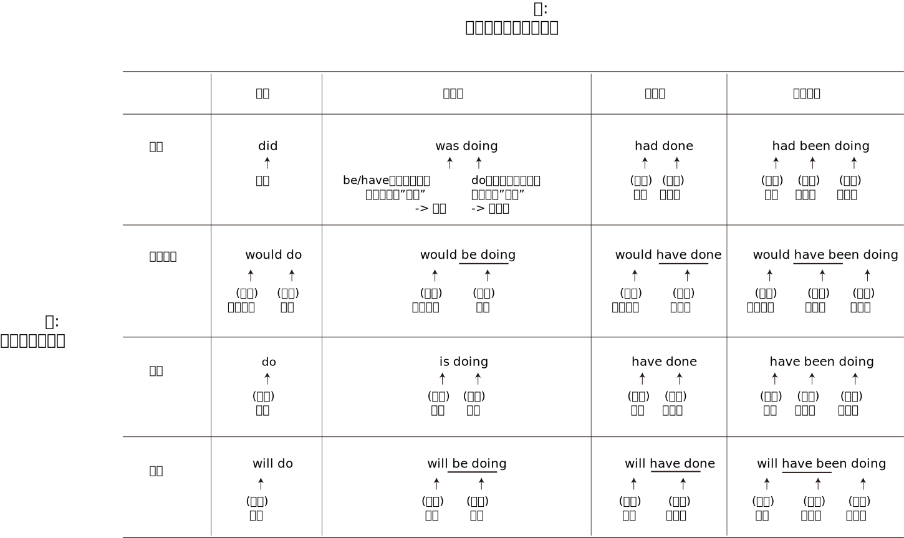
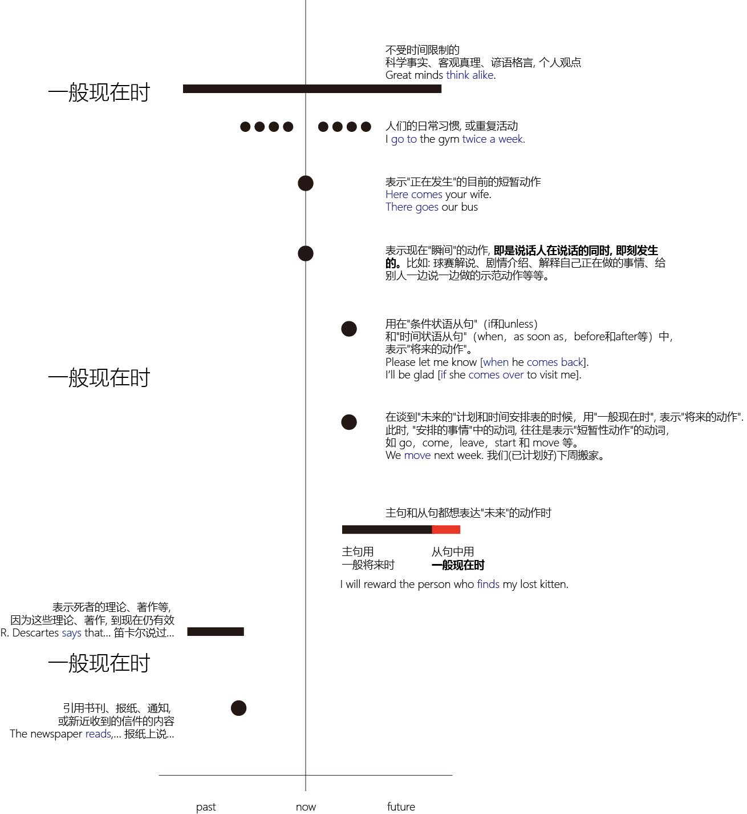
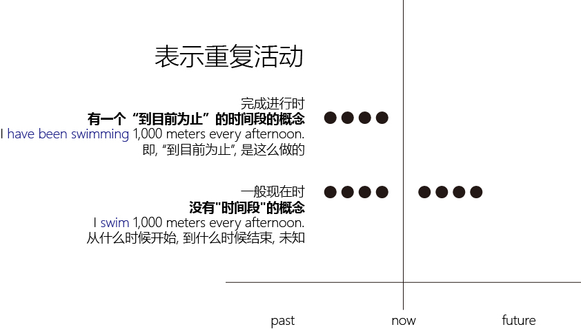

= 时态
:toc:

---

== 英文时态的构成：四时(tense), 四态(aspect)

==== 时tense 与 态aspect 的概念
时态（tense and aspect）其实包含了两个不同的概念:

1. tense（时）, 用来规定 *动作,事物发生的时间*. 即: 这个动作发生的时间，即是在现在、过去, 还是将来发生的?
- 过去时（past）
- 过去将来时（past future）
- 现在时（present）
- 将来时（future）

2. aspect（态）, 用来规定 *动作完成的程度*，反映 *说话者对事物的态度*. +
即: +
-> 这个动作是"完成了的", 还是在"延续的,进行中的"（complete or ongoing）? +
-> 这个动作是"固定不变"的, 还是"动态变化"的（fixed or changing）? +
-> 这个动作持续的时间是"很短", 还是"很长"（lasting for only a moment /or for a long time）? 等等。

---

==== 4时4态结合, 就有16种动词时态

[options="autowidth"]
|===
|组合 |一般 +
(simple) |进行 +
(continuous)|完成 +
(perfect)|完成进行 +
(perfect continuous)

|过去 +
 (past)
|过去一般时 (past simple) +
*- did +
- worked*
|过去进行时 (past continuous) +
*- was doing +
- was/were working*
|过去完成时 (past perfect)+
*- had done +
- had worked*
|过去完成进行时 (past perfect continuous) +
*- had been doing +
- had been working*

|过去将来 +
(past future)
|过去将来一般时 (past future simple) +
*- would do +
- would work*
|过去将来进行时 (past future continuous) +
*- would be doing +
- would be working*
|过去将来完成时 (past future perfect) +
*- would have done +
- would have worked*
|过去将来完成进行时 (past future perfect continuous) +
*- would have been doing +
- would have been working*

|现在 +
(present)
|现在一般时 (present simple) +
*- do +
- work/works*
|现在进行时 (present continuous) +
*- is doing +
- am/is/are working*
|现在完成时 (present perfect) +
*- have done +
- has/have worked*
|现在完成进行时 (present perfect continuous) +
*- have been doing +
- has/have been working*

|将来 +
(future)
|将来一般时 (future simple) +
*- will do +
- will work*
|将来进行时 (future continuous) +
*- will be doing +
- will be working*
|将来完成时 (future perfect) +
*- will have done +
- will have worked*
|将来完成进行时 (future perfect continuous) +
*- will have been doing +
- will have been working*
|===

---

==== 谓语时态公式

这16种动词时态变化，可以用一个非常简单的谓语公式来概括: +
其中的括号“（）”表示它是一个备选项，即可以被省去。 +

[options="autowidth"]
|===
|tense |(modal) |(perfect) |(continuous) |verb

|past or present
|(will)
|(have+ed)
|(be+ing)
|verb

|tense 表示“时”: 现在（present）和过去（past）
|modal 表示谓语中的“情态”，这里以will作为代表。 +
由tense加modal, 就可以构成英语中的另外两种“时”："将来时"（will）和"过去将来时"（would）。
|perfect 表示“完成体”，这里以have＋-ed 来表示。
|continuous 表示“进行体”，这里以be＋-ing 来表示。
|verb 表示英语的谓语动词，它没有用括号，表示谓语动词不是备选项，而是必不可少的。
|===

[options="autowidth"]
|===
| |tense |(modal) |perfect |continuous |verb

|一般时态
|past or present
|(will)
|
|
|√

|进行时态
|past or present
|(will)
|
|√
|√

|完成时态
|past or present
|(will)
|√
|
|√

|完成进行时态
|past or present
|(will)
|√
|√
|√

|===

---

==== 英语中的两类体(aspect) : ① grammatical aspect,  ② lexical aspect

学习时态, 重在深刻地理解“体（aspect）”的内涵。因为同一“体”的动作,有着本质上相通的特点，区别只是说话人的“时间视角”不同罢了。

英语中的两类体(aspect) :

1. 语法体（grammatical aspect）: 即“进行体（continuous）”和“完成体（perfect）”
2. 动词体（lexical aspect）: 这是用来标示动词词义本身所固有的特点（the inherent properties of the verb's meaning）的。 +
英语把动词分为:

- 状态 state
- 动作 action : 又分为: 短暂动作(punctual), 延续动作(durative)

---

== 一般现在时态 the present simple tense

一般现在时态的特点如下:

- 一般现在时态, 并非是表示现在发生的动作。确切地说，一般现在时的本质思维特征是：*表示从过去,到现在,直至将来的一段时间内, 发生的动作（action）或存在的状态（state）。* +
*也就是说，这些动作或状态的发生, 不限于某个特定的时间，它们可发生于任何时间，包括现在、过去和将来，这一段时间到底有多长，我们不知道。它可以是近乎无限长（如表示客观真理），也可以仅是人们生活中的一段时间（如人们的习惯活动）。*

- "一般时态"具有 *完整和不变* 的核心意义，这种体态与"进行体"相对。换言之: +
-> 简单体("一般时态")的核心意义, 是被概念化的整体事件, *这些事件是无法继续发展的*。 +
-> 而"进行体"表示不完整的或未完成的，其相关的事件或状态, 被看作是一个整体的某个部分，往往还有继续发展或变化的余地。

- "一般时态"就好像是一幅静态的画，画作完成之后就不会改变了，没有动态变化的过程。而"进行时态"就相当于一幅“沙画”作品，它是处于动态变化中的。

====
- John *lives* in Beijing. +
 -> 采用的是"一般现在时态"，把“约翰住在北京”这个情况作为一个整体事件来描述，没有任何进一步发展和变化的可能.

- John *is living* in Beijing. +
-> "现在进行时表示"约翰住在北京"这件事, *可能是暂时的，存在发生变化的可能(他过去可能不在北京, 未来也可能会搬离)。* 即, 此时"住在北京"这件事, 只是约翰整个人生过程中的某个片断.
====

因此，一般现在时态, 通常被用于下面的场景中:

1. 用于表达不受时间限制的科学事实、客观真理、谚语格言 (a general truth or fact)
2. 用于表达 概括、结论、立场、观点等
3. 表示习惯活动 (action that occurs regularly or habitually)

====
- We *do not say*... 我们并没有讲一个中国就是中华人民共和国(还包括台湾)。 +
-> (1) 通过"一般现在时态"来强调我们"现在"对台政策的基本立场； +
(2) 给人一种我们对台政策的“一贯性（consistency）”的印象，即不论是在过去、现在还是将来，我们都是一贯坚持...这样的政策。
====

---

==== 1. 表示普遍的事实或真理 (expressing a general truth)

- 表示不受时间限制的科学事实、客观真理、谚语格言
- 用于概括、结论、观点等

这些动作或状态的发生, 不限于某个特定的时间，也即它们可发生于任何时间，包括现在、过去和将来。

====
- Water *consists of* hydrogen and oxygen.
- Great minds *think alike*. 英雄所见略同。
- The opening ceremony of the Olympic Games *includes*... 奥林匹克运动会的开幕仪式包括...  +
-> 这类介绍性的文字，一般都是表示规律性的活动，同样不受时间的限制，故而要用一般现在时。
====

---

==== 2. 表达概括、总结、个人观点

====
- Nothing and no one *can destroy* the Chinese people. They *are* relentless survivors. Their civilization *passes through* phases but its basic characteristics *remain* the same.  +
-> 美国作家赛珍珠: 没有任何东西，也没有任何人能够摧毁中国人。他们顽强地生活在这个地球上，他们的文明经过了各阶段的演变，但仍然保持了原有的基本特征。
====

---

==== 3. 表示人们的日常习惯, 或重复活动 (expressing a regularly occurring event)

表示经常发生的、习惯性的动作（action）, 或者是存在的状态（state）。

- I *go to the gym* twice a week. <- 表示习惯的动作
- I *like* rice for dinner. <- 表示习惯的状态

这一用法, 常和一些表示"动作频率"的"时间副词"连用。

[options="autowidth"]
|===
|频度副词 |

|表示"肯定"的频度副词
|always， +
frequently， +
usually， +
sometimes， +
generally， +
occasionally,  +
often 等等。

|表示"否定"的频度副词
|never,  +
seldom,  +
rarely

|表示频度的"副词短语"
|once a week,  +
twice a year,  +
on alternate days 等
|===

注意: 这些副词一般放在否定助动词前，但always除外.
====
- His wife complains that he *sometimes doesn't listen to* her.
- He *doesn't always leave* before 6 o'clock. Sometimes he works until 7 o'clock.
====

---

==== 3-2 比较: 表示"重复活动"的"一般现在时"和"现在完成进行时"

1. 一般现在时 : 是在泛泛地谈时间，*并没有"时间段"的概念*.
2. 完成进行时 : 表示说话人的脑子里 *会有一个“到目前为止”的时间段的概念*，甚至是给出像for about four years 这样一个明确的时间段。

====
- I *swim* 1,000 meters every afternoon. +
-> *"一般现在时态"无法向我们展示一个明确具体的时间段*, 所以本句其实意味着两点:  +
① 这个习惯存在的起始与结束的时间段, 都是未知的.  +
② 换言之, 昨天以前是swim 1,000 meters，今天也是swim 1,000 meters，明天以后还是swim 1,000 meters.

- I *have been swimming* 1,000 meters every afternoon. +
-> *"完成进行时"是能够表示明确的时间段概念的，这个时间段就是“从过去一直目前为止”。* 所以本句其实意味着 : *到目前为止*，我是每天下午游1,000米, 至于以后会不会变成其它情况, 这都是有可能的.
====

上面的 I *have been swimming* 1,000 meters every afternoon. 这句, 没有明确说出"动作开始"是在什么时候? 只知道"动作结尾"是"目前这个时间点". 其实, 也可以带上"开始"的时间点. 即: 可以加上具体的时间状语(有明确的"起"-"始"时间段), 来表明一项活动在具体多长的时间段内重复。

====
- I *have been winter swimming [for about four years]*.  +
-> 我参加冬泳(到目前为止)大约有四年了。*即, 时间段是 (4年前 -- 目前为止)*. +

- I *have been winter swimming [since 1984]*.  +
-> 我是从1984年开始冬泳的。*即, 时间段是 (1984 -- 目前为止)*.
====

---

==== 4. 表示"正在发生"的动作

在某些特定的场合，我们可以用"一般现在时"表示"正在发生"的动作。哪些特定的场合呢?

1.用在以there或here开头的句子中，表示: *目前的短暂动作*.

====
- *Here comes* your wife. +
-> 这里显然是说话人看到your wife正在走过来，然后说的这句话，即表示 *正在发生的动作*。 +
在这个结构中不能用"现在进行时态"，不能说：*Here is coming* your wife. ×  +
但可以说：Your wife *is coming*. 不过, 此时的进行时, 意思就表示 *"将来的"动作* 了，意思变成了：你妻子很快就要过来了。

- *There goes* our bus; we'll have to wait for the next one. +
-> 显然, 说话人看着自己要搭乘的车 *"正在开走"* +
同样，在这个结构中不能用"现在进行时态"，即不能说成：*There is going* our bus. ×
====

2.用"一般现在时", 表示现在"瞬间"的动作 (instant actions)

*这个"瞬间动作", 是说话人在说话的同时, 即刻发生的*。比如: 球赛解说、剧情介绍、解释自己正在做的事情、给别人一边说一边做的示范动作等等。

====
- Michael *passes to* Clint. Clint *to* Jack, Jack *back to* Clint -- and Clint *shoots* -- and it's a goal! +
-> 这是球赛的解说，表示在"说话时刻,正在发生的动作"。

- The woman *is* a spy, now she *enters* the room, *opens* the drawer, *takes out* a pistol and *slips it into* her pocket. +
-> 这是剧情说明。

- I *select* an album, *remove* the record *from* its cover /and *put* it *on* the turn table. +
-> 这是解释自己正在做的动作。这里是表明“我”想听音乐

- Watch carefully. First I *pick up* the receiver, *dial* the number I want, then *drop the coin into* the slot [as required]. +
-> 这是表示动作示范，说明的动作是教别人怎么打投币电话
====

---

==== 5. 表示"将来发生"的动作

在某些特定的场合，"一般现在时态"有时可表示"将来发生"的动作。哪些特定的场合呢?

1."一般现在时态", 用在"条件状语从句"（if和unless）和"时间状语从句"（when，as soon as，before和after等）中，表示"将来的动作"。

====
- Please let me know [when he *comes back*]. 他回来时请告诉我。 <- 用在时间状从中, "一般现在时"表"将来" +
- I'll be glad [if she *comes over* to visit me].  <- 用在条件状从中, "一般现在时"表"将来" +
====

不过 *若从句的动作,含有“意愿”的意思，则从句中可以用will来表将来。*

====
- [If they *will not accept* a check], we shall have to pay in cash.
====

2.在谈到"未来的"计划和时间安排表的时候，用"一般现在时", 表示"将来的动作". 此时, "安排的事情"中的动词, 往往是表示"短暂性动作"的动词，如 go，come，leave，start 和 move 等。

====
- *We move* next week. 我们(已计划好)下周搬家。 +
- *The train starts* at 2 o'clock. 火车(将会在)两点钟开。
====

3.主句和从句都想表达"未来"的动作时, 主句用"一般将来时", 从句中用"一般现在时".

====
- I will reward the person *who finds my lost kitten*. 我将酬谢(未来)找到我的猫的人。 +
-  I will give the booklet to *whoever asks for it*. 谁(会)来索取这个小册子，我就把它给谁。
====

---

==== 6. 表示"过去发生"的动作

在某些特定的场合，"一般现在时"还可表示"过去发生"的动作。

1.用"一般现在时", 表示死者的理论、著作等, 因为这些理论、著作, 到现在仍有效. +
表示一些名人名言。

====
- R. Descartes *says* that... 笛卡尔说过...
- In The Sociology of Science, now considered a classic, Robert Merton *discusses*... 在《社会科学》这部经典著作里，罗伯特·默顿探讨了...
====

2.用"一般现在时", 来引用书刊、报纸、通知, 或新近收到的信件的内容

====
- The newspaper *reads*,... 报纸上说... +
-> 虽然reads是用的"一般现在时形式的", 但在时间上, 这里的reads显然是表示"过去"的动作，因为显然是说话人看过the newspaper之后才说了这句话。

- The sign on the washing machine *says*, "Out of Order." 洗衣机上有一个告示说：“洗衣机坏了。” +
-> 同样, 这里的"一般现在时形式的"says, 其实是表示"过去"的动作，因为显然是说话人看过the sign之后才说了这句话。

====

---

==== 7. 一般现在时, 代指"现在完成时"

在口语中，可以用"一般现在时"代指"现在完成时"。能这样使用的动词不多，通常有：hear，find，see，learn，tell 和 read 等等。

====
- *I hear (＝have heard)* you're getting married. 我听说你要结婚了。
- *I am (＝have been) informed that* you have been there. 有人告诉我，你到过那里。
- *I see/find (＝have seen/found) that* you have you hair cut. You look terrific! 我发现你理发了。你看上去棒极了！
- *I read (＝have read) in the newspaper that* the criminal who killed eight women has been executed. 我在报纸上看到，杀害八名妇女的那个罪犯已经被处决了。
====

---

