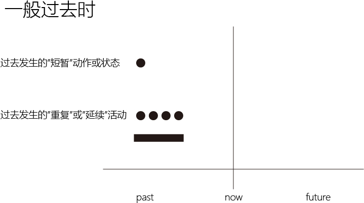
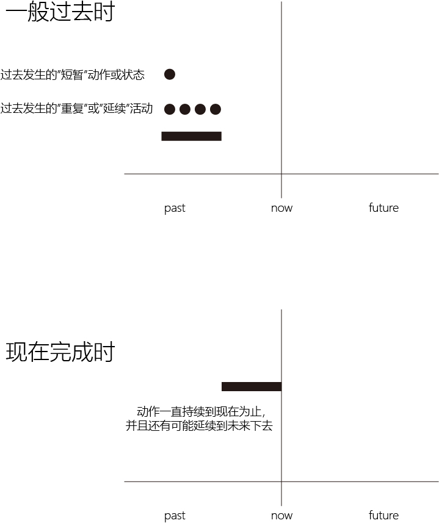

= 时态_一般过去时 (the past simple tense)
:toc:

---

== 时态能表达"言外之意"

*英文与中文的一个重大差异，就是英文通过动词的变形, 来潜含各种言外之意。* -- 这就是英文语言的一大特色 -- 话语标记（language mark）, 英文里的"时态"就是一种最为重要的话语标记。

====
- San Francisco *Was*. 旧金山已成为过去 +
-> 1906年4月的旧金山大地震, was表明了这次地震对旧金山所造成的破坏程度——已将其夷为平地，该城市不复存在了。

- Afghanistan: The Land that *Was*. 阿富汗：逝去的圣土 +
- *Was* $57，Now $38 : 意思是说该商品的原价是57美元，而现价是38美元
====

---

== 1. 表示在"过去某一个特定的时间"中所发生的"动作"或"存在的状态"

"一般过去时", 常表示在 *过去某一个特定的时间中* 所发生的"动作"或"存在的状态"，此时常和表示过去的特定的"时间状语"连用。

这些时间状语有： +
yesterday， +
yesterday evening， +
last night， +
the night before last（前天晚上）， +
last year，last spring（去年春天） +
three days/months/years ago 等。

====
- *I saw him* in the library *yesterday morning*. <- 过去发生的动作
- *I was tired* last night, so I *went to bed early*. <- 表示过去存在的状态
- I *didn't choose* this life; it *chose* me. <- 这里虽然没有明确的过去的时间状语，但根据语境判断，是表示过去发生的事件，所以用了一般过去时态。
====

*注意，这些时间状语之前不需加介词*，比如不能说： +
at last night ×,  +
in last year ×  +
in three years ago × 等。

---

== 2. 表示过去发生的"重复"或"延续"活动

除了上述表示短暂动作之外，一般过去时还可以表示过去的一段时间（a specific period of time in the past）内延续或重复的动作.

====
- *I slept for eight hours* last night. <- 表示过去延续的活动
- She *lived in* our town *for three years*, but now she is living in Beijing. 她在我们这个小镇生活了三年，不过她现在住在北京。 <- 表示过去延续的活动

- *I wrote a letter once a week* to my family when I was in my first college year. <- 表示过去重复发生的活动
- He *used to do* morning exercises. 他过去常常早锻炼。 <- 表示过去重复发生的活动
====

---

== "一般过去时"和"现在完成时"用于“for＋时间段”的区别

1."一般过去时"与“for＋时间段”连用，*表示动作在过去已经结束，并没有延续到现在(当前这个时刻点)*.
====
- - She *lived* in our town *for three years*. +
-> 曾经住过三年,（但现在不在这里） +
一般过去时lived 表示"在过去的某一段时间内"持续的动作，但这一动作现在已经结束，即“她现在不再住在这里”。
====

2."现在完成时"与“for＋时间段”连用，则 *表明动作延续到现在(当前这个时刻点)，并且还有可能延续下去(到未来).*

====
- She *has lived* in our town *for three years*. +
-> 至今(到当前说话的这一刻为止)已住了三年. +
现在完成时 has lived 表示动作一直延续到了现在，即“(到当前这一刻为止), 现在她还住在这里”，而且往往还可能延续下去。
====

又如:

====
- Its final resting place *has remained* a mystery *for 70 years now*.  +
-> 如果铁达尼克号还没有被发现遗址, 的确是要用"现在完成时, 来描述这艘船"至今为止", 已经沉没了70年.

- Its final resting place *remained* a mystery *for more than 70 years*. +
-> 但在沉没地点已被发现后，我们就不能用"现在完成时"了, 要用"一般过去时", 表示"remain"这个动作已经止于过去了, 没有延续到当前这一刻为止.
====

正因为"一般过去时"的事情, 不会延续到"当前这一刻", 而是早在以前就结束了, 所以就可以用它来描述"历史事件", 比如"个人工作履历".

---

== 隐含意思的比较: 一般过去时, 和一般现在时

====
- A: ... Is it a boy or girl? +
B: A girl. She is my daughter. +
A: Oh, please forgive me. *I didn't know* you were her mother. +

-> 对话中的“我不知道你是她母亲”这一句，很多读者的第一反应很可能就是：I *don't know* you are her mother. ×  +
但是从上文故事可知, A说“我不知道”的时候其实他已经知道了，因为B已经告诉他She is my daughter.了，即，他说这句话时的真正意思应该是“*我刚才不知道*”，因此正确的英文应该说成：*I didn't know* you were her mother. √
====

例如
====
- *I forget* the meaning of the word. <- 用一般现在时, 表示我"到目前为止"还是没有想起来这个单词是什么意思? +
- *I forgot* to bring your walkman back. <- 用一般过去时, 表示我现在已经想起来"to bring your walkman back"这件事了, 所以“忘记”已成为过去。
====
“我忘记了做某事”，英文一般都是说成 *I forgot to do...*，因为这一定是当你想起来之后才能说的一句话，“忘记”已成为过去，否则你不可能说出这句话。

此外，“我忘记”还可以说成 *It slipped my mind...*。 +
====
A: Did you pick up my books from Ron's house? +
B: Sorry. *It slipped my mind*.
====

又例:

====
A: *I really thought that* I'd win the match.  我（本来）真的以为... +
B: Oh, well, better luck next time, Henry. +
-> 当我们说"我以为"时, 表明我现在已经是知道我"出错了", *所以这句话其实是在说: “过去我是这样认为的，而现在我已经不这么认为了”，因此英文就要用"一般过去时" I thought... ("当初"(过去)是这么以为的...)*
====

即:

- I think <- 则相当于 I have an opinion（我这么认为），表示自己现在的观点。
- I thought <- 是强调“我刚才这么想”, 但之后(现在)的事实发展, 并非我刚才所想的那样, 现在我已经改变了观点.

====
- At first *I thought* it would be easy to find a job, but the real situation has proved more difficult *than I thought*. 开始我以为找工作很容易，但现实情况比我想的还要难。 +
- *I thought* Sam was sick. <- “我(过去)还以为萨姆生病了呢”，言外之意就是，萨姆现在并没有生病. +
- *I thought* it was you. <- “我刚才就觉得那个人像你。原来真的是你”。

- 萨莉把身边的女友玛丽, 介绍给哈里 It is. Huh... *this is Marie*. 但当萨莉发现玛丽不在自己的身边时，立即改口用一般过去时说道：*Was* Marie. 通过 This is Marie 到 Was Marie 这一时态的细微改变，充分揭示出萨莉的言外之意 -- “*刚才在我身边的* 那位是玛丽”。 由此可见，英语语言对时间的表达是如此精确和微妙！
====

又例:

====
- *It is nice* to meet you. <- 两个陌生人刚刚见面时, 这么说, 用"一般现在时". +
- *It was nice* meeting you. / *It was nice* talking to you. <- 但是，在两人聊天结束后，就要用"过去时态"了. 因为经过聊天后，“认识（meet）”或“聊天（talk）”都已成为刚刚的过去，所以自然要用was而不是is。
====

上面两句告别用语, 可以分别简化成: +

- (It was) Nice meeting you.  <- 注意: 告别时说“认识”, 用的是动名词meeting，而不是不定式to meet。
- Nice talking to you.

又例, 一家人正在找房子:

====
Mr. Dean: And it's not as cheap as the last apartment *we saw*.  +
 -> 过去时saw比较好理解，是表示在"过去"的某个时间“看（saw）”房子。

Mrs. Dean: But that apartment *was dark and dingy*. And it *was* in a dangerous neighborhood. +
->  *为什么这里要用was呢？其实，这里的过去时was是与上一句的saw密切相关的，类似于“时态呼应“的道理。因为上一个公寓是在“过去看（saw）”的，那么有关上一个公寓的一切情况在说话者看来都“停留”在过去了。所以，说话者这里用过去时was来描述一切与之相关的情况.*  +

换句话说，*这里的"过去时态"并不是表示一个今昔对比，...was dark and dingy 并不是要表示该公寓“过去dark and dingy”而现在不是这样了*；同理，...was in a dangerous neighborhood”也并不是表示该公寓“过去不安全”但现在安全了。
====

又例, 如果有人想在你前面插队，你说:

====
- Excuse me. I believe *I __ (be) here first*. Do you mind waiting your turn? +
-> 空格中, 应该用"过去时"：I believe *I was here first*. 千万不要脱口说成 I believe *I am here first*.
====

---

== 3. 在口语中，"一般过去时"（也可用"过去进行时"）可以表示"语气委婉". 此时的"过去时"丝毫没有过去的意味，而谈的是现在的情况。

====
- *I wondered* if you could help me. 我想知道你能否帮我。
- *I was wondering* if you could possibly lend me your car for this evening. 我想知道你今晚能否把车借给我用用。
- *Could you* give me a hand? 你能帮我一下吗？
====

---

