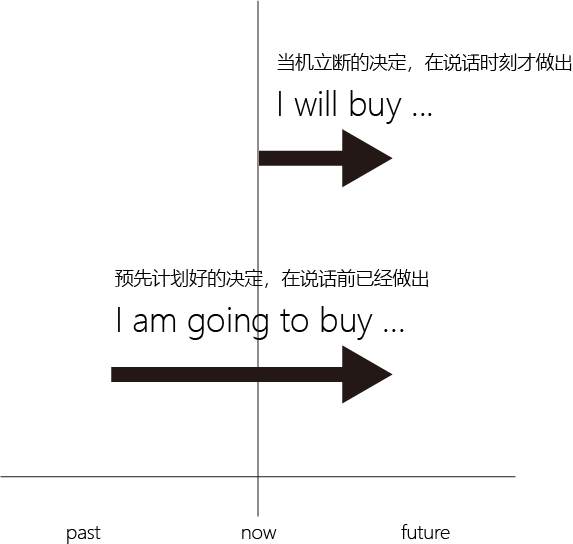

= 时态 : 一般将来时态 the future simple tense
:toc:

---

== 不存在"将来时"这种"时态"

其实严格说来, 英文里是没有“将来时态”的，而只有"过去时态"和"现在时态"这两种时态. 为什么不存在"将来时"? 理由如下:

==== 理由1: 所谓的"将来时", 谓语动词的词干（stem word）根本不会发生任何形式的变化.

从时态形式（tense form）的构成上来看:

- 现在时态（present tense） : 是用动词原形（basic verb form），或遇到单数第三人称主语，谓语动词加-s。
- 过去时态（past tense）: 是动词变为过去式（如加-ed或其他特殊变形）。
- 将来时??? <- 谓语动词的词干（stem word）根本不会发生任何形式的变化. 那么如何表达"将来动作"的这个时间概念呢? 采用的是一些其他方式来达到这一目的的. 比如: +
-> 使用"情态动词" will 和 be going to +
-> 使用"现在进行时"（be doing）表示将来的动作 +
-> 采用"其他的句型结构"，如 be to do 或者 be about to do 等

---

==== 理由2: 未来的事,只是一种"可能性". 其实本质只是"情态动词 will" 的一种运用场景.

从是否成为事实的角度（factual or non-factual）来看:

- 发生在"过去"或"现在"的事情, 都已是确定无疑的，是一个"事实"（fact）。
- 但谈论"将来"要发生的事情，只能是表示一种"可能性"(possibilities). 对于不同程度的"可能性", 我们就用不同的情态动词来表示: +
-> 对于很有把握的预测（prediction）, 用情态动词 will +
-> may (把握中) +
-> might (把握少)

由此可见，典型的一般将来时will do，在本质上只是情态动词will的一种用法而已。*即, 表示将来的事件, 往往是与各种情态意义联系在一起的。* 比如：预测某事将会发生，计划将来做某事，或表示愿意去做某事。

即, 情态动词的三大意义:

1. 预测（prediction）：表示说话人 *认为* 将来会发生某件事；
2. 事先计划（future plan）：表示说话人 *早就在头脑里已经做出决定*, 将来要做某件事；
3. 意愿(当下决定)（willingness）：表示说话人既不是预计某事将会发生，也不是预先经过考虑决定将做某事，而是 *在说话的时刻立即做出决断* 表明他将去做某事。

---

== 01. 表"预测"

==== 有"证据支持"或"事先迹象支持"的预测, 且② 事件发生的时间更近(即在说话后不久就将发生的) -> 用 be going to

- You look very pale. I am sure *you are going to get sick*. <- 我通过"迹象"(You look very pale), 推断出(你要生病了).

- Look at the time. *I'm going to miss my bus*. <- 我通过"证据"(时间很晚了), 推断出(自己要误车了).

- With all of these typos(`=type error 打印错误`) in this resume, *you are not going to make a very good impression*.  <- 我通过"证据"(这份简历上有这么多的打印错误), 推断出(你不会给对方留下好印象).

- Look at those black clouds! *It's going to rain*.

---

==== 只表示说话人的主观态度(或主观猜测)("认为"或"相信"某件事将要发生)，而并没有多少证据的 -> 用 will

- It is not over yet. I think *she will make a come back*. 现在选举还没结束呢，我想她最终会反败为胜的。 <- 说话人的主观猜测。
- *Will* China *be* Number One? 中国会成为全球霸主吗？

---

==== 强调必须要有前提条件(或特定时间段), “在某种条件下, 某事才会发生”的情况. 所以也② 并非眼前即将发生的事(其实是时间"可近可远") -> 用 will

- *If* the crop fails, there *will be* a famine.
- You'*ll feel* better *when* you take this medicine.

- *If* you go to Troy, glory *will be* yours. They *will write stories about* your victories in thousands of years! 如果你去特洛伊，荣耀将会属于你。在其后的几千年里，他们都将书写你的故事！而且整个世界都会记得你的名字。 +
-> 在上文中，都是用的 will 来“预测”很久以后才发生的事，而非眼前即将发生的事。而且这些含有will的句子，归属于三个条件状语从句：If you stay in Larissa, you will find peace... If you go to Troy, glory will be yours... But if you go to Troy, you will never come back…所以阿喀里斯的妈妈此时是不会说 you are going to... × 的。

---

==== be going to 隐含着预言者拥有"证据", will 隐含着预言者所"预测"的事件要有发生前提条件. 即使这些"证据"或"前提条件"没有显式给出.

- I'*m going to* be sick. <- 证据隐含, 相当于说：I'*m going to* be sick （*because* I feel terrible now）
- I *will* be sick. <- 条件隐含. 相当于说：I *will* be sick (*if* I eat any more of this ice cream). will的预测,是附带在另一条件(if)之上的。

- The bridge *is going to* collapse. 这座桥就要塌了。 +
-> ① 隐含着说话人已经有证据了(比如看见桥面上有多处裂纹), ② 所预测的事的发生就近在眼前了.
- The bridge *will* collapse. 这座桥会塌的。 +
 -> 说话人意指将来的某一天(离现在比较远的时间), 或在某种条件下(发生的时间"可近可远"), 这座桥会坍塌的. 比如: The bridge will collapse [in an earthquake].

---

==== 表预测, be going to 在口气上更显私人化(口语化); 而 will 更正式(官方,距离远, 书面化)

be going to 更为不正式，常用于私人谈话中, 且常发音成 be gonna。

比如两个朋友在餐馆里吃饭点菜，一个会对另一个说：*I'm gonna* have the chicken.  +
但一会侍者过来为他们点菜时，这个人可能会对侍者改口说道：*I'll* have the chicken. 这样以保持一定程度的正式性。

---

== 02. 表"事先计划"(早就有此想法和打算了)

==== 说话人预谋已久的打算和计划(a plan) -> 要用 be going to. (因为 be going to 不能像 will 那样表示"迅速的、当机立断的"决定)

be going to 常表示“计划或打算（a plan）”。此时，说话人在头脑里已经做出决定将来要做某件事，并且往往还含有已经为这一行动做了某些准备的意思。

- Close your eyes. *I'm going to give you a surprise*.
- Do you mind if I turn the TV off? *I am going to make a long distance call*, and it's hard to hear if the TV is on.

---

==== 预谋已久的打算,进一步升级,就是"个人决心" (great determination) -> 因此 be going to 同样可以表示“决心”，具有强烈的个人感情色彩.

- *We're going to become* the world's leading forwarding (最后包封面之前的)各项装订工序 company.
- You'*re gonna* be sorry! <- 这里的 gonna 是 going to 的口语表达形式。这里用 be going to 正是表明这个被欺负的小男孩要报复对方的决心。

- Mr. Hillcock: *I'm going to show you something*(`= 这里be going to 是表达医生"早就拥有的打算”，是医生打算给阿甘妈妈看阿甘的智商检测报告`), ... *He's going to have to go to a special school*(`= 这里be going to 是表示“说话人拥有证据后的预测”`).
- Mrs. Gump: What does normal mean, anyway? He *might* be a bit on the slow side(`=她用might这种非常不肯定的情态动词,而不是用may（很可能是）`), but my boy, Forrest, *is going to get the same opportunities as everyone else*(`= 这里be goint to 表示“决心”，表明阿甘妈妈决心要让阿甘接受正式的教育`). *He's not going to(`=表“阿甘妈妈的决心”`) some special school* to learn how to retread tires.

---

== 03. 表"当下立刻做出的决定, 或当下意愿"(而非预谋已久的) -> 用 will

所谓“意愿”，简言之，就是“当机立断（spontaneous decision）”，而不是事先计划好的（unplanned）。 +
具体来说，说话人事先并不知道，而是在得知新的信息之后，在说话的时刻立即做出决断表明他将去做某事，这是一个当机立断的决定。此时，我们只能用will来表达。

- A: I can't go out there again. I *am going to* make my team lose if I keep playing.  <- 这里的be going to 显然是表示“说话人拥有证据的预测”，而不是“说话人自己的计划”，不是说“我早已计划好故意让我们队输掉比赛”。 +
B: 对A进行鼓励...
A: OK, I'*ll* give it one more shot(`= 这里will表示“意愿”，是说话人一个当机立断的决定`), but I'm not sure how good it *will* be(`=这里的will表示“没有证据的主观预测”`).

- A: The telephone is ringing. +
B: I'*ll* get it. <- 表"当机立断的决定". 若B回答说That'll be for me. 则他是在“预测”。 +
-> 所以，不能说 I'm going to get it. × 这就变成了你“预测”到有人要打电话进来而早早地等在电话机旁“打算”接这个电话.

- Husband: There isn't any milk left in the fridge. +
Wife: *I'll buy some* after work. <- 用will，表明这是当机立断的决定，意指她丈夫先发现没有牛奶，告诉她之后，她才决定去买牛奶。 +
若 Wife: *I'm going to buy some* after work. <- 用am going to，表明这是预先计划好的决定。意指她先发现没有牛奶，并已经决定去买牛奶，然后她丈夫才发现。

---

==== Will you? -> 表示"提出请求"

will这种表示“(当下)意愿”的意义，若用于第二人称（you）的一般疑问句（Will you?）中，则可以用来提出“请求”.

- *Will you* help me to mail these letters?
- *Will you* be my girlfriend?

---

==== 否定形式的 won't 在句中会有歧义, 具体如何理解，得看具体的说话语境

- *Paul won't come*, because he is too busy.  +
-> will 表 *说话人自己的“推测”*. 否定词not是重点否定主要的谓语动词come，相当于 predict *NOT to come*.

- *Paul won't come*, because he doesn't want to.  +
 -> will 表 *Paul自己的“意愿”*. 否定词 not 是重点否定情态动词 will，相当于 *NOT willing* to come.

虽然否定形式的won't在句中会有歧义。不过，一般来讲， +
-> 否定的""预测, 我们用 won't be doing (未来不会...) +
-> 否定的"个人意愿", 我们用 won't do (不愿意, 等同于 refuse to do)

---

==== 否定形式的 won't, 若用“物”作句子主语, 往往表示"说话人是在抱怨"

- *The closet door won't open*. Will you try it?
- *My car won't start*. Will you give me a ride?

---

== 04. be going to 和 will 的总结

==== be going to ① 用于"有证据的预测"时, 由于可以预测"事物", 所以句子的主语可以不是"人"; ② be going to 用于“早已有的计划打算”时, 由于只有人才会来做“计划打算”，所以，此时句子的主语必须是人称.

==== will ① 用于"无根据的预测"时, 由于可以预测"事物", 所以句子的主语可以不是"人"; ② will 用于"当下立刻做出的决断"时, 用于做决断的只能是人, 所以句子主语通常就是"人".

---

== 05. 现在进行时(be doing) -> 也能表示对"最近的将来"做出"计划或安排" (definite future plans)

- *We are meeting the supplier* on Tuesday. 我们周二要见那个供货商。
- *What are you giving your baby brother* for Christmas this year? 今年圣诞节你打算要送给你哥哥什么礼物？

这种用"现在进行时"表示"将来"的动作, 要注意以下几点：

---

==== 注意点1: 必须带有表示将来的"时间状语"

用"现在进行时"表示将来的动作，*动作发生的时间必须指出, 或在前文中已经指出*，否则就可能会造成现在"进行动作"与"一般将来动作"相混淆。

- A: What are you doing *next Sunday*? +
B: *I'm not going out*. I'm staying at home. +
-> B的回答中虽然没有出现具体的将来时间，但因为将来时间next Sunday在上文中已给出，所以B中的"现在进行时态"是表示"将来"。

---

==== 注意点2: 通常是表示说话人"已计划安排好的"活动

"现在进行时"表"将来"的这种用法，通常是 *表示说话人"已计划安排好的活动"*，如果不是，则不能这样用。例如不能说：

- *It's raining* tomorrow. × +
-> 因为像 rain，snow 或 storm 等这样的活动, 是人们无法事先计划好的。

---

== 06. 表"计划", 用"现在进行时(be doing)" vs "一般现在时" 的区别

==== 区别1: 现在进行时, 个人主观色彩更浓;  一般现在时, 更抽离个人情感些, 更"客观正式"些.

- *I am leaving* tonight. 我想好了今晚走。 +
-> *"进行时态"表达的个人主观色彩要浓些，一般含有“我自己决定今晚走”的意味。*
- *I leave* tonight. 我今晚需要动身走。 +
-> *"一般时态"更加客观(抽离个人情感)*，比如可能是“公司安排了我出差，给我安排的是今晚动身”。

所以说 *Our shop opens* next week. 比 *Our shop is opening* next week. 要好，显得更正式(更不带个人情感色彩)

---

==== 区别2: 对一系列预定的将来的安排, 推荐用"一般时态".

如果是一系列预定的将来的安排，比如旅游行程安排，用"进行时态"显得较累赘，而用"一般时态"则较简洁。

- *We leave Beijing* at 9:00 tomorrow morning, *arrive in Kunming* around 12:00 and then *we tour the World Horti-Expo Garden*.  +
我们明天上午9点离开北京，大约12点左右抵达昆明，然后就参观世博园。

---

== 07. 表计划, 用 "be going to" vs "进行时态(be doing)" 的区别

==== be doing 的未来计划, 更板上钉钉;  而 be going to 的计划, 确定性稍差一些.

总的来说，be doing 表达的将来计划, 要比be going to 的计划更确定（more definite）。

- *I'm taking my holiday* in April. 我四月份(已敲定)要休假了 (无论相关他人同不同意). +
-> 进行时态 be doing 给人的感觉是事情马上就要发生了，因而应该是确定无疑的.

- *I'm going to take my holiday* in April. 我打算四月份休假。 +
-> be going to 因为有表示“有证据的将来预测”的意味，这就给它带来了不确定性。不过这依然要比 hope to do 和 would like to do 要更为确定些.

---

== 08. 其他表"将来"的句型 -> be to do

(1) 表示已安排好要在将来发生的事，是比较正式的用法

- *They are to go on a strike* on July 8th. 他们定于7月8日举行罢工。
- *The Premier is to visit Australia* next month. 总理将在下个月对澳大利亚进行访问。

(2) 表示强烈的命令，相当于must，should，如：父母对孩子、上级对下级或法律条文中的规定等 +

- These tablets *are not to be taken orally*. 该药禁止口服。
- The parties involved *are to sign the agreement*. 有关当事人一定得签署协议。

---

== 09. 其他表"将来"的句型 -> be about to do

be about to do 这一结构用来表示"即将发生"的动作（比如通常在5分钟之内就会发生），意思是“正要，马上就要”。

- The train *is about to leave*. 火车马上就要开了。
- Sally has her hand on the doorknob. She *is about to open the door*. 萨莉握住门把手，正要开门。

---

== 10. 其他表"将来"的句型 -> be on the point/verge濒于;接近于;行将/brink（峭壁的）边缘/eve前夜;前夕 of doing

be on the point/verge/brink/eve of doing 这一结构与 be about to do 的意思差不多，但 *其动作发生的时间, 比 be about to do 还要快一些。*

- *He was on the point of killing himself* when she stepped into his room. 她走进房间时，看见他正要自杀。
- *The child was on the verge of laughing*, but he held back. 这孩子差一点笑出声来，但还是忍住了。 +
-> *on/to the verge of sth/of doing sth* : *very near to the moment when sb does sth or sth happens* 濒于；接近于；行将

---

