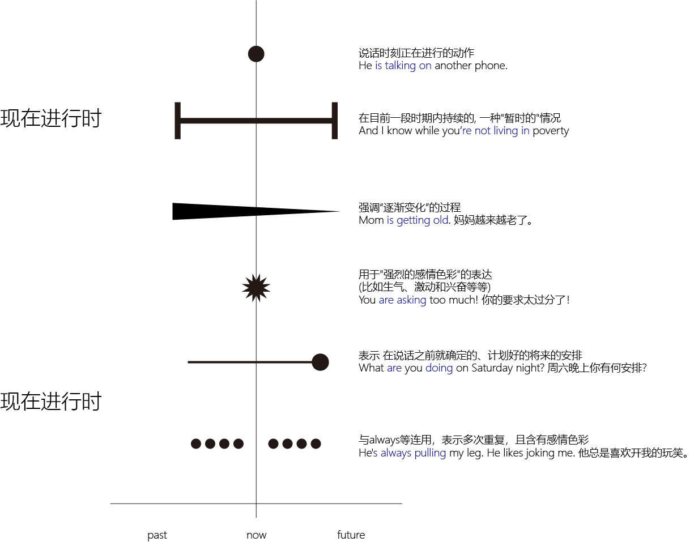

= 现在进行时
:toc:

---

== 进行时态 continuous tense

进行时态（continuous tense）的构成是 be＋doing。

有三种不同时间下的进行时态: +
-> I am doing <- 现在进行时（the present continuous tense）  +
-> I was doing <- 过去进行时（the past continuous tense） +
-> will be doing <- 将来进行时（the future continuous tense）: *将来进行时 will be doing 没有人称和数的变化*。

这里的助动词be的具体变形，既反映了时间（如动作是发生在现在、过去还是将来），同时也反映了主语人称和数的变化，但表示进行动作的doing始终不变.

"进行时"是强调在某个特定的（现在、过去或将来）时间点，某项活动正在发生。因此，*"进行时态"往往和某一"特定的时间点"连用*，来表示某一个活动在该时刻正在进行，比如 right now 和 7:15 等。这个特定的时刻可以是直接给出具体的时间，也可以是另一具体的活动。

- I *will be watching* CCTV news *at this time tomorrow evening*. <- 直接给出具体的时间
- I *was watching* CCTV news *when he arrived*. <- 通过另一活动(比如时间状语从句)来表达这一特定时刻

但英文的"进行时态" be doing 表达的意义, 远不止于“正在发生的活动”这一个意思. 它有更多其他的意义和用法。

进行时态因为往往强调在说话的时刻某活动正在发生，所以 *常用进行时态表达生动、具体的场景。而"进行时态"因为其"表现生动"，所以在口语中出现的频率, 远远高于书面语。*

---

== 使用场景1: 说话时刻正在进行的动作（action happening exactly now）

"现在进行时态"是英文中使用较多的一个时态，尤其是在"口语中"频繁出现.

- A: *What* program *are you watching*? +
B: *I am watching* Friends 老友记.

- A: May I speak to Clint? +
B: No, sorry. He is not available now. *He is talking* on another phone.

---

== 使用场景2: 在目前一段时期内持续的, 一种"暂时的"情况（action happening around now）, 也含有一种“今昔对比”之意

表示现阶段正在持续的活动。*这时"进行时态"表示的是一个一般性的活动，在说话时刻这个动作并不一定正在发生（通常都不在发生），而是在目前一段时期内持续的一种暂时的情况.*

- Jenny: Yes. And I know *while you're not living in poverty*, a college student still can't afford an apartment by the train station. +
(租房)当然贵啦。我知道，即使你现在的生活还算可以，但是一个学生要想租地铁附近的公寓，那负担还是比较重的。 +
-> 这里的进行动作 are living 并不是强调在说话的时刻正在做什么，而是表示目前短暂的居住情况。

- Florence *is putting away half her pay* each month. Soon, she'll be able to buy a new car. +
弗洛伦斯现在每月把一半的薪水存起来。我想不久她就能买辆新车了。 +
-> 这里的 putting away 显然是表示一个现阶段在持续的一般活动。

- Long hair is really in right now. So *I'm letting my hair grow*. +
长发现在很时髦，所以我要让头发长长。 +
-> 这里的 letting 显然是表示一个现阶段在持续的活动。注意此句中的 in 表示“流行，时髦”的意思。

因为"进行时态"的这种用法, 表示目前的一种短暂的情况，所以 *它有时含有一种“今昔对比”之意。*

- *I am taking the bus to work this week*, because my car is in the garage. +
这个星期我都是坐公共汽车上班，因为我的车正在维修厂修理。 +
-> 这里的 am taking the bus to work 表示“坐公共汽车上班”是暂时的，只是在这个星期内的短暂活动，并且与过去“开车上班”形成了一个今昔对比。

以上这些句子中的进行时态, 都是表示"现阶段在延续"的一般活动，而不是正在发生的活动。*但它们也并不是恒久的或是规律性的活动（not permanent or habitual），否则就要用"一般现在时态"了。*

---

== 使用场景3: 用于表示“改变”的动词，强调“逐渐变化”的过程(数量从少变多, 程度从轻变重等)

这种表示 action happening around now 的进行时态的用法，若是用于表示“改变”的动词，则强调“逐渐变化”的过程。常见的表示“改变”的动词有：change, come, get, become, grow和deteriorate（恶化）等。

- Frank: Well, this neighborhood *is really booming*. It's not really a suburb any more. +
Jenny: Yeah, *it is getting crowded*. +
弗兰克：这附近真是越来越繁荣，已不再是郊区了。 珍妮：是呀，也变得越来越拥挤了。 +
-> 这里的booming和getting用于进行时态, 显然都是表示“逐渐改变”的意思，所以分别译成“越来越繁荣”和“越来越（拥挤）”。

- Mom *is getting old*. 妈妈越来越老了。
- His health *is deteriorating*. 他的健康状况日益恶化。
- Clint *is getting bored at work*. 克林特对工作越来越感到乏味
- My dream *is coming true*. 我的梦想正一点点地成为现实。
- *It's getting dark*. 天渐渐黑了下来。

---

== 使用场景4: 用于"强烈的感情色彩"的表达(比如生气、激动和兴奋等等), 口语中很常见

我们往往会在说话的过程中频繁地使用"现在进行时", 来表达自己的各种强烈的感情，比如生气、激动和兴奋等等. 此时说话人用"进行时态"，并非是要强调某个正在进行的动作，而是要表达自己强烈的情感。

- *You are asking too much*! 你的要求太过分了！
- *Why are you getting so upset* just because I'm two minutes late? *You're making this into a bigger deal* than it is. 你干吗要生这么大的气？我只不过是迟到了两分钟而已。你可真是小题大做！
- *I'm not having this conversation with you*. 我不跟你说了。 <- 表示生气的情绪
- *What are we waiting for then*? Let's get started. 那我们还等什么？赶快开始吧。 <- 这里用进行时表示自己的不耐烦。+
- *You're not backing out of our date*, are you? 你该不是不想和我约会吧？ <- 用进行时态表示说话人的怀疑和惊讶
- *The bank is only paying me 3 percent interest* on my money. 这银行才付给我3％的利息！ <- 这里显然不是要强调说明银行“正在付给我利息”, 而是用进行时态表示说话人的愤怒

---

== 使用场景5: 表示将来的会发生的, 早已确定好的安排

现在进行时在口语中还经常用来表示"将来的动作"（action in the future），此时现在进行时是表示 *在说话之前就确定的、计划好的将来的安排*（a firm plan or program before speaking. The decision and plan were made before speaking.）

-  *What are you doing for* New Year's Eve? *Are you going to* the Tyler's party? 你除夕夜有什么活动吗？你要去参加泰勒的晚会吗？ +
-> 这里"进行时态" are doing 不表示正在进行的动作，而是表示 *一个确定的、计划好的将来的活动*，意思是“你除夕夜有何节目？有什么活动？” 接下来的Are you going...这个"进行时"同样表示"将来的动作".

- Is he seeing anyone? 他最近在和谁约会交往吗？
- You're getting married? 你要结婚了？

需要说明的是，在我们用"现在进行时态", 来谈"将来确定的安排"的时候，如果没有明确的上下文语境来表明"将来时间"的话，我们往往需要加上"明确的表示将来时间的状语"，如tomorrow, next year, in June和at Christmas等，以避免与"正在进行"的动作混淆。

- *We're eating* in a restaurant. 这句话往往会被理解成正在发生的动作——“我们现在正在餐馆吃饭”。
- *We're eating* in a restaurant *tonight*. We've already booked the table. 我们今晚要在餐馆吃饭，我们已经订了位置。 <- 表示预定好的将来的动作.
- *What are you doing on Saturday night*? 周六晚上你有何安排？

---

==== be doing 和 be going to do 都可以表示"将来的计划"，它们有何区别呢？

区别1: +
-> be doing (已计划好) : 现在进行时, *强调事先已经做好的安排，是比较确定要发生的*； +
-> be going to (打算) : *着重表现说话者的计划和意图，并不是确定的安排。*

- Frank and Jenny *are getting married*? 弗兰克和珍妮要结婚了？ <- *这里的进行时态 are getting married 表明结婚日期已确定。*
- Frank and Jenny *are going to get married*. 则表示他们两人打算结婚，*并没有确定将来具体的日期*。

又例:

- I'm staying at Beijing. 我会待在北京。
- I'm going to stay at Beijing. 我打算待在北京。

区别2: +
对于无生命的主语，表将来, 只能用 be going to (表示预测), 不能用"现在进行时"来表示将来.

- *The red car is going to* belong to me tomorrow. 明天这辆红色的汽车就将属于我了。 <- 表示预测
- We *are going to* win the tennis match next weekend. <- *因为能否赢得比赛, 事先无法确定。所以我们用 be going to 来表示一个预测*. 另外, *这句话还可以解释成：be going to 表达一个“决心”*. 即: 我们下周一定要赢得那场网球比赛。

---

== 使用场景6: 与always等连用，表示多次重复，且含有感情色彩

"现在进行时"的感情色彩的表达，还有另外一种用法，就是常与always, forever, continually和constantly等连用，表示多次重复的行为。

这种反复的行为可以是积极的、让人喜欢的事情。

- He *is always learning things* from his students. 他总是愿意向他的学生学习。

但也往往表示让说话者厌烦、感觉不合情理或使人不愉快的事，即通常具有负面的、消极的含义。

- He'*s always pulling my leg*. He likes joking me. 他总是喜欢开我的玩笑。
- How come *Joe is always groaning about things*? 乔为什么老是在抱怨啊？

---

