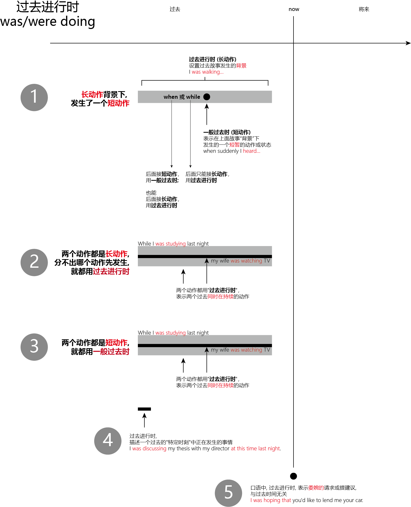

= 过去进行时 was/were doing
:toc:

---

过去进行时 the past continuous tense -- 回顾过去讲故事

---

== 1. 讲述故事时, 故事的背景长动作, 用"过去进行时态"; 前景主题短动作, 用"一般过去时"

文学作品中, 在讲故事时，我们往往会用到"过去进行时态" was/were doing *来设置故事发生的过去背景*（We often use the past continuous tense to "set the scene" in stories.） +
*这是因为"进行时态"往往表示一个在持续的活动场景，所以用它来铺垫故事的背景，往往会给读者一种身临其境的感觉。*

- It *was getting darker*. The rain *was beating* on the windows. The wind *was rising*. Suddenly, there was a knock on the door...  +
天正慢慢地黑下来，大雨拍打着窗子，外面开始起风了。突然，传来了敲门声… +
-> 上文中就是用了一系列 *"过去进行时"*（was getting, was beating, was rising, was burning, was sleeping, was playing 和 was singing）, *来进行故事背景的铺垫. 这一切都是为了烘托出某种氛围.*

*在日常生活的叙事中，我们更多的是把“过去进行时”和“一般过去时”配合使用*（past continuous tense ＋ simple past tense）。此时，

|===
|Header 1 |Header 2

|过去进行时 (表背景, 长动作)
|表示一个"历时较长的"体现“背景”的动作或状态*.

|一般过去时 (表前景主题, 短动作)
|表示在长动作“背景”下, 发生的一个"短暂的"动作或状态。
|===

*这两个动作之间, 用when 或 while连接.*

- I *was walking along the street late* last night *when* suddenly I *heard* footsteps behind me. Somebody *was following me*. I was frightened and I started to run.  +
昨晚很晚我一个人走在大街上，突然我听见身后有脚步声，有人正跟着我。我当时害怕极了，就开始跑了起来。 +
-> 这句中的walk表示“一直在走”，显然是长动作，所以要用"过去进行时"；hear表示“听到了”，显然是短动作，所以用了"一般过去时"。这里表示在was walking这个持续动作的背景下, 发生了短暂动作heard。

- A married man *was visiting* his "girlfriend" when she *requested* that he shave his beard.  +
一个已婚男人去拜访他的“女朋友”时，女朋友要求他刮去胡须。
- That night James *crawled into bed* with his wife while she *was sleeping*. 夜里，在妻子熟睡时，詹姆斯爬上了床。 +
-> visiting 和 sleeping 是较长的活动，用了"过去进行时态"；而requested 和 crawled 是较短的动作，所以用了"一般过去时"。

注意，这里所说的动作的长与短, 是相对的（Notice that the long action and short action are relative.）。

- I *was watching TV* when the telephone *rang*. <- 在这个句子里，“看电视（watching TV）”可能持续几个小时，而“电话铃响”可能就持续几秒钟（a few seconds）。
- I *was walking past* the car when it *exploded*. 汽车爆炸时我正好刚走过。 <- 在这里，walking past the car 可能只持续了几秒钟（a few seconds），而 exploded 则更短，可能也就几毫秒（a few milliseconds）。

- I *was cooking dinner* last night when I *cut* my finger. 我昨晚做晚饭的时候，不小心把手指给切了。
- I *was telephoning Harry* when she *arrived*. 她回来时，我正在给哈里打电话。

比较：

- I *was telephoning Harry* when she *arrived*. 她到的时候我正在给哈里打电话。 <- telephone是一个延续动作，arrive是短暂动作。用进行时telephoning是表明在“我”打电话的过程中，她到了，即先telephone，后arrive。
- I *telephoned* Harry when she *arrived*. 她到了之后，我再给哈里打电话。 <- telephone和arrive都用一般过去时，都变成了短暂动作。此时，是表明“我”打电话是发生在她回来之后，即先arrive，后telephone。

---

==== when 和 while 的区别

我们看到，"过去进行时"与"一般过去时"的这种搭配使用, 主要由when 或 while连接，但两者有以下区别： +

|===
|连接词 |后面能接

|*when* +
-> when＋short action, simple past tense +
-> when + long action, past continuous tense
|-> *后面接"短动作"时，用"一般过去时"* +
- I was walking past the car *when* it *exploded*. <- exploded是一个短暂动词，不能和while搭配。 +

-> *后面接"长动作"时，用"过去进行时"* +
- The car exploded *when* I *was walking past it*.

|*while* +
-> while + long action, past continuous tense
|-> *后面只能接"长动作"，用"过去进行时"* +
- The car exploded *while* I *was walking past it*.
|===

---

== 2. 句中的两个动作都是"长动作"：就都用"过去进行时", 表示它们"同时在持续", 而不分发生的先后.

若句中的两个动作都是较长的动作，则两个动作都用"过去进行时"，表示两个过去"同时在持续"的动作*（We can use the past continuous to describe TWO actions that were BOTH continuing at the same time in the past.）。*此时我们分不出哪个动作先发生。*

- While I *was studying* in my dorm, my roommates *were talking loudly with their friends*. 我在宿舍里学习的时候，我的室友在大声地和他的朋友说话。
- While I *was studying* last night, my wife *was watching TV*. 我昨晚学习的时候，我的妻子在看电视。

---

== 3. 句中两个动作都是"短动作"：就都用"一般过去时".

比较:

- I *was telephoning* Harry *when* she *arrived*. 她到的时候我正在给哈里打电话。 +
-> telephone是一个延续动作，arrive是短暂动作。用进行时telephoning是表明在“我”打电话的过程中，她到了，即先telephone，后arrive。

- I *telephoned* Harry *when* she *arrived*. 她到了之后，我再给哈里打电话。 +
-> telephone和arrive都用一般过去时，都变成了短暂动作。此时，是表明“我”打电话是发生在她回来之后，即先arrive，后telephone。

总结:

1. 句中有一个"长动作", 和一个"短动作"：长动作用"过去进行时"，短动作用"一般过去时"； +
2. 句中两个动作, 都是"长动作"：都用"过去进行时"； +
3. 句中两个动作, 都是"短动作"：都用"一般过去时"。

---

== 4. 描述一个过去的"特定时刻"中正在发生的事情

"过去进行时"还可以用来描述一个 *在过去的特定时刻正在发生的事情*，这是各种进行时的典型用法。

- I *was discussing my thesis with my director* at this time last night. 我昨晚的这个时候正在和我的导师讨论我的论文。 <- 特定时刻
- Can I see your license and registration, please? You *were speeding*. 我能看一下你的驾照和行驶证吗？你刚才超速了。 <- "过去进行时态"显然都是表示“刚刚过去的时刻正在发生的活动”。比如警察说You were speeding. 就是表示“你刚才超速了”。

---

== 5. 在口语中：表示委婉的请求或提建议, 和过去时间毫无关系

*在口语表达中，我们还常常用"过去进行时"来表示委婉的请求或提建议，这时并不表示过去时间的动作。* 这尤其适用于表示态度的动词，如wonder，hope和think等，*这些动词用"过去进行时"（was wondering）或"现在进行时"（is wondering），均表示现在的一种愿望或态度，给人一种探询式的、犹豫不决的印象，因而显得很礼貌。*

- Excuse me, Prof. Davidson. But *I was hoping to talk to you about* my class project for economics. 戴维森教授，打扰您一下，我希望能和您讨论一下我经济学课上的作业。
- *I was wondering* if you could lend me your car. 我希望你能把车借给我。
- *I was hoping that* you'd like to lend me your car.
- *I was thinking that* you'd like to lend me your car.

若说：

- *I hope* to borrow your car.
- *I wonder* if you can lend me your car. +
则由于比较直截了当地表达了自己的态度，因而显得欠礼貌。

---

