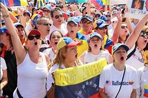

= eco 2020-5-23
:toc:

---

== To hell with experts

(eco 2020-5-23 / United States / The Centres for Disease Control and Prevention: Handcuffing an institution )

How the world’s premier(a.) public-health agency *was handcuffed*

The CDC *has been absent with leave* during the spread of covid-19

May 23rd 2020 |

IN 2014 TOM FRIEDEN, the head of the Centres for Disease Control and Prevention (CDC), *appeared almost daily* to brief(v.) the public *about* the Ebola virus, the last pandemic *to hit* the United States before the coronavirus. His agency *formulated policy* for *dealing with* Ebola, and also *embodied* it. The CDC *trained* 6,500 people in America and 25,000 in West Africa *to look after* victims. `主` The vaccine that *finally treated* the disease `谓` *was tested* in a CDC laboratory. The end of the outbreak *confirmed* the agency *as* the world’s leading public-health body.

*Contrast*(v.) that *with* what has happened during the coronavirus outbreak. On May 17th a senior White House official, the director of trade policy, *said* the CDC “*really let* the country *down*”. The administration *gutted* CDC guidelines *telling* restaurants, child-care centres and others *how to reopen*, *reducing* them *from* more than 50 pages *to* six. The CDC *has been muzzled*, says Jeremy Konyndyk of the Centre for Global Development, a think-tank. It *has held* no public briefings since mid-March. Meanwhile, `主` the first testing kits that the World Health Organisation *is distributing* `谓` *came from* Germany.

What *used to be* America’s most prestigious(a.) public-health body *has been relegated to* one voice among many in the clamour of the White House. The result *is* to squander(v.) expertise, *compound* confusion about who, if anyone, *is in charge of* the federal response to the virus and *make* the reopening of the country *riskier* than it need be.

America *is slowly passing* its peak of infection. As it does so, Donald Trump *is signalling that* governors *should take the lead* in reopening states. In public-health terms, however, states *play(v.) only a secondary role*; state and city public-health departments *mostly do* routine things *such as* providing vaccines for children and hygiene certificates(n.) for restaurants. *Combating* an emergency, by *running* laboratories or *conducting* epidemiological research, *is financed* by the federal government; 55% of state and local public-health spending *comes from* federal sources. In public health, therefore, the CDC *is* by far the most important agency and state health departments *depend upon* it. Some *are seeing* sharp falls(n.) *in* the number of people *testing positive* for the virus, including New York and New Jersey. They *may be* in relatively good shape. But in parts of the South and Midwest, the number of new cases or hospitalisations *is rising*. Here, the diminishing of the CDC *may imperil*(v.) recovery.

How was the agency *brought* so low? On February 5th, the CDC *sent to* state laboratories a testing kit for covid-19 that it *had been working on* at headquarters. *Something was wrong with* one of the reagents /and state labs *could not get* the test *to work*. The Food and Drug Administration (FDA), which *regulates* medical devices, including tests, then *dithered* for three weeks before *allowing* private and university laboratories *to work on the problem*, which they *soon fixed*. But when tests *did become* available, the CDC *restricted* them *to* a handful of Americans. By the time the rules *were relaxed*, the CDC *had missed* the vital first stages of the epidemic; community transmission *was* rife(a.).

The agency *was* at fault. But so *were* others: the FDA and the head of the Department of Health and Human Services, who *has* political responsibility. President Trump, who *is taking* hydroxychloroquine, an anti-malarial drug *not approved* against the coronavirus, *hardly needs* an excuse *to ignore* medical science. But whoever *was* at fault, the episode *widened* a gap of distrust between the CDC and the White House.

According to the Washington Post, Deborah Birx, co-ordinator of the White House’s coronavirus task-force, says “There is nothing from the CDC I can trust.” The administration has set up a parallel data-gathering operation, asking a private company to provide statistics on hospital capacity, covid-19 deaths and so on, which the CDC already has. Marc Lipsitch of the Harvard Chan School of Public Health talks of “the handcuffing of a great institution”.

There is a second explanation for the CDC’s marginalisation: money. Though the agency’s own budget has been protected, a wider squeeze on public-health funding has undermined its ability to help states.

Public health is chronically under-funded. In 2018 America spent less than $300 per person on it, compared with over $10,000 on all health care, according to the Trust for America’s Health (TFAH), a not-for-profit group. In the decade to 2017, jobs in public health fell by 50,000.

Mr Trump has proposed cutting the CDC’s budget each year by between 10% and 20%, but Congress has protected the agency. The CDC’s budget has been flat since 2016, and this year emergency-spending bills will provide an extra $6bn over the next five years. However, the two main programmes for helping state and local health-care systems prepare for emergencies, Public Health Emergency Preparedness and the Hospital Preparedness Programme, have been cut by over 50% in real terms since 2003. This has forced states to scale back emergency preparation and left the CDC bearing more of that burden.

It is struggling. Though the agency continues to churn out advice—its website has had 1.2bn clicks since the start of the epidemic—John Auerbach of TFAH, who has worked in state and city health departments for decades, says departments can no longer get the help they need from the CDC. Instead, they are turning to less-reliable and often-conflicting advice, producing a muddle of different rules.

The combination of financial pressure and White House indifference has scuppered any chance America had to produce a national strategy for covid-19. In the past the CDC would have been central to that effort. Now, it is competing with a White House task-force and a group headed by the president’s son-in-law for Mr Trump’s fitful attention. The institution with the largest concentration of scientific expertise has been sidelined, and state health departments are getting flawed advice.

---

== To hell with experts 词汇解说

1. *TO HELL WITH SB/STH* : ( informal ) used to express anger or dislike and to say that you no longer care about sb/sth and will take no notice of them （表示愤怒或厌恶，不再在乎）见鬼去吧，随便
- ‘*To hell with him*,’ she thought, ‘I'm leaving.’ “让他见鬼去吧，”她想，“我走了。”
- *To hell with* experts 让专家们见鬼去吧

1. premier  /prɪˈmɪr,prɪˈmjɪr/ a.  ( sport 体 ) ( BrE ) [ only before noun ] most important, famous or successful 首要的；最著名的；最成功的；第一的 +
=> 来自中古法语premier,第一的，首要的，来自拉丁语primariuss,第一的，一流的，词源同prime,primary.后用于指首要，总理。
- one of the country's *premier chefs* 国家名厨之一
- the Premier League/Division 超级联赛

1. handcuff : v. [ VN ] [ usually passive ] to put handcuffs on sb or to fasten sb to sth/sb with handcuffs 用手铐铐住（某人）；把（某人）铐在（某物、某人）上
- How the world’s premier(a.) public-health agency *was handcuffed*.  世界上最重要的公共卫生机构是如何被戴上手铐的

1. brief :  /briːf/ v. *~ sb (on/about sth)* to give sb information about sth so that they are prepared to deal with it 给（某人）指示；向（某人）介绍情况
- The officer *briefed her on* what to expect. 长官简要向她说了一下可能遇到的情况。
- TOM FRIEDEN, the head of the Centres for Disease Control and Prevention (CDC), *appeared almost daily* to brief(v.) the public *about* the Ebola virus, the last pandemic *to hit* the United States before the coronavirus. +
美国疾病控制与预防中心(CDC)主任汤姆·弗里登(TOM FRIEDEN)几乎每天都向公众介绍埃博拉病毒。这是在冠状病毒出现之前美国发生的最后一次大流行。

1. formulate : v. to create or prepare sth carefully, giving particular attention to the details 制订；规划；构想；准备
[ VN ]
- *to formulate a policy*/theory/plan/proposal 制订政策；创立理论；构想计划；准备建议
- His agency *formulated policy* for *dealing with* Ebola, and also *embodied* it. 他的机构制定了应对埃博拉的政策，并体现了这些政策。

1. embody : v. to express or represent an idea or a quality 具体表现，体现，代表（思想或品质）
- a politician *who embodied the hopes of black youth* 代表黑人青年希望的政治家

1. contrast : v. [ VN ] *~ (A and/with B)* to compare two things in order to show the differences between them 对比；对照 +
=> contra-, 相对，相反。-st, 站，词源同stand. 即相对而站进行比较。
- It is interesting *to contrast* the British legal system *with* the American one. 把英国的法制与美国的加以对比很有意思。 +
[ V ] *~ (with sth)* to show a clear difference when close together or when compared （靠近或作比较时）显出明显的差异，形成对比
- Her actions *contrasted sharply with* her promises. 她的行动与她的诺言相差甚远。
- *Contrast*(v.) that *with* what has happened during the coronavirus outbreak. 这与冠状病毒爆发时的情况形成了对比。

1. *let sb down* : to fail to help or support sb as they had hoped or expected 不能帮助，不能支持（某人）；使失望
- I'm afraid *she let us down badly*. 很遗憾，她让我们大失所望。
- the CDC “*really let* the country *down*”. 疾病控制与预防中心“真的让国家失望了”。

1. gut : v. [ usually passive ] to destroy the inside or contents of a building or room 损毁（建筑物或房屋的）内部 /to remove the organs from inside a fish or an animal to prepare it for cooking 取出…的内脏（以便烹饪）
- The house *was completely gutted*. 这房子里的东西全部被毁。
- The administration *gutted* CDC guidelines *telling* restaurants, child-care centres and others *how to reopen*, *reducing* them *from* more than 50 pages *to* six. +
美国政府, 将疾控中心发布的指导餐馆、儿童看护中心和其他机构如何重新开业的指导方针, 删除，从50多页减少到6页。

1. muzzle :  /ˈmʌzl/ v. to prevent sb from expressing their opinions in public as they want to 压制，钳制（言论）；使缄默 /[ usually passive ] to put a muzzle over a dog's head to prevent it from biting people （给狗）戴口套 +
=> 来自古法语musel,口鼻，猪鼻，狗鼻，可能来自拉丁语morsus,咬，词源同mordant,morsel.引申词义给狗，马等动物带的口套，以及枪口等。
- They accused the government of *muzzling(v.) the press*. 他们指责政府压制新闻自由。 +

1. It *has held* no public briefings since mid-March. Meanwhile, `主` the first testing kits that the World Health Organisation *is distributing* `谓` *came from* Germany. +
自3月中旬以来，它(美国疾病控制与预防中心)没有举行公开简报。与此同时，世界卫生组织正在分发的第一批来自德国的检测试剂盒。

1. prestigious :  /preˈstiːdʒəs/  a.[ usually before noun ] respected and admired as very important or of very high quality 有威望的；声誉高的 +
=> 来自法语prestige,欺骗，骗术，幻术，变戏法
- a prestigious university 名牌大学

1. relegate :  /ˈrelɪɡeɪt/ v. *~ sb/sth (to sth)* to give sb a lower or less important position, rank, etc. than before 使贬职；使降级；降低…的地位 +
=> re-,向后，往回，-leg,送出，词源同 legate,delegate.引申词义降级，贬职。
- *She was then relegated to* the role of assistant. 随后她被降级做助手了。
- *He relegated the incident to the back of his mind*. 他将这个事件抛到了脑后。
- What *used to be* America’s most prestigious(a.) public-health body *has been relegated to* one voice among many in the clamour of the White House. +
曾经是美国最负盛名的公共卫生机构，如今在白宫的喧嚣中被降格为其中一个声音。

1. clamour /ˈklæmər/ n. a loud noise especially one that is made by a lot of people or animals 喧闹声；嘈杂声；吵闹 /~ (for sth) a demand for sth made by a lot of people 民众的要求 +
=> From Latin clāmor ‎(“a shout, cry”), from clāmō ‎(“cry out, complain”)
- the clamour of the market 市场上鼎沸的人声
- *The clamour for her resignation* grew louder. 民众要求她辞职的呼声越来越高。 +

1. squander :  /ˈskwɑːndər/ v.[ VN ] *~ sth (on sb/sth)* to waste money, time, etc. in a stupid or careless way 浪费，挥霍（金钱、时间等） +
=> 词源不详，可能来自拟声词根 squ-,挤，压，模仿挤压湿物体时发出的吧唧声。比较 splurge, 挥霍，浪费。
- He *squandered(v.) all his money* on gambling. 他把自己所有的钱都糟蹋在赌博上了。
- The result *is* to squander(v.) expertise 专门知识；专门技能；专长, *compound* confusion about who, if anyone, *is in charge of* the federal response to the virus and *make* the reopening of the country *riskier* than it need be. +
这样做的结果是浪费了专业知识，让人们更加困惑，到底是谁(如果有的话)负责联邦政府对病毒的应对，并令美国重新开放的风险更大。

1. compound v.  [ often passive ] to make sth bad become even worse by causing further damage or problems 使加重；使恶化 / *be compounded of/from sth* ( formal ) to be formed from sth 由…构成（或形成） +
=> com-, 强调。-pon, 放置，词源同opponent, position. 即放在一起的。
- *The problems were compounded* by severe food shortages. 严重的食物短缺使问题进一步恶化。

1. America *is slowly passing* its peak of infection. As it does so, Donald Trump *is signalling that* governors *should take the lead* in reopening states. +
美国正在慢慢度过感染的高峰期。与此同时，唐纳德·特朗普(Donald Trump)发出信号，要求各州州长在重新开放各州的问题上发挥主导作用。

1. hygiene :  /ˈhaɪdʒiːn/ [ U ] the practice of keeping yourself and your living and working areas clean in order to prevent illness and disease 卫生 +
=> 词源同young,age, gwie,生命，词源同vital,zoo. 后引申词义卫生。
- food hygiene 食品卫生
- *personal hygiene* 个人卫生
- hygiene certificates 卫生证书

1. epidemiological : /ˌepɪˌdiːmiəˈlɑːdʒɪkl/ adj. 流行病学的
-  epidemiological research 流行病学研究

1. shape : the physical condition of sb/sth 状况；情况
- *What sort of shape* was the car in after the accident? 这车出过事故以后状况如何？
- Some *are seeing* sharp falls(n.) *in* the number of people *testing positive* for the virus, including New York and New Jersey. They *may be* in relatively good shape. +
包括纽约和新泽西在内的一些城市发现, 病毒检测呈阳性的人数急剧下降。它们的状况可能相对较好。

1. hospitalisation :  /,hɒspɪtəlaɪ'zeɪʃən/ n. 住院治疗（等于hospitalization）

1. imperil :  /ɪmˈperəl/ v. [ VN ] ( formal ) to put sth/sb in danger 使陷于危险；危及
- But in parts of the South and Midwest, the number of new cases or hospitalisations *is rising*. Here, the diminishing of the CDC *may imperil*(v.) recovery. +
但在南部和中西部部分地区，新病例或住院人数正在上升。在这方面，疾病控制和预防中心的削弱, 可能危及复苏。

1. reagent : /riˈeɪdʒənt/ n. ( chemistry 化 ) a substance used to cause a chemical reaction, especially in order to find out if another substance is present 试剂 ; 常用于测试某一成分是否存在 +
=> re-向后;相反 + -ag-做,行动 + -ent名词词尾
- How was the agency *brought* so low? On February 5th, the CDC *sent to* state laboratories a testing kit for covid-19 that it *had been working on* at headquarters. *Something was wrong with* one of the reagents /and state labs *could not get* the test *to work*. +
为什么CDC的级别变得这么低? 2月5日，美国疾病控制与预防中心向国家实验室发送了一套covid-19检测设备，这套设备是该中心总部一直在研制的。其中一种试剂出了问题，国家实验室无法用来进行测试。

1. *work on sth* : to try hard to improve or achieve sth 努力改善（或完成）
- You need to *work on* your pronunciation a bit more. 你需要再加把劲改进发音

1. dither : /ˈdɪðər/ v.  *~ (over sth)* to hesitate about what to do because you are unable to decide 犹豫不决；踌躇 +
=> 来自古英语didderen变体，踌躇，蹒跚。词源可能同dawdle, diddle, doodle, doddle.
- *She was dithering over* what to wear. 她拿不定主意穿什么好。
- The Food and Drug Administration (FDA), which *regulates* medical devices, including tests, then *dithered*(v.) for three weeks before *allowing* private and university laboratories *to work on the problem*, which they *soon fixed*. But when tests *did become* available, the CDC *restricted* them *to* a handful of Americans. By the time the rules *were relaxed*, the CDC *had missed* the vital first stages of the epidemic; community transmission *was* rife(a.). +
美国食品和药物管理局(FDA), 负责监管医疗设备, 包括检测, 其犹豫了三周，才允许私人和大学实验室, 来解决这个问题，并很快解决了这个问题。但是，当测试确实可用时，疾病控制中心将其限制用在少数美国人身上。当这些规定放松时，疾病控制和预防中心已经错过了疫情最关键的第一阶段; 社区传播已经很普遍。 +
(疾病预防控制中心最终于2月5日开始向州和地方卫生实验室发送试剂盒。但是在2月12日，它表明由于一种试剂存在问题，几个实验室难以验证测试结果。原则上，全国许多医院和学术实验室都有能力自行进行测试。但是目前，未经FDA批准，他们不允许这样做。)

1. rife :  /raɪf/ a. if sth bad or unpleasant is rife in a place, it is very common there （坏事）盛行，普遍 / *~ (with sth)* full of sth bad or unpleasant 充斥，充满（坏事） +
=> 词源同 river,rift.通常用于形容坏事的盛行。
- It is a country *where corruption is rife*. 这是个腐败成风的国家。

1. hydroxychloroquine : /hai,drɔksi'klɔ:rəkwi:n/ n. [药] 羟化氯喹

1. malarial : /məˈleriəl/ ADJ You can use malarial to refer to things connected with malaria or areas which are affected by malaria. 疟疾的

1. `主` President Trump, who *is taking* hydroxychloroquine, an anti-malarial drug *not approved* against the coronavirus, `谓` *hardly needs* an excuse 借口；理由；辩解 *to ignore* medical science. But whoever *was* at fault, the episode *widened* a gap of distrust between the CDC and the White House. +
特朗普总统正在服用羟基氯喹(一种未经批准用于治疗冠状病毒的抗疟疾药物)，他对医学的忽视几乎不需要借口。但不管是谁的错，这一事件扩大了CDC和白宫之间的不信任。

---

让专家见鬼去吧
世界上最重要的公共卫生机构是如何被戴上手铐的
在新冠肺炎疫情蔓延期间，CDC缺勤
2020年5月23日|
编者按:我们的一些新冠肺炎报道对今天的《经济学人》(我们的每日通讯)的读者是免费的。有关更多新闻和我们的流行病追踪者，请参见我们的中心

2014年，美国疾病控制与预防中心(CDC)主任汤姆·弗里登(TOM FRIEDEN)几乎每天都向公众介绍埃博拉病毒。这是在冠状病毒出现之前美国发生的最后一次大流行。他的机构制定了应对埃博拉的政策，并将其具体化。CDC在美国培训了6500人，在西非培训了25000人来照顾受害者。最终治疗这种疾病的疫苗在CDC实验室进行了测试。疫情结束后，该机构确认为世界领先的公共卫生机构。
这与冠状病毒爆发时的情况形成了对比。5月17日，一位白宫高级官员，贸易政策主任说疾病控制与预防中心“真的让国家失望了”。政府将疾控中心指导餐馆、儿童看护中心和其他机构如何重新开业的指导方针删除，从50多页减少到6页。智库全球发展中心的Jeremy Konyndyk说，CDC已经被钳制了。自3月中旬以来，它没有举行公开简报。与此同时，世界卫生组织正在分发的第一批检测试剂盒来自德国。
曾经是美国最负盛名的公共卫生机构，如今在白宫的喧嚣中被降格为一个声音。这样做的结果是浪费专业知识，让人们更加困惑，到底是谁(如果有的话)负责联邦政府对病毒的应对，让美国重新开放的风险比需要的更大。
美国正在慢慢度过感染的高峰期。与此同时，唐纳德·特朗普(Donald Trump)正在发出信号，要求各州州长在重新开放各州的问题上发挥主导作用。然而，在公共卫生方面，各州只起了次要的作用;州和城市公共卫生部门主要做一些日常事务，比如为儿童提供疫苗和为餐馆提供卫生证书。通过运行实验室或开展流行病学研究来应对紧急情况，由联邦政府提供资金;55%的州和地方公共卫生支出来自联邦政府。因此，在公共卫生领域，CDC是迄今为止最重要的机构，州卫生部门依赖于它。包括纽约和新泽西在内的一些城市发现病毒检测呈阳性的人数急剧下降。它们的状况可能相对较好。但在南部和中西部部分地区，新病例或住院人数正在上升。在这方面，疾病控制和预防中心的削弱可能危及复苏。

为什么中情局的级别这么低?2月5日，美国疾病控制与预防中心向国家实验室发送了一套covid-19检测设备，这套设备是该中心总部一直在研制的。其中一种试剂出了问题，国家实验室无法进行测试。负责监管包括检测在内的医疗设备的美国食品和药物管理局(FDA)犹豫了三周，才允许私人和大学实验室解决这个问题，并很快解决了这个问题。但是，当测试确实可用时，疾病控制中心将其限制在少数美国人身上。当这些规定放松时，疾病控制和预防中心已经错过了疫情的关键第一阶段;社区传播很普遍。
机构有错。但其他人也一样:FDA和卫生与公众服务部(Department of Health and Human Services)的负责人负有政治责任。特朗普总统正在服用羟基氯喹(一种未经批准用于治疗冠状病毒的抗疟疾药物)，几乎没有理由忽视医学。但不管是谁的错，这一事件扩大了CDC和白宫之间的不信任。
据《华盛顿邮报》报道，白宫冠状病毒特别工作组的协调人Deborah Birx说:“疾控中心没有什么值得我信任的。“政府已经建立了一个平行的数据收集工作，要求一家私营公司提供医院容量、covid-19死亡人数等数据，CDC已经有了这些数据。哈佛大学公共卫生学院的Marc Lipsitch谈到了“给一个伟大机构戴上手铐”。
CDC边缘化的第二个解释是:钱。尽管该机构自身的预算得到了保护，但对公共卫生资金的更大范围的挤压削弱了其帮助各州的能力。
公共卫生长期资金不足。据非营利组织美国健康信托(TFAH)的数据，2018年，美国人均医疗费用不到300美元，而所有医疗保健费用超过1万美元。在截至2017年的10年里，公共卫生领域的就业岗位减少了5万个。
特朗普曾提议每年将疾控中心的预算削减10%至20%，但国会一直在保护该机构。自2016年以来，CDC的预算一直持平，而今年的紧急支出法案将在未来5年提供额外的60亿美元。然而，帮助国家和地方卫生保健系统为紧急情况作准备的两个主要方案，即公共卫生应急准备方案和医院应急方案，自2003年以来已实际削减了50%以上。这迫使各州缩减应急准备，让疾控中心承担更多的负担。
它是在挣扎。TFAH的约翰•奥尔巴赫(john Auerbach)在州和市卫生部门工作了几十年，他说，尽管该机构仍在不断地提供建议——自疫情爆发以来，其网站的点击量已达12亿次。相反，他们转而求助于不那么可靠、常常相互矛盾的建议，导致了各种不同规则的混乱。
财政压力和白宫的漠不关心使美国制定应对covid-19的国家战略的任何机会都化为泡影。在过去，疾病控制和预防中心是这一努力的中心。现在，它正在与一个白宫特别工作组和一个由总统的女婿领导的小组争夺特朗普断断续续的注意力。科学技术最集中的机构被边缘化了，国家卫生部门得到了有缺陷的建议。

