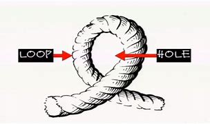
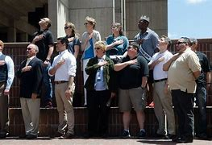

= eco 2020-05-30

:toc:

---

== Rule(v.) [by fear] 被恐惧统治

(2020-05-30 / China / Hong Kong’s freedoms: Rule by fear)

China’s national-security bill for Hong Kong *is* an attempt *to terrify*

It *could turn* the territory *into* a Sino-American battleground

May 28th 2020 | HONG KONG

THE ARMOURED vehicles of China’s security forces *have not rolled* onto Hong Kong’s streets, as last year officials in Beijing *hinted* they *might* [amid anti-government turmoil(n.) in the territory]. But [late in May] Chinese officials *may have done* more than their troops *would have to kill* the notion of a “high degree of autonomy” in Hong Kong, which *was promised* when it *returned to China* in 1997. As Chinese legislators *gathered* in the capital *for* an annual, coronavirus-delayed meeting, the body’s standing(a.) committee *dropped* a bombshell.

The committee *said* it *had reached* a “decision” that China *would impose* a national-security law *on* Hong Kong. The territory’s own legislature *would have no role* in drafting(v.) it. The bill *would prevent* and *punish* “any conduct that *seriously endangers* national security”, *including* separatism, subversion of state power, terrorism and “activities by foreign and overseas forces” that “*interfere*” in Hong Kong’s affairs. It *could be promulgated* in Hong Kong *as early as* late June.

America *is not waiting*. On May 27th its secretary of state, Mike Pompeo, *declared that* “facts on the ground” *showed* Hong Kong *was* no longer autonomous. This *opens* a new front in the intensifying struggle between China and America. Mr Pompeo’s words(n.) *mean that* `主` what many businesses in Hong Kong *had once treated as* unthinkable `谓` *is becoming* more possible. Namely, America *could decide* to impose(v.) the same tariffs, trade restrictions and visa requirements *on* Hong Kong *as it does* on the rest of China. That *would cause* as much [*if not more* distress in the territory *than* the draconian(a.) new bill].

Officials in Beijing and Hong Kong *have gone into overdrive* to reassure(v.) foreign investors in the international city. Carrie Lam, its chief executive, *used to say [in private] that* if the central government *were* to impose(v.) a national-security law in this way, the perception *would be* highly negative. Now she *finds herself arguing that* by *targeting* acts of secession and interference by “external forces” (*never defined*), the new law *is doing foreign business a favour*. Last year’s open defiance(n.) of the police by protesters *will no longer be tolerated*. Hong Kong *can go back to business*.

*Briefing* diplomats, businesspeople and journalists on May 25th, China’s foreign-affairs commissioner in the territory, Xie Feng, *said* the new law *would merely plug* a legal “loophole” *exploited by* a “small minority of criminals” *backed by* dark foreign forces *bent on* splitting(v.) China. Foreign investors and other business folk, Mr Xie *purred*, *had no reason to panic*. On a more threatening note, he *suggested that* anyone who *did sound* the alarm *was out to block* China’s development. Mr Xie *urged* his audience *to await* “details” of the proposed legislation -- then people *would see* there was nothing to worry about.

Yet 正如 *as* Margaret Ng, a barrister and former member of Hong Kong’s quasi-parliament, the Legislative Council (Legco), *points out*, the details *are* “almost irrelevant(a.)”. The proposed law, she *says*, *would blow(v.) a hole* [*both*] in the handover agreement that China *signed with* Britain, [*and*] in China’s own mini-constitution for Hong Kong, the Basic Law. *It is fundamental* to Hong Kong’s guarantees *that* it *makes* its own criminal laws /and *that* people in the territory *may be punished* only under Hong Kong law by Hong Kong agencies.

The new bill *would wreck* that. True, the central government *is making use of* a clause in the Basic Law that *allows it to legislate for* Hong Kong. But that *is permitted* only in matters *relating to* diplomacy, defence and “other matters outside the limits” of Hong Kong’s autonomy. Democrats in Hong Kong *argue that* the proposed bill *is* within Hong Kong’s scope. Article 23 of the Basic Law *says* Hong Kong *should enact laws* “on its own” *against* treason, secession, sedition and subversion, as well as 也,又 *to prohibit* ties between Hong Kong bodies and foreign political organisations (though `主` an attempt *to do so* in 2003 `谓` *was abandoned* after a huge protest).

The central government, then, *has* no legal authority *to add* a national-security law *to* the Basic Law’s annexe. Hong Kong’s Bar Association *also points to* a lack of any assurance that the new bill *will comply with* the International Covenant(n.) on Civil and Political Rights, which the Basic Law *pledges*(v.) to uphold(v.).

There is a final breach of Hong Kong’s legal and other norms. Mainland organisations *may be set up* [in the territory] *to “safeguard”* national security and *oversee* the new legislation. The implications *are* profound(a.), including the possible stationing in Hong Kong of China’s secret police. It is hard *to imagine* how their will(n.) *would not prevail*(v.) in any matter *relating to* interpretation of the new bill /and who *should be targeted*. The Basic Law *says* no arm of the central government *may interfere* in the administration of Hong Kong’s own affairs. But secret agents *do*, *such as* those who *grabbed* a Hong Kong bookseller in 2015 and *spirited him away* to the mainland.

Three broad and interconnected sets of questions *now need answers*. First, how *will* Hong Kongers *react*? 随着 *As* coronavirus restrictions *ease*, *will* anger *erupt* on the streets again? Second, how *will* companies (*doing business* in Hong Kong) *respond*? *Can* Hong Kong *continue to serve as* a global hub for finance, commerce and the media -- a place *comfortably apart from* mainland China? Or will firms *up sticks* and *run for* Singapore or even Taiwan? *Can* China, indeed, *count on* Hong Kong *as* the pre-eminent(a.) place *to raise* “red” capital *for* its firms? Lastly, what steps might follow from Mr Pompeo’s pronouncement? What impact on the calculations of both citizens and businesses in Hong Kong might America’s actions have?

For Hong Kong’s young, the identity of a generation was forged in last year’s protests. These began in June in opposition to a draft bill that would have allowed Hong Kongers accused of crimes in China to be extradited, without recourse, to the mainland. The protests quickly snowballed into a broader rebellion against both the local and central government. Over time they became more violent—participants began using slings, arrows and petrol bombs against the police, who became ever readier to resort to tear-gas, rubber bullets, water cannon and occasional live rounds. Hong Kong had seen nothing like it since the Communist Party itself instigated riots in the British colony in the 1960s.

The protests eventually ebbed last year as activists turned their attention to elections for the territory’s district councils, the only tier of government fully elected by universal suffrage. Pro-democracy candidates swept them in a landslide, a powerful rebuff to the establishment and its backers in Beijing. A point had been made, and many protesters returned to their work or studies. Then, in January, when life looked like returning to something closer to normal, the pandemic struck. The authorities handled it well—there have been only four deaths from covid-19. An unintended blessing was that the cycles of confrontation subsided as people became cautious about leaving their homes.

But the central government will not let bygones be bygones. It has been tightening the screws on Hong Kong all year. In January President Xi Jinping installed a loyalist, Luo Huining, to head the central government’s outpost in Hong Kong, the Liaison Office. Once it was supposed merely to facilitate mainland enterprises’ dealings. Instead, it has grown to become Hong Kong’s pre-eminent centre of power. Its networks run through business, civil society, schools, newspapers and political parties. It controls Hong Kong’s largest publisher and bookstore chain.

In China’s provinces and major cities, the party secretary wields the real power—governors and mayors are secondary. So it is in Hong Kong. Once, the Liaison Office was barely heard. Now it pronounces on nearly everything and regularly denounces the pro-democracy camp. In April, when legal experts reminded the office that Article 22 of the Basic Law forbids interference by mainland entities in Hong Kong’s domestic affairs, the office said it was exempt from this rule. The Hong Kong government appeared embarrassed at first. But Mrs Lam later backed the Liaison Office’s position—confirming, by doing so, that it held more sway than her government.

Also that month, 15 grandees of the pro-democracy movement, including Martin Lee, Hong Kong’s best-known champion, and Ms Ng, the barrister, were arrested and accused of unlawful assembly. To many Hong Kongers the simultaneous rounding up of so many luminaries smacked of instructions from Beijing. In May the mainland intervened angrily when an exam for school leavers invited a nuanced view of Japan’s role in China’s pre-communist history. At China’s instruction, Legco is debating a law against insults to the national anthem (at international football matches, Hong Kong fans often boo the song).

That law had its second reading on May 27th. People who had planned to gather near Legco to protest against it and the new national-security bill were kept away by hundreds of police. At demonstrations elsewhere police fired pepper bullets and rounded up more than 360 people, including schoolchildren in uniform. As with attempted protests on May 24th (pictured), the first of any size this year, a new police tactic was apparent: move hard and fast, swamp the area and make mass arrests.

Given such methods, it is hard to predict whether protests can grow. Young Hong Kongers face dismal job prospects and see the space for political expression rapidly shrinking. They may see little to lose in one last summer of defiance before facing the full wrath of new anti-subversion laws. But to control covid-19 all public gatherings are banned, which makes it easier for the police to stop protests. The restriction will remain in place at least until June 4th, the anniversary of the crushing of the Tiananmen Square protests in 1989 which Hong Kongers traditionally mark with a mass vigil. Police have refused permission for the usual event. Thereafter, police will reject many applications for protests, as they did last year citing possible violence.

Furthermore, support for demonstrations may be ebbing. Last year the biggest ones attracted up to 2m people. This week office-workers groaned when managers urged them—once again—to work from home because of the risk of disruption to transport by protesters. After last year’s chaos and this year’s anti-virus measures, much of Hong Kong is desperate for normal life. Some ordinary folk with little interest in politics or love for China have cheered news of the national-security legislation.

A bellwether of public support for street action will be July 1st, the anniversary of the start of Chinese rule and a traditional day of protests. If many turn out, then it could be another long, hot summer. But after the arrests of nearly 9,000 people for offences related to the unrest, many of the most ardent demonstrators may be out of action. Some have fled to Taiwan.

As for business, Hong Kong’s foreign chambers of commerce were unusually vocal against last year’s extradition bill but now seem to be more muted. Mainland firms will certainly grin and bear it, and they are becoming the backbone of Hong Kong’s economy. The number of foreign firms with their Asian headquarters in Hong Kong fell last year. But in 2018 the number of mainland businesses with offices of any kind in the city eclipsed the number of American firms for the first time (see first chart). Mainland companies accounted for 73% of the Hong Kong stockmarket at the end of last year, compared with 60% five years before. Many mainland firms also turn to the city when selling their bonds (see second chart). In 2018 they were responsible for about 70% of the corporate bonds issued in Hong Kong, says Natixis, a French bank.

As tensions grow between China and America, Chinese firms seeking to raise capital abroad are increasingly drawn to Hong Kong rather than New York. Baidu, an online-search giant, may even delist from NASDAQ and offer its shares in the territory instead. Other Chinese tech firms, including NetEase, Ctrip and JD.com, may follow Alibaba in seeking a secondary listing in Hong Kong. At the other end of the territory’s business spectrum is refugee capital that has escaped the mainland to avoid scrutiny by the Chinese government. But if you are an individual hiding your money from officials on the mainland, “I’m not even sure you are still in Hong Kong by now,” says one observer.

The chances of national-security laws ensnaring foreign businesspeople may be remote. Yet fear had already been causing some to have second thoughts, even before the announcement about the security law. British businesses say they are struggling to persuade executives to move to Hong Kong. The cruel detention in China of Michael Kovrig and Michael Spavor, two Canadians who have been held since December 2018 as pawns against America’s bid to extradite the daughter of Huawei’s founder from Vancouver, deters some long-time residents of Hong Kong from crossing the border into the mainland. As a foreign official puts it: “Two foreigners have been detained without a specific charge for more than 530 days. And we are told everything is strictly according to law. So my question is: is this the way the national-security laws work? Are these the institutions that are coming to Hong Kong?”

Eyes now are on Washington. Mr Pompeo’s decision to notify Congress that Hong Kong is no longer autonomous sets a potent legal mechanism in motion. The Hong Kong Policy Act of 1992, amended and toughened last year, allows the American government to treat Hong Kong as a separate entity for trade and other purposes, as long as it is demonstrably freer than the rest of China. The White House must now lead a multi-agency discussion about which of Hong Kong’s privileges to revoke.

Any moves to end Hong Kong’s special privileges pose a dilemma. America could apply anti-dumping measures and other tariffs on the territory. But they are hard to deploy with precision and would not greatly affect mainland interests, says James Green, who was the head of trade policy at the American embassy in Beijing until 2018. Some speculation—including talk of Mr Trump using an executive order to make it more difficult to convert Hong Kong dollars into greenbacks—is hard to credit, because it would involve using legal powers usually reserved for pariah states like Iran or North Korea.

Among more likely measures are the imposition of sanctions on officials who abuse human rights in Hong Kong, such as by denying them visas and freezing their assets. Another possible step involves changes to Hong Kong’s status as a partner trusted to enforce controls on the export of sensitive items and technologies. American officials grumble that shell companies in the territory are shipping controlled items to Iran or mainland China, and say Hong Kong seems nervous of working closely with America in case that angers China. And the Senate is mulling a bipartisan bill that calls for sanctions against banks that have dealings with human-rights abusers in Hong Kong. Measures could even include cutting off access to America’s financial system.

Mr Trump may be cautious. He signed last year’s bill, which amended the Hong Kong Policy Act to give it more teeth, but only reluctantly. (He had earlier suggested he might veto it to promote a trade deal with China.) He may balk at an escalation. But but these are febrile, unpredictable times in the Sino-American relationship and American politics. As a congressional staffer puts it, television scenes of heads being cracked on Hong Kong’s streets could play into the “whole Democratic notion that President Trump is soft on autocrats and weak on human rights.” So more dramatic steps by America are growing more likely, as accusations in Beijing of foreign meddling grow shriller. Not only are Hong Kong’s freedoms in peril. So too are badly strained ties between the two great powers on which its future most depends.

---

== Rule by fear 词汇解说

1. armoured vehicle 装甲车

1. roll : v. to move or make sth move from side to side （使）摇摆，摇晃 /to make a long continuous sound 发出持续的声音 /when a machine rolls or sb rolls it, it operates 启动；开动
- Thunder rolled(v.). 雷声隆隆。
-

1. turmoil [ˈtɜrmɔɪl] n. [不可数名词, 单数] a state of great anxiety and confusion 动乱；骚动；混乱；焦虑
- emotional/mental/*political turmoil* 纷乱的情绪；精神上的混乱；政治动乱
- THE ARMOURED vehicles of China’s security forces *have not rolled* onto Hong Kong’s streets, as last year officials in Beijing *hinted* 暗示 {they *might* [amid anti-government turmoil(n.) in the territory 领土；版图；领地]}. +

1. notion   : *~ (that...) /~ (of sth)* an idea, a belief or an understanding of sth 观念；信念；理解
- a political system *based on the notions of equality and liberty* 建立在自由平等观念基础上的政治体系
- the notion of a “high degree of autonomy” in Hong Kong.

1. standing : a. existing or arranged permanently, not formed or made for a particular situation 长期存在的；永久性的；常设的
- a standing army 常备军
- *a standing committee* 常务委员会

1. bombshell : /ˈbɑːmʃel/ n. an event or a piece of news which is unexpected and usually unpleasant 出乎意料的事情，意外消息（常指不幸） /*a blond(e) bombshell* : a very attractive woman with blonde hair 金发美女 +
=> bomb, 炸弹。shell, 弹壳。
- The news of his death *came as a bombshell*. 他去世的消息令人震惊。
- the body’s standing(a.) committee *dropped* a bombshell. 全国人大常委会投下了一枚重磅炸弹。

1. separatism : /ˈseprətɪzəm/ N-UNCOUNT Separatism is the beliefs and activities of separatists. 分裂主义; 独立主义

1. subversion : N-UNCOUNT Subversion is the attempt to weaken or destroy a political system or a government. 颠覆企图 +
=> sub-,在下，-vert,转，词源同 verse,convert.引申词义颠覆，暗中破坏等。

1. interfere : v. [ VN ] ~ (in sth) to get involved in and try to influence a situation that does not concern you, in a way that annoys other people 干涉；干预；介入
- The police are very unwilling *to interfere in family problems*. 警方很不情愿插手家庭问题。
- “activities by foreign and overseas forces” that “*interfere*”(v.) in Hong Kong’s affairs.

1. promulgate /ˈprɑːmlɡeɪt/ v. to announce a new law or system officially or publicly 宣布，颁布，发布（新法律或体制） /[ usually passive ] to spread an idea, a belief, etc. among many people 传播；传扬；宣传 +
=> 来源于拉丁语中由前缀pro-(前,公开)和动词mulgere(榨取,挤奶)组成的复合动词promulgare(公布,发布)。 词根词缀： *pro-前,公开 + mulg榨取,挤奶(词根mulg和单词milk（奶；挤奶）同源)* + -ate动词词尾 *由挤奶时乳汁向外发散喷洒的状态，抽象引申为“发布，发表”之义。* 同源词：emulsion
- It *could be promulgated* in Hong Kong *as early as* late June. 它最早可于六月底在香港公布。

1. *on the ground* : in the place where sth is happening and among the people who are in the situation, especially a war 当场；在现场；（尤指）在处于战火中的人之中
- *On the ground*, there are hopes that the fighting will soon stop. 战火中的人都希望战斗尽快结束。
- There's a lot of support for the policy *on the ground*. 这一政策得到相关人员的普遍支持。
- “*facts on the ground*” showed(v.) Hong Kong *was* no longer autonomous. “事实”表明hk不再是自治的。

1. autonomous : a. ( of a country, a region or an organization 国家、地区、组织 ) able to govern itself or control its own affairs 自治的；有自治权的
- an autonomous republic/state/province 自治共和国╱州╱省

1. front : n. [ Cusually sing. ] an area where fighting takes place during a war 前线；前方
- More British troops *have been sent to the front*. 更多的英国部队已派往前线。
- This *opens* a new front in the intensifying struggle between China and America. 这为中美之间日益激烈的斗争, 开辟了一条新的战争前线。

1. draconian :  /drəˈkoʊniən/  a. ( formal ) ( of a law, punishment, etc. 法律、惩罚等 ) extremely cruel and severe 德拉古式的；严酷的；残忍的
- That *would cause* as much if not more distress in the territory *than* the draconian(a.) new bill. 这将比严苛的新法案在香港造成更大(如果不是更大的话)的痛苦。

1. as much 同样多的, 同样的

1. *if not more than* 意思是：就算不比...多，至少和...一样的(同样的）
- *A is as import as B, if not more than, at least the same.*
翻译，A跟B一样重要，如果A没有B重要，至少也一样。
- I am at least the same age as Robert *if I am not older than him*.
- That *would cause* as much [*if not more* distress in the territory *than* the draconian(a.) new bill]. +
这将在香港引起与严厉的新法案同样多的痛苦，如果不是更多痛苦的话。

1. overdrive : v. 过度驱使，使过度工作 n. （汽车的）超速档；极度忙碌 /(PHRASE) 加倍努力（或紧张） If you *go into overdrive*, you begin to work very hard or perform a particular activity in a very intense way.
- to be *in overdrive* 超速驾驶
- Officials in Beijing and Hong Kong *have gone into overdrive* to reassure(v.) foreign investors in the international city. 北京和香港的官员们, 都在不遗余力地安抚这座国际大都市的外国投资者。

1.  perception : [不可数名词, 可数名词] ~ (that…) (formal) an idea, a belief or an image you have as a result of how you see or understand sth 看法；见解
- a campaign to change *public perception* of the police
改变警察公众形象的运动
- if the central government *were* to impose(v.) a national-security law in this way, the perception *would be* highly negative. 如果中央政府以这种方式实施国家安全法，人们的看法将非常负面。

1. find oneself 后面可以接现在分词doing或过去分词done的形式，意思是：发觉自己的处境。现在分词表示主动含义；过去分词就是表示被动含义。例如： +
- Then *I found myself surrounded* by half a dozen boys.然后我发现六个男孩围者自己。
- *Dick found himself walking* in the direction of Mike's place.Dick不知不觉的朝Mike的住处走去。

1. secession :  /sɪˈseʃn/  *~ (from sth)* the fact of an area or group becoming independent from the country or larger group that it belongs to （地区或集团从所属的国家或上级集团的）退出，脱离
-  ...*the Ukraine's secession* from the Soviet Union.
...乌克兰之退出苏联。 +
image:../../+ img_单词图片/s/secession.jpg[]

1. defiance /dɪˈfaɪəns/ n. open refusal to obey sb/sth 违抗；反抗；拒绝服从 +
=> 来自defy的名词形式。
- a look/an act/a gesture of defiance 反抗的神色╱行动╱表示 +
- Last year’s open defiance(n.) of the police by protesters *will no longer be tolerated*. 去年抗议者公开违抗警察的行为, 将不再被容忍。 +

1. brief : v. *~ sb (on/about sth)* to give sb information about sth so that they are prepared to deal with it 给（某人）指示；向（某人）介绍情况
- *Briefing* diplomats, businesspeople and journalists. 向外交官、商人和记者们做简报

1. commissioner :  (usually Commissioner) a member of a commission (= an official group of people who are responsible for controlling sth or finding out about sth) （委员会的）委员，专员，特派员 / the head of a government department in some countries （政府部门的）首长，长官
- *the agriculture/health, etc. commissioner* 农业、卫生等厅长
-

1. loophole : n. *~ (in sth)* a mistake in the way a law, contract, etc. has been written which enables people to legally avoid doing sth that the law, contract, etc. had intended them to do （法律、合同等的）漏洞，空子 +
=> 原指墙上的小洞，后用于比喻义漏洞。
- *a legal loophole* 法律的漏洞 +

1. *bent on sth/on doing sth* : determined to do sth (usually sth bad) 决心要做，一心想做（通常指坏事）
- She seems *bent on making life difficult for me*. 她似乎专门和我过不去。
- the new law *would merely plug* 堵塞；封堵 a legal “loophole” *exploited by* a “small minority of criminals” *backed by* dark foreign forces *bent on* splitting(v.) China. +
新法律只是填补了一个法律“漏洞”，这个“漏洞”被一小部分“罪犯”利用，而这些“罪犯”受到一心要分裂中国的黑暗外国势力的支持。

1. split : v.  to divide, or to make a group of people divide, into smaller groups that have very different opinions 分裂，使分裂（成不同的派别）
- The committee *split*(v.)) over government subsidies. 在政府补贴的问题上，委员会出现了相互对立的意见。 +

1. purr : [pə] v. to speak in a low and gentle voice, for example to show you are happy or satisfied, or because you want to attract sb or get them to do sth （愉快或满意地）低沉柔和地讲话；轻声招呼 / （猫）发出呼噜声，惬意地打呼噜
- Foreign investors and other business folk, Mr Xie *purred*, had no reason to panic. +
image:../../+ img_单词图片/p/purr.jpg[]

1. note : [可数名词] an official document with a particular purpose 正式文件；票据；证明书
- *a sick note* from your doctor 医生开据的病假证明

1. *be out for sth/to do sth* : to be trying to get or do sth 试图得到（或做）
- *She's out for* what she can get (= trying to get something for herself) .
她力图得到自己能得的。
- The company *is out to capture* the Canadian market.
这家公司竭尽全力抢滩加拿大市场。
- On a more threatening note, he *suggested that* anyone who *did sound* the alarm *was out to block* China’s development. +
在一篇更具威胁性的记录中，他表示，任何发出警告的人都是为了阻止中国的发展。

1. propose : v. (formal) to suggest a plan, an idea, etc. for people to think about and decide on 提议；建议
- *What would you propose*? 你想提什么建议？
- Mr Xie *urged* his audience *to await* “details” of the proposed legislation. 敦促他的听众等待立法提案的“细节”

1. barrister : /ˈbærɪstər/ a lawyer in Britain who has the right to argue cases in the higher courts of law 出庭律师，大律师，辩护律师（在英国有资格出席上级法庭进行辩护） +
=> 来自bar, 杆，棍。指用杆条隔开法官与律师，代指律师。-ster, 人。 +
在英国，律师分成两种：barrister和solicitor。 +
barrister是出庭律师、大律师，具有上庭辩护的资格，常根据其发音称为“巴律师”； +
solicitor是事务律师，只能办理法律事务，不能上庭辩护，常根据其发音称为“沙律师”。 +
barrister中的bar指的是庭审现场中将法庭和旁听席分开的围栏，因此barrister的字面意思就是有资格越过围栏，上庭辩护的律师。 +

1. quasi-  : /'kweizai/ pref. 准；类似（用以构成复合词） /that appears to be sth but is not really so 类似 /partly; almost 半；准 +
=> 来自拉丁语quasi, 看起来相似， 类似。其中qua 来自PIE*kwo, 表疑问， 词源同quality,quantity,how,who,-si 来自PIE*swe,自身，自己，词源同self.见quasar,quasi-science.
- *a quasi-official body* 半官方机构
- a quasi-scientific explanation 貌似科学的解释

1. irrelevant : a.  *~ (to sth/sb)* not important to or connected with a situation 无关紧要的；不相关的
- *totally/completely/largely irrelevant* 完全 / 绝对 / 基本上无关紧要
- Yet 正如 *as* Margaret Ng, a barrister and former member of Hong Kong’s quasi-parliament, the Legislative Council (Legco), *points out*, the details *are* “almost irrelevant(a.)”. +
然而，正如香港准议会——立法会的前议员、律师吴霭仪(Margaret Ng)所指出的，细节“几乎无关紧要”。

1. blow : v. [+ 副词或介词短语] to be moved by the wind, sb's breath, etc.; to move sth in this way （被）刮动，吹动 /[动词 + 名词短语] to break sth open with explosives 炸开
- The safe *had been blown* by the thieves. 保险柜被窃贼炸开了。
- The proposed law, she *says*, *would blow(v.) a hole* [*both*] in the handover agreement that China *signed with* Britain, [*and*] in China’s own mini-constitution for Hong Kong, the Basic Law. +
她说，拟议的法律, 将在中国与英国签署的移交协议和中国自己的香港小宪法《基本法》中, 炸开一个洞。

1. handover : n. the act of moving power or responsibility from one person or group to another; the period during which this is done （权力、责任等的）移交，移交期 /the act of giving a person or thing to sb in authority （某人或某物的）交出，上交
- *the smooth handover of power* from a military to a civilian government
从军政府到文人政府的权力的顺利移交

1. wreck : v.to damage or destroy sth 破坏；损坏；毁坏 /*~ sth (for sb)* to spoil sth completely 毁灭；毁掉/ [常用被动态] to damage a ship so much that it sinks or can no longer sail 使（船舶）失事；使遇难；使下沉
- *The building had been wrecked* by the explosion.
那座楼房被炸毁了。
- A serious injury *nearly wrecked his career*.
一次重伤差点儿葬送了他的前程。
- The new bill *would wreck* that. 新法案将破坏这一点。 +
image:../../+ img_单词图片/w/wreck.jpg[]

1. enact v. [常用被动态](law 律) to pass a law 通过（法律）
- legislation *enacted by parliament*
由议会通过的法律

1. treason : n.   /ˈtriːzn/ ( ˌhigh ˈtreason ) [ U ] the crime of doing sth that could cause danger to your country, such as helping its enemies during a war 危害国家罪，叛国罪（如战时通敌） +
=> 来自拉丁语 tradere,转移，移 交，词源同 tradition,betray.引申词义叛国罪。
- a treasonable act 叛国行为

1. sedition  /sɪˈdɪʃn/ n. [ U ] ( formal ) the use of words or actions that are intended to encourage people to oppose a government 煽动叛乱的言论（或行动） +
=> sed-,分开，来自 se-在元音前的异体形式，-it,走，词源同 exit,transit.比较前缀 re-在元音前的 异化形式 redolent,olfactory.字面意思即分开走，使分开，引申词义煽动叛乱。
- seditious(a.) activity 煽动叛乱的活动

1. subversion: [动词 + 名词短语, 单独使用的动词] to try to destroy the authority of a political, religious, etc. system by attacking it secretly or indirectly 颠覆；暗中破坏 /[动词 + 名词短语] to try to destroy a person's belief in sth or sb 使背叛；使变节；策反
- Article 23 of the Basic Law *says* Hong Kong *should enact laws* “on its own” *against* treason 危害国家罪，叛国罪（如战时通敌）, secession （地区或集团从所属的国家或上级集团的）退出，脱离, sedition 煽动叛乱的言论（或行动） and subversion  (对政府或政治体系的)颠覆，暗中破坏, as well as 也,又 *to prohibit* ties between Hong Kong bodies and foreign political organisations.  +
《基本法》第23条规定，香港应“自行”制定法律，打击叛国罪、分裂国家罪、煽动叛乱罪和颠覆罪，并禁止香港机构与外国政治组织建立联系.

1. annexe : n. [ˈænɪks] (formal) an extra section of a document （文件的）附件，附录 /a building that is added to, or is near, a larger one and that provides extra living or work space 附属建筑物；附加建筑物 +
=> an（=ad，去）+nex（系、绑, 见connect）→绑在一起→合并 词源解析：nex←拉丁语nectere（系、绑） 同源词：connect（连接），nexus（关系） 衍生词：annexation（合并） +
image:../../+ img_单词图片/a/annexe.jpg[]

1. Bar Association 律师协会,律师公会

1. vovenant : |ˈkʌvənənt| n. a promise to sb, or a legal agreement, especially one to pay a regular amount of money to sb/sth 承诺；合同；协约；（尤指定期付款的）契约
- God's covenant with Abraham
上帝与亚伯拉罕的立约

1. pledge : v. *~ sth (to sb/sth)* to formally promise to give or do sth 保证给予（或做）；正式承诺 / *~ sb/yourself (to sth)* to make sb or yourself formally promise to do sth 使保证；使发誓 +
=> 来自PIE*del,长的，词源同long,play,plight.引申词义请求，许诺，誓言等。
- The government *pledged their support* for the plan.
政府保证支持这项计划。
- *They were all pledged* to secrecy. 他们都宣誓保密。
- Hong Kong’s Bar Association *also points to* a lack of any assurance that the new bill *will comply with* the International Covenant(n.) on Civil and Political Rights, which the Basic Law *pledges*(v.) to uphold(v.). +
香港大律师公会(Bar Association)还指出，新法案缺乏任何保证，无法确保它符合《公民权利和政治权利国际公约》(International Covenant on Civil and Political Rights)。《基本法》承诺要维护《国际公约》。 +

1. uphold : v. to support sth that you think is right and make sure that it continues to exist 支持，维护（正义等）
-  We have a duty *to uphold the law*.
维护法律是我们的责任。

1. breach : n. [可数名词, 不可数名词] *~ of sth* a failure to do sth that must be done by law （对法规等的）违背，违犯 /~ of sth an action that breaks an agreement to behave in a particular way 破坏；辜负 +
=> 词源同break.
- They are *in breach of Article 119*. 他们违犯了第119条。
- *a breach of confidence/trust* 泄密；背信

1. profound : a. very great; felt or experienced very strongly 巨大的；深切的；深远的 /(medical 医) very serious; complete 严重的；完全的；彻底的 +
=> 来自拉丁语profundus,深的，无底的，来自pro-,向前，朝向，fundus,底部，词源同fundamental,bottom.引申词义深邃的，深远的等。拼写受found影响。
- My father's death *had a profound effect on us all*.
父亲的去世深深地影响了我们全家。
- profound disability 严重残疾
- *The implications are profound*(a.), including the possible stationing in Hong Kong of China’s secret police. 其影响是深远的，包括中国秘密警察可能在香港驻扎。

1. station : v. to send sb, especially from one of the armed forces, to work in a place for a period of time 派驻；使驻扎 /*~ sb/yourself…* (formal) to go somewhere and stand or sit there, especially to wait for sth; to send sb somewhere to do this 到某处站（或坐）；把…安置到（某处）
- troops *stationed(v.) abroad* 驻扎在国外的部队
- *She stationed(v.) herself* at the window to await his return. 她待在窗前等他回来。

1. prevail : v. *~ (in/among sth)* to exist or be very common at a particular time or in a particular place 普遍存在；盛行；流行 +
=> pre-,在前，领先，-vail,价值，.力量，词源同avail,value.即在力量上超过，胜利，引申词义盛行，流行等。
- *Those beliefs still prevail*(v.) among certain social groups. 这些信念在某些社会群体中仍很盛行。
- It is hard *to imagine* how their will(n.) *would not prevail*(v.) in any matter *relating to* interpretation of the new bill /and who *should be targeted*. +
很难想象在任何与解释新条例草案有关的问题上，他们的意愿如何不会占上风? 以及谁应该成为目标。

1. spirit : v. [动词 + 名词短语 + 副词或介词短语] to take sb/sth away in a quick, secret or mysterious way 偷偷带走；让人不可思议地弄走
- But secret agents *do*, *such as* those who *grabbed* a Hong Kong bookseller in 2015 and *spirited him away* to the mainland.
但特工们却能做到，比如那些在2015年抓了一个香港书商并把他偷偷带到了大陆的人。

1. up sticks : (British English) (North Amercian English pull up stakes) (informal) to suddenly move from your house and go to live somewhere else 突然迁居 /stick  [可数名词] a thin piece of wood that has fallen or been broken from a tree 枝条；枯枝；柴火棍儿
- will firms *up sticks* and *run for* Singapore or even Taiwan?  企业会不会挺身向新加坡甚至台湾进军?

1. *run for it* : (often used in orders 常用于命令) to run in order to escape from sb/sth 逃跑

1. *count on  sb/sth* : to trust sb to do sth or to be sure that sth will happen 依赖，依靠，指望（某人做某事）；确信（某事会发生）
- *I'm counting on you* to help me. 我就靠你帮我啦。
- *Can* China, indeed, *count on* Hong Kong *as* the pre-eminent(a.) place *to raise* “red” capital *for* its firms? +
中国真的指望香港成为为其企业筹集“红色”资本的首选之地吗?

1. pre-eminent : a. (formal) more important, more successful or of a higher standard than others 杰出的；出类拔萃的；卓越的
- Dickens *was pre-eminent*(a.) among English writers of his day. 狄更斯在其同时期英国作家中最为出色。

1.

---

规则被恐惧
中国为香港制定的国家安全法案是一种恐吓的企图
这可能会把该地区变成中美的战场
2020年5月28日香港
中国安全部队的装甲车尚未驶入香港街道，因为去年北京官员曾暗示，在香港反政府骚乱期间，他们可能会这么做。但是在五月末，中国官员可能已经做了比他们的军队所要做的更多的事情来扼杀香港的“高度自治”的概念，这是在1997年香港回归中国时所承诺的。当中国立法委员们聚集在首都北京参加因冠状病毒而推迟的年度会议时，全国人大常委会投下了一枚重磅炸弹。
该委员会表示，它已做出“决定”，中国将对香港实施国家安全法。香港自己的立法机构将不会参与起草。该法案将防止和惩罚“严重危害国家安全的任何行为”，包括分裂主义、颠覆国家政权、恐怖主义和“外国和海外势力的活动”，“干涉”香港事务。它最早可于六月底在香港公布。
美国没有等待。5月27日，香港国务卿迈克·蓬佩奥(Mike Pompeo)宣布，“事实”表明香港不再自治。这为中美之间日益激烈的斗争开辟了一条新战线。庞培的话意味着，香港许多企业曾经认为不可思议的事情，正变得越来越可能。也就是说，美国可以决定对香港征收与中国其他地区相同的关税、贸易限制和签证要求。这将比严苛的新法案在香港造成更大(如果不是更大的话)的痛苦。
北京和香港的官员们都在不遗余力地安抚这座国际大都市的外国投资者。香港特区行政长官林郑月娥(Carrie Lam)曾私下表示，如果中央政府以这种方式实施国家安全法，人们的看法将非常负面。现在，她发现自己认为，通过针对分裂行为和“外部力量”的干预(从未定义过)，新法律是在帮外国企业的忙。去年抗议者对警察的公然蔑视将不再被容忍。香港可以回归商业。
5月25日，中国驻香港外交事务专员谢峰在向外交官、商人和记者们做简报时表示，新法律只是填补了一个法律“漏洞”，这个“漏洞”被一小部分“罪犯”利用，而这些“罪犯”受到一心要分裂中国的黑暗外国势力的支持。谢笑着说，外国投资者和其他商人没有理由恐慌。在一篇更具威胁性的文章中，他表示，任何发出警告的人都是为了阻止中国的发展。谢敦促他的听众等待立法提案的“细节”——然后人们就会看到没什么可担心的。
然而，正如香港准议会——立法会的前议员、律师吴霭仪(Margaret Ng)所指出的，细节“几乎无关紧要”。她说，拟议的法律将在中国与英国签署的移交协议和中国自己的香港小宪法《基本法》中造成一个漏洞。香港制定自己的刑事法律，香港机构只能根据香港法律对香港人进行惩罚，这对香港的保证至关重要。
新法案将破坏这一点。的确，中央政府正在利用《基本法》中的一项条款，为香港制定法律。但这一规定只适用于外交、国防及“其他超出香港自治范围的事务”。香港的民主党人认为，拟议中的法案在香港的范围之内。《基本法》第23条规定，香港应“自行”制定法律，打击叛国罪、分裂国家罪、煽动叛乱罪和颠覆罪，并禁止香港机构与外国政治组织建立联系(尽管在2003年，香港曾试图这样做，但在一场大规模抗议后放弃)。

因此，中央政府没有法律权力将《国家安全法》添加到《基本法》的附件中。香港大律师公会(Bar Association)还指出，新法案缺乏任何保证，无法确保它符合《公民权利和政治权利国际公约》(International Covenant on Civil and Political Rights)。《基本法》承诺要维护《国际公约》。
这最终违反了香港的法律和其他规范。内地机构可能会在香港成立，以“保卫”国家安全和监督新立法。其影响是深远的，包括中国秘密警察可能在香港驻扎。很难想象他们的意志怎么会在任何与解释新法案有关的事情上不占上风，而且谁应该成为目标。《基本法》规定，中央政府各部门不得干预香港事务的管理。但特务们却能做到，比如那些在2015年抓了一个香港书商并把他偷偷带到了大陆的人。
三个广泛而又相互关联的问题现在需要答案。首先，香港人会作何反应?随着对冠状病毒的限制放松，愤怒会再次在街头爆发吗?第二，在香港开展业务的公司将如何应对?香港能否继续作为全球金融、商业和媒体中心——一个与中国大陆相距甚远的地方?或者，企业会不会挺身向新加坡甚至台湾进军?中国真的能指望香港成为为其企业筹集“红色”资本的首选之地吗?最后，庞皮欧的声明可能会带来什么结果?美国的行动可能会对香港市民和企业的计算产生什么影响?
对香港年轻人来说，一代人的身份是在去年的抗议活动中形成的。这些行动始于今年6月，目的是反对一项法案草案，该草案将允许香港人被控在中国内地犯下罪行后被引渡到中国内地。抗议活动迅速升级为针对地方政府和中央政府的更大范围的叛乱。随着时间的推移，他们变得越来越暴力——参与者开始使用投石器、弓箭和汽油弹来对付警察，而警察则变得更愿意使用催泪弹、橡皮子弹、高压水枪，偶尔还会使用实弹。自上世纪60年代中国共产党在香港这个英国殖民地煽动骚乱以来，香港从未发生过类似事件。
去年，随着活动人士将注意力转向地方议会选举，抗议活动最终消退。地方议会是香港唯一由普选产生的一级政府。民主派候选人以压倒性优势获胜，这是对北京当局及其支持者的有力回击。这说明了一点，许多抗议者返回工作或学习。然后，在1月份，当生活似乎恢复到接近正常的状态时，大流行爆发了。当局处理得很好，只有4人死于covid-19。一个意想不到的好处是，随着人们对离开自己的家园变得谨慎起来，对抗的循环消退了。
但是中央政府不会让过去的事情过去。一年来，它一直在给香港施加压力。今年1月，国家主席习近平任命忠于他的罗惠宁领导中央政府在香港的联络处。曾经，它被认为仅仅是为了方便内地企业的交易。相反，它已成长为香港卓越的权力中心。它的网络遍及商业、公民社会、学校、报纸和政党。它控制着香港最大的出版商和连锁书店。
在中国的省份和主要城市，党委书记掌握实权——省长和市长是次要的。香港也是如此。有一次，几乎听不到联络处的声音。现在它几乎对所有事情都发表意见，并定期谴责亲民主阵营。今年4月，当法律专家提醒香港基本法第22条禁止内地实体干涉香港内政时，香港特别行政区基本法办公室表示，它不受这一规定的约束。香港政府起初显得很尴尬。但林太后来支持联络处的立场——通过这样做，证实联络处比她的政府更有影响力。

就在同月，15名民主运动的要人被捕，并被控非法集会，其中包括香港最知名的律师李兆基(Martin Lee)和大律师吴淑仪(Ng)。对许多香港人来说，同时围捕这么多名人，有点像北京的指示。今年5月，一场针对离校生的考试引发了对日本在中国前共产主义历史中所扮演角色的微妙看法，中国大陆愤怒地进行了干预。在中国的指示下，立法会正在讨论一项禁止侮辱国歌的法律(在国际足球比赛中，香港球迷经常对国歌发出嘘声)。
该法案于5月27日进行了二读。原本计划在立法会附近集会抗议和新的国家安全法案的人被数百名警察拒之门外。在其他地方的示威活动中，警察发射胡椒子弹，围捕了360多人，其中包括穿着制服的学生。5月24日的抗议活动(如图)是今年第一次大规模的抗议活动，与之类似，一种新的警察策略显而易见:快速而强硬地行动，包围该地区，并进行大规模逮捕。
考虑到这些方法，很难预测抗议活动是否会增加。年轻的香港人面临着黯淡的就业前景，政治表达的空间迅速缩小。在面对新反颠覆法的全面惩罚之前，他们可能在最后一个夏天的反抗中看不到什么损失。但是为了控制covid-19，所有公共集会都被禁止，这使得警察更容易阻止抗议活动。这一限制将至少持续到6月4日，即1989年**事件的周年纪念日，香港人通常会在这一天举行集体守夜活动。警方拒绝批准这一通常的活动。此后，警方将拒绝许多抗议申请，就像他们去年以可能发生暴力为由所做的那样。
此外，对示威的支持可能正在减弱。去年最大的一次吸引了200万人。本周，由于担心抗议者扰乱交通秩序，经理再次敦促办公室员工在家办公，员工们对此抱怨不已。在经历了去年的混乱和今年的反病毒措施后，香港大部分地区都渴望过正常的生活。一些对政治不感兴趣或对中国不感兴趣的普通民众对国家安全法案的通过表示欢迎。
公众支持街头行动的一个风向标将是7月1日，这是中国开始统治的周年纪念日，也是一个传统的抗议日。如果有很多人被证实，那么这将是又一个漫长而炎热的夏天。但在近9000人因与骚乱有关的罪行被逮捕后，许多最狂热的示威者可能已经失去了行动。一些人逃到了台湾。

至于商业方面，香港的外国商会对去年的引渡法案发出了不同寻常的反对声音，但现在似乎更加沉默了。内地企业肯定会逆来顺受，它们正成为香港经济的支柱。在香港设立亚洲总部的外国公司数量去年有所下降。但在2018年，在香港设有任何类型办公室的内地企业数量首次超过了美国企业的数量(见第一张图表)。截至去年底，内地企业占香港股市的73%，而五年前这一比例为60%。许多大陆公司在出售债券时也求助于香港。法国银行Natixis称，2018年，香港发行的公司债券中，约有70%是他们发行的。
随着中美关系的紧张，寻求在海外融资的中国公司越来越多地被吸引到香港而不是纽约。在线搜索巨头百度甚至可能从纳斯达克退市，转而在香港上市。包括网易、携程和京东在内的其他中国科技公司可能会效仿阿里巴巴，在香港寻求二次上市。香港商业光谱的另一端是为逃避中国政府审查而逃离内地的难民资本。但如果你是一个向内地官员隐藏资金的人，“我甚至不确定你现在是否还在香港，”一位观察人士表示。
国家安全法逮捕外国商人的可能性微乎其微。然而，早在《安全法》公布之前，恐惧就已经让一些人改变了主意。英国企业表示，它们正努力说服高管搬到香港。康明凯(Michael Kovrig)和迈克尔?斯帕沃尔(Michael Spavor)在中国遭到残酷拘留，这两名加拿大人自2018年12月以来一直被关押，作为美国试图从温哥华引渡华为创始人之女的筹码，这让一些长期居住在香港的居民不敢越过边境进入中国内地。正如一位外国官员所言:“两名外国人未经特别指控就被拘留了530多天。我们被告知一切都严格遵守法律。所以我的问题是:这就是国家安全法的运作方式吗?这些是来香港的机构吗?”

现在，人们的目光投向了华盛顿。蓬佩奥决定通知国会，香港不再自治，这一决定启动了一个强有力的法律机制。1992年的《香港政策法案》(Hong Kong Policy Act)于去年得到修订和强化，该法案允许美国政府将香港视为一个独立的实体，用于贸易和其他目的，只要它明显比中国其他地区更自由。白宫现在必须牵头一个多部门的讨论，讨论取消香港的哪些特权。
任何旨在终结香港特权的举措都让人左右为难。美国可以对该地区实施反倾销措施和其他关税。但美国驻北京大使馆的贸易政策主管詹姆斯•格林(James Green)表示，这些措施很难精确部署，不会对中国大陆的利益产生重大影响。一些猜测——包括特朗普使用行政命令使港元更难兑换成美元的说法——很难让人相信，因为这将涉及使用通常留给伊朗或朝鲜等无赖国家的法律权力。
更有可能采取的措施包括对在香港侵犯人权的官员实施制裁，例如拒绝发给他们签证并冻结他们的资产。另一个可能的步骤是，改变香港作为受信任的合作伙伴的地位，对敏感物项和技术的出口实施控制。美国官员抱怨说，香港的空壳公司正在把受管制的物品运往伊朗或中国大陆，并说香港似乎对与美国密切合作感到紧张，以防激怒中国。参议院正在考虑一项两党议案，呼吁对与香港侵犯人权者有交易的银行进行制裁。这些措施甚至可能包括切断对美国金融体系的访问。
特朗普可能很谨慎。他签署了去年的法案，修订了《香港政策法案》(Hong Kong Policy Act)，赋予其更大的效力，但只是勉强而已。(早些时候，他曾暗示可能会否决该法案，以促进与中国的贸易协定。)他可能不愿看到局势升级。但在中美关系和美国政治中，这些都是狂热的、不可预测的时期。正如一名国会工作人员所说，电视上出现的香港街道上人头被砸的画面，可能符合“整个民主党的概念，即特朗普总统对独裁者软弱，对人权软弱”。因此，随着北京对外国干预的指责越来越尖锐，美国采取更激进措施的可能性越来越大。香港的自由不仅岌岌可危。中国的未来最依赖的两个大国之间严重紧张的关系也是如此。

