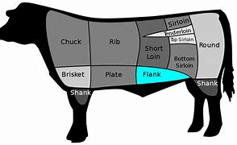

= eco 2020-06-06
:toc:

---

== Central Asian governments do not know how to talk about China 词汇解说

( eco 2020.6.6 / Asia / Banyan: The beast from the east )

Their citizens *are* suspicious, but *want* investment

Jun 4th 2020 |

FOR MILLENNIA 千年期；千周年纪念日 `主` fierce  凶猛的；凶狠的；凶残的 horsemen 骑马的人; 骑手 from Central Asia `谓` *harried* （不断）烦扰；折磨;反复进攻；不断袭击 the Chinese empire’s flank （军队或运动队的）翼侧，侧面，侧翼;（建筑物、山等的）侧面;（动物的）胁腹, often *setting* the terms （协议、合同等的）条件，条款 of engagement （尤指正式的或与工作有关的）约定，约会，预约 *with* their giant, settled(a.)不大可能变动的；稳定的 neighbour (to the east). In February an echo *rolled* 发出持续的声音;（使）翻滚，滚动 out of the past when a horde 一大群人 of whooping 欢呼;欢呼声 riders *galloped 骑马奔驰 through* the town of At-Bashy in south-central Kyrgyzstan 吉尔吉斯斯坦, *close to* the border with China.

- flank : the side of sth such as a building or mountain （建筑物、山等的）侧面 / the side of an animal between the ribs and the hip （动物的）胁腹 +
=> 来自PIE*kleng, 弯，转，词源同link. 进一步来自PIE*klei的鼻音形式，倾斜，词源同lean, incline. +

- gallop : /ˈɡæləp/ v. [ V ] when a horse or similar animal gallops , it moves very fast and each stride includes a stage when all four feet are off the ground together （马等）飞奔，奔驰，疾驰 / to ride a horse very fast, usually at a gallop 骑马奔驰；使（马）飞奔 +
=> 来自wallop的拼写变体，即well leap.

Their target *was* a planned Chinese logistics 后勤；物流；组织工作 centre: a $275m investment in roads, malls 商场,大型购物区 and warehouses that *was touted 标榜；吹捧；吹嘘 as* a crucial node in China’s Belt and Road Initiative, a funnel 漏斗 for revived （使）苏醒，复活 trade along the old silk road /and a source of future prosperity 兴旺；繁荣 for the locality （围绕所处或提及的）地区;（某人或某物存在的）地方，地点. But the horsemen of the pristine 未开发的；处于原始状态的;崭新的；清新的 valley *were having* none of it: they *feared* their land *would be grabbed* and jobs *would go to* imported 导入；输入；移入 Chinese. *Facing* such hostility, the Chinese investors *angrily pulled out* 脱离；退出, *leaving* politicians in Kyrgyzstan *with egg on their faces* 使显得愚蠢；出丑；丢脸.

- logistics :  /ləˈdʒɪstɪks/  n. *~ (of sth)* the practical organization that is needed to make a complicated plan successful when a lot of people and equipment is involved 后勤；物流；组织工作 +
=> 来源于古法语logistique,由古法语词汇logis(寄宿处)和希腊语词尾-istikos组成的复合词。logistics（物流）与logic（逻辑）虽然很像但是却没有任何词源上的关系。logistics与lodge（旅馆、山林小屋）同源，本来是猎人或商旅歇脚暂留之地，延伸为吃住和物资的堆放和分发。 +

- *have egg on/all over your face* : (informal) to be made to look stupid 使显得愚蠢；出丑；丢脸

The incident *highlights* a growing tension between rulers and ruled 统治者和被统治者 in the Central Asian states of Kazakhstan, Kyrgyzstan, Tajikistan, Turkmenistan and Uzbekistan. China *is* the chief and sometimes only source of prosperity in the impoverished 贫乏的；贫瘠的；枯竭的 region. It *dominates* foreign direct investment *as well as* commercial and concessionary （在某种情况下）花费少的；优惠的；减价的 lending 放款；贷放.

- concessionary : /kənˈseʃəneri/ a. [ usually before noun ] ( BrE ) costing less money for people in particular situations; given as a concession （在某种情况下）花费少的；优惠的；减价的 +
=> 来自concession, 让步。即让步的，给予优惠的。 +
-> *concessionary rates/fares/travel* 优惠费率╱票价╱旅行

When Banyan *was* last in Nur-Sultan, the capital of Kazakhstan, a foreign-ministry official *explained that* `主` in return for copious 大量的；充裕的；丰富的 investment in oilfields, infrastructure and manufacturing, the only explicit 清楚明白的；易于理解的;直截了当的；不隐晦的；不含糊的 demand China *makes of* 领会；理解；懂得 his government `系` *is* for vocal 嗓音的；发声的;大声表达的；直言不讳的 support for China’s territorial integrity(n.)(完整；完好)领土的完整 (see article). In particular, China’s government *wants* no objections(n.)反对的理由；反对；异议 to its campaign against Muslims in the province of Xinjiang whom it *deems* “terrorists” out *to split* 分裂，使分裂（成不同的派别） the motherland.

- copious : /ˈkoʊpiəs/ a. in large amounts 大量的；充裕的；丰富的 +
=> 来自copy, 复印，大量的。 +
-> She supports her theory *with copious evidence*. 她以大量的论据来支持自己的理论。

- *make sth of sb/sth* : to understand the meaning or character of sb/sth 领会；理解；懂得 +
-> *What do you make of it all*? 你明白那都是什么意思吗？

If that stricture 限制；约束；束缚 *is met*, the money *flows*. In Kazakhstan Chinese investment *underpins* 加强，巩固，构成（…的基础等） nearly a quarter of the country’s oil output. Despite the horsemen’s *protests*, logistics 后勤；物流；组织工作 *is* one of the few ways tiny Kyrgyzstan *can earn* foreign exchange *apart from* gold mining -- *in which* Chinese firms *are also involved*. Though Turkmenistan *shares* no border *with* China, it is about the most China-dependent economy in the world, *sending [eastward]* four-fifths of its exports (almost entirely gas *via* the China-Central Asia pipeline). Exports of gas to China *also provide* crucial revenue *for* Uzbekistan and Kazakhstan.

- stricture : n. ~ (against/on sth) a rule or situation that restricts your behaviour 限制；约束；束缚 / [常用复数] ~ (on sb/sth) a severe criticism, especially of sb's behaviour 指摘；非难

But `主` such dependence on a single power -- in deals 协议；（尤指）交易  *often murkily 阴沉地；暗淡地 struck*  达成（对双方都有利的）协议 by the countries’ elites 上层集团；（统称）掌权人物，社会精英 -- `系` *is not always easy to explain to* compatriots 同胞；同国人. Awkwardly(ad.)令人尴尬的；使人难堪的;难对付的；难处理的, the notion of self-reliance *is* at the core of the personality cult （对生活方式、看法、观念等的）狂热，时尚，崇拜;宗教信仰；宗教习俗 surrounding Turkmenistan’s strongman, Gurbanguly Berdymukhamedov. All Central Asian governments *fete*(v.)盛宴欢迎；热情招待；表彰 their independence, after centuries under the Russian and Soviet *yoke* （强行）使结合，使联合;用轭把（动物）套在一起；给（动物）上轭. The dissonance 不和谐；不协调；不一致 is another reason, if Central Asia’s authoritarian 威权主义的；专制的 leaders *wanted* one, *to keep a lid （容器的）盖，盖子 on* 把…控制住；抑制住;保守秘密；守口如瓶；遮掩；隐瞒 the press and *stifle* 压制；扼杀；阻止；抑制;（使）窒息，无法自如地呼吸，感觉窒闷 dissent （与官方的）不同意见，异议. Without that, complaints about China *would be* louder.

- *strike a bargain/deal* : to make an agreement with sb in which both sides have an advantage 达成（对双方都有利的）协议

- cult :  /kʌlt/  n. [ usually sing. ] ~ (of sth) a way of life, an attitude, an idea, etc. that has become very popular （对生活方式、看法、观念等的）狂热，时尚，崇拜 / ( formal ) a system of religious beliefs and practices 宗教信仰；宗教习俗 +
=> 来自PIE*kwel,弯，转，耕作，词源同cycle,colony.原指农耕文明靠天吃饭，因而对神灵的无 比虔诚。 +
-> *An extraordinary personality cult* had been created around the leader. 在这位领导人的周围兴起了一场异乎寻常的个人崇拜。 +
-> *the Chinese cult* of ancestor worship 中国人供奉祖先的习俗 +

- fete : /feɪt/ v.[ VN ] [ usually passive ] ( formal ) to welcome, praise or entertain sb publicly 盛宴欢迎；热情招待；表彰 +
=> 来自feast的法语拼写变体。 +

- yoke : /joʊk/ v. to join two animals together with a yoke ; to attach an animal to sth with a yoke 用轭把（动物）套在一起；给（动物）上轭 /
[ usually passive ] ( formal ) to bring two people, countries, ideas, etc. together so that they are forced into a close relationship （强行）使结合，使联合 +
=> 来自 PIE*yeug,连接，词源同 join,conjugate.用于指牛轭。  +
-> The Hong Kong dollar *was yoked to the American dollar* for many years. 港元多年来与美元挂钩。 +

- dissonance :  /ˈdɪsənəns/  n. [ U ] ( formal ) lack of agreement 不和谐；不协调；不一致 +
=> dis-, 不，非，使相反。-son,声音，词源同sound, consonance. 即不同的声音，引申词义不和。 +
=> *dissonant(a.) voices/notes* 刺耳的声音；不协和音符

- *KEEP A/THE LID ON STH* : (1) to keep sth secret or hidden 保守秘密；守口如瓶；遮掩；隐瞒 / to keep sth under control 把…控制住；抑制住 +
-> The government *is keeping the lid on inflation*. 政府正在控制通货膨胀。

- stifle : /ˈstaɪfl/ v. to prevent sth from happening; to prevent a feeling from being expressed 压制；扼杀；阻止；抑制 / to feel unable to breathe, or to make sb unable to breathe, because it is too hot and/or there is no fresh air （使）窒息，无法自如地呼吸，感觉窒闷 +
=> 词源不确定，可能最终来自 PIE*steip,压紧，打包，塞满，词源同 stiff,stuff.-le,表反复。引申 词义窒息，压制，扼杀等。

Yet still they *bubble up* （感情）变得越来越强烈;冒泡，沸腾. In September several anti-China protests *erupted* in Kazakhstan, over rumours that dozens of obsolete 淘汰的；废弃的；过时的 Chinese factories *would be relocated to* the country, over accusations 控告；起诉；告发；谴责 of land *grabs by* Chinese firms, and over China’s repression 压制；镇压 in Xinjiang, where more than 1m Muslims *are detained* 拘留；扣押 in camps. A more recent grumble 咕哝；嘟囔；发牢骚 in private conversations （非正式）交谈，谈话 *is* Central Asian regimes’ 政权，政体 growing enthusiasm 热情；热心；热忱 for high-tech surveillance 监视 and social-control systems, which China *is keen to supply*.

The grievances 不平的事；委屈；抱怨；牢骚 *will only grow*. Not least 尤其；相当重要地, the economic picture *is worsening* as the covid-19 pandemic *has brought* a sharp slowdown 减速；减缓 in Chinese investment and demand. In March China *claimed* 宣称；声称；断言 force majeure(无可抗拒的力量；压倒的力量) 不可抗力 *to start* negotiating(v.) *reduced* gas imports from Kazakhstan, Turkmenistan and Uzbekistan.

- 中国声称由于不可抗力，开始就减少从哈萨克斯坦、土库曼斯坦和乌兹别克斯坦的天然气进口, 展开谈判。

Those hostile to Central Asian governments *can piggyback 利用；借助；攀附利用 on* anti-China sentiment （基于情感的）观点，看法；情绪. The protests in Kazakhstan last year *were cheered （赛跑、比赛等中）以喝彩声鼓励，为（某人）加油 on* by an exiled 被流放的，流亡的 oligarch 寡头政治家；寡头统治集团成员 who *needles* 刺激；故意招惹；（尤指）不断地数落; 针；缝衣针 the regime, Mukhtar Ablyazov. In Kyrgyzstan `主` protests near the Chinese border `谓` *may be stoked*  煽动；激起;给…添加（燃料）by those who *feel* left out of 不包括；不提及 immense 极大的；巨大的 cross-border smuggling 走私；私运；偷运 rackets 诈骗；勒索 involving customs officials and politicians.

- piggyback : /ˈpɪɡibæk/ n. a ride on sb's back, while he or she is walking 背着；肩驮 / v. *piggyback on sb/sth* : to use sth that already exists as a support for your own work; to use a larger organization, etc. for your own advantage 利用；借助；攀附利用 +
=> 可能来自pickaback受piggy影响拼写俗化，该词本身为pick-pack的讹误词。 +

- oligarch => oligo-,寡，少，-arch,统治，治理，词源同anarchy.

- racket : /ˈrækɪt/ n. [ sing. ] ( informal ) a loud unpleasant noise 喧哗；吵闹 / [ C ] ( informal ) a dishonest or illegal way of getting money 诈骗；勒索 +
=> 拟声词，模仿叽叽喳喳的声音，并由此引申词义混水摸鱼，放烟雾弹，诈骗等。 +
-> *a protection/extortion/drugs, etc. racket* 收取保护费、敲诈、贩毒等勾当

And so the tension between the elites’ priorities 优先事项；最重要的事；首要事情 and those of ordinary Central Asians *will persist*  维持；保持；持续存在. *It* does not help *that* `主` the unspoken 未说出的；未表达的；默契的；心照不宣的 rule in dealings with China, according to Temur Umarov of the Carnegie Endowment for International Peace in Moscow, `系` *is* never to acknowledge there is a problem in the relationship. Even less helpful *is* rulers’ inability *to acknowledge a problem over China* in their relationship with the ruled.

- 因此，精英阶层和中亚普通民众之间的紧张关系, 将会持续下去。莫斯科卡内基国际和平基金会(Carnegie Endowment for International Peace)的特穆尔•乌玛罗夫(Temur Umarov)表示，与中国打交道的潜规则, 是永远不要承认两国关系存在问题，但这个潜规则这无助于解决两国间存在的问题。更没有帮助的是，统治者不去承认他们与被统治者之间存在着问题。

---

== Central Asian governments do not know how to talk about China

Their citizens are suspicious, but want investment

Jun 4th 2020 |

FOR MILLENNIA fierce horsemen from Central Asia harried the Chinese empire’s flank, often setting the terms of engagement with their giant, settled neighbour to the east. In February an echo rolled out of the past when a horde of whooping riders galloped through the town of At-Bashy in south-central Kyrgyzstan, close to the border with China.

Their target was a planned Chinese logistics centre: a $275m investment in roads, malls and warehouses that was touted as a crucial node in China’s Belt and Road Initiative, a funnel for revived trade along the old silk road and a source of future prosperity for the locality. But the horsemen of the pristine valley were having none of it: they feared their land would be grabbed and jobs would go to imported Chinese. Facing such hostility, the Chinese investors angrily pulled out, leaving politicians in Kyrgyzstan with egg on their faces.

The incident highlights a growing tension between rulers and ruled in the Central Asian states of Kazakhstan, Kyrgyzstan, Tajikistan, Turkmenistan and Uzbekistan. China is the chief and sometimes only source of prosperity in the impoverished region. It dominates foreign direct investment as well as commercial and concessionary lending.

When Banyan was last in Nur-Sultan, the capital of Kazakhstan, a foreign-ministry official explained that in return for copious investment in oilfields, infrastructure and manufacturing, the only explicit demand China makes of his government is for vocal support for China’s territorial integrity (see article). In particular, China’s government wants no objections to its campaign against Muslims in the province of Xinjiang whom it deems “terrorists” out to split the motherland.

If that stricture is met, the money flows. In Kazakhstan Chinese investment underpins nearly a quarter of the country’s oil output. Despite the horsemen’s protests, logistics is one of the few ways tiny Kyrgyzstan can earn foreign exchange apart from gold mining—in which Chinese firms are also involved. Though Turkmenistan shares no border with China, it is about the most China-dependent economy in the world, sending eastward four-fifths of its exports (almost entirely gas via the China-Central Asia pipeline). Exports of gas to China also provide crucial revenue for Uzbekistan and Kazakhstan.

But such dependence on a single power—in deals often murkily struck by the countries’ elites—is not always easy to explain to compatriots. Awkwardly, the notion of self-reliance is at the core of the personality cult surrounding Turkmenistan’s strongman, Gurbanguly Berdymukhamedov. All Central Asian governments fete their independence, after centuries under the Russian and Soviet yoke. The dissonance is another reason, if Central Asia’s authoritarian leaders wanted one, to keep a lid on the press and stifle dissent. Without that, complaints about China would be louder.

Yet still they bubble up. In September several anti-China protests erupted in Kazakhstan, over rumours that dozens of obsolete Chinese factories would be relocated to the country, over accusations of land grabs by Chinese firms, and over China’s repression in Xinjiang, where more than 1m Muslims are detained in camps. A more recent grumble in private conversations is Central Asian regimes’ growing enthusiasm for high-tech surveillance and social-control systems, which China is keen to supply.

The grievances will only grow. Not least, the economic picture is worsening as the covid-19 pandemic has brought a sharp slowdown in Chinese investment and demand. In March China claimed force majeure to start negotiating reduced gas imports from Kazakhstan, Turkmenistan and Uzbekistan.

Those hostile to Central Asian governments can piggyback on anti-China sentiment. The protests in Kazakhstan last year were cheered on by an exiled oligarch who needles the regime, Mukhtar Ablyazov. In Kyrgyzstan protests near the Chinese border may be stoked by those who feel left out of immense cross-border smuggling rackets involving customs officials and politicians.

And so the tension between the elites’ priorities and those of ordinary Central Asians will persist. It does not help that the unspoken rule in dealings with China, according to Temur Umarov of the Carnegie Endowment for International Peace in Moscow, is never to acknowledge there is a problem in the relationship. Even less helpful is rulers’ inability to acknowledge a problem over China in their relationship with the ruled.

---

== Knot （用绳索等打的）结 happy 词汇说明

( eco 2020.6.6 / Asia / Marriage in Japan: Knot happy )

Covid-19 *spurs* single Japanese *to look for* love

Match-making agencies have received a surge of inquiries

Jun 4th 2020 | SUZUKA, MIE PREFECTURE

HE HAD ALWAYS imagined he would get married someday. Then covid-19 hit. Yuto (not his real name), a 31-year-old hotel employee from the southern city of Kumamoto, found himself confined to his home, alone. He decided to accelerate his wedding plans, and signed up for an online match-making service to find the love of his life—fast.

Yuto is not alone. Since the pandemic broke out, more Japanese singles have been on the hunt for spouses. Sunmarie, a match-making agency, reported a 30% rise in inquiries in April compared with the year before. Both Sunmarie and O-net, a rival agency, have tried to adapt to the times, offering an online rendez-vous service since early April, when the government began curbing gatherings in much of the country. LMO, another firm, offers drive-through meetings, in which singletons can introduce themselves from their cars, in the empty car parks of wedding halls.

Cooped up in their homes alone for an extended period, singles are getting lonely—hence the surge in business for match-makers, explains Amano Kanako of NLI Research Institute, a think-tank. With covid-19 dominating the news, lonely hearts are also increasingly anxious about the future: they want a partner with whom to face the unknown. “Those who vaguely thought about getting married one day are realising that the time is now,” says Kobayashi Jun of Seikei University.

This marks the reversal of a long trend. Marriage has been in decline for decades. More than 1m couples tied the knot each year in the early 1970s, but only 583,000 did last year. This is not just because the proportion of Japanese in their 20s and 30s (the age at which people most commonly wed) has fallen sharply. In 1970 only 2% of men and 3% of women had never married by 50. By 2015 those shares had climbed to 23% and 14%, respectively.

Interest in matrimony also surged after a terrible earthquake, tsunami and nuclear disaster in 2011. Memberships at match-making agencies soared. The steady decline in weddings was interrupted in 2012, when there were 7,000 more than the year before. The nature and scale of the earthquake and pandemic may differ, but their effect on the unmarried has been comparable, says Nagaoka Masamitsu of O-net. “People are stuck at home and have a lot of time to think about their future.”

Yuto from Kumamoto is already thinking about settling down with a 43-year-old Tokyoite he met online two months ago. Yet the rush to the altar (or shrine) may be short-lived. After the spike of 2012, there were 8,200 fewer weddings in 2013.

---

== Knot happy

Covid-19 spurs single Japanese to look for love

Match-making agencies have received a surge of inquiries

Jun 4th 2020 | SUZUKA, MIE PREFECTURE

HE HAD ALWAYS imagined he would get married someday. Then covid-19 hit. Yuto (not his real name), a 31-year-old hotel employee from the southern city of Kumamoto, found himself confined to his home, alone. He decided to accelerate his wedding plans, and signed up for an online match-making service to find the love of his life—fast.

Yuto is not alone. Since the pandemic broke out, more Japanese singles have been on the hunt for spouses. Sunmarie, a match-making agency, reported a 30% rise in inquiries in April compared with the year before. Both Sunmarie and O-net, a rival agency, have tried to adapt to the times, offering an online rendez-vous service since early April, when the government began curbing gatherings in much of the country. LMO, another firm, offers drive-through meetings, in which singletons can introduce themselves from their cars, in the empty car parks of wedding halls.

Cooped up in their homes alone for an extended period, singles are getting lonely—hence the surge in business for match-makers, explains Amano Kanako of NLI Research Institute, a think-tank. With covid-19 dominating the news, lonely hearts are also increasingly anxious about the future: they want a partner with whom to face the unknown. “Those who vaguely thought about getting married one day are realising that the time is now,” says Kobayashi Jun of Seikei University.

This marks the reversal of a long trend. Marriage has been in decline for decades. More than 1m couples tied the knot each year in the early 1970s, but only 583,000 did last year. This is not just because the proportion of Japanese in their 20s and 30s (the age at which people most commonly wed) has fallen sharply. In 1970 only 2% of men and 3% of women had never married by 50. By 2015 those shares had climbed to 23% and 14%, respectively.

Interest in matrimony also surged after a terrible earthquake, tsunami and nuclear disaster in 2011. Memberships at match-making agencies soared. The steady decline in weddings was interrupted in 2012, when there were 7,000 more than the year before. The nature and scale of the earthquake and pandemic may differ, but their effect on the unmarried has been comparable, says Nagaoka Masamitsu of O-net. “People are stuck at home and have a lot of time to think about their future.”

Yuto from Kumamoto is already thinking about settling down with a 43-year-old Tokyoite he met online two months ago. Yet the rush to the altar (or shrine) may be short-lived. After the spike of 2012, there were 8,200 fewer weddings in 2013.

节快乐
Covid-19促使日本单身人士寻找真爱
婚介机构收到了大量的咨询
2020年6月4日，三重县铃鹿|
他一直幻想着有一天他会结婚。然后covid-19打击。31岁的Yuto(化名)是一名来自日本南部城市熊本的酒店员工，他发现自己被困在家中。他决定加快他的婚礼计划，并注册了一个在线相亲服务，以快速找到他生活中的真爱。
Yuto并不孤单。自大流行爆发以来，越来越多的日本单身人士开始寻找配偶。一家婚介机构Sunmarie报告说，4月份的问询比去年同期增长了30%。Sunmarie和它的竞争对手O-net都在努力适应这个时代，从4月初政府开始在美国大部分地区限制聚会开始，他们就开始提供在线相亲服务。另一家公司LMO提供免下车会议，单身人士可以在他们的车里，在婚礼大厅空无一人的停车场介绍自己。
智囊团NLI研究所的天野加奈子解释说，单身人士长期独自呆在家里，变得越来越孤独——因此媒人生意兴隆。随着新冠肺炎成为新闻头条，孤独的心也越来越担心未来:他们希望有一个伴侣来面对未知。Seikei大学的Kobayashi Jun说:“那些模糊地想过有一天结婚的人意识到现在是时候结婚了。”
这标志着长期趋势的逆转。几十年来，美国的结婚率一直在下降。上世纪70年代初，每年有100多万对新人结婚，而去年只有58.3万对。这不仅仅是因为20多岁和30多岁(人们最常结婚的年龄)的日本人比例急剧下降。1970年，50岁之前，只有2%的男性和3%的女性从未结婚。到2015年，这两家公司的股价分别攀升至23%和14%。
2011年的可怕地震、海啸和核灾难之后，结婚的兴趣也大增。婚介机构的会员人数激增。婚礼数量的持续下降在2012年中断了，当时的婚礼数量比前一年多了7000场。O-net的Nagaoka Masamitsu说，地震和大流行的性质和规模可能不同，但它们对未婚人群的影响是相似的。“人们被困在家里，有很多时间思考自己的未来。”
熊本市的Yuto已经在考虑和他两个月前在网上认识的一个43岁的东京人安定下来。然而，这股涌向祭坛(或神龛)的热潮可能是短暂的。在2012年的高峰之后，2013年的婚礼减少了8200场。

