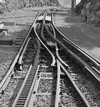
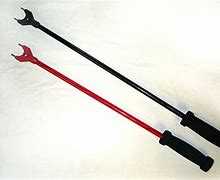

= eco 2020-06-13
:toc:

---

== Elites in Beijing see America in decline, hastened by Trump 词汇解说

(eco 2020-6-13 / China / Chaguan: Pondering America’s election)

Elites 上层集团；（统称）掌权人物，社会精英 in Beijing *see* America *in decline*, *hastened* 促进；使加快 by Trump

But they *are not sure* whether it *would suit* 对（某人）方便；满足（某人）需要；合（某人）心意 China *for* Trump *to be re-elected*

Jun 11th 2020 |

WHOM *WOULD* China *prefer* as America’s next president? That *is* a hard question, without an uplifting 令人振奋的；鼓舞人心的；催人奋进的 answer. In elite circles in Beijing, both President Donald Trump and his rival, Joe Biden, a former vice-president, *are spoken of* with distrust and condescension 傲慢态度；纡尊降贵[表不满]. Rather unusually 不寻常地；意想不到地, both candidates *are* known(a.) quantities 熟知的人或事；已知量;已知变量. Each man *has spent many hours* with President Xi Jinping. During the first term of the Obama administration, when Mr Xi *was* heir-apparent 法定继承人，有确定继承权的人 to the leadership of China with the formal 正式的；合乎规矩的 rank of vice-president, Mr Biden, as his opposite 对面的；另一边的 number, *was tasked with* taking his measure 摸清某人的底细. Visiting China in 2011, Mr Biden *hailed*  赞扬（或称颂）…为…（尤用于报章等） their numerous meetings(n.) in various countries and their “mutual 相互的；彼此的 respect”. Mr Trump *has gone further* 走得更远, *calling* Mr Xi his “very, very good friend”. Few in Beijing *are fooled*. 北京很少有人被愚弄。 Mr Trump and Mr Biden *may share* a capacity for *talking* (and talking) in pursuit(n.)追求；寻找 of a deal. But `主` Mr Xi’s grim 严肃的；坚定的；阴冷的;令人不快的；令人沮丧的;质量低劣；糟糕, security-first worldview `谓` *leaves little room for* foreign friendships, *let alone* 更不用说 with garrulous （尤指在琐事上）饶舌的，唠叨的，喋喋不休的 Americans.

- condescend : /ˌkɑːndɪˈsend/ v.  ( often disapproving ) to do sth that you think it is below your social or professional position to do SYN deign 屈尊；俯就 / *~ to sb* : to behave towards sb as though you are more important and more intelligent than they are （对某人）表现出优越感 +
-> We had to wait almost an hour *before he condescended to see us*. 我们等了几乎一小时, 他才屈尊大驾来见我们。 +
-> When giving a talk, be careful *not to condescend to your audience*. 发表讲话时，注意别对听众表现出高人一等的样子。

- measure : n. [ C ] a way of judging or measuring sth 判断；衡量 +
-> *an accurate measure* of ability 能力的准确评判

- *get/take/have the measure of sb | get/have/take sb's measure* : ( formal ) to form an opinion about sb's character or abilities so that you can deal with them 摸清某人的底细 +
-> After only one game, the chess champion *had the measure of his young opponent*. 仅仅一局过后，国际象棋冠军就摸清了年轻对手的实力。

- 在奥巴马政府的第一个任期内，当时, 习是中国领导层的法定继承人，正式的级别是国家副主席，而拜登作为他的对手，负责摸清他的底细。

- 为了达成一项协议，特朗普和拜登可能都有能力来(以及进行)谈判。

Chinese disdain 鄙视；蔑视；鄙弃 *combines* the political *with* the personal. In the unmarked 无标记的；无记号的 villas, private dining rooms and scholarly retreats(n.)僻静处；隐居处;撤退；退却 where -- when it *suits* them -- well-connected  社会关系优越的 Chinese *sometimes offer opinions to* foreigners, Mr Trump *is called* ignorant(a.)（对某事物）不了解的；无知的；愚昧的；无学识的;很无礼的；十分不懂规矩的, erratic(a.)不规则的；不确定的；不稳定的；不可靠的 and tiresome(a.)讨厌的；令人厌烦的；烦人的, but *not* without his uses. 但也并非毫无用处。 He *is praised for* an apparent indifference(n.)漠不关心；冷淡；不感兴趣；无动于衷 to ideology 意识形态；观念形态. He *is complimented*  赞美；称赞；钦佩 for his reluctance *to condemn* Chinese repression 压制；镇压 in such places as Xinjiang. People *familiar with* the thinking of Chinese generals *assert* 明确肯定；断言, approvingly 赞许地；满意地, *that* Mr Trump *dislikes* military adventures 冒险的刺激；大胆开拓 abroad.

-  disdain  :  /dɪsˈdeɪn/  n. *~ (for sb/sth)* the feeling that sb/sth is not good enough to deserve your respect or attention 鄙视；蔑视；鄙弃 / v.  to think that sb/sth is not good enough to deserve your respect 鄙视；蔑视；鄙弃 +
=> dis-, 不，非，使相反。-dain, 同-dign, 尊贵，词源同dignity, decent.即使不尊贵，蔑视。

- erratic : /ɪˈrætɪk/ a. ( often disapproving ) not happening at regular times; not following any plan or regular pattern; that you cannot rely on SYN unpredictable 不规则的；不确定的；不稳定的；不可靠的 +
=> 来自PIE*ers, 漫游，偏离，引申义错误，词源同error. 即漫游的，偏离的。 +
-> The electricity supply here *is quite erratic*. 这里的电力供应相当不稳定。 +
-> She had learnt to live with his sudden changes of mood and *erratic behaviour*. 她已经学会适应他那变幻莫测的情绪和难以捉摸的行为。

- compliment : [ VN ] /ˈkɒmplɪment/  ~ sb (on sth) to tell sb that you like or admire sth they have done, their appearance, etc. 赞美；称赞；钦佩 +
=> 词源同complement, 补足，完成。原义指完成礼仪，表达尊重，多用于客套性的用语。词义与complement产生了完全的差别。

Chinese leaders initially 开始；最初；起初 *mistook* 误会；误解；看错 Mr Trump for a pragmatic 实用的；讲求实效的；务实的 tycoon, a type they *have met* before. Now he *is called* a narcissist 自我陶醉者,自恋者 who *cares only about* his own interests, *starting with* his re-election. That cynicism 人皆自私论; 愤世嫉俗论; (对事情的成功或人的诚信的) 怀疑;犬儒主义 *informs* 对…有影响;知会；通知；通告 China’s response to the trade war *unleashed* 发泄；突然释放；使爆发 by Mr Trump, with wary （对待人或事物时）小心的，谨慎的，留神的，小心翼翼的 but bipartisan 两党的；涉及两党的 support from members of Congress and some American business lobbies. Plenty of American businessfolk *have swallowed*  吞下；咽下 qualms(n.)（对自己行为的）顾虑，不安 about Mr Trump’s tactics. They *were glad to see* him *press* （被）压，挤，推，施加压力 China *over* its unfair market rules and industrial policies that *promote* local champions *at the expense of* 在牺牲（或损害）…的情况下 foreign firms. *Detecting 发现；查明；侦察出 that* Mr Trump *was more interested in* China’s money *than* in *making* China *change its ways*, officials in Beijing *agreed on* a “phase one” trade deal (*built around* purchases of American commodities 商品). China *has kept that deal alive*, with state companies 国有企业 *buying* shiploads 船只运载量 of soyabeans 大豆 and other goods *even as* the two governments *trade* 互相交换；以物易物 angry words about each other’s handling （形势、人、动物等的）处理，对付，对待 of covid-19, among other issues. China *has yet to fulfil* 实现;履行；执行；符合；具备;使高兴；使满意 its threat *to name* 命名；给…取名;确定；说定；准确陈述 American firms *as* “unreliable entities” (ripe(a.)时机成熟的；适宜的 for punitive 惩罚性的；刑罚的；处罚的 treatment), even after the Trump administration *said* it *would put sanctions on China* for *imposing* a national-security law *on* Hong Kong. Mr Trump’s supporters *would doubtless call* China’s caution 谨慎；小心；慎重 宾补 a tribute （良好效果或影响的）体现，显示 to their president’s tariff-happy toughness  [力] 韧性；强健；有粘性. Maybe. But China *is also buying itself time* 拖延时间. *Satisfying* Mr Trump *has effectively parked* 把…搁置，推迟（在以后的会议上讨论或处理）;停（车）；泊（车） America’s bipartisan 两党的；涉及两党的 demands for structural reforms. That *does not make* Chinese elites *relaxed*, though. They *fret 苦恼；烦躁；焦虑不安 that* Mr Trump *has been “kidnapped” by* the truly ideological China hawks who surround him.

- pragmatic :  /præɡˈmætɪk/ solving problems in a practical and sensible way rather than by having fixed ideas or theories 实用的；讲求实效的；务实的 +
=> 来自拉丁语pragmaticus,熟练的，来自希腊语pragma,实践，行为，来自prassein,去做，行动，可能来自PIE*per,向前，前行，尝试，词源同experiment,peril.

- narcissist  /ˈnɑːrsɪsɪst/ n. 自我陶醉者,自恋者

- unleash : /ʌnˈliːʃ/ v. *~ sth (on/upon sb/sth)* to suddenly let a strong force, emotion, etc. be felt or have an effect 发泄；突然释放；使爆发 +
-> The government's proposals *unleashed a storm of protest* in the press. 政府的提案引发了新闻界的抗议浪潮。

- qualm : /kwɑːm,kwɔːm/ n. *~ (about sth)* a feeling of doubt or worry about whether what you are doing is right （对自己行为的）顾虑，不安 +
=> 来自古英语cwealm,死亡，谋杀，折磨，词源同kill,quell.引申词义有死亡危险的，恐惧的，后词义弱化为顾虑，不安。

- trade : v. to exchange sth that you have for sth that sb else has 互相交换；以物易物 +
-> *to trade secrets/insults/jokes* 互换秘密；对骂；互说笑话

- ripe : a. *~ (for sth)* ready or suitable for sth to happen 时机成熟的；适宜的 +
-> The conditions *were ripe(a.) for social change*. 社会变革的时机已经成熟。

- tribute : n. [ sing. ] *~ to sth/sb* : showing the good effects or influence of sth/sb （良好效果或影响的）体现，显示 +
-> His recovery is *a tribute to the doctors' skill*. 他的康复充分显示了各位医生高超的医术。

- 中国尚未兑现其将美国公司列为“不可靠实体”的威胁，这些实体已经准备好接受惩罚性待遇.

As for 至于,关于,就,就……方面说 Mr Biden, in Beijing he *is called* 被称为 a member of the former ruling 统治的；支配的；占统治地位的 establishment （通常反对变革的）当权派，权势集团；（统称）权威人士 that *saw* economic interdependence 互相依赖 with China *as* a source of stability, not danger. Mr Biden *was* a player in Obama-era campaigns *to seek* China’s help in *tackling* climate change and other global challenges. Yet, in China, there *is* strikingly 显著地，突出地，引人注目地 little nostalgia(n.)怀旧；念旧 for those days. Some *grumble 咕哝；嘟囔；发牢骚 that* such engagement （尤指正式的或与工作有关的）约定，约会，预约;（与…的）密切关系；（对…的）了解 *rested on* 基于；以…为基础; 依靠；依赖 a mistaken American belief that China *would converge （向某一点）相交，会合 politically* with the West *as* it grew richer. Others *recall* 记起；回忆起；回想起 how American politicians *bragged 吹嘘；自吹自擂 that* democracies 民主政体；民主制度 *had* a creative edge （微弱的）优势 that autocratic 独裁的 China *would always lack*. That *is* certainly a favourite 特别受喜爱的 Biden line （戏剧或电影的）台词，对白;（尤指为达到某种目的说的）话，言语, as in 2013 when he *told* Chinese students (*applying for* visas at America’s embassy in Beijing) *that* “innovation *can only occur* when you *can breathe free*.” The view in China *is that* its best scientists and tech firms *are busy* disproving(v.)证明…是错误（或虚假）的 such boasts, *tipping* （使）倾斜，倾倒，翻覆 America *into* a crisis of confidence and anti-China hysteria(n.) 歇斯底里；情绪狂暴不可抑止.

- nostalgia :  /nəˈstældʒə,nɑːˈstældʒə/  => 来自希腊语nostos,回家，家乡，来自PIE*nes,我们，词源同nostrum,our,us.引申词义我们的家，家园，-algia,疾痛，痛苦，词源同neuralgia,myalgia.引申词义思乡，怀旧。

- engagement : *~ (with sb/sth)* ( formal ) being involved with sb/sth in an attempt to understand them/it （与…的）密切关系；（对…的）了解 +
-> Her views are based on years of *engagement with the problems* of the inner city. 她的观点是以多年对市内中心区问题的了解为基础的。

- line : [ C ] ( informal ) a remark, especially when sb says it to achieve a particular purpose （尤指为达到某种目的说的）话，言语 +
=> *Don't give me that line* about having to work late again. 别再跟我说不得不工作到很晚这样的话

- tip : v. [ usually + adv./prep. ] to move so that one end or side is higher than the other; to move sth into this position （使）倾斜，倾倒，翻覆 / [ VN + adv./prep. ] to touch sth lightly so that it moves in a particular direction 轻触；轻碰  +
=> 词源同 top,顶部，顶端。引申词义尖端，尖点，后用于指倾斜，倾覆，倾倒等。 +
-> The boat *tipped to one side*. 船向一边倾斜。

Just as bipartisan opinion in Washington *has coalesced*  合并；联合；结合 around alarm at China’s rise, an elite 社会精英 consensus 一致的意见；共识 *has emerged* in the Chinese capital. Especially in this summer of pandemic and street protests, America *is called* a nation in decline: a rich country *too* 太...而不能 divided, selfish and racist *to keep its citizens safe*. Chinese elites *see* Mr Trump *as* a symptom 症状 and an agent of that decline. State media *long refrained 克制；节制；避免 from* direct attacks on Mr Trump. Not now. The Global Times, a nationalist 民族主义者 tabloid 通俗小报, this month *reported that* Chinese netizens 网民 *mockingly 取笑地；愚弄地 call him* Chuan Jianguo 川建国, or “Build-up-the-country Trump”. Their joke, that he *is* a double-agent 双重间谍 *wrecking* 破坏；损坏；毁坏 America *to make China strong*, *prompts* lines 台词 like “Comrade Chuan Jianguo, *don’t blow 泄露；暴露 your cover*!” *Does* such scorn 轻蔑；鄙视 *mean that* China *wants* Mr Trump *re-elected*? There, elites *are divided*. At root, their debates *turn on* 以…为主题;依靠；依…而定；取决于 two questions: *is* American decline irreversible  无法复原（或挽回）的；不可逆的, and *would* its acceleration  加速；加快 *suit* China just now?

- coalesce : /ˌkoʊəˈles/ v. ~ (into/with sth) ( formal ) to come together to form one larger group, substance, etc. 合并；联合；结合 +
SYN amalgamate +
=> co-,表强调，-al,生长，词源同adult,adolescence.即长到一块。 +
-> The puddles *had coalesced into a small stream*. 地面上水洼子里的水汇流成了一条小溪。 +

- *turn on sth* : [无被动态] to have sth as its main topic 以…为主题 /  (British English) to depend on sth 依靠；依…而定；取决于 +
-> *The discussion turned on* the need to raise standards. 这次讨论的主要议题是, 提高标准的必要性。 +
-> Much *turns on the outcome* of the current peace talks. 事情主要取决于当前和谈的结果。

Two devils 魔鬼；撒旦, both known

In national-security circles （相同兴趣、职业等的人形成的）圈子，阶层，界, many *see* advantages 有利条件；有利因素；优势 to four more years of turbulence, with Mr Trump *weakening democracy at home* and *repelling 推开；赶走；驱除;使恐惧；使厌恶 allies* （尤指从政者的）盟友，支持者; （尤指战时的）同盟国 in Asia and beyond 在另一边；在（或向）更远处；以远. In contrast 相比之下, `主` elites *focused on* the economy `谓` *fear* the premature  未成熟的；过早的；提前的 collapse of a global trading order that *has profited* 获益；得到好处；对…有用（或有益） China *mightily*. That *prods* 戳；杵；捅;催促；督促；鼓动 some *to hanker  渴望，渴求（某事物） for* Mr Biden. Such people *think of him as* a moderate 持温和观点者（尤指政见） who *might slow* economic decoupling （使两事物）分离，隔断;解耦,使脱钩, *giving China time* to diversify(v.)（使）多元化;增加…的品种；从事多种经营；扩大业务范围 and *become* more self-reliant 自立的；自力更生的；自主的. Still another camp *holds that* America’s next government, of whichever 无论哪个；无论哪些 party, *will be filled with* officials *bent 弯曲的 on* 决心要做，一心想做（通常指坏事） *keeping* China *down*, but that Mr Biden’s team *will be* more competent 足以胜任的；有能力的；称职的;有决定权的, and thus more dangerous. Many Biden-sceptics 怀疑论者,持怀疑态度的人(复数) in China *note* 注意；留意;指出；特别提到, with alarm, how the Democrat *has taken to chiding* 批评；指责；责备 Mr Trump *for* being soft on Chinese human-rights abuses. All camps *are united* （为某事）联合，联手，团结 by a bleakly defensive mood. Whoever *becomes* America’s next president, China *does not expect to be* friends.

- prod : /prɑːd/ v. *~ (at) sb/sth* to push sb/sth with your finger or with a pointed object 戳；杵；捅 / *~ sb (into sth/into doing sth)* to try to make sb do sth, especially when they are unwilling 催促；督促；鼓动 / n. （赶牲畜用的）尖棒，刺棒 +
SYN poke +
-> *She prodded him in the ribs* to wake him up. 她用手指杵他的肋部把他叫醒。 +
-> She finally *prodded him into action*. 她终于鼓动他行动起来。 +

- hanker : /ˈhæŋkər/ v. *~ after/for sth* to have a strong desire for sth 渴望，渴求（某事物） +
=> 可能来自hang,悬挂，-er,表反复。引申词义翘首以盼，渴望。 +
-> She *hankered* to go back to Australia. 她渴望回到澳大利亚。

- competent : /ˈkɑːmpɪtənt/  a.  having enough skill or knowledge to do sth well or to the necessary standard 足以胜任的；有能力的；称职的 +
-> *He's very competent* in his work. 他非常胜任自己的工作。 +
/ of a good standard but not very good 合格的；不错的；尚好的 +
/ having the power to decide sth 有决定权的 +
-> The case was referred to *a competent authority*. 事情已交给有关当局处理。

---

== Elites in Beijing see America in decline, hastened by Trump

But they are not sure whether it would suit China for Trump to be re-elected

Jun 11th 2020 |

WHOM WOULD China prefer as America’s next president? That is a hard question, without an uplifting answer. In elite circles in Beijing, both President Donald Trump and his rival, Joe Biden, a former vice-president, are spoken of with distrust and condescension. Rather unusually, both candidates are known quantities. Each man has spent many hours with President Xi Jinping. During the first term of the Obama administration, when Mr Xi was heir-apparent to the leadership of China with the formal rank of vice-president, Mr Biden, as his opposite number, was tasked with taking his measure. Visiting China in 2011, Mr Biden hailed their numerous meetings in various countries and their “mutual respect”. Mr Trump has gone further, calling Mr Xi his “very, very good friend”. Few in Beijing are fooled. Mr Trump and Mr Biden may share a capacity for talking (and talking) in pursuit of a deal. But Mr Xi’s grim, security-first worldview leaves little room for foreign friendships, let alone with garrulous Americans.

Chinese disdain combines the political with the personal. In the unmarked villas, private dining rooms and scholarly retreats where—when it suits them—well-connected Chinese sometimes offer opinions to foreigners, Mr Trump is called ignorant, erratic and tiresome, but not without his uses. He is praised for an apparent indifference to ideology. He is complimented for his reluctance to condemn Chinese repression in such places as Xinjiang. People familiar with the thinking of Chinese generals assert, approvingly, that Mr Trump dislikes military adventures abroad.

Chinese leaders initially mistook Mr Trump for a pragmatic tycoon, a type they have met before. Now he is called a narcissist who cares only about his own interests, starting with his re-election. That cynicism informs China’s response to the trade war unleashed by Mr Trump, with wary but bipartisan support from members of Congress and some American business lobbies. Plenty of American businessfolk have swallowed qualms about Mr Trump’s tactics. They were glad to see him press China over its unfair market rules and industrial policies that promote local champions at the expense of foreign firms. Detecting that Mr Trump was more interested in China’s money than in making China change its ways, officials in Beijing agreed on a “phase one” trade deal built around purchases of American commodities. China has kept that deal alive, with state companies buying shiploads of soyabeans and other goods even as the two governments trade angry words about each other’s handling of covid-19, among other issues. China has yet to fulfil its threat to name American firms as “unreliable entities” ripe for punitive treatment, even after the Trump administration said it would put sanctions on China for imposing a national-security law on Hong Kong. Mr Trump’s supporters would doubtless call China’s caution a tribute to their president’s tariff-happy toughness. Maybe. But China is also buying itself time. Satisfying Mr Trump has effectively parked America’s bipartisan demands for structural reforms. That does not make Chinese elites relaxed, though. They fret that Mr Trump has been “kidnapped” by the truly ideological China hawks who surround him.

As for Mr Biden, in Beijing he is called a member of the former ruling establishment that saw economic interdependence with China as a source of stability, not danger. Mr Biden was a player in Obama-era campaigns to seek China’s help in tackling climate change and other global challenges. Yet, in China, there is strikingly little nostalgia for those days. Some grumble that such engagement rested on a mistaken American belief that China would converge politically with the West as it grew richer. Others recall how American politicians bragged that democracies had a creative edge that autocratic China would always lack. That is certainly a favourite Biden line, as in 2013 when he told Chinese students applying for visas at America’s embassy in Beijing that “innovation can only occur when you can breathe free.” The view in China is that its best scientists and tech firms are busy disproving such boasts, tipping America into a crisis of confidence and anti-China hysteria.

Just as bipartisan opinion in Washington has coalesced around alarm at China’s rise, an elite consensus has emerged in the Chinese capital. Especially in this summer of pandemic and street protests, America is called a nation in decline: a rich country too divided, selfish and racist to keep its citizens safe. Chinese elites see Mr Trump as a symptom and an agent of that decline. State media long refrained from direct attacks on Mr Trump. Not now. The Global Times, a nationalist tabloid, this month reported that Chinese netizens mockingly call him Chuan Jianguo, or “Build-up-the-country Trump”. Their joke, that he is a double-agent wrecking America to make China strong, prompts lines like “Comrade Chuan Jianguo, don’t blow your cover!” Does such scorn mean that China wants Mr Trump re-elected? There, elites are divided. At root, their debates turn on two questions: is American decline irreversible, and would its acceleration suit China just now?

Two devils, both known

In national-security circles, many see advantages to four more years of turbulence, with Mr Trump weakening democracy at home and repelling allies in Asia and beyond. In contrast, elites focused on the economy fear the premature collapse of a global trading order that has profited China mightily. That prods some to hanker for Mr Biden. Such people think of him as a moderate who might slow economic decoupling, giving China time to diversify and become more self-reliant. Still another camp holds that America’s next government, of whichever party, will be filled with officials bent on keeping China down, but that Mr Biden’s team will be more competent, and thus more dangerous. Many Biden-sceptics in China note, with alarm, how the Democrat has taken to chiding Mr Trump for being soft on Chinese human-rights abuses. All camps are united by a bleakly defensive mood. Whoever becomes America’s next president, China does not expect to be friends.

---

== The shifting ground 词汇解说

(eco 2020-6-13 / United States / Police reform: The shifting ground)

[In America] protests *have already brought* policy *changes*

Congress 国会，议会, cities and states *have all suggested changes* since George Floyd’s killing

Jun 11th 2020 | WASHINGTON, DC

FOR YEARS, reformers 改革者；改良者；改造者 *have advocated* 拥护；支持；提倡 a host of policies to make police more accountable to the people they serve, to little avail. But over the past two weeks, police have made better cases for reform than advocates ever could by brutalising journalists and peaceful protesters in broad daylight. Across America the political ground has shifted, as legislators long reluctant to take on the police have started to act.

On June 8th House Democrats unveiled a sweeping reform bill, which would, among other things, make prosecuting and suing police easier, create a national registry of police-misconduct complaints, mandate more extensive data collection, ban chokeholds for federal officers and no-knock warrants in federal drug cases (and require state and local agencies which want federal grant money to do the same) and limit the transfer of military equipment to police. Democrats plan to bring the bill up for a vote by the end of June.

Congressional Republicans, meanwhile, say they are working on their own reform proposal. Tim Scott, the Senate’s lone black Republican and a longtime advocate for police reform, proposed requiring states to report data on no-knock warrants and deadly use of force and increasing funding for body cameras and for hiring “officer candidates who have racial and ethnic characteristics similar to their community”.

While legislators in Washington talk, some in cities and states have acted (as they should: most of America’s 18,000 law-enforcement agencies are locally governed). Many police departments have banned or restricted chokeholds and “carotid restraints”—the neck-compression technique that killed George Floyd—though without clear consequences the bans risk being hortatory and ultimately ignored.

The New York Police Department has banned chokeholds since 1993, and that did not stop officer Daniel Pantaleo from choking Eric Garner to death in 2014. So on June 8th New York’s legislature created the crime of “aggravated strangulation”, punishable by up to 15 years in prison, for officers whose chokehold “or similar restraint” kills or seriously injures someone.

New York is also poised to pass bills creating an investigative office to look into deaths caused by police officers, requiring courts to publish racial and demographic data on low-level offenders, requiring state-police to wear cameras and repealing a statute that shielded officers’ disciplinary records from the public. Washington, DC’s city council has passed measures that forbid the police department from hiring officers with a history of misconduct and require it to disclose the names of any officers who use force.

More radical measures, such as defunding—which in practice can mean something less alarming, like rethinking how police departments function and redirecting some of their budgets—are also getting a hearing. Minneapolis’s city council vowed to disband the city’s police department, though how, when and what might replace it remain unclear. And the mayors of Los Angeles and New York said they would take money from police budgets for social-service programmes.

Along with this flurry of activity have come two important cultural shifts. First, the shares of Americans who support Black Lives Matter and believe that police treat whites better than African-Americans have soared. Second, prosecutors have shed some of their traditional reluctance to go after the police, and have charged officers in several cities who were caught on camera assaulting unarmed people. Perhaps this shift is temporary. Or perhaps a lot of Americans have seen officers act as if they are above the law, and they do not like it.

---

== The shifting ground

In America protests have already brought policy changes

Congress, cities and states have all suggested changes since George Floyd’s killing

Jun 11th 2020 | WASHINGTON, DC

FOR YEARS, reformers have advocated a host of policies to make police more accountable to the people they serve, to little avail. But over the past two weeks, police have made better cases for reform than advocates ever could by brutalising journalists and peaceful protesters in broad daylight. Across America the political ground has shifted, as legislators long reluctant to take on the police have started to act.

On June 8th House Democrats unveiled a sweeping reform bill, which would, among other things, make prosecuting and suing police easier, create a national registry of police-misconduct complaints, mandate more extensive data collection, ban chokeholds for federal officers and no-knock warrants in federal drug cases (and require state and local agencies which want federal grant money to do the same) and limit the transfer of military equipment to police. Democrats plan to bring the bill up for a vote by the end of June.

Congressional Republicans, meanwhile, say they are working on their own reform proposal. Tim Scott, the Senate’s lone black Republican and a longtime advocate for police reform, proposed requiring states to report data on no-knock warrants and deadly use of force and increasing funding for body cameras and for hiring “officer candidates who have racial and ethnic characteristics similar to their community”.

While legislators in Washington talk, some in cities and states have acted (as they should: most of America’s 18,000 law-enforcement agencies are locally governed). Many police departments have banned or restricted chokeholds and “carotid restraints”—the neck-compression technique that killed George Floyd—though without clear consequences the bans risk being hortatory and ultimately ignored.

The New York Police Department has banned chokeholds since 1993, and that did not stop officer Daniel Pantaleo from choking Eric Garner to death in 2014. So on June 8th New York’s legislature created the crime of “aggravated strangulation”, punishable by up to 15 years in prison, for officers whose chokehold “or similar restraint” kills or seriously injures someone.

New York is also poised to pass bills creating an investigative office to look into deaths caused by police officers, requiring courts to publish racial and demographic data on low-level offenders, requiring state-police to wear cameras and repealing a statute that shielded officers’ disciplinary records from the public. Washington, DC’s city council has passed measures that forbid the police department from hiring officers with a history of misconduct and require it to disclose the names of any officers who use force.

More radical measures, such as defunding—which in practice can mean something less alarming, like rethinking how police departments function and redirecting some of their budgets—are also getting a hearing. Minneapolis’s city council vowed to disband the city’s police department, though how, when and what might replace it remain unclear. And the mayors of Los Angeles and New York said they would take money from police budgets for social-service programmes.

Along with this flurry of activity have come two important cultural shifts. First, the shares of Americans who support Black Lives Matter and believe that police treat whites better than African-Americans have soared. Second, prosecutors have shed some of their traditional reluctance to go after the police, and have charged officers in several cities who were caught on camera assaulting unarmed people. Perhaps this shift is temporary. Or perhaps a lot of Americans have seen officers act as if they are above the law, and they do not like it.

将地面
在美国，抗议活动已经带来了政策的改变
自从乔治·弗洛伊德被杀后，国会、城市和州都建议进行改革
2020年6月11日|华盛顿特区
多年来，改革者们一直在倡导一系列政策，让警察对他们所服务的人民更加负责，但收效甚微。但在过去的两周里，警察在光天化日之下残暴地对待记者和和平抗议者，这比倡导改革的人更有说服力。随着长期不愿与警方对着干的立法者开始行动，整个美国的政治基础已经发生了变化。
6月8日众议院民主党公布了一项全面的改革法案,这将,除此之外,简化起诉,起诉警察,创建一个国家注册警察不当行为的投诉,要求更广泛的数据收集、禁止上打起联邦官员和强行闯入权证在联邦毒品案件,要求州和地方机构希望联邦资金来做同样的事),限制向警方军事设备的转移。民主党人计划在6月底之前对该法案进行投票。
与此同时，国会共和党人表示，他们正在制定自己的改革方案。蒂姆·斯科特,参议院的孤独的黑人共和党和长期提倡警察改革提议要求状态报告数据不敲门认股权证和致命的使用武力和增加资金的身体相机和招聘“官候选人有种族和民族的特征类似于他们的社区”。
当华盛顿的立法者们还在谈论的时候，一些城市和州已经采取了行动(正如他们应该做的那样:美国18000个执法机构中的大部分是由地方管理的)。许多警察部门已经禁止或限制了扼颈和“颈动脉限制”(杀死乔治·弗洛伊德的颈动脉限制技术)，尽管这些禁令没有明确的后果，但可能会被当作劝告，最终被忽视。
纽约警察局自1993年开始禁止扼喉，但这并没有阻止丹尼尔·潘塔莱奥(Daniel Pantaleo)警官在2014年掐死埃里克·加纳(Eric Garner)。因此，6月8日，纽约立法机构设立了“严重勒死”罪，对掐住喉咙或类似的勒死“致人死亡或严重伤害”的警官处以15年监禁。
纽约州还准备通过法案，设立一个调查办公室，调查警察造成的死亡，要求法院公布低级违法者的种族和人口数据，要求州警察佩戴摄像头，并废除一项保护警察纪律记录不让公众看到的法规。华盛顿特区的市议会已经通过了一些措施，禁止警察局雇佣有不当行为历史的警官，并要求其公开任何使用暴力的警官的姓名。
更激进的措施，如减少资金——在实践中可能意味着一些不那么令人担忧的事情，如重新思考警察部门如何运作和重新分配他们的一些预算——也得到了关注。明尼阿波里斯市议会誓言解散该市的警察局，但解散的方式、时间和方式仍不清楚。洛杉矶和纽约的市长表示，他们将从警察预算中提取资金用于社会服务项目。
伴随这一热潮而来的是两种重要的文化转变。首先，支持黑人生命重要、认为警察对待白人比非洲裔美国人更好的美国人的比例大幅上升。其次，检察官已经摆脱了传统上不愿追究警察的态度，已经对几个城市的警察提出了指控，这些警察被拍摄到袭击手无寸铁的人。也许这种转变是暂时的。或许很多美国人看到过警察的行为似乎他们凌驾于法律之上，但他们并不喜欢。

