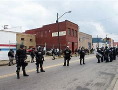
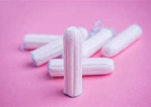
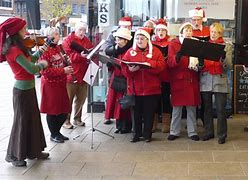
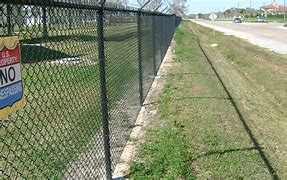
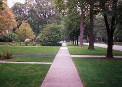
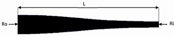

= eco 2020-06-13
:toc:

---

== No justice 公平；公正, no peace

(eco 2020-6-13 / United States / The protests: No justice, no peace)

America’s protests *turn* jubilant  喜气洋洋的；欢欣鼓舞的；欢呼雀跃的

Democrats 民主党人 *are not organising* them, but they do *stand*  位于（某处）; 处于（某种状态或情形）to gain 获得；赢得；博得；取得

Jun 11th 2020 | WASHINGTON, DC

- jubilant :/ˈdʒuːbɪlənt/ a. feeling or showing great happiness because of a success 喜气洋洋的；欢欣鼓舞的；欢呼雀跃的 +
=> 来自拉丁语jubilare,呼喊，呼叫，呼朋引伴，来自PIE*yu,欢乐的叫声，呼喊。引申词义欢乐的，喜气扬扬的。

- 民主党人没有组织抗议者，但民主党人肯定会从中获益

A WEEK AFTER the Trump administration *ordered* riot 暴乱；骚乱 police 防暴警察 *to charge* 猛攻；猛冲；冲锋 a peaceful crowd in Lafayette Square, it *was transformed*. The leafy 多叶的；叶茂的 park in front of the White House *was enclosed* by a steel fence 栅栏；篱笆；围栏, through which police *could be seen* loitering(v.)闲站着；闲荡；徘徊. The streets alongside it -- *including* newly named “Black Lives *Matter* Plaza”, at the bottom 尽头 of 16th Street, in direct view of the White House -- *had been colonised*  在（某国家或地区）建立殖民地；移民于（殖民地）;(动植物)在（某一地区）聚居，大批生长 by protesters and *were* far more fun.

- loiter :  /ˈlɔɪtər/  [ V ] to stand or wait somewhere especially with no obvious reason 闲站着；闲荡；徘徊 +
=> 来自Proto-Germanic*lutana,弯腰，蹲下，休息，来自PIE*leud,蜷缩，变小，词源同lout,little.引申词义休息，逗留，停留。 +
-> Unemployed young men loiter at the entrance of the factory. 失业的年轻人在工厂门口游荡。 +

- Black Lives Matter Plaza "黑人的生命也是重要的"广场 +
6月5日，首都华盛顿的女市长缪里尔·鲍泽(Muriel Bowser）突然下令，将白宫北门外的一段路，正式命名为：Black Lives Matter Plaza.

Late into the sultry 闷热的 evening, `主` the chanting 重复的话语;反复地说;吟诵; 唱圣歌 throng 一大群人 that *had filled* the plaza for much of the day -- and most days since George Floyd’s murder 谋杀；凶杀 -- `谓` *was winding down* 喘口气；喘息一下; 慢下来后停住. Black musicians 音乐家；作曲家；乐师 and street artists *performed for* a thinning 稀少的；稀疏的 crowd. A young woman *had set up* a stall 货摊，摊位，售货亭（尤指集市上的） *offering* free deodorants 除臭剂，解臭剂（用于消除体臭）, tampons （妇女用的）月经棉条，卫生栓 and fruit: “*Take* what you need -- just *know* you are loved,” she *carolled* 欢乐地唱,说. Well-wishers （以行动）表示祝愿者 *ambled* 缓行；漫步 along the fence-line 警戒线；栅栏线, *perusing* 细读；研读 the banners  横幅, drawings 图画；素描画  and personal messages *plastering* 贴满，遍贴（画片或招贴画） it.

- sultry :  /ˈsʌltri/ a.  ( of the weather or air 天气或空气 ) very hot and uncomfortable 闷热的 / ( formal ) ( of a woman or her appearance 女子或其外表 ) sexually attractive; seeming to have strong sexual feelings 姿色迷人的；风情万种的；性感的 +
=> 来自 swelter,闷热，-y,形容词后缀。用于比喻义形容女子性感的，风情万种的等。

- chant : V-T/V-I If you chant something or if you chant, you repeat the same words over and over again. 反复地说 +
->  Demonstrators *chanted slogans*. 示威者们反复地喊着口号。

- 广场上高呼口号的人群活动, 正逐渐平息。

- wind : /waɪnd/   v. ( of a road, river, etc. 路、河等 ) to have many bends and twists 蜿蜒；曲折而行；迂回 / *~ (sth) (up)* to make a clock or other piece of machinery work by turning a knob , handle, etc. several times; to be able to be made to work in this way 给（钟表等）上发条；通过转动把手等操作；可上发条；可通过转动把手（等）操作

- *WIND DOWN* (1) ( of a person 人 ) to rest or relax after a period of activity or excitement 喘口气；喘息一下 SYN unwind / (2) ( of a piece of machinery 机器 ) to go slowly and then stop 慢下来后停住

- deodorant : /diːˈoʊdərənt/ [ CU ] a substance that people put on their bodies to prevent or hide unpleasant smells 除臭剂，解臭剂（用于消除体臭） +
=> de-, 向下，除去。odor, 气味。

- tampon :  /ˈtæmpɑːn/  a specially shaped piece of cotton material that a woman puts inside her vagina to absorb blood during her period （妇女用的）月经棉条，卫生栓 +
=> 来自中古法语 tampon,塞子，栓子，词源同 tap,水龙头。比喻用法。 +

- carol :  /ˈkærəl/  [ V ] [ VN V speech ] to sing sth in a cheerful way 欢乐地唱 +
=> 来自PIE *gher, 围，围场。词源同chorus, garden. 原指围成一圈唱歌，庆祝。 +
词源上它是个复合词，其中car-来自希腊语khoros（合唱），单词chorus（合唱）也来源于此；-ol 来自表“吹笛”的希腊语词；字面本义是“为合唱舞蹈伴奏的吹笛者”。对于chorus（合唱），词根chor指“围合”，如简单同源词court（庭院），这里涉及到ch、c音变关系。 +

- amble : [ V + adv./prep. ] to walk at a slow relaxed speed 缓行；漫步 +
=> 前缀ambi-, 两边，周围。周围走走。 +
源于拉丁语ambulare‘to walk’（走），辞书释义为“从容漫步”、“骑马缓行”或“（马）缓行”。英语还有几个词也源自这个拉丁词，如ambulance（救护车），ambulatory（不需卧床的，能走动的），perambulator（婴儿车）等。(参见ambulance)

- fence-line +

They *offer* a cultural history of America’s recent decades of racial injustice 不公正，不公平（的对待或行为）, including prayers for many of its victims. “I’m still *crying for* Emmett Till”, *read* 写着；写成 one note *decorated with hearts*, beside a sketch of the 14-year-old child *lynched* 用私刑处死（被认为有罪的人，通常为绞刑） in 1955. They also included more overtly 明显地；公开地，公然地 political messages, such as “*Who do you call* （给…）打电话 when the police *murders*?” and, *in reference to* （所述内容）关于 the White House’s well-guarded chief resident, “Bunker 地堡；掩体 bitch 母狗; 泼妇；讨厌的女人”.

- lynch : /lɪntʃ/ [ VN ] if a crowd of people lynch sb whom they consider guilty of a crime, they capture them, do not allow them to have a trial in court, and kill them illegally, usually by hanging 用私刑处死（被认为有罪的人，通常为绞刑） +
=> 缩写自Lynch law,私刑法。词源有多种版本，其中一个版本是1780年美国弗吉利亚州某小镇治安长官William Lynch,因经常私自拘禁，惩罚，处死犯人而被人所知。

This potpourri also *reflects* the diffuse 弥漫的；扩散的；漫射的 and largely spontaneous 自发的；非筹划安排的 nature of the protests. A minority  少数；少数派；少数人, especially in the early days after Mr Floyd’s death, *have seen* violence, first by protesters, then increasingly also by the police (though *it is not clear that* any of this *was caused by* the shadowy anarcho 无政府主义者;无政府状态-leftists 左派分子 (William Barr, the attorney 律师 general 司法部长, *has pointed to*)). The vast majority of the multiracial 多种族的 gatherings *have been* peaceful, however. Many *have been organised* by groups of friends and neighbours in small towns. By one count （某物质在某物或面积中）量的计数;计算（或清点）总数 there *have been* protests in 1,280 places -- including *such* hotbeds of left-wing militancy 战斗性；交战状态 *as* Sister Bay, Wisconsin, and Sheridan, Wyoming.

- potpourri :  /ˌpoʊpʊˈriː/  n. [ sing. ] a mixture of various things that were not originally intended to form a group 杂烩；集锦 / [ UC ] a mixture of dried flowers and leaves used for making a room smell pleasant 百花香（房间熏香用的干花和叶子的混合物） +
=> 来自法语pot pourri,炖罐，肉罐，来自拉丁语putere,腐烂，变烂，词源同putrefy.一种比喻用法，用于形容各种肉在一起乱炖，引申词义大杂烩，集锦，后用于指百花香囊。 +
-> a potpourri of tunes 乐曲集锦 +

- 这一大杂烩也反映了抗议活动具有的"扩散性"和"基本上是自发的"的性质。少数人，尤其是在弗洛伊德死后的早期，目睹了暴力，这些暴力先是由抗议者引起，然后是由越来越多的警察带来(尽管尚不清楚这些暴力活动, 是否由司法部长威廉·巴尔(William Barr)所指出的神秘的无政府左翼分子, 所造成的)。然而，绝大多数的多种族集会都是和平的。许多是由小镇上的朋友和邻居组织起来的。据一项统计，已有1280个地方发生了抗议活动，其中包括左翼激进分子的温床地点，如威斯康辛州的姊妹湾, 和怀俄明州的谢里登。

In big cities such as Washington, DC, black activist groups *have played a significant organising role*. Many *are* members of a national coalition （尤指多个政治团体的）联合体，联盟, the Movement for Black Lives, which *was formed* in 2014 and *has* 150 constituent 组成的；构成的 parts. Its best-known, Black Lives Matter (BLM), which *came to* prominence(n.)重要；突出；卓越；出名) over police killings during Barack Obama’s second term, *has been* especially influential, in part by *rallying* 召集；集合 left-leaning whites, whose mass participation in these protests *is* their most novel 新颖的；与众不同的；珍奇的 feature. “The political weather *has shifted*,” *says* Makia Green of Black Lives Matter DC, “We now *have* widespread multiracial, multi-generation support.”

- rally  :  /ˈræli/  v. *~ (sb/sth) (around/behind/to sb/sth)* to come together or bring people together in order to help or support sb/sth 召集；集合 +
=> re-(e省略)再+ al-加强 + -ly-捆 → 再度捆在一起 +
-> The cabinet *rallied behind* the Prime Minister. 内阁团结一致支持首相。

A broader growth of centre-left activism (during Mr Trump’s tenure  （尤指重要政治职务的）任期，任职) *has probably also played a role*. Much of it *is rooted* in the Women’s March that *drew* millions onto the streets [shortly after the president’s inauguration 就职典礼] *to protest against* misogyny 厌女症; 女人嫌忌. Indeed, `主` some of the many grassroots groups *spawned* 引发；引起；导致；造成;产卵 by that protest `谓` *have been involved in* organising(v.) demonstrations 集会示威；游行示威 in recent days. `主` One such (in Pennsylvania, a state-wide (美国)全州范围的; 遍及全州的 organisation *called* Pennsylvania Stands Up, which *campaigns* 从事运动 on voting rights, immigration reform, racial justice and other centre-left issues), `谓` *helped* boost(v.) turnout 投票人数;出席人数；到场人数 and *marshal* 结集；收集；安排;控制人群；组织；维持秩序 crowds in Lancaster and Philadelphia.

- 在特朗普任期内，中左翼激进主义的更广泛发展可能也起到了一定作用。这在很大程度上源于妇女游行，在总统就职后不久，吸引了数百万人走上街头抗议歧视女性。事实上，抗议活动催生的许多草根团体中, 一些团体最近参与了组织示威活动。在宾夕法尼亚州，一个名为“宾夕法尼亚站起来”的组织遍布全州，他们致力于对"投票权、移民改革、种族公正和其他中左翼议题"展开运动，帮助提高兰开斯特和费城的投票率, 并召集人群。

- tenure :  /ˈtenjər/  n. the period of time when sb holds an important job, especially a political one; the act of holding an important job （尤指重要政治职务的）任期，任职 +
=> -ten-握,持有 + -ure名词词尾

- inaugurate : /ɪˈnɔːɡjəreɪt/ v. *~ sb (as sth)* to introduce a new public official or leader at a special ceremony 为（某人）举行就职典礼 +
-> He will *be inaugurated (as) President* in January. 他将于一月份就任总统。

- misogyny : /mɪˈsɑːdʒɪni/ N-UNCOUNT Misogyny is a strong dislike of women. 厌女症; 女人嫌忌 +
=> From Ancient Greek μισογυνία ‎(misogunía) and μισογύνης ‎(misogúnēs, “woman hater”), from μισέω ‎(miséō, “I hate”) + γυνή ‎(gunḗ, “woman”); synchronically, miso- +‎ -gyny.

- marshal : v. to gather together and organize the people, things, ideas, etc. that you need for a particular purpose 结集；收集；安排 /
-> T hey *have begun marshalling forces* to send relief to the hurricane victims.  + 他们已经开始结集队伍将救济物资, 送给遭受飓风侵害的灾民。 +
-> Police were brought *in to marshal the crowd*. 警察奉命来维持秩序

Where *is* this *headed*? 这将走向何方? Perhaps *not to* the radical reforms (many of the protesters *demand*). The current Congress *has passed* little *except* coronavirus stimuli 刺激；刺激物；促进因素. It is not about *to start* defunding(v.) the police. Yet academic research into the long-term political effects of the Women’s March and Tea Party movement of 2009 *suggests* such protests *do not merely reflect* public opinion. They *also increase* voter （尤指政治性选举的）投票人，选举人，有选举权的人 turnout 投票人数;出席人数；到场人数. That *sounds like* more bad news for the president’s overwhelmingly white voting base. 白人选民基础

“A lot of people who don’t normally vote(v.) *say* they’re going to vote(v.) now,” said Elena, a Hispanic  西班牙的；西班牙语国家（尤指拉丁美洲）的 property manager from Fairfax, Virginia, who *had spent a long hot day* at the plaza, “to be part of history” with her daughter and black boyfriend. “People *can argue 争论；争吵；争辩 about* whichever party is better for this or that,” she said. “But on this issue, it’s completely clear.”

---

== No justice, no peace

America’s protests turn jubilant

Democrats are not organising them, but they do stand to gain

Jun 11th 2020 | WASHINGTON, DC

A WEEK AFTER the Trump administration ordered riot police to charge a peaceful crowd in Lafayette Square, it was transformed. The leafy park in front of the White House was enclosed by a steel fence, through which police could be seen loitering. The streets alongside it—including newly named “Black Lives Matter Plaza”, at the bottom of 16th Street, in direct view of the White House—had been colonised by protesters and were far more fun.

Late into the sultry evening, the chanting throng that had filled the plaza for much of the day—and most days since George Floyd’s murder—was winding down. Black musicians and street artists performed for a thinning crowd. A young woman had set up a stall offering free deodorants, tampons and fruit: “Take what you need—just know you are loved,” she carolled. Well-wishers ambled along the fence-line, perusing the banners, drawings and personal messages plastering it.

They offer a cultural history of America’s recent decades of racial injustice, including prayers for many of its victims. “I’m still crying for Emmett Till”, read one note decorated with hearts, beside a sketch of the 14-year-old child lynched in 1955. They also included more overtly political messages, such as “Who do you call when the police murders?” and, in reference to the White House’s well-guarded chief resident, “Bunker bitch”.

This potpourri also reflects the diffuse and largely spontaneous nature of the protests. A minority, especially in the early days after Mr Floyd’s death, have seen violence, first by protesters, then increasingly also by the police (though it is not clear that any of this was caused by the shadowy anarcho-leftists William Barr, the attorney general, has pointed to). The vast majority of the multiracial gatherings have been peaceful, however. Many have been organised by groups of friends and neighbours in small towns. By one count there have been protests in 1,280 places—including such hotbeds of left-wing militancy as Sister Bay, Wisconsin, and Sheridan, Wyoming.

In big cities such as Washington, DC, black activist groups have played a significant organising role. Many are members of a national coalition, the Movement for Black Lives, which was formed in 2014 and has 150 constituent parts. Its best-known, Black Lives Matter (BLM), which came to prominence over police killings during Barack Obama’s second term, has been especially influential, in part by rallying left-leaning whites, whose mass participation in these protests is their most novel feature. “The political weather has shifted,” says Makia Green of Black Lives Matter DC, “We now have widespread multiracial, multi-generation support.”

A broader growth of centre-left activism during Mr Trump’s tenure has probably also played a role. Much of it is rooted in the Women’s March that drew millions onto the streets shortly after the president’s inauguration to protest against misogyny. Indeed, some of the many grassroots groups spawned by that protest have been involved in organising demonstrations in recent days. One such in Pennsylvania, a state-wide organisation called Pennsylvania Stands Up, which campaigns on voting rights, immigration reform, racial justice and other centre-left issues, helped boost turnout and marshal crowds in Lancaster and Philadelphia.

Where is this headed? Perhaps not to the radical reforms many of the protesters demand. The current Congress has passed little except coronavirus stimuli. It is not about to start defunding the police. Yet academic research into the long-term political effects of the Women’s March and Tea Party movement of 2009 suggests such protests do not merely reflect public opinion. They also increase voter turnout. That sounds like more bad news for the president’s overwhelmingly white voting base.

“A lot of people who don’t normally vote say they’re going to vote now,” said Elena, a Hispanic property manager from Fairfax, Virginia, who had spent a long hot day at the plaza, “to be part of history” with her daughter and black boyfriend. “People can argue about whichever party is better for this or that,” she said. “But on this issue, it’s completely clear.”

---

== Model voters 词汇解说

(eco 2020-6-13 / United States / The presidential campaign: Model voters)

*Meet* our US 2020 election-forecasting model

In early June, it gives Donald Trump a one-in-five shot(n.)尝试；努力 at re-election

Jun 11th 2020 |

- shot : n. [ Cusually sing. ] *~ (at sth/at doing sth)* ( informal ) the act of trying to do or achieve sth 尝试；努力 +
-> I've never produced a play before *but I'll have a shot at it*. 我从来没有写过戏剧，不过我要尝试一下。

- 唐纳德·特朗普有五分之一的机会获得连任

FOUR MONTHS ago, Donald Trump’s odds （事物发生的）可能性，概率，几率，机会 of *winning* a second term *had never looked better*. After an easy acquittal(n.)宣告无罪；无罪的判决 in his impeachment 弹劾; 控告 trial, his approval rating *had reached its highest level* in three years, and *was approaching* the upper 较高的 (部位)-40s range that *delivered* 递送；传送；交付；运载 re-election *to* George W. Bush and Barack Obama. Unemployment *was* at a 50-year low, *setting him up* 使更健康（或强壮、活泼等） *to take credit 赞扬；称赞；认可 for* a strong economy. And Bernie Sanders, a self-described 自我描述的 socialist 社会主义者, *had won* the popular vote in each of the first three Democratic primary 最初的；最早的 contests  比赛；竞赛.

- *set sb up* : ① to provide sb with the money that they need in order to do sth 资助，经济上扶植（某人）  +
-> A bank loan helped *to set him up in business*.
他靠一笔银行贷款做起了生意。 +
② (informal) to make sb healthier, stronger, more lively, etc. 使更健康（或强壮、活泼等） +
-> The break from work really *set me up for the new year*. 放下工作稍事休息，的确使我更有精力在新的一年大干一场了。 +
③ (informal) to trick sb, especially by making them appear guilty of sth 诬陷，冤枉（某人）；栽赃 +
-> He denied the charges, saying *the police had set him up*. 他否认那些指控，说警察冤枉他了。

- credit : n. *~ (for sth)* praise or approval because you are responsible for sth good that has happened 赞扬；称赞；认可 +
-> We did all the work and *she gets all the credit*! 工作都是我们干的，而功劳却都归了她！ +
-> At least *give him credit for trying* (= praise him because he tried, even if he did not succeed) . 至少该表扬他尝试过。

- 四个月前，唐纳德•特朗普(Donald Trump)赢得第二任期的几率看起来从未如此之高。在弹劾审判中被轻松宣判无罪后，他的支持率达到了三年来的最高水平，接近40以上的区间，正是这一区间让乔治•w•布什(George W. Bush)和巴拉克•奥巴马(Barack Obama)得以连任。失业率达到了50年来的最低水平，这使得他将经济的强劲表现归功于自己。自称社会主义者的伯尼•桑德斯(Bernie Sanders)在前三场民主党初选中都赢得了普选。

- 4月8日，美国佛蒙特州独立参议员伯尼·桑德斯向其竞选团队成员宣布，退出美国总统大选. 在今年美国大选民主党初选中，桑德斯初期表现良好，纷纷拿下新罕布什尔州、内华达州等初选，但随后在“超级星期二”多州初选接连失利于前副总统拜登，随后，多名候选人在退选之后也转为支持拜登，让桑德斯感到大势已去。 +
伯尼·桑德斯宣布退出民主党总统初选，这意味着意味着前副总统乔·拜登（Joe Biden）提前4个月获得民主党党内提名，将在11月大选中作为民主党候选人, 挑战现任共和党总统特朗普。

But even by Mr Trump’s frenetic 发狂似的；狂乱的 standards, the tumble （使）跌倒，摔倒，滚落，翻滚下来;（价格或数量）暴跌，骤降 in his political stock since then *has been* remarkably abrupt(a.) 突然的；意外的. First, Joe Biden, Barack Obama’s moderate 温和的；不激烈的；不偏激的 and well-liked  受人喜爱的; 受欢迎的 vice-president, *pulled off* 做成，完成（困难的事情） a comeback 复出；重返；再度受欢迎 for the ages, *surging from* the verge(n.)濒于；接近于；行将;（路边的）小草地，绿地 of dropping out 不再参加；退出；脱离 *to* presumptive 很可能的；假设的；推断的 nominee 被提名人；被任命者. Then covid-19 *battered*  连续猛击；殴打 America, *claiming* at least 110,000 lives and 30m jobs. And just when deaths from the virus *began to taper off* （数量、程度等）逐渐减少, `主` protests *sparked* by the killing of George Floyd `谓` *convulsed* （因笑、生气等）全身抖动;使痉挛（或抽筋）；（身体）震动（或抖动） cities across America. Mr Trump’s callous 冷酷无情的；无同情心的；冷漠的 response *has widened* the empathy(n.)同感；共鸣；同情 gap *separating* him *from* Mr Biden *into* a chasm （地上的）深裂口，裂隙，深坑;（两个人或团体之间的）巨大分歧，显著差别.

- frenetic : a.  /frəˈnetɪk/ involving a lot of energy and activity in a way that is not organized 发狂似的；狂乱的 +
=> 来自希腊语phren, 脑，思维，词源同frenzy, phrenology. 即大脑思维出问题的，发狂的。 +
-> ...*the frenetic pace of life* in New York. …纽约迅捷狂乱的生活节奏。 +

- *pull sth off* : (informal) to succeed in doing sth difficult 做成，完成（困难的事情） +
-> We *pulled off the deal*. 我们做成了这笔交易。

- *pull off | pull off sth*  : (of a vehicle or its driver 车辆或司机) to leave the road in order to stop for a short time 驶向路边短暂停车

- verge :  /vɜːrdʒ/ ( BrE ) a piece of grass at the edge of a path, road, etc. （路边的）小草地，绿地 /
*on/to the verge of sth/of doing sth* : very near to the moment when sb does sth or sth happens 濒于；接近于；行将 +
=> 经由古法语verge来源于拉丁语virga(杆);“边缘”的意义来自于(英国)皇家总管大臣的土地裁判权,“权杖”是此权利的象征。作“接近,濒临”时,来源于拉丁语动词vergere(弯曲,倾斜)。 同源词：verger, virgule; converge, diverge +
-> He was *on the verge of tears*. 他差点儿哭了出来。 +

- taper : v. to become gradually narrower; to make sth become gradually narrower （使）逐渐变窄 +
=> 来自古英语 taper,灯芯，蜡烛，异化自拉丁语 papyrus,纸莎草，词源同 paper.因过去用纸莎草 芯做灯芯而引申该词义，后进一步引申词义锥形物，逐渐变细等。 +
=> The tail *tapered to* a rounded tip. 尾部越来越细，最后成了个圆尖。 +

- convulse : /kənˈvʌls/ v. *~ (sb) (with sth)* to cause a sudden shaking movement in sb's body; to make this movement 使痉挛（或抽筋）；（身体）震动（或抖动） / be convulsed with laughter, anger, etc. [ VN ] to be laughing so much, so angry, etc. that you cannot control your movements （因笑、生气等）全身抖动 +
=> con-, 强调。-vul, 拔，扯，词源同vulture, wool.

- callous :  /ˈkæləs/ a. not caring about other people's feelings or suffering 冷酷无情的；无同情心的；冷漠的 +
=> 词源同callus, 老茧，硬的。比喻无感情的，冷漠的。

- empathy : /ˈempəθi/ n. *~ (with sb/sth) | ~ (for sb/sth) | ~ (between A and B)* the ability to understand another person's feelings, experience, etc. 同感；共鸣；同情 +
=> em-, 进入，使。-path, 感情，词源同passion, sympathy.

- chasm :  /ˈkæzəm/  ( literary ) a deep crack or opening in the ground （地上的）深裂口，裂隙，深坑 +
=> 来自PIE*gheu, 张开，词源同chaos, gas. +
image:../../+ img_单词图片/c/chasm.jpg[100,100]

- 但即使以特朗普的狂热标准来衡量，他的政治地位自那以后的暴跌也显得异常突然。首先，巴拉克•奥巴马(Barack Obama)的温和派副总统乔•拜登(Joe Biden)成功东山再起，从退选的边缘一跃成为假定候选人。然后，covid-19重创了美国，夺走了至少11万人的生命和3000万个工作岗位。就在病毒死亡人数开始减少的时候，乔治·弗洛伊德的死亡引发的抗议活动震惊了美国的各个城市。特朗普冷酷无情的回应扩大了他与拜登之间的共鸣鸿沟。

Even at the president’s high-water  (涨潮时的)最高水位点 mark 高水位标志;(成就的)巅峰 in February, he *trailed* （被）拖，拉;（在比赛或其他竞赛中）落后，失利，失败 Mr Biden by five percentage points in national polling 民意测验 averages. That deficit 赤字；逆差；亏损;不足额；缺款额；缺少 *has now swelled 膨胀；肿胀;（使）增加，增大，扩大 to* eight. Polls of swing states 摇摆不定的州 *tell* a similar tale. Mr Biden *is not only ahead* in the midwestern battlegrounds that *elected* Mr Trump the first time, *but also* in Florida and Arizona. Even states that Mr Trump *won easily* in 2016, such as Georgia, Texas, Iowa and Ohio, *look* competitive 竞争的. There is little question that 毫无疑问 if the election *were held* today, Mr Biden *would win* [in a near-landslide （山坡或悬崖的）崩塌，塌方，滑坡，地滑].

- trail : /treɪl/ v. to pull sth behind sb/sth, usually along the ground; to be pulled along in this way （被）拖，拉  +
/ *~ (by/in sth)* ( used especially in the progressive tenses 尤用于进行时 ) to be losing a game or other contest （在比赛或其他竞赛中）落后，失利，失败 +
-> The bride's dress *trailed behind her*. 新娘的结婚礼服拖在身后。 +
-> *We were trailing by five points*. 我们落后五分。

- 即使是在2月份总统的高点，他在全国民调中的平均支持率, 也落后于拜登5个百分点。现在赤字已经膨胀到8个。摇摆州的民调, 显示出类似的情况。拜登不仅在特朗普首次当选的中西部战场领先，而且在佛罗里达州和亚利桑那州也领先。即使是特朗普在2016年轻松获胜的州，比如乔治亚州、德克萨斯州、爱荷华州和俄亥俄州，看上去也颇具竞争力。毫无疑问，如果今天举行选举，拜登将以近乎压倒性的优势获胜。

The election, of course, *will not be held* today. In fact, `主` more time *remains* between now and November 3rd than `谓` *has passed* since Mr Trump’s impeachment trial. And *given* the devotion 奉献；忠诚；专心；热心;宗教敬拜 of the president’s base, Mr Biden *is probably approaching* his electoral ceiling 天花板；上限, whereas Mr Trump *has* plenty of room *to win back* soft 有同情心的；仁厚的；心肠软的;愚蠢的；没头脑的；脑子发昏的 supporters.

- devotion : great love, care and support for sb/sth 挚爱；关爱；关照 / the action of spending a lot of time or energy on sth 奉献；忠诚；专心；热心 +
-> her devotion to duty 她对职责的忠诚

- 当然，选举不会在今天举行。事实上，从现在到11月3日的时间长度, 比弹劾特朗普的审判时间还要长。鉴于总统支持者的忠诚，拜登很可能已经接近他的选举上限，而特朗普有足够的空间赢回摇摆中的支持者。

*Burning down* the House

Indeed, there are good reasons *to expect* he *will*. First, the latest jobs report *suggests that* the economy *may have bottomed out* (价格、恶劣局势等)降到最低点；停止恶化. In 1984 Ronald Reagan *trounced* 彻底打败；击溃 Walter Mondale by *declaring* “Morning in America”, though unemployment *remained high* by historical standards. Mr Trump *plans* to make(v.) the same argument. The Black Lives Matter protests *could also backfire 产生事与愿违的不良（或危险）后果 on* Democrats if they *rally* white voters *behind* the “law and order” candidate, as they *are thought* to have done in 1968.

- trounce : /traʊns/ [ VN ] ( formal ) to defeat sb completely 彻底打败；击溃 +
=> 词源不详，可能来自拉丁语 truncare,砍，切，词源同 truncate,trench.引申词义打败，击溃等。

- 事实上，我们有充分的理由期待他会这样做。首先，最新的就业报告表明, 经济可能已经触底。1984年，罗纳德•里根(Ronald Reagan)以“美国的早晨已经来到”的口号, 痛击了沃尔特•蒙代尔(Walter Mondale)，尽管以历史标准衡量，失业率仍处于高位。特朗普打算发表同样的观点。“黑人生命也是命”(Black Lives Matter)抗议活动, 也可能对民主党人产生适得其反的效果，如果他们像1968年所做的那样，将白人选民团结在这位“法律和秩序”(特朗普自诩)候选人的背后。

Given all this uncertainty, *it* is tempting 吸引人的；诱人的；有吸引力的 *to conclude that* it is too early for predictions, and *call* the election a virtual 很接近的；几乎…的；事实上的；实际上的；实质上的 toss-up(n.)（两种选择、结果等的）同样可能，均等机会. That is the view of bettors 赌徒；打赌者, who *currently make* Mr Biden a bare 55-45 favourite （取得职位等的）最有希望者. Yet a hard look at the data and at history *suggests that* this is too generous to Mr Trump. The Economist’s first-ever 首次的 statistical forecast of an American presidential race, which we *launch* this week and *will update* every day until the election, *gives* Mr Biden an 82% chance of victory.

- virtual : a. almost or very nearly the thing described, so that any slight difference is not important 很接近的；几乎…的；事实上的；实际上的；实质上的 +
-> The country was sliding into *a state of virtual civil war*. 这个国家实际上正逐渐进入内战状态。

- 考虑到所有这些不确定性，人们很容易得出这样的结论:现在做预测还为时过早，选举实际上是一场胜负难分的比赛。这是下注者的观点，他们目前让拜登以55比45的支持率领先。然而，仔细看看这些数据和历史就会发现，这对特朗普太过慷慨了。“经济学人”对美国总统竞选的首次统计预测显示，拜登获胜的可能性为82%。我们本周发布了这项预测，并将每天更新，直到大选结束。

`主` Mr Trump’s unlikely *triumph*  打败；战胜；成功 in 2016 `谓` *left* many quantitative 数量的；量化的；定量性的 election forecasters *looking silly*. Sam Wang, a professor at Princeton, *vowed* to eat a bug if Mr Trump, whom he said had just a 1% chance of victory in November 2016, *came* even close to winning. (He *chose* a cricket 蟋蟀；蛐蛐.)

- quantitative : a. connected with the amount or number of sth rather than with how good it is 数量的；量化的；定量性的 +
-> *quantitative analysis/research* 定量分析╱研究 +
-> There is no difference between the two *in quantitative terms*. 两者在数量上毫无差别。

- 特朗普在2016年不太可能取得的胜利，让许多用定量分析来预测选举结果的人, 看起来很傻。普林斯顿大学(Princeton)教授山姆•王(Sam Wang)誓言，如果特朗普接近获胜，他就吃虫子。他表示，特朗普在2016年11月的大选中获胜的几率只有1%。(他选了一只蟋蟀。)

However, `主` statistical models that *used* a historically accurate amount of polling error, and *factored  把…因素包括进去 in* the tendency of such errors *to benefit* the same candidate in similar states, `谓` *actually fared(v.)成功（或不成功、更好等） rather well*. Given that Hillary Clinton *led* 处于首位；处于领先地位 polls both nationwide and in a sufficient number of states *to deliver* her the electoral college 总统选举团（在美国由各州选民投票推选组成，集中在一起选举总统和副总统）, no rigorous 谨慎的；细致的；彻底的;严格的；严厉的 forecast on the day of the election *could have anointed* 傅，涂（圣油、圣水） Mr Trump the favourite （取得职位等的）最有希望者. But numerous models *put her chances* at below 85%, and some *were* as low as 70%. (When *applied retroactively(ad.)(决定或行为)有追溯效力的 to* 2016, our own election-day forecast *would have given* Mrs Clinton a 71% shot -- roughly the same probability *it would have assigned to* Mr Obama *beating* Mitt Romney on election day in 2012.) *Just as* `主` solid number-crunching 数字运算;数字捣弄 `谓` *revealed* the brittleness 脆性;脆弱性 of Mrs Clinton’s position, we *hope* it *will shed similar light on* this year’s race.

- number crunching : N-UNCOUNT If you refer to *number crunching*, you mean activities or processes concerned with numbers or mathematical calculation, for example in finance, statistics, or computing. 数字运算 +
-> The computer does most of *the number crunching*.
这台计算机会完成大部分数字运算。

- brittle => 词源同break，破开。-le, 表反复。 助记窍门：brittle→bottle（瓶子）→易碎的

- 然而，统计模型使用了历史上准确的民调误差量，并考虑进此类错误在类似州有利于同一候选人的趋势，这种预测模型, 实际上表现得相当不错。鉴于希拉里·克林顿(Hillary Clinton)在全国和足够多个州的民调中领先，足以让她入选选举人团，所以任何严格的预测都不会将特朗普看做是热门人选。但也有很多模型认为她的获胜几率低于85%，有些甚至低至70%。(如果回溯到2016年，我们自己在选举日的预测会给希拉里71%的几率 -- 与2012年奥巴马在选举日击败米特·罗姆尼的概率大致相同)。正如扎实的数字分析揭示了希拉里立场的脆弱性一样，我们希望它能为今年的竞选提供类似的启示。

Like most forecasts, our model, built with the aid of two academics from Columbia, Andrew Gelman and Merlin Heidemanns, applies past patterns of voters’ behaviour to new circumstances. Its stated probability of victory answers the question: “How often have previous candidates in similar positions gone on to win?” If those historical relationships break down, our forecast will misfire. But one of the paradoxes presented by Mr Trump’s unprecedented presidency is that voters have mostly treated him as they would handle any other Republican.

Our analysis begins with “fundamentals”, or structural factors that shape the public’s choices. Predictably, when presidents have high approval ratings, their parties’ candidates tend to get more votes (see chart 1). Incumbents seeking re-election also fare better if the economy does well, though growing partisan polarisation has shrunk this effect. And voters seem to have an “eight-year itch”: only once since term limits were enacted in 1951 has the same party won three times in a row.

Because of the two-term penalty, these factors correctly predicted Mr Trump’s victory in 2016. Until recently, they were poised to favour him again: a typical modern incumbent with a good-not-great economy and bad-not-terrible approval ratings should win around 51% of the vote. However, the recession set off by covid-19 has turned the fundamentals against him.

Just how much this hurts Mr Trump is hard to estimate. First, no post-war president has been saddled with an economic crash this deep. Does moving from 10% unemployment to 15% hurt an incumbent as much as moving from 5% to 10%? Second, whereas recovery from previous economic calamities has been slow and grinding, the easing of lockdowns is likely to put millions of Americans back to work before the election. Come November, will voters punish Mr Trump for the big decline since February, or reward him for a smaller gain since April? Finally, voters may not treat a recession caused by a pandemic the same as one with economic roots. Despite mass unemployment, Mr Trump’s approval rating remains above its lows of 2017.

Our model acknowledges these unknowns by increasing the uncertainty in its predictions when economic conditions differ vastly from their historical norms, and dampening the impact of unusually large booms and busts (see chart 2). As a result, it treats the current downturn as merely 40% worse than 2009, rather than twice as bad. This is consistent with Mr Biden winning 53% of votes cast for either him or Mr Trump—a margin halfway between Mr Obama’s in 2008 and 2012, and one similar to his lead in the polls before the Floyd protests began.

Such fundamentals, however, are only a starting-point. Early in a campaign, they tend to predict final results far more reliably than polls do. Eventually, polls reveal whether voters are indeed reacting to the candidates as the fundamentals imply.

Polls are prone to biases, above and beyond their stated margins of error. Their results vary based on whether they are conducted by phone or online, which demographic categories they use to weight responses and how they seek to predict who will turn out to vote. Their results can also oscillate if one side’s partisans become unusually eager or disinclined to answer survey questions—a phenomenon known as “partisan non-response bias”.

Rather than analysing polls individually, our model considers them collectively. It assumes that particular survey methods, weighting schemes, adjustments for partisan non-response bias and the like influence reported results in unknown ways. Using a statistical method called Markov Chain Monte Carlo, it then estimates the impact of these factors, by finding the values for them that best explain the differences in results between pollsters surveying similar places at similar times. Finally, it blends the resulting polling average with a forecast based on fundamentals, placing greater weight on polls as time goes on.

With the election five months away, the model now relies mostly on fundamentals. These are sufficiently grim for Mr Trump that it gives him just a 5% chance of getting more votes than Mr Biden does. However, his overall odds of victory are about four times higher than that, thanks to a healthy chance that he once again wins the electoral college while losing the popular vote.

Reports of Mr Trump’s vice-like grip on the battleground states are a bit premature. States’ partisan leans relative to each other shift frequently. For example, in 2012 Barack Obama won Iowa by six percentage points while losing Texas by 16. Four years later, Mrs Clinton came closer to winning Texas than Iowa. Such volatility means advantages in the electoral college can be short-lived. Had the national popular vote been tied every year, the college would have delivered the presidency to Democrats in four of the five elections from 1996 to 2012 (see chart 3).

There is no guarantee that the electoral college will continue to favour Mr Trump. Mr Biden has fared well in polls of Arizona, whose Republican lean has shrunk since 2016. The state could provide him with another path to victory if he cannot wrest back Wisconsin—or, along with Florida, a sunbelt alternative to the entire rustbelt.

At the same time, there is also no evidence that Mr Trump’s electoral-college advantage has dwindled. In 2016 his vote share (excluding third parties) in Wisconsin, the state that delivered him the election, was 1.4 percentage points higher than his performance overall. Today, our model puts Mr Biden on track to win 53.5% of the nationwide two-party vote, and 52% in Pennsylvania, the most likely decisive state—a nearly identical gap of 1.5 points.

An electoral-college advantage of this size would not save Mr Trump if Mr Biden’s lead remains near its current level. But if Mr Trump were to cut Mr Biden’s edge in half, the current state of the electoral map would make him highly competitive. In such a scenario, Mr Biden would win the popular vote by as much as Mr Obama did in 2012—and be rewarded with a near-tie and possibly a disputed election.

The eerie resemblance between our estimate of Mr Biden’s chances and many calculations of Mrs Clinton’s odds four years ago may give Democrats a sense of déjà vu. Now as then, Mr Trump has a clear path to victory. An accelerating economic recovery, a continuing edge in battleground states, and an ill-timed gaffe, senior moment or scandal from Mr Biden could do the trick. Our model does not account for the impact of covid-19 on voter turnout (or, potentially, on the health of the two geriatric male nominees). As the underdog, Mr Trump should welcome this uncertainty. His chances of re-election are far greater than Mr Biden’s were in late February of winning the Democratic nomination.

But just as it was wrong to count Mr Trump out four years ago, it is wrong to regard him as invincible now. In 2016 polls favoured Mrs Clinton, whereas fundamentals favoured Mr Trump.

This time, history suggests that the electorate will punish an unpopular incumbent saddled with a depressed economy, and voters are currently telling pollsters they plan to do just that. What Mr Biden needs to do is run out the clock.

---

== Model voters

Meet our US 2020 election-forecasting model

In early June, it gives Donald Trump a one-in-five shot at re-election

Jun 11th 2020 |

FOUR MONTHS ago, Donald Trump’s odds of winning a second term had never looked better. After an easy acquittal in his impeachment trial, his approval rating had reached its highest level in three years, and was approaching the upper-40s range that delivered re-election to George W. Bush and Barack Obama. Unemployment was at a 50-year low, setting him up to take credit for a strong economy. And Bernie Sanders, a self-described socialist, had won the popular vote in each of the first three Democratic primary contests.

But even by Mr Trump’s frenetic standards, the tumble in his political stock since then has been remarkably abrupt. First, Joe Biden, Barack Obama’s moderate and well-liked vice-president, pulled off a comeback for the ages, surging from the verge of dropping out to presumptive nominee. Then covid-19 battered America, claiming at least 110,000 lives and 30m jobs. And just when deaths from the virus began to taper off, protests sparked by the killing of George Floyd convulsed cities across America. Mr Trump’s callous response has widened the empathy gap separating him from Mr Biden into a chasm.

Even at the president’s high-water mark in February, he trailed Mr Biden by five percentage points in national polling averages. That deficit has now swelled to eight. Polls of swing states tell a similar tale. Mr Biden is not only ahead in the midwestern battlegrounds that elected Mr Trump the first time, but also in Florida and Arizona. Even states that Mr Trump won easily in 2016, such as Georgia, Texas, Iowa and Ohio, look competitive. There is little question that if the election were held today, Mr Biden would win in a near-landslide.

The election, of course, will not be held today. In fact, more time remains between now and November 3rd than has passed since Mr Trump’s impeachment trial. And given the devotion of the president’s base, Mr Biden is probably approaching his electoral ceiling, whereas Mr Trump has plenty of room to win back soft supporters.

Burning down the House

Indeed, there are good reasons to expect he will. First, the latest jobs report suggests that the economy may have bottomed out. In 1984 Ronald Reagan trounced Walter Mondale by declaring “Morning in America”, though unemployment remained high by historical standards. Mr Trump plans to make the same argument. The Black Lives Matter protests could also backfire on Democrats if they rally white voters behind the “law and order” candidate, as they are thought to have done in 1968.

Given all this uncertainty, it is tempting to conclude that it is too early for predictions, and call the election a virtual toss-up. That is the view of bettors, who currently make Mr Biden a bare 55-45 favourite. Yet a hard look at the data and at history suggests that this is too generous to Mr Trump. The Economist’s first-ever statistical forecast of an American presidential race, which we launch this week and will update every day until the election, gives Mr Biden an 82% chance of victory.

Mr Trump’s unlikely triumph in 2016 left many quantitative election forecasters looking silly. Sam Wang, a professor at Princeton, vowed to eat a bug if Mr Trump, whom he said had just a 1% chance of victory in November 2016, came even close to winning. (He chose a cricket.)

However, statistical models that used a historically accurate amount of polling error, and factored in the tendency of such errors to benefit the same candidate in similar states, actually fared rather well. Given that Hillary Clinton led polls both nationwide and in a sufficient number of states to deliver her the electoral college, no rigorous forecast on the day of the election could have anointed Mr Trump the favourite. But numerous models put her chances at below 85%, and some were as low as 70%. (When applied retroactively to 2016, our own election-day forecast would have given Mrs Clinton a 71% shot—roughly the same probability it would have assigned to Mr Obama beating Mitt Romney on election day in 2012.) Just as solid number-crunching revealed the brittleness of Mrs Clinton’s position, we hope it will shed similar light on this year’s race.

Like most forecasts, our model, built with the aid of two academics from Columbia, Andrew Gelman and Merlin Heidemanns, applies past patterns of voters’ behaviour to new circumstances. Its stated probability of victory answers the question: “How often have previous candidates in similar positions gone on to win?” If those historical relationships break down, our forecast will misfire. But one of the paradoxes presented by Mr Trump’s unprecedented presidency is that voters have mostly treated him as they would handle any other Republican.

Our analysis begins with “fundamentals”, or structural factors that shape the public’s choices. Predictably, when presidents have high approval ratings, their parties’ candidates tend to get more votes (see chart 1). Incumbents seeking re-election also fare better if the economy does well, though growing partisan polarisation has shrunk this effect. And voters seem to have an “eight-year itch”: only once since term limits were enacted in 1951 has the same party won three times in a row.

Because of the two-term penalty, these factors correctly predicted Mr Trump’s victory in 2016. Until recently, they were poised to favour him again: a typical modern incumbent with a good-not-great economy and bad-not-terrible approval ratings should win around 51% of the vote. However, the recession set off by covid-19 has turned the fundamentals against him.

Just how much this hurts Mr Trump is hard to estimate. First, no post-war president has been saddled with an economic crash this deep. Does moving from 10% unemployment to 15% hurt an incumbent as much as moving from 5% to 10%? Second, whereas recovery from previous economic calamities has been slow and grinding, the easing of lockdowns is likely to put millions of Americans back to work before the election. Come November, will voters punish Mr Trump for the big decline since February, or reward him for a smaller gain since April? Finally, voters may not treat a recession caused by a pandemic the same as one with economic roots. Despite mass unemployment, Mr Trump’s approval rating remains above its lows of 2017.

Our model acknowledges these unknowns by increasing the uncertainty in its predictions when economic conditions differ vastly from their historical norms, and dampening the impact of unusually large booms and busts (see chart 2). As a result, it treats the current downturn as merely 40% worse than 2009, rather than twice as bad. This is consistent with Mr Biden winning 53% of votes cast for either him or Mr Trump—a margin halfway between Mr Obama’s in 2008 and 2012, and one similar to his lead in the polls before the Floyd protests began.

Such fundamentals, however, are only a starting-point. Early in a campaign, they tend to predict final results far more reliably than polls do. Eventually, polls reveal whether voters are indeed reacting to the candidates as the fundamentals imply.

Polls are prone to biases, above and beyond their stated margins of error. Their results vary based on whether they are conducted by phone or online, which demographic categories they use to weight responses and how they seek to predict who will turn out to vote. Their results can also oscillate if one side’s partisans become unusually eager or disinclined to answer survey questions—a phenomenon known as “partisan non-response bias”.

Rather than analysing polls individually, our model considers them collectively. It assumes that particular survey methods, weighting schemes, adjustments for partisan non-response bias and the like influence reported results in unknown ways. Using a statistical method called Markov Chain Monte Carlo, it then estimates the impact of these factors, by finding the values for them that best explain the differences in results between pollsters surveying similar places at similar times. Finally, it blends the resulting polling average with a forecast based on fundamentals, placing greater weight on polls as time goes on.

With the election five months away, the model now relies mostly on fundamentals. These are sufficiently grim for Mr Trump that it gives him just a 5% chance of getting more votes than Mr Biden does. However, his overall odds of victory are about four times higher than that, thanks to a healthy chance that he once again wins the electoral college while losing the popular vote.

Reports of Mr Trump’s vice-like grip on the battleground states are a bit premature. States’ partisan leans relative to each other shift frequently. For example, in 2012 Barack Obama won Iowa by six percentage points while losing Texas by 16. Four years later, Mrs Clinton came closer to winning Texas than Iowa. Such volatility means advantages in the electoral college can be short-lived. Had the national popular vote been tied every year, the college would have delivered the presidency to Democrats in four of the five elections from 1996 to 2012 (see chart 3).

There is no guarantee that the electoral college will continue to favour Mr Trump. Mr Biden has fared well in polls of Arizona, whose Republican lean has shrunk since 2016. The state could provide him with another path to victory if he cannot wrest back Wisconsin—or, along with Florida, a sunbelt alternative to the entire rustbelt.

At the same time, there is also no evidence that Mr Trump’s electoral-college advantage has dwindled. In 2016 his vote share (excluding third parties) in Wisconsin, the state that delivered him the election, was 1.4 percentage points higher than his performance overall. Today, our model puts Mr Biden on track to win 53.5% of the nationwide two-party vote, and 52% in Pennsylvania, the most likely decisive state—a nearly identical gap of 1.5 points.

An electoral-college advantage of this size would not save Mr Trump if Mr Biden’s lead remains near its current level. But if Mr Trump were to cut Mr Biden’s edge in half, the current state of the electoral map would make him highly competitive. In such a scenario, Mr Biden would win the popular vote by as much as Mr Obama did in 2012—and be rewarded with a near-tie and possibly a disputed election.

The eerie resemblance between our estimate of Mr Biden’s chances and many calculations of Mrs Clinton’s odds four years ago may give Democrats a sense of déjà vu. Now as then, Mr Trump has a clear path to victory. An accelerating economic recovery, a continuing edge in battleground states, and an ill-timed gaffe, senior moment or scandal from Mr Biden could do the trick. Our model does not account for the impact of covid-19 on voter turnout (or, potentially, on the health of the two geriatric male nominees). As the underdog, Mr Trump should welcome this uncertainty. His chances of re-election are far greater than Mr Biden’s were in late February of winning the Democratic nomination.

But just as it was wrong to count Mr Trump out four years ago, it is wrong to regard him as invincible now. In 2016 polls favoured Mrs Clinton, whereas fundamentals favoured Mr Trump.

This time, history suggests that the electorate will punish an unpopular incumbent saddled with a depressed economy, and voters are currently telling pollsters they plan to do just that. What Mr Biden needs to do is run out the clock.

与大多数预测一样，我们的模型是在两位来自哥伦比亚大学的学者安德鲁•格尔曼(Andrew Gelman)和梅林•海德曼斯(Merlin Heidemanns)的帮助下建立的，它将选民过去的行为模式应用于新的情况。它所陈述的获胜概率回答了这样一个问题:“先前处于类似地位的候选人获胜的几率有多大?”“如果这些历史关系破裂，我们的预测就会失败。但特朗普史无前例的总统任期所带来的矛盾之一是，选民对待他的方式，基本上与对待其他任何共和党人一样。
我们的分析从“基本面”开始，也就是影响公众选择的结构性因素。可以预见的是，当总统拥有较高的支持率时，其政党的候选人往往会获得更多的选票(见表1)。如果经济状况良好，寻求连任的现任者也会表现得更好，尽管日益增长的党派分化缩小了这种影响。选民们似乎有一种“八年之痒”:自1951年实行任期限制以来，同一政党只有一次连续三次获胜。
由于特朗普被判两届任期，这些因素正确地预测了特朗普在2016年的胜利。直到最近，他们还准备再次支持他:一个典型的现代在任者，经济好而不坏，支持率不高，应该能赢得51%左右的选票。然而，covid-19引发的经济衰退使基本面对他不利。
这对特朗普有多大伤害是难以估计的。首先，战后没有哪位总统遭受过如此严重的经济危机。失业率从10%上升到15%和从5%上升到10%对在职者的伤害一样大吗?其次，尽管从以往的经济灾难中复苏是缓慢而艰难的，但放松封锁可能会让数百万美国人在大选前重返工作岗位。到了11月，选民是会因为特朗普自2月以来的大幅下跌而惩罚他，还是会因为他自4月以来的小幅上涨而奖励他?最后，选民们可能不会把大流行造成的衰退与经济根源造成的衰退相提并论。尽管存在大规模失业，但特朗普的支持率仍高于2017年的低点。

我们的模型承认这些未知数通过增加其预测的不确定性,当经济条件大大从历史标准不同,和抑制异常大的繁荣和萧条的影响(见表2)。因此,它将当前的低迷视为仅仅比2009年的40%,而不是坏的两倍。这与拜登赢得53%的选票支持他或特朗普是一致的——这是奥巴马在2008年和2012年的一半优势，与他在弗洛伊德抗议开始之前的民调领先相似。
然而，这些基础只是一个起点。在竞选初期，他们往往会比民意调查更可靠地预测最终结果。最终，民意调查将揭示选民是否真的像基本面所暗示的那样对候选人做出反应。
民意调查往往会有偏差，超出其声明的误差范围。他们的结果会因以下因素而有所不同:是通过电话还是网上进行的，他们使用何种人口统计分类来衡量回复的权重，以及他们如何试图预测谁会去投票。如果其中一方的党派变得异常急切或不愿意回答调查问题，他们的结果也会摇摆不定——这种现象被称为“党派不回应偏见”。
我们的模型不是单独分析民意调查，而是综合考虑。它假设特定的调查方法、加权方案、党派无反应偏差的调整以及类似的影响以未知的方式报告结果。然后使用马尔科夫链蒙特卡洛统计方法，通过找到这些因素的值来估计这些因素的影响，这些值可以最好地解释调查人员在类似时间、类似地点调查结果的差异。最后，它将得出的民意调查平均值与基于基本面的预测相结合，随着时间的推移，对民意调查给予更大的重视。
距离大选还有五个月，这种模式现在主要依赖于基本面因素。这些对特朗普来说已经够严峻的了，他只有5%的机会比拜登获得更多的选票。然而，他获胜的总几率大约是这个数字的四倍，这是因为他很有可能在失去普选的情况下再次赢得选举团。
有关特朗普像副总统一样掌控着摇摆州的报道有点为时尚早。州之间的党派倾向经常发生变化。例如，2012年，巴拉克•奥巴马(Barack Obama)以6个百分点的优势赢得了爱荷华州，却以16个百分点的劣势输掉了德克萨斯州。四年后，希拉里赢得德克萨斯州的几率比赢得爱荷华州的几率更小。这种不确定性意味着选举人团的优势可能是短暂的。如果每年的全国普选票数都是相同的，那么从1996年到2012年的5次选举中，该学院就有4次将总统职位交给了民主党人(见图3)。
不能保证选举团会继续支持特朗普。拜登在亚利桑那州的民调中表现良好，该州的共和党倾向自2016年以来有所减弱。如果他不能夺回威斯康辛州，或者和佛罗里达州一样，成为整个“锈带”的另一个选择，这个州可以为他提供另一条胜利之路。
与此同时，也没有证据表明特朗普的选举人团优势已经减弱。2016年，他在威斯康辛州的投票份额(不包括第三党派)比他的总体表现高出1.4个百分点。威斯康辛州是他赢得大选的州。今天，我们的模式使拜登先生有望在全国范围内赢得53.5%的两党选票，在最有可能起决定性作用的宾夕法尼亚州赢得52%的选票——相差几乎相同的1.5个百分点。
如果拜登的领先优势保持在目前的水平附近，这种规模的选举人团优势也救不了特朗普。但如果特朗普将拜登的优势减半，目前的选举形势将使他极具竞争力。在这样的情况下，拜登先生将会和奥巴马先生在2012年一样赢得普选，并且回报是一场势均力敌，甚至可能是一场有争议的选举。

我们对拜登获胜几率的估计，与四年前对希拉里获胜几率的许多估算惊人地相似，这可能让民主党人有一种似曾相识的感觉。现在和当时一样，特朗普有一条清晰的胜利之路。加速的经济复苏，摇摆州的持续优势，以及拜登先生不合时宜的失态，高级职位的出现或者丑闻都可能会起到作用。我们的模型没有考虑covid-19对选民投票率的影响(或对两名被提名的老年男性的健康的潜在影响)。作为弱者，特朗普应该欢迎这种不确定性。他再次当选的几率远高于拜登在2月底赢得民主党提名的几率。
但是，就像四年前把特朗普排除出去是错误的一样，现在认为他不可战胜也是错误的。2016年的民调支持希拉里，而基本面则支持特朗普。
这一次，历史表明，选民们将惩罚经济低迷而不受欢迎的现任总统，而选民们目前正告诉民调机构，他们正计划这么做。拜登需要做的是把时间用完。

