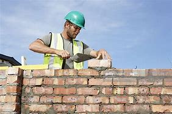
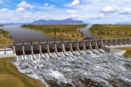

= eco 2020-06-13
:toc:

---

== So other people would be also free 词汇解说

(eco 2020-6-13 / International / Black Lives Matter: So other people would be also free)

The killing of George Floyd *has sparked* global soul-searching 反省；内省

Protests *have broken out* in dozens of countries

Jun 11th 2020 | AMSTERDAM, JOHANNESBURG, MELKSHAM, MEXICO CITY, PARIS AND SÃO PAULO

LOCAL POLICE *arrested* Giovanni López, a 30-year-old Mexican bricklayer 砌砖工；瓦工, in Ixtlahuacán de los Membrillos, a town near Guadalajara, on May 4th. `主` Why they *detained* him `系` *is* unclear. The next morning his family *found* him *dead* in a nearby hospital, with bruises on his head and a bullet in his ankle. His name *did not go viral* (病毒的；病毒性的；病毒引起的)像病毒般扩散;走红; no politician *lamented* 对…感到悲痛；痛惜；对…表示失望 his death.

- bricklayer +

Christian López, who *filmed* his brother’s arrest, *stayed silent* at first. He *would later claim that* `主` messengers 信使 (*acting on behalf of* the local mayor) `谓` *threatened* to kill(v.) his family if the footage  (描述某一事件的) 片段镜头 *went public*. But then *came* the killing of George Floyd in Minneapolis, and the anti-police, anti-racism backlash that *has swept* the world. “I *saw* it and *thought*, this *is* the same thing that *happened to* my brother,” he says. On June 1st he *went to* the press 记者；新闻工作者；新闻界;报章杂志；报刊；印刷媒体.

The chief prosecutor 公诉人；检察官 in the state of Jalisco 墨西哥太平洋岸的一个州, where the death *occurred*, *faced* a barrage 接二连三的一大堆（质问或指责等）; 火力网；弹幕射击；（尤指）掩护炮火 of questions. On June 4th `主` a march 示威游行；抗议游行 in Guadalajara, marking 纪念；庆贺 a month since Giovanni’s death, `谓` *turned* violent. `主` Calls (*demanding* #Justiciaparagiovanni) `谓` *increased*. The three officers connected with Giovanni’s death *were arrested*. The mayor’s role *is* under investigation. Protests *have since spread to* Tijuana and the state of Veracruz *against* two local pre-Floyd police killings, of Oliver López (no relation) in March and Carlos Andrés Navarro in May.

- barrage : n.  /bəˈrɑːʒ/  [ Cusually sing. ] the continuous firing of a large number of guns in a particular direction, especially to protect soldiers while they are attacking or moving towards the enemy 火力网；弹幕射击；（尤指）掩护炮火 +
/ [ sing. ] *~ (of sth)* a large number of sth, such as questions or comments, that are directed at sb very quickly, one after the other, often in an aggressive way 接二连三的一大堆（质问或指责等） +
/ [ C ] a wall or barrier built across a river to store water, prevent a flood, etc. 堰；水坝；拦河坝 +
=> 词源同bar, 杆，棍，原指用杆棍搭建的拦河坝，阻挡洪水，火力网是后来义。 +

Mr Floyd’s death *has provoked protests* around the world. `主` {Why his death *set off* 引发；激起 a global movement *whereas* （用以比较或对比两个事实）然而，但是，尽管 `主` countless 无数的；数不胜数的；数不尽的 other unjust killings `谓` *did not*} `系` *is* hard to say. Mr Floyd was American, of course, and the world *pays more attention to* the United States *than* to Mexico or any other country. His death *was filmed* in excruciating 极痛苦的；极坏的；糟糕透顶的 detail. It *happened* at a time when billions of people *were cooped up* and *frustrated* at home, *thanks to* covid-19. Lockdowns *have surely made* the global mood *more combustible* 易燃的；可燃的.

- 为什么他的死引发了一场全球性的运动，而其他无数的不公正的杀戮却没有做到这一点，这个原因很难说。

But the important points *are that* police brutality(n.)无情；残忍；暴行 *is* rife(a.)（坏事）盛行，普遍 in many countries and minorities 少数民族；少数族裔 *fear* discrimination everywhere. That *is* why Mr Floyd’s fate *resonated* 使产生联想；引起共鸣；和…的想法（或观念）类似;产生共鸣；发出回响；回荡. Just as women on every continent *found* common cause 原因；起因;（支持或为之奋斗的）事业，目标，思想 in the #MeToo movement, despite the range （变动或浮动的）范围，界限，区间;类；种 of their experiences, so protesters around the world *have united around* the cry 口号 (that black lives *matter*).

- rife :  /raɪf/ a. if sth bad or unpleasant is rife in a place, it is very common there （坏事）盛行，普遍 / *~ (with sth)* full of sth bad or unpleasant 充斥，充满（坏事） +
=> 词源同 river,rift.通常用于形容坏事的盛行。 +
-> It is a country *where corruption is rife*. 这是个腐败成风的国家。

- resonate =>  /ˈrezəneɪt/ re-,向后，往回，-son,声音，词源同 sound,sonorous.即回声，引申词义共鸣，回响。

- cause :   /kɔːz/  n. [ C ] the person or thing that makes sth happen 原因；起因 / [ C ] an organization or idea that people support or fight for （支持或为之奋斗的）事业，目标，思想 +
-> Drinking and driving is *one of the most common causes* of traffic accidents. 酒后驾车是导致交通事故最常见的原因之一 +
-> *a good cause* (= an organization that does good work, such as a charity) 崇高的事业

- 但重要的一点是，警察暴行在许多国家很普遍，而且少数民族害怕处处受到歧视。这就是为什么弗洛伊德的命运引起了共鸣。正如世界各地的妇女在“我也是”运动中找到了共同的目标，尽管她们的经历各不相同，世界各地的抗议者也团结在一起，呼吁黑人的生命很重要。

At their simplest the protests mark people’s antipathy towards cops who beat or kill those whom they vowed to protect. Protests have spread throughout Mexico, where nine in ten homicides go unpunished and many police moonlight for the other side. The country’s most notorious unsolved crime, the disappearance and presumed murder in 2014 of 43 student teachers in the town of Ayotzinapa, is thought to have been orchestrated by police paid by drug gangs.

Some of the global anger is directed at the United States. Protests have erupted outside American embassies from Spain to South Africa. Nana Akufo-Addo, Ghana’s president, tweeted that: “Black people, the world over, are shocked and distraught.” President Cyril Ramaphosa of South Africa said: “The killing of George Floyd has opened up deep wounds for us all.”

Many protesters would agree. But many also seethe that their leaders condemn police abuse in Minnesota while allowing or even encouraging it at home. America’s police kill more people than those of any other rich democracy, but cops in some developing countries are much more lethal (see chart 1). So plenty of the protests around the world are about local abuses as well.

On June 8th in Mathare, a poor part of Nairobi, about 200 Kenyans marched against police atrocities. Since a covid-19 curfew was introduced in Kenya’s capital on March 27th police have killed 15 people, according to the country’s Independent Police Oversight Authority. “[T]he poor people of this country have come together to say no to police killings...and also stand in solidarity with the global protest against police excesses,” Juliet Wanjera, a member of the Mathare Social Justice Centre, an NGO, has told journalists.

Since 2012 there have been more than 40,000 complaints against the South African Police Service for alleged crimes including rape and murder, with just 531 convictions. Security forces have killed at least 11 people during South Africa’s lockdown, in place since March 27th, and more than 200,000 have been arrested. Mr Ramaphosa has said merely that authorities have been guilty of “over-enthusiasm”.

That will not wash with many South Africans. The killing on April 10th of Collins Khosa, a 40-year-old man from Alexandra, a township in Johannesburg, by soldiers, has prompted particular outrage. According to his family, Mr Khosa was targeted for drinking a beer even though he was on his own property. (Buying alcohol was illegal in April and May, as per lockdown regulations, but drinking it was not.)

Some analysts worry that police abuse in America may make it easier for others to follow suit. “It will certainly be very easy for leaders in Africa, those with their own dictatorial tendencies, to justify future behaviour by referencing the actions of the US administration in the last few weeks,” argues Idayat Hassan of the Centre for Democracy and Development, a think-tank in Abuja, Nigeria. Police brutality in developing countries rarely prompts a global reaction. The killing by Zimbabwean security forces of 17 protesters in January 2019 did not lead to mass protests elsewhere.

In the state of Rio de Janeiro (population 6.3m), police killed 1,810 people last year, nearly twice as many as in the United States (population 328m). Police say most of the dead are gunmen from favelas, informal settlements that are often controlled by criminals. But watchdogs point to a rise in extrajudicial killings, including massacres of more than ten people, fuelled by warlike police operations, sometimes with snipers in helicopters. Images of smiling children killed by police all too often appear on people’s televisions. They include eight-year-old Agatha, shot by a stray bullet last September while riding in a van with her mother, and 14-year-old João Pedro, killed in a botched police raid last month.

Brazilians in more than ten cities took to the streets on June 7th to mourn their deaths and to protest against the government of Jair Bolsonaro, a populist who campaigned on promises to give immunity to police who kill. He said last year that a bill to this effect would cause criminals to “die in the streets like cockroaches”. Congress rejected the measure, but Brazil’s trigger-happy police are rarely prosecuted. Still, on June 5th a Supreme Court judge banned most police operations in favelas for the remainder of the pandemic.

Of the 6,220 people killed by Brazil’s police in 2018, three out of four were black. In Indonesia, #BlackLivesMatter has found new relevance as #PapuanLivesMatter. Indonesia runs half of the island of New Guinea, and controls it almost as if it were an occupying power. Papuans—whose skin is darker than that of other Indonesians—face bleak economic prospects and violence at the hands of security forces.

In 2019 a Papuan student dormitory in Surabaya in eastern Java was besieged by a mob claiming its inhabitants had thrown the national flag into a gutter. Some taunted them as “monkeys”. Rather than dispersing the mob, riot police stormed the dorm with tear-gas and arrested 43 Papuans. That and similar actions in other cities were the catalyst last summer for huge demonstrations by young Indonesians in support of Papuans. In recent days calls have grown for Indonesians to denounce the discrimination that Papuans suffer.

A determined people

Even where police brutality is rarer, attention has turned to domestic racism. In Melksham, a small town in England, 120 people gathered on June 7th to protest against it. Some 97% of the town’s inhabitants are white. It has not seen a major protest since woollen-mill workers rioted in 1802. “White privilege doesn’t mean your life hasn’t been hard,” Botan Williams, the event’s 15-year-old organiser, told the crowd, “it just means your skin colour isn’t one of the things making it harder.”

Throughout Britain demonstrators have echoed their American counterparts, chanting “hands up, don’t shoot” at (unarmed) police. Placards named black victims of British police violence: Mark Duggan, Rashan Charles and Edson Da Costa. Black people are just 3% of the population in England and Wales but 12% of prisoners. Black men are stopped and searched at nine times the rate of white men.

Similarly in Australia Aboriginals and Torres Strait islanders are just over 3% of the overall population but 29% of those in prison. An indigenous female Australian is more likely to be behind bars than a non-indigenous male. Scott Morrison, the conservative prime minister, says: “There is no need to import things happening in other countries here to Australia” because “Australia is a fair country...[it] is not the United States.” Protesters were unconvinced. Indigenous Australians are poorer and less healthy—and have less access to housing, land, education and social workers—than other Australians.

The first demonstration in France since Mr Floyd’s death brought 20,000 people carrying “Black Lives Matter” banners to the main Paris courthouse on June 2nd. It centred on a French controversy: the death in 2016 of Adama Traoré, a 24-year-old who was pinned to the ground by police officers during his arrest. A medical report released on the morning of the demonstration suggested that he was asphyxiated. The Floyd protests carry particular resonance in the banlieues, high-rise estates where friction between the police and residents, many of them of immigrant origin, frames daily life. This distrust can erupt into confrontation, violence and, occasionally, death. There were 19 deaths in France during police operations last year.

France is the first European country where the protests have changed policy. Earlier this year, after a motorbike courier died of asphyxiation during his arrest in Paris, President Emmanuel Macron asked Christophe Castaner, his interior minister, to come up with ways to “improve police ethics”. On June 8th those proposals were hastily put together. Mr Castaner acknowledged racism within the police force, and said that choke holds would be banned. France would take a “zero tolerance” approach to racism, he declared.

Before the protests, New Zealand was mulling whether to equip more of its usually unarmed police with guns. Evaluation of a six-month trial was to have been completed by the end of June. But on June 9th the head of police said he had received over 4,000 letters in a week, and that the plan would be permanently scrapped.

Some Europeans have deplored American racism while failing to see the parallels in their own countries. Europe’s biggest Black Lives Matter rallies were in Germany. Signs in English were far more prominent than German ones. In Spain, too, demonstrators mostly condemned American racism, with only cursory mentions of Europe’s treatment of African migrants. There were few mentions of Europe’s widespread religious discrimination against Muslims.

Europeans are sometimes complacent about racism. Granted, European police shoot far fewer people than American police do. But this is largely because they are less likely to be shot at. Last year 48 police were killed—most of them shot— in the line of duty in America; in Britain one was.

Measuring prejudice is hard. Racist attitudes have been socially unacceptable nearly everywhere for decades, so many who harbour them will not admit it to pollsters. But some do. And according to a recent international World Values Survey, more Germans and Dutch say they would not want “people of another race” as neighbours than Americans (see chart 2).

Ethnic profiling by police is illegal in most countries, but common. Members of minorities (especially young men) are routinely frisked and asked for identification when out in public. In private, many police admit to taking account of race when deciding whom to stop, noting that some groups, for a variety of reasons, commit more crimes than others. Such profiling makes life much harder for those who happen to belong to those groups, the vast majority of whom are law-abiding.

Many people do not care. Brazilians knew what to expect when they elected Mr Bolsonaro. Two-thirds of Germans think racial profiling is an acceptable tool of policing, according to a poll in 2017 by YouGov. “The worst thing about it,” says Sony Kapoor, an Indian-born Briton who lives in Norway, “is the smugness of Europeans who think they don’t harbour the same sort of racism as Americans.”

---

== So other people would be also free

The killing of George Floyd has sparked global soul-searching

Protests have broken out in dozens of countries

Jun 11th 2020 | AMSTERDAM, JOHANNESBURG, MELKSHAM, MEXICO CITY, PARIS AND SÃO PAULO

LOCAL POLICE arrested Giovanni López, a 30-year-old Mexican bricklayer, in Ixtlahuacán de los Membrillos, a town near Guadalajara, on May 4th. Why they detained him is unclear. The next morning his family found him dead in a nearby hospital, with bruises on his head and a bullet in his ankle. His name did not go viral; no politician lamented his death.

Christian López, who filmed his brother’s arrest, stayed silent at first. He would later claim that messengers acting on behalf of the local mayor threatened to kill his family if the footage went public. But then came the killing of George Floyd in Minneapolis, and the anti-police, anti-racism backlash that has swept the world. “I saw it and thought, this is the same thing that happened to my brother,” he says. On June 1st he went to the press.

The chief prosecutor in the state of Jalisco, where the death occurred, faced a barrage of questions. On June 4th a march in Guadalajara, marking a month since Giovanni’s death, turned violent. Calls demanding #Justiciaparagiovanni increased. The three officers connected with Giovanni’s death were arrested. The mayor’s role is under investigation. Protests have since spread to Tijuana and the state of Veracruz against two local pre-Floyd police killings, of Oliver López (no relation) in March and Carlos Andrés Navarro in May.

Mr Floyd’s death has provoked protests around the world. Why his death set off a global movement whereas countless other unjust killings did not is hard to say. Mr Floyd was American, of course, and the world pays more attention to the United States than to Mexico or any other country. His death was filmed in excruciating detail. It happened at a time when billions of people were cooped up and frustrated at home, thanks to covid-19. Lockdowns have surely made the global mood more combustible.

But the important points are that police brutality is rife in many countries and minorities fear discrimination everywhere. That is why Mr Floyd’s fate resonated. Just as women on every continent found common cause in the #MeToo movement, despite the range of their experiences, so protesters around the world have united around the cry that black lives matter.

At their simplest the protests mark people’s antipathy towards cops who beat or kill those whom they vowed to protect. Protests have spread throughout Mexico, where nine in ten homicides go unpunished and many police moonlight for the other side. The country’s most notorious unsolved crime, the disappearance and presumed murder in 2014 of 43 student teachers in the town of Ayotzinapa, is thought to have been orchestrated by police paid by drug gangs.

Some of the global anger is directed at the United States. Protests have erupted outside American embassies from Spain to South Africa. Nana Akufo-Addo, Ghana’s president, tweeted that: “Black people, the world over, are shocked and distraught.” President Cyril Ramaphosa of South Africa said: “The killing of George Floyd has opened up deep wounds for us all.”

Many protesters would agree. But many also seethe that their leaders condemn police abuse in Minnesota while allowing or even encouraging it at home. America’s police kill more people than those of any other rich democracy, but cops in some developing countries are much more lethal (see chart 1). So plenty of the protests around the world are about local abuses as well.

On June 8th in Mathare, a poor part of Nairobi, about 200 Kenyans marched against police atrocities. Since a covid-19 curfew was introduced in Kenya’s capital on March 27th police have killed 15 people, according to the country’s Independent Police Oversight Authority. “[T]he poor people of this country have come together to say no to police killings...and also stand in solidarity with the global protest against police excesses,” Juliet Wanjera, a member of the Mathare Social Justice Centre, an NGO, has told journalists.

Since 2012 there have been more than 40,000 complaints against the South African Police Service for alleged crimes including rape and murder, with just 531 convictions. Security forces have killed at least 11 people during South Africa’s lockdown, in place since March 27th, and more than 200,000 have been arrested. Mr Ramaphosa has said merely that authorities have been guilty of “over-enthusiasm”.

That will not wash with many South Africans. The killing on April 10th of Collins Khosa, a 40-year-old man from Alexandra, a township in Johannesburg, by soldiers, has prompted particular outrage. According to his family, Mr Khosa was targeted for drinking a beer even though he was on his own property. (Buying alcohol was illegal in April and May, as per lockdown regulations, but drinking it was not.)

Some analysts worry that police abuse in America may make it easier for others to follow suit. “It will certainly be very easy for leaders in Africa, those with their own dictatorial tendencies, to justify future behaviour by referencing the actions of the US administration in the last few weeks,” argues Idayat Hassan of the Centre for Democracy and Development, a think-tank in Abuja, Nigeria. Police brutality in developing countries rarely prompts a global reaction. The killing by Zimbabwean security forces of 17 protesters in January 2019 did not lead to mass protests elsewhere.

In the state of Rio de Janeiro (population 6.3m), police killed 1,810 people last year, nearly twice as many as in the United States (population 328m). Police say most of the dead are gunmen from favelas, informal settlements that are often controlled by criminals. But watchdogs point to a rise in extrajudicial killings, including massacres of more than ten people, fuelled by warlike police operations, sometimes with snipers in helicopters. Images of smiling children killed by police all too often appear on people’s televisions. They include eight-year-old Agatha, shot by a stray bullet last September while riding in a van with her mother, and 14-year-old João Pedro, killed in a botched police raid last month.

Brazilians in more than ten cities took to the streets on June 7th to mourn their deaths and to protest against the government of Jair Bolsonaro, a populist who campaigned on promises to give immunity to police who kill. He said last year that a bill to this effect would cause criminals to “die in the streets like cockroaches”. Congress rejected the measure, but Brazil’s trigger-happy police are rarely prosecuted. Still, on June 5th a Supreme Court judge banned most police operations in favelas for the remainder of the pandemic.

Of the 6,220 people killed by Brazil’s police in 2018, three out of four were black. In Indonesia, #BlackLivesMatter has found new relevance as #PapuanLivesMatter. Indonesia runs half of the island of New Guinea, and controls it almost as if it were an occupying power. Papuans—whose skin is darker than that of other Indonesians—face bleak economic prospects and violence at the hands of security forces.

In 2019 a Papuan student dormitory in Surabaya in eastern Java was besieged by a mob claiming its inhabitants had thrown the national flag into a gutter. Some taunted them as “monkeys”. Rather than dispersing the mob, riot police stormed the dorm with tear-gas and arrested 43 Papuans. That and similar actions in other cities were the catalyst last summer for huge demonstrations by young Indonesians in support of Papuans. In recent days calls have grown for Indonesians to denounce the discrimination that Papuans suffer.

A determined people

Even where police brutality is rarer, attention has turned to domestic racism. In Melksham, a small town in England, 120 people gathered on June 7th to protest against it. Some 97% of the town’s inhabitants are white. It has not seen a major protest since woollen-mill workers rioted in 1802. “White privilege doesn’t mean your life hasn’t been hard,” Botan Williams, the event’s 15-year-old organiser, told the crowd, “it just means your skin colour isn’t one of the things making it harder.”

Throughout Britain demonstrators have echoed their American counterparts, chanting “hands up, don’t shoot” at (unarmed) police. Placards named black victims of British police violence: Mark Duggan, Rashan Charles and Edson Da Costa. Black people are just 3% of the population in England and Wales but 12% of prisoners. Black men are stopped and searched at nine times the rate of white men.

Similarly in Australia Aboriginals and Torres Strait islanders are just over 3% of the overall population but 29% of those in prison. An indigenous female Australian is more likely to be behind bars than a non-indigenous male. Scott Morrison, the conservative prime minister, says: “There is no need to import things happening in other countries here to Australia” because “Australia is a fair country...[it] is not the United States.” Protesters were unconvinced. Indigenous Australians are poorer and less healthy—and have less access to housing, land, education and social workers—than other Australians.

The first demonstration in France since Mr Floyd’s death brought 20,000 people carrying “Black Lives Matter” banners to the main Paris courthouse on June 2nd. It centred on a French controversy: the death in 2016 of Adama Traoré, a 24-year-old who was pinned to the ground by police officers during his arrest. A medical report released on the morning of the demonstration suggested that he was asphyxiated. The Floyd protests carry particular resonance in the banlieues, high-rise estates where friction between the police and residents, many of them of immigrant origin, frames daily life. This distrust can erupt into confrontation, violence and, occasionally, death. There were 19 deaths in France during police operations last year.

France is the first European country where the protests have changed policy. Earlier this year, after a motorbike courier died of asphyxiation during his arrest in Paris, President Emmanuel Macron asked Christophe Castaner, his interior minister, to come up with ways to “improve police ethics”. On June 8th those proposals were hastily put together. Mr Castaner acknowledged racism within the police force, and said that choke holds would be banned. France would take a “zero tolerance” approach to racism, he declared.

Before the protests, New Zealand was mulling whether to equip more of its usually unarmed police with guns. Evaluation of a six-month trial was to have been completed by the end of June. But on June 9th the head of police said he had received over 4,000 letters in a week, and that the plan would be permanently scrapped.

Some Europeans have deplored American racism while failing to see the parallels in their own countries. Europe’s biggest Black Lives Matter rallies were in Germany. Signs in English were far more prominent than German ones. In Spain, too, demonstrators mostly condemned American racism, with only cursory mentions of Europe’s treatment of African migrants. There were few mentions of Europe’s widespread religious discrimination against Muslims.

Europeans are sometimes complacent about racism. Granted, European police shoot far fewer people than American police do. But this is largely because they are less likely to be shot at. Last year 48 police were killed—most of them shot— in the line of duty in America; in Britain one was.

Measuring prejudice is hard. Racist attitudes have been socially unacceptable nearly everywhere for decades, so many who harbour them will not admit it to pollsters. But some do. And according to a recent international World Values Survey, more Germans and Dutch say they would not want “people of another race” as neighbours than Americans (see chart 2).

Ethnic profiling by police is illegal in most countries, but common. Members of minorities (especially young men) are routinely frisked and asked for identification when out in public. In private, many police admit to taking account of race when deciding whom to stop, noting that some groups, for a variety of reasons, commit more crimes than others. Such profiling makes life much harder for those who happen to belong to those groups, the vast majority of whom are law-abiding.

Many people do not care. Brazilians knew what to expect when they elected Mr Bolsonaro. Two-thirds of Germans think racial profiling is an acceptable tool of policing, according to a poll in 2017 by YouGov. “The worst thing about it,” says Sony Kapoor, an Indian-born Briton who lives in Norway, “is the smugness of Europeans who think they don’t harbour the same sort of racism as Americans.”

所以其他人也是自由的
乔治·弗洛伊德被杀引发了全球的反思
数十个国家爆发了抗议活动
阿姆斯特丹，约翰内斯堡，梅尔克舍姆，墨西哥城，巴黎和圣保罗
5月4日，瓜达拉哈拉附近的伊克斯特拉瓦坎德洛斯姆布里洛斯镇，当地警方逮捕了30岁的墨西哥泥瓦匠乔瓦尼•洛佩斯。他们拘留他的原因尚不清楚。第二天早上，他的家人发现他死在附近一家医院，头部有瘀伤，脚踝中了一颗子弹。他的名字没有像病毒一样传播;没有政治家为他的死感到惋惜。
克里斯蒂安·洛佩斯(Christian Lopez)拍摄了他哥哥被捕的过程，一开始他一直保持沉默。他后来声称，代表当地市长的信使威胁说，如果这段录像公开，就杀了他的家人。但随后，明尼阿波利斯的乔治·弗洛伊德(George Floyd)被杀，以及席卷全球的反警察、反种族主义反弹情绪。他说:“我看到了，心想，这和我哥哥的遭遇是一样的。”6月1日，他去了媒体那里。
死亡事件发生的哈利斯科州的首席检察官面临着一连串的质疑。6月4日，在瓜达拉哈拉，纪念乔瓦尼死后一个月的游行演变成了暴力。要求法官的呼声增加了。与乔瓦尼之死有关的三名官员已被逮捕。市长的角色正在接受调查。抗议活动已经蔓延到蒂华纳和韦拉克鲁斯州，抗议两起发生在佛洛伊德之前的当地警察杀人事件，分别是3月的奥利弗·洛佩斯和5月的卡洛斯·安德烈斯·纳瓦罗。
弗洛伊德的死引发了世界各地的抗议。为什么他的死引发了一场全球性的运动，而其他无数不公正的杀戮却没有，这很难说。当然，弗洛伊德是美国人，世界对美国的关注超过了对墨西哥或其他任何国家的关注。他的死被详细地拍摄下来。当时，由于covid-19，数十亿人被关在家里，感到沮丧。封锁无疑让全球情绪更加易燃。
但重要的一点是，警察暴行在许多国家很普遍，而且少数民族害怕处处受到歧视。这就是为什么弗洛伊德的命运引起了共鸣。正如世界各地的妇女在“我也是”运动中找到了共同的目标，尽管她们的经历各不相同，世界各地的抗议者也团结在一起，呼吁黑人的生命很重要。
抗议活动最简单的表达了人们对警察的反感，警察殴打或杀害了他们发誓要保护的人。抗议活动已经蔓延到整个墨西哥，在那里十分之九的杀人案没有受到惩罚，许多警察兼职为另一方工作。该国最臭名昭著的未破案件是2014年发生在阿约齐纳帕镇的43名教师失踪并被认为是被谋杀的案件。这起案件被认为是由贩毒团伙贿赂的警察精心策划的。
全球的一些愤怒直指美国。从西班牙到南非的美国大使馆外都爆发了抗议活动。加纳总统纳纳•阿库福-阿多(Nana Akufo-Addo)在twitter上表示:“全世界的黑人都感到震惊和心烦意乱。南非总统西里尔•拉马福萨(Cyril Ramaphosa)表示:“乔治•弗洛伊德(George Floyd)被杀，给我们所有人打开了深深的伤口。”
许多抗议者会同意这一观点。但许多人也感到愤怒，因为他们的领导人谴责明尼苏达州的警察滥用职权，却允许甚至鼓励国内的警察滥用职权。美国警察杀害的人比其他任何一个富裕的民主国家都多，但是一些发展中国家的警察要致命得多(见表1)。因此，世界各地的许多抗议活动也与当地的滥用职权有关。
6月8日，大约200名肯尼亚人在内罗毕的贫困地区Mathare举行游行，反对警察的暴行。据肯尼亚独立警察监督机构称，自3月27日肯尼亚首都实施covid-19宵禁以来，警方已造成15人死亡。“这个国家的穷人团结起来对警察杀人说不……与全球反对警察暴行的抗议站在一起，”非政府组织玛萨瑞社会正义中心的成员朱丽叶·万杰拉告诉记者。
自2012年以来，南非警方收到了4万多起针对强奸和谋杀等罪行的投诉，其中只有531起被定罪。在南非自3月27日起实施的封锁期间，安全部队已经杀死了至少11人，超过20万人被捕。拉马福萨只是表示，当局的“过度热情”是有罪的。

许多南非人不会认同这一点。4月10日，一名来自约翰内斯堡亚历山德拉镇的40岁男子Collins Khosa被士兵杀害，这引起了特别的愤慨。据他的家人说，科萨之所以成为袭击目标，是因为他喝了啤酒，尽管他是在自己的房子里。(根据禁闭规定，4月和5月买酒是违法的，但喝酒不是。)
一些分析人士担心，美国警察滥用职权可能会让其他人更容易效仿。尼日利亚阿布贾的智库民主与发展中心(Centre for Democracy and Development)的伊达亚特•哈桑(Idayat Hassan)表示:“对于那些有独裁倾向的非洲领导人来说，参照美国政府过去几周的行动，肯定很容易为未来的行为辩护。”发展中国家的警察暴行很少引起全球的反应。2019年1月津巴布韦安全部队杀害17名抗议者的事件并没有在其他地方引发大规模抗议。
在人口630万的里约热内卢州，警察去年杀死了1810人，几乎是美国(人口3.28亿)的两倍。警方说，大多数死者是来自贫民窟的枪手。贫民窟是通常由犯罪分子控制的非正式定居点。但监督机构指出，法外处决事件有所增加，包括对十多人的屠杀，这是由好战的警察行动引发的，有时还动用了直升机上的狙击手。人们的电视上经常出现被警察杀害的微笑着的孩子的画面。其中包括8岁的阿加莎(Agatha)和14岁的若昂·佩德罗(Joao Pedro)。去年9月，她和母亲坐在一辆面包车里，被流弹击中。
6月7日，十多个城市的巴西人走上街头哀悼他们的死亡，并抗议Jair Bolsonaro的政府，这位民粹主义者在竞选中承诺给予杀人警察豁免权。他去年曾说过这样的法案会让罪犯“像蟑螂一样死在街上”。国会否决了这项措施，但是巴西好战的警察很少被起诉。然而，6月5日，一位最高法院法官禁止了贫民窟的大多数警察在疫情爆发后采取行动。
2018年，巴西警方杀害了6220人，其中四分之三是黑人。在印度尼西亚，“黑人生命重要”和“巴布亚生命重要”有了新的关联。印度尼西亚控制着新几内亚岛的一半，几乎像占领国一样控制着它。巴布亚人的皮肤比其他印尼人更黑，他们面临着暗淡的经济前景和安全部队手中的暴力。
2019年，东爪哇泗水的一个巴布亚学生宿舍被一群暴徒包围，声称其居民将国旗扔进排水沟。一些人嘲笑他们是“猴子”。防暴警察没有驱散暴民，而是用催泪弹冲进宿舍，逮捕了43名巴布亚人。去年夏天，印尼年轻人举行了支持巴布亚人的大规模示威活动。最近几天，要求印尼人谴责巴布亚人遭受歧视的呼声越来越高。
一个意志坚定的人
即使在警察暴力很少的地方，人们的注意力也已经转向了国内的种族主义。6月7日，在英格兰小镇梅尔克舍姆，120人聚集在一起抗议该法案。该镇约97%的居民是白人。自1802年纺织厂工人骚乱以来，这里还没有发生过大规模抗议活动。“白人特权并不意味着你们的生活不艰难，”该活动的组织者、15岁的博坦·威廉姆斯(Botan Williams)对人群说，“这只是意味着你们的肤色不是造成困难的因素之一。”
整个英国的游行者都和美国同行一样，对(手无寸铁的)警察高喊“举起手来，不要开枪”。海报上写着英国警察暴力事件中的黑人受害者:马克·达根、拉善·查尔斯和埃德森·达·科斯塔。在英格兰和威尔士，黑人只占人口的3%，但在囚犯中却占12%。黑人被拦下和搜查的比率是白人的九倍。

类似地，在澳大利亚，土著居民和托雷斯海峡岛民仅占总人口的3%多一点，但在监狱中却占29%。澳大利亚本土女性比非本土男性更容易入狱。英国保守党总理斯科特•莫里森(Scott Morrison)表示:“没有必要把其它国家发生的事情引入澳大利亚”，因为“澳大利亚是一个公平的国家……(它)不是美国。抗议者对此并不信服。与其他澳大利亚人相比，土著澳大利亚人更贫穷，健康状况更差，获得住房、土地、教育和社会服务的机会也更少。
6月2日，在弗洛伊德死后的第一次游行中，两万名抗议者举着“黑人的生命也是重要的”的横幅来到巴黎主要法院。它的中心是法国的一场争议:2016年，24岁的阿达玛·特劳雷(Adama Traore)在被捕时被警察压在地上死亡。示威当天上午公布的一份医疗报告显示，他是窒息而死。佛洛伊德的抗议活动在郊区和高层住宅区引起了特别的共鸣，在那里，警察和居民(其中许多是移民)之间的摩擦构成了人们日常生活的框架。这种不信任可能会爆发对抗、暴力，有时甚至导致死亡。去年法国警方的行动中有19人死亡。
法国是第一个抗议改变政策的欧洲国家。今年早些时候，一名摩托车信使在巴黎被捕时死于窒息，法国总统埃马纽埃尔•马克龙要求内政部长克里斯托夫•卡斯塔纳想出“提高警察道德”的办法。6月8日，这些提议被匆忙地拼凑在一起。卡斯塔纳承认警察内部存在种族主义，并表示将禁止“掐手”。他宣称，法国将对种族主义采取“零容忍”态度。
在抗议活动之前，新西兰正在考虑是否要让更多平时手无寸铁的警察配备枪支。6个月试验的评估将于6月底完成。但6月9日，警察局长表示，他在一周内就收到了4000多封信，该计划将被永久取消。
一些欧洲人谴责美国的种族主义，却没有看到自己国家的相似之处。欧洲最大的黑人生命重要集会发生在德国。英语标识比德语标识更显眼。在西班牙，同样的，示威者大多谴责美国的种族主义，对欧洲对待非洲移民的方式只字未提。很少有人提到欧洲对穆斯林普遍存在的宗教歧视。
欧洲人有时对种族主义沾沾自喜。诚然，欧洲警察射杀的人数比美国警察少得多。但这很大程度上是因为他们不太可能被枪击。去年有48名警察在美国执行任务时被枪杀，其中大部分是被枪杀的;在英国是这样的。
衡量偏见是困难的。几十年来，种族主义态度在社会上几乎在任何地方都是不可接受的，因此许多怀有这种态度的人不会向民调机构承认。但是一些。根据最近的国际世界价值观调查，与美国人相比，更多的德国人和荷兰人表示他们不想要“其他种族的人”作为邻居(见表2)。
警察的种族定性在大多数国家是非法的，但很常见。少数民族成员(尤其是年轻男性)在公共场合经常被搜身，并被要求出示身份证件。私下里，许多警察承认，在决定阻止谁时考虑了种族因素，并指出一些群体由于各种原因，比其他群体犯罪更多。这种定性让那些恰好属于这些群体的人的生活更加艰难，他们中的绝大多数人都是守法的。
许多人并不在意。当巴西人选出博尔索纳罗时，他们知道会发生什么。2017年YouGov的一项民意调查显示，三分之二的德国人认为种族定性是一种可以接受的警务工具。“最糟糕的是，”索尼•卡普尔(Sony Kapoor)说，他是一位生活在挪威的印度裔英国人，“欧洲人自以为是，认为自己不像美国人那样怀有种族主义。”

