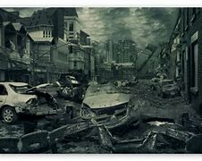
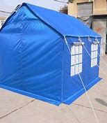

= eco 2020-06-20
:toc:

---

== Horsemen 骑兵；骑士 of the apocalypse 大动乱；大灾变; 世界毁灭  词汇解说

(2020-6-20 / International / Pandemics and war: Horsemen of the apocalypse)

Covid-19 *raises the risks* of violent conflict

War and disease *feed upon(=on) each other*

Jun 18th 2020 | BUNIA AND BOGOTÁ

- apocalypse : n. /əˈpɑːkəlɪps/ [ sing.U ] the destruction of the world 世界毁灭 / [ sing. ] a situation causing very serious damage and destruction 大动乱；大灾变 / *the Apocalypse* [ sing. ] the end of the world, as described in the Bible （《圣经》所述的）末世 +
=> 《圣经·新约》中的最后一章是圣约翰（St. John）所写的“启示录”。据说耶稣基督的十二门徒之一圣约翰被罗马皇帝流放至帕特摩斯岛（Patmos）时，将主给他显示的异象记录下来，并预言了主 的降临和世界末日来临时的景象。该书的希腊名是《apokalyptein》. +
英语单词apocalypse就源自希腊语apokalyptein，由apo（away，off）+kalyptein（cover）构成，意思就是“revelation”（启示，揭示）。

BUNIA, A DUSTY 布满灰尘的；灰尘覆盖的 city of perhaps 650,000 in Ituri, a province of eastern Congo, *has long known 知名的；出了名的；已知的 war*. Since the start of this year, rebels 反政府的人；叛乱者；造反者 *have burned dozens of villages to the ground* and *hacked 砍；劈;猛踢 hundreds of people to death* with machetes 大刀；大砍刀. `主` A rebel group *made up of 由…组成，由…构成 assailants* 攻击者；行凶者 from the seed-sowing 播种 Lendu tribe `谓` *has launched a series of attacks* on the pastoralist 放牧人; 养大群牛羊等的土地持有者 Hema. The government hospital in the city *is overrun 泛滥；横行；肆虐;多用（时间、钱财等）；超时 with patients*. “We have people *wounded with machetes*, with gunshots, women *with amputated 截 (肢) limbs* 肢，臂, people *with fractures* 骨折，断裂,” says John Katabuku, a doctor *working there*. “[When *the displaced 无家可归的;使背井离乡;取代 arrive*(v.)] we *look after them for free* -- they *have lost everything*. But it is difficult for the hospital. *We really do not have the means* 方式；方法；途径.”

- hack : v. to cut sb/sth with rough, heavy blows 砍；劈 +
-> I *hacked* the dead branches *off*. 我把枯树枝砍掉了。

- machete :  /məˈʃeti/ a broad heavy knife used as a cutting tool and as a weapon 大刀；大砍刀 +
=> 来自西班牙语macho,锤子，铁锤，-ete,小词后缀，来自来自拉丁语mateola,锤子，铁锤，词源同mace.字面意思即小铁锤，但后用于指砍刀，弯刀。参照电影《弯刀》。 +

- amputate : /ˈæmpjuteɪt/  v. to cut off sb's arm, leg, finger or toe in a medical operation （用外科手术）切断；截（肢） +
=> 复合词。前缀amphi-, 同ambi-, 两，二。词根put, 思考，古义砍，切，同pave, 铺路。该词原指给树木剪枝，后指医学上人体截肢。

- 当流离失所的人抵达时，我们无偿地照顾他们，他们失去了一切。但对医院来说很困难, 我们真的没有办法。

[With war] *comes disease*. 战争带来疾病. Ituri *is still recovering from an outbreak of Ebola* which *started in 2018* and *killed 2,262 people in the region* before *subsiding* 趋于平静；平息；减弱；消退;(水)回落；减退. Now it has covid-19. Though *there are just two recorded cases* in the province, that is surely *a woeful 糟糕的；严重的；不合意的 undercount* 少计（尤指人口统计数）. If the disease is spreading, *it would not be easy to tell* 知道；看出；确切地判断. Tests *have to be sent 1,800km to the capital*, Kinshasa. And *few people can get tested*. Some 22 clinics *have been burned down*. One man *living in the nearby war-torn 受战争严重破坏的；饱受战争蹂躏的 area of Djugu* says that *there is nowhere to go* if you are sick -- all the clinics *are [either] ruined [or] occupied by rebels*. The hospital in Bunia *has no working 尚可应付工作的；基本够用的;（议会票数）足够多数的 ventilators* 通气机；呼吸器 /and only enough space *to isolate [up to ten people]*, in the area *that was previously being used for suspected(a.) Ebola patients*. “We have to hospitalise(v.)使住院；把…送进医院治疗 *two to three displaced children* [per bed], so you can see that *we do not have infection 传染；感染 prevention  [under control]*,” says Dr Katabuku.

- subside : /səbˈsaɪd/ v. to become calmer or quieter 趋于平静；平息；减弱；消退 / ( of water 水 ) to go back to a normal level 回落；减退 +
-> I took an aspirin and *the pain gradually subsided*. 我服了一片阿司匹林，疼痛逐渐缓解了。 +
-> The flood waters *gradually subsided*. 洪水缓缓回落。

- woeful : [ usually before noun ] very bad or serious; that you disapprove of 糟糕的；严重的；不合意的
SYN deplorable +
-> She displayed *a woeful ignorance of the rules*. 她对这些条例表现出可悲的无知。

- tell : v. ( not used in the progressive tenses 不用于进行时 ) to know, see or judge sth correctly 知道；看出；确切地判断 +
-> *I could tell (that)* he was angry from his expression. 从他的表情我看得出他生气了。 +
-> The only way *to tell* if you like something is by trying it. 要判定是否喜欢一件东西，唯一的办法是试一试。

Covid-19 *has thus far (程度)非常；很大程度上；远远；大大 taken* its most serious toll （战争、灾难等造成的）毁坏；伤亡人数 *on* rich, peaceful countries. America, Britain, Italy, France and Spain, five of *the six worst-affected*, *have collectively borne*(v.)承受；忍受(原形bear) over *half of recorded deaths* from the virus worldwide. But the disease *is now rippling （使）如波浪般起伏; (感觉等)扩散；涌起;涟漪 through* less stable places. *What will happen* as it does? *There are reasons to fear(v.) [not only] that* conflict will help the virus to spread, [but also] that *its spread(n.) may worsen(v.) wars*. The two *could feed upon each other*, *creating a cycle of misery* 痛苦；悲惨 it is difficult to arrest 阻止；中止;逮捕；拘留.

- 迄今为止，新冠肺炎对富裕和平国家造成的损失最为严重。美国、英国、意大利、法国和西班牙, 是疫情最严重的六个国家中的五个，它们总共承担了全球有记录的病毒死亡人数的一半以上。但是，这种疾病已经在更不太平的地区蔓延。接下来会发生什么呢?人们有理由担心，冲突不仅会助长病毒的传播，而且它的传播可能会使战争恶化。这两种情况可能会相互影响，造成难以控制的恶性循环。

*At the outset 从开始 of* the Peloponnesian war 伯罗奔尼撒战争 with Sparta 斯巴达, which *raged (暴风雨、战斗、争论等)猛烈地继续；激烈进行 from 431BC to 404BC*, Athens 雅典 *was ravaged(v.)毁坏；损坏；严重损害 by a plague* （老鼠或昆虫等肆虐造成的）灾害，祸患 that *swept through the city* for three years, *killing thousands of soldiers* and *a third of its inhabitants*. “Such was *the nature of the calamity* 灾难；灾祸, and *heavily did it weigh on* 加重…的思想负担；使焦虑不安；使担忧 the Athenians  雅典人; *death raging [within the city]* and *devastation （尤指大面积的）毁灭，破坏，蹂躏 [without 外部，外面]*,” *recalled* 记起；回忆起；回想起 Thucydides 修西得底斯（古希腊历史学家）, a Greek historian and general 将军. `主` *The Spanish flu* of 1918, another *world-shaping pandemic* （全国或全球性）流行病；大流行病, `谓` *festered(v.)化脓；溃烂;更加苦恼；愈益恶化 in the trenches 战壕；堑壕 and barracks* 营房；兵舍;喝倒彩；起哄 of the first world war and *killed more people* than *the conflict itself*. *Over 36,000 American soldiers died*(v.) before ever reaching France, with 12,000 *dying(v.) on troop transports* 交通运输系统. In total, more American soldiers, sailors and Marines 海军陆战队员 *died of flu and pneumonia* than *bullets and bombs*.

- *AT/FROM THE OUTSET (OF STH)* : at/from the beginning of sth 从开始 +
-> I made it clear *right from the outset* that I disapproved. 从一开始我就明确地说我不赞成。

- Peloponnesian /,peləpə'ni:ʃən/  adj. 伯罗奔尼萨的；伯罗奔尼萨人的 ; n. 伯罗奔尼萨人

- ravage : /ˈrævɪdʒ/ [ VN ] [ usually passive ] to damage sth badly 毁坏；损坏；严重损害 +
=>  -rav-抓 + age. 来自拉丁语 rapere,抓走，夺走，词源同 rape,ravish.

- calamity : /kəˈlæməti/ n. an event that causes great damage to people's lives, property, etc. 灾难；灾祸 SYN disaster +
=> 词组习语：Calamity is man's true touchstone（患难见真情）； +
calamity never comes singly（祸不单行）； +
When calamity knocks at your door（厄运来临时）  +
助记窍门：calamity→克拉玛依city→1994年新疆克拉玛依市大火灾→灾祸

- *weigh on sb/sth* : to make sb anxious or worried 加重…的思想负担；使焦虑不安；使担忧 +
-> The responsibilities *weigh heavily on him*.
他肩负重任，寝食不安。

- fester : /ˈfestər/ v. ( of a wound or cut 伤口或破口 ) to become badly infected 化脓；溃烂 / ( of bad feelings or thoughts 不快的情感或思想 ) to become much worse because you do not deal with them successfully 更加苦恼；愈益恶化 +
=> 来自PIE*bheid, 撕开，裂开，词源同bite, bitter, fissure. 该词用来指化脓。

- barrack : /ˈbærək/ 喝倒彩；起哄 => 拟声词。

*Some still hope(v.) that* {*confronted with* an indiscriminate 随意的；恣意的；不加选择的;任意的；无差别的；不分皂白的 killer, `主` *human beings* on *all sides of a conflict* `谓` *would put down their guns* -- at least briefly -- and *confront(v.) the shared enemy*}. [In March] António Guterres, secretary-general 秘书长 of the United Nations (UN), *began urging(v.) a global ceasefire*(n.)停火; 休战. Encouragingly 鼓励地,鼓舞地,鼓舞人心地, fighters in more than a dozen countries *seemed to heed(v.)留心，注意，听从（劝告或警告） his call*. The National Liberation Army (ELN) in Colombia, which *has been trying to “liberate” the country* for a half century, *declared a ceasefire* on March 30th. *So did* the New People’s Army (NPA) in the Philippines, a communist guerrilla 游击队员 group *that has been in the field* since 1969. Saudi Arabia *has sought to draw down 减少；（军队）缩编；水位降低 its forces* in Yemen and *declared a unilateral 单方的;单边的 ceasefire*. In Syria *there *were just 71 civilians* killed in May, *the lowest monthly toll* since *the start of the civil war* in 2011, according to *the Britain-based* Syrian Observatory 天文台；天文观测站；气象台 for Human Rights.

- 沙特阿拉伯寻求从也门减少军队，并宣布单方面停火。

- heed : [ VN ] ( formal ) to pay careful attention to sb's advice or warning 留心，注意，听从（劝告或警告）
=> 来自PIE*kadh,躲避，保护，词源同hat,hood.引申词义注意，留心。

- guerrilla : /ɡəˈrɪlə/ ( guer·illa ) a member of a small group of soldiers who are not part of an official army and who fight against official soldiers, usually to try to change the government 游击队员 +
=> 原为西班牙语guerra‘war’（战争）的指小形式，故其字面义为little war。英语把此类非正规部队称作guerrilla arrny（游击队），把他们所进行的战斗称为guerrilla war（游击战）。词源同war,战争。-illa, 小词后缀。

- unilateral  : /ˌjuːnɪˈlætrəl/ a. done by one member of a group or an organization without the agreement of the other members 单方的 +
=>  -uni-单一 + -later-边,侧 + -al形容词词尾
-> unilateral decision 单方面的决定 +

But [in many places] *the tranquility(n.)宁静；平静 has proven(v.) short-lived* 短暂的. By the end of April, both the ELN and the NPA *announced that* they *were not extending their ceasefires* and *would return to violence*. The Philippine government *argued that* the NPA *had violated 违反，违犯，违背（法律、协议等） its ceasefire* early on 在早期; 前一阵子 / and that *peace talks(n.) were pointless* 无意义的；无目标的；不值得做的 after *the guerrillas killed(v.) two soldiers* at the end of March. *The Security Council* （联合国）安全理事会, the UN’s cockpit （飞机、船或赛车的）驾驶舱，驾驶座 of big powers, *has been deadlocked(v.)僵持；僵局；相持不下;死锁 by squabbling* （为琐事）争吵，发生口角 between America and China, including *over weighty matters*(n.) such as *what to call the virus*. *Political violence has risen(v.) in 43 countries* and *remained steady 稳定的；恒定的 in 45* since the start of the pandemic, according to data *collected by* the Armed Conflict Location & Event Data Project (ACLED). Some of the largest increases *were* in Libya, Yemen and Mali, each *enmeshed(a.)被缠住的; 落入圈套的 in civil wars* with *a web of international links*.

- tranquil  : /ˈtræŋkwɪl/  a. ( formal ) quiet and peaceful 安静的；平静的；安宁的 +
=> tran-,转移，进入，-quil,安静，词源同 quiet,quiescent. +
->  *the tranquil waters* of the lake 平静无波的湖水 +

- cockpit : /ˈkɑːkpɪt/  the area in a plane, boat or racing car where the pilot or driver sits （飞机、船或赛车的）驾驶舱，驾驶座 +

- enmeshed : /ɪnˈmɛʃt/ ADJ If you are *enmeshed in or with* something, usually something bad, you are involved in it and cannot easily escape from it. 被缠住的; 落入圈套的

*Behold* 看；看见 a pale 灰白的；苍白的；白皙的 horse

*Battlegrounds are easy pickings* 油水；（不正当的）外快；不义之财 for the virus. But *they also help(v.) it spread*. War *displaces* 迫使（某人）离开家园 civilians, *shifting(v.) disease from one place to another*, while *their immune systems are worn(=wear) down （因重复使用而）变小，变光滑；磨短 by hunger*, trauma 精神创伤;痛苦经历；挫折 and ill health. Trust in government *tumbles*, making it harder *to enforce(v.) social distancing* or *deliver(v.)递送；传送；交付；运载 vaccinations* 接种疫苗；种痘. And `主` those *who normally provide succour*(n.)救助；救援；帮助 `谓` *are driven away*. UN humanitarian agencies *have already cut staff* in places like Yemen and *placed limits on* where *their staff can travel*, *notes* Robert Malley, the president of the International Crisis Group, a research outfit 团队；小组；分队.

- pickings : n.   /ˈpɪkɪŋz/  [ pl. ] something, especially money, that can be obtained from a particular situation in an easy or a dishonest way 油水；（不正当的）外快；不义之财

- behold :  /bɪˈhoʊld/ v. ( old use ) [ VN ] ( literary ) to look at or see sb/sth 看；看见 +
-> Her face was *a joy to behold*. 她的容貌十分悦目。 +
-> They *beheld* a bright star shining in the sky. 他们看到了一颗明亮的星在天空中闪闪发光。

- 战场很容易成为病毒的目标。它们也有助于病毒的传播。战争使平民流离失所，将疾病从一个地方传到另一个地方，灾民的免疫系统也因饥饿、创伤和健康不良而受损。对政府的信任大幅下降，使得执行社会距离或提供接种疫苗变得更加困难。那些通常提供救援的人被赶走了。国际危机组织(International Crisis Group)研究机构的主席罗伯特·马利(Robert Malley)指出，联合国人道主义机构已经在也门等地裁员，并对员工可以前往的地点进行了限制。

In Congo, some 480,000 people *have fled their homes* since *violence escalated* （使）逐步扩大，不断恶化，加剧 in late March. This number *accounts for* 75% of *the total number of people displaced(v.) [worldwide]* during the pandemic. Near Bunia 地名, over 27,000 displaced people *live in* rows of *white tarpaulin 柏油帆布；（防水）油布 tents* 帐篷；帐棚 in a camp. Twenty-nine-year-old Charlotte Tabu *sleeps(v.) in a tent* that *she shares(v.) with nine others*. *She fled* when rebels *attacked her village*. “The rebels *burned my house* while *I was working in the fields*,” she says. “*We are suffering here*. It is not easy *to find food in the camp*. We *need this war to end*. I had seven children, *two were burned* inside my house.”

- tarpaulin : /tɑːrˈpɔːlɪn/ ( also NAmE informal tarp ) [ CU ] a large sheet made of heavy waterproof material, used to cover things with and to keep rain off 柏油帆布；（防水）油布 +
=> 改写自 tar,柏油，pall,帆布，-ing,集合名词后缀。 tarragon 龙蒿 +

Health workers *worry about* the spread of the virus *through and among* such wretched(a.)极坏的；恶劣的;可怜的；悲惨的 communities 社区. In Cox’s Bazar in Bangladesh 孟加拉国, for instance, 900,000 Rohingya Muslims, *driven out of* Myanmar, *live in packed 异常拥挤的；挤满人的;紧密地压在一起 camps*. In a survey *conducted* from April 11th to 17th, researchers at Yale *found that* 25% of respondents 回答问题的人；（尤指）调查对象 in camps *had experienced* at least *one common covid-19 symptom*. Most *had attended 出席；参加 a communal （尤指居住在一起的人）共享的，共有的，共用的 prayer* 祷告，祈祷（的内容） in the previous week, a setting 环境；背景 in which *transmission(n.) is especially likely*. Several refugees *have already died*.

- 大多数人在前一周参加了公共祈祷，这种情况下疫情传播的可能性尤其大。

- wretched :  /ˈretʃɪd/ a. ( of a person 人 ) feeling ill/sick or unhappy 感到不适的；难受的；不愉快的 / ( formal ) extremely bad or unpleasant 极坏的；恶劣的 / ( formal ) making you feel sympathy or pity 可怜的；悲惨的 +
-> *You look wretched* -- what's wrong? 你看起来愁眉苦脸的，怎么啦？ +
-> *She had a wretched time of it* at school. 她上学时的日子十分难熬。 +
-> She finally agreed *to have the wretched animal put down*. 她最后同意用药结束这头可怜的动物的生命。

- communal : /kəˈmjuːnl/ a. shared by, or for the use of, a number of people, especially people who live together （尤指居住在一起的人）共享的，共有的，共用的 /  involving different groups of people in a community （集体中）不同群体的，各团体的 +
-> As a student he tried *communal living* for a few years. 当学生时他尝试过几年集体生活。 +
-> *communal violence* between religious groups 不同教派之间的暴力冲突 +

Those *with the guns* -- governments and rebel groups alike -- *are exploiting 利用（…为自己谋利）;剥削；压榨 ① opportunities* created by the virus and ② *its shock* to economic and social life. [Since March] Islamic State *has switched(v.) its focus from* intimidating(v.)恐吓；威胁 civilians *to* attacking(v.) government and government-backed forces in Iraq and Syria. It *killed more than 30 Syrians soldiers* in *two days of fighting*(n.) in April and *briefly seized a small town*, Mubarak, in Diyala province north-east of Baghdad. [In early May] *it launched its biggest attack* in Iraq since *the coalition declared(v.) its defeat* 失败；战败；挫败 in 2017, *killing* ten fighters 战士 from Hashad al-Shaabi, a mostly Shia 什叶派（伊斯兰教的两大派别之一） militia 民兵组织；国民卫队.

-  那些持枪的人——政府和反叛组织——正在利用病毒所创造的机会, 及其对经济和社会生活的冲击。... 五月初，它在伊拉克发动了自2017年联盟宣布失败以来最大规模的袭击，杀死了十名来自主要是什叶派民兵的Hashad al-Shaabi的武装分子。

In Colombia, *the Simon Bolivar bridge* on the border with Venezuela  委内瑞拉 *has closed*. That *means that* `主` many of the 35,000 Venezuelans 委内瑞拉人 who *crossed* [on an average day] `谓` *are now being forced to use* illegal crossing points *controlled by* armed groups. Authorities in Colombia *fret 苦恼；烦躁；焦虑不安 that* this flow of untested people *might unleash(v.)发泄；突然释放；使爆发 a health disaster* 灾难；灾祸；灾害. It also *gives rebels a fresh source of recruits* 新兵；新成员;招聘 among *desperate （因绝望而）不惜冒险的，不顾一切的，拼命的 Venezuelans* 委内瑞拉人.

- 在哥伦比亚，与委内瑞拉接壤的西蒙·玻利瓦尔大桥已经关闭。这意味着每天过境的35000名委内瑞拉人中的许多人现在被迫使用武装组织控制的非法过境点。哥伦比亚当局担心这些未经检测的人群可能会引发一场健康灾难。这也为叛军在绝望的委内瑞拉人中招募新成员提供了一个新的来源。

That is *one of many ways* in which Colombia’s armed groups *have consolidated 使加强；使巩固 their position* 处境；地位；状况;位置；地方. Many *have jumped at 迫不及待地接受，欣然接受（机会、建议等） the opportunity* *to expand their control* and *build something resembling 看起来像；显得像；像 legitimacy* 合法；合理；正统 by *imposing* cordons （由警察、士兵等组成的）警戒线，封锁线 sanitaires [常用pl.] 卫生设备;(浴室的)洁具;卫生间
;卫生的；环境卫生的；公共卫生的 and lockdown. In parts of Nariño, in southwestern Colombia, `主` the Oliver Sinisterra, a “dissident” 持不同政见者 group *descended 是某人的后裔 from* FARC, *a guerrilla 游击队员 organisation* that is now a political party, `谓` *threatened to “sanction”(v.)惩罚；实施制裁*  -- in practice, *attack* -- *any shop* (*found* open) or *any pharmacy* 药房；药店；医药柜台 with too many customers inside. In Bolivar, in northern Colombia, the ELN *has said* only bakeries  面包房; 面包店, food stores and pharmacies 药店; 药房 *may open*. In Arauca, on Colombia’s border with Venezuela, the ELN *has even offered* to educate(v.) the children of farmers, while *schools are closed*. Such indoctrination 教化；教导 *could breed* 饲养，培育（动植物）; 孕育；导致 another generation of rebels.

- *jump at sth* : to accept an opportunity, offer, etc. with enthusiasm 迫不及待地接受，欣然接受（机会、建议等）

- 这是哥伦比亚武装组织, 巩固其地位的众多方式之一。许多人抓住机会来扩大他们的控制，并通过实施警戒线、卫生设施和封锁, 来建立某种类似于合法性的东西。在哥伦比亚西南部纳里诺的部分地区，“奥利弗·辛斯特拉”(Oliver Sinisterra)威胁要“制裁”——实际上是攻击——任何开门营业的商店或顾客太多的药店。“辛斯特拉”是哥伦比亚革命武装力量(FARC)的一个游击队组织，现在已成为一个政党。在哥伦比亚北部的玻利瓦尔，哥伦比亚民族解放军表示，只有面包店、食品店和药店可以营业。在哥伦比亚与委内瑞拉接壤的阿劳卡，哥伦比亚民族解放军甚至在学校关闭的情况下为农民的孩子提供教育。这样的灌输可能会滋生下一代的反叛者。

The crisis has also made it easier for the government to target insurgent groups and their illegal coca crop. Because road traffic has plummeted and the army has been put in charge of supplying towns and cities with food, illicit vehicles heading to rebel hideouts stick out like lines of powder cocaine on a mirror. That has enabled the armed forces to mount a string of attacks in Cauca, on the Pacific coast. The government is also eradicating coca in areas which they previously avoided, because farmers, who would otherwise offer vigorous resistance, are safely locked down.

Armies and navies are also fertile ground for contagion. Troops are packed into barracks; sailors, into cramped ships. Men in uniform gather in large numbers for drills and exercises. They cross oceans and borders. Marauding land armies are rarer than they once were, but many war zones pull in spooks, soldiers and insurgents across borders. In Iran, one of the worst-hit countries in the Middle East with nearly 9,000 deaths, Mahan Air, an airline affiliated with Iran’s Islamic Revolutionary Guard Corps (IRCG), continued to operate between China and Iran for weeks after other airlines had suspended flights. Several commanders contracted the virus. The movement of IRGC-financed Shia fighters between Iran, Iraq, Syria, Lebanon, Pakistan and Afghanistan also spread the disease. Syria’s first documented cases occurred in Saida Zeinab, a Shia shrine near Damascus under the control of IRGC-backed armed groups.

Rich countries’ armies are affected too—in ways that may have lasting consequences. In America over 8,000 military personnel have tested positive for covid-19, with three deaths (the case fatality rate for those with military ties is 0.3%, considerably lower than the rate for the broader public, perhaps because soldiers tend to be young and fit). Foreign governments have sharply cut ground forces and military trainers, including most of Iraq’s 29 coalition partners pursuing Islamic State (IS). In March America withdrew from six bases in Iraq and NATO suspended its training programme. Defender-20, a military exercise slated to be the largest movement of American troops to Europe since the cold war, was halted, not long after a Polish general involved in its planning was taken ill. At the same time, America’s armed forces, like many others, have been tied up on the home front, to support beleaguered civilian authorities with everything from logistics to testing.

The most dramatic impact, however, has been on navies, whose confined spaces are ripe for disease. “It is a Petri dish of virus,” says one former commander of an American carrier strike group. “There is no social distancing of 5,000 people on a vehicle that’s three football pitches long...and one football pitch wide.” America’s navy comprises a quarter of the country’s military personnel but a third of all cases among them. The USS Theodore Roosevelt, one of America’s largest carriers, was forced to halt operations in the Pacific and return to port in Guam in March after an outbreak of covid-19 that eventually infected 1,000 of its crew, out of 5,000 or so in total, including its captain. It limped back to sea only at the end of May. France’s sole aircraft-carrier, the more diminutive Charles de Gaulle, was also taken out by covid-19, with two-thirds of its crew infected (though only half were symptomatic).

Many countries are anxious that such self-evident disruption to their armed forces reeks of vulnerability. On May 6th the UN’s Mr Guterres warned that some “may see opportunities because the attention of governments and the international community is absorbed by the health crisis”. That is presumably why Thomas Modly, America’s then navy secretary, rashly sacked the Roosevelt’s captain, who had sounded the alarm about conditions on the ship. In a speech to the Roosevelt’s ailing crew, Mr Modly told them to “stand strong as warriors, not weak like victims”. The ship, he said, “has to demonstrate to the citizens back home that it has its act together, and that it is knocking down this virus, just as it would knock down the Chinese or the North Koreans or the Russians if any one of those nations were ever so stupid enough to mess with the Big Stick”. (Mr Modly himself was later forced to resign for his poor judgment.)

Opening the seals

The urge to downplay weakness and project strength has resulted in a form of nervous muscle-flexing that Nick Childs of the International Institute for Strategic Studies, a think-tank, calls “pandemic deterrence”. In mid-April China steamed its own aircraft-carrier through the Miyako Strait between Taiwan and Japan, an “opportunistic” act “almost calculated to contrast with the plight” of the stricken Roosevelt, notes Mr Childs. On May 22nd America’s navy pointedly noted that it had seven out of eleven carriers at sea, though it is implausible that all are fighting fit. In mid-June three were sent to the Pacific for the first time in three years (see article).

Covid-19 has not had the shattering effect on military power the Spanish Flu had a century ago. Modern health care is vastly better. Today’s pandemic, unlike the earlier one, largely spares the young adults who fill the ranks of armed forces. But as governments have been preoccupied at home and distracted abroad, the virus has deepened geopolitical tensions—between America and China, above all—and worsened what was already a febrile international mood. “Some leaders may...see covid-19 as cover to embark on destabilising foreign adventures, whether to deflect domestic discontent or because they sense they will face little pushback amid the global health crisis,” warns the ICG.

The line between pandemic deterrence and adventurism can be hard to draw. But some of the geopolitical manoeuvring has already taken a more violent turn. In early March, Indian troops in Ladakh, a Himalayan region abutting China, delayed their annual summer exercise after soldiers were infected by covid-19. China went ahead with its own matching drill. But the People’s Liberation Army (PLA) peeled away from exercises and dashed to several disputed areas on the mountainous border, where it dug in to strategic territory. India’s army stumbled upon them at the end of April, prompting it to rush forces to the disputed area.

The entanglement of virus and war was encapsulated in a series of videos and photographs showing PLA troops in the aftermath of a brawl in May, wearing masks as they leant over trussed and bloodied Indian captives, mindful of good respiratory hygiene even during a skirmish between nuclear-armed rivals. Another fight erupted on June 15th, resulting in serious casualties on both sides (see article). “A section of the Chinese leadership believes that the…pandemic is a window of opportunity for China to expand its regional and global influence,” reflected Shyam Saran, India’s former top diplomat, in May. “China stabbed us in the back,” complained an Indian officer to News18, a television channel. “In the middle of a pandemic, this was not expected.”

---

== Horsemen of the apocalypse

Covid-19 raises the risks of violent conflict

War and disease feed upon each other

Jun 18th 2020 | BUNIA AND BOGOTÁ

BUNIA, A DUSTY city of perhaps 650,000 in Ituri, a province of eastern Congo, has long known war. Since the start of this year, rebels have burned dozens of villages to the ground and hacked hundreds of people to death with machetes. A rebel group made up of assailants from the seed-sowing Lendu tribe has launched a series of attacks on the pastoralist Hema. The government hospital in the city is overrun with patients. “We have people wounded with machetes, with gunshots, women with amputated limbs, people with fractures,” says John Katabuku, a doctor working there. “When the displaced arrive we look after them for free—they have lost everything. But it is difficult for the hospital. We really do not have the means.”

With war comes disease. Ituri is still recovering from an outbreak of Ebola which started in 2018 and killed 2,262 people in the region before subsiding. Now it has covid-19. Though there are just two recorded cases in the province, that is surely a woeful undercount. If the disease is spreading, it would not be easy to tell. Tests have to be sent 1,800km to the capital, Kinshasa. And few people can get tested. Some 22 clinics have been burned down. One man living in the nearby war-torn area of Djugu says that there is nowhere to go if you are sick—all the clinics are either ruined or occupied by rebels. The hospital in Bunia has no working ventilators and only enough space to isolate up to ten people, in the area that was previously being used for suspected Ebola patients. “We have to hospitalise two to three displaced children per bed, so you can see that we do not have infection prevention under control,” says Dr Katabuku.

Covid-19 has thus far taken its most serious toll on rich, peaceful countries. America, Britain, Italy, France and Spain, five of the six worst-affected, have collectively borne over half of recorded deaths from the virus worldwide. But the disease is now rippling through less stable places. What will happen as it does? There are reasons to fear not only that conflict will help the virus to spread, but also that its spread may worsen wars. The two could feed upon each other, creating a cycle of misery it is difficult to arrest.

At the outset of the Peloponnesian war with Sparta, which raged from 431BC to 404BC, Athens was ravaged by a plague that swept through the city for three years, killing thousands of soldiers and a third of its inhabitants. “Such was the nature of the calamity, and heavily did it weigh on the Athenians; death raging within the city and devastation without,” recalled Thucydides, a Greek historian and general. The Spanish flu of 1918, another world-shaping pandemic, festered in the trenches and barracks of the first world war and killed more people than the conflict itself. Over 36,000 American soldiers died before ever reaching France, with 12,000 dying on troop transports. In total, more American soldiers, sailors and Marines died of flu and pneumonia than bullets and bombs.

Some still hope that confronted with an indiscriminate killer, human beings on all sides of a conflict would put down their guns—at least briefly—and confront the shared enemy. In March António Guterres, secretary-general of the United Nations (UN), began urging a global ceasefire. Encouragingly, fighters in more than a dozen countries seemed to heed his call. The National Liberation Army (ELN) in Colombia, which has been trying to “liberate” the country for a half century, declared a ceasefire on March 30th. So did the New People’s Army (NPA) in the Philippines, a communist guerrilla group that has been in the field since 1969. Saudi Arabia has sought to draw down its forces in Yemen and declared a unilateral ceasefire. In Syria there were just 71 civilians killed in May, the lowest monthly toll since the start of the civil war in 2011, according to the Britain-based Syrian Observatory for Human Rights.

But in many places the tranquility has proven short-lived. By the end of April, both the ELN and the NPA announced that they were not extending their ceasefires and would return to violence. The Philippine government argued that the NPA had violated its ceasefire early on and that peace talks were pointless after the guerrillas killed two soldiers at the end of March. The Security Council, the UN’s cockpit of big powers, has been deadlocked by squabbling between America and China, including over weighty matters such as what to call the virus. Political violence has risen in 43 countries and remained steady in 45 since the start of the pandemic, according to data collected by the Armed Conflict Location & Event Data Project (ACLED). Some of the largest increases were in Libya, Yemen and Mali, each enmeshed in civil wars with a web of international links.

Behold a pale horse

Battlegrounds are easy pickings for the virus. But they also help it spread. War displaces civilians, shifting disease from one place to another, while their immune systems are worn down by hunger, trauma and ill health. Trust in government tumbles, making it harder to enforce social distancing or deliver vaccinations. And those who normally provide succour are driven away. UN humanitarian agencies have already cut staff in places like Yemen and placed limits on where their staff can travel, notes Robert Malley, the president of the International Crisis Group, a research outfit.

In Congo, some 480,000 people have fled their homes since violence escalated in late March. This number accounts for 75% of the total number of people displaced worldwide during the pandemic. Near Bunia, over 27,000 displaced people live in rows of white tarpaulin tents in a camp. Twenty-nine-year-old Charlotte Tabu sleeps in a tent that she shares with nine others. She fled when rebels attacked her village. “The rebels burned my house while I was working in the fields,” she says. “We are suffering here. It is not easy to find food in the camp. We need this war to end. I had seven children, two were burned inside my house.”

Health workers worry about the spread of the virus through and among such wretched communities. In Cox’s Bazar in Bangladesh, for instance, 900,000 Rohingya Muslims, driven out of Myanmar, live in packed camps. In a survey conducted from April 11th to 17th, researchers at Yale found that 25% of respondents in camps had experienced at least one common covid-19 symptom. Most had attended a communal prayer in the previous week, a setting in which transmission is especially likely. Several refugees have already died.

Those with the guns—governments and rebel groups alike—are exploiting opportunities created by the virus and its shock to economic and social life. Since March Islamic State has switched its focus from intimidating civilians to attacking government and government-backed forces in Iraq and Syria. It killed more than 30 Syrians soldiers in two days of fighting in April and briefly seized a small town, Mubarak, in Diyala province north-east of Baghdad. In early May it launched its biggest attack in Iraq since the coalition declared its defeat in 2017, killing ten fighters from Hashad al-Shaabi, a mostly Shia militia.

In Colombia, the Simon Bolivar bridge on the border with Venezuela has closed. That means that many of the 35,000 Venezuelans who crossed on an average day are now being forced to use illegal crossing points controlled by armed groups. Authorities in Colombia fret that this flow of untested people might unleash a health disaster. It also gives rebels a fresh source of recruits among desperate Venezuelans.

That is one of many ways in which Colombia’s armed groups have consolidated their position. Many have jumped at the opportunity to expand their control and build something resembling legitimacy by imposing cordons sanitaires and lockdown. In parts of Nariño, in southwestern Colombia, the Oliver Sinisterra, a “dissident” group descended from FARC, a guerrilla organisation that is now a political party, threatened to “sanction”—in practice, attack—any shop found open or any pharmacy with too many customers inside. In Bolivar, in northern Colombia, the ELN has said only bakeries, food stores and pharmacies may open. In Arauca, on Colombia’s border with Venezuela, the ELN has even offered to educate the children of farmers, while schools are closed. Such indoctrination could breed another generation of rebels.

The crisis has also made it easier for the government to target insurgent groups and their illegal coca crop. Because road traffic has plummeted and the army has been put in charge of supplying towns and cities with food, illicit vehicles heading to rebel hideouts stick out like lines of powder cocaine on a mirror. That has enabled the armed forces to mount a string of attacks in Cauca, on the Pacific coast. The government is also eradicating coca in areas which they previously avoided, because farmers, who would otherwise offer vigorous resistance, are safely locked down.

Armies and navies are also fertile ground for contagion. Troops are packed into barracks; sailors, into cramped ships. Men in uniform gather in large numbers for drills and exercises. They cross oceans and borders. Marauding land armies are rarer than they once were, but many war zones pull in spooks, soldiers and insurgents across borders. In Iran, one of the worst-hit countries in the Middle East with nearly 9,000 deaths, Mahan Air, an airline affiliated with Iran’s Islamic Revolutionary Guard Corps (IRCG), continued to operate between China and Iran for weeks after other airlines had suspended flights. Several commanders contracted the virus. The movement of IRGC-financed Shia fighters between Iran, Iraq, Syria, Lebanon, Pakistan and Afghanistan also spread the disease. Syria’s first documented cases occurred in Saida Zeinab, a Shia shrine near Damascus under the control of IRGC-backed armed groups.

Rich countries’ armies are affected too—in ways that may have lasting consequences. In America over 8,000 military personnel have tested positive for covid-19, with three deaths (the case fatality rate for those with military ties is 0.3%, considerably lower than the rate for the broader public, perhaps because soldiers tend to be young and fit). Foreign governments have sharply cut ground forces and military trainers, including most of Iraq’s 29 coalition partners pursuing Islamic State (IS). In March America withdrew from six bases in Iraq and NATO suspended its training programme. Defender-20, a military exercise slated to be the largest movement of American troops to Europe since the cold war, was halted, not long after a Polish general involved in its planning was taken ill. At the same time, America’s armed forces, like many others, have been tied up on the home front, to support beleaguered civilian authorities with everything from logistics to testing.

The most dramatic impact, however, has been on navies, whose confined spaces are ripe for disease. “It is a Petri dish of virus,” says one former commander of an American carrier strike group. “There is no social distancing of 5,000 people on a vehicle that’s three football pitches long...and one football pitch wide.” America’s navy comprises a quarter of the country’s military personnel but a third of all cases among them. The USS Theodore Roosevelt, one of America’s largest carriers, was forced to halt operations in the Pacific and return to port in Guam in March after an outbreak of covid-19 that eventually infected 1,000 of its crew, out of 5,000 or so in total, including its captain. It limped back to sea only at the end of May. France’s sole aircraft-carrier, the more diminutive Charles de Gaulle, was also taken out by covid-19, with two-thirds of its crew infected (though only half were symptomatic).

Many countries are anxious that such self-evident disruption to their armed forces reeks of vulnerability. On May 6th the UN’s Mr Guterres warned that some “may see opportunities because the attention of governments and the international community is absorbed by the health crisis”. That is presumably why Thomas Modly, America’s then navy secretary, rashly sacked the Roosevelt’s captain, who had sounded the alarm about conditions on the ship. In a speech to the Roosevelt’s ailing crew, Mr Modly told them to “stand strong as warriors, not weak like victims”. The ship, he said, “has to demonstrate to the citizens back home that it has its act together, and that it is knocking down this virus, just as it would knock down the Chinese or the North Koreans or the Russians if any one of those nations were ever so stupid enough to mess with the Big Stick”. (Mr Modly himself was later forced to resign for his poor judgment.)

Opening the seals

The urge to downplay weakness and project strength has resulted in a form of nervous muscle-flexing that Nick Childs of the International Institute for Strategic Studies, a think-tank, calls “pandemic deterrence”. In mid-April China steamed its own aircraft-carrier through the Miyako Strait between Taiwan and Japan, an “opportunistic” act “almost calculated to contrast with the plight” of the stricken Roosevelt, notes Mr Childs. On May 22nd America’s navy pointedly noted that it had seven out of eleven carriers at sea, though it is implausible that all are fighting fit. In mid-June three were sent to the Pacific for the first time in three years (see article).

Covid-19 has not had the shattering effect on military power the Spanish Flu had a century ago. Modern health care is vastly better. Today’s pandemic, unlike the earlier one, largely spares the young adults who fill the ranks of armed forces. But as governments have been preoccupied at home and distracted abroad, the virus has deepened geopolitical tensions—between America and China, above all—and worsened what was already a febrile international mood. “Some leaders may...see covid-19 as cover to embark on destabilising foreign adventures, whether to deflect domestic discontent or because they sense they will face little pushback amid the global health crisis,” warns the ICG.

The line between pandemic deterrence and adventurism can be hard to draw. But some of the geopolitical manoeuvring has already taken a more violent turn. In early March, Indian troops in Ladakh, a Himalayan region abutting China, delayed their annual summer exercise after soldiers were infected by covid-19. China went ahead with its own matching drill. But the People’s Liberation Army (PLA) peeled away from exercises and dashed to several disputed areas on the mountainous border, where it dug in to strategic territory. India’s army stumbled upon them at the end of April, prompting it to rush forces to the disputed area.

The entanglement of virus and war was encapsulated in a series of videos and photographs showing PLA troops in the aftermath of a brawl in May, wearing masks as they leant over trussed and bloodied Indian captives, mindful of good respiratory hygiene even during a skirmish between nuclear-armed rivals. Another fight erupted on June 15th, resulting in serious casualties on both sides (see article). “A section of the Chinese leadership believes that the…pandemic is a window of opportunity for China to expand its regional and global influence,” reflected Shyam Saran, India’s former top diplomat, in May. “China stabbed us in the back,” complained an Indian officer to News18, a television channel. “In the middle of a pandemic, this was not expected.”

---

迄今为止，新冠肺炎对富裕和平国家造成的损失最为严重。美国、英国、意大利、法国和西班牙是疫情最严重的六个国家中的五个，它们总共承担了全球有记录的病毒死亡人数的一半以上。但是，这种疾病现在正在不太稳定的地区蔓延。接下来会发生什么呢?人们有理由担心，冲突不仅会助长病毒的传播，而且它的传播可能会使战争恶化。这两种情况可能会相互影响，造成难以控制的恶性循环。
公元前431年至公元前404年，雅典与斯巴达展开伯罗奔尼撒战争，一场瘟疫在雅典肆虐了三年，数以千计的士兵和三分之一的居民丧生。这就是这场灾难的性质，雅典人承受着沉重的压力;“死亡在城市中肆虐，城市外则是一片废墟，”希腊历史学家兼将军修昔底德(Thucydides)回忆道。1918年的西班牙流感是另一场影响世界的大流行病，它在第一次世界大战的战壕和兵营中溃烂，造成的死亡人数比冲突本身还要多。超过36000名美国士兵在抵达法国之前就死了，其中12000人死于运兵车。总的来说，死于流感和肺炎的美国士兵、水兵和海军陆战队员比死于子弹和炸弹的多。
一些人仍然希望，在面对一个不分青红皂白的杀手时，冲突各方的人类至少能暂时放下武器，直面共同的敌人。今年3月，联合国秘书长安东尼奥•古特雷斯开始敦促全球停火。令人鼓舞的是，十多个国家的武装分子似乎都听从了他的号召。半个世纪以来一直试图“解放”这个国家的哥伦比亚民族解放军(ELN)于3月30日宣布停火。菲律宾的新人民军(NPA)也是如此，这是一个自1969年就在战场上的共产党游击队组织。沙特阿拉伯寻求从也门撤军，并宣布单方面停火。总部设在英国的叙利亚人权观察组织(Syrian Observatory for Human Rights)的数据显示，今年5月，叙利亚只有71名平民丧生，为2011年内战爆发以来的最低月度死亡人数。
但在许多地方，这种宁静被证明是短暂的。到4月底，民族解放军和民族权力机构都宣布不再延长停火，并将重返暴力冲突。菲律宾政府争辩说，民族解放军在早些时候违反了停火协议，而且在游击队在3月底杀害了两名士兵之后，和平谈判毫无意义。作为联合国大国的座舱，安理会由于中美之间的争吵而陷入僵局，其中包括一些重大问题，比如如何称呼病毒。根据武装冲突地点和事件数据项目(ACLED)收集的数据，自大流行病开始以来，政治暴力在43个国家有所增加，在45个国家保持稳定。增幅最大的国家是利比亚、也门和马里，这些国家都深陷内战，有着错综复杂的国际关系网。+

看一匹苍白的马
战场很容易被病毒占领但它们也有助于病毒的传播。战争使平民流离失所，疾病从一个地方转移到另一个地方，而他们的免疫系统则因饥饿、创伤和健康不良而受损。对政府的信任崩溃，使得加强社会距离或提供疫苗接种变得更加困难。那些通常提供帮助的人被赶走了。研究机构国际危机组织的总统成员Robert Malley指出，联合国人道主义机构已经在也门等地裁员，并对其员工的旅行地点设限。
在刚果，自从3月底暴力升级以来，已有大约48万人逃离家园。这一数字占大流行期间全世界流离失所总人数的75%。在布尼亚附近，超过27000流离失所的人住在一排排的白色油布帐篷里。29岁的夏洛特·塔布和其他9个人一起睡在一个帐篷里。当叛军袭击她的村庄时，她逃走了。她说:“我在田里干活的时候，叛军烧毁了我的房子。”“我们在这里受苦。在营地里找食物不容易。我们需要结束这场战争。我有七个孩子，其中两个是在我家里被烧死的。”
卫生工作者担心病毒会在如此贫困的社区中传播。例如，在孟加拉国的考克斯集市，90万罗兴亚穆斯林被赶出缅甸，住在拥挤的营地里。在4月11日至17日进行的一项调查中，耶鲁大学的研究人员发现，营地中25%的受访者至少经历过一种covid-19常见症状。大多数人在前一周参加了公共祈祷，这种情况下传播的可能性尤其大。已经有几名难民死亡。
那些持枪的人——政府和反叛组织——正在利用病毒及其对经济和社会生活的冲击所创造的机会。自3月以来，伊斯兰国已经将其威胁平民的重点转移到攻击伊拉克和叙利亚的政府和政府支持的部队。今年4月，政府军在两天的战斗中打死30多名叙利亚士兵，并短暂占领了巴格达东北部迪亚拉省的一个小镇穆巴拉克。五月初，它在伊拉克发动了自2017年联盟宣布失败以来最大规模的袭击，杀死了十名来自主要是什叶派民兵的Hashad al-Shaabi的武装分子。
在哥伦比亚，与委内瑞拉接壤的西蒙·玻利瓦尔大桥已经关闭。这意味着每天过境的35000名委内瑞拉人中的许多人现在被迫使用武装组织控制的非法过境点。哥伦比亚当局担心这些未经检测的人群可能会引发一场健康灾难。这也为叛军在绝望的委内瑞拉人中招募新成员提供了一个新的来源。
这是哥伦比亚武装组织巩固其地位的许多方式之一。许多人抓住了扩大控制的机会，并通过设置警戒线和禁闭来建立某种类似于合法性的东西。在哥伦比亚西南部纳里诺的部分地区，“奥利弗·辛斯特拉”(Oliver Sinisterra)威胁要“制裁”——实际上是攻击——任何开门营业的商店或顾客太多的药店。“辛斯特拉”是哥伦比亚革命武装力量(FARC)的一个游击队组织，现在已成为一个政党。在哥伦比亚北部的玻利瓦尔，哥伦比亚民族解放军表示，只有面包店、食品店和药店可以营业。在哥伦比亚与委内瑞拉接壤的阿劳卡，哥伦比亚民族解放军甚至在学校关闭的情况下为农民的孩子提供教育。这样的灌输可能会滋生下一代的反叛者。
这场危机也使得政府更容易瞄准叛乱组织和他们的非法古柯作物。由于道路交通直线下降，军队负责向城镇和城市提供食物，前往叛军藏身处的非法车辆就像镜子上的可卡因粉末一样醒目。这使得武装部队能够在太平洋海岸的考卡发动一系列袭击。政府也根除了他们以前避免的地区的古柯，因为农民，否则会提供强有力的抵抗，被安全锁住。

陆海军也是传染的沃土。军队挤在营房里;水手们，挤进狭窄的船上。身着制服的人聚集在一起进行训练和演习。他们跨越海洋和边界。劫掠的陆地军队比以前更少了，但许多战争地区都有间谍、士兵和叛乱分子越境进入。伊朗是中东受灾最严重的国家之一，近9000人死亡。在其他航空公司暂停航班后，隶属于伊朗伊斯兰革命卫队(IRCG)的马汉航空公司仍在中国和伊朗之间运营数周。有几个指挥官感染了病毒。伊斯兰革命卫队资助的什叶派战士在伊朗、伊拉克、叙利亚、黎巴嫩、巴基斯坦和阿富汗之间的运动也传播了这种疾病。叙利亚第一批有记录的病例发生在大马士革附近的什叶派圣地Saida Zeinab，那里由伊斯兰革命卫队支持的武装组织控制。
富裕国家的军队也受到了影响——这些影响可能会持续下去。在美国，超过8000名军事人员被检测出covid-19呈阳性，其中三人死亡(与军方有联系的人的病死率为0.3%，远远低于广大公众的病死率，可能是因为士兵往往年轻健康)。外国政府大幅削减了地面部队和军事训练人员，其中包括打击伊斯兰国(IS)的29个伊拉克盟友中的大部分。今年3月，美国从伊拉克的6个基地撤军，北约也暂停了训练计划。“防御-20”是自冷战以来美国向欧洲最大规模的军事行动，在参与计划的一名波兰将军生病后不久，该军事演习被叫停。与此同时，美国的武装部队，像许多其他国家一样，被捆住在后方，从后勤到测试，全力支持受困的文官当局。
然而，最具戏剧性的影响发生在海军上，他们狭窄的空间已经为疾病的发生做好了准备。“这是一个病毒培养皿，”一位美国航母战斗群的前指挥官说。“在一辆有三个足球场那么长的车里，5000人之间是没有社交距离的……一个足球场宽。美国海军占该国军事人员的四分之一，但占所有案例的三分之一。今年3月，美国最大的航空母舰之一西奥多·罗斯福号(USS Theodore Roosevelt)在爆发covid-19后，被迫停止在太平洋的行动，返回关岛港口。covid-19最终感染了1000名机组人员，其中包括舰长。直到五月底，它才一瘸一拐地回到海上。法国唯一的航空母舰，更小的戴高乐号，也被covid-19摧毁，三分之二的船员被感染(尽管只有一半有症状)。
许多国家担心，对其武装力量的这种不证自明的破坏散发着脆弱的气息。5月6日，联合国秘书长古特雷斯警告说，一些人“可能会看到机会，因为政府和国际社会的注意力已经被健康危机所吸收”。这大概就是当时的美国海军部长托马斯·莫德利(Thomas Modly)鲁莽地解雇了曾就船上情况发出警报的罗斯福号船长的原因。在一次对罗斯福病重的船员的演讲中，莫德利告诉他们“要像勇士一样坚强地站立，而不是像受害者一样软弱”。这艘船,他说,“向市民展示回家,它有其共同行动,推倒这个病毒,就像将击倒中国或朝鲜俄罗斯如果其中任何一个国家如此愚蠢惹大棒”。(莫德利本人后来也因判断失误而被迫辞职。)

打开密封
国际战略研究所智囊团的尼克•蔡尔兹(Nick Childs)称之为“大流行威慑”。蔡尔兹指出，4月中旬，中国的航空母舰驶过了台湾和日本之间的宫古海峡，这一“投机取巧”的举动“几乎是精心策划的，以与遭受重创的罗斯福的困境形成对比”。5月22日，美国海军明确指出，在海上的11艘航空母舰中有7艘是美国的，尽管很难相信所有航母都能胜任战斗。6月中旬，三年来第一次有3艘军舰被派往太平洋。
Covid-19没有像一个世纪前的西班牙流感那样对军事力量产生毁灭性的影响。现代医疗保健大大改善了。与早些时候的大流行不同，今天的大流行在很大程度上使武装部队中的年轻人没有受到影响。但是，当各国政府忙于国内事务和国外事务时，这种病毒加深了地缘政治的紧张关系——尤其是中美之间的紧张关系——并使本已躁动不安的国际情绪更加恶化。“一些领导人可能……无论是为了转移国内的不满情绪，还是因为他们觉得自己在全球卫生危机中不会遇到什么阻力，他们都将covid-19视为发动破坏稳定的海外冒险的掩护，”国际问题小组警告说。
大流行威慑和冒险主义之间的界限可能很难划清。但一些地缘政治策略已经出现了更暴力的转折。今年3月初，在毗邻中国的喜马拉雅地区拉达克，印度军队在士兵感染covid-19后推迟了一年一度的夏季演习。中国也进行了相应的演练。但是，中国人民解放军(PLA)退出了演习，冲进了边境山区的几个有争议的地区，并在那里挖出了战略领土。印度军队在四月底偶然发现了他们，促使其迅速派遣军队到争议地区。
病毒和战争的纠缠被浓缩在一系列视频和照片中，这些视频和照片显示，解放军在5月的一场争吵后，戴着口罩，俯在被捆绑、浑身是血的印度俘虏身上，即使在拥有核武器的对手发生小规模冲突时，也要注意良好的呼吸卫生。另一场战斗于6月15日爆发，双方都有严重伤亡(见文章)。印度前高级外交官希亚姆•萨兰(Shyam Saran)在今年5月表示:“中国领导层的一部分人士认为，这一流行病是中国扩大其地区和全球影响力的机会之窗。”“中国在背后捅了我们一刀，”一名印度官员向电视频道News18抱怨道。“在大流行期间，这是出乎意料的。”

