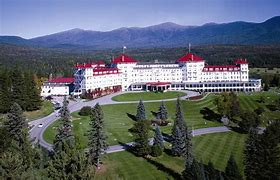
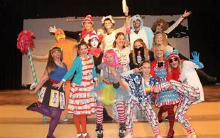
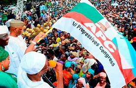
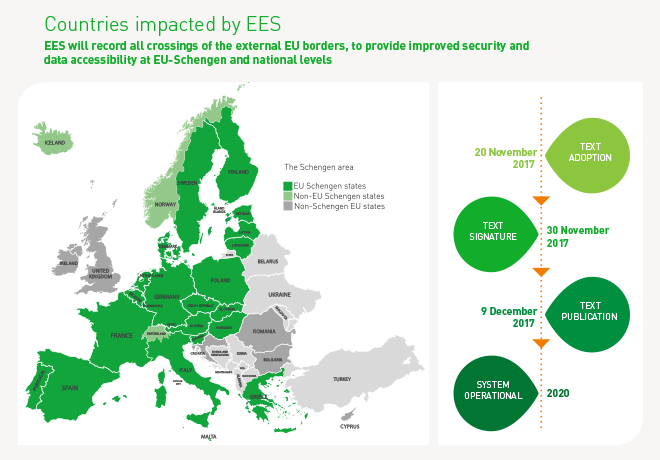
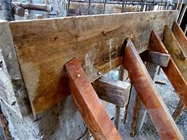
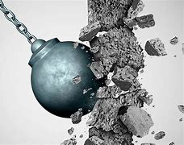

= eco 2020-06-20
:toc:

---

== The new world disorder 杂乱；混乱；凌乱  词汇解说

(eco 2020-6-20 / Special report / The new world disorder: Missing in action)

Global leadership *is* missing(a.)失踪的;不在的 in action

- 在行动中, 全球领导力缺失了

Seventy-five years ago the world’s leaders *designed the peace* even as they *fought the war*. Today’s leaders *need to do something similar*, says Daniel Franklin

Jun 18th 2020 |

A FEW WEEKS after Japan’s attack on Pearl Harbour, Winston Churchill was a guest at the White House. President Franklin Roosevelt *was so eager to tell him* he had come up with 找到（答案）；拿出（一笔钱等） a name for what would become a new world security organisation that, the story goes, he hurried into Churchill’s bedroom, to find the prime minister naked *save for* 除了；除…外 a bathrobe 浴衣；浴袍. `主` *What is striking* 引人注目的；异乎寻常的；显著的 about the origins of the “United Nations”, Roosevelt’s choice, `系` *is [not]* this unorthodox 非正统的；非传统的；不正规的 manner of communication (a modern American president *might have tweeted* his idea) *[but] that*, in the midst of war, statesmen 政治家 *were already planning for* the peace.

- save : prep. ( also *save for*) (old use,or formal) except sth 除了；除…外 +
-> They knew nothing about her *save* her name.
除名字外，他们对她一无所知。

- 引人注目的, 不是这种非正统的交流方式(一位现代美国总统可能会在推特上发表他的想法)，而是在战争期间，政治家们已经在为和平做计划了。

On the economic front 活动领域；阵线, this *led to* the creation, in 1944 at Bretton Woods 布雷顿森林（美国新罕布什尔州的度假胜地） in New Hampshire, of the World Bank and the International Monetary 货币的，钱的（尤指一国的金融） Fund (IMF). On the security side, plans for the UN *were fleshed 充实（计划、论据等的内容） out* at Dumbarton Oaks 敦巴顿橡树园（在美国首都华盛顿效区） in Washington, DC, *agreed to* [in outline(n.)概述；梗概] by Churchill, Roosevelt and Stalin at Yalta in the Crimea 克里米亚；克里米亚半岛 and *finalised* 把（计划、旅行、项目等）最后定下来；定案 at a conference in San Francisco after Roosevelt’s death. “Oh what a great day this can be in history,” *proclaimed* 宣布；宣告；声明 President Harry Truman 哈里·杜鲁门 at the concluding session （议会等的）会议，会期 on June 26th 1945, when the founding 创办的，发起的 charter 宪章，章程 *was signed*. Countries *had put aside their differences* [“in one unshakable unity 团结一致；联合；统一 of determination -- *to find a way* to end(v.) wars.”]

- Bretton Woods +

- *flesh sth out* : to add more information or details to a plan, an argument, etc. 充实（计划、论据等的内容） / flesh :（动物或人的）肉+
-> These points *were fleshed out* in the later parts of the speech. 这几点在演讲的后面部分已得到充实。

- 在经济方面，这导致了1944年在新汉普郡的布雷顿森林会议上，世界银行和国际货币基金组织(IMF)的成立。在安全方面，联合国的计划在华盛顿特区的邓巴顿橡树会议上得到了充实，在克里米亚的雅尔塔得到了丘吉尔、罗斯福和斯大林的初步同意，并在罗斯福去世后在旧金山的一次会议上最终敲定。1945年6月26日，美国签署了创始宪章，杜鲁门总统在闭幕会议上宣布:“哦，这是历史上多么伟大的一天。”各国把分歧放在一边，“以一种不可动摇的决心——找到结束战争的方法。”

Euphoria （通常指持续时间较短的）极度愉快的心情，极度兴奋的情绪 soon *gave way to*  屈服；退让；让步;让自己陷于（某种情绪等）;被…代替  frustration 当...时 *as* the cold war *set in* (雨、恶劣天气、感染等)到来；开始. Yet, *as* the new organisation’s second secretary-general, Dag Hammarskjold, *observed*, the UN “*[was not] created* to take mankind 人类 to heaven *[but]* to save humanity from hell”. [For 75 years] there *have been* no world wars (though too many smaller ones). Unlike its precursor 先驱；先锋；前身, the League of Nations, the UN *has proved resilient*(a.)可迅速恢复的；有适应力的. Its membership *has grown from 51 countries to 193*, through decolonisation 去殖民化（指一个地方从外国殖民统治转而独立及自治的过程） and the break-up （组织、国家的）拆分，分裂，分离 of the Soviet 苏联的 empire. It *sits* at the centre of a rules-based world order, and its activities and those of its specialised agencies 专业机构；专门机构 *span* 包括（广大地区）；涵盖（多项内容）;横跨；跨越 almost every aspect of life.

- euphoria : /juːˈfɔːriə/ n. [ U ] an extremely strong feeling of happiness and excitement that usually lasts only a short time （通常指持续时间较短的）极度愉快的心情，极度兴奋的情绪 +
=>  eu-, 好的。-phor, 带来，词源同bring, infer, phosphorus.

- 随着冷战的开始，短暂的欢欣鼓舞情绪很快变成了沮丧。然而，正如联合国第二任秘书长达格•哈马舍尔德(Dag Hammarskjold)所言，联合国“不是为了把人类带到天堂，而是为了将人类从地狱中拯救出来”。75年来没有发生过世界大战(尽管小战争太多了)。与其前身国际联盟(League of Nations)不同的是，事实证明, 联合国具有很强的韧性。通过去殖民化和苏联帝国的解体，其成员国从51个增至193个。它处于以规则为基础的世界秩序的中心，其活动及其专门机构的活动几乎涵盖生活的各个方面。

Yet `主` no international order `谓` *lasts(v.) for ever*. [Over time] *the balance of power shifts*(v.), *systems fail to adapt* and *the rot sets(v.) in*  (雨、恶劣天气、感染等)到来；开始. The peace (after the Congress of Vienna 维也纳会议 in 1815) *eroded slowly*; `主` that (after the Treaty of Versailles 凡尔赛和约 in 1919) `谓` *collapsed fast*. A change from one dominant power to another *has usually meant war* (the shift from Britain to America over a century ago *being* a rare exception).

- Congress of Vienna : N the European conference held at Vienna from 1814–15 to settle the territorial problems left by the Napoleonic Wars 维也纳会议 ; 1814-1815年间举行的欧洲会议,旨在处理拿破仑战争后遗留的领土问题

- 然而，没有一种国际秩序是永恒的。随着时间的推移，力量平衡会发生变化，旧的体系无法适应，开始被侵蚀。1815年维也纳会议后的和平,逐渐被破坏; 1919年凡尔赛条约后的和平,迅速瓦解。从一个主导强国到另一个强国的转变, 通常意味着战争(一个多世纪前, 从英国到美国的转变, 是一个罕见的例外)。

Covid-19 is a new challenge. A vacuum 真空 *exists* [where the world *would normally look for* American leadership]. *[Instead]* it *sees* President Donald Trump *making a fool of himself* 出丑, *suggesting* wacky 古怪的；滑稽可笑的；疯疯癫癫的 cures 药；药物；疗法. Mr Trump *has been more interested in* blaming(v.) China for the pandemic *than* rallying(v.)召集；集合 an international response, his most prominent 显眼的；显著的；突出的 move(n.) *being* to suspend(v.) funding to the World Health Organisation (WHO) and *threaten to leave it*. [In March] G7 foreign ministers *could not even issue a statement* because Mike Pompeo, America’s secretary of state, *insisted* it *refer to* the “Wuhan virus”.

- *make a fool of yourself* : to do sth stupid which makes other people think that you are a fool 出丑 +
-> *I made a complete fool of myself* in front of everyone!
我当众出了大丑了！

- *make a fool of sb* : to say or do sth deliberately so that people will think that sb is stupid 愚弄某人 +
-> Can't you see *she's making a fool of you*? 难道你不明白她是在愚弄你？

- wacky : /ˈwæki/ ( whacky ) ( informal ) funny or amusing in a slightly crazy way 古怪的；滑稽可笑的；疯疯癫癫的 +
=> 来自 whacky 变体，击，打，引申词义被打傻的。 +

- rally : /ˈræli/  *~ (sb/sth) (around/behind/to sb/sth)* to come together or bring people together in order to help or support sb/sth 召集；集合 /  ( finance 财 ) ( especially of share prices or a country's money 尤指股票价格或货币 ) to increase in value after falling in value 价格回升；跌后回升 +
=> 词根词缀： re-(e省略)再+ al-加强 + -ly-捆 → 再度捆在一起 +
-> *They have rallied a great deal of support* for their campaign. 他们为竞选活动征得了大量的支持。 +
-> The pound *rallied against the dollar*. 英镑对美元的比值回升了。 +

China’s initial response to the virus *was* a bungled 笨拙地做；失败;把…搞糟 cover-up(n.)掩盖；掩饰, but [since its harsh lockdown *brought covid-19 under control*], it *has touted 标榜；吹捧；吹嘘;兜售；推销 its successes*(n.) around the world /and *supplied* protective kit 防护装备 *to* thankful countries. The Europeans, meanwhile, *closed borders*, including in their supposedly 据信；据传；据说 frontier-free 无边界的 Schengen 申根（卢森堡东南部小城） area. A divided 分裂的；有分歧的 UN Security Council *has been missing in action*.

- Schengen Area : 申根区, 是指履行1985年在卢森堡申根镇签署的《申根协议》的26个欧洲国家所组成的区域。对于国际旅行者而言，这一区域非常像一个单独的国家，在该区域内的各个国家之间几乎不存在边境管制，可以自由出入。 +

The world order *was already looking wobbly*(a.)摇摆的；摇摇晃晃的. The global financial crisis of 2007-09 *fed(v.) populism* 平民政治；民粹主义；民意论 and a wariness(n.)谨慎，小心 of international institutions. These *often reflect the realities* of decades ago, not today (the Security Council’s five veto 否决权-holding permanent members *are* the victorious(a.)胜利的；获胜的；战胜的 powers of 1945), yet they *resist(v.)抵制；阻挡 reform*. The rules *remain*, but the big powers *increasingly feel free to ignore them*. Russia *has brazenly 厚脸皮地，厚颜无耻地 grabbed* a piece of Ukraine. China *has occupied disputed territories* in the South China Sea.

- wobble :  /ˈwɑːbl/ v. => 来自 PIE*webh,转，弯，编织，词源同 web,weave.引申词义摇摆。

- 世界秩序看起来已经摇摇欲坠。2007-09年的全球金融危机, 助长了民粹主义和对国际机构的警惕。这些往往反映了几十年前的现实，而不是今天的现实(安理会拥有否决权的五个常任理事国, 是1945年的战胜国)，但它们抵制改革。这些国际规则仍然存在，但大国越来越觉得可以无视它们。俄罗斯厚颜无耻地攫取了乌克兰的一块领土。中国占领了南中国海的争议领土。

America *has long complained about* the cost of *propping up* 撑起；支起;帮助；扶持；救济 the multilateral  多边的；多国的 system and *fretted 苦恼；烦躁；焦虑不安 about* “Gulliverisation”, *being tied down* 限制；束缚；牵制 by punier 小于一般尺寸的, 弱小的 powers. Along with Britain *it invaded Iraq* in 2003 without a mandate （政府或组织等经选举而获得的）授权 from the Security Council. President Barack Obama, *prioritising*  优先处理 “nation-building at home”, *began* a semi-retreat *from* the burdens of global leadership. But the principal 最重要的；主要的 architect 建筑师; 设计师；缔造者；创造者 of the system now *has* a president who *seems* to delight(v.)使高兴；使愉快；使快乐 in *taking* a wrecking ball （悬挂于吊车供拆除建筑物用的）破碎球，落锤 *to* it.

- prop : v. *~ sth/sb (up) (against sth)* to support an object by leaning it against sth, or putting sth under it etc.; to support a person in the same way 支撑 +
=> 来自中古荷兰语proppe,葡萄藤蔓支撑架，支撑，词源不详。可能来自拉丁语propago,放置，固定，来自pro-,向前，-pag,固定，词源同page,compact. +
-> *She propped herself up* on one elbow. 她单肘撑起身子。 +
-> The door *was propped open*. 门被支开着。 +

- *prop sth up* : (1) to prevent sth from falling by putting sth under it to support it 撑起；支起
SYN shore up / (2) ( often disapproving ) to help sth that is having difficulties 帮助；扶持；救济 +
-> The government was accused of *propping up declining industries*. 人们指责政府贴补日趋衰落的产业。

- multilateral =>  -multi-多(重)的 + -later-边,侧 + -al形容词词尾

- puny : /ˈpjuːni/ a. small and weak 弱小的；孱弱的 / not very impressive 不起眼的；可怜的；微不足道的 +
=> 来自古法语puisne,最小的，最后出生的，来自puis,以后，在后，来自拉丁语post,在后。-ne,出生，词源同natal.引申词义小的，弱的，劣质的，孱弱的。

- *wrecking ball* : n. a heavy metal ball that swings from a crane and is used to hit a building to make it fall down （悬挂于吊车供拆除建筑物用的）破碎球，落锤 / wreck : v. to damage or destroy sth 破坏；损坏；毁坏 +

- 长期以来，美国一直在抱怨支撑多边体系的成本，并担心“Gulliverisation”, 即, 被实力较弱的国家束缚住。2003年，美国和英国在没有得到安理会授权的情况下入侵伊拉克。美国总统巴拉克•奥巴马(Barack Obama)将“国内建设”作为首要任务，开始从全球领导的重担中半撤退。但是，这个体系的主要建设者(即美国本身), 现在有了一位总统，他看上去乐于用破碎球来摧毁它。

Mr Trump *has withdrawn from* the Paris agreement on climate change and *the nuclear deal* with Iran. He *has cast doubt on* America’s commitment to NATO (though *he has strengthened its forces* in many parts of Europe). He *has continued to undermine*(v.) the World Trade Organisation (WTO) by *blocking(v.) the appointment of new judges* to its appellate(a.)上诉的; 与上诉有关的 body. He *has called* the European Union 宾补 a “foe” 敌人；仇敌. His love of sanctions *causes* further friction 摩擦,摩擦力, *prompting complaints*(n.) that America *is abusing the “exorbitant(a.)(价格)过高的；高得离谱的 privilege”* of having the world’s reserve currency 储备货币 /and *stimulating*(v.) interest (among allies and rivals alike) in *reducing* the dollar’s dominance.

- foe => 来自PIE*peig, 敌对的，敌视的，词源同feud, fiend.

- *reserve currency* : N foreign currency that is acceptable as a medium of international payments and that is therefore held in reserve by many countries 储备货币; 可作为国际付款方式接受外国货币，也因此为多个国家储存

- 特朗普已经退出了关于气候变化的巴黎协议和伊朗核协议。他对"美国对北约的承诺"表示怀疑(尽管他加强了在欧洲许多地区的军事力量)。他继续阻挠世贸组织的上诉机构任命新法官，以此破坏世贸组织。他称欧盟为“敌人”。他对制裁的热衷, 引发了进一步的摩擦，引发了人们的抱怨，即美国正在滥用拥有世界储备货币的“过度特权”，并刺激了(盟友和竞争对手)的"削弱美元主导地位"的兴趣。

At the UN, America’s allies （尤指战时的）同盟国;（尤指从政者的）盟友，支持者 *complain that* Mr Trump 宾补 “cherry-picks” 挑捡最好的. `主` What is new `系` *[is not] pulling out of* 脱离；退出 an agency or two (Mr Trump *has pulled out of* the Paris-based *education and cultural agency*, UNESCO 联合国教科文组织, and the Geneva-based *Human Rights Council* 人权理事会, *complaining of* anti-Israel bias(n.)偏见；偏心；偏向), [*but*] the lack of commitment to the system. His America First rhetoric(n.)华而不实的言语；花言巧语; 修辞技巧；修辞 *echoes* the language of Henry Cabot Lodge, an isolationist 孤立主义的 senator who *successfully fought against* joining(v.) the League of Nations in the 1920s. *It is a stark(a.)（指区别）明显的，鲜明的;严酷的；赤裸裸的；真实而无法回避的 contrast with* the internationalism 国际主义 of Roosevelt and Truman  杜鲁门. “The future *does not belong to* globalists 支持全球主义的人,” Mr Trump *told* the UN General Assembly 联合国大会 last September. “The future *belongs to* patriots 爱国者.” All this *means that*, far from *looking forward to* a happy birthday, the UN *approaches* its 75th anniversary [in a state of high anxiety].

- cherry-pick : V-T If someone *cherry-picks*(v.) people or things, they choose the best ones from a group of them, often in a way that other people consider unfair. 挑捡最好的 +
->  The team is in debt while others are lining up *to cherry-pick* their best players.
该队负了债，而别的队正在排队挑捡他们最好的运动员。

- rhetoric /ˈretərɪk/ n. ( formal often disapproving ) speech or writing that is intended to influence people, but that is not completely honest or sincere 华而不实的言语；花言巧语

- *General Assembly* : N the deliberative assembly of the United Nations 联合国大会 ( abbr: GA)

- 在联合国，美国的盟友抱怨特朗普“挑剔”。特朗普退出一两个国际机构并不新鲜,(特朗普已经退出了总部位于巴黎的教育和文化机构--联合国教科文组织(UNESCO), 和总部位于日内瓦的人权理事会(Human Rights Council)，因为它抱怨其反以色列的偏见)，关键是, 特朗普缺乏对该体系的承诺。他的"美国优先"言论, 与亨利•卡伯特•洛奇(Henry Cabot Lodge)的言论不约而同。亨利•卡伯特•洛奇是一名孤立主义参议员，曾在20世纪20年代成功地反对加入国际联盟(League of Nations)。这与罗斯福和杜鲁门的国际主义形成鲜明对比。特朗普去年9月在联合国大会上表示：“未来不属于全球主义者”, “未来属于爱国者。”所有这一切意味着，联合国非但没有期待生日快乐，反而在高度焦虑的状态下接近其75周年纪念日。

Its secretary-general, António Guterres, a jovial 快乐的；愉快的；友好的;天性快活的；主神朱庇特的 former prime minister of Portugal, *divides* the UN’s history *into three periods*. The first *was* “bipolar” 有两极的，双极的;双相型障碍的；躁狂抑郁性精神病的, *characterised by* cold-war rivalry(n.)竞争；竞赛；较量 between America and the Soviet Union. Although the Security Council *was largely frozen*, there was a certain predictability 可预测性；可预言 in the stand-off(n.) （双方）僵持局面, and the UN *was inventive(a.)(尤指人)善于创新的；有创意的;(思想)有新意的；有创意的 enough* to expand(v.) into areas such as peacekeeping, which *is not even mentioned* in its charter.

- jovial : /ˈdʒoʊviəl/ a. very cheerful and friendly 快乐的；愉快的；友好的 +
=>  来自Jove,古罗马神话主神，木星。字面意思即木星的，来自古代占星术概念，在木星位出生的孩子性格会比较开朗和活泼，引申词义欢乐的。

- 联合国秘书长安东尼奥·古特雷斯，一位性格开朗的葡萄牙前总理，将联合国的历史分为三个时期。第一个是“两极”，以美国和苏联之间的冷战竞争为特征。尽管安理会在很大程度上处于冻结状态，但这种对峙仍有一定的可预见性。联合国也有足够的创造力，将触角伸到了维和等领域，而这些领域甚至在其宪章中都没有提及。

[After the collapse of communism 共产主义] *came* a brief “unipolar” 单极的 period, when America’s dominance *was barely contested* 争取赢得（比赛、选举等）;争辩；就…提出异议. The Security Council *was able to function as* its founders envisaged 设想, *launching a flurry 一阵忙乱（或激动、兴奋等）;小阵雪（或雨等） of peace missions*(n.) as well as *authorising*(v.)批准；授权 the American-led liberation of Kuwait in 1991. George Bush senior （父子同名时，加在父亲的名字前）老，大 *hailed*  赞扬（或称颂）…为…（尤用于报章等） a “new world order”. The UN *developed the principle* of a “responsibility *to protect*” populations *against* mass atrocities(n.)暴行;（尤指战争中的）残暴行为.

- 共产主义崩溃后，出现了一个短暂的“单极”时期，当时美国的主导地位几乎没有受到挑战。安理会能够像其创建者设想的那样发挥作用，启动了一系列和平任务，并在1991年授权美国领导解放科威特。老布什为“世界新秩序”而欢呼。联合国制定了“保护人民免受大规模暴行的责任”原则。

But, bogged down in the Middle East and Afghanistan, America has grown weary and inward-looking. In the wider world, wariness about the West imposing its values, especially by force, has increased. A revanchist Russia and a soaring China increasingly challenge America’s supremacy. The Security Council is once again stuck, reflecting renewed great-power rivalry. This third period, as Mr Guterres sees it, is still unsettled. “The world is not yet multipolar, it’s essentially chaotic,” he says.

America, first

A degree of chaos is not surprising, given the dramatic shifts that are starting to divide the world into competing spheres of influence. Take the economy. Since 2000 China’s share of global GDP at market rates has gone from less than 4% to nearly 16%. Its technology giants, such as Alibaba, Tencent and Huawei, are spreading Chinese digital infrastructure abroad, especially in emerging markets. China is the world’s largest exporter, and although a relative newcomer (having joined the club only in 2001) now presents itself as chief defender of a WTO under assault from America.

In finance, though the dollar still dominates, the yuan is poised to gain ground. At the IMF, China remains underrepresented, with a quota and voting share of only 6%. But as the fund strives to support a stricken global economy, China will be a core consideration, whether in the design of debt relief (China is reckoned to have lent more than $140bn to African governments and state-owned enterprises since 2000) or in increasing quotas.

These upheavals spill over into the diplomatic and security dimensions that are the focus of this special report. Are the UN, and the collaborative global governance it embodies, doomed to be less relevant in a world of great-power competition? It is surely too soon to give up on them. But to retain its clout and character the liberal order needs restored leadership and difficult reforms.

The multilateral system has important strengths. One is that it is patently needed. The biggest problems cry out for international co-operation—as the pandemic powerfully illustrates. The world needs to work together on vaccines, on economic recovery and to support the most vulnerable countries. The head of the World Food Programme, David Beasley, a former Republican governor of South Carolina, has said speedy action is necessary to prevent “multiple famines of biblical proportions”. Concerted efforts are also needed on climate change, another challenge no country can tackle on its own. The risk of nuclear proliferation is growing.

A second advantage is that the UN is popular. It has made shameful mistakes. It failed to prevent genocide in Rwanda and Srebrenica. UN peacekeepers are blamed for bringing cholera to Haiti and sexual abuse to many of the places they were meant to protect. The UN’s oil-for-food programme with Iraq led to a $1.8bn scam. Yet it is more trusted than many governments, according to the 2020 Edelman Trust Barometer. Across 32 countries surveyed by Pew last year, a median of 61% had a favourable opinion of the UN, against 26% with an unfavourable view. A comfortable majority of Americans think well of it, though there is a growing partisan divide: 77% of Democrats approve, but only 36% of Republicans.

In another survey last year, by the Chicago Council on Global Affairs, seven out of ten Americans said it would be best if the country took an active part in world affairs, close to the highest on record. That points to a final force that should not be underestimated: the potential for American re-engagement. America remains a more powerful economy with greater reach in hard and soft power than any rivals. It could again be the standard-bearer for a liberal world order.

It would be naive to expect sudden enthusiasm for multilateralism from Mr Trump—and even beyond him. American suspicion of foreign entanglements is as old as the republic. Frustration with the WTO, NATO and the rest was mounting before Mr Trump tapped into it. The divisions at home that have deepened under his presidency make leadership abroad harder. Still, victory for Joe Biden in the presidential election in November would be, if not exactly a game-changer, at least a game-restarter. “We will be back,” Mr Biden promised last year’s Munich Security Conference.

The UN wants to use its 75th anniversary for a grand consultation on the future of multilateralism. Covid-19 has hijacked the global agenda. But it also creates an opportunity. Rather than destroying the system, the upheaval could spur countries into strengthening it. That will require planning for the future while tackling the crisis of the present. Today’s leaders need to emulate what their predecessors achieved so magnificently in 1945.

---

== The new world disorder

Global leadership is missing in action

Seventy-five years ago the world’s leaders designed the peace even as they fought the war. Today’s leaders need to do something similar, says Daniel Franklin

Jun 18th 2020 |

A FEW WEEKS after Japan’s attack on Pearl Harbour, Winston Churchill was a guest at the White House. President Franklin Roosevelt was so eager to tell him he had come up with a name for what would become a new world security organisation that, the story goes, he hurried into Churchill’s bedroom, to find the prime minister naked save for a bathrobe. What is striking about the origins of the “United Nations”, Roosevelt’s choice, is not this unorthodox manner of communication (a modern American president might have tweeted his idea) but that, in the midst of war, statesmen were already planning for the peace.

On the economic front, this led to the creation, in 1944 at Bretton Woods in New Hampshire, of the World Bank and the International Monetary Fund (IMF). On the security side, plans for the UN were fleshed out at Dumbarton Oaks in Washington, DC, agreed to in outline by Churchill, Roosevelt and Stalin at Yalta in the Crimea and finalised at a conference in San Francisco after Roosevelt’s death. “Oh what a great day this can be in history,” proclaimed President Harry Truman at the concluding session on June 26th 1945, when the founding charter was signed. Countries had put aside their differences “in one unshakable unity of determination—to find a way to end wars.”

Euphoria soon gave way to frustration as the cold war set in. Yet, as the new organisation’s second secretary-general, Dag Hammarskjold, observed, the UN “was not created to take mankind to heaven but to save humanity from hell”. For 75 years there have been no world wars (though too many smaller ones). Unlike its precursor, the League of Nations, the UN has proved resilient. Its membership has grown from 51 countries to 193, through decolonisation and the break-up of the Soviet empire. It sits at the centre of a rules-based world order, and its activities and those of its specialised agencies span almost every aspect of life.

Yet no international order lasts for ever. Over time the balance of power shifts, systems fail to adapt and the rot sets in. The peace after the Congress of Vienna in 1815 eroded slowly; that after the Treaty of Versailles in 1919 collapsed fast. A change from one dominant power to another has usually meant war (the shift from Britain to America over a century ago being a rare exception).

Covid-19 is a new challenge. A vacuum exists where the world would normally look for American leadership. Instead it sees President Donald Trump making a fool of himself, suggesting wacky cures. Mr Trump has been more interested in blaming China for the pandemic than rallying an international response, his most prominent move being to suspend funding to the World Health Organisation (WHO) and threaten to leave it. In March G7 foreign ministers could not even issue a statement because Mike Pompeo, America’s secretary of state, insisted it refer to the “Wuhan virus”.

China’s initial response to the virus was a bungled cover-up, but since its harsh lockdown brought covid-19 under control, it has touted its successes around the world and supplied protective kit to thankful countries. The Europeans, meanwhile, closed borders, including in their supposedly frontier-free Schengen area. A divided UN Security Council has been missing in action.

The world order was already looking wobbly. The global financial crisis of 2007-09 fed populism and a wariness of international institutions. These often reflect the realities of decades ago, not today (the Security Council’s five veto-holding permanent members are the victorious powers of 1945), yet they resist reform. The rules remain, but the big powers increasingly feel free to ignore them. Russia has brazenly grabbed a piece of Ukraine. China has occupied disputed territories in the South China Sea.

America has long complained about the cost of propping up the multilateral system and fretted about “Gulliverisation”, being tied down by punier powers. Along with Britain it invaded Iraq in 2003 without a mandate from the Security Council. President Barack Obama, prioritising “nation-building at home”, began a semi-retreat from the burdens of global leadership. But the principal architect of the system now has a president who seems to delight in taking a wrecking ball to it.

Mr Trump has withdrawn from the Paris agreement on climate change and the nuclear deal with Iran. He has cast doubt on America’s commitment to NATO (though he has strengthened its forces in many parts of Europe). He has continued to undermine the World Trade Organisation (WTO) by blocking the appointment of new judges to its appellate body. He has called the European Union a “foe”. His love of sanctions causes further friction, prompting complaints that America is abusing the “exorbitant privilege” of having the world’s reserve currency and stimulating interest (among allies and rivals alike) in reducing the dollar’s dominance.

At the UN, America’s allies complain that Mr Trump “cherry-picks”. What is new is not pulling out of an agency or two (Mr Trump has pulled out of the Paris-based education and cultural agency, UNESCO, and the Geneva-based Human Rights Council, complaining of anti-Israel bias), but the lack of commitment to the system. His America First rhetoric echoes the language of Henry Cabot Lodge, an isolationist senator who successfully fought against joining the League of Nations in the 1920s. It is a stark contrast with the internationalism of Roosevelt and Truman. “The future does not belong to globalists,” Mr Trump told the UN General Assembly last September. “The future belongs to patriots.” All this means that, far from looking forward to a happy birthday, the UN approaches its 75th anniversary in a state of high anxiety.

Its secretary-general, António Guterres, a jovial former prime minister of Portugal, divides the UN’s history into three periods. The first was “bipolar”, characterised by cold-war rivalry between America and the Soviet Union. Although the Security Council was largely frozen, there was a certain predictability in the stand-off, and the UN was inventive enough to expand into areas such as peacekeeping, which is not even mentioned in its charter.

After the collapse of communism came a brief “unipolar” period, when America’s dominance was barely contested. The Security Council was able to function as its founders envisaged, launching a flurry of peace missions as well as authorising the American-led liberation of Kuwait in 1991. George Bush senior hailed a “new world order”. The UN developed the principle of a “responsibility to protect” populations against mass atrocities.

But, bogged down in the Middle East and Afghanistan, America has grown weary and inward-looking. In the wider world, wariness about the West imposing its values, especially by force, has increased. A revanchist Russia and a soaring China increasingly challenge America’s supremacy. The Security Council is once again stuck, reflecting renewed great-power rivalry. This third period, as Mr Guterres sees it, is still unsettled. “The world is not yet multipolar, it’s essentially chaotic,” he says.

America, first

A degree of chaos is not surprising, given the dramatic shifts that are starting to divide the world into competing spheres of influence. Take the economy. Since 2000 China’s share of global GDP at market rates has gone from less than 4% to nearly 16%. Its technology giants, such as Alibaba, Tencent and Huawei, are spreading Chinese digital infrastructure abroad, especially in emerging markets. China is the world’s largest exporter, and although a relative newcomer (having joined the club only in 2001) now presents itself as chief defender of a WTO under assault from America.

In finance, though the dollar still dominates, the yuan is poised to gain ground. At the IMF, China remains underrepresented, with a quota and voting share of only 6%. But as the fund strives to support a stricken global economy, China will be a core consideration, whether in the design of debt relief (China is reckoned to have lent more than $140bn to African governments and state-owned enterprises since 2000) or in increasing quotas.

These upheavals spill over into the diplomatic and security dimensions that are the focus of this special report. Are the UN, and the collaborative global governance it embodies, doomed to be less relevant in a world of great-power competition? It is surely too soon to give up on them. But to retain its clout and character the liberal order needs restored leadership and difficult reforms.

The multilateral system has important strengths. One is that it is patently needed. The biggest problems cry out for international co-operation—as the pandemic powerfully illustrates. The world needs to work together on vaccines, on economic recovery and to support the most vulnerable countries. The head of the World Food Programme, David Beasley, a former Republican governor of South Carolina, has said speedy action is necessary to prevent “multiple famines of biblical proportions”. Concerted efforts are also needed on climate change, another challenge no country can tackle on its own. The risk of nuclear proliferation is growing.

A second advantage is that the UN is popular. It has made shameful mistakes. It failed to prevent genocide in Rwanda and Srebrenica. UN peacekeepers are blamed for bringing cholera to Haiti and sexual abuse to many of the places they were meant to protect. The UN’s oil-for-food programme with Iraq led to a $1.8bn scam. Yet it is more trusted than many governments, according to the 2020 Edelman Trust Barometer. Across 32 countries surveyed by Pew last year, a median of 61% had a favourable opinion of the UN, against 26% with an unfavourable view. A comfortable majority of Americans think well of it, though there is a growing partisan divide: 77% of Democrats approve, but only 36% of Republicans.

In another survey last year, by the Chicago Council on Global Affairs, seven out of ten Americans said it would be best if the country took an active part in world affairs, close to the highest on record. That points to a final force that should not be underestimated: the potential for American re-engagement. America remains a more powerful economy with greater reach in hard and soft power than any rivals. It could again be the standard-bearer for a liberal world order.

It would be naive to expect sudden enthusiasm for multilateralism from Mr Trump—and even beyond him. American suspicion of foreign entanglements is as old as the republic. Frustration with the WTO, NATO and the rest was mounting before Mr Trump tapped into it. The divisions at home that have deepened under his presidency make leadership abroad harder. Still, victory for Joe Biden in the presidential election in November would be, if not exactly a game-changer, at least a game-restarter. “We will be back,” Mr Biden promised last year’s Munich Security Conference.

The UN wants to use its 75th anniversary for a grand consultation on the future of multilateralism. Covid-19 has hijacked the global agenda. But it also creates an opportunity. Rather than destroying the system, the upheaval could spur countries into strengthening it. That will require planning for the future while tackling the crisis of the present. Today’s leaders need to emulate what their predecessors achieved so magnificently in 1945.

---

但是，深陷中东和阿富汗泥潭的美国已经变得厌倦和内向。在更广阔的世界里，对西方强加其价值观(尤其是通过武力)的警惕有所增加。复仇主义的俄罗斯, 和崛起的中国, 日益挑战美国的霸权。安理会再次陷入僵局，反映出大国之间的竞争再度抬头。在古特雷斯看来，这第三个时期仍不稳定。“世界还不是多极的，它本质上是混乱的，”他说。
美国,第一
考虑到戏剧性的变化正开始将世界划分为相互竞争的势力范围，出现一定程度的混乱并不令人惊讶。经济。自2000年以来，中国在全球GDP中所占的份额(按市场比率计算)已从不足4%上升到近16%。中国的科技巨头，如阿里巴巴、腾讯和华为，正在向海外推广中国的数字基础设施，尤其是在新兴市场。中国是世界上最大的出口国，尽管作为一个相对较新的国家(2001年才加入这个俱乐部)，现在却表现得像一个受到美国攻击的世贸组织的主要捍卫者。

在金融领域，尽管美元仍占主导地位，但人民币正蓄势待发。在国际货币基金组织中，中国的份额仍然不足，只有6%的份额和投票权。但在imf努力支持陷入困境的全球经济之际，无论是在债务减免的设计(据估计，自2000年以来，中国已向非洲政府和国有企业发放逾1400亿美元贷款)，还是在增加配额方面，中国都将是imf的一个核心考虑因素。
这些动荡影响到外交和安全方面，这是本特别报告的重点。在一个大国竞争的世界里，联合国及其所体现的协作性全球治理是否注定会变得不那么重要?现在就放弃它们还为时过早。但为了保持其影响力和个性，自由秩序需要恢复领导力和艰难的改革。
多边体系具有重要的优势。一是它显然是必要的。最大的问题需要国际合作——就像大流行强有力地说明的那样。全世界需要在疫苗、经济复苏和支持最脆弱国家方面共同努力。世界粮食计划署(World Food Programme)总干事、南卡罗来纳州前共和党州长戴维•比斯利(David Beasley)表示，必须迅速采取行动，以防止“大规模的多重饥荒”。应对气候变化也需要各国共同努力，这是任何国家都无法单独应对的挑战。核扩散的风险正在增加。
第二个优势是联合国很受欢迎。它犯了可耻的错误。它未能防止卢旺达和斯雷布雷尼察的种族灭绝。联合国维和人员被指责将霍乱带到了海地，并在他们本应保护的许多地方造成了性虐待。联合国与伊拉克的石油换食品计划导致了一场18亿美元的骗局。然而，根据2020年爱德曼信任度晴雨表，它比许多政府更受信任。去年皮尤调查的32个国家中，61%的人对联合国有好感，26%的人对联合国不好感。尽管党派分歧日益扩大:77%的民主党人赞成，而只有36%的共和党人赞成。
在芝加哥全球事务委员会去年进行的另一项调查中，70%的美国人认为美国最好积极参与世界事务，这一比例接近历史最高水平。这指向了不可低估的最后一股力量:美国重新介入的潜力。美国仍然是一个比任何对手都更强大的经济体，在硬实力和软实力方面都有更大的影响力。它可能再次成为自由世界秩序的旗手。
如果指望特朗普先生——甚至他自己以外的人——突然对多边主义产生热情，那就太天真了。美国人对外交纠葛的怀疑与美国的历史一样久远。在特朗普发动攻击之前，人们对WTO、北约(NATO)和其他组织的失望情绪就已经在加剧。在他的总统任期内，国内分歧加深，使得他在国外的领导更加困难。尽管如此，乔•拜登(Joe Biden)在11月总统大选中的胜利即使不能完全改变游戏规则，至少也会是游戏规则的重启。“我们会回来的，”拜登在去年的慕尼黑安全会议上承诺。
联合国想利用成立75周年的契机，就多边主义的未来进行一次盛大的磋商。Covid-19劫持了全球议程。但这也创造了一个机会。这场剧变非但不会摧毁这个体系，反而会促使各国加强这个体系。这将需要在应对当前危机的同时，为未来做好规划。今天的领导人需要效仿他们的前任在1945年所取得的辉煌成就。
