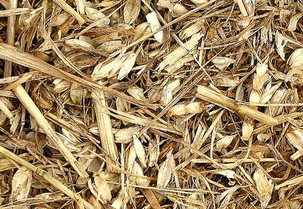
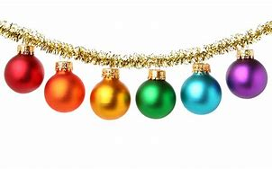

= eco 2020-06-20
:toc:

---

== Fashion victims 词汇解说

(eco 2020-6-20 / Business / Luxury in the pandemic: Fashion victims)

How slow times [in the luxury world] *will separate* the bling 奢华高档的首饰或服装 *from* the chaff 谷壳；糠

Posh 上流社会的；上等人的;优雅豪华的；富丽堂皇的 purveyors 提供者；供应商；供应公司 *are having to rethink* their business model [in a hurry]

Jun 20th 2020 | PARIS

- chaff : /tʃɑːf/ => 来自PIE*gep, 咬，咀嚼，词源同jaw, jowl. +

- purveyor : /pərˈveɪər/ ( formal ) a person or company that supplies sth 提供者；供应商；供应公司

- 时尚的受害者 +
奢侈品世界, 将以多慢的速度, 将奢华与糟粕区分开来 +
时髦的供应商们, 不得不赶紧重新思考他们的商业模式

MILAN  米兰（意大利北部城市）, PARIS or New York [this time of year] *would usually be teeming(v.)充满，遍布，到处都是（移动着的人、动物等） with* fashionistas 时装设计师；穿着入时的人(复数) *scrambling to get from* `the Balenciaga 巴黎世家(品牌) show` *to* `the Chanel party`. Not in 2020. Fashion weeks *have been cancelled*, *repurposed*(v.)（为适合新用途）对…稍加修改，略微改动 *as* posh catwalk （时装表演时供模特儿用的）狭长表演台，T形台 webinars 网络研讨会；在线会议. `主` Shops *selling* Hermès ties and Prada pumps 轻软舞鞋；轻便帆布鞋 `谓` *are only just reopening*, *wondering* what to do with `stock （商店的）现货，存货，库存 of pre-covid-19 vintage`  特定年份（或地方）酿制的酒；酿造年份. `主` Instagram influencers 有影响力的人 normally on hand `*to feed* 喂养；饲养; 满足（需要、愿望、欲望等） the hype` （电视、广播等中言过其实的）促销广告，促销讨论 `谓` *have nothing to snap* 拍照；摄影.

- teem : [ V ] ( of rain 雨 ) to fall heavily 倾注；倾泻 +
=> 来自古英语 teman,生育，繁殖，来自 Proto-Germanic*taumjan,拉，引导，来自 PIE*deuk,拉， 引导，词源同 team,duct.引申词义充满，大量。

- *TEEM WITH STH* : ( usu be *teeming with sth* ) to be full of people, animals, etc. moving around 充满，遍布，到处都是（移动着的人、动物等）

- fashionista : /ˌfæʃnˈiːstə/ n. ( used especially in newspapers 尤用于报章 ) a fashion designer , or a person who is always dressed in a fashionable way 时装设计师；穿着入时的人

- repurpose : v. /ˌriːˈpɜːpəs/ [ VN ] to change sth slightly in order to make it suitable for a new purpose （为适合新用途）对…稍加修改，略微改动

- webinar : /ˈwebɪnɑːr/ N an interactive seminar conducted over the World Wide Web 网络研讨会  +
=> 缩合词：web + seminar.  seminar 研讨会；培训会 => 来自 semen,种子，-arium, 表地方。

- pump : ( BrE ) a light soft shoe that you wear for dancing or exercise 轻软舞鞋；轻便帆布鞋 / 抽水机；泵；打气筒  +
-> ballet pumps 芭蕾舞鞋 +

- vintage : /ˈvɪntɪdʒ/ the wine that was produced in a particular year or place; the year in which it was produced 特定年份（或地方）酿制的酒；酿造年份 / [ usually sing. ] the period or season of gathering grapes for making wine 采摘葡萄酿酒的期间（或季节）；葡萄收获期（或季节） +
=> 来自拉丁语 vindemia,葡萄收割，葡萄生产，vin-,葡萄，de-,向下，取下，-em,拿，带，词源 同 example.引申词义特定年份收割的葡萄，上等葡萄酒，佳酿，引申词义经典的，典型的。 +
-> *the 1999 vintage*. 1999年酿制的葡萄酒

- 每年的这个时候，米兰、巴黎或纽约, 通常都挤满了从巴黎世家(Balenciaga)时装秀, 赶赴香奈儿(Chanel)派对的时尚达人。但在2020年却不是这样了。时装周已被取消，改成了时髦的t台网络研讨会。爱马仕(Hermes)领带, 和普拉达(Prada)高跟鞋店, 刚刚重新开张，不知道如何处理covid-19爆发前的库存。Instagram上的有影响力的人士, 通常用来为奢侈品的广告炒作提供支持, 现在却没什么可拍照的。

The world of personal luxury goods -- *from* handbags and `haute 时髦的；高级的 couture`(n.)时装设计制作；时装 *to* `diamond rings` and `pricey Swiss watches` -- *has been* in hibernation 冬眠,蛰伏. [At the height of the pandemic between March and May] sales *slumped （价格、价值、数量等）骤降，猛跌，锐减 by 75% or so* on a year earlier, *according to* the Boston Consulting Group. They *have slowly picked up* （贸易或经济）好转，改善 as Asia, then Europe and America, *started reopening*. Even so, the outlook for the luxury world *is far from glittering* 辉煌的；成功的;灿烂夺目的；闪闪发光的.

- couture : /kuˈtʊr/ n. [ U ] ( from French ) the design and production of expensive and fashionable clothes; these clothes 时装设计制作；时装 +
=>  来自拉丁词consuere, 缝制，来自su-, 缝，词源同sew, suture. -t, 过去分词后缀。 +
-> *a couture(n.) evening dress* 昂贵时髦的晚礼服 +

- hibernate => 来自hiems,冬天，雪，词源同hiemal,Himalaya.引申词义冬眠，蛰伏。

- 个人奢侈品的世界——从手提包、高级时装到钻石戒指和昂贵的瑞士手表——已经进入了冬眠期。根据波士顿咨询集团的数据，在疫情最严重的三月到五月间，销售量比一年前下降了75%左右。随着亚洲，然后是欧洲和美国开始重新开放，它们已经慢慢复苏。即便如此，奢侈品行业的前景也远非光明。

The global recession 经济衰退；经济萎缩 *hangs over* a sector (*fuelled 给…提供燃料 by* consumer confidence). Beyond that `short-term shock`, the industry *is facing* an overhaul 彻底检修；全面改革（制度、方法等） *in* `how its baubles 低廉花哨的首饰 *are made*`, where they *are sold* and *to whom*. `主` Trends (*once expected(v.) to play out* （使）（戏剧性的事件）逐渐发生；（使）展开 over a decade) `谓` *may unfold* （使）展开；打开;（使）逐渐展现；展示；透露 in mere quarters. Rapid change *has set(v.) nerves jangling*(v.)刺激，烦扰（神经）；（使）烦躁不安 in a business (*meant to exude*(v.)流露，显露（感觉或品质）；（感觉或品质）显现 timeless tradition).

- bauble :  /ˈbɔːbl/ 低廉花哨的首饰; /圣诞树装饰球 +

- jangle : /ˈdʒæŋɡl/ v.（使）发出金属撞击声，发出丁零当啷的刺耳声 / if your nerves jangle , or if sb/sth jangles them, you feel anxious or upset 刺激，烦扰（神经）；（使）烦躁不安

- exude : /ɪɡˈzuːd/ v. if you exude a particular feeling or quality, or it exudes from you, people can easily see that you have it 流露，显露（感觉或品质）；（感觉或品质）显现 / 流出，渗出（液体）；散发出（气味）；（从某处）渗出，散发出来 +
-> She *exuded(v.) confidence*. 她显得信心十足。

- 全球衰退笼罩着一个由消费者信心推动的行业。除了短期的冲击之外，该行业还面临着一场彻底的改革，包括其产品的制造方式、销售地点和买家。一度被认为会持续10年的趋势, 可能会在短短几个季度内就显现出来。在这个本应彰显永恒传统的行业，快速的变化让人神经紧张。

*Start with* `who is buying(v.) and where`. Although most purveyors of luxury *are* European (with `America home` to `some of the lesser marques` 知名品牌), most of their customers *come from Asia*. Asians *bought* more than half of the €281bn ($315bn) `in bling(n.)奢华高档的首饰或服装 sold` [last year]. Chinese buyers alone *have gone from* 1% of purchases in 2000 *to 35%* last year, *according to* Bain, another consultancy. But most of that -- perhaps 70% -- *was purchased overseas*, often on jaunts （短途）游览，旅行 to Europe. Just over `a tenth` of all luxury sales *were actually booked* in mainland China.

- jaunt : /dʒɔːnt/ n.  （短途）游览，旅行 +
=> 词源不详，可能同jump,跳。引申词义颠簸，痛苦的行程，这也是该词原先的词义，后来用于指短途旅行，游览，欢快的行程。字母m,n音变，比较home,haunt,lamp,lantern.

- 先从"谁在哪里购买"开始。尽管大多数奢侈品供应商都是欧洲人(美国是一些较小品牌的大本营)，但他们的大多数客户都来自亚洲。去年售出的2810亿欧元(合3150亿美元)珠宝中，亚洲人购买了一半以上。另一家咨询公司贝恩(Bain)的数据显示，仅中国买家就从2000年时的占总购买量的1%, 上升到去年的35%。但其中大部分(大约70%)是在海外购买的(而非在中国本土购买的)，通常是在去欧洲的短途旅行中购买的。在所有奢侈品销售中，只有略高于十分之一的销售是在中国大陆完成的。

Unless `intercontinental 洲际的；洲与洲之间的 tourism` 旅游业；观光业 *rebounds(v.)回升；反弹 faster than expected*, new ways *will have to be found* to get Euro-chic 时髦的；优雅的；雅致的 into Chinese hands. Firms *hope that* `shopping sprees`(n.)（常指过分）玩乐，作乐；纵乐;一阵，一通（犯罪活动） *will simply move* from Paris to Shanghai. In the short run 态势；状况；趋势；动向, this *might boost margins* 利润；利润幅度；毛利: `主` the likes of `Louis Vuitton` (part of LVMH, the biggest luxury group) and Gucci (part of Kering, another French giant) `谓` *charge* 收（费）；（向…）要价 a third more in China *than* in Europe *for* the same products. `主` *Closing* `a few flagship stores` in high-rent tourism hotspots *such as* Paris or Milan, which usually *sell* half their stock *to* tourists, `谓` *could save firms money* in property costs.

- spree : /spriː/ n. a short period of time that you spend doing one particular activity that you enjoy, but often too much of it （常指过分）玩乐，作乐；纵乐 / ( used especially in newspapers 尤用于报章 ) a period of activity, especially criminal activity 一阵，一通（犯罪活动） +
=> 俚语，可能来自法语 espirt,精神，生机勃勃，词源同 spirit.引申词义玩乐，狂欢。 +
.. *a shopping/spending spree* 狂购一气；痛痛快快花一通钱
.. to go on *a killing spree* 一阵杀戮

- 除非, 洲际旅游业的反弹速度快于预期，否则就必须找到新的方法，让中国人掌握欧洲时尚。公司希望购物狂潮能从巴黎转移到上海。从短期来看，这可能会提高利润率:像路易威登(路易威登是世界上最大的奢侈品集团路易威登的一部分)和古驰(古驰是另一家法国巨头开云集团的一部分)这样的品牌，同样的产品在中国的售价比在欧洲高出三分之一。在巴黎或米兰等高租金旅游热点地区，关闭几家旗舰店可以为企业节省房地产成本。这些地方通常会将一半的存货卖给游客。

Yet `主` any boost to margins `系` *may be* short-lived 短暂的. The difference between European and Chinese prices *has narrowed*. Those (in China) *have been declining* 因为 as ① `apps *make* international price comparisons *easier*` and ② `主` firms *woo*(v.)争取…的支持；寻求…的赞同;(男子)追求（异性）；求爱 shoppers 购物者 (*facing ever more restrictions* from Chinese authorities *on* `bringing luxury items home from abroad`). And `主` more shops on the mainland, in cities (they *would once have deemed* 认为；视为；相信 déclassé 失去社会地位或身份的), `谓` *may diminish* 减少；（使）减弱，缩减；降低;贬低；贬损；轻视 the aura 气氛；氛围；气质 of exclusivity 排他性；专有权；独特性 (that `主` *shopping*(v.) on `Avenue （城镇的）大街;林荫道（尤指通往大住宅者） Montaigne in Paris` or `New York’s Fifth Avenue` `谓` *confers* 授予（奖项、学位、荣誉或权利）). The de facto 实际上存在的（不一定合法） discounts *were aimed at* luring(v.) buyers *to* the West [precisely for that reason].

- aura :  /ˈɔːrə/  n. *~ (of sth)* a feeling or particular quality that is very noticeable and seems to surround a person or place 气氛；氛围；气质 +
=> 同air. 来自通灵术语，指人身上所流露出来的一种微妙的东西，类似我们所说的气场。 +
->  She always *has an aura of confidence*. 她总是满有信心的样子。

- *de facto*  : adj.   /ˌdeɪ ˈfæktəʊ/ [ usually before noun ] ( from Latin formal ) existing as a fact although it may not be legally accepted as existing 实际上存在的（不一定合法） +
-> The general *took de facto control of the country*. 这位将军实际上控制了整个国家。

- 然而，任何对利润率的提振都可能是短暂的。由于app能使国际间的比价变得更容易，再加上这些奢侈品厂商对中国消费者的追求 -- 这些消费者面临着中国政府对从国外代购奢侈品越来越多的限制 -- 因此中国的奢侈品价格一直在下降。
欧洲和中国之间的价格差距已经缩小。由于app使国际间的比价, 变得更容易，而且由于中国政府对从国外购买奢侈品的限制越来越多，中国的奢侈品价格一直在下降。此外，在中国大陆那些曾经被他们视为“低端城市”的城市里开越来越多的奢侈品店, 可能会削弱在巴黎蒙田大道(Avenue Montaigne)或纽约第五大道(Fifth Avenue)购物所带来的奢华气息。正是出于这个原因, 实际上的的折扣就是旨在吸引买家到西方来购物。

The pandemic has accelerated other trends. Online sales of luxury goods, at 7-8% of the total on average, are around half those of mass-market fashion retailers like H&M and Zara. The closure of shops has, predictably, eased some of the reservations brands may have about selling their wares on the internet. LVMH has said online purchases are “significantly higher” as a share of sales than pre-pandemic. Sales through department stores—which are in terrible financial shape, notably in America—are also likely to shrink.

Meanwhile, costs may rise. Though they love to show off in-house “artisans” stitching handbags and the like, even the poshest maisons quietly outsource some of their production. Many rely on outsiders for more than half their products. These suppliers are often small family firms in Italy, which went into the pandemic with slim margins and slimmer financial buffers. Luxury groups are now having to assist them financially in a hurry lest they disappear for good.

All this paints a drab financial picture. Sales are forecast to fall by a third in 2020, and recover only by 2022 at the earliest. That will crimp margins, since luxury firms’ costs are largely fixed. Rents must still be paid and brands advertised—the poshest ones spend the best part of $1bn a year on marketing—even as sales droop.

In many industries, squished margins and falling sales might lead to a slew of takeovers. Few expect that to happen in luxury. Most of the big players have healthy balance-sheets and are expected to find ways to return to profitability (see chart 2). Many smaller marques are controlled by founders or their families, who are loth to sell in a downturn. If anything, consolidation might slow; all eyes are on whether LVMH will complete its $17bn takeover of Tiffany, an American jeweller, agreed weeks before covid-19 struck.

Not all parts of the industry are equally vulnerable. In a crisis, buyers stick to more established brands. “They want the best of the best,” says Luca Solca of Bernstein, a broker. Good news, then, for the likes of Louis Vuitton and Chanel, which have in fact pushed up prices in recent months. In contrast, brands hoping for a turnaround in their fortunes—Burberry is a perennial candidate—are less able to gain the attention a relaunch might otherwise garner.

Some segments have also been hit harder than others. Perfumes and cosmetics have held up best: a lockdown is no reason to forgo a skincare regime, apparently. Fashion houses face bigger problems, as cooped-up fashionistas see less need to replenish their wardrobes. Worse, unlike jewellery or handbags, surplus stock of apparel is rapidly going out of style. Overt discounts are frowned upon in luxury for fear of cheapening precious brands. Most at risk are fancy watchmakers like Richemont, which attract sellers at fairs and trade shows that have now been cancelled.

The question is whether amid this shake-up the luxury world can keep its grip on the wallets of the world’s big spenders. Fears that consumers would opt for a more ascetic post-pandemic future are dissipating: reports of “revenge shopping” as China emerged from lockdown implies that rich folks’ appetite for status symbols remains intact. But these worries are being replaced by those over Chinese shoppers developing a taste for nascent local brands, at the expense of the old-world stalwarts.

The biggest potential changes may concern the designers themselves. By late June the most exalted would normally start displaying autumn and winter collections in shop windows. This year they will make up for lost time by selling their summer season through the summer, as might seem sensible anyway. Giorgio Armani, an Italian veteran, has argued this should become the new norm. What a bold fashion statement that would be.

---

== Fashion victims

How slow times in the luxury world will separate the bling from the chaff

Posh purveyors are having to rethink their business model in a hurry

Jun 20th 2020 | PARIS

MILAN, PARIS or New York this time of year would usually be teeming with fashionistas scrambling to get from the Balenciaga show to the Chanel party. Not in 2020. Fashion weeks have been cancelled, repurposed as posh catwalk webinars. Shops selling Hermès ties and Prada pumps are only just reopening, wondering what to do with stock of pre-covid-19 vintage. Instagram influencers normally on hand to feed the hype have nothing to snap.

The world of personal luxury goods—from handbags and haute couture to diamond rings and pricey Swiss watches—has been in hibernation. At the height of the pandemic between March and May sales slumped by 75% or so on a year earlier, according to the Boston Consulting Group. They have slowly picked up as Asia, then Europe and America, started reopening. Even so, the outlook for the luxury world is far from glittering.

The global recession hangs over a sector fuelled by consumer confidence. Beyond that short-term shock, the industry is facing an overhaul in how its baubles are made, where they are sold and to whom. Trends once expected to play out over a decade may unfold in mere quarters. Rapid change has set nerves jangling in a business meant to exude timeless tradition.

Start with who is buying and where. Although most purveyors of luxury are European (with America home to some of the lesser marques), most of their customers come from Asia. Asians bought more than half of the €281bn ($315bn) in bling sold last year. Chinese buyers alone have gone from 1% of purchases in 2000 to 35% last year, according to Bain, another consultancy. But most of that—perhaps 70%—was purchased overseas, often on jaunts to Europe. Just over a tenth of all luxury sales were actually booked in mainland China.

Unless intercontinental tourism rebounds faster than expected, new ways will have to be found to get Euro-chic into Chinese hands. Firms hope that shopping sprees will simply move from Paris to Shanghai. In the short run, this might boost margins: the likes of Louis Vuitton (part of LVMH, the biggest luxury group) and Gucci (part of Kering, another French giant) charge a third more in China than in Europe for the same products. Closing a few flagship stores in high-rent tourism hotspots such as Paris or Milan, which usually sell half their stock to tourists, could save firms money in property costs.

Yet any boost to margins may be short-lived. The difference between European and Chinese prices has narrowed. Those in China have been declining as apps make international price comparisons easier and firms woo shoppers facing ever more restrictions from Chinese authorities on bringing luxury items home from abroad. And more shops on the mainland, in cities they would once have deemed déclassé, may diminish the aura of exclusivity that shopping on Avenue Montaigne in Paris or New York’s Fifth Avenue confers. The de facto discounts were aimed at luring buyers to the West precisely for that reason.

The pandemic has accelerated other trends. Online sales of luxury goods, at 7-8% of the total on average, are around half those of mass-market fashion retailers like H&M and Zara. The closure of shops has, predictably, eased some of the reservations brands may have about selling their wares on the internet. LVMH has said online purchases are “significantly higher” as a share of sales than pre-pandemic. Sales through department stores—which are in terrible financial shape, notably in America—are also likely to shrink.

Meanwhile, costs may rise. Though they love to show off in-house “artisans” stitching handbags and the like, even the poshest maisons quietly outsource some of their production. Many rely on outsiders for more than half their products. These suppliers are often small family firms in Italy, which went into the pandemic with slim margins and slimmer financial buffers. Luxury groups are now having to assist them financially in a hurry lest they disappear for good.

All this paints a drab financial picture. Sales are forecast to fall by a third in 2020, and recover only by 2022 at the earliest. That will crimp margins, since luxury firms’ costs are largely fixed. Rents must still be paid and brands advertised—the poshest ones spend the best part of $1bn a year on marketing—even as sales droop.

In many industries, squished margins and falling sales might lead to a slew of takeovers. Few expect that to happen in luxury. Most of the big players have healthy balance-sheets and are expected to find ways to return to profitability (see chart 2). Many smaller marques are controlled by founders or their families, who are loth to sell in a downturn. If anything, consolidation might slow; all eyes are on whether LVMH will complete its $17bn takeover of Tiffany, an American jeweller, agreed weeks before covid-19 struck.

Not all parts of the industry are equally vulnerable. In a crisis, buyers stick to more established brands. “They want the best of the best,” says Luca Solca of Bernstein, a broker. Good news, then, for the likes of Louis Vuitton and Chanel, which have in fact pushed up prices in recent months. In contrast, brands hoping for a turnaround in their fortunes—Burberry is a perennial candidate—are less able to gain the attention a relaunch might otherwise garner.

Some segments have also been hit harder than others. Perfumes and cosmetics have held up best: a lockdown is no reason to forgo a skincare regime, apparently. Fashion houses face bigger problems, as cooped-up fashionistas see less need to replenish their wardrobes. Worse, unlike jewellery or handbags, surplus stock of apparel is rapidly going out of style. Overt discounts are frowned upon in luxury for fear of cheapening precious brands. Most at risk are fancy watchmakers like Richemont, which attract sellers at fairs and trade shows that have now been cancelled.

The question is whether amid this shake-up the luxury world can keep its grip on the wallets of the world’s big spenders. Fears that consumers would opt for a more ascetic post-pandemic future are dissipating: reports of “revenge shopping” as China emerged from lockdown implies that rich folks’ appetite for status symbols remains intact. But these worries are being replaced by those over Chinese shoppers developing a taste for nascent local brands, at the expense of the old-world stalwarts.

The biggest potential changes may concern the designers themselves. By late June the most exalted would normally start displaying autumn and winter collections in shop windows. This year they will make up for lost time by selling their summer season through the summer, as might seem sensible anyway. Giorgio Armani, an Italian veteran, has argued this should become the new norm. What a bold fashion statement that would be.

大流行病加速了其他趋势。奢侈品的网上销售额平均占总销售额的7-8%，大约是H&M和Zara等大众市场时尚零售商的一半。不出所料，商店的关闭缓解了一些品牌对在互联网上销售商品的预订。路威酩轩表示，与大流行前相比，网上购物在销售额中所占的比例“显著提高”。尤其是在美国，百货商店的销售状况非常糟糕，也有可能萎缩。
与此同时，成本可能会上升。尽管他们喜欢炫耀自己的内部“工匠”缝制手袋和类似的东西，即使是最时髦的设计师也悄悄地外包了一些生产。许多公司一半以上的产品依赖于外来者。这些供应商通常是意大利的小型家族企业，这些企业进入大流行病时利润微薄，金融缓冲也更少。奢侈品集团现在不得不匆忙在财务上帮助他们，以免他们永远消失。
所有这些都描绘了一幅单调乏味的金融图景。预计2020年销量将下降三分之一，最早也要到2022年才能恢复。这将抑制利润，因为奢侈品公司的成本基本上是固定的。即使在销售额下降的情况下，租金仍然要支付，品牌也要做广告——最时髦的品牌每年要花费10亿美元在营销上。
在许多行业，利润缩水和销售额下降可能会导致大量收购。很少有人认为奢侈品行业会出现这种情况。大多数大型企业都拥有健康的资产负债表，并有望找到恢复盈利的方法(见表2)。许多小型品牌由创始人或家族控制，他们不愿在低迷时期出售。如果有的话，合并可能会放缓;所有的目光都集中在LVMH是否会完成其对美国珠宝商蒂芙尼的170亿美元的收购，这笔交易是在新冠肺炎爆发前几周达成的。
并非所有行业都同样脆弱。在危机中，买家会选择更成熟的品牌。伯恩斯坦的经纪人卢卡•索尔卡说:“他们想要最好中的最好。”那么，对于路易威登(Louis Vuitton)和香奈儿(Chanel)等品牌来说，这是个好消息。事实上，近几个月来，它们推高了奢侈品的价格。相比之下，希望扭转命运的品牌——巴宝莉(burberry)是一个长期的候选品牌——不太可能获得重新推出可能获得的关注。
一些行业受到的冲击也比其他行业更大。香水和化妆品表现最好:显然，禁闭并不是放弃护肤品的理由。时装公司面临着更大的问题，因为喜欢打扮的时尚人士认为补充衣橱的必要性减少了。更糟糕的是，与珠宝或手袋不同，服装的剩余库存正在迅速过时。在奢侈品行业，公开的折扣是不受欢迎的，因为他们担心这会使宝贵的品牌贬值。风险最大的是历峰(Richemont)等高档手表制造商，它们在现已被取消的展会和贸易展上吸引卖家。
问题是，在这场变革中，奢侈品行业能否牢牢抓住全球那些出手阔气的人的钱包。对于消费者会选择一个更禁欲的未来的担忧正在消散:随着中国从封锁中崛起，关于“复仇购物”的报道暗示着富人对社会地位象征的胃口没有改变。不过，这些担忧正被中国消费者对新兴本土品牌的兴趣所取代，而这种兴趣是以牺牲旧世界的中坚企业为代价的。
最大的潜在变化可能与设计师本身有关。6月底，最尊贵的设计师通常会开始在商店橱窗里展示秋冬系列。今年，他们将通过在夏季出售夏季产品来弥补失去的时间，无论如何这似乎都是明智的。意大利老将乔治•阿玛尼(Giorgio Armani)认为，这应该成为一种新规范。那将是多么大胆的时尚宣言啊。