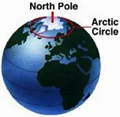
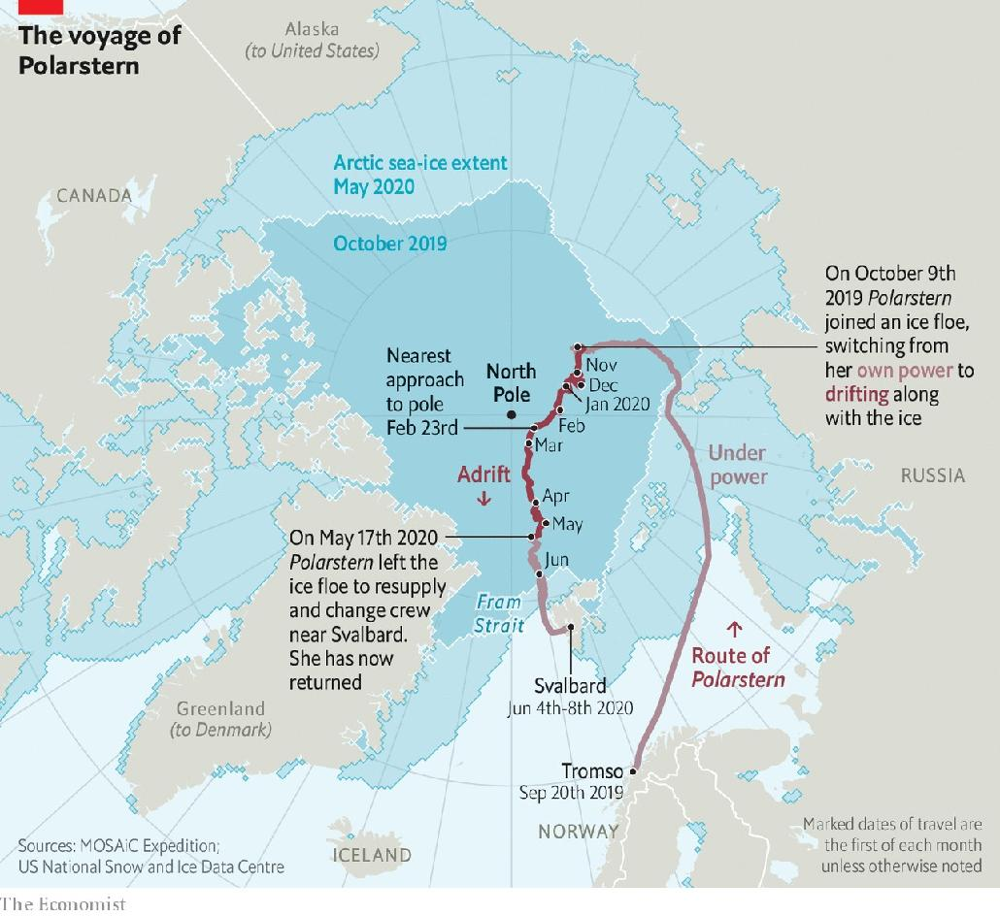
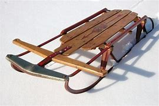

= eco 2020-06-20
:toc:

---

== A floating Arctic 北极的；北极地区的;极冷的；严寒的 laboratory 词汇解说

(eco 2020-6-20 / Science & technology / Arctic exploration: Pole position)

An icebreaker called Polarstern *is revealing the Arctic’s secrets*

Everything *depends on* how the ice *behaves*

Jun 20th 2020 |

- Arctic : /ˈɑːktɪk/ =>  arct（大熊星座）+ic（形容词后缀）→正对大熊星座的→北极的 +

- 漂浮的北极实验室 +
一艘名为“极地斯特恩”的破冰船, 正在揭开北极的秘密 +
一切都取决于冰的行为

THERE IS “LOCKDOWN”. And then there is lockdown. `主` Those who *have spent* the past weeks *allowed out* only `to exercise`(v.) and `visit(v.) the shops` `谓` *might spare 抽出；拨出；留出；匀出 a thought for* the passengers and crew of Polarstern (Pole Star 北极星), *pictured above*. Polarstern *is* an icebreaker** belonging to** the Alfred Wegener Institute for `Polar and Marine 海的；海产的；海生的 Research`, in Germany, and her ship’s company *are* in a different class 种类；类别；等级 of lockdown entirely. Their vessel *is afloat* in the `pack ice` 聚集的浮冰；大块的浮冰 of the Arctic Ocean, and communications *are* [so] minimal [as to] preclude(v.)使行不通；阻止；妨碍；排除 phone calls, *let alone* Zoom (一视频会议软件名)快速移动；迅速前往;(价格、费用等)急剧增长；猛涨. Only pictureless messages and emails *are possible*.

- spare : v.  *~ sth/sb (for sb/sth) | ~ (sb) sth* : to make sth such as time or money available to sb or for sth, especially when it requires an effort for you to do this 抽出；拨出；留出；匀出
.. I'd love to have a break, but *I can't spare the time just now*. 我是想休息一下，可眼下找不出时间。
.. You should *spare a thought for* (= think about) the person who cleans up after you. 你应该为随后打扫的人着想啊。

- so ... as to : 那么地...以至

- preclude => pre-,在前，-clud,关闭，词源同close,conclude.

- 这儿有“紧闭”。那儿也有. 那些在过去几周只被允许外出锻炼身体和逛商店的人, 可以来考虑一下上图中极地之星(Polarstern)上的乘客和船员。Polarstein是一艘破冰船，隶属于德国阿尔弗雷德·韦格纳极地和海洋研究所，它的公司完全处于另一种级别的禁闭状态。他们的船漂浮在北冰洋的浮冰中，通讯是如此微弱，以至于无法打电话，更不用说来视频会议了。只能发出没有图片的信息和电子邮件。

Polarstern is the location of MOSAiC 马赛克, the Multidisciplinary （涉及）多门学科的 `drifting Observatory` 天文台；天文观测站；气象台 for `the Study of Arctic Climate`. She *sailed* from Tromso, in Norway, on September 20th 2019 and *travelled to* a point at latitude 纬度 85°N (*see* map). Here, *mimicking* 模仿，摹拟 the first high-Arctic voyage, made in 1893 by Fridtjof Nansen, a Norwegian explorer, her captain *fixed her into an ice floe* 浮冰 that *carried her along* at about 7km/h, *courtesy(n.)承蒙…的允许（或好意）;作为…的结果 of* an ocean current *called* the transpolar 经过北极的；横越南极或北极的 drift stream. Her closest approach to the pole itself, 156km, *was* on February 24th.

- multidisciplinary : /ˌmʌltiˈdɪsəpləneri/ a. involving several different subjects of study （涉及）多门学科的 +
=> multi-,许多，多个，discipline,学科。

- courtesy : n. /ˈkɜːrtəsi/ 礼貌；谦恭；彬彬有礼 +
=> 来自court, 宫廷，宫廷礼仪。

- *courtesy of sb/sth* +
(1) ( also by courtesy of sb/sth ) with the official permission of sb/sth and as a favour 承蒙…的允许（或好意） +
-> The pictures have been reproduced *by courtesy(n.) of* the British Museum. 承蒙大英博物馆惠允，复制了这些画。 +
(2) given [as a prize] /or provided free by a person or an organization 蒙…提供；赞助；赠送 +
-> Win a weekend in Rome, *courtesy(n.) of Fiat*  （当权者的）法令，命令，谕.  +
赢了就可以获得菲亚特公司提供的到罗马度周末的机会。 +
(3) as the result of a particular thing or situation 作为…的结果 +
-> Viewers can see the stadium from the air, *courtesy(n.) of* a camera fastened to the plane. 由于飞机上安装有摄像机，电视观众可从空中鸟瞰体育场。

- Polarstein号, 是MOSAiC的所在地. MOSAiC 是研究北极气候的多学科的漂移观测站。她于2019年9月20日从挪威的Tromso出发，航行到北纬85度(见地图)。这是效仿挪威探险家弗里德科夫·南森(Fridtjof Nansen) 1893年的首次高维度北极航行，Polarstein号的船长将船固定在浮冰上，借助一股被称为跨极地漂流的洋流，以每小时7公里的速度向前移动。2月24日，她距离极点最接, 只有156公里。

Things *have not*, however, *gone* according to plan. The idea *was* for a revolving 旋转的 cast of 300 scientists *each to spend(v.) two months on board*. This *would have permitted* specialists (*in the study of* different seasons and conditions -- winter or summer ice, say) -- *to be there* at the appropriate 合适的；恰当的 moment, and *would also have had the benefit of* protecting(v.) everyone from `cabin 小木屋;船舱 fever` 幽居病.

- *cabin fever* : N-SING If you describe someone as having *cabin fever*, you mean that they feel restless and irritable because they have been indoors in one place for too long. 幽居病

- 然而，事情并没有按照计划进行。原计划是, 将300名科学家轮流上船, 每个人将船上只呆上两个月。这能让研究不同季节和条件的专家 -- 比如冬季或夏季的冰 -- 在恰当的时间到达那里，还可以保护每个人免受幽居病的伤害。

*Unplugging* 拔去…的电源插头 the freezer 冷冻柜；冰柜

`主` A planned rotation 轮换；交替；换班 in April `谓` *had*, though, *to be cancelled*. `主` Norway, the new shipmates’ 同船的水手 `intended departure point` [航][水运] 出发点；起程点；起航点, `谓` *had closed its borders* in response to covid-19. That *left* the original company 在一起的一群人 *with* no liberation 释放，解放 date. Eventually, two `transfer （旅途中的）中转，换乘，改变路线 ships` with the newbies 新手 on board *sailed* from Bremerhaven, in Germany. And [on May 17th] Polarstern `*broke free* 冲破藩篱,解脱 from her icy prison` and `*headed* south *to meet* them *off* 离开（某处）；（在时间或空间上）距，离 the coast of Svalbard`. On June 8th she *began* the return trip, and *arrived back at* her original piece of ice (which *had moved*) on June 17th, *to resume* 重新开始；（中断后）继续 *drifting with it* until she *breaks free* 冲破藩篱,解脱 in September, in the Fram Strait 海峡 between Greenland and Svalbard.

- newbie : /ˈnuːbi/ ( informal ) a person who is new and has little experience in doing sth, especially in using computers SYN novice （尤指使用电脑的）新手 +
=> new,新的，-bie,有争议，可能来自baby.

- 不过，原计划在4月进行的轮换, 不得不取消。为应对covid-19疫情，新船员的预定出发地点挪威, 已经关闭了边境。这使得船上原先的同伴们, 无法解脱. 最终，两艘载有新手的转运船, 从德国不来梅港启航。5月17日，Polarstern号从冰封的监狱中挣脱出来，向南前往斯瓦尔巴特群岛海岸与他们会合。6月8日，她开始了返程，6月17日，她回到了原来的那块冰(冰块已经移动了)，继续随它漂流，直到9月份, 她在格陵兰岛和斯瓦尔巴群岛之间的弗拉姆海峡中挣脱出来。

The coronavirus *has not changed MOSAiC’s objectives* 目标, however. These *are* to study(v.) `the structure of Arctic ice` and `how this *changes*(v.) with the seasons`, and *to look at* ① the air above that ice, ② the water below ③ and the creatures *living in* that water -- and, indeed, in the ice itself. All of these *are interlinked* 互相关联的. They also *link* the place *with* the wider world, for the Arctic *is both* a recorder *and* a driver of climate change.

- 然而，冠状病毒并没有改变MOSAiC的目标。这是为了研究北极冰的结构以及它是如何随着季节变化的，并且观察冰上面的空气，下面的水和生活在水里的生物——事实上，也包括冰本身。所有这些都是相互联系的。它们还将北极与更广阔的世界联系起来，因为北极既是气候变化的记录器，也是气候变化的推动者。

It is a recorder because `主` `the visible difference` *between* ice *and* water, and `the obvious relationship` *between* global temperatures *and* the amount of ice around, `谓` *mean together that* `主` the ice’s `waxing 给…打蜡 and waning`(（月亮）亏缺;减弱; 减少) 盈亏,诸如月之盈虚,消长变化 `谓` *shows* [in an easily graspable 可抓住的；能理解的 way] how things *are changing*. And `主` changing(n.) they are, for the extent 大小；面积；范围 of `the Arctic sea ice` in summer `谓` *has declined by 30%* in the past 30 years, and that loss *is accelerating* (see chart).

- wane : /weɪn/ v. to become gradually weaker or less important 衰落；衰败；败落；减弱 / ( of the moon 月亮 ) to appear slightly smaller each day after being round and full 缺；亏 +
=> wane : 来源于原始印欧语wan-(缺乏的)和古斯堪的纳维亚语vanta(缺乏)。 词根词缀： wan(-van-)空 + -e +
-> Her enthusiasm for the whole idea *was waning rapidly*. 她对整个想法的热情迅速冷淡了下来。

- 它是一个记录器，因为冰和水之间的明显差别，以及全球温度和北极周围冰量之间的明显关系，共同意味着, 冰的消长以一种容易理解的方式, 显示了事情在如何变化。在过去的30年里，北极海冰在夏季的面积, 已经减少了30%，而且减少的速度还在加快(见图表)。

The Arctic *is* also a driver of climate change, though, because the whiteness of ice *means* it *reflects* sunlight *back into space*, thus *cooling* Earth, whereas the darkness of `open water` 开阔水面；无冰水面 *means* it *absorbs* that light. *The less* of the former that is happening, and *the more* of the latter(a.)（刚提及的两者中）后者的；（系列中）最后的，末尾的, *the faster* `global temperatures *will rise*`.

- 然而，北极也是气候变化的推动者，因为白色的冰块, 意味着它能将阳光反射回太空，从而冷却地球; 而深色的无冰的水域, 意味着它会吸收阳光。前一种情况发生得越少，后一种情况就会发生得越多，从而全球气温上的升速度也会越快。

*Start*, then, *with* the ice. [At the moment] *this is monitored mainly by* satellite. `主` *Measuring* the extent of the Arctic’s ice [*from space*] `系` *is* easy. `主` *Measuring* its thickness `系` *is* trickier 难办的；难对付的(比较级). From orbit （天体等运行的）轨道, *this is done* by a mixture of radar and laser beam 激光光束,雷射光束. Icesat 2, an American craft 飞行器,飞船, *provides* `laser-altimeter （尤指用于飞行器中的）测高仪，高度表 data` that *record* the height (above sea level) of the top of the snow (that *overlies* 覆在……上面，铺 the ice). Cryosat 2, a European one, *uses* radar ① *to penetrate* 渗透，打入（组织、团体等） the snow and ② *measure* the height of the top of the ice itself. `The thickness 厚；厚度 of the ice` in a particular place *can then be calculated* by `*applying* Archimedes’ 阿基米德 principle of floating bodies *to* the mixture of ice and snow`, and *subtracting* 减去；扣掉 the thickness of the snow. However, Julienne Stroeve of University College London, now *safely returned from* her leg 一段路程（或赛程） of the mission, *believes that* `主` the data *collected by* these two satellites `系`  *may be inaccurate*, *leading to* an overestimation 过高的估计 of the ice’s thickness.

- 那么，就从冰开始吧。目前这主要是由卫星来监测的。从太空测量北极冰的面积大小很容易, 但要想测量它的厚度却更加棘手。在太空轨道上，这是由雷达和激光束共同完成的。Icesat 2是一艘美国飞船，它提供激光测高仪数据, 来记录覆盖在冰层上的积雪的顶部高于海平面的高度。欧洲的Cryosat 2 则利用雷达, 来穿透积雪，测量冰层本身的高度。将阿基米德的浮体原理应用于冰和雪的混合物，然后减去雪的厚度，就可以计算出特定地方的冰的厚度。不过，伦敦大学学院的Julienne Stroeve , 现在已安全地从其任务中返回, 她认为，这两颗卫星收集的数据可能不准确，导致高估了冰层的厚度。

When *all is working perfectly*, the return signal for Cryosat 2 *comes exactly from the boundary* between the ice and any overlying snow. Dr Stroeve *thinks*, though, *that* this is not always what happens. Variables such as layering 分层,层次 within the snow, *along with* its temperature and salinity 盐度；盐分, *might affect* the returning radar signal *by changing* the snow’s structure and density. This *could cause* the signal *to be reflected from inside the snow layer*, rather than *from the boundary* where it meets the ice. If *that were happening*, it *would create the illusion* that `主` the ice (beneath 在（或往）…下面；在（或往）…下方 the snow) `系` *is thicker than* is actually the case.

- salinity : /səˈlɪnəti/ n. 盐度；盐分；盐性

- 当一切正常运行时，Cryosat的返回信号, 就会准确地从冰和上面积雪的边界传回来。但施特略夫博士认为，情况并不总是这样。诸如雪内的分层、温度和盐度等变量, 可能会改变雪的结构和密度, 从而的返回的雷达信号造成影响。这可能会导致信号从雪层内部反射，而不是从它与冰相遇的边界反射。如果发生这种情况，就会产生一种错觉，即雪下的冰, 比实际情况更厚。

[*To investigate this possibility*] Dr Stroeve *took* a purpose-built radar [*on board Polarstern*]. Each week, she and a colleague *mounted* 准备；安排；组织开展;使骑上马；安装，架置 this 170kg instrument [*on a sled* 雪橇] and *dragged it to* a new site, *to sample* 抽样检验；取样；采样 different snow conditions. *As* they *towed* （用绳索）拖，拉，牵引，拽 it, they *sent* `radar pulses` 脉冲 [on `the frequency bands` 频带 (used by the satellites)] *downwards into the snow* /and *measured* the amount of backscatter (辐射或微粒的)向后散射. The deflection （尤指击中某物后）突然转向，偏斜，偏离 of the signals in this backscatter *gives a picture of* `主` how particular snow conditions `谓` *might be changing* the way (the satellite’s radar *is returned*).

- sled +

- *frequency band* : N a continuous range of frequencies, esp in the radio spectrum, between two limiting frequencies 频带

- backscatter : n. 反向散射体, 背反射, 后向散射; +
image:../../+ img_单词图片/b/backscatter.jpg[100,100]

- 为了研究这种可能性，斯特罗夫博士在“极地”号上搭载了一台特制的雷达。每周，她和一位同事将这台重达170公斤的仪器安装在雪橇上，并将其拖到一个新的地点，以采样不同的雪情。当他们拖着它时，他们使用和在卫星上相同的频段, 向下发送雷达脉冲到雪中，并测量后向散射量。后向散射中信号的偏转, 会给出了一幅图像，说明特定的降雪条件, 可能会如何改变卫星雷达的返回方式。

Dr Stroeve’s radar *died* on January 31st -- one of many of the expedition’s 远征；探险；考察 machines *that fell 进入（某状态）；开始变成（某事物） victim 受害者；罹难者；罹病者；牺牲品 to the Arctic winter*. But [by the time *that had happened*] she *had managed to gather* a fairly good set of data. *Her conclusion is that* the reflection *does indeed sometimes come from* the interface between snow and ice, *as it is supposed to*. But *not always*. The discrepancy 差异；不符合；不一致 *is important*. Her measurements already show that the ice is “definitely thinner than the satellites suggested”. She has yet to analyse the data fully, but preliminary investigation indicates that both snow depth and temperature influence backscatter. It therefore looks likely that the amount of Arctic sea ice around has been overestimated. That brings closer the moment when, if temperatures continue to rise, the ice will vanish altogether in the summer.

- discrepancy  : /dɪˈskrepənsi/ n.
 *~ (in sth) | ~ (between A and B)* : a difference between two or more things that should be the same 差异；不符合；不一致 +
=>  dis-, 分开，散开。-crep, 破裂声，词源同crevice, decrepit. 引申词义争吵，不一致。 +
->  *wide discrepancies* in prices quoted for the work 这项工作的报价出入很大 +
-> What are the reasons for *the discrepancy between girls' and boys' performance* in school? 女生和男生在学校表现不同的原因何在呢？ +

The thickness of the pack ice is not the only thing that matters, though. Its topography is also important. This is the province of Jennifer Hutchings of Oregon State University. She is using GPS buoys to track the motion of the ice around the ship. Though sea ice is solid, it is not rigid. It forms but a thin skin on the ocean—varying in depth from around 30cm in summer to a couple of metres in winter—so is readily moved by wind and current.

As the ice moves it stretches and cracks in some places. Large cracks formed in this way are called leads, because they are wide enough to “lead” a ship. In other places, by contrast, movement makes the ice thicker. As individual panes of ice butt up against each other, they create ridges that can be metres high. Dr Hutchings has not yet had a chance to process her data. But even from the ship’s deck she has been able to watch leads opening and ridges forming around the vessel. Her eyes and ears, as well as her instruments, tell her that this winter the ice has been particularly mobile—and has thus become particularly rough, with a surprising number of ridges.

These ridges may affect the rate at which the ice melts—but to complicate matters, this could happen in two opposing ways. Ridges make ice thicker, and thicker ice melts more slowly. On the other hand, a ridge projects down into the sea as well as up into the air (Archimedes, again), so it may stir up water from below the surface. Deep water is warmer than the surface layer, so this stirring would serve to increase melt rates. Moreover, to add to the confusion, ridges are prone to having pieces of ice fall off them into the sea, to form small blocks known as brash. This brash, having more surface area per unit volume than unbroken ice, melts faster.

Dr Hutchings’s main observation, though, is a change in the ice’s structure. Historically, this far north, where ice is always present in some form, winter is the time when it builds up as new layers are adding to existing floes, thickening them. In summer the ice then melts back a little. But a core of the stuff remains from year to year and, over successive winters, more layers are added. That forges what is known as multi-year perennial ice.

Dr Hutchings and her colleagues have, however, found something rather different is now going on. Instead of being composed of ice accumulated over many years, much of the perennial ice pack is no longer truly perennial—it is “juvenile”, having built up over only the past two years.

To Dr Hutchings, this is further evidence confirming what satellite images of the ebbing and flowing of the pack ice suggest—that the end of year-round ice cover at the North Pole may be near, with a summer melt-back so substantial that the pole itself sees clear, blue water.

Jeff Bowman of the Scripps Institution of Oceanography, in San Diego, is also interested in the behaviour of the ice. In his case, that interest is directed towards its effects on Arctic life. The main question he has been asking is whether the Arctic ecosystem as a whole is a net producer or absorber of carbon dioxide. The answer to this question has implications for the amount that the Arctic contributes to global warming. It depends on how much photosynthesis is taking place in the region. And that, in turn, depends on the extent and topography of the ice cover.

The Arctic Ocean has few multicellular plants. But it does have single-celled algae and photosynthesising bacteria. These live both in the water and in the ice itself. And, though tiny, they are abundant. It is they that Dr Bowman, who is a marine microbiologist, is studying, to discover how they affect the Arctic’s carbon balance.

To measure the activity of these micro-organisms he has been analysing the amount of oxygen in the water. This is an indicator of how much photosynthesis is taking place. In doing so, he has discovered that the physical condition of the ice—particularly the ridges being studied by Dr Hutchings—has an important effect on these creatures and their productivity.

Oceans, the Arctic included, fall naturally into layers, with the stillest water at the bottom, where there is also little light. Ascend the water column and both motion and light increase. Near the top is what is known as the surface mixed layer, which turns over continuously in response to the wind. Sea ice generally reduces this wind-induced mixing. But ice ridges act like tiny sails, catching the wind, moving in response and thus stirring the water beneath. The consequence, Dr Bowman has found, is a surprisingly deep mixed layer.

That is bad news for photosynthesising planktonic microbes. The already low level of light below the ice means they can grow only when they are close to the surface. If they get “mixed down” away from the light they cannot photosynthesise.

This is not, however, a problem for those organisms actually embedded in the ice. For them, thinner ice means they get more light, rather than less. That raises their productivity. The result, as observed by Dr Bowman, was an unusually early spring-ice algal bloom this year.

It remains to be seen what the effects of the early bloom are. But shifts in the timing of events of this sort can have consequences. For example, if the algae bloom early, the tiny animals that eat them may hatch too late to catch their main food source. Fewer of these zooplankton means, in turn, less to eat for things further up the food chain—like fish, seals and polar bears.

We were here first!

But what is true of winter is not necessarily true of summer. The return of the sun means the winter’s subtleties are now being replaced by a stronger, more obvious consequence of the reduced sea ice. This is that more light can blast through the water into the ecosystem. That, too, will affect the timing and intensity of phytoplankton and ice-algal blooms.

The effects on the carbon balance of the early algal bloom in the spring will play out in the coming months. The uneaten algae may act as a carbon sink, mopping up carbon dioxide. Alternatively, they may increase levels of carbon dioxide if their mistiming serves to put out of kilter an ecosystem that would otherwise have absorbed it. The new set of researchers on MOSAiC will follow this up.

The changes in the ice that Dr Hutchings has been observing also seem to influence the atmosphere, according to one of the other researchers on board Polarstern—Lauriane Quéléver of the University of Helsinki. Ms Quéléver is interested in the chemical composition of Arctic air, and in particular how certain scarce molecules in it act as precursors for the formation of clouds. This, she has discovered, seems to be controlled by the behaviour of the ice.

On most parts of Earth clouds form as droplets of water condense around “seeds” of dust or organic molecules. In the Arctic there is little dust. Biological activity, too, is in short supply compared with elsewhere—and is, moreover, conducted mainly below the barrier of the sea ice. It might therefore be expected that there would be few seeds present for clouds to form around. And yet, clouds are present.

Clouds on the horizon

Ms Quéléver’s starting point for investigating this matter was previous research carried out on islands at lower latitudes in the Arctic—specifically, Greenland and Svalbard. Cloud seeds there tended to be compounds containing sulphur, nitrogen, chlorine, bromine or iodine. Using a score of instruments held in a container at the ship’s bow, she looked for these molecules. And she found them.

That was not a complete surprise. What did surprise her, though, were the quantities she found them in. She expected their concentrations in winter, the least biologically active time of year, to be low to non-existent. In fact, they were similar to those found in Greenland.

The only plausible source of these molecules is the micro-organisms Dr Bowman is studying. And, as if to support that idea, she also saw that spikes in the concentrations of molecules of interest correlated with “ice events” around the ship, such as the opening of big leads which brought the air into contact with the seawater below.

The link between the sea ice cracking and the release of potential cloud seeds suggests that more cracks in the ice sheet could lead to more clouds in the Arctic. What overall effect that might have on the climate is unclear. Summer clouds would reflect sunlight back into space, cooling the planet. Those formed in winter, when the sun is below the horizon, would serve as insulation, warming it. As with the way Dr Hutching’s ridges affect the melting of ice, two opposite outcomes are possible—or perhaps the net effect will be that they cancel each other out.

As this example shows, properly disentangling the interactions between Arctic ice, atmosphere and ocean life will require data collected across a full year—for the contrast between winter and summer at the poles is greater than anywhere else on the planet. Polarstern’s unexpected detour has come at the cost of some of these data, but in partial compensation the expedition left several autonomous machines on the ice, to continue harvesting as much information as possible during the ship’s absence. With luck, then, the expedition has been saved to finish what will be the most comprehensive study so far made of the Arctic and its influence on the climate. If that happens, the researchers on board will have had the most productive lockdown imaginable—with no Zoom involved.

---

== A floating Arctic laboratory

An icebreaker called Polarstern is revealing the Arctic’s secrets

Everything depends on how the ice behaves

Jun 20th 2020 |

THERE IS “LOCKDOWN”. And then there is lockdown. Those who have spent the past weeks allowed out only to exercise and visit the shops might spare a thought for the passengers and crew of Polarstern (Pole Star), pictured above. Polarstern is an icebreaker belonging to the Alfred Wegener Institute for Polar and Marine Research, in Germany, and her ship’s company are in a different class of lockdown entirely. Their vessel is afloat in the pack ice of the Arctic Ocean, and communications are so minimal as to preclude phone calls, let alone Zoom. Only pictureless messages and emails are possible.

Polarstern is the location of MOSAiC, the Multidisciplinary drifting Observatory for the Study of Arctic Climate. She sailed from Tromso, in Norway, on September 20th 2019 and travelled to a point at latitude 85°N (see map). Here, mimicking the first high-Arctic voyage, made in 1893 by Fridtjof Nansen, a Norwegian explorer, her captain fixed her into an ice floe that carried her along at about 7km/h, courtesy of an ocean current called the transpolar drift stream. Her closest approach to the pole itself, 156km, was on February 24th.

Things have not, however, gone according to plan. The idea was for a revolving cast of 300 scientists each to spend two months on board. This would have permitted specialists in the study of different seasons and conditions—winter or summer ice, say—to be there at the appropriate moment, and would also have had the benefit of protecting everyone from cabin fever.

Unplugging the freezer

A planned rotation in April had, though, to be cancelled. Norway, the new shipmates’ intended departure point, had closed its borders in response to covid-19. That left the original company with no liberation date. Eventually, two transfer ships with the newbies on board sailed from Bremerhaven, in Germany. And on May 17th Polarstern broke free from her icy prison and headed south to meet them off the coast of Svalbard. On June 8th she began the return trip, and arrived back at her original piece of ice (which had moved) on June 17th, to resume drifting with it until she breaks free in September, in the Fram Strait between Greenland and Svalbard.

The coronavirus has not changed MOSAiC’s objectives, however. These are to study the structure of Arctic ice and how this changes with the seasons, and to look at the air above that ice, the water below and the creatures living in that water—and, indeed, in the ice itself. All of these are interlinked. They also link the place with the wider world, for the Arctic is both a recorder and a driver of climate change.

It is a recorder because the visible difference between ice and water, and the obvious relationship between global temperatures and the amount of ice around, mean together that the ice’s waxing and waning shows in an easily graspable way how things are changing. And changing they are, for the extent of the Arctic sea ice in summer has declined by 30% in the past 30 years, and that loss is accelerating (see chart).

The Arctic is also a driver of climate change, though, because the whiteness of ice means it reflects sunlight back into space, thus cooling Earth, whereas the darkness of open water means it absorbs that light. The less of the former that is happening, and the more of the latter, the faster global temperatures will rise.

Start, then, with the ice. At the moment this is monitored mainly by satellite. Measuring the extent of the Arctic’s ice from space is easy. Measuring its thickness is trickier. From orbit, this is done by a mixture of radar and laser beam. Icesat 2, an American craft, provides laser-altimeter data that record the height above sea level of the top of the snow that overlies the ice. Cryosat 2, a European one, uses radar to penetrate the snow and measure the height of the top of the ice itself. The thickness of the ice in a particular place can then be calculated by applying Archimedes’ principle of floating bodies to the mixture of ice and snow, and subtracting the thickness of the snow. However, Julienne Stroeve of University College London, now safely returned from her leg of the mission, believes that the data collected by these two satellites may be inaccurate, leading to an overestimation of the ice’s thickness.

When all is working perfectly, the return signal for Cryosat 2 comes exactly from the boundary between the ice and any overlying snow. Dr Stroeve thinks, though, that this is not always what happens. Variables such as layering within the snow, along with its temperature and salinity, might affect the returning radar signal by changing the snow’s structure and density. This could cause the signal to be reflected from inside the snow layer, rather than from the boundary where it meets the ice. If that were happening, it would create the illusion that the ice beneath the snow is thicker than is actually the case.

To investigate this possibility Dr Stroeve took a purpose-built radar on board Polarstern. Each week, she and a colleague mounted this 170kg instrument on a sled and dragged it to a new site, to sample different snow conditions. As they towed it, they sent radar pulses on the frequency bands used by the satellites downwards into the snow and measured the amount of backscatter. The deflection of the signals in this backscatter gives a picture of how particular snow conditions might be changing the way the satellite’s radar is returned.

Dr Stroeve’s radar died on January 31st—one of many of the expedition’s machines that fell victim to the Arctic winter. But by the time that had happened she had managed to gather a fairly good set of data. Her conclusion is that the reflection does indeed sometimes come from the interface between snow and ice, as it is supposed to. But not always. The discrepancy is important. Her measurements already show that the ice is “definitely thinner than the satellites suggested”. She has yet to analyse the data fully, but preliminary investigation indicates that both snow depth and temperature influence backscatter. It therefore looks likely that the amount of Arctic sea ice around has been overestimated. That brings closer the moment when, if temperatures continue to rise, the ice will vanish altogether in the summer.

The thickness of the pack ice is not the only thing that matters, though. Its topography is also important. This is the province of Jennifer Hutchings of Oregon State University. She is using GPS buoys to track the motion of the ice around the ship. Though sea ice is solid, it is not rigid. It forms but a thin skin on the ocean—varying in depth from around 30cm in summer to a couple of metres in winter—so is readily moved by wind and current.

As the ice moves it stretches and cracks in some places. Large cracks formed in this way are called leads, because they are wide enough to “lead” a ship. In other places, by contrast, movement makes the ice thicker. As individual panes of ice butt up against each other, they create ridges that can be metres high. Dr Hutchings has not yet had a chance to process her data. But even from the ship’s deck she has been able to watch leads opening and ridges forming around the vessel. Her eyes and ears, as well as her instruments, tell her that this winter the ice has been particularly mobile—and has thus become particularly rough, with a surprising number of ridges.

These ridges may affect the rate at which the ice melts—but to complicate matters, this could happen in two opposing ways. Ridges make ice thicker, and thicker ice melts more slowly. On the other hand, a ridge projects down into the sea as well as up into the air (Archimedes, again), so it may stir up water from below the surface. Deep water is warmer than the surface layer, so this stirring would serve to increase melt rates. Moreover, to add to the confusion, ridges are prone to having pieces of ice fall off them into the sea, to form small blocks known as brash. This brash, having more surface area per unit volume than unbroken ice, melts faster.

Dr Hutchings’s main observation, though, is a change in the ice’s structure. Historically, this far north, where ice is always present in some form, winter is the time when it builds up as new layers are adding to existing floes, thickening them. In summer the ice then melts back a little. But a core of the stuff remains from year to year and, over successive winters, more layers are added. That forges what is known as multi-year perennial ice.

Dr Hutchings and her colleagues have, however, found something rather different is now going on. Instead of being composed of ice accumulated over many years, much of the perennial ice pack is no longer truly perennial—it is “juvenile”, having built up over only the past two years.

To Dr Hutchings, this is further evidence confirming what satellite images of the ebbing and flowing of the pack ice suggest—that the end of year-round ice cover at the North Pole may be near, with a summer melt-back so substantial that the pole itself sees clear, blue water.

Jeff Bowman of the Scripps Institution of Oceanography, in San Diego, is also interested in the behaviour of the ice. In his case, that interest is directed towards its effects on Arctic life. The main question he has been asking is whether the Arctic ecosystem as a whole is a net producer or absorber of carbon dioxide. The answer to this question has implications for the amount that the Arctic contributes to global warming. It depends on how much photosynthesis is taking place in the region. And that, in turn, depends on the extent and topography of the ice cover.

The Arctic Ocean has few multicellular plants. But it does have single-celled algae and photosynthesising bacteria. These live both in the water and in the ice itself. And, though tiny, they are abundant. It is they that Dr Bowman, who is a marine microbiologist, is studying, to discover how they affect the Arctic’s carbon balance.

To measure the activity of these micro-organisms he has been analysing the amount of oxygen in the water. This is an indicator of how much photosynthesis is taking place. In doing so, he has discovered that the physical condition of the ice—particularly the ridges being studied by Dr Hutchings—has an important effect on these creatures and their productivity.

Oceans, the Arctic included, fall naturally into layers, with the stillest water at the bottom, where there is also little light. Ascend the water column and both motion and light increase. Near the top is what is known as the surface mixed layer, which turns over continuously in response to the wind. Sea ice generally reduces this wind-induced mixing. But ice ridges act like tiny sails, catching the wind, moving in response and thus stirring the water beneath. The consequence, Dr Bowman has found, is a surprisingly deep mixed layer.

That is bad news for photosynthesising planktonic microbes. The already low level of light below the ice means they can grow only when they are close to the surface. If they get “mixed down” away from the light they cannot photosynthesise.

This is not, however, a problem for those organisms actually embedded in the ice. For them, thinner ice means they get more light, rather than less. That raises their productivity. The result, as observed by Dr Bowman, was an unusually early spring-ice algal bloom this year.

It remains to be seen what the effects of the early bloom are. But shifts in the timing of events of this sort can have consequences. For example, if the algae bloom early, the tiny animals that eat them may hatch too late to catch their main food source. Fewer of these zooplankton means, in turn, less to eat for things further up the food chain—like fish, seals and polar bears.

We were here first!

But what is true of winter is not necessarily true of summer. The return of the sun means the winter’s subtleties are now being replaced by a stronger, more obvious consequence of the reduced sea ice. This is that more light can blast through the water into the ecosystem. That, too, will affect the timing and intensity of phytoplankton and ice-algal blooms.

The effects on the carbon balance of the early algal bloom in the spring will play out in the coming months. The uneaten algae may act as a carbon sink, mopping up carbon dioxide. Alternatively, they may increase levels of carbon dioxide if their mistiming serves to put out of kilter an ecosystem that would otherwise have absorbed it. The new set of researchers on MOSAiC will follow this up.

The changes in the ice that Dr Hutchings has been observing also seem to influence the atmosphere, according to one of the other researchers on board Polarstern—Lauriane Quéléver of the University of Helsinki. Ms Quéléver is interested in the chemical composition of Arctic air, and in particular how certain scarce molecules in it act as precursors for the formation of clouds. This, she has discovered, seems to be controlled by the behaviour of the ice.

On most parts of Earth clouds form as droplets of water condense around “seeds” of dust or organic molecules. In the Arctic there is little dust. Biological activity, too, is in short supply compared with elsewhere—and is, moreover, conducted mainly below the barrier of the sea ice. It might therefore be expected that there would be few seeds present for clouds to form around. And yet, clouds are present.

Clouds on the horizon

Ms Quéléver’s starting point for investigating this matter was previous research carried out on islands at lower latitudes in the Arctic—specifically, Greenland and Svalbard. Cloud seeds there tended to be compounds containing sulphur, nitrogen, chlorine, bromine or iodine. Using a score of instruments held in a container at the ship’s bow, she looked for these molecules. And she found them.

That was not a complete surprise. What did surprise her, though, were the quantities she found them in. She expected their concentrations in winter, the least biologically active time of year, to be low to non-existent. In fact, they were similar to those found in Greenland.

The only plausible source of these molecules is the micro-organisms Dr Bowman is studying. And, as if to support that idea, she also saw that spikes in the concentrations of molecules of interest correlated with “ice events” around the ship, such as the opening of big leads which brought the air into contact with the seawater below.

The link between the sea ice cracking and the release of potential cloud seeds suggests that more cracks in the ice sheet could lead to more clouds in the Arctic. What overall effect that might have on the climate is unclear. Summer clouds would reflect sunlight back into space, cooling the planet. Those formed in winter, when the sun is below the horizon, would serve as insulation, warming it. As with the way Dr Hutching’s ridges affect the melting of ice, two opposite outcomes are possible—or perhaps the net effect will be that they cancel each other out.

As this example shows, properly disentangling the interactions between Arctic ice, atmosphere and ocean life will require data collected across a full year—for the contrast between winter and summer at the poles is greater than anywhere else on the planet. Polarstern’s unexpected detour has come at the cost of some of these data, but in partial compensation the expedition left several autonomous machines on the ice, to continue harvesting as much information as possible during the ship’s absence. With luck, then, the expedition has been saved to finish what will be the most comprehensive study so far made of the Arctic and its influence on the climate. If that happens, the researchers on board will have had the most productive lockdown imaginable—with no Zoom involved.

施特略夫博士的雷达于1月31日死亡——这是探险队许多设备中的一个，它们都成了北极冬季的牺牲品。但当这一切发生时，她已经设法收集了一组相当好的数据。她的结论是，反射有时确实来自冰雪之间的界面，这是应该的。但并非总是如此。这种差异很重要。她的测量结果已经表明，冰层“肯定比卫星预测的要薄”。她还没有充分分析数据，但初步调查表明，雪的深度和温度都会影响后向散射。因此，北极海冰的数量似乎被高估了。如果气温继续上升，冰盖将在夏季完全消失。
然而，浮冰的厚度并不是唯一重要的因素。它的地形也很重要。这是俄勒冈州立大学的Jennifer Hutchings所在的省份。她使用GPS浮标来跟踪船周围冰层的运动。海冰虽然坚硬，但并不坚硬。它在海洋上形成了一层薄薄的皮肤——其深度从夏季的30厘米左右到冬季的几米不等——因此很容易被风和洋流移动。
当冰移动时，它会在某些地方伸展并裂开。以这种方式形成的大裂缝称为导线，因为它们足够宽，可以“引导”一艘船。相比之下，在其他地方，移动使冰更厚。当一块块冰相互碰撞时，就会形成高达几米的山脊。哈钦斯博士还没有机会处理她的数据。但即使是在甲板上，她也能看到导线在船体周围的开口和隆起。她的眼睛、耳朵和仪器都告诉她，今年冬天的冰特别容易移动，因此变得特别粗糙，出现了数量惊人的隆起。

这些冰脊可能会影响冰融化的速度，但更复杂的是，这可能会以两种相反的方式发生。冰脊使冰更厚，更厚的冰融化得更慢。另一方面，一个山脊向下延伸到海里，也向上延伸到空中(又是阿基米德式的)，所以它可能会从海面下激起水。深水比表层温度高，所以这种搅拌会加快融化速度。此外，更让人困惑的是，山脊上容易有冰块掉落到海里，形成被称为brash的小块。这种冰的单位体积表面积比完整的冰大，融化速度也快。
然而，哈钦斯博士的主要观察结果是冰层结构的变化。从历史上看，在遥远的北方，冰总是以某种形式存在，冬天是冰堆积的季节，因为新的冰层会增加现有的浮冰，使它们变厚。到了夏天，冰就会融化一点。但其中的一层物质年复一年地保存下来，而且在连续的冬天里，会有更多的层被添加进来。这形成了所谓的多年多年生冰。
然而，哈钦斯博士和她的同事们发现，一些截然不同的事情正在发生。大部分的常年冰群并不是由多年积累而成的，它们已经不是真正的常年冰群了——它们只是在过去的两年里逐渐形成的，还处于“幼年期”。
对哈钦斯博士来说，这进一步证实了卫星图像中浮冰的退潮和流动所暗示的——北极全年覆盖的冰层可能即将结束，夏季将会融化——如此巨大的回流，以至于北极本身可以看到清澈碧蓝的海水。
圣地亚哥斯克里普斯海洋研究所的杰夫·鲍曼也对冰的行为感兴趣。在他的例子中，人们的兴趣集中在它对北极生物的影响上。他一直在问的主要问题是，整个北极生态系统是二氧化碳的净产生者还是吸收者。这个问题的答案意味着北极对全球变暖的贡献。这取决于该地区进行光合作用的程度。而这又取决于冰盖的范围和地形。
北冰洋很少有多细胞植物。但它确实有单细胞藻类和光合细菌。它们既生活在水里也生活在冰里。尽管它们很小，但数量却很多。海洋微生物学家鲍曼博士正在研究它们，以发现它们如何影响北极的碳平衡。
为了测定这些微生物的活性，他一直在分析水中的氧气含量。这是一个指示有多少光合作用正在发生。在此过程中，他发现冰层的物理条件——尤其是哈钦斯博士所研究的山脊——对这些生物及其生产力有着重要的影响。
包括北极在内的海洋，自然地分为几层，最平静的水在底部，那里也几乎没有光线。上升水柱，运动和光都增加。靠近顶部的是所谓的表面混合层，它会随着风不断地翻转。海冰通常会减少这种由风引起的混合。但是冰脊就像小帆一样，抓住风，响应着移动，从而搅动着下面的水。鲍曼博士发现，其结果是一个令人惊讶的深层混合层。
这对进行光合作用的浮游微生物来说是个坏消息。冰下已经很低的光照水平意味着它们只能在接近表面时才能生长。如果它们与光线“混在一起”，就不能进行光合作用。
然而，对于那些嵌在冰层中的生物来说，这并不是一个问题。对他们来说，更薄的冰意味着他们能得到更多的光，而不是更少。这提高了他们的生产力。结果，正如Bowman博士所观察到的那样，今年的春季出现了异常的早春——冰藻爆发。
早花的影响还有待观察。但这类事件发生时间的变化可能会产生后果。例如，如果藻类过早繁殖，以藻类为食的小动物可能孵化得太晚而无法捕获它们的主要食物来源。这些浮游动物数量的减少，反过来也意味着它们捕食食物链上游鱼类、海豹和北极熊的数量也会减少。

但是对冬天适用的不一定对夏天适用。太阳的回归意味着冬天的微妙变化正在被海冰减少带来的更强烈、更明显的后果所取代。这就是更多的光可以通过水进入生态系统。这也会影响浮游植物和冰藻繁殖的时间和强度。
春季早期藻类爆发对碳平衡的影响将在未来几个月显现出来。未被吃掉的藻类可以充当碳汇，吸收二氧化碳。另一种情况是，它们可能会增加二氧化碳的水平，如果它们的时机不当，破坏了生态系统的平衡，否则生态系统就会吸收二氧化碳。马赛克的新研究人员将继续跟进。
据极地飞船上的另一位研究人员——赫尔辛基大学的劳里安·奎尔韦尔说，哈钦斯博士观察到的冰层变化似乎也影响了大气。Quelever女士对北极空气的化学成分很感兴趣，特别是其中的某些稀有分子是如何作为云形成的前兆的。她发现，这似乎是由冰的行为所控制的。
在地球的大部分地方，云是由水滴在尘埃或有机分子的“种子”周围凝结而成的。在北极几乎没有灰尘。与其他地方相比，生物活动也供不应求，而且主要在海冰屏障之下进行。因此，可以预计，在云的周围几乎没有形成云的种子。然而，云层仍然存在。
地平线上的云
Quelever女士调查这件事的出发点是之前在北极低纬度的岛屿上进行的研究——特别是在格陵兰岛和斯瓦尔巴群岛。那里的云种子往往是含有硫、氮、氯、溴或碘的化合物。她在船头的一个容器中放置了几十个仪器，用这些仪器寻找这些分子。她找到了他们。
这并不完全出乎意料。不过，真正让她吃惊的是她发现它们的数量。她预计，在一年中生物活动最少的冬季，它们的浓度会低到根本不存在。事实上，它们与在格陵兰岛发现的类似。
这些分子唯一可信的来源是鲍曼博士正在研究的微生物。而且，似乎是为了支持这个观点，她还发现了与船周围的“冰事件”有关的相关分子浓度的激增，比如大铅的打开使空气与下面的海水接触。
海冰破裂和潜在云种子的释放之间的联系表明，冰盖上更多的裂缝可能导致北极出现更多的云。这可能对气候产生的总体影响尚不清楚。夏季的云层将太阳光反射回太空，使地球降温。那些在冬天形成的，当太阳在地平线以下的时候，会起到隔热作用，使它变暖。正如哈钦博士的脊状隆起影响冰层融化的方式一样，可能会产生两种相反的结果——或者最终的结果是它们相互抵消。
正如这个例子所显示的，要想正确地理清北极冰层、大气和海洋生物之间的相互作用，就需要全年收集数据，因为两极的冬季和夏季的对比比地球上任何其他地方都大。宝丽斯特恩出人意料地绕道而行，代价是损失了一些数据，但作为部分补偿，探险队在冰上留下了几台自动机器，以便在船不在的时候继续收集尽可能多的信息。幸运的是，这支探险队得以完成迄今为止最全面的关于北极及其对气候影响的研究。如果这种情况发生，机上的研究人员将获得可想象的最有效的锁定——不涉及缩放。

