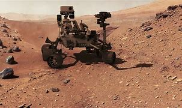
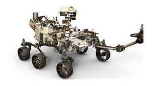
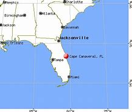
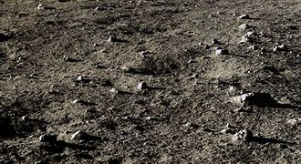

= eco 2020-07-25
:toc:

---

== 背景知识

==== Perseverance  “毅力”号火星探测车

好奇号发现，它的着陆点盖尔陨石坑（Gale Crater）在数十亿年前曾是一个湖泊，那里的环境可能曾支持过微生物生命。

毅力号其任务是寻找形成于 35 亿年前的火星三角洲 Jezero 火山口上的古代微生物生命迹象，收集和存储可能包含外星生命最初证据地质样本，并有朝一日将其带回地球。

Jezero陨石坑是一个 28 英里宽（45 公里宽）的陨石坑，位于 Isidis Planitia 的西部边缘，火星赤道以北，是一个巨大的撞击盆地。而科学家推测，在遥远的过去，这个陨石坑可能是一个绿洲。

在 30 亿到 40 亿年前，那里有一条河流, 流入一个像太浩湖那么大的水体，沉积着富含碳酸盐矿物和粘土的沉积物。“毅力号”科研小组认为，这个古老的河流三角洲, 可能积聚并保存了有机分子, 和其他潜在的微生物生命迹象。

Jezero撞击坑内部有冲积扇地貌是个优势，说明这里曾经有水. 第二个优势是**光谱分析发现了大量的碳酸盐，这是贝壳类化石存在的重要证据。** 由碳酸盐形成的化石，诸如贝壳、珊瑚和叠层石等，可以完整地保存几十亿年.

**地球上目前已知的最古老的化石, 就是在35亿年前由蓝藻形成的叠层石。蓝藻是地球上第一批生命.** 假设火星曾经存在过微生物生命，那么科学家就可以在火星上找到叠层石的存在.

预计火星着陆时间为 2021 年 2 月 18 日。

---

====  stromatolite 叠层石

叠层石 （原核生物所建造的有机沉积结构） : *叠层石是是由藻类在生命活动过程中*，将海水中的钙、镁碳酸盐, 及其碎屑颗粒粘结、*沉淀而形成的一种化石。随着季节的变化、生长沉淀的快慢，形成深浅相间的复杂色层构造*, 叠层石的色层构造，有纹层状、球状、半球状、柱状、锥状及枝状等。

*叠层石是藻类繁衍生息形成的生物遗迹岩石。假如当时叠层石所生活的海洋中有海浪或海流的话，藻类又没有什么可抓扶的地方，必然会被海水冲走。然而叠层石是藻类世世代代在一个固定地方生息形成的，藻类没有被海水冲走，说明藻类生存在静水环境之中。*

**叠层石只生存于清洁的海水中，因为有黏土沉积的话，藻类群就会被掩埋掉，这说明黏土没进入海洋中。**而黏土没有进入海洋中，需要具备两个条件：一、*不能有河流入海（有河流的话，黏土会被带入海洋）*；二、不能有稍大的风。

**因此说叠层石存在的地方，必然具备下述4种地理环境特征：1、无风（微风）；2、没有海浪或者是微浪；3、没有海流；4、没有河流。**也说是说，叠层石能指示上述4种地理环境特征。

---

== Is there life on Mars? 词汇解说

(eco 2020-6-13 / Science & technology / Astrobiology: Life on Mars: the search continues)

A new generation of spacecraft *may soon find out*

Jul 21st 2020 |

- 火星上有生命吗? +
新一代的航天器可能很快就会发现

[AROUND 3.5BN years ago] conditions on Earth and Mars *were similar*. Both *had* thick atmospheres and liquid water on their surfaces. Both, in other words, *had* the conditions *required to sustain life*. And [on one of those planets] life *was, indeed, sustained*. `主` Precisely when biology *began* on Earth `系` *remains obscure* 费解的；难以理解的;无名的；鲜为人知的. But by 3.5bn years ago, a billion years after the solar system *formed*, it *was well established there* and *has since evolved into* the lush 茂盛的；茂密的；草木繁茂的 abundance of complex forms *seen today*. `主` Mars, meanwhile, `谓` *became* a freezing desert.

- 大约35亿年前，地球和火星的情况相似。它们表面都有厚厚的大气层和液态水。换句话说，两者都具备维持生命所需的条件。在其中一颗行星上，生命确实得以维持。生物学究竟是什么时候开始在地球上存在的, 仍然不清楚。但到了35亿年前，也就是太阳系形成10亿年之后，它在那里建立了牢固的基础，并演化成今天所见的丰富而复杂的形式。与此同时，火星则变成了冰冷的沙漠。

The question *nevertheless 尽管如此；不过；然而 remains*: [*given that* `主` the conditions *needed for life to emerge on Earth* `谓` *also seem to have pertained(v.)存在；适用 for a time* on Mars], *might* life *have evolved there*, too? And, if it did, *might* it *still survive* [in some form], *even if* only [in vanishingly 难以察觉地；消遁似地；趋于零地 rare amounts]?

- pertain :  /pərˈteɪn/ [ V ] ( formal ) to exist or to apply in a particular situation or at a particular time 存在；适用
.. Those laws *no longer pertain*(v.). 那些法律已不适用了。

- 然而，问题仍然存在:如果地球上出现生命所需的条件, 似乎在火星上也存在过一段时间，那么火星上是否也有生命进化? 如果有的话，它还会以某种形式存活下来吗? 即使数量微乎其微?

`主` To answer(v.) that question `谓` *means* visiting(v.) the place -  [if not *with people* then] at least *with robots*. And *now is a good time* to do so, for Earth and Mars *are aligned in a way* (that *means* the journey *takes less than seven months*). On July 20th, therefore, `主` the first of `a caravan （供居住用的）有篷马车，大篷车;（尤指穿越沙漠的）旅行队，车队 of craft` (*planning to take advantage of* this alignment) `谓` *set off* 动身;出发;启程. That *was* when `主` Al Amal, meaning “hope”, `谓` *rose* from Japan’s spaceport 太空船发射、维修及测试场;宇航基地 on Tanegashima(たねがしま)种子岛, *off* the southern tip of Kyushu 日本九州. Al Amal is an orbiter （绕天体作轨道运行的）宇宙飞船；轨道飞行器 *intended to study* Mars’s weather, and *also look at* how the Martian atmosphere *is leaking into space*. Its lift-off(n.)（航天器的）发射，起飞，升空 *adds* the United Arab Emirates (UAE) *to* the list of countries that *have dispatched* 发出，发送（邮件、包裹、信息） probes （不载人）航天探测器，宇宙探测航天器 *towards* extraterrestrial 地球外的；外星球的；宇宙的 bodies.

- caravan : /ˈkærəvæn/ ( BrE ) ( NAmE also camp·er ) a road vehicle without an engine that is pulled by a car, designed for people to live and sleep in, especially when they are on holiday/vacation 旅行拖车，宿营拖车（无发动机，由其他车拖动，多供度假时住宿用） +

- extra·ter·res·trial : /ˌekstrətəˈrestriəl/ a. connected with life existing outside the planet Earth 地球外的；外星球的；宇宙的 +
=> extra-, 外面的，超过的。terrestrial, 陆地的，地球的。即地球之外的，外星人。

- 要回答这个问题，就得去探访那个地方——如果不是和人一起去，至少也要和机器人一起去。而现在正是这样做的好时机，因为地球和火星以某种方式排列着，这意味着旅程只需要不到七个月的时间。因此，在7月20日，第一艘计划利用此次有利的行星排列位置的飞船, 出发了。这就是“希望”号, 它从位于九州岛南端的日本种子岛航天发射场, 升空。"hope"号是一个人造卫星，旨在研究火星的天气，并观察火星大气是如何泄漏到太空的。它的发射使阿拉伯联合酋长国(UAE), 名列向地外天体发射探测器的国家之一。

Al Amal *was followed*, on July 23rd, *by* Tianwen-1 (“heavenly(a.)天国的；天堂的 questions”), a Chinese mission *consisting of* `an orbiter` （绕天体作轨道运行的）宇宙飞船；轨道飞行器, `a lander` and `a rover`  漫游者；流浪者 that *took off*  (飞机)起飞 from Wenchang Space Launch Centre, on Hainan. The lander’s  (航天)着陆器 `provisional  临时的；暂时的 target` *is* Utopia Planitia 平原低地, a large `impact 撞击；冲撞；冲击力 basin` 盆地；凹地 where an American craft 飞行器；飞机；航天器；宇宙飞船；航天飞机, Viking 2, 维京人, 北欧海盗 *touched down* in 1976. Chinese officials *have [so far] declined 谢绝；婉言拒绝 to release much detail about* Tianwen-1’s scientific aims, but what is known of them *suggests that* it *will study* the distribution 分配；分布 of ice on Mars and *examine* how the planet’s habitability 可居住性,适居性 *has changed [over time]* 随着时间的过去; 久而久之; 慢慢地，渐渐地.

- rover : /ˈroʊvər/ ( literary ) a person who likes to travel a lot rather than live in one place 漫游者；流浪者 +
=> 来自中古荷兰语 rover,劫匪，海盗，词源同 reave,rob,rip. +

- provisional => 来自provision,供给，供养。引申词义临时的，暂时的。 +
.. *provisional arrangements* 暂时性安排

- 继"希望号"之后，7月23日，由轨道器、着陆器和火星车组成的“天文-1”号飞船从海南文昌航天发射中心起飞。着陆器的临时目标是乌托邦平原(Utopia Planitia)，这是一个大型撞击盆地，美国飞船“海盗2号”(Viking 2)曾在1976年在这里着陆。迄今为止，中国官员拒绝透露有关“天文一号”科学目标的更多细节，但目前已知的情况表明，“天文一号”将研究火星上的冰分布，并研究火星的宜居性是如何随着时间变化的。

Lack of publicity （媒体的）关注，宣传，报道 *has not been an issue* for the third member of the flotilla 船队；小型舰队. On July 30th NASA, America’s space agency 宇航局, *hopes to launch*(v.) Perseverance 毅力；韧性；不屈不挠的精神, `a one-tonne 公吨, six-wheeled 有轮子的 rover` 漫游者；流浪者, *from* the country’s `principal 最重要的；主要的 spaceport` at Cape Canaveral 地名, in Florida. It *will have cost $2.4bn* to build(v.) and dispatch(v.), and *will absorb another $300m* (in `operating costs` 营运成本,经营成本) during its mission. It *will be* the most sophisticated vehicle 交通工具；运载工具 *yet sent* by America *to* the Martian(a.)火星的 surface.

- flotilla : n.   /fləˈtɪlə/ a group of boats or small ships sailing together 船队；小型舰队 +
=> flot, 同fleet,舰队。-illa, 小词后缀。 +

- perseverance : per·se·ver·ance /ˌpɜːrsəˈvɪrəns/ +

- Cape Canaveral 地名 +

- 对这艘火星舰队的第三名成员来说，缺乏媒体报道并不是个问题。7月30日，美国国家航空航天局(NASA), 希望将“毅力”号, 从佛罗里达州的Cape Canaveral发射上天. “毅力”号是一个重达一吨、有六个轮子的漫游者火星车。它花了24亿美元来建造它并发射它，在执行任务期间, 还将耗费3亿美元的运营成本。它是迄今为止, 美国发射到火星表面的, 最复杂的运载工具。

Once upon a time...

Perseverance *is aimed at* a 45km-wide crater 火山口 called Jezero (*that was*, 3.5bn years ago, *home* to a lake). The rover’s main goal *is* to look for signs of ancient life. But *it is also* `the opening gambit`(n.)开头一招；开局；开场白 (in a decade-long plan) *to bring* Martian rocks *to Earth*. Jezero itself *sits on* the `inner rim` （圆形物体的）边沿 of Isidis Planitia 平原低地, another large `impact basin`, which *was excavated* 挖掘，开凿，挖空（洞、隧道等）;发掘，挖出（古建筑或古物） 3.9bn years ago. `主` One source of the water (which *formed* the lake (that once *lay within it*)) `系` *seems* to have been a river *leading to* a well-preserved  (物体或建筑)保存良好的;保养得好的 delta （河流的）三角洲. `主` `The layers of sediment` 沉积物;沉淀物 in this feature (*colour-coded 用彩色标出的 in the picture* on the previous page *according to* their mineral composition) `系` *are* `prime 主要的；首要的；基本的 targets` *in the search for* Martian biology.

- crater :  /ˈkreɪtər/  火山口;（由炸弹爆炸或巨物撞击形成的）坑 +
=> 来自PIE*sker, 转，弯，搅拌，词源同cradle, crib. 原义为搅拌东西的大海碗，后指碗状的火山口。

- gambit : n.   /ˈɡæmbɪt/ a thing (that sb does), or sth (that sb says at the beginning of a situation or conversation), that is intended to give them some advantage 开头一招；开局；开场白 +
=> 来自拉丁语gamba, 腿，词源同gambol, gammon。即先走一步，开局。 +
.. *an opening gambit* (= the first thing you say) 开场白

- excavate : ex·cav·ate /ˈekskəveɪt/ v. ( formal ) to make a hole, etc. in the ground by digging 挖掘，开凿，挖空（洞、隧道等） +
=> ex-出 + cav(e) + -ate 动词词尾 同源词：cave, cavern, cavity, concave, excavatev +

- delta : an area of land, shaped like a triangle, where a river has split into several smaller rivers before entering the sea 三角洲 +

- sediment =>  /ˈsedɪmənt/  来自拉丁语 sedere,坐下，词源同 sit,seat.-ment,名词后缀。引申比喻义沉积物，沉淀物。

- 从前…… +
“毅力”号的目标, 是一个名为Jezero的45公里宽的火山口，35亿年前，这里是一个湖泊。探测器的主要目标, 是寻找古代生命的迹象。但这个行动, 也是将火星岩石带回地球的十年计划的开端。Jezero本身位于另一个大型撞击盆地Isidis Planitia的内缘，该盆地生成于39亿年前。其中曾经拥有一个湖泊. 其水源的来源之一, 似乎是从一条河流而来, 该河流流向一个保存完好的三角洲地带。符合这一情况的沉积物的沉积地层,(已在上一页的图片中, 根据它们的矿物成分, 用颜色编码出了), 是寻找火星生物的主要方向。

On Earth, some of `the oldest evidence for life` *comes* [*in the form of* stromatolites 叠层（石）]. These `stratified(a.)分层的；形成阶层的 structures` *form [in shallow water]* when `colonies （同地生长的植物或动物）群，群体，集落;殖民地定居者群体 of microbes` *grow [layer upon layer]*, *trapping* 使落入险境；使陷入困境;设陷阱捕捉，用捕捉器捕捉（动物）;卡住；夹住；绊住；缠住 sediment 沉积物 [as they do so]. The most ancient examples *are thought(=think) to be* those *found in Greenland* in 2016, which *have been dated(v.) to 3.7bn years* before the present day. [If *there was sufficient time* for stromatolite 叠层（石）-forming organisms 有机体；生物体；微生物 *to evolve on Earth* by this date] *then* *there is no obvious reason* why they *might not also have evolved* on Mars.

- stromatolite : stro-mato-lite  /strəʊˈmætəˌlaɪt/
N a `rocky mass`(n.)团；块；堆 (*consisting of* layers of `calcareous 含碳酸钙的; 钙质的 material` and `sediment` *formed by* `the prolific  (动物、人、植物) 多产的 growth` of cyanobacteria 蓝藻细菌): such structures *date(v.) back to*  追溯到；始于；自…至今 Precambrian 前寒武纪的 times. 叠层 +
=> 来自古希腊语στρώματα (复数形式：στρώμα("layer")) + λίθος("stone, rock"). +

- stratify : strat·ify  /ˈstrætɪfaɪ/ v. ( formal ) [ VN ] ( technical 术语 ) to arrange sth in layers or strata （使）分层，成层 +
=> 来自 PIE*ster,展开，伸展，词源同 strew,street.后 用于科学术语指岩层，地层等。 +
.. *a highly stratified society* 高度分化的社会
.. *stratified rock* 成层岩 +

- 在地球上，最古老生命的证据, 来自于叠层石. 这种分层的结构, 形成于浅水中，当微生物菌落, 一层一层地生长，
叠层石是生命存在的最古老证据。层叠石的分层结构, 形成于浅水中，当微生物菌落, 一层一层地生长，并在此过程中捕获水中其他的沉积物时, 层叠石就逐渐形成了。层叠石的最古老的例子, 被认为是2016年时, 在格陵兰岛所发现的，那里的层叠石可追溯至37亿年前。如果那段时间足以使地球上演化出叠层石有机体，那么就没有明显的理由来解释, 为什么它们不能在火星上演化了。

`主` *Spotting* stromatolite-like layers(n.) in rocks `谓` *will not*, though, *be enough* on its own. Researchers *will also need to consider* the textures  (尤指食品、土壤等的) 结构 of the rocks (*concerned* 与…有关；涉及) and the distribution 分配；分布 (within them) of ① `potentially telltale(a.)暴露实情的；能说明问题的 minerals` 矿物 and ② `organic molecules` 有机分子 . Confusingly, in chemistry-speak 行话, an organic molecule *is not necessarily of* biological origin. The term *just means that* it *is built(v.) around* 在…基础上创出 `carbon atoms` 碳原子, *so* organic molecules *can also originate(v.)起源；发源；发端于;创立；创建；发明 inorganically* 无机地，无机物地，无组织体系地, as it were. The biological nature 生物特性 of an organic molecule *has thus to be justified by other evidence*. *As* Kathryn Stack Morgan, a geologist 地质学家 who is the Perseverance mission’s deputy project scientist, *observes*, “This is exactly `the type of thing` (that *we do here* on Earth) *to make a case 讲出理由(以说服别人) for* biosignatures 生物标志，生物标志物 (in our own rock record), and [for the very （强调形容词最高级或置于own前）完全，十足 first time] *using* our instruments (*we can do that* on the surface of Mars).”

- texture : N-VAR The texture of something, especially food or soil, is its structure, for example, whether it is light with lots of holes, or very heavy and solid. (尤指食品、土壤等的) 结构

- be+of+抽象名词，其意思等于与名词相对应的 be+形容词。 +
be of + n. = be + adj. +
Eg. be important = be of importance

- *build sth around sth* : [常用被动态] to create sth, using sth else as a basis 在…基础上创出
.. The story *is built around* a group of high school dropouts.
故事围绕着一群辍学的中学生展开。

- *make a case* : to make a case is to argue that something is the best thing to do, giving your reasons. 如果你认为某件事是正确的，你讲出你的理由希望说服别人，这个行为就叫make a case (for something).  +
Make a case最初也是一个法庭用语。当一方律师通过庭审辩论说服了法官接受他/她的意见，就叫make a case. 这里的case就是诉讼案件的意思。 +
.. Your friend here *has been making quite a strong case for* why I should hire you. （面试官对应聘者说:）你朋友说服了我，所以我决定录用你。 +
make a case会有几个小变体。例如 *make a case for, make one's case for* 等等。记住这个for是唯一的正确搭配。有时候case前面还可以加上其他形容词，例如 *make a strong case for*.

- 然而，在岩石中发现叠层石样层, 本身依然是不够的。研究人员还需要考虑相关岩石的结构，以及这些岩石中存在的, 能说明问题的, 潜在的矿物质和有机分子的分布情况。令人困惑的是，从化学的角度来看，有机分子不一定是由生物创造的。这个术语只意味着, 它是一碳原子为基础生成的，因此, 有机分子也可以是从无机物发展出来的。因此，有机分子的生物学性质, 必须要从其他证据来证明。正如地质学家, 同时也是"毅力号"项目的副项目科学家, 凯瑟琳·斯塔克·摩根(Kathryn Stack Morgan)所观察到的那样，“这正是我们在地球上在做的事情，目的是在地球自己的岩石的记录中, 来证明生物标记存在证据，而且我们真的是第一次使用原本要在火星上使用的仪器, 来做这一点.

Rocks and hard places

Perseverance *carries* two instruments *in particular that are intended to examine*(v.) the surfaces of rocks (which the rover *encounters* 遭遇，遇到（尤指令人不快或困难的事）). Both *will look for* pertinent(a.) 有关的；恰当的；相宜的 minerals  矿物；矿物质 and organic molecules. SHERLOC, *situated* at the end of the rover’s robotic arm, *will shine* a laser *onto* tiny grains 颗粒；细粒 in rocks (it *comes across*). By *analysing* the spectrum of the light (that *is scattered 散开；四散；使分散；驱散 back*), this instrument *will be able to identify* molecules in the grains [*under scrutiny* 仔细检查；认真彻底的审查]. WATSON, a camera, *will then take* close-ups 特写镜头;特写 of rocks (that SHERLOC *deems* worthy of further study).

- pertinent : /ˈpɜːrtnənt/ a.
*~ (to sth)* ( formal ) appropriate to a particular situation 有关的；恰当的；相宜的
SYN relevant +
=> per-贯穿 + -tin-握,持有 + -ent形容词词尾 +
.. *a pertinent question/fact* 有关的问题╱事实

- 毅力号特别携带了两种仪器，用来检查火星车会遇到的岩石表面。两个仪器都会用来寻找相关的矿物质和有机分子。位于火星车机械臂末端的SHERLOC仪器, 会把激光照射到它所经过的岩石的微小颗粒上。通过分析散射回来的光谱，这台仪器就能仔细检查岩石微粒中的分子。对于 SHERLOC仪器认为值得进一步研究的岩石, 就会由WATSON相机来拍摄特写镜头照片.

`主` *Mapping* 绘制…的地图;了解信息，提供信息（尤指其编排或组织方式） SHERLOC’s chemical analyses [*onto* WATSON’s high-resolution images] `谓` *will show* {how different mineral layers *are arranged and textured*}. *That will be a big improvement* over the instruments (*on board* 在船上（或飞机上、火车上） NASA’s current operational 操作的；运转的；运营的；业务的 `Mars rover`, Curiosity 好奇号, 好奇心；求知欲, which *arrived* in 2012). These *are capable only of* grinding up(v.) rocks *to work out* {whether or not `organic molecules` *are present* [in the bulk 主体；大部分 material]}. If there *are* stromatolites (or *even* `fossils 化石 of more complex creatures`) Perseverance *will be able to see them*, *both chemically and optically* 光学地；眼睛地；视力地.

- map : v. to discover or give information about sth, especially the way it is arranged or organized 了解信息，提供信息（尤指其编排或组织方式）
.. It is now possible *to map(v.) the different functions* of the brain. 现在已有可能了解大脑的各种功能。

- 将SHERLOC做出的化学分析, 映射到WATSON拍摄的高分辨率图像上，就能显示不同的矿物层, 是如何排列和构造的。与NASA目前正在运行的火星漫游车“好奇号”, 上面的仪器相比，这将是一个很大的改进。好奇号于2012年抵达火星。它只能研磨岩石，以确定主体的原料中是否存在有机分子。而对毅力号来说,  如果在火星上有叠层石(甚至是更复杂生物的化石)的话, ，毅力号就能从化学上和光学上看到它们。

*As did* Curiosity, Perseverance *will rely on* an autopilot 自动驾驶仪 *to guide it* through the atmosphere *to* the planet’s surface, after *arriving* [at a velocity （沿某一方向的）速度;高速；快速, relative to its target, of 19,500km per hour]. “We *refer to it as* the seven minutes of terror 惊恐；恐惧；惊骇;可怕的人；恐怖的事；可怕的情况,” says Matt Wallace, an engineer who is the mission’s deputy project manager. The rover’s autonomy 自主；自主权 *will then carry over （在不同情况下）继续存在，保持下去;运用；应用 to* its everyday operations. Because of the time (it *takes* radio waves *to travel from Earth to Mars*), Perseverance *will receive* instructions 指示；命令 *[only once a day]*. [On the ground on Mars] it *will need to find and avoid* awkwardly placed rocks, and also more serious hazards 危险；危害, such as cliffs, [*by processing*, in real time 实时地,及时, pictures (*coming from* its 23 cameras)]. This autonomy, NASA *is confident*, *will permit* the new rover *to cross* the Martian surface [*routinely and safely*] *at a speed of* around 150 metres per hour, *double* that [*at which*] Curiosity *is usually allowed to travel*.

- autopilot : = automatic pilot : n. ( also auto·pilot ) a device in an aircraft or a ship that keeps it on a fixed course without the need for a person to control it （飞机的）自动驾驶仪；（船的）自动操舵装置

- velocity =>  /vəˈlɑːsəti/  来自拉丁语 volo,飞，词源同 volatile,volley.引申词义极快的速度。或来自拉丁语 vehere,携带， 运载，词源同 vehicle.

- *carry over* :to continue to exist in a different situation （在不同情况下）继续存在，保持下去
.. Attitudes learned at home *carry over* into the playground.
家里养成的作风会表现在学校的运动场上。

- *carry sth over* : to keep sth from one situation and use it or deal with it in a different situation 运用；应用

- 与“好奇号”一样，“毅力号”也依靠自动驾驶仪, 来指导它穿越火星大气层, 到达火星地表. 在穿越前, 它的飞行速度达到了1.95万公里每小时. 穿越火星大气的过程, “我们称之为恐怖的七分钟，” 该火星任务的副项目经理、工程师马特•华莱士(Matt Wallace)说。之后, 这台火星漫游者, 将自主切换到日常操作模式. 由于无线电波从地球传到火星需要花很长时间，所以毅力号, 每天只能接收一次指令。在火星的地面上，为了避免"踩坑", 它会实时通过23台像机拍摄的照片，来发现并避开难走的路(避开那些位置尴尬的岩石)，以及避开悬崖等更严重的危险之处。美国宇航局确信，其自主性功能, 能令新漫游者, 以每小时150米左右的速度, 安全地行驶在火星表面，这一速度是“好奇号”通常行驶速度的两倍。

*As well as* 除…之外；不但…而且 eyes, Perseverance *has* ears. `主` A pair of microphones on board `谓` *will permit* people *to hear* the winds of Mars [for the first time]. They *will also be able listen to* ① `the whirr` 嗡嗡地响；呼呼地响 of the rover’s gears, ② `the crunch` 压碎声；碎裂声 of its wheels [as it *moves across* the regolith 风化层 (the crushed rock (that *passes for* 被认为是；被当作 soil 土壤 on Mars))] and ③ `the percussive (声音)叩击的; 敲击的; 打击的 sounds` of the drill 钻头；钻床；钻机 at the end of its arm [*as* it *chips(v.)切下，削下，凿下（碎片、屑片） out* samples of rocks *to study*].

- whirr ： /wɜːr/ v. [ V ] to make a continuous low sound like the parts of a machine moving 嗡嗡地响；呼呼地响 / n. ( also whir·ring ) [ usually sing. ] a continuous low sound, for example the sound made by the regular movement of a machine or the wings of a bird 嗡嗡声；呼呼声

- regolith : /ˈreɡəˌlɪθ/ N the layer of loose material covering the bedrock of the earth and moon, etc, comprising soil, sand, rock fragments, volcanic ash, glacial drift, etc 风化层. +
覆盖地球和月球基岩等的一层松散物质，包括土壤、沙子、岩石碎片、火山灰、冰川漂移物等 +

- *pass for/as sb/sth* : to be accepted as sb/sth 被认为是；被当作
.. He speaks the language so well *he could easily pass for a German*. 他德语讲得好极了，很容易被当成德国人。

- percussive : /pərˈkʌsɪv/  ADJ Percussive sounds are like the sound of drums. (声音)叩击的; 敲击的; 打击的 +
=> "砰砰砰"的拟声词

- 除了有"眼睛"，毅力号还有"耳朵"。机上的一对麦克风, 能令人们第一次听到火星上的风声。它们还能听见火星漫游车的引擎发出的嗡嗡声, 车轮经过风化层时, 发出的压碎地面的声音. (风化层就是脆裂的岩石, 它们被视为是火星的土壤.) 还能听到站头切割岩石的声音. 位于毅力号机械臂末端的钻头, 能切割切下岩石样本, 用于研究.

Not all of those samples *will be discarded* 丢弃；抛弃 after investigation. Some *will be packed* for eventual 最后的；最终的；结果的 dispatch to Earth [*by* a project *called* the Mars Sample Return mission]. This is a collaboration 合作；协作 between NASA and the European Space Agency, ESA, that *involves* launching(v.) five separate spacecraft [*over the course of* 在…期间；在…的时候 a decade]. Perseverance *is* the first, and `主` its collaboration-related job `系` *is* to seal(v.) samples of Martian rock (that its operators *think* worthy of further investigation) *into* one of around `30 titanium 钛 tubes` (which it *carries*). *As* the illustration overleaf 在（书页等的）背面；在后面 *presages*(v.)预兆，警示，预言（尤指不祥之事）, it *will leave* these [on the surface] *to be picked up by* an ESA-designed “fetch rover” (that *could arrive* as early as 2028). Once *collected*, the tubes *will be brought back to Earth* by a system of `relay 接力赛;接班的人（或动物）；轮换者;中继设备 craft`, and their contents *analysed*.

- *in/over the course of...* : ( used with expressions for periods of time 用于表示时间段 ) during 在…期间；在…的时候
.. The company faces(v.) major challenges *over the course of the next few years*. 这家公司今后几年将面临重大的挑战。

- titanium :  /tɪˈteɪniəm,taɪˈteɪniəm/  来自 Titan,巨人，-ium,元素后缀，命名基于 uranium,铀，来自 Uranus.

- presage : pres·age v.   /ˈpresɪdʒ/  /prɪˈseɪdʒ/
[ VN ] ( literary ) to be a warning or sign that sth will happen, usually sth unpleasant 预兆，警示，预言（尤指不祥之事） +
=> pre-,在前，早于，预先，-sag,感知，寻求，词源同seek,sagacious.

- 并不是所有的样本都在分析后被丢弃。其中一些将被打包，并最终由一个名为
'火星样本返回任务"的项目, 发送回地球。该计划是美国国家航空航天局和欧洲航天局的合作项目，内容包括在十年的时间里, 发射5个独立的航天器。“勇气”号是其中第一个，它的合作任务, 就是将运营者认为对未来研究有价值的火星岩石样本, 密封进勇气号携带着的30个钛金属管中. 正如背页的插图所预示的那样，它将这些金属管, 留在火星表面, 之后会由  ESA 所研发的"取回者漫游者(fetch rover)"来捡去, fetch rover最早将于2028年到达火星. 一旦火星岩石样品都取到了, 这些金属管就会由中继者飞船, 送回地球, 它们的成分会被分析.

Perhaps *most intriguingly 有趣地；有魅力地 of all*, Perseverance *will also carry* a 1.8kg helicopter, *called* Ingenuity 独创力；聪明才智；心灵手巧. If this *manages 完成（困难的事）；勉力完成 to fly* in Mars’s thin atmosphere (which *has* about 1% of the density of Earth’s at the surface), it *will represent* 代表 the first controlled flight, *beyond* the landing and lift-off （航天器的）发射，起飞，升空 of a spacecraft, *to take place*  （尤指根据安排或计划）发生，进行 on another `heavenly body` 天体. And if that *happens*, it *will pave the way* for `more sophisticated (机器、体系等)复杂巧妙的；先进的；精密的 drones` 无人驾驶飞机 on future missions *to act as* scouts 侦察员；侦察机;童子军.

- ingenuity  : n.  /ˌɪndʒəˈnjuːəti/
[ U ] the ability to invent things or solve problems in clever new ways 独创力；聪明才智；心灵手巧

- 也许最有魅力的是，毅力号还将携带一架1.8公斤重的直升机，名为“聪明才智”。如果它能在火星稀薄的大气中飞行(火星表面的大气密度, 只有地球的1%)，这将代表着除了航天器的着陆和升空之外，人类第一次在另一个星球上的控制飞行。如果这成功了，就能为在未来任务中使用更先进的无人机侦查, 铺平道路。

Every contact *leaves* a trace

The life-seeking instruments 器械；仪器；器具 on Perseverance *are more advanced than* anything (that *has come* before them), but this *was not* `the original plan` for the next phase, after Curiosity, of NASA’s *attempt to find life on Mars*. In February 2012, while Curiosity *was still making its way* there, Barack Obama’s administration *slashed* 大幅度削减；大大降低;（用利器）砍，劈 NASA’s `planet-exploration budget` *by a fifth*. At the time, American scientists *had been developing a programme* called ExoMars, *in collaboration with* ESA. This *was* to involve an orbiter  （绕天体作轨道运行的）宇宙飞船；轨道飞行器 and several rovers *being launched* from 2016 onwards 从（某时）起一直; 向前；前往, *with a combination 结合；联合；混合 of* tools *intended to look for* signs of life.

- onwards; onward : ad.  *from... onwards* : continuing from a particular time 从（某时）起一直 / ( formal ) forward 向前；前往
.. They lived there *from the 1980s onwards*. 他们从1980年代起一直住在那里。
.. *We drove onwards* towards the coast. 我们驱车前往海滨。

- 每一次接触, 都会留下痕迹 +
毅力号上的生命探寻仪器, 比它们之前的任何仪器都要先进，但这并不是NASA在好奇号之后, 试图在火星上发现生命的下一阶段, 的最初计划。2012年2月，当“好奇号”还在向那里进发时，巴拉克·奥巴马(Barack Obama)政府, 将NASA的行星探索计划的预算, 削减了五分之一。当时，美国科学家正在与欧空局, 合作开发一项名为“ExoMars”的计划。这项计划包括, 从2016年开始, 发射一系列的机器到火星, 包括一个轨道飞行器, 和几辆火星车，其上携带有各种用来寻找生命迹象的仪器。

Mr Obama’s cuts(n.) *killed* American involvement 参与；加入；插手 in ExoMars and, by the time (Curiosity *reached* Mars in August 2012), NASA *had no plans*(n.) to send(v.) any future rovers 漫游者；流浪者. `主` The overwhelmingly 压倒性地；不可抵抗地 positive `public reaction` (to Curiosity’s nail-biting 令人焦躁不安的；令人紧张的 landing), however, `谓` *helped* persuade(v.) `the agency’s chiefs` *to reconsider* their priorities and *put together* 设计，创造，制订（协议、计划或产品） `a scaled-back 相应缩减；按比例缩减 version of previous plans` that *required* no increase in the budget. The result, the mission *now known as* Perseverance, *was announced* [a few months later].

- *put together* : (PHRASAL VERB) 设计，创造，制订（协议、计划或产品） If you *put together* an agreement, plan, or product, you design and create it.
.. We wouldn't have time *to put together an agreement*...
我们没有时间来制订出一个协议。

Meanwhile, ESA had kept its part of the ExoMars programme alive, turning to Russia for help with launching and hardware. In 2016 the agency delivered the first part of the programme, the Trace Gas Orbiter. Its goal is to measure the precise concentrations in Mars’s atmosphere of substances, including methane, water vapour, nitrogen oxides and acetylene, that each form less than 1% of the atmosphere’s total volume but which might be signs of biology.

Methane is of particular interest since its presence varies with both time and location on the planet’s surface. Methane does not live long in the Martian atmosphere, suggesting there is an active source of the gas. On Earth, living things emit methane as they digest nutrients. But purely geological processes can also liberate the stuff.

The next step in ESA’s ExoMars programme is a rover, called Rosalind Franklin. This was also scheduled for launch in the current window. However, a combination of technical delays and the effect of covid-19, which has meant the team of engineers involved could not easily travel to complete the manufacture and testing of the rover, has pushed the lift-off date back to the next favourable alignment, in 2022.

When Rosalind Franklin eventually does arrive on Mars (2023, if this timetable is adhered to), the craft will crawl over an area called Oxia Planum. This has clays that date back around 4bn years, which will make it the oldest site yet explored on Mars. Since clay minerals require water to form, there are high hopes that Oxia Planum may once have been a life-friendly region.

Rosalind Franklin’s scientific payload will be capable of much more sophisticated analyses than Perseverance’s. In particular, the Mars Organic Molecule Analyser (MOMA) will be able to extract organic molecules from rocks and regolith more effectively than before.

Previous attempts to study organic molecules on Mars have been plagued by the presence of chemicals called perchlorates. These were first seen in 2008, by NASA’s Phoenix lander, and were confirmed by Curiosity half a decade later. Those missions baked their Martian samples in ovens, to release the organics. That also released chlorine and oxygen from the perchlorates, and these oxidised most of the organic molecules present. MOMA will circumvent this problem by using an ultraviolet laser that will knock organic molecules off rock samples so fast that any perchlorates present will not have time to decompose.

Rosalind Franklin’s most important tool, however, will be a drill that can collect samples from two metres below the surface. This is crucial for recovering material in which organic molecules can be found in a good state of preservation. The thin Martian atmosphere is easily penetrated by ionising radiation from space. This slams into the surface and even travels a little way beneath it. As Jorge Vago, ExoMars’s lead scientist, observes, “Over many millions of years, this ionising radiation acts like gazillion little knives slowly cutting away the functional groups of the organic molecules you would like to hopefully discover.” Use a drill to go deep enough, though, and material it collects will have been protected from radiation by several metres of rock. ESA’s modelling suggests that samples from 1.5 metres down would be scientifically interesting. The deepest any mission has so far sampled under the surface of Mars is a few centimetres.

Stony ground or bountiful regolith?

The jackpot of this treasure hunt would be to find things like sugars, phospholipids (constituents of the membranes of cells), nucleotides (the “letters” of genetic material) or amino acids (the building blocks of proteins) that are characteristic of life on Earth. But consolation prizes might be available in the form of less direct signals of biology within the chemistry—traces of the actions of enzymes, for example. As Dr Vago observes, the way fatty acids are synthesised biologically on Earth means that they usually have an even number of carbon atoms, although there is nothing in their underlying chemistry which favours that in abiotic syntheses. Finding a pattern like this, or something equally chemically striking, in Martian organic molecules would be encouraging to those who hope that Mars has or once had life.

Many hands

The UAE’s launch of Al Amal shows how even a small country can join the space race if it is determined enough. No one, however, expects it to become a serious space power. China, though, with half a dozen visits to the Moon under its belt, already is one. Nor is Tianwen-1 the first Chinese attempt to join the Mars club. In 2011 a craft called Yinghuo-1 (“firefly”) attempted to hitch a ride with Phobos-Grunt, a Russian probe. Unfortunately, the rocket intended to propel the combined mission on its way malfunctioned, and it never left Earth orbit. This time, China is going it alone.

One thing which is known is that the mission will host around a dozen scientific instruments, including cameras, chemistry sets, magnetometers and radars. Officials from the China National Space Administration say the plan is to make detailed surveys of the surface. A ground-penetrating radar, for example, will measure the thickness and composition of layers within the regolith and identify any ice within 100 metres of the surface.

It will be a sophisticated spacecraft, if details revealed about the landing system are accurate. Zhang Rongqiao, the chief designer, told Chinese television-viewers in 2019 that the lander would separate from the craft’s main body at an altitude of 70 metres and hover until it found a safe landing spot. Cameras and laser scanners will help this lander avoid obstacles as it makes its way to the surface.

Tianwen-1’s lander does not look capable, from its instrument list, of quite the sorts of sophisticated biology-detecting activity planned for Perseverance and, after it, Rosalind Franklin. But even if that is the case, those other two vehicles, combined with the forthcoming ESA and NASA Mars sample-return mission, do now offer a realistic possibility of answering the question of whether there is, or was, life anywhere other than on Earth. A failure to find it would be a disappointment, although the search would no doubt go on, both on Mars and elsewhere. But an answer in the affirmative, even were that life only bacterial and extinct, would surely transform humanity’s view of itself as profoundly as did the discoveries of Nicolaus Copernicus and Charles Darwin.

---

== Is there life on Mars?

A new generation of spacecraft may soon find out

Jul 21st 2020 |

AROUND 3.5BN years ago conditions on Earth and Mars were similar. Both had thick atmospheres and liquid water on their surfaces. Both, in other words, had the conditions required to sustain life. And on one of those planets life was, indeed, sustained. Precisely when biology began on Earth remains obscure. But by 3.5bn years ago, a billion years after the solar system formed, it was well established there and has since evolved into the lush abundance of complex forms seen today. Mars, meanwhile, became a freezing desert.

The question nevertheless remains: given that the conditions needed for life to emerge on Earth also seem to have pertained for a time on Mars, might life have evolved there, too? And, if it did, might it still survive in some form, even if only in vanishingly rare amounts?

To answer that question means visiting the place—if not with people then at least with robots. And now is a good time to do so, for Earth and Mars are aligned in a way that means the journey takes less than seven months. On July 20th, therefore, the first of a caravan of craft planning to take advantage of this alignment set off. That was when Al Amal, meaning “hope”, rose from Japan’s spaceport on Tanegashima, off the southern tip of Kyushu. Al Amal is an orbiter intended to study Mars’s weather, and also look at how the Martian atmosphere is leaking into space. Its lift-off adds the United Arab Emirates (UAE) to the list of countries that have dispatched probes towards extraterrestrial bodies.

Al Amal was followed, on July 23rd, by Tianwen-1 (“heavenly questions”), a Chinese mission consisting of an orbiter, a lander and a rover that took off from Wenchang Space Launch Centre, on Hainan. The lander’s provisional target is Utopia Planitia, a large impact basin where an American craft, Viking 2, touched down in 1976. Chinese officials have so far declined to release much detail about Tianwen-1’s scientific aims, but what is known of them suggests that it will study the distribution of ice on Mars and examine how the planet’s habitability has changed over time.

Lack of publicity has not been an issue for the third member of the flotilla. On July 30th NASA, America’s space agency, hopes to launch Perseverance, a one-tonne, six-wheeled rover, from the country’s principal spaceport at Cape Canaveral, in Florida. It will have cost $2.4bn to build and dispatch, and will absorb another $300m in operating costs during its mission. It will be the most sophisticated vehicle yet sent by America to the Martian surface.

Once upon a time...

Perseverance is aimed at a 45km-wide crater called Jezero that was, 3.5bn years ago, home to a lake. The rover’s main goal is to look for signs of ancient life. But it is also the opening gambit in a decade-long plan to bring Martian rocks to Earth. Jezero itself sits on the inner rim of Isidis Planitia, another large impact basin, which was excavated 3.9bn years ago. One source of the water which formed the lake that once lay within it seems to have been a river leading to a well-preserved delta. The layers of sediment in this feature (colour-coded in the picture on the previous page according to their mineral composition) are prime targets in the search for Martian biology.

On Earth, some of the oldest evidence for life comes in the form of stromatolites. These stratified structures form in shallow water when colonies of microbes grow layer upon layer, trapping sediment as they do so. The most ancient examples are thought to be those found in Greenland in 2016, which have been dated to 3.7bn years before the present day. If there was sufficient time for stromatolite-forming organisms to evolve on Earth by this date then there is no obvious reason why they might not also have evolved on Mars.

Spotting stromatolite-like layers in rocks will not, though, be enough on its own. Researchers will also need to consider the textures of the rocks concerned and the distribution within them of potentially telltale minerals and organic molecules. Confusingly, in chemistry-speak, an organic molecule is not necessarily of biological origin. The term just means that it is built around carbon atoms, so organic molecules can also originate inorganically, as it were. The biological nature of an organic molecule has thus to be justified by other evidence. As Kathryn Stack Morgan, a geologist who is the Perseverance mission’s deputy project scientist, observes, “This is exactly the type of thing that we do here on Earth to make a case for biosignatures in our own rock record, and for the very first time using our instruments we can do that on the surface of Mars.”

Rocks and hard places

Perseverance carries two instruments in particular that are intended to examine the surfaces of rocks which the rover encounters. Both will look for pertinent minerals and organic molecules. SHERLOC, situated at the end of the rover’s robotic arm, will shine a laser onto tiny grains in rocks it comes across. By analysing the spectrum of the light that is scattered back, this instrument will be able to identify molecules in the grains under scrutiny. WATSON, a camera, will then take close-ups of rocks that SHERLOC deems worthy of further study.

Mapping SHERLOC’s chemical analyses onto WATSON’s high-resolution images will show how different mineral layers are arranged and textured. That will be a big improvement over the instruments on board NASA’s current operational Mars rover, Curiosity, which arrived in 2012. These are capable only of grinding up rocks to work out whether or not organic molecules are present in the bulk material. If there are stromatolites (or even fossils of more complex creatures) Perseverance will be able to see them, both chemically and optically.

As did Curiosity, Perseverance will rely on an autopilot to guide it through the atmosphere to the planet’s surface, after arriving at a velocity, relative to its target, of 19,500km per hour. “We refer to it as the seven minutes of terror,” says Matt Wallace, an engineer who is the mission’s deputy project manager. The rover’s autonomy will then carry over to its everyday operations. Because of the time it takes radio waves to travel from Earth to Mars, Perseverance will receive instructions only once a day. On the ground on Mars it will need to find and avoid awkwardly placed rocks, and also more serious hazards, such as cliffs, by processing, in real time, pictures coming from its 23 cameras. This autonomy, NASA is confident, will permit the new rover to cross the Martian surface routinely and safely at a speed of around 150 metres per hour, double that at which Curiosity is usually allowed to travel.

As well as eyes, Perseverance has ears. A pair of microphones on board will permit people to hear the winds of Mars for the first time. They will also be able listen to the whirr of the rover’s gears, the crunch of its wheels as it moves across the regolith (the crushed rock that passes for soil on Mars) and the percussive sounds of the drill at the end of its arm as it chips out samples of rocks to study.

Not all of those samples will be discarded after investigation. Some will be packed for eventual dispatch to Earth by a project called the Mars Sample Return mission. This is a collaboration between NASA and the European Space Agency, ESA, that involves launching five separate spacecraft over the course of a decade. Perseverance is the first, and its collaboration-related job is to seal samples of Martian rock that its operators think worthy of further investigation into one of around 30 titanium tubes which it carries. As the illustration overleaf presages, it will leave these on the surface to be picked up by an ESA-designed “fetch rover” that could arrive as early as 2028. Once collected, the tubes will be brought back to Earth by a system of relay craft, and their contents analysed.

Perhaps most intriguingly of all, Perseverance will also carry a 1.8kg helicopter, called Ingenuity. If this manages to fly in Mars’s thin atmosphere (which has about 1% of the density of Earth’s at the surface), it will represent the first controlled flight, beyond the landing and lift-off of a spacecraft, to take place on another heavenly body. And if that happens, it will pave the way for more sophisticated drones on future missions to act as scouts.

Every contact leaves a trace

The life-seeking instruments on Perseverance are more advanced than anything that has come before them, but this was not the original plan for the next phase, after Curiosity, of NASA’s attempt to find life on Mars. In February 2012, while Curiosity was still making its way there, Barack Obama’s administration slashed NASA’s planet-exploration budget by a fifth. At the time, American scientists had been developing a programme called ExoMars, in collaboration with ESA. This was to involve an orbiter and several rovers being launched from 2016 onwards, with a combination of tools intended to look for signs of life.

Mr Obama’s cuts killed American involvement in ExoMars and, by the time Curiosity reached Mars in August 2012, NASA had no plans to send any future rovers. The overwhelmingly positive public reaction to Curiosity’s nail-biting landing, however, helped persuade the agency’s chiefs to reconsider their priorities and put together a scaled-back version of previous plans that required no increase in the budget. The result, the mission now known as Perseverance, was announced a few months later.

Meanwhile, ESA had kept its part of the ExoMars programme alive, turning to Russia for help with launching and hardware. In 2016 the agency delivered the first part of the programme, the Trace Gas Orbiter. Its goal is to measure the precise concentrations in Mars’s atmosphere of substances, including methane, water vapour, nitrogen oxides and acetylene, that each form less than 1% of the atmosphere’s total volume but which might be signs of biology.

Methane is of particular interest since its presence varies with both time and location on the planet’s surface. Methane does not live long in the Martian atmosphere, suggesting there is an active source of the gas. On Earth, living things emit methane as they digest nutrients. But purely geological processes can also liberate the stuff.

The next step in ESA’s ExoMars programme is a rover, called Rosalind Franklin. This was also scheduled for launch in the current window. However, a combination of technical delays and the effect of covid-19, which has meant the team of engineers involved could not easily travel to complete the manufacture and testing of the rover, has pushed the lift-off date back to the next favourable alignment, in 2022.

When Rosalind Franklin eventually does arrive on Mars (2023, if this timetable is adhered to), the craft will crawl over an area called Oxia Planum. This has clays that date back around 4bn years, which will make it the oldest site yet explored on Mars. Since clay minerals require water to form, there are high hopes that Oxia Planum may once have been a life-friendly region.

Rosalind Franklin’s scientific payload will be capable of much more sophisticated analyses than Perseverance’s. In particular, the Mars Organic Molecule Analyser (MOMA) will be able to extract organic molecules from rocks and regolith more effectively than before.

Previous attempts to study organic molecules on Mars have been plagued by the presence of chemicals called perchlorates. These were first seen in 2008, by NASA’s Phoenix lander, and were confirmed by Curiosity half a decade later. Those missions baked their Martian samples in ovens, to release the organics. That also released chlorine and oxygen from the perchlorates, and these oxidised most of the organic molecules present. MOMA will circumvent this problem by using an ultraviolet laser that will knock organic molecules off rock samples so fast that any perchlorates present will not have time to decompose.

Rosalind Franklin’s most important tool, however, will be a drill that can collect samples from two metres below the surface. This is crucial for recovering material in which organic molecules can be found in a good state of preservation. The thin Martian atmosphere is easily penetrated by ionising radiation from space. This slams into the surface and even travels a little way beneath it. As Jorge Vago, ExoMars’s lead scientist, observes, “Over many millions of years, this ionising radiation acts like gazillion little knives slowly cutting away the functional groups of the organic molecules you would like to hopefully discover.” Use a drill to go deep enough, though, and material it collects will have been protected from radiation by several metres of rock. ESA’s modelling suggests that samples from 1.5 metres down would be scientifically interesting. The deepest any mission has so far sampled under the surface of Mars is a few centimetres.

Stony ground or bountiful regolith?

The jackpot of this treasure hunt would be to find things like sugars, phospholipids (constituents of the membranes of cells), nucleotides (the “letters” of genetic material) or amino acids (the building blocks of proteins) that are characteristic of life on Earth. But consolation prizes might be available in the form of less direct signals of biology within the chemistry—traces of the actions of enzymes, for example. As Dr Vago observes, the way fatty acids are synthesised biologically on Earth means that they usually have an even number of carbon atoms, although there is nothing in their underlying chemistry which favours that in abiotic syntheses. Finding a pattern like this, or something equally chemically striking, in Martian organic molecules would be encouraging to those who hope that Mars has or once had life.

Many hands

The UAE’s launch of Al Amal shows how even a small country can join the space race if it is determined enough. No one, however, expects it to become a serious space power. China, though, with half a dozen visits to the Moon under its belt, already is one. Nor is Tianwen-1 the first Chinese attempt to join the Mars club. In 2011 a craft called Yinghuo-1 (“firefly”) attempted to hitch a ride with Phobos-Grunt, a Russian probe. Unfortunately, the rocket intended to propel the combined mission on its way malfunctioned, and it never left Earth orbit. This time, China is going it alone.

One thing which is known is that the mission will host around a dozen scientific instruments, including cameras, chemistry sets, magnetometers and radars. Officials from the China National Space Administration say the plan is to make detailed surveys of the surface. A ground-penetrating radar, for example, will measure the thickness and composition of layers within the regolith and identify any ice within 100 metres of the surface.

It will be a sophisticated spacecraft, if details revealed about the landing system are accurate. Zhang Rongqiao, the chief designer, told Chinese television-viewers in 2019 that the lander would separate from the craft’s main body at an altitude of 70 metres and hover until it found a safe landing spot. Cameras and laser scanners will help this lander avoid obstacles as it makes its way to the surface.

Tianwen-1’s lander does not look capable, from its instrument list, of quite the sorts of sophisticated biology-detecting activity planned for Perseverance and, after it, Rosalind Franklin. But even if that is the case, those other two vehicles, combined with the forthcoming ESA and NASA Mars sample-return mission, do now offer a realistic possibility of answering the question of whether there is, or was, life anywhere other than on Earth. A failure to find it would be a disappointment, although the search would no doubt go on, both on Mars and elsewhere. But an answer in the affirmative, even were that life only bacterial and extinct, would surely transform humanity’s view of itself as profoundly as did the discoveries of Nicolaus Copernicus and Charles Darwin.

奥巴马的削减扼杀了美国对“外星火星”的参与，到2012年8月“好奇号”到达火星时，NASA还没有未来发射任何漫游者的计划。然而，公众对“好奇号”扣人心弦的着陆的绝大多数积极反应，帮助说服了该机构的负责人重新考虑他们的优先事项，并对之前的计划进行了缩减，不需要增加预算。结果，现在被称为毅力的任务在几个月后宣布。

与此同时，欧空局一直在保留其在ExoMars计划中的一部分，向俄罗斯寻求发射和硬件方面的帮助。2016年，该机构交付了该计划的第一部分，即痕量气体轨道器。它的目标是测量火星大气中物质的精确浓度，包括甲烷、水蒸气、氮氧化物和乙炔，每种物质占大气总体积的不到1%，但这些物质可能是生物学的迹象。

甲烷特别令人感兴趣，因为它的存在随时间和地球表面位置的不同而不同。甲烷在火星大气中并不存在很长时间，这表明这种气体有一个活跃的来源。在地球上，生物在消化营养物质时会释放出甲烷。但纯粹的地质过程也可以释放这些物质。

欧空局外火星计划的下一步是一辆名为罗莎琳德·富兰克林(Rosalind Franklin)的月球车。这也计划在当前窗口中启动。然而，技术延误和新冠肺炎的影响相结合，意味着相关工程师团队不能轻易前往完成月球车的制造和测试，已将发射日期推迟到2022年的下一条有利路线。

当罗莎琳德·富兰克林最终抵达火星(2023年，如果遵守这一时间表)时，飞船将在一个名为奥夏平原的区域爬行。这里的粘土可以追溯到大约40亿年前，这将使它成为火星上迄今探测到的最古老的遗址。由于粘土矿物需要水才能形成，人们对奥霞平原曾经是一个生命友好的地区寄予了很高的希望。

罗莎琳德·富兰克林的科学载荷将能够比毅力号的载荷进行更复杂的分析。特别是，火星有机分子分析器(MOMA)将能够比以前更有效地从岩石和浮土中提取有机分子。

之前研究火星上的有机分子的尝试都被称为高氯酸盐的化学物质的存在所困扰。美国宇航局的凤凰号着陆器在2008年首次发现了这些现象，五年后，“好奇号”证实了这一点。这些任务在烤箱中烘烤他们的火星样本，以释放有机物。这也会从高氯酸盐中释放出氯和氧，而这些会氧化存在的大多数有机分子。MoMA将通过使用紫外线激光来绕过这个问题，这种激光将很快将有机分子从岩石样本中击落，以至于任何存在的高氯酸盐都没有时间分解。

然而，罗莎琳德·富兰克林最重要的工具将是一台可以从地表以下两米处采集样本的钻机。这对于回收保存完好的有机分子的材料至关重要。稀薄的火星大气层很容易被来自太空的电离辐射穿透。它猛烈撞击地表，甚至在其下方穿行了一小段路。正如ExoMars的首席科学家豪尔赫·瓦戈(Jorge Vago)所观察到的那样，“数百万年来，这种电离辐射就像无数把小刀，慢慢地切断了你希望发现的有机分子的官能团。”然而，用钻头钻到足够深的地方，它收集的材料就会被几米厚的岩石保护起来不受辐射。欧空局的模型表明，1.5米以下的样本在科学上是很有趣的。到目前为止，所有任务在火星表面下取样的最深深度是几厘米。

石质地面还是丰富的浮石层？

这次寻宝的大奖将是找到糖、磷脂(细胞膜的成分)、核苷酸(遗传物质的“字母”)或氨基酸(蛋白质的组成成分)等地球生命特有的东西。但安慰奖可能会以化学中较不直接的生物学信号的形式出现-例如，酶作用的痕迹。正如瓦戈博士所观察到的那样，脂肪酸在地球上的生物合成方式意味着它们通常有偶数个碳原子，尽管在它们的基础化学中没有任何东西有利于非生物合成。在火星有机分子中发现这样的图案，或者同样惊人的化学成分，对于那些希望火星曾经或曾经有生命的人来说，将是一种鼓舞。

多只手。

阿联酋发射Al Amal表明，如果决心足够大，即使是一个小国也能加入太空竞赛。然而，没有人期望它成为一个真正的太空强国。然而，中国已经有六次月球之旅，已经是其中之一。天文一号也不是中国第一次尝试加入火星俱乐部。2011年，一艘名为“萤火虫”的飞船试图搭乘俄罗斯探测器Phobos-Grunt的便车。不幸的是，这枚旨在推动联合任务上路的火箭发生了故障，它从未离开地球轨道。这一次，中国单打独斗。

有一件事是已知的，那就是该任务将容纳大约12台科学仪器，其中包括c。

--

欧空局的ExoMars计划的下一步是一个名为罗莎林德富兰克林的漫游者。它也计划在当前窗口中启动。然而，由于技术上的延迟和covid-19的影响(这意味着参与的工程师团队不能轻易地前往完成漫游者的制造和测试)，使得发射日期推迟到了下一个有利的时间，即2022年。
当罗莎琳德·富兰克林最终到达火星时(如果这个时间表被坚持的话，是2023年)，飞船将在一个叫做Oxia Planum的区域爬行。这里的黏土可以追溯到大约40亿年前，这将使它成为火星上迄今探索过的最古老的地点。由于粘土矿物需要水才能形成，因此人们对缺氧平原可能曾经是一个生命友好的地区寄予厚望。
罗莎琳德·富兰克林的科学载荷将比“毅力”号更具有复杂的分析能力。特别是，火星有机分子分析仪(MOMA)将能够比以前更有效地从岩石和风化层中提取有机分子。
以前研究火星上有机分子的尝试一直受到高氯酸盐化学物质的困扰。NASA的凤凰号着陆器在2008年首次发现了这些现象，并在五年后被“好奇号”确认。这些任务在烤箱中烘烤火星样本，以释放有机物。这也会从高氯酸盐中释放出氯和氧，这些物质氧化了大部分有机分子。现代艺术博物馆将通过使用紫外激光来解决这个问题，这种激光可以快速地从岩石样本上撞击有机分子，以至于任何存在的高氯酸盐都没有时间分解。
然而，罗莎琳德·富兰克林最重要的工具将是一个钻头，它可以从地下两米处采集样本。这对于回收有机分子保存良好的材料是至关重要的。稀薄的火星大气层很容易被来自太空的电离辐射穿透。它猛撞到表面，甚至在表面下移动了一段距离。ExoMars的首席科学家Jorge Vago观察到:“在几百万年的时间里，这种电离辐射就像无数把小刀子一样，慢慢地把你希望发现的有机分子的官能团切掉。”不过，如果钻到足够深的地方，它所收集的材料就会被几米深的岩石保护起来不受辐射。欧洲航天局的模型表明，从1.5米以下采集的样本在科学上是有趣的。到目前为止，在火星表面下采样的最深深度只有几厘米。

但是安慰奖可能以化学中较不直接的生物学信号的形式存在，例如酶的活动的痕迹。正如Vago博士所观察到的，脂肪酸在地球上的生物合成方式意味着它们通常有偶数个碳原子，尽管在它们的基本化学成分中并没有什么有利于非生物合成的元素。在火星的有机分子中发现这样的模式，或者同样具有化学意义的东西，对于那些希望火星曾经或曾经有过生命的人来说，将会是一种鼓舞。
目前已知的一件事是，这次任务将配备大约12个科学仪器，包括相机、化学装置、磁力仪和雷达。中国国家航天局的官员说，计划是对月球表面进行详细的调查。例如，探地雷达可以测量风化层的厚度和组成，并识别出距离地表100米以内的任何冰。
如果有关着陆系统的细节披露准确的话，这将是一个复杂的航天器。首席设计师张荣桥在2019年对中国电视观众说，着陆器将在70米的高度与飞船主体分离，并悬停直到找到安全着陆点。照相机和激光扫描仪将帮助这个着陆器在到达表面时避开障碍物。
从仪器清单上看，天文1号着陆器似乎不具备为坚持不懈以及之后的罗莎琳德·富兰克林(Rosalind Franklin)计划的那种复杂的生物探测活动。但即使是这样，其他两架飞行器，加上即将到来的欧洲航天局和美国宇航局火星样本返回任务，现在确实提供了一种现实的可能性，来回答地球以外是否存在或曾经存在生命的问题。如果找不到它将是一件令人失望的事情，尽管在火星和其他地方的搜寻工作无疑会继续下去。但如果答案是肯定的，即使生命只有细菌和灭绝，也肯定会像哥白尼和达尔文的发现一样深刻地改变人类对自身的看法。