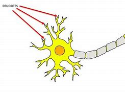

= eco 2020-08-01
:toc:

---

== Electric cars 词汇解说

(eco 2020-8-1 / Science & technology / Electric cars: Million-mile car batteries are coming)

What the million-mile battery *means for* electric cars

*It is mainly about* greater reliability 可靠性

Aug 1st 2020 |

- 百万英里电池, 对电动汽车意味着什么? +
这主要意味着可靠性的提高

*AS* EVERY MOBILE-PHONE owner *knows*, [after a year or so] the battery *starts to fade* and the beast *needs* recharging(v.)给（电池）充电；充电 more frequently. That is a nuisance 麻烦事；讨厌的人（或东西）, but a phone’s batteries *can be replaced fairly cheaply* -- or the whole handset  电话听筒;（电视等的）遥控器 *traded in* 以旧物折价换新物；折价贴换 for the latest model. An electric car, however, *is* a much bigger investment. And batteries *are* its priciest component, *representing* 等于；相当于；意味着 around 30% of an average mid-size vehicle. *Apart from* increasing(v.) the risk of *running out of juice* 汽油;电 and *leaving a driver stranded*  使滞留;使搁浅, a deteriorating 恶化 battery *quickly destroys* a car’s second-hand value.

- nuisance : /ˈnuːsns/ n. [ Cusually sing. ] a thing, person or situation that is annoying or causes trouble or problems 麻烦事；讨厌的人（或东西） / [ CU ] ( law 律 ) behaviour by sb that annoys other people and that a court can order the person to stop 妨害行为 +
=> 来自拉丁语nocere,去伤害，谋害，词源同necro-,noxious,innocent.后词义弱化，用来指妨害行为，讨厌的人。
.. *What a nuisance*! 真麻烦！

- handset : the part of a telephone that you hold close to your mouth and ear to speak into and listen 电话听筒 / （电视等的）遥控器 +
image:../../+ img_单词图片/h/handset.jpg[100,100]

- *trade sth in* : to give sth used as part of the payment for sth new 以旧物折价换新物；折价贴换
.. He *traded in* his old car *for a new Mercedes*. 他把旧汽车折价添钱买了辆新奔驰。

- represent : [ V-N ] ( not used in the progressive tenses 不用于进行时 ) to be sth 等于；相当于；意味着
SYN constitute
.. This contract *represents 20% of the company's annual revenue*. 这份合约相当于公司20%的年收入。
.. This decision *represents a significant departure from previous policy*. 这个决定意味着在很大程度上脱离了原先的政策。

- 每个手机用户都知道，过了一年左右，手机电池就会开始老化，而这只野兽需要更频繁地来充电。这是很讨人厌的事情，但是手机的电池还算能相当便宜地被更换 ——或者整个手机都可以以旧换新来换成最新的型号。然而，电动车却是一项更大的投资。电池是其最昂贵的部件，平均约占中型汽车成本的30%(2019年国内网站称, 动力电池成本虽持续降低 但仍接近整车的40%)。电池的老化除了会增加电池耗尽的风险，让司机滞留于马路上外，还会迅速伤害汽车的二手价值。

*To provide* buyers *with* some `peace 平静；安静；宁静 of mind` 内心的宁静；明镜止水, carmakers *guarantee* their batteries, typically *for* eight years or around 200,000km. Producers *are* now, though, *planning to go much further than that*, with the launch of `“million mile” (1.6m kilometre) batteries`. Zeng Yuqun, the boss of `Contemporary 属同时期的；同一时代的;当代的；现代的 Amperex Technology`, a giant Chinese firm which *produces batteries for* a number of carmakers, *said* in June *that* his company *was ready to start manufacturing(v.)（用机器）大量生产，成批制造 batteries* which *would last for* 16 years or 2m kilometres. Elon Musk *has hinted that* Tesla, a Californian maker of `electric vehicles` of which he is boss, *has* a million-mile battery *in the works*. Rumours *suggest* this *could be unveiled* in September. And over 再；又;在…的远端（或对面） in Detroit 底特律, General Motors (GM) *is in the final stages of* developing(v.) an advanced battery which *it says* has similar longevity.

- over : again 再；又 +
-> *He repeated it several times over* until he could remember it. 他重复了几遍直到能记住为止。 +
-> It's all wrong -- *you'll have to do it over*. 完全错了。你得重做一遍。 +
prep. on the far or opposite side of sth 在…的远端（或对面）
- He *lives over the road*. 他住在马路对面。

- 为了让消费者安心，汽车制造商会保证他们的电池使用年限，通常为8年或20万公里左右。然而现在，生产商计划更进一步，开始启动“百万英里”(160万公里)电池的制造。 Zeng Yuqun, 是 Contemporary Amperex Technology的老板, 他的公司是一家为多家汽车制造商生产电池的巨头.他在6月份表示，他已经准备好开始生产能使用16年或行使200万公里的电池。埃隆·马斯克(Elon Musk)曾暗示，他位于加州的商特斯拉(Tesla)(电动汽车制造商), 正在研制一款能行驶百万英里的汽车电池。有传言称，这一计划将于9月份公布。而在底特律，通用汽车公司(GM)正在开发一种高级电池，该公司称这种电池具有类似的寿命。

*To* the Moon *and back*, twice

“It’s a great catchphrase  名言；流行语；时兴的话; the million-mile battery,” says George Crabtree, director of `the Joint Centre 联合(研究)中心 for Energy Storage Research` 能源存储研究 at `Argonne National Laboratory` 阿贡国家实验室, near Chicago. “But `主` the fact (you *can drive* a million miles) `谓` *may not be the most relevant  有价值的；有意义的 parameter* 决定因素；规范；范围 to look at （用某种方式）看待，考虑;思考；考虑；研究.” *Thrash(v.) （作为惩罚用棍子等）抽打，连续击打;（使）激烈扭动，翻来覆去 a car* and its battery *will deteriorate 变坏；恶化；退化 faster*. Regular 频繁的；经常做（或发生）的 fast-charging 快速充电 *also reduces battery life*, as do *overcharging 过度充电；收费过高 and deep discharging*  释放;(气体；液体)排出；放出；流出;发（力）；放（电）. `主` *Driving* [in extremely hot or cold weather] `谓` *does not help either*. And battery life *will diminish*  减少；（使）减弱，缩减；降低 *even if* you just leave(v.) the car in the garage. *The real point* of a million-mile battery *is that* `主` the technological advances(n.) (*required* to make it possible) `谓` *will deal with* these things *[as well]*.

- catchphrase : /ˈkætʃfreɪz,ˈketʃfreɪz/ a popular phrase that is connected with the politician or entertainer 演员，表演者，艺人 who used it and made it famous 名言；流行语；时兴的话 +
image:../../+ img_单词图片/c/catchphrase.jpg[100,100]

- relevant : /ˈreləvənt/ a.
closely connected with the subject you are discussing or the situation you are thinking about 紧密相关的；切题的 +
-> *a relevant(a.) suggestion/question/point* 相关的提议╱问题╱观点 +
having ideas that are valuable and useful to people in their lives and work 有价值的；有意义的 +
-> Her novel *is still relevant(a.) today*. 她的小说今天仍有现实意义。

- parameter : n.   /pəˈræmɪtə(r)/
[ usually pl. ] something that decides or limits the way in which sth can be done 决定因素；规范；范围 +
=> para-侧面 + -meter-测量,仪表 → 随被测量的数而变化的数 +
.. *to set/define the parameters* 制订╱设定规范
.. We had to work *within the parameters* that had already been established. 我们必须在已设定的范围内工作。 +
image:../../+ img_单词图片/p/parameter.jpg[100,100]

- regular : a. done or happening often 频繁的；经常做（或发生）的 / [ only before noun ] ( of people 人 ) doing the same thing or going to the same place often 经常做某事的；常去某地的
.. Do you *take regular exercise*? 你经常锻炼吗？
.. our *regular customers* 我们的老主顾
.. *regular offenders* (= against the law) 惯犯

- diminish : v. to become or to make sth become smaller, weaker, etc. 减少；（使）减弱，缩减；降低 SYN decrease
.. His influence *has diminished with time*. 随着时间的推移，他的影响已不如从前了。
.. Our efforts *were producing(v.) diminishing returns* (= we achieved less although we spent more time or money) . 我们不断投入，收益却在递减。

- "能往返月球两次" +
阿贡国家实验室, 位于芝加哥附近, 其能源储存联合研究中心主任, 乔治·克莱布特里说, "这是一个很好的广告语"。但是，你能用它来驾驶100万英里这一事实, 可能并不是最值得关注的参数。“过度使用一辆汽车，它的电池会更快地损坏。经常快速充电, 也会缩短电池寿命，过度充电和深度放电, 也是如此。在极热或极冷的天气里开车, 无益于电池寿命。即使你把车停在车库里不用，电池寿命也会自然缩短。百万英里电池的真正意义在于，技术进步能使电池的百万英里成为可能, 它也能处理电池老化这些问题。

`主` The lithium 锂-ion 离子 (Li-ion) batteries` which *power* electric cars `谓` *age(v.) in two ways*: with time and with use. Battery-makers *call* time-dependent ageing “calendar ageing”. It is a consequence of `the gradual degradation` 毁坏，恶化（过程） of some of the materials *employed* 应用；运用；使用 in battery construction. This degradation *reduces a battery’s ability* to hold a charge （电池或带电物质的）充电量，电荷 -- though even here *it is possible to ameliorate(v.)改善；改进；改良 the problem to a certain extent*. `主` Leaving a car with a fully *rather than* partly charged battery, for example, `谓` *can increase* the rate of calendar ageing.

- degradation : ( technical 术语 ) the process of sth being damaged or made worse 毁坏，恶化（过程）
.. *environmental degradation* 环境恶化

- employ : v.  *~ sb (as sth)* : to give sb a job to do for payment 雇用 / [ VN ] ( formal ) to use sth such as a skill, method, etc. for a particular purpose 应用；运用；使用
.. He criticized the repressive methods *employed by the country's government*. 他指责了这个国家政府采取的镇压手段。
.. The police had to *employ force to enter the building*. 警察不得不强行进入大楼。

- ameliorate :  /əˈmiːliəreɪt/ [ VN ] ( formal ) to make sth better 改善；改进；改良 +
=> 前缀a- 同ad-. 词根mel, 加强，多，见multitude, 许多。-ior, 比较级后缀。

- 为电动汽车提供动力的锂离子电池, 会随着时间和使用数量而老化。电池制造商将"依赖于时间的老化", 称为“日程老化”。这是因为电池制造中使用的一些材料, 性能会逐渐退化的结果。这种退化, 会降低电池的充电能力——尽管在某种程度上, 可以改善这个问题。例如，将汽车电池完全充满，比只充一部分, 会增加"日程老化"的速度。

Use-dependent ageing *is a consequence* of the number of `discharge-recharge cycles` (a battery *goes through* 经历，经受（尤指苦难或艰难时期）). *It is caused by* `the complex chemical reactions` that *take place* when a battery *is operating*. Some of these *are essential to* a battery’s job of *storing and releasing energy*. “But there *are* also `side reactions` [化学] 副反应；副作用 that you *can’t stop* /and some of those *are harmful*,” explains Dr Crabtree.

*As* a battery *discharges*, lithium ions (lithium atoms (with an electron missing)) *are created* [at one electrode 电极, the anode 阳极]. These then *shuttle(v.)穿梭; 频繁往来（于甲地和乙地之间）; （在较近的两地之间定时）往返运送 through* a liquid electrolyte 电解液；电解质 *to* a second electrode, the cathode 阴极；负极. The electrons *stripped away* at the anode 阳极, meanwhile, *travel towards* the cathode 阴极 *along* an external 外部的；外面的 electrical circuit 电路, which *powers(v.) the car*. Ions and electrons 电子 *are reunited （使）重逢，再次相聚; （使）再结合，再联合 at the cathode* and *remain there* until the battery *is plugged 能与（电源或其他电器）连接 into a charger* 充电器 and *the process is reversed*.

- electrode : /ɪˈlektroʊd/ either of two points (or terminals ) by which an electric current enters or leaves a battery or other electrical device 电极 +
=> electro, 电。-od, 路，见method, anode. +
image:../../+ img_单词图片/e/electrode.jpg[100,100]

- anode : n.   /ˈænəʊd/
( technical 术语 ) the electrode in an electrical device where oxidation occurs; the positive electrode in an electrolytic cell and the negative electrode in a battery 阳极 +
=> 前缀ana-, 向上。词根hod, 路，见odometer, 里程计，同词根ced, 走。

- cathode : /ˈkæθoʊd/ ( technical 术语 ) the electrode in an electrical device where reduction occurs; the negative electrode in an electrolytic cell and the positive electrode in a battery 阴极；负极 +
=> cata-, 向下。-hod, 走，路，词源同accede, anode, method.

- reunite : v.  *~ A with B | ~ A and B* [ usually passive ] to bring two or more people together again after they have been separated for a long time; to come together again （使）重逢，再次相聚 / to join together again separate areas or separate groups within an organization, a political party, etc.; to come together again （使）再结合，再联合 +
.. *The family was reunited* after the war. 战争过后，一家人又相聚了。
.. As leader, his main aim *is to reunite the party*. 作为领导，他的主要目标就是要使党内各派团结起来。

- 当电池放电时，锂离子(缺少一个电子的锂原子)在阳极上产生。然后它们通过液体电解质, 进入第二个电极——阴极。与此同时，阳极上的电子被剥离，沿着为汽车提供动力的外部电路, 流向阴极。离子和电子聚集在阴极上，并一直停留在那里，直到电池被插入充电器，然后过程再反过来。

- 当对电池进行充电时，电池的正极上有锂离子生成，生成的锂离子经过电解液运动到负极。而作为负极的碳呈层状结构，它有很多微孔，达到负极的锂离子就嵌入到碳层的微孔中，嵌入的锂离子越多，充电容量越高。同样，当对电池进行放电时（即我们使用电池的过程），嵌在负极碳层中的锂离子脱出，又运动回正极。回正极的锂离子越多，放电容量越高。

Each cycle of discharge and recharge *takes its toll*(（道路、桥梁的）通行费) 产生恶果；造成重大损失（或伤亡、灾难等）. Lithium *is [so] highly reactive*(a.)反应的；有反应的；回应的;能起化学反应的；易反应的 [that] `主` stopping(v.) it *getting tied up* 把…缠住；使不能分身;把…联系起来；使与…有关系 in other chemical compounds [while a battery *is in use*] `系` *is hard*. Even `主` a small amount of diversion 转向；转移；偏离 per cycle `谓` *adds up*, *reducing* the amount of the element available to store energy. On top of this, `主` charging up 给…充电 faster *than* ions can be absorbed by the anode `谓` *may result in* a layer of lithium “plating”(n.)镀层（镀在金属上的其他金属薄层）;外层；（尤指）金属板护层 *building up* 加大；加强；增多 on the anode’s surface, *reducing* its storage capacity.

- toll （道路、桥梁的）通行费 /  （战争、灾难等造成的）毁坏；伤亡人数

- *take a heavy toll (on sb/sth)* : take its toll (on sb/sth)
to have a bad effect on sb/sth; to cause a lot of damage, deaths, suffering, etc. 产生恶果；造成重大损失（或伤亡、灾难等）
.. Illness had taken a heavy toll on her. 疾病对她的身体造成极大的损害。

- plating : a thin covering of a metal, especially silver or gold, on another metal 镀层（镀在金属上的其他金属薄层） / a layer of coverings, especially of metal plates 外层；（尤指）金属板护层

- 每一次的充放电循环, 都会有损失。锂的反应性非常强，以至于在电池使用过程中, 很难阻止它与其他化合物相结合。即使每个充放电循环中的少量锂的转移, 累加起来，也会降低"可供存储电量的物质"的数量。最重要的是，充电速度如果超过阳极能吸收离子的速度, 可能会导致在阳极表面形成一层锂“镀层”，从而降低其电量存储容量。

Plating *becomes yet more of a problem* [if it *leads to* the development of structures *called* dendrites （神经的） 树突]. These *are* `small, finger-like fibres` which *project 突出；外伸；伸出 into* the electrolyte 电解液，电解质 *from* points on the anode where plating *is especially elevated* 提高；使升高;举起；抬起;使情绪高昂；使精神振奋；使兴高采烈.  [If a dendrite *reaches* the cathode] the battery *will short-circuit* （使）短路, *causing it to heat up rapidly* and *possibly catch fire*. Other `side reactions` *can have similarly adverse 不利的；有害的；反面的 consequences*.

-  dendrite : /ˈdendraɪt/ n. ( also den·dron   /ˈdendrɒn/   ) ( biology 生 ) a short branch at the end of a nerve cell, which receives signals from other cells 树突（位于神经元末端的细分支，接收其他神经元传来的信号）
—— compare axon +
=>  词源同tree. 前面den-为dr的韵律重复。用于神经学名词树突。拼写比较gangrene. +
-> *dendritic cells* 树突细胞 +

- 如果镀层导致了一种称为"树突结构"的形成，就会成为一个更大的问题。这些手指状的小纤维, 会从阳极点(在这儿电镀层特别活跃)伸向电解液中, 如果这些树突达到阴极，就会使电池短路，使其迅速升温，并可能着火。其他的副作用, 也会产生类似的不良后果。

It is difficult *to generalise about* the extent (*to which* these processes *reduce a battery’s lifetime*). Not only *does it depend on* how that battery is used, but also *how it is made*. Li-ion cells 电池 *come in different forms* and a variety of chemistries 化学成分; 化学反应, some of which *have not been around 出现；现有；可用 long enough* in cars *for people to know for sure* how long they will last(v.). Nor *is there* any independent testing(n.), says Dr Crabtree.

- around : present in a place; available 出现；现有；可用
.. *There was more money around* in those days. 那年头比现在富裕。
.. I knocked *but there was no one around*. 我敲了门，但是没有人应门。
.. Digital television *has been around* for some time now. 数字电视已经面市一段时间了。

- 这些过程会将电池寿命减少到何种程度, 很难对此进行概括. 这不仅取决于电池是如何被使用的，而且还取决于它是如何制造的。锂离子电池有不同的形式和不同的化学成分，有些锂离子电池, 在汽车上出现的时间还不够长，人们还不知道它们在汽车上能用多久。克莱布特里博士说，目前也没有任何独立的检测方法。

Nevertheless, the industry has a few rules of thumb. Once a battery’s capacity falls below 80% of its starting value, it is generally thought no longer suitable for use in vehicles. Some reckon that, on average, Li-ion batteries lose 2% of their capacity a year. This may not seem much, but by the time a vehicle is six years old it could mean it is halfway through its useful life.

The long road ahead

Battery technology is improving all the time. As a consequence, so are calendar and use-dependent lifetimes. Getting direct experience of how electric cars are used is helping researchers come up with ways to mitigate some of the side reactions, says Tim Grewe, the head of GM’s electrification strategy. The company employs remote, “telematic” monitoring to keep track of how batteries are performing in its cars, and also takes back some batteries from high-mileage drivers and those living in extreme environments, such as deserts and mountainous regions, for analysis.

Dealing with impurities which get into batteries helps to extend their lives. Water, for example, reacts with salts in the electrolyte to form an acid, which attacks the electrodes. To prevent this, GM has developed an additive made from a type of material called a zeolite. Zeolites are molecular sponges. GM’s version serves to mop up any moisture which enters a battery cell.

Adding a little aluminium to a nickel-cobalt-manganese cathode, a type that is widely used in Li-ion batteries, saves on cobalt, the most expensive ingredient in a battery. But the aluminium delivers other benefits as well, adds Mr Grewe. It boosts the battery’s energy density, meaning a car can travel farther on a single charge. It also makes the battery last longer.

GM will be using these cathodes in a new battery, called Ultium, that it has developed in partnership with LG Chem, a South Korean firm. Ultium batteries, production of which is planned to start next year at a factory in Ohio, should provide electric cars with single-charge ranges of 650km or more. That compares with the 400km range which might these days reasonably be expected from a mid-size electric car. Asked if the Ultium is a million-mile battery, Mr Grewe replied, “Many customers could get that.”

On to two million!

As a marketing device, the million-mile battery will give electric-car buyers—even those never likely to put a million miles on the clock—more confidence that their batteries are robust. But some users might truly desire a lifetime range that great.

Jeff Dahn, who leads a group of battery researchers at Dalhousie University in Halifax, Canada, who are sponsored by Tesla, points out that autonomous electric vehicles like “robo taxis” could clock up vast mileages by operating around the clock. So, too, would long-haul lorries and electric buses. And some cars may end up being more than just means of transport. Plans are afoot to let electric-vehicle owners connect their jalopies to the grid in a way that will store surplus electricity generated in times of plenty by wind and sunshine and release it during hours of peak demand, with the owner collecting a fee for doing so. That means these grid-buffering vehicles will be racking up lots of charging cycles even when they are not moving.

Nor are million-mile batteries the limit of engineers’ aspirations. The next objective is to replace Li-ions’ liquid electrolytes with solid ones. That would keep the ions under stricter control and allow even longer driving ranges. This could make a two-million-mile battery a feasible objective. If that day comes, the tables would have been turned. From being the first part of a car to fail, its battery will have become the last.

---

== Electric cars

What the million-mile battery means for electric cars

It is mainly about greater reliability

Aug 1st 2020 |

AS EVERY MOBILE-PHONE owner knows, after a year or so the battery starts to fade and the beast needs recharging more frequently. That is a nuisance, but a phone’s batteries can be replaced fairly cheaply—or the whole handset traded in for the latest model. An electric car, however, is a much bigger investment. And batteries are its priciest component, representing around 30% of an average mid-size vehicle. Apart from increasing the risk of running out of juice and leaving a driver stranded, a deteriorating battery quickly destroys a car’s second-hand value.

To provide buyers with some peace of mind, carmakers guarantee their batteries, typically for eight years or around 200,000km. Producers are now, though, planning to go much further than that, with the launch of “million mile” (1.6m kilometre) batteries. Zeng Yuqun, the boss of Contemporary Amperex Technology, a giant Chinese firm which produces batteries for a number of carmakers, said in June that his company was ready to start manufacturing batteries which would last for 16 years or 2m kilometres. Elon Musk has hinted that Tesla, a Californian maker of electric vehicles of which he is boss, has a million-mile battery in the works. Rumours suggest this could be unveiled in September. And over in Detroit, General Motors (GM) is in the final stages of developing an advanced battery which it says has similar longevity.

To the Moon and back, twice

“It’s a great catchphrase; the million-mile battery,” says George Crabtree, director of the Joint Centre for Energy Storage Research at Argonne National Laboratory, near Chicago. “But the fact you can drive a million miles may not be the most relevant parameter to look at.” Thrash a car and its battery will deteriorate faster. Regular fast-charging also reduces battery life, as do overcharging and deep discharging. Driving in extremely hot or cold weather does not help either. And battery life will diminish even if you just leave the car in the garage. The real point of a million-mile battery is that the technological advances required to make it possible will deal with these things as well.

The lithium-ion (Li-ion) batteries which power electric cars age in two ways: with time and with use. Battery-makers call time-dependent ageing “calendar ageing”. It is a consequence of the gradual degradation of some of the materials employed in battery construction. This degradation reduces a battery’s ability to hold a charge—though even here it is possible to ameliorate the problem to a certain extent. Leaving a car with a fully rather than partly charged battery, for example, can increase the rate of calendar ageing.

Use-dependent ageing is a consequence of the number of discharge-recharge cycles a battery goes through. It is caused by the complex chemical reactions that take place when a battery is operating. Some of these are essential to a battery’s job of storing and releasing energy. “But there are also side reactions that you can’t stop and some of those are harmful,” explains Dr Crabtree.

As a battery discharges, lithium ions (lithium atoms with an electron missing) are created at one electrode, the anode. These then shuttle through a liquid electrolyte to a second electrode, the cathode. The electrons stripped away at the anode, meanwhile, travel towards the cathode along an external electrical circuit, which powers the car. Ions and electrons are reunited at the cathode and remain there until the battery is plugged into a charger and the process is reversed.

Each cycle of discharge and recharge takes its toll. Lithium is so highly reactive that stopping it getting tied up in other chemical compounds while a battery is in use is hard. Even a small amount of diversion per cycle adds up, reducing the amount of the element available to store energy. On top of this, charging up faster than ions can be absorbed by the anode may result in a layer of lithium “plating” building up on the anode’s surface, reducing its storage capacity.

Plating becomes yet more of a problem if it leads to the development of structures called dendrites. These are small, finger-like fibres which project into the electrolyte from points on the anode where plating is especially elevated. If a dendrite reaches the cathode the battery will short-circuit, causing it to heat up rapidly and possibly catch fire. Other side reactions can have similarly adverse consequences.

It is difficult to generalise about the extent to which these processes reduce a battery’s lifetime. Not only does it depend on how that battery is used, but also how it is made. Li-ion cells come in different forms and a variety of chemistries, some of which have not been around long enough in cars for people to know for sure how long they will last. Nor is there any independent testing, says Dr Crabtree.

Nevertheless, the industry has a few rules of thumb. Once a battery’s capacity falls below 80% of its starting value, it is generally thought no longer suitable for use in vehicles. Some reckon that, on average, Li-ion batteries lose 2% of their capacity a year. This may not seem much, but by the time a vehicle is six years old it could mean it is halfway through its useful life.

The long road ahead

Battery technology is improving all the time. As a consequence, so are calendar and use-dependent lifetimes. Getting direct experience of how electric cars are used is helping researchers come up with ways to mitigate some of the side reactions, says Tim Grewe, the head of GM’s electrification strategy. The company employs remote, “telematic” monitoring to keep track of how batteries are performing in its cars, and also takes back some batteries from high-mileage drivers and those living in extreme environments, such as deserts and mountainous regions, for analysis.

Dealing with impurities which get into batteries helps to extend their lives. Water, for example, reacts with salts in the electrolyte to form an acid, which attacks the electrodes. To prevent this, GM has developed an additive made from a type of material called a zeolite. Zeolites are molecular sponges. GM’s version serves to mop up any moisture which enters a battery cell.

Adding a little aluminium to a nickel-cobalt-manganese cathode, a type that is widely used in Li-ion batteries, saves on cobalt, the most expensive ingredient in a battery. But the aluminium delivers other benefits as well, adds Mr Grewe. It boosts the battery’s energy density, meaning a car can travel farther on a single charge. It also makes the battery last longer.

GM will be using these cathodes in a new battery, called Ultium, that it has developed in partnership with LG Chem, a South Korean firm. Ultium batteries, production of which is planned to start next year at a factory in Ohio, should provide electric cars with single-charge ranges of 650km or more. That compares with the 400km range which might these days reasonably be expected from a mid-size electric car. Asked if the Ultium is a million-mile battery, Mr Grewe replied, “Many customers could get that.”

On to two million!

As a marketing device, the million-mile battery will give electric-car buyers—even those never likely to put a million miles on the clock—more confidence that their batteries are robust. But some users might truly desire a lifetime range that great.

Jeff Dahn, who leads a group of battery researchers at Dalhousie University in Halifax, Canada, who are sponsored by Tesla, points out that autonomous electric vehicles like “robo taxis” could clock up vast mileages by operating around the clock. So, too, would long-haul lorries and electric buses. And some cars may end up being more than just means of transport. Plans are afoot to let electric-vehicle owners connect their jalopies to the grid in a way that will store surplus electricity generated in times of plenty by wind and sunshine and release it during hours of peak demand, with the owner collecting a fee for doing so. That means these grid-buffering vehicles will be racking up lots of charging cycles even when they are not moving.

Nor are million-mile batteries the limit of engineers’ aspirations. The next objective is to replace Li-ions’ liquid electrolytes with solid ones. That would keep the ions under stricter control and allow even longer driving ranges. This could make a two-million-mile battery a feasible objective. If that day comes, the tables would have been turned. From being the first part of a car to fail, its battery will have become the last.

尽管如此，这个行业还是有一些经验法则。一旦电池的容量低于其初始值的80%，一般认为它不再适合在汽车上使用。一些人估计，锂离子电池平均每年损耗2%的容量。这可能看起来不多，但当一辆车用了6年的时候，这可能意味着它的使用寿命已经过半了。
漫长的路
电池技术一直在进步。因此，与日历和使用相关的生存期也是如此。通用汽车电气化战略负责人蒂姆·格雷韦(Tim Grewe)表示，直接体验如何使用电动汽车有助于研究人员找到减轻某些副作用的方法。该公司采用远程“遥测”技术来跟踪电池在其汽车中的表现，并从行驶里程高的驾驶者和生活在沙漠和山区等极端环境中的人那里回收一些电池进行分析。
处理进入电池的杂质有助于延长电池的寿命。例如，水和电解质中的盐发生反应，形成酸，酸会攻击电极。为了防止这种情况发生，转基因公司开发了一种由一种叫做沸石的材料制成的添加剂。沸石是分子海绵。通用汽车公司的这一版本用于清除进入电池的任何水分。
在镍钴锰阴极(广泛应用于锂离子电池)中加入少量铝，可以节省电池中最昂贵的钴元素。但格雷威补充称，铝也带来了其他好处。它提高了电池的能量密度，这意味着汽车一次充电可以走得更远。它还能延长电池的使用寿命。
通用将在一种名为Ultium的新电池中使用这些阴极，该电池是通用与韩国LG化学公司合作开发的。Ultium电池计划明年在俄亥俄州的一家工厂开始生产，该电池将为电动汽车提供650公里或以上的单次充电里程。相比之下，如今一辆中型电动汽车的400公里续航里程可能是合理的。当被问及Ultium电池是否能续航百万英里时，格雷韦回答说:“很多客户都能买到这种电池。”

加拿大哈利法克斯达尔豪斯大学(Dalhousie University)的杰夫·达恩(Jeff Dahn)领导着一个电池研究小组，该小组由特斯拉(Tesla)赞助。他指出，像“机器人出租车”(robo taxis)这样的自动驾驶电动汽车可以24小时运行，行驶数英里。长途卡车和电动公交车也同样如此。有些汽车可能最终不仅仅是一种交通工具。计划正在进行中，让电动汽车车主将他们的老爷车连接到电网上，以一种方式将充足时由风能和阳光产生的剩余电力储存起来，并在用电高峰时段释放出来，车主为此收取费用。这意味着即使在不移动的情况下，这些缓冲电网的汽车也要进行大量的充电。
百万英里电池也不是工程师梦想的极限。下一个目标是用固体电解质取代锂离子的液体电解质。这将使离子处于更严格的控制之下，并允许更长的射程。这可能使200万英里的电池成为一个可行的目标。如果那一天到来，局势就会逆转。电池将从第一个出现故障的部件变成最后一个。