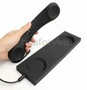
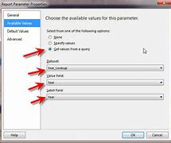
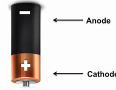
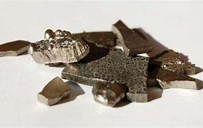

= eco 2020-08-01
:toc:

---

== Electric cars 词汇解说

(eco 2020-8-1 / Science & technology / Electric cars: Million-mile car batteries are coming)

What the million-mile battery *means for* electric cars

*It is mainly about* greater reliability 可靠性

Aug 1st 2020 |

- 百万英里电池, 对电动汽车意味着什么? +
这主要意味着可靠性的提高

*AS* EVERY MOBILE-PHONE owner *knows*, [after a year or so] the battery *starts to fade* and the beast *needs* recharging(v.)给（电池）充电；充电 more frequently. That is a nuisance 麻烦事；讨厌的人（或东西）, but a phone’s batteries *can be replaced fairly cheaply* -- or the whole handset  电话听筒;（电视等的）遥控器 *traded in* 以旧物折价换新物；折价贴换 for the latest model. An electric car, however, *is* a much bigger investment. And batteries *are* its priciest component, *representing* 等于；相当于；意味着 around 30% of an average mid-size vehicle. *Apart from* increasing(v.) the risk of *running out of juice* 汽油;电 and *leaving a driver stranded*  使滞留;使搁浅, a deteriorating 恶化 battery *quickly destroys* a car’s second-hand value.

- nuisance : /ˈnuːsns/ n. [ Cusually sing. ] a thing, person or situation that is annoying or causes trouble or problems 麻烦事；讨厌的人（或东西） / [ CU ] ( law 律 ) behaviour by sb that annoys other people and that a court can order the person to stop 妨害行为 +
=> 来自拉丁语nocere,去伤害，谋害，词源同necro-,noxious,innocent.后词义弱化，用来指妨害行为，讨厌的人。
.. *What a nuisance*! 真麻烦！

- handset : the part of a telephone that you hold close to your mouth and ear to speak into and listen 电话听筒 / （电视等的）遥控器 +

- *trade sth in* : to give sth used as part of the payment for sth new 以旧物折价换新物；折价贴换
.. He *traded in* his old car *for a new Mercedes*. 他把旧汽车折价添钱买了辆新奔驰。

- represent : [ V-N ] ( not used in the progressive tenses 不用于进行时 ) to be sth 等于；相当于；意味着
SYN constitute
.. This contract *represents 20% of the company's annual revenue*. 这份合约相当于公司20%的年收入。
.. This decision *represents a significant departure from previous policy*. 这个决定意味着在很大程度上脱离了原先的政策。

- 每个手机用户都知道，过了一年左右，手机电池就会开始老化，而这只野兽需要更频繁地来充电。这是很讨人厌的事情，但是手机的电池还算能相当便宜地被更换 ——或者整个手机都可以以旧换新来换成最新的型号。然而，电动车却是一项更大的投资。电池是其最昂贵的部件，平均约占中型汽车成本的30%(2019年国内网站称, 动力电池成本虽持续降低 但仍接近整车的40%)。电池的老化除了会增加电池耗尽的风险，让司机滞留于马路上外，还会迅速伤害汽车的二手价值。

*To provide* buyers *with* some `peace 平静；安静；宁静 of mind` 内心的宁静；明镜止水, carmakers *guarantee* their batteries, typically *for* eight years or around 200,000km. Producers *are* now, though, *planning to go much further than that*, with the launch of `“million mile” (1.6m kilometre) batteries`. Zeng Yuqun, the boss of `Contemporary 属同时期的；同一时代的;当代的；现代的 Amperex Technology`, a giant Chinese firm which *produces batteries for* a number of carmakers, *said* in June *that* his company *was ready to start manufacturing(v.)（用机器）大量生产，成批制造 batteries* which *would last for* 16 years or 2m kilometres. Elon Musk *has hinted that* Tesla, a Californian maker of `electric vehicles` of which he is boss, *has* a million-mile battery *in the works*. Rumours *suggest* this *could be unveiled* in September. And over 再；又;在…的远端（或对面） in Detroit 底特律, General Motors (GM) *is in the final stages of* developing(v.) an advanced battery which *it says* has similar longevity.

- over : again 再；又 +
-> *He repeated it several times over* until he could remember it. 他重复了几遍直到能记住为止。 +
-> It's all wrong -- *you'll have to do it over*. 完全错了。你得重做一遍。 +
prep. on the far or opposite side of sth 在…的远端（或对面）
- He *lives over the road*. 他住在马路对面。

- 为了让消费者安心，汽车制造商会保证他们的电池使用年限，通常为8年或20万公里左右。然而现在，生产商计划更进一步，开始启动“百万英里”(160万公里)电池的制造。 Zeng Yuqun, 是 Contemporary Amperex Technology的老板, 他的公司是一家为多家汽车制造商生产电池的巨头.他在6月份表示，他已经准备好开始生产能使用16年或行使200万公里的电池。埃隆·马斯克(Elon Musk)曾暗示，他位于加州的商特斯拉(Tesla)(电动汽车制造商), 正在研制一款能行驶百万英里的汽车电池。有传言称，这一计划将于9月份公布。而在底特律，通用汽车公司(GM)正在开发一种高级电池，该公司称这种电池具有类似的寿命。

*To* the Moon *and back*, twice

“It’s a great catchphrase  名言；流行语；时兴的话; the million-mile battery,” says George Crabtree, director of `the Joint Centre 联合(研究)中心 for Energy Storage Research` 能源存储研究 at `Argonne National Laboratory` 阿贡国家实验室, near Chicago. “But `主` the fact (you *can drive* a million miles) `谓` *may not be the most relevant  有价值的；有意义的 parameter* 决定因素；规范；范围 to look at （用某种方式）看待，考虑;思考；考虑；研究.” *Thrash(v.) （作为惩罚用棍子等）抽打，连续击打;（使）激烈扭动，翻来覆去 a car* and its battery *will deteriorate 变坏；恶化；退化 faster*. Regular 频繁的；经常做（或发生）的 fast-charging 快速充电 *also reduces battery life*, as do *overcharging 过度充电；收费过高 and deep discharging*  释放;(气体；液体)排出；放出；流出;发（力）；放（电）. `主` *Driving* [in extremely hot or cold weather] `谓` *does not help either*. And battery life *will diminish*  减少；（使）减弱，缩减；降低 *even if* you just leave(v.) the car in the garage. *The real point* of a million-mile battery *is that* `主` the technological advances(n.) (*required* to make it possible) `谓` *will deal with* these things *[as well]*.

- catchphrase : /ˈkætʃfreɪz,ˈketʃfreɪz/ a popular phrase that is connected with the politician or entertainer 演员，表演者，艺人 who used it and made it famous 名言；流行语；时兴的话 +

- relevant : /ˈreləvənt/ a.
closely connected with the subject you are discussing or the situation you are thinking about 紧密相关的；切题的 +
-> *a relevant(a.) suggestion/question/point* 相关的提议╱问题╱观点 +
having ideas that are valuable and useful to people in their lives and work 有价值的；有意义的 +
-> Her novel *is still relevant(a.) today*. 她的小说今天仍有现实意义。

- parameter : n.   /pəˈræmɪtə(r)/
[ usually pl. ] something that decides or limits the way in which sth can be done 决定因素；规范；范围 +
=> para-侧面 + -meter-测量,仪表 → 随被测量的数而变化的数 +
.. *to set/define the parameters* 制订╱设定规范
.. We had to work *within the parameters* that had already been established. 我们必须在已设定的范围内工作。 +

- regular : a. done or happening often 频繁的；经常做（或发生）的 / [ only before noun ] ( of people 人 ) doing the same thing or going to the same place often 经常做某事的；常去某地的
.. Do you *take regular exercise*? 你经常锻炼吗？
.. our *regular customers* 我们的老主顾
.. *regular offenders* (= against the law) 惯犯

- diminish : v. to become or to make sth become smaller, weaker, etc. 减少；（使）减弱，缩减；降低 SYN decrease
.. His influence *has diminished with time*. 随着时间的推移，他的影响已不如从前了。
.. Our efforts *were producing(v.) diminishing returns* (= we achieved less although we spent more time or money) . 我们不断投入，收益却在递减。

- "能往返月球两次" +
阿贡国家实验室, 位于芝加哥附近, 其能源储存联合研究中心主任, 乔治·克莱布特里说, "这是一个很好的广告语"。但是，你能用它来驾驶100万英里这一事实, 可能并不是最值得关注的参数。“过度使用一辆汽车，它的电池会更快地损坏。经常快速充电, 也会缩短电池寿命，过度充电和深度放电, 也是如此。在极热或极冷的天气里开车, 无益于电池寿命。即使你把车停在车库里不用，电池寿命也会自然缩短。百万英里电池的真正意义在于，技术进步能使电池的百万英里成为可能, 它也能处理电池老化这些问题。

`主` The lithium 锂-ion 离子 (Li-ion) batteries` which *power* electric cars `谓` *age(v.) in two ways*: with time and with use. Battery-makers *call* time-dependent ageing “calendar ageing”. It is a consequence of `the gradual degradation` 毁坏，恶化（过程） of some of the materials *employed* 应用；运用；使用 in battery construction. This degradation *reduces a battery’s ability* to hold a charge （电池或带电物质的）充电量，电荷 -- though even here *it is possible to ameliorate(v.)改善；改进；改良 the problem to a certain extent*. `主` Leaving a car with a fully *rather than* partly charged battery, for example, `谓` *can increase* the rate of calendar ageing.

- degradation : ( technical 术语 ) the process of sth being damaged or made worse 毁坏，恶化（过程）
.. *environmental degradation* 环境恶化

- employ : v.  *~ sb (as sth)* : to give sb a job to do for payment 雇用 / [ VN ] ( formal ) to use sth such as a skill, method, etc. for a particular purpose 应用；运用；使用
.. He criticized the repressive methods *employed by the country's government*. 他指责了这个国家政府采取的镇压手段。
.. The police had to *employ force to enter the building*. 警察不得不强行进入大楼。

- ameliorate :  /əˈmiːliəreɪt/ [ VN ] ( formal ) to make sth better 改善；改进；改良 +
=> 前缀a- 同ad-. 词根mel, 加强，多，见multitude, 许多。-ior, 比较级后缀。

- 为电动汽车提供动力的锂离子电池, 会随着时间和使用数量而老化。电池制造商将"依赖于时间的老化", 称为“日程老化”。这是因为电池制造中使用的一些材料, 性能会逐渐退化的结果。这种退化, 会降低电池的充电能力——尽管在某种程度上, 可以改善这个问题。例如，将汽车电池完全充满，比只充一部分, 会增加"日程老化"的速度。

Use-dependent ageing *is a consequence* of the number of `discharge-recharge cycles` (a battery *goes through* 经历，经受（尤指苦难或艰难时期）). *It is caused by* `the complex chemical reactions` that *take place* when a battery *is operating*. Some of these *are essential to* a battery’s job of *storing and releasing energy*. “But there *are* also `side reactions` [化学] 副反应；副作用 that you *can’t stop* /and some of those *are harmful*,” explains Dr Crabtree.

*As* a battery *discharges*, lithium ions (lithium atoms (with an electron missing)) *are created* [at one electrode 电极, the anode 阳极]. These then *shuttle(v.)穿梭; 频繁往来（于甲地和乙地之间）; （在较近的两地之间定时）往返运送 through* a liquid electrolyte 电解液；电解质 *to* a second electrode, the cathode 阴极；负极. The electrons *stripped away* at the anode 阳极, meanwhile, *travel towards* the cathode 阴极 *along* an external 外部的；外面的 electrical circuit 电路, which *powers(v.) the car*. Ions and electrons 电子 *are reunited （使）重逢，再次相聚; （使）再结合，再联合 at the cathode* and *remain there* until the battery *is plugged 能与（电源或其他电器）连接 into a charger* 充电器 and *the process is reversed*.

- electrode : /ɪˈlektroʊd/ either of two points (or terminals ) by which an electric current enters or leaves a battery or other electrical device 电极 +
=> electro, 电。-od, 路，见method, anode. +

- anode : n.   /ˈænəʊd/
( technical 术语 ) the electrode in an electrical device where oxidation occurs; the positive electrode in an electrolytic cell and the negative electrode in a battery 阳极 +
=> 前缀ana-, 向上。词根hod, 路，见odometer, 里程计，同词根ced, 走。

- cathode : /ˈkæθoʊd/ ( technical 术语 ) the electrode in an electrical device where reduction occurs; the negative electrode in an electrolytic cell and the positive electrode in a battery 阴极；负极 +
=> cata-, 向下。-hod, 走，路，词源同accede, anode, method.

- reunite : v.  *~ A with B | ~ A and B* [ usually passive ] to bring two or more people together again after they have been separated for a long time; to come together again （使）重逢，再次相聚 / to join together again separate areas or separate groups within an organization, a political party, etc.; to come together again （使）再结合，再联合 +
.. *The family was reunited* after the war. 战争过后，一家人又相聚了。
.. As leader, his main aim *is to reunite the party*. 作为领导，他的主要目标就是要使党内各派团结起来。

- 当电池放电时，锂离子(缺少一个电子的锂原子)在阳极上产生。然后它们通过液体电解质, 进入第二个电极——阴极。与此同时，阳极上的电子被剥离，沿着为汽车提供动力的外部电路, 流向阴极。离子和电子聚集在阴极上，并一直停留在那里，直到电池被插入充电器，然后过程再反过来。

- 当对电池进行充电时，电池的正极上有锂离子生成，生成的锂离子经过电解液运动到负极。而作为负极的碳呈层状结构，它有很多微孔，达到负极的锂离子就嵌入到碳层的微孔中，嵌入的锂离子越多，充电容量越高。同样，当对电池进行放电时（即我们使用电池的过程），嵌在负极碳层中的锂离子脱出，又运动回正极。回正极的锂离子越多，放电容量越高。

Each cycle of discharge and recharge *takes its toll*(（道路、桥梁的）通行费) 产生恶果；造成重大损失（或伤亡、灾难等）. Lithium *is [so] highly reactive*(a.)反应的；有反应的；回应的;能起化学反应的；易反应的 [that] `主` stopping(v.) it *getting tied up* 把…缠住；使不能分身;把…联系起来；使与…有关系 in other chemical compounds [while a battery *is in use*] `系` *is hard*. Even `主` a small amount of diversion 转向；转移；偏离 per cycle `谓` *adds up*, *reducing* the amount of the element available to store energy. On top of this, `主` charging up 给…充电 faster *than* ions can be absorbed by the anode `谓` *may result in* a layer of lithium “plating”(n.)镀层（镀在金属上的其他金属薄层）;外层；（尤指）金属板护层 *building up* 加大；加强；增多 on the anode’s surface, *reducing* its storage capacity.

- toll （道路、桥梁的）通行费 /  （战争、灾难等造成的）毁坏；伤亡人数

- *take a heavy toll (on sb/sth)* : take its toll (on sb/sth)
to have a bad effect on sb/sth; to cause a lot of damage, deaths, suffering, etc. 产生恶果；造成重大损失（或伤亡、灾难等）
.. Illness had taken a heavy toll on her. 疾病对她的身体造成极大的损害。

- plating : a thin covering of a metal, especially silver or gold, on another metal 镀层（镀在金属上的其他金属薄层） / a layer of coverings, especially of metal plates 外层；（尤指）金属板护层

- 每一次的充放电循环, 都会有损失。锂的反应性非常强，以至于在电池使用过程中, 很难阻止它与其他化合物相结合。即使每个充放电循环中的少量锂的转移, 累加起来，也会降低"可供存储电量的物质"的数量。最重要的是，充电速度如果超过阳极能吸收离子的速度, 可能会导致在阳极表面形成一层锂“镀层”，从而降低其电量存储容量。

Plating *becomes yet more of a problem* [if it *leads to* the development of structures *called* dendrites （神经的） 树突]. These *are* `small, finger-like fibres` which *project 突出；外伸；伸出 into* the electrolyte 电解液，电解质 *from* points on the anode where plating *is especially elevated* 提高；使升高;举起；抬起;使情绪高昂；使精神振奋；使兴高采烈.  [If a dendrite *reaches* the cathode] the battery *will short-circuit* （使）短路, *causing it to heat up rapidly* and *possibly catch fire*. Other `side reactions` *can have similarly adverse 不利的；有害的；反面的 consequences*.

-  dendrite : /ˈdendraɪt/ n. ( also den·dron   /ˈdendrɒn/   ) ( biology 生 ) a short branch at the end of a nerve cell, which receives signals from other cells 树突（位于神经元末端的细分支，接收其他神经元传来的信号）
—— compare axon +
=>  词源同tree. 前面den-为dr的韵律重复。用于神经学名词树突。拼写比较gangrene. +
-> *dendritic cells* 树突细胞 +
image:../../+ img_单词图片/d/dendrite.jpg[100,100]

- 如果镀层导致了一种称为"树突结构"的形成，就会成为一个更大的问题。这些手指状的小纤维, 会从阳极点(在这儿电镀层特别活跃)伸向电解液中, 如果这些树突达到阴极，就会使电池短路，使其迅速升温，并可能着火。其他的副作用, 也会产生类似的不良后果。

It is difficult *to generalise about* the extent (*to which* these processes *reduce a battery’s lifetime*). Not only *does it depend on* how that battery is used, but also *how it is made*. Li-ion cells 电池 *come in different forms* and a variety of chemistries 化学成分; 化学反应, some of which *have not been around 出现；现有；可用 long enough* in cars *for people to know for sure* how long they will last(v.). Nor *is there* any independent testing(n.), says Dr Crabtree.

- around : present in a place; available 出现；现有；可用
.. *There was more money around* in those days. 那年头比现在富裕。
.. I knocked *but there was no one around*. 我敲了门，但是没有人应门。
.. Digital television *has been around* for some time now. 数字电视已经面市一段时间了。

- 这些过程会将电池寿命减少到何种程度, 很难对此进行概括. 这不仅取决于电池是如何被使用的，而且还取决于它是如何制造的。锂离子电池有不同的形式和不同的化学成分，有些锂离子电池, 在汽车上出现的时间还不够长，人们还不知道它们在汽车上能用多久。克莱布特里博士说，目前也没有任何独立的检测方法。

Nevertheless, the industry *has a few `rules of thumb`* 拇指规则, 经验法则. Once a battery’s capacity *falls below 80% of its starting value*, it *is generally thought* no longer suitable(a.) for *use(v.) in vehicles*. Some *reckon that*, on average, Li-ion batteries *lose 2% of their capacity* a year. This *may not seem much*, but [by the time *a vehicle is six years old*] it *could mean* it is halfway through its useful life.

- RULE OF THUMB : “大拇指规则 ”，又叫”经验法则“，是一种可用于许多情况的简单的，经验性的，探索性的但不是很准确的原则。 +
Rule of thumb在经济学中的解释是：“拇指规则”是指经济决策者对信息的处理方式不是按照理性预期的方式，把所有获得的信息都引入到决策模型中，他们往往遵循的是：只考虑重要信息，而忽略掉其他信息。否则信息成本无限高。

- 尽管如此，这个行业还是有一些经验法则。一旦电池的容量低于其初始值的80%，一般认为它不再适合在汽车上使用。一些人估计，锂离子电池, 平均每年损耗2%的容量。这可能看起来不多，但当一辆车用了6年的时候，这可能意味着它(电池)的使用寿命已经过半了。

*The long road* ahead

Battery technology *is improving all the time*. *As a consequence*, *so are* `calendar` and `use-dependent lifetimes`. `主` *Getting direct experience* of how electric cars are used(v.) `谓` *is helping* researchers *come up with ways* to mitigate(v.)减轻；缓和 some of the `side reactions`, *says* Tim Grewe, the head of GM’s `electrification 电气化 strategy`. The company *employs*  应用；运用；使用 `remote, “telematic” 信息通讯业务；远程信息处理 monitoring` 监控 *to keep track of* how batteries *are performing in its cars*, and also *takes back* some batteries *from* ① `high-mileage 英里里程 drivers` and ② `those *living in extreme environments*`, *such as* deserts and mountainous regions, for analysis.

- electrification : [ U ] the process of changing sth so that it works by electricity 电气化 +
电气化是指在工农业生产和城乡人民生活中普遍地使用电力，工农业生产中的高度机械化是与电气化分不开的。

- telematic : /,telɪ'mætɪk/ n. 信息通讯业务；远程信息处理 +
Telematics是远距离通信的**电信（Telecommunications）与信息科学（Informatics）**的合成词，按字面可定义为通过内置在汽车、航空、船舶、火车等运输工具上的计算机系统、无线通信技术、卫星导航装置, 交换文字、语音等信息的互联网技术, 而提供信息的服务系统。简单的说就通过无线网络, 将车辆接入互联网，为车主提供驾驶、生活所必需的各种信息。 +

- 前方漫长的路 +
电池技术一直在进步。因此，与"日程老化"和"使用导致的老化"问题也是如此。通用汽车的电气化战略负责人蒂姆·格雷韦(Tim Grewe)表示，直接体验电动汽车是如何被使用的, 有助于研究人员找到方法, 来减轻某些副作用. 该公司采用远程“遥测”技术, 来跟踪电池在其汽车中的表现，并从行驶里程长的驾驶者, 和生活在沙漠和山区等极端环境中的人那里, 回收一些汽车电池, 来进行分析。

`主` *Dealing with impurities* 杂质 which *get into batteries* `谓` *helps to extend their lives*. Water, for example, *reacts(v.) with salts* in the electrolyte 电解质 *to form an acid*, which *attacks the electrodes* 电极. *To prevent this*, GM *has developed an additive* 添加剂 made(v.) from a type of material *called* a zeolite 沸石. Zeolites *are* molecular 分子的 sponges 海绵. GM’s version *serves*(v.) *to mop up 吸干净；吸去…的水分 any moisture* 潮气；水汽；水分 which *enters* a battery cell.

- impurity  /ɪmˈpjʊrəti/

- zeolite : /'ziə,laɪt/ N any of a large group of glassy secondary minerals consisting of hydrated aluminium silicates of calcium, sodium, or potassium: formed in cavities in lava flows and plutonic rocks 沸石 +
是一种矿石. 有一类天然硅铝酸盐矿石, 在灼烧时会产生沸腾现象，因此命名为“沸石”（瑞典文zeolit）。在希腊文中意为“沸腾”（zeo）的“石头”（lithos）。沸石是沸石族矿物的总称，是一种含水的碱或碱土金属铝硅酸盐矿物。 +
沸石的共同特点就是具有架状结构，就是说 *在它们的晶体内，分子像搭架子似地连在一起，中间形成很多空腔。因为在这些空腔里还存在很多水分子，因此它们是含水矿物。这些水分在遇到高温时会排出来*，比如用火焰去烧时，大多数沸石便会膨胀发泡，像是沸腾一般。*沸石中的水分可以跑出来，但这并不会破坏沸石内部的晶体结构。因此，它还可以再重新吸收水或其他液体。* +
不同的沸石具有不同的形态. +
世界上已发现的天然沸石一般为浅灰色，有时为肉红色。拿在手上明显感到比一般石头轻，这是因为沸石内部充满了细微的孔穴和通道，比蜂房要复杂得多。假如把沸石比作旅馆，那么1立方微米的这种“超级旅馆”内竟有100万个“房间”！ +

- *mop sth/sb up* : to remove the liquid from sth using sth that absorbs it 吸干净；吸去…的水分 / mop : v. to clean sth with a mop 用拖把擦干净 /** ~ sth (from sth)** to remove liquid from the surface of sth using a cloth 用布擦掉（表面）的液体

- 处理进入电池的杂质, 有助于延长电池的寿命。例如，水和电解质中的盐发生反应，形成酸，酸会损害电极。为了防止这种情况发生，通用公司开发了一种由沸石材料制成的添加剂。沸石的分子会组成像海绵一样的解构。通用汽车公司的版本, 就是用沸石添加剂, 来清除进入电池的水汽成分。

*Adding* a little aluminium 铝 *to* a nickel-cobalt 钴-manganese 锰 cathode 阴极, a type that *is widely used* in Li-ion batteries, *saves on* cobalt 钴, the most expensive ingredient 成分；（尤指烹饪）原料 in a battery. But the aluminium *delivers 发表；宣布；发布 other benefits as well*, *adds* Mr Grewe. It *boosts* the battery’s energy density, *meaning* a car *can travel farther* on a single charge. It also *makes the battery last(v.) longer*.

- aluminium : /ˌæljəˈmɪniəm,ˌæləˈmɪniəm/ 铝

- cobalt : /ˈkoʊbɔːlt/ ( symbol Co ) a chemical element. Cobalt is a hard silver-white metal, often mixed with other metals and used to give a deep blue-green colour to glass. 钴 +
=> 来自德语Kobald，捣蛋的妖精，来自kobe,小屋，-hold，友好的，该词义已不再使用，词源同inclined。原为矿工行话，当银矿含杂质过多时，矿工会咕哝一下这个词，表示倒霉，后来科学证明这种杂质主要元素为钴。 +
钴[gǔ] [1]  ，*元素符号Co*，银白色铁磁性金属，表面呈银白略带淡粉色.  *钴是具有光泽的钢灰色金属，比较硬而脆，有铁磁性*，加热到1150℃时磁性消失。*钴和钴化合物在2B类致癌物清单中。* +
*关于钴，在早期的中国就已知并用于陶器釉料，古代希腊人和罗马人曾利用它的化合物制造有色玻璃，生成美丽的深蓝色。* +
含钴的蓝色矿石辉钴矿CoAsS，中世纪在欧洲被称为kobalt，由于辉钴矿中含砷，妨害工人的身体健康. 。今天钴的拉丁名称cobaltum和元素符号Co正是德文中“妖魔”一词而来. +

- manganese : /ˈmæŋɡəniːz/ ( symbol Mn ) a chemical element. Manganese is a grey-white metal that breaks easily, used in making glass and steel. 锰 +
是一种灰白色、硬脆、有光泽的过渡金属

- 在镍钴锰阴极(广泛应用于锂离子电池)中加入少量铝，可以节省电池中最昂贵的钴元素。但格雷威补充称，铝也带来了其他好处。它提高了电池的能量密度，这意味着汽车一次充电可以走得更远。它还能延长电池的使用寿命。

GM *will be using* these cathodes 阴极 in a new battery, called Ultium, that *it has developed* in partnership 合作关系；合作 with LG Chem, a South Korean firm. `主` Ultium batteries, production of which *is planned to start* next year at a factory in Ohio, `谓` *should provide* electric cars *with* single-charge ranges  （变动或浮动的）范围，界限，区间;（车辆）加一次油可行的路程; 射程；射击距离 of 650km or more. That *compares with* the 400km range (which *might [these days] reasonably be expected* from a mid-size electric car). *Asked* if the Ultium *is* a million-mile battery, Mr Grewe *replied*, “Many customers *could get that*.”

- 通用会将这些阴极, 使用在名为Ultium的新电池中. 该电池是通用与韩国LG化学公司合作开发的。Ultium电池, 计划明年在俄亥俄州的一家工厂开始生产，该电池将为电动汽车提供650公里或以上的单次充电里程。相比之下，如今一辆中型电动汽车的续航里程只有400公里, 而且这个距离还被认可。当被问及Ultium电池是否能续航百万英里时，格雷韦回答说:“很多客户都能买到这种电池。”

On to two million!

*As* `a marketing device` 手段；策略；方法；技巧;花招；计谋；诡计, the million-mile battery *will give* electric-car buyers -- even those *never likely to put*  开动；发动；使运行 a million miles *on the clock* 里程表；计程器 -- *more confidence that* their batteries *are robust*. But some users *might truly desire* a lifetime range (that *great*).

- *put sth on* : to switch on a piece of equipment 开动；发动；使运行 +
.. She *put on the brakes suddenly*. 她突然踩了刹车。
.. I'll *put the kettle on* for tea. 我来烧壶水, 好沏茶。

- 作为一种营销手段，百万英里电池将让电动汽车的购买者——即使是那些永远不可能行使百万英里的人——对自己的电池很有信心。但有些用户可能真的希望有这么大的数量范围。

`主` Jeff Dahn, who *leads a group* of battery researchers at Dalhousie University in Halifax, Canada, who *are sponsored by Tesla*, `谓` *points out that* `主` autonomous electric vehicles` like “robo taxis” `谓` *could clock up* 达到（某一数量） vast mileages 英里数 *by operating [around the clock 昼夜不停地;日以继夜地]*. So, too, *would* `long-haul （运送货物或旅客）长途的，远距离的 lorries` and `electric buses`. And some cars *may end up being* `表` *more than just means of* transport. Plans *are afoot*(a.)计划中；进行中 *to let* electric-vehicle owners *connect* their jalopies 破旧的汽车 *to* the grid （利用互联网的）联网，联机 *in a way* (that ① *will store* `surplus 过剩的；剩余的；多余的 electricity` (generated(v.) in times(n.) of plenty) [*by wind and sunshine*] and ② *release it* [during hours of peak demand], with the owner (*collecting a fee for doing so*)). That *means* `主` these grid （输电线路、天然气管道等的）系统网络；输电网；煤气输送网-buffering vehicles` `谓` *will be racking up* 累积；聚集（某物）；累计（得分） lots of charging cycles [*even* when they are not moving].

- *clock up sth* : to reach a particular amount or number 达到（某一数量）
.. On the trip *we clocked up over 1 800 miles*.
这次旅行我们的行程超过了1 800英里。
.. *He has clocked up more than 25 years* on the committee.
他担任委员会的委员已超过25年。

- jalopy  /dʒəˈlɑːpi/ ( old-fashioned informal ) an old car that is in bad condition 破旧的汽车 +
=> 可能来自墨西哥城市Jalapa,因美国的许多二手车都被出口到这里而得名。

- *rack up sth* : (especially North American English) to collect sth, such as profits or losses in a business, or points in a competition 累积；聚集（某物）；累计（得分）  +
/ rack : v. ( also less frequent wrack) [动词 + 名词短语][常用被动态] to make sb suffer great physical or mental pain 使痛苦不堪；使受折磨 / n. （旧时的）拉肢刑具
.. The company *racked up $200 million in losses* in two years. 公司两年内损失累计达2亿元。

- 杰夫·达恩(Jeff Dahn)领导着加拿大哈利法克斯达尔豪西大学(Dalhousie University)的一组电池研究人员，他们由特斯拉(Tesla)赞助。他指出，像“机器人出租车”这样的自动电动汽车, 可以通过全天候运行, 来积累大量里程。长途卡车和电动公交车也是如此。一些汽车最终可能不仅仅是一种交通工具。让电动汽车车主将他们的老爷车连接到电网, 这样的计划正在进行中，这种方式,将会在风能和阳光充足的时候, 储存多余的电力，并在需求高峰期, 释放出来，车主为此需要付费。这意味着, 这些连入电网来缓冲电量的车辆, 即使在不开动的情况下, 也会积累大量的充电周期。

*Nor are* million-mile batteries `the limit of engineers’ aspirations` 渴望；抱负；志向. The next objective *is* to replace(v.) Li-ions’ liquid electrolytes 电解质 *with* solid ones. That *would keep* the ions *under stricter control* and *allow* even longer driving ranges  （车辆）加一次油可行的路程. This *could make* a two-million-mile battery `a feasible 可行的；行得通的 objective`  目标；目的. If *that day comes*, *the tables would have been turned* 扭转形势；转变局面；转弱为强. *From being* the first part of a car *to fail*, its battery *will have become the last*.

- *turn the tables (on sb)* : to change a situation so that you are now in a stronger position than the person who used to be in a stronger position than you 扭转形势；转变局面；转弱为强 / table （就餐或玩牌等的）一桌人

- 百万英里电池, 也不是工程师梦想的极限。下一个目标是, 用固体电解质来取代锂离子的液体电解质。这将使离子处于更严格的控制之下，并能实现更长的开车里程数。这可能使200万英里的电池成为一个可行的目标。如果那一天到来，局势就会逆转。电池将从第一个出现故障的部件, 变成最后一个。

---

== Electric cars

What the million-mile battery means for electric cars

It is mainly about greater reliability

Aug 1st 2020 |

AS EVERY MOBILE-PHONE owner knows, after a year or so the battery starts to fade and the beast needs recharging more frequently. That is a nuisance, but a phone’s batteries can be replaced fairly cheaply—or the whole handset traded in for the latest model. An electric car, however, is a much bigger investment. And batteries are its priciest component, representing around 30% of an average mid-size vehicle. Apart from increasing the risk of running out of juice and leaving a driver stranded, a deteriorating battery quickly destroys a car’s second-hand value.

To provide buyers with some peace of mind, carmakers guarantee their batteries, typically for eight years or around 200,000km. Producers are now, though, planning to go much further than that, with the launch of “million mile” (1.6m kilometre) batteries. Zeng Yuqun, the boss of Contemporary Amperex Technology, a giant Chinese firm which produces batteries for a number of carmakers, said in June that his company was ready to start manufacturing batteries which would last for 16 years or 2m kilometres. Elon Musk has hinted that Tesla, a Californian maker of electric vehicles of which he is boss, has a million-mile battery in the works. Rumours suggest this could be unveiled in September. And over in Detroit, General Motors (GM) is in the final stages of developing an advanced battery which it says has similar longevity.

To the Moon and back, twice

“It’s a great catchphrase; the million-mile battery,” says George Crabtree, director of the Joint Centre for Energy Storage Research at Argonne National Laboratory, near Chicago. “But the fact you can drive a million miles may not be the most relevant parameter to look at.” Thrash a car and its battery will deteriorate faster. Regular fast-charging also reduces battery life, as do overcharging and deep discharging. Driving in extremely hot or cold weather does not help either. And battery life will diminish even if you just leave the car in the garage. The real point of a million-mile battery is that the technological advances required to make it possible will deal with these things as well.

The lithium-ion (Li-ion) batteries which power electric cars age in two ways: with time and with use. Battery-makers call time-dependent ageing “calendar ageing”. It is a consequence of the gradual degradation of some of the materials employed in battery construction. This degradation reduces a battery’s ability to hold a charge—though even here it is possible to ameliorate the problem to a certain extent. Leaving a car with a fully rather than partly charged battery, for example, can increase the rate of calendar ageing.

Use-dependent ageing is a consequence of the number of discharge-recharge cycles a battery goes through. It is caused by the complex chemical reactions that take place when a battery is operating. Some of these are essential to a battery’s job of storing and releasing energy. “But there are also side reactions that you can’t stop and some of those are harmful,” explains Dr Crabtree.

As a battery discharges, lithium ions (lithium atoms with an electron missing) are created at one electrode, the anode. These then shuttle through a liquid electrolyte to a second electrode, the cathode. The electrons stripped away at the anode, meanwhile, travel towards the cathode along an external electrical circuit, which powers the car. Ions and electrons are reunited at the cathode and remain there until the battery is plugged into a charger and the process is reversed.

Each cycle of discharge and recharge takes its toll. Lithium is so highly reactive that stopping it getting tied up in other chemical compounds while a battery is in use is hard. Even a small amount of diversion per cycle adds up, reducing the amount of the element available to store energy. On top of this, charging up faster than ions can be absorbed by the anode may result in a layer of lithium “plating” building up on the anode’s surface, reducing its storage capacity.

Plating becomes yet more of a problem if it leads to the development of structures called dendrites. These are small, finger-like fibres which project into the electrolyte from points on the anode where plating is especially elevated. If a dendrite reaches the cathode the battery will short-circuit, causing it to heat up rapidly and possibly catch fire. Other side reactions can have similarly adverse consequences.

It is difficult to generalise about the extent to which these processes reduce a battery’s lifetime. Not only does it depend on how that battery is used, but also how it is made. Li-ion cells come in different forms and a variety of chemistries, some of which have not been around long enough in cars for people to know for sure how long they will last. Nor is there any independent testing, says Dr Crabtree.

Nevertheless, the industry has a few rules of thumb. Once a battery’s capacity falls below 80% of its starting value, it is generally thought no longer suitable for use in vehicles. Some reckon that, on average, Li-ion batteries lose 2% of their capacity a year. This may not seem much, but by the time a vehicle is six years old it could mean it is halfway through its useful life.

The long road ahead

Battery technology is improving all the time. As a consequence, so are calendar and use-dependent lifetimes. Getting direct experience of how electric cars are used is helping researchers come up with ways to mitigate some of the side reactions, says Tim Grewe, the head of GM’s electrification strategy. The company employs remote, “telematic” monitoring to keep track of how batteries are performing in its cars, and also takes back some batteries from high-mileage drivers and those living in extreme environments, such as deserts and mountainous regions, for analysis.

Dealing with impurities which get into batteries helps to extend their lives. Water, for example, reacts with salts in the electrolyte to form an acid, which attacks the electrodes. To prevent this, GM has developed an additive made from a type of material called a zeolite. Zeolites are molecular sponges. GM’s version serves to mop up any moisture which enters a battery cell.

Adding a little aluminium to a nickel-cobalt-manganese cathode, a type that is widely used in Li-ion batteries, saves on cobalt, the most expensive ingredient in a battery. But the aluminium delivers other benefits as well, adds Mr Grewe. It boosts the battery’s energy density, meaning a car can travel farther on a single charge. It also makes the battery last longer.

GM will be using these cathodes in a new battery, called Ultium, that it has developed in partnership with LG Chem, a South Korean firm. Ultium batteries, production of which is planned to start next year at a factory in Ohio, should provide electric cars with single-charge ranges of 650km or more. That compares with the 400km range which might these days reasonably be expected from a mid-size electric car. Asked if the Ultium is a million-mile battery, Mr Grewe replied, “Many customers could get that.”

On to two million!

As a marketing device, the million-mile battery will give electric-car buyers—even those never likely to put a million miles on the clock—more confidence that their batteries are robust. But some users might truly desire a lifetime range that great.

Jeff Dahn, who leads a group of battery researchers at Dalhousie University in Halifax, Canada, who are sponsored by Tesla, points out that autonomous electric vehicles like “robo taxis” could clock up vast mileages by operating around the clock. So, too, would long-haul lorries and electric buses. And some cars may end up being more than just means of transport. Plans are afoot to let electric-vehicle owners connect their jalopies to the grid in a way that will store surplus electricity generated in times of plenty by wind and sunshine and release it during hours of peak demand, with the owner collecting a fee for doing so. That means these grid-buffering vehicles will be racking up lots of charging cycles even when they are not moving.

Nor are million-mile batteries the limit of engineers’ aspirations. The next objective is to replace Li-ions’ liquid electrolytes with solid ones. That would keep the ions under stricter control and allow even longer driving ranges. This could make a two-million-mile battery a feasible objective. If that day comes, the tables would have been turned. From being the first part of a car to fail, its battery will have become the last.

---

== Alphabet grows up 词汇解说

(eco 2020-8-1 / Briefing / Alphabet: Google grows up)

Google’s problems *are bigger than* just the antitrust(a.)反托拉斯的；反垄断的 case

*As* the computing conglomerate 联合大公司；企业集团;合成物；组合物；聚合物 *has grown*, *so too have the risks* (that it *becomes more like* a conventional company)

Jul 30th 2020 | MOUNTAIN VIEW

- antitrust  /ˌæntiˈtrʌst/ a.

- conglomerate : /kənˈɡlɑːmərət/
[ C ] ( business 商 ) a large company formed by joining together different firms 联合大公司；企业集团 +
=> con-, 强调。-glom, 球，块，词源同global, agglomerate.

- Alphabet已长大 +
谷歌的问题不仅仅是反垄断案 +
随着这家计算机企业集团的发展壮大，它也面临着变得更像一家传统公司的风险

*TO GET A good look at* Google, *climb a barren  贫瘠的；不毛的 hill* in front of the online giant’s Silicon Valley headquarters -- or rather, both of them. [To the right] *lies* the old HQ, a clump of low-slung 建得很低的；矮的 office buildings *ringed(v.)围住 by* dozens of similar boxes. [To the left] a brand-new 崭新的,全新的 corporate centre *is rising*. [From outside] it *resembles* an oversized circus tent 圆形马戏帐篷, but the inside *is still undetermined* 未决定的: pillars, wooden panelling （装饰墙壁、天花板等的）嵌板，饰块 and hardly any walls. The bare-bones 最基本的；降到最低限度的 structure *is meant* to provide(v.) architectural flexibility. This *will come in handy*  有用处 in a post-pandemic world in which offices will look quite different. “We’ll get a chance to reimagine(v.) it,” says Sundar Pichai, the boss of both Google and its parent company, Alphabet. And [just as the bricks-and-mortar 传统的实体企业,混凝土,建筑物 structure *is changing*], the organisation *is in transition* 转型;转变；变革, too.

- panelling  : n.   /ˈpænəlɪŋ/ ( BrE ) ( NAmE pan·el·ing ) [ U ] square or rectangular pieces of wood used to cover and decorate walls, ceilings, etc. （装饰墙壁、天花板等的）嵌板，饰块 +

- bare-bones : ADJ If you describe something as bare-bones, you mean that it is reduced to the smallest size, amount, or number that you need. 降到最低限度的
.. The mayor will have to slash *the city's already bare-bones budget*. 市长将不得不削减该市已经降到最低限度的预算。

- *come in handy* : (informal) to be useful 有用处
.. The extra money *came in very handy*. 这笔额外的钱正好派上了用场。

- 想要一睹谷歌的真容，可以爬上这家网络巨头硅谷总部前的一座荒山，或者更确切地说，爬上两家总部前的一座荒山。右边, 是旧的总部大楼，一堆低矮的办公大楼, 被几十个相似的的盒子包围着。在左边，一个全新的企业中心正在崛起。从外面看，它就像一个超大的马戏团帐篷，但内部的解构还没有被确定下来: 没有柱子、木镶板，而且几乎没有墙壁。保持这种最基本的结构, 是为了给予建筑的灵活性。这种灵活性, 能在疫情后的世界派上用场，在将来的这个世界，办公室看起来将与以前大不相同。谷歌及其母公司Alphabet的老板桑达尔·皮查伊(Sundar Pichai)说:“我们将有机会重新构想它。” 就在公司建筑的实体结构发生变化的同时，谷歌也在转型。

When Mr Pichai *took over as chief executive of Google* in August 2015, after *it became the core of* the newly formed Alphabet, the online-search-and-advertising business *had annual revenues of $66bn* and *net income of $14bn*. [By the time Sergey Brin and Larry Page, Google’s founders, *handed him* 双宾 the reins 控制；主宰；掌管;缰绳 of Google’s parent company last December] his division  （机构的）部门 *was raking 耙；梳理;擦；刮；搔；抓 in profits of $34bn* [on sales of $161bn] -- and Alphabet was worth almost twice as much as four years earlier.

- 2015年8月，在谷歌成为新成立的Alphabet的核心之后，皮查伊出任该公司首席执行官。当时，谷歌的在线搜索和广告业务, 年营收为660亿美元，净利润为140亿美元。去年12月，当谷歌创始人谢尔盖•布林(Sergey Brin)和拉里•佩奇(Larry Page), 将谷歌母公司的控制权交给他时，他的部门销售额达1610亿美元，利润高达340亿美元，而Alphabet的市值几乎是4年前的两倍。

- 桑达尔·皮查伊（Sundar Pichai）: 2015年10月2日，Sundar Pichai 正式成为谷歌公司新任CEO。2019年12月，由于谷歌联合创始人拉里·佩奇（Larry Page）和谢尔盖·布林（Sergey Brin）将分别辞去母公司Alphabet CEO和总裁的职务，现任CEO桑达尔·皮查伊（Sundar Pichai）将接任，并同时担任母公司和谷歌的CEO。

This enviable 令人羡慕的；引起忌妒的 `track record` （个人或组织的）业绩记录 *justifies* Mr Pichai’s rich compensation package over several years, of $2m annual salary *plus* $240m in shares and stock options (depending on performance targets). It would also justify(v.) a degree of complacency 自满；自得；自鸣得意. Far from it. Mr Pichai *realises* he *inherited* an organisation (in the middle of momentous 关键的；重要的；重大的 change). That is *not just* because of ① the founders’ departure or ② the move next year into the new HQ, *but* for a deeper reason. As Alphabet has grown -- more than 4bn people *are thought to use*(v.) at least one of its products or services -- so *has the tug （突然的）猛拉，猛拽; 拖船 of economic and political forces* on it.

- *track record* :  n. all the past achievements, successes or failures of a person or an organization （个人或组织的）业绩记录

-  momentous /moʊˈmentəs/

- 这一令人艳羡的业绩记录, 证明皮查伊多年来的丰厚薪酬是合理的:200万美元的年薪，加上2.4亿美元的股票和股票期权(视业绩目标而定)。它还将为某种程度的自满提供理由。但远非如此。皮查伊意识到，他接手的这家公司正处于重大变革之中。这不仅是因为两位创始人的离职, 或明年谷歌将搬进新的总部，还有更深层次的原因。随着Alphabet的发展——据信有超过40亿人在使用其至少一种产品或服务——其经济和政治力量的影响力也在增强。

From the outside, lawmakers and trustbusters  要求解散托拉斯的人 *are pressing it* for explanations over alleged 所谓的；声称的；被断言的 abuses of its market dominance in online-search-and-advertising technology. On July 29th Mr Pichai *joined* his opposite numbers at Amazon, Apple and Facebook *to field*(v.)处理，应付（问题或意见） angry questions from a congressional committee *investigating* Big Tech’s alleged anticompetitive 反竞争的限制竞争的 practices (see article). On the inside, Google’s core businesses are maturing. [After The Economist *went to press*] Alphabet was expected to report(v.) the first year-on-year 与上年同期数字相比的 decline in quarterly revenues in its history, *hurt by* the pandemic-induced tightening of marketing budgets. And the company’s famously freewheeling 随心所欲的；无拘无束的 culture *is becoming harder to sustain*.

- trustbuster : /ˈtrʌstˌbʌstə/ N a person who seeks the dissolution of corporate trusts, esp a federal official who prosecutes trusts under the antitrust laws 要求解散托拉斯的人

- field :[ VN ] to receive and deal with questions or comments 处理，应付（问题或意见）
.. The BBC *had to field(v.) more than 300 phone calls* after last night's programme. 英国广播公司在昨夜的节目播出以后，不得不答复了300多次电话。

- 从外部来看，立法者和反托拉斯检察官, 正在敦促谷歌就其被指控滥用在线搜索和广告技术的市场主导地位, 做出解释。7月29日，皮查伊与其竞争对手 : 亚马逊、苹果和Facebook一道，回应了国会委员会对大型科技公司涉嫌反竞争行为的愤怒质询(见文章)。在内部，谷歌的核心业务正在成熟。在《经济学人》付印后，受疫情引发的营销预算紧水的影响，Alphabet预计将公布其历史上第一次季度收入同比上一年的下降。该公司以随心所欲著称的文化, 正变得越来越难以维持。

Mr Pichai’s foremost challenge is to prevent Alphabet from becoming what Mr Brin and Mr Page were so bent on avoiding—a “conventional company” that dies a slow death from lack of innovation and declining growth. The task is as delicate as the technology giant is gargantuan.

Today Alphabet is a conglomerate of businesses that sometimes appear to have little in common—a corporate planetary system or Googleverse, if you will. Commercially, its centre of gravity is Google itself, and particularly its online-advertising business. This generates 83% of the group’s revenue and all its profits. It is a constellation unto itself, featuring a plethora of products that together form what is called the “online ad stack”: services to sell, buy and serve ads, and measure their effectiveness, all automatically. In all of these areas, Google is as globally dominant as it is in online search. Its market share in some parts of the ad-serving stack exceeds 90%.

On the surface this might suggest that Alphabet, like most big tech firms, is a “one-trick pony”, in the words of Michael Cusumano of MIT Sloan School of Management. In fact, it is a herd of ponies, some of which look rather more like full-grown Shires. Nine have more than a billion users globally (see chart 2). Every day people make an estimated 6bn search queries on Google and upload more than 49 years’ worth of video to YouTube. More than 300bn emails are said to be sent every day and if only one-third originate on Gmail—a conservative estimate—then a stack of print-outs would be 10,000km high.

And there is more. “Other bets”, as Alphabet’s financial statements refer to its non-core businesses, now number 11, each with its own capital structure. These include Access (offering fibre-optic broadband), GV (which invests in startups), Verily (a health-care firm), Waymo (a developer of autonomous cars) and X (a secretive skunk works engaged in all manner of moonshots). Commercially these ventures seem only loosely connected with the core. What links them to the main business is information processing—and specifically these days artificial intelligence (AI), which powers everything from search to Waymo’s self-driving cars.

Early on, the founders decided that to enable the company to grow with startup-like speed regardless of its actual size, they would create a singular organisational mix of institutions they knew best: the internet, the open-source-software movement and Stanford’s post-graduate programme, where the duo came up with Google’s original search algorithm in 1996.

Like the internet, Google was envisaged as an ever-expanding collection of groups of engineers linked by a common language and common goals, most prominently to “organise all the world’s information”. Alphabet, too, is a network of networks held together by technical standards. It grows horizontally by adding yet more networks.

To keep hierarchies flat, Mr Brin and Mr Page briefly went so far as to abolish managers altogether, though the experiment had to be dialled back. A compromise was to give managers a minimum of seven direct reports to limit the time they have to loom over each underling. They also had limited time to accost the two bosses, who at one point got rid of their personal assistants to make it harder to book time with them, forcing executives to ambush them whenever they appeared in public to get a sign-off on decisions.

Cosmic ambitions

Google resembled a big open-source project by being an open book, at least internally. Any employee could freely access all internal information except for sensitive user data or company finances. All code, project documents, even a colleague’s calendar, were fair game. Workers were encouraged to use one of Google’s plethora of messaging tools, such as mailing lists (of which there are now more than a million). They were also expected to ask tough questions at weekly company-wide town-hall meetings with the founders, called TGIF, for “Thank God It’s Friday” (now held on Thursdays to allow Googlers around the world to participate without having to get up on Saturday morning). Grievances were to be kept within the company’s walls. Leaking, particularly to the press, was a sackable offence. But the place was also meant to be playful; hence the playground-like offices, ping-pong tables and the like.

From Stanford Mr Brin and Mr Page borrowed the idea of letting people follow their passions. Google employees were allowed to spend 20% of their time working on what they thought would most benefit the firm, even if that often led to them working 120%. They also often set their own quarterly goals. Recruiting and promotion were similar to academia, too. Candidates were graded like PhD students and decisions about who should move up the corporate ladder were taken by a committee of peers from across the company, rather than individual managers, who often promote people they like rather than those who would do the best job.

Having created most of this unique structure in 2001 the founders recruited Eric Schmidt, a Silicon Valley veteran who understood both managers and technologists, to help implement it—or, as they themselves put it, to provide “adult supervision”. To shield the setup from potential shareholder pressure, the three of them built a legal moat around it. Google was one of the first Big Tech companies to opt for dual-class shares, which gave the original shareholders ten times the voting power. Although Messrs Page, Brin and Schmidt together held only a small stake, they retained an outsized 38% of voting rights. The founders warned in “An Owner’s Manual” for Google’s shareholders, published before the firm’s initial public offering in 2004, that new investors “will have little ability to influence its strategic decisions through their voting rights”.

Mr Page took over from Mr Schmidt as Google’s CEO in 2011 (though Mr Schmidt remained Alphabet’s executive chairman until 2018), before handing over to Mr Pichai four years later. Since then Mr Pichai has managed Google in much the same way that previously he ran Chrome, Google’s web browser, and other projects. Rather than getting bogged down in details, he put trusted people in charge, giving them resources and nudging them along.

The result is a collection of semi-independent firms with powerful bosses sitting atop each of them: Thomas Kurian at Google Cloud, Susan Wojcicki at YouTube, Rick Osterloh at Google’s hardware division and Hiroshi Lockheimer at the Android operation. In early June Mr Pichai put Prabhakar Raghavan, who already headed Google’s ad business, in charge of search as well, making him Google’s de facto deputy CEO. (Mustafa Suleyman, vice-president of AI policy at Google, sits on the board of The Economist’s parent company.) A company of Alphabet’s breadth would fail if it depended solely on one man’s judgment, Mr Pichai explains. “People have to be able to make their own decisions.”

These decisions are becoming harder. Googlers have always prided themselves on solving the toughest problems in computer science—less so on making money. This may be one reason why some of the company’s hit services generate smaller revenues than they might, like YouTube, or barely any at all, like Maps. Monetisation from the “other bets” has scarcely begun. They racked up more than $5bn in losses in the four quarters to March. Only Access and Verily bring in material revenues. Some could one day turn into huge businesses: Waymo was valued at about $30bn when it raised outside capital this spring. But even that impressive figure is much less than earlier estimates, which valued the autonomous-driving unit at more than $100bn.

None of this used to matter much, as long as Google’s ad products were “a gold-threaded safety net underneath every daring innovation”, as Steven Levy, one of Silicon Valley’s scribes, put it in 2011. It becomes a problem when it translates into lower margins and weaker stockmarket performance than rival tech giants (see chart 3 and chart 4).

Online advertising overall is far from a mature market, but growth in search ads, which continue to generate about 60% of Alphabet’s revenues, has slowed. In 2019 sales expanded by 15%, a healthy clip but considerably lower than the 22% a year earlier. General online search is also being “hollowed out” by specialised searches, says Mark Shmulik of Bernstein, a research firm. Mr Shmulik estimates that about 60% of product searches now start on Amazon (whose fast-growing online-ad business is already the world’s third-biggest behind Google and Facebook).

Spaced out

Alphabet’s engineer-driven bottom-up culture is also showing signs of age. It can be hit and miss. “You can paper over a lot of problems by throwing money at it and hiring more bodies,” says a long-time Googler, who previously worked for Microsoft, which was regularly scooped by Google when it came to new products. “I thought they must have really clever strategists,” he recalls, only to discover on joining the firm that it “had hundreds of things happening in parallel”. Alphabet executives often liken their firm’s structure to a “slime mould”—organisms that survive as single cells, but must aggregate to reproduce.

Innovation can indeed mushroom in such a corporate ecosystem. But it may hinder the development of more structured products, which require more sustained co-operation and a strategic vision. This is particularly true of lucrative enterprise offerings, where corporate clients expect providers to be both consistent and responsive to their needs. Google has a reputation for being neither.

Over the years Google has churned out new messaging tools, from Allo and Buzz to Hangouts and Meet, only recently starting to develop a unified communications offering for corporations, similar to Slack or Microsoft Teams. Google’s cloud business has often been criticised for “not having a customer-service bone in its body”, says Brent Thill of Jefferies, a bank. As a result it lags behind Amazon Web Services and Microsoft’s Azure, where customer service verges on an obsession.

It is also becoming increasingly apparent that Alphabet’s organisational setup does not scale well. Even with a workforce of a few tens of thousands Google felt small, notes an employee who left a few years ago and later returned. With the firms’ 120,000 permanent workers complemented by an even more numerous (and less-well-paid) temporary or contract staff, the founders’ original idiosyncratic rules are becoming a drag. Executives grumble that internal promotion by committee is often a time-consuming political exercise. Letting a thousand flowers bloom is leading to an awful lot of compost.

Size creates political tensions, too. After 2016 the firm’s mostly woke workforce began using internal messaging tools to organise and press management to take action on everything from President Donald Trump’s harsh immigration policy to boycotting meat in its cafeterias. As Alphabet has hired engineers at breakneck speed, it is no longer “a country where everybody politically agrees” with the once-dominant liberal bent, says an insider.

Tensions came to a head in 2017 when James Damore, a Google software engineer, published a memo on an internal mailing list arguing that the lack of gender diversity in tech could partly be explained by biological differences. After it was leaked to the press he was fired, but many insiders felt that management, including Mr Pichai, had let the debate fester and did not do enough to help the activist employees who had been “doxxed” (having their personal details published online) by other staffers.

Things went downhill from there. Once unthinkable leaks multiplied. So did internal petitions. In 2018 activist employees forced Google not to renew an AI contract with the Pentagon and to abandon plans for a censored Chinese version of its search engine. Tensions culminated later that year when it emerged that high-performing executives accused of sexual harassment had been sent off with multi-million exit packages. More than 20,000 employees globally staged a walkout in protest.

“The walkout broke Larry’s heart,” says one Googler. It suggested that the goal of creating an engineers’ commune had failed. After that the two founders put more distance between themselves and their creation. They stopped attending the TGIF meetings. In many ways Mr Pichai’s ascent to the top job last year was a formality.

Although Mr Brin, Mr Page and Mr Schmidt remain Alphabet’s biggest individual shareholders—with 13.1% of shares and 56.7% of voting rights—a former senior executive says that the company is now run by a different triumvirate. Besides Mr Pichai it includes Kent Walker, senior vice-president of global affairs, and Ruth Porat, the finance chief poached from Morgan Stanley, an investment bank. Where Mr Brin and Mr Page were technologists and Mr Schmidt a technologist-manager, the new team are simply managers.

This transformation was apparent at Mr Pichai’s first quarterly earnings call as the boss of Alphabet in February, when he delighted analysts by at long last breaking out YouTube’s revenues ($15bn in 2019, up by more than a third from the previous year). He has also accelerated share buy-backs, from $6.1bn in the last quarter of 2019 to $8.5bn in the three months to March. “They are no longer the most hated big tech company from a shareholder perspective,” says Mr Thill of Jefferies.

Alphabet is also becoming shareholder-friendlier in how it manages its other bets. Some of the subsidiaries, like Waymo, have wooed outside investors, suggesting that they will one day be spun off. Others, such as Chronicle, which hoped to revolutionise cyber-security, and Jigsaw, a think-tank, have been folded back into Google. Yet others, like Makani, which is developing flying wind turbines to generate energy, are likely to be shut down or sold.

To infinity and beyond

Mr Pichai’s shakeup of management is on starkest display at Google Cloud. After he became Google’s boss five years ago it was becoming apparent that cloud-computing was something more than a passing fad. He ramped up investment in the division and in 2018 hired Mr Kurian, a former senior executive at Oracle, a big maker of corporate software, to run it. In keeping with Mr Pichai’s evolving management philosophy, Mr Kurian was granted far more autonomy than his predecessor, Diane Greene, and turned the unit into a more top-down organisation, hiring people from his former employer as well as SAP, its German rival.

It seems to be working. Google’s cloud business, which includes G Suite, its package of professional online services, is growing at more than 50% a year. Revenues are expected to reach $13bn this year, contributing 8% to Alphabet’s total.

However, Mr Kurian’s financial success carries a risk. Insiders report a mini-exodus from the cloud unit to other parts of Alphabet. Plenty of employees worry that the top-down-approach from Google’s cloud business will spread throughout the organisation. Many are beginning to grumble about getting tasks handed down from above with a deadline.

That hints at a bigger unsolved problem with Google’s culture. After the walkouts, management made some tweaks. “When we were smaller, we all worked as one team, on one product, and everyone understood how business decisions were made. It’s harder to give a company of over 100,000 people the full context on everything,” Mr Walker reportedly wrote in November in an internal newsletter. The TGIF meetings are now held only once a month and limited to business-related questions. The largest internal mailing lists are moderated and postings deemed too political are allegedly being taken down. These days employees are being told to access sensitive documents only if they “need to know”. Some staff talk of creating if not a labour union, then at least a group to defend their interests.

In the wake of the killing of George Floyd many Googlers criticised their top management for doing too little, too late to make the company more diverse; after a couple of weeks the firm vowed to raise the “leadership representation of underrepresented groups” by 30% over the next five years. In June more than 2,000 employees signed an open letter to Mr Pichai demanding that the company stop selling its technology to police forces across America.

Over the past few weeks things have seemed to calm down internally. But the respite may be superficial. Many workers are keeping their mouths shut for fear of being laid off, one Googler reports. Few relish the thought of losing a cushy job in a recession. Activists now shun the firm’s communication tools and organise elsewhere online.

All this fuels murmurings and speculation, both inside and outside Alphabet, over whether Mr Pichai is the right person for the job. Some Google executives and engineers describe him as “too checked out” and his leadership as “uninspired”. He is also accused of excessive risk aversion. “I’ve never shied away from making big bets and following my instincts,” Mr Pichai insists. But it is hard to argue that he has shown the vision of Amazon’s Jeff Bezos or Microsoft’s Satya Nadella.

Mr Pichai has an opportunity to prove the sceptics wrong. The covid-19 pandemic offers a convenient pretext to get rid of inefficiencies, such as overlapping products, and cut through Alphabet’s internal red tape. It could result in a new balance being struck between Google’s innovative culture and more systematic exploitation of its products’ and services’ money-making potential. Even the antitrust probes have a silver lining for Mr Pichai. “In some ways, I’m looking for clarity,” he says.

To be a leader in the mould of Mr Nadella, however, he would have to be more daring. One idea is to charge for some of its services. Another is for Google to become more of a data fiduciary that manages people’s information for them—a bit like a bank does with money. The firm has already started developing tools necessary for this, such as software that can mine encrypted data. If Mr Pichai could pull this off, that would be truly inspirational. And it would help keep Alphabet unconventional for a while yet.

---

== Alphabet grows up

Google’s problems are bigger than just the antitrust case

As the computing conglomerate has grown, so too have the risks that it becomes more like a conventional company

Jul 30th 2020 | MOUNTAIN VIEW

TO GET A good look at Google, climb a barren hill in front of the online giant’s Silicon Valley headquarters—or rather, both of them. To the right lies the old HQ, a clump of low-slung office buildings ringed by dozens of similar boxes. To the left a brand-new corporate centre is rising. From outside it resembles an oversized circus tent, but the inside is still undetermined: pillars, wooden panelling and hardly any walls. The bare-bones structure is meant to provide architectural flexibility. This will come in handy in a post-pandemic world in which offices will look quite different. “We’ll get a chance to reimagine it,” says Sundar Pichai, the boss of both Google and its parent company, Alphabet. And just as the bricks-and-mortar structure is changing, the organisation is in transition, too.

When Mr Pichai took over as chief executive of Google in August 2015, after it became the core of the newly formed Alphabet, the online-search-and-advertising business had annual revenues of $66bn and net income of $14bn. By the time Sergey Brin and Larry Page, Google’s founders, handed him the reins of Google’s parent company last December his division was raking in profits of $34bn on sales of $161bn—and Alphabet was worth almost twice as much as four years earlier.

This enviable track record justifies Mr Pichai’s rich compensation package over several years, of $2m annual salary plus $240m in shares and stock options (depending on performance targets). It would also justify a degree of complacency. Far from it. Mr Pichai realises he inherited an organisation in the middle of momentous change. That is not just because of the founders’ departure or the move next year into the new HQ, but for a deeper reason. As Alphabet has grown—more than 4bn people are thought to use at least one of its products or services—so has the tug of economic and political forces on it.

From the outside, lawmakers and trustbusters are pressing it for explanations over alleged abuses of its market dominance in online-search-and-advertising technology. On July 29th Mr Pichai joined his opposite numbers at Amazon, Apple and Facebook to field angry questions from a congressional committee investigating Big Tech’s alleged anticompetitive practices (see article). On the inside, Google’s core businesses are maturing. After The Economist went to press Alphabet was expected to report the first year-on-year decline in quarterly revenues in its history, hurt by the pandemic-induced tightening of marketing budgets. And the company’s famously freewheeling culture is becoming harder to sustain.

Mr Pichai’s foremost challenge is to prevent Alphabet from becoming what Mr Brin and Mr Page were so bent on avoiding—a “conventional company” that dies a slow death from lack of innovation and declining growth. The task is as delicate as the technology giant is gargantuan.

Today Alphabet is a conglomerate of businesses that sometimes appear to have little in common—a corporate planetary system or Googleverse, if you will. Commercially, its centre of gravity is Google itself, and particularly its online-advertising business. This generates 83% of the group’s revenue and all its profits. It is a constellation unto itself, featuring a plethora of products that together form what is called the “online ad stack”: services to sell, buy and serve ads, and measure their effectiveness, all automatically. In all of these areas, Google is as globally dominant as it is in online search. Its market share in some parts of the ad-serving stack exceeds 90%.

On the surface this might suggest that Alphabet, like most big tech firms, is a “one-trick pony”, in the words of Michael Cusumano of MIT Sloan School of Management. In fact, it is a herd of ponies, some of which look rather more like full-grown Shires. Nine have more than a billion users globally (see chart 2). Every day people make an estimated 6bn search queries on Google and upload more than 49 years’ worth of video to YouTube. More than 300bn emails are said to be sent every day and if only one-third originate on Gmail—a conservative estimate—then a stack of print-outs would be 10,000km high.

And there is more. “Other bets”, as Alphabet’s financial statements refer to its non-core businesses, now number 11, each with its own capital structure. These include Access (offering fibre-optic broadband), GV (which invests in startups), Verily (a health-care firm), Waymo (a developer of autonomous cars) and X (a secretive skunk works engaged in all manner of moonshots). Commercially these ventures seem only loosely connected with the core. What links them to the main business is information processing—and specifically these days artificial intelligence (AI), which powers everything from search to Waymo’s self-driving cars.

Early on, the founders decided that to enable the company to grow with startup-like speed regardless of its actual size, they would create a singular organisational mix of institutions they knew best: the internet, the open-source-software movement and Stanford’s post-graduate programme, where the duo came up with Google’s original search algorithm in 1996.

Like the internet, Google was envisaged as an ever-expanding collection of groups of engineers linked by a common language and common goals, most prominently to “organise all the world’s information”. Alphabet, too, is a network of networks held together by technical standards. It grows horizontally by adding yet more networks.

To keep hierarchies flat, Mr Brin and Mr Page briefly went so far as to abolish managers altogether, though the experiment had to be dialled back. A compromise was to give managers a minimum of seven direct reports to limit the time they have to loom over each underling. They also had limited time to accost the two bosses, who at one point got rid of their personal assistants to make it harder to book time with them, forcing executives to ambush them whenever they appeared in public to get a sign-off on decisions.

Cosmic ambitions

Google resembled a big open-source project by being an open book, at least internally. Any employee could freely access all internal information except for sensitive user data or company finances. All code, project documents, even a colleague’s calendar, were fair game. Workers were encouraged to use one of Google’s plethora of messaging tools, such as mailing lists (of which there are now more than a million). They were also expected to ask tough questions at weekly company-wide town-hall meetings with the founders, called TGIF, for “Thank God It’s Friday” (now held on Thursdays to allow Googlers around the world to participate without having to get up on Saturday morning). Grievances were to be kept within the company’s walls. Leaking, particularly to the press, was a sackable offence. But the place was also meant to be playful; hence the playground-like offices, ping-pong tables and the like.

From Stanford Mr Brin and Mr Page borrowed the idea of letting people follow their passions. Google employees were allowed to spend 20% of their time working on what they thought would most benefit the firm, even if that often led to them working 120%. They also often set their own quarterly goals. Recruiting and promotion were similar to academia, too. Candidates were graded like PhD students and decisions about who should move up the corporate ladder were taken by a committee of peers from across the company, rather than individual managers, who often promote people they like rather than those who would do the best job.

Having created most of this unique structure in 2001 the founders recruited Eric Schmidt, a Silicon Valley veteran who understood both managers and technologists, to help implement it—or, as they themselves put it, to provide “adult supervision”. To shield the setup from potential shareholder pressure, the three of them built a legal moat around it. Google was one of the first Big Tech companies to opt for dual-class shares, which gave the original shareholders ten times the voting power. Although Messrs Page, Brin and Schmidt together held only a small stake, they retained an outsized 38% of voting rights. The founders warned in “An Owner’s Manual” for Google’s shareholders, published before the firm’s initial public offering in 2004, that new investors “will have little ability to influence its strategic decisions through their voting rights”.

Mr Page took over from Mr Schmidt as Google’s CEO in 2011 (though Mr Schmidt remained Alphabet’s executive chairman until 2018), before handing over to Mr Pichai four years later. Since then Mr Pichai has managed Google in much the same way that previously he ran Chrome, Google’s web browser, and other projects. Rather than getting bogged down in details, he put trusted people in charge, giving them resources and nudging them along.

The result is a collection of semi-independent firms with powerful bosses sitting atop each of them: Thomas Kurian at Google Cloud, Susan Wojcicki at YouTube, Rick Osterloh at Google’s hardware division and Hiroshi Lockheimer at the Android operation. In early June Mr Pichai put Prabhakar Raghavan, who already headed Google’s ad business, in charge of search as well, making him Google’s de facto deputy CEO. (Mustafa Suleyman, vice-president of AI policy at Google, sits on the board of The Economist’s parent company.) A company of Alphabet’s breadth would fail if it depended solely on one man’s judgment, Mr Pichai explains. “People have to be able to make their own decisions.”

These decisions are becoming harder. Googlers have always prided themselves on solving the toughest problems in computer science—less so on making money. This may be one reason why some of the company’s hit services generate smaller revenues than they might, like YouTube, or barely any at all, like Maps. Monetisation from the “other bets” has scarcely begun. They racked up more than $5bn in losses in the four quarters to March. Only Access and Verily bring in material revenues. Some could one day turn into huge businesses: Waymo was valued at about $30bn when it raised outside capital this spring. But even that impressive figure is much less than earlier estimates, which valued the autonomous-driving unit at more than $100bn.

None of this used to matter much, as long as Google’s ad products were “a gold-threaded safety net underneath every daring innovation”, as Steven Levy, one of Silicon Valley’s scribes, put it in 2011. It becomes a problem when it translates into lower margins and weaker stockmarket performance than rival tech giants (see chart 3 and chart 4).

Online advertising overall is far from a mature market, but growth in search ads, which continue to generate about 60% of Alphabet’s revenues, has slowed. In 2019 sales expanded by 15%, a healthy clip but considerably lower than the 22% a year earlier. General online search is also being “hollowed out” by specialised searches, says Mark Shmulik of Bernstein, a research firm. Mr Shmulik estimates that about 60% of product searches now start on Amazon (whose fast-growing online-ad business is already the world’s third-biggest behind Google and Facebook).

Spaced out

Alphabet’s engineer-driven bottom-up culture is also showing signs of age. It can be hit and miss. “You can paper over a lot of problems by throwing money at it and hiring more bodies,” says a long-time Googler, who previously worked for Microsoft, which was regularly scooped by Google when it came to new products. “I thought they must have really clever strategists,” he recalls, only to discover on joining the firm that it “had hundreds of things happening in parallel”. Alphabet executives often liken their firm’s structure to a “slime mould”—organisms that survive as single cells, but must aggregate to reproduce.

Innovation can indeed mushroom in such a corporate ecosystem. But it may hinder the development of more structured products, which require more sustained co-operation and a strategic vision. This is particularly true of lucrative enterprise offerings, where corporate clients expect providers to be both consistent and responsive to their needs. Google has a reputation for being neither.

Over the years Google has churned out new messaging tools, from Allo and Buzz to Hangouts and Meet, only recently starting to develop a unified communications offering for corporations, similar to Slack or Microsoft Teams. Google’s cloud business has often been criticised for “not having a customer-service bone in its body”, says Brent Thill of Jefferies, a bank. As a result it lags behind Amazon Web Services and Microsoft’s Azure, where customer service verges on an obsession.

It is also becoming increasingly apparent that Alphabet’s organisational setup does not scale well. Even with a workforce of a few tens of thousands Google felt small, notes an employee who left a few years ago and later returned. With the firms’ 120,000 permanent workers complemented by an even more numerous (and less-well-paid) temporary or contract staff, the founders’ original idiosyncratic rules are becoming a drag. Executives grumble that internal promotion by committee is often a time-consuming political exercise. Letting a thousand flowers bloom is leading to an awful lot of compost.

Size creates political tensions, too. After 2016 the firm’s mostly woke workforce began using internal messaging tools to organise and press management to take action on everything from President Donald Trump’s harsh immigration policy to boycotting meat in its cafeterias. As Alphabet has hired engineers at breakneck speed, it is no longer “a country where everybody politically agrees” with the once-dominant liberal bent, says an insider.

Tensions came to a head in 2017 when James Damore, a Google software engineer, published a memo on an internal mailing list arguing that the lack of gender diversity in tech could partly be explained by biological differences. After it was leaked to the press he was fired, but many insiders felt that management, including Mr Pichai, had let the debate fester and did not do enough to help the activist employees who had been “doxxed” (having their personal details published online) by other staffers.

Things went downhill from there. Once unthinkable leaks multiplied. So did internal petitions. In 2018 activist employees forced Google not to renew an AI contract with the Pentagon and to abandon plans for a censored Chinese version of its search engine. Tensions culminated later that year when it emerged that high-performing executives accused of sexual harassment had been sent off with multi-million exit packages. More than 20,000 employees globally staged a walkout in protest.

“The walkout broke Larry’s heart,” says one Googler. It suggested that the goal of creating an engineers’ commune had failed. After that the two founders put more distance between themselves and their creation. They stopped attending the TGIF meetings. In many ways Mr Pichai’s ascent to the top job last year was a formality.

Although Mr Brin, Mr Page and Mr Schmidt remain Alphabet’s biggest individual shareholders—with 13.1% of shares and 56.7% of voting rights—a former senior executive says that the company is now run by a different triumvirate. Besides Mr Pichai it includes Kent Walker, senior vice-president of global affairs, and Ruth Porat, the finance chief poached from Morgan Stanley, an investment bank. Where Mr Brin and Mr Page were technologists and Mr Schmidt a technologist-manager, the new team are simply managers.

This transformation was apparent at Mr Pichai’s first quarterly earnings call as the boss of Alphabet in February, when he delighted analysts by at long last breaking out YouTube’s revenues ($15bn in 2019, up by more than a third from the previous year). He has also accelerated share buy-backs, from $6.1bn in the last quarter of 2019 to $8.5bn in the three months to March. “They are no longer the most hated big tech company from a shareholder perspective,” says Mr Thill of Jefferies.

Alphabet is also becoming shareholder-friendlier in how it manages its other bets. Some of the subsidiaries, like Waymo, have wooed outside investors, suggesting that they will one day be spun off. Others, such as Chronicle, which hoped to revolutionise cyber-security, and Jigsaw, a think-tank, have been folded back into Google. Yet others, like Makani, which is developing flying wind turbines to generate energy, are likely to be shut down or sold.

To infinity and beyond

Mr Pichai’s shakeup of management is on starkest display at Google Cloud. After he became Google’s boss five years ago it was becoming apparent that cloud-computing was something more than a passing fad. He ramped up investment in the division and in 2018 hired Mr Kurian, a former senior executive at Oracle, a big maker of corporate software, to run it. In keeping with Mr Pichai’s evolving management philosophy, Mr Kurian was granted far more autonomy than his predecessor, Diane Greene, and turned the unit into a more top-down organisation, hiring people from his former employer as well as SAP, its German rival.

It seems to be working. Google’s cloud business, which includes G Suite, its package of professional online services, is growing at more than 50% a year. Revenues are expected to reach $13bn this year, contributing 8% to Alphabet’s total.

However, Mr Kurian’s financial success carries a risk. Insiders report a mini-exodus from the cloud unit to other parts of Alphabet. Plenty of employees worry that the top-down-approach from Google’s cloud business will spread throughout the organisation. Many are beginning to grumble about getting tasks handed down from above with a deadline.

That hints at a bigger unsolved problem with Google’s culture. After the walkouts, management made some tweaks. “When we were smaller, we all worked as one team, on one product, and everyone understood how business decisions were made. It’s harder to give a company of over 100,000 people the full context on everything,” Mr Walker reportedly wrote in November in an internal newsletter. The TGIF meetings are now held only once a month and limited to business-related questions. The largest internal mailing lists are moderated and postings deemed too political are allegedly being taken down. These days employees are being told to access sensitive documents only if they “need to know”. Some staff talk of creating if not a labour union, then at least a group to defend their interests.

In the wake of the killing of George Floyd many Googlers criticised their top management for doing too little, too late to make the company more diverse; after a couple of weeks the firm vowed to raise the “leadership representation of underrepresented groups” by 30% over the next five years. In June more than 2,000 employees signed an open letter to Mr Pichai demanding that the company stop selling its technology to police forces across America.

Over the past few weeks things have seemed to calm down internally. But the respite may be superficial. Many workers are keeping their mouths shut for fear of being laid off, one Googler reports. Few relish the thought of losing a cushy job in a recession. Activists now shun the firm’s communication tools and organise elsewhere online.

All this fuels murmurings and speculation, both inside and outside Alphabet, over whether Mr Pichai is the right person for the job. Some Google executives and engineers describe him as “too checked out” and his leadership as “uninspired”. He is also accused of excessive risk aversion. “I’ve never shied away from making big bets and following my instincts,” Mr Pichai insists. But it is hard to argue that he has shown the vision of Amazon’s Jeff Bezos or Microsoft’s Satya Nadella.

Mr Pichai has an opportunity to prove the sceptics wrong. The covid-19 pandemic offers a convenient pretext to get rid of inefficiencies, such as overlapping products, and cut through Alphabet’s internal red tape. It could result in a new balance being struck between Google’s innovative culture and more systematic exploitation of its products’ and services’ money-making potential. Even the antitrust probes have a silver lining for Mr Pichai. “In some ways, I’m looking for clarity,” he says.

To be a leader in the mould of Mr Nadella, however, he would have to be more daring. One idea is to charge for some of its services. Another is for Google to become more of a data fiduciary that manages people’s information for them—a bit like a bank does with money. The firm has already started developing tools necessary for this, such as software that can mine encrypted data. If Mr Pichai could pull this off, that would be truly inspirational. And it would help keep Alphabet unconventional for a while yet.

皮查伊面临的最大挑战是防止Alphabet成为布林和佩奇极力避免的那种“传统公司”，因为缺乏创新和增长放缓而慢慢消亡。这项任务如同科技巨头的庞大一样微妙。
如今，Alphabet是一家企业集团，有时似乎没有什么共同点——就像一个企业行星系统或谷歌(Googleverse)。商业上，它的重心是谷歌本身，尤其是它的在线广告业务。这为集团带来了83%的收入和全部利润。它本身就是一个星座，以大量的产品为特色，这些产品一起形成了所谓的“在线广告栈”:自动销售、购买和提供广告的服务，并衡量它们的有效性。在所有这些领域中，谷歌和它在在线搜索领域一样占据着全球主导地位。它在某些广告服务领域的市场份额超过了90%。
从表面上看，这可能意味着Alphabet像大多数大型科技公司一样，是“一技之长”，用麻省理工学院斯隆管理学院的迈克尔•库苏马诺的话来说。事实上，这是一群小马，其中一些看起来更像成年的小马。其中9个在全球拥有超过10亿用户(见表2)。据估计，每天有60亿人在谷歌上进行搜索，并将超过49年的视频上传至YouTube。据说每天有超过3000亿封电子邮件被发送出去，如果只有三分之一的邮件来自于gmail(保守估计)，那么一堆打印出来的邮件将高达1万公里。

“其他押注”——Alphabet的财务报表指的是其非核心业务，目前排名第11位，各有自己的资本结构。这些公司包括Access(提供光纤宽带)、GV(投资初创公司)、Verily(一家医疗保健公司)、Waymo(一家自动驾驶汽车开发商)和X(一家从事各种登月计划的秘密公司)。从商业上看，这些投资似乎与核心业务只有松散的联系。信息处理是它们与主营业务之间的联系，尤其是如今的人工智能(AI)，它为从搜索到Waymo的自动驾驶汽车等一切事物提供动力。
为了使等级制度保持平稳，布林和佩奇曾一度将管理人员全部废除，尽管这个实验还需要重新进行。一个折衷方案是，给经理们至少7个直接报告，以限制他们在每个下属面前隐现的时间。他们与两位老板搭讪的时间也很有限，两位老板曾一度解雇了私人助理，以便更难与他们预约时间，这迫使高管们在他们出现在公共场合时伏击他们，以获得他们在决策上的签字。
宇宙的野心
谷歌就像一个大型的开源项目，至少在内部是这样。除敏感用户数据或公司财务信息外，任何员工都可以自由访问所有内部信息。所有的代码、项目文档，甚至是同事的日程表，都是可以攻击的对象。员工们被鼓励使用谷歌众多的消息传递工具之一，比如邮件列表(现在已经有超过100万个邮件列表)。为了“感谢上帝，今天是周五”(现在每周四举行，让世界各地的谷歌人不用周六早上起床就能参与)，他们还被要求在每周一次的全公司市政厅会议上，与创始人一起提出尖锐的问题。怨气将被封存在公司的围墙内。泄密，特别是向媒体泄密，是一种可解雇的罪行。但这个地方也是为了好玩;于是就有了像操场一样的办公室、乒乓球桌等等。
布林和佩奇借用了斯坦福的理念，让人们追随自己的激情。谷歌的员工被允许将20%的时间花在他们认为对公司最有利的事情上，即使这通常会让他们工作120%。他们也经常设定自己的季度目标。招聘和晋升也与学术界相似。求职者就像博士生一样被评分，关于谁应该在公司晋升的决定是由整个公司的同事组成的委员会做出的，而不是由个别经理做出的决定。这些经理通常会提拔自己喜欢的人，而不是那些工作表现最好的人。
在2001年创建了这种独特结构的大部分之后，两位创始人聘请了埃里克•施密特(Eric Schmidt)来帮助实施——或者，用他们自己的话说，提供“成人监督”。施密特是硅谷的资深人士，既懂管理，也懂技术。为了保护公司免受潜在股东的压力，三巨头在公司周围筑起了一条合法的护城河。谷歌是首批选择双重股权结构的大型科技公司之一，这给了原始股东10倍的投票权。尽管佩奇、布林和施密特一共只持有一小部分股份，但他们仍然拥有巨大的38%的投票权。在2004年谷歌首次公开发行之前，公司创始人在给股东的“所有者手册”中警告说，新投资者“将没有能力通过他们的投票权影响公司的战略决策”。

从那时起，皮查伊就开始管理谷歌，就像他以前管理Chrome(谷歌的网络浏览器)和其他项目一样。他没有在细节上纠缠不清，而是让值得信任的人负责，给他们资源，推动他们前进。

这一切过去都无关紧要，只要谷歌的广告产品是“每一个大胆创新背后的金色安全网”(硅谷的记录员之一史蒂文•列维(Steven Levy)在2011年说过的话)。当它转化为比竞争对手科技巨头更低的利润率和更弱的股市表现时，它就成了一个问题(见图3和图4)。
整体而言，在线广告市场还远未成熟，但搜索广告的增长已经放缓。Alphabet总收入中仍有约60%来自搜索广告。2019年，销量增长了15%，这是一个健康的增长速度，但明显低于一年前22%的增速。研究公司Bernstein的Mark Shmulik说，普通的在线搜索也被专业搜索“掏空”了。Shmulik先生估计现在60%的产品搜索都是从亚马逊开始的(其快速增长的在线广告业务已经是世界第三大，仅次于谷歌和Facebook)。

飘飘然的
Alphabet由工程师驱动的自下而上的文化也显示出了衰老的迹象。“你可以通过砸钱和雇佣更多员工来掩盖很多问题，”一位曾在微软工作过的资深谷歌员工说。在新产品方面，微软经常被谷歌挖走。“我原以为他们一定有非常聪明的战略家，”他回忆道，但加入公司后才发现“有数以百计的事情同时发生”。Alphabet的高管们经常把他们公司的结构比作“黏菌”——一种以单细胞形式生存，但必须聚集起来才能繁殖的有机体。
创新确实可以在这样的企业生态系统中迅速发展。但这可能会阻碍更结构化产品的发展，而这些产品需要更持久的合作和战略眼光。对于利润丰厚的企业产品尤其如此，企业客户希望供应商能够始终如一地响应他们的需求。谷歌被认为两者都不是。
在过去的几年里，谷歌大量生产新的信息工具，从Allo和Buzz到Hangouts和Meet，直到最近才开始为企业开发统一的通信产品，类似于Slack或微软团队。Jefferies银行的Brent Thill说，谷歌的云业务经常被批评为“没有客户服务的骨头”。其结果是，它落后于亚马逊网络服务(Amazon Web Services)和微软Azure，后者的客户服务几近痴迷。
同样越来越明显的是，Alphabet的组织架构不太适合扩大规模。一位几年前离开后又回来的员工指出，即使拥有几万员工，谷歌也感觉规模不大。由于这些公司有12万名固定员工，再加上数量更多(薪水更低)的临时或合同工，创始人最初的特殊规则正成为拖累。高管们抱怨说，委员会的内部晋升常常是一种耗费时间的政治活动。让一千只花开花会导致大量的堆肥。
规模也会造成政治紧张。2016年之后，该公司的主要工作人员开始使用内部信息工具组织并敦促管理层采取行动，应对从唐纳德·特朗普总统的严厉移民政策到抵制餐厅肉类等各种问题。一位内部人士表示，随着Alphabet以极快的速度聘请工程师，它不再是一个“所有人在政治上都赞同”曾经占主导地位的自由主义倾向的国家。
2017年，这种紧张关系达到了顶峰。谷歌软件工程师詹姆斯·达莫尔(James Damore)在一个内部邮件列表上发表了一份备忘录，称科技行业缺乏性别多样性，部分可以用生物差异来解释。在此事被泄露给媒体后，他被解雇了，但许多内部人士认为，包括皮查伊在内的管理层让这场争论愈演愈演，对那些被其他员工“毒打”(让他们的个人信息在网上公布)的维权员工帮助不够。
从那时起，事情开始走下坡路。曾经难以想象的漏洞成倍增加。内部请愿也是如此。2018年，维权员工迫使谷歌不再与五角大楼续签人工智能合同，并放弃了对其搜索引擎进行审查的中国版本的计划。当年晚些时候，双方的紧张关系达到了顶峰，当时有消息称，被控性骚扰的业绩优异的高管被解雇，并获得了数百万美元的离职补偿。全球超过2万名员工举行了罢工以示抗议。
“这次罢工伤透了拉里的心，”一位谷歌员工说。这表明，创建工程师社区的目标已经失败。在那之后，两位创始人把他们自己和他们的作品分开了。他们停止参加TGIF会议。从许多方面来看，皮查伊去年晋升最高职位只是一种形式。

除了皮查伊先生，还包括全球事务高级副总裁肯特•沃克，以及从投资银行摩根士丹利挖来的财务总监露丝•波拉特。布林和佩奇是技术人员，施密特是技术人员兼经理，而新团队只是管理人员。
它似乎起作用了。谷歌的云业务，包括其专业在线服务套餐G Suite，正以每年超过50%的速度增长。今年的收入预计将达到130亿美元，占Alphabet总收入的8%。
然而，库里安在财务上的成功也存在风险。内部人士报告说，有一小部分人从云部门跳槽到Alphabet的其他部门。很多员工担心谷歌云业务的自上而下的做法会在整个公司蔓延开来。许多人开始抱怨上级下达的任务有最后期限。
这暗示了谷歌文化中一个更大的未解决的问题。罢工后，管理层做了一些调整。“当我们还小的时候，我们都作为一个团队，在一个产品上工作，每个人都知道商业决策是如何做出的。要给一家拥有10万多名员工的公司提供所有事情的完整背景就更难了，”据报道，沃克在去年11月的一份内部通讯中写道。TGIF会议现在一个月只举行一次，而且仅限于与商业有关的问题。最大的内部邮件列表被审核，那些被认为过于政治化的帖子据说会被撤下。如今，员工被告知只有在“需要知道”的情况下才可以访问敏感文件。一些员工谈到，如果不是建立一个工会，那么至少要建立一个保护他们利益的组织。
在乔治•弗洛伊德(George Floyd)被杀之后，许多谷歌员工批评其高管在让公司变得更加多元化方面做得太少、太晚;几周后，该公司承诺将在未来五年内将“代表性不足群体的领导力代表率”提高30%。6月，2000多名员工联名给皮查伊写了一封公开信，要求该公司停止向美国各地的警察部队出售其技术。

但这种喘息可能只是表面的。据一位谷歌员工报道，许多员工都闭上了嘴，因为担心被解雇。没人愿意在经济衰退时丢掉一份轻松的工作。活动家们现在避开了该公司的通讯工具，并在网上其他地方组织起来。

皮查伊现在有机会证明怀疑者是错的。covid-19大流行提供了一个方便的借口，可以摆脱产品重叠等效率低下的问题，也可以摆脱Alphabet内部的繁文缛节。这可能会在谷歌的创新文化和更系统地开发其产品和服务的赚钱潜力之间达成一种新的平衡。就连反垄断调查也给皮查伊带来了一线希望。他说:“在某些方面，我在寻求清晰。”
然而，要想成为纳德拉模式的领导者，他必须更加大胆。一个想法是对其部分服务收费。另一个是让谷歌成为更多的数据受托人，为他们管理人们的信息——有点像银行处理金钱。该公司已经开始开发必要的工具，比如可以挖掘加密数据的软件。如果皮查伊能做到这一点，那将是真正鼓舞人心的。而且，它还将帮助Alphabet在一段时间内保持非常规。