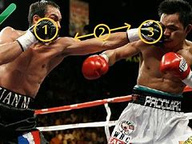

= eco 2020-08-08
:toc:

---

== From unthinkable to universal 普遍的；全体的；全世界的；共同的

(eco 2020-8-8 / United States / Taxing and spending: From unthinkable to universal)

Universal basic income *gains(v.) momentum* 推进力；动力；势头 in America

Paying for it *remains* another matter

Aug 8th 2020 | NEW YORK

- 从不可思议, 到普遍化 +
美国全民基本收入, 增长势头强劲 +
支付费用则是另一回事

COLETTE SMITH and her husband *are* both out of work. They *had exhausted their savings*, when she *received* a one-time $1,000 cash infusion 注入；灌输 *as part of a scheme* run(v.) by Neighbourhood Trust, a financial coaching  （体育运动、工作或技能的）训练，培训，指导 non-profit 不以营利为目的的；非营利的, and Humanity Forward, an organisation *devoted to building support for* universal basic income (UBI) 全民基本收入 *founded 把…基于；把…建立在 by* Andrew Yang. UBI *was* the centrepiece 最重要的项目（或物品）;桌子中央的装饰品 of Mr Yang’s run （尤指在美国）参加竞选 for the Democratic presidential nomination 提名, in which he *advocated* 拥护；支持；提倡 a guaranteed income of $1,000 a month, a “Freedom Dividend 红利；股息；股利”, *as he called it*, for every American adult, *regardless of* their financial circumstances.

- run : v. *~ (for sb/sth) | ~ (in sth)* to be a candidate in an election for a political position, especially in the US （尤指在美国）参加竞选
.. *to run for president* 竞选总统
.. *to run in the election* 参加竞选

- 科莱特·史密斯和她的丈夫都失业了。当他们耗尽了所有积蓄时，她收到了1000美元的一次性现金注入，这是由非营利金融辅导机构"邻里信托"(Neighbourhood Trust)和Humanity Forward运营的一个项目的一部分。后者致力于支持全民基本收入(universal basic income, UBI). 美国华裔民主党候选人杨安泽(Andrew Yang)把UBI作为政治纲领。UBI是杨在竞选民主党总统候选人提名时的核心政策主张，他在竞选中主张，无论经济状况如何，每个美国成年人都有每月1000美元的有保障收入，这是他所谓的“自由红利”。

There are two big hurdles 难关；障碍;（供人或马在赛跑中跨越的）栏架，跨栏 *to introducing* UBI *in* America. One *is building(v.) support(n.) for* something (that sounds, to many, alarmingly 惊人地；让人担忧地 socialist 社会主义者). The other *is working out* 找到…的答案；解决 how to pay for it. Mr Yang’s campaign (有计划的) 活动; 运动 for the Democratic nomination *may have failed*. But [on one of these points] he *has been wildly successful*. A recent Stanford study *showed that* people *are warming(v.) to* 对…更加感兴趣（或热衷） the UBI idea. In April 88% of liberals *backed it*, while support among conservatives  (观点) 保守的;右倾人士 *rose from 28%* before covid-19 *to 45%*. Universal benefits *can be easier* for politicians to sell, because they *are less vulnerable （身体上或感情上）脆弱的，易受…伤害的 to* the racial politics(n.) that *have undermined(v.) support for* welfare spending(n.) in the past.

- *work sth out*
1. to calculate sth 计算；算出
.. *to work out the answer* 计算出答案
2. to find the answer to sth 找到…的答案；解决
SYN solve
.. *to work out a problem* 解决问题
3. to plan or think of sth 计划；思考
.. *I've worked out a new way of doing it*. 我想出了做这事的一个新方法。

- *warm(v.) to/towards sb* : to begin to like sb 开始喜欢上（某人）
.. *I warmed to her* immediately. 我立即喜欢上了她。

- *warm(v.) to/towards sth* : to become more interested in or enthusiastic about sth 对…更加感兴趣（或热衷）
.. The speaker *was now warming to her theme*. 演讲者就她的主题越讲越起劲。

- 在美国推广UBI有两大障碍。其一是为一些在许多人看来令人担忧的社会主义观点建立支持。另一个问题是如何支付。杨的民主党提名竞选可能已经失败。但在其中一点上，他取得了巨大成功。斯坦福大学(Stanford)最近的一项研究表明，人们对UBI的想法越来越感兴趣。今年4月，88%的自由派支持该计划，而保守派的支持率从covid-19之前的28%, 上升到45%。对于政客们来说，全民福利更容易被接受，因为他们不太容易受到种族政治的影响。过去，种族政治削弱了人们对福利支出的支持。

Dreams of a UBI *have a peculiar 怪异的；奇怪的；不寻常的;（某人、某地、某种情况等）特有的，特殊的 history* in America. In 1967 a coalition 联合；结合；联盟 of welfare recipients 受方；接受者, *led by* African-American women, *demanded* “decent income *as a right*”. Martin Luther King *wrote about it* in his final book. At the other end of the political spectrum, Donald Rumsfeld and Dick Cheney *drew up* a guaranteed 肯定的; 保证的 minimum-income proposal 提议；建议；动议 for President Richard Nixon. Milton Friedman and Friedrich Hayek, *beloved(a.)钟爱的；深受喜爱的 of* libertarians 自由论者, *were* enthusiasts 热衷于…的人；热心者；爱好者 too.

- UBI梦, 在美国有一段特殊的历史。1967年，一个由非裔美国妇女领导的福利接受者联盟, 要求将“体面的收入作为一项权利”。马丁·路德·金在他的最后一本书中也提到了这一事件。在政治谱系的另一端，唐纳德·拉姆斯菲尔德和迪克·切尼为理查德·尼克松总统, 起草了一份保证最低收入的提案。深受自由意志主义人士喜爱的米尔顿•弗里德曼(Milton Friedman)和弗里德里希•哈耶克(Friedrich Hayek), 也是UBI思想的热心者。

More recently, UBI *has been taken up* 继续；接下去 by technologists who believe that software will leave a large number of Americans jobless, leading to social unrest. It has also been promoted 促进；推动 by some of the organisations which *make up* 形成；构成;拼装；组成 the Black Lives Matter movement, who *see* it *as* a way to mend(v.) racial disparities(n.)（尤指因不公正对待引起的）不同，不等，差异，悬殊 in wealth.

- disparity :  /dɪˈspærəti/  n. ( formal ) a difference, especially one connected with unfair treatment （尤指因不公正对待引起的）不同，不等，差异，悬殊
.. *the wide disparity* between rich and poor 贫富悬殊
.. *the health disparities* between ethnic and socio-economic groups in the U.S. …美国各种族和社会经济群体之间明显的健康差异。 +

- 最近，UBI思想已经被一些技术专家所接受，他们认为软件的发展将导致大量美国人失业，导致社会动荡。“黑人的命也是命”运动中的一些组织团体, 也在推动这项运动(UBI)，他们认为这是弥补贫富差距的一个方法。

Mr Yang *points out that* the approval rating(n.) for UBI *was only about 25%* when he *began* his presidential run, but by the time (*he ended it*), in February, it was 66%. “The energy 精力；活力；干劲 around `universal basic income` *has skyrocketed*(v.)飞涨；猛涨, and *it’s going to remain elevated*(a.)高的；升高的；高出地面的 until a bill （提交议会讨论的）议案，法案 *passes*,” says Mr Yang, who *believes* the job losses caused by covid-19 *will not quickly be reversed*. In June Jack Dorsey, Twitter’s boss, *gave* Mr Yang’s organisation $5m *to build the case （在审判、讨论等中支持一方的）论据，理由，辩词 for* UBI.

- elevated :  /ˈelɪveɪtɪd/ a.  higher than the area around; above the level of the ground 高的；升高的；高出地面的 / high in rank 高贵的；职位高的 / ( formal ) having a high moral or intellectual level 高尚的；睿智的
.. The house is *in an elevated position*, overlooking the town. 这栋房子地势较高，可以俯瞰全城。
.. *an elevated highway/railway/road* (= one that runs on a bridge above the ground or street) 高架公路╱铁路╱道路 +

- case : n. [可数名词, 常用单数形式] *~ (for/against sth)* :  a set of facts or arguments that support one side in a trial, a discussion, etc. （在审判、讨论等中支持一方的）论据，理由，辩词
.. *the case* for the defence/prosecution
有利于被告 / 原告的论据
.. You will each be given the chance *to state your case* .
你们每人都有机会陈述理由。

- 杨安泽指出，当他开始总统竞选时，UBI的支持率只有25%左右，但当他在2月份结束竞选时，支持率已经达到66%。杨表示:“围绕全民基本收入的热情已经飙升，在该法案通过之前，这种热情还将持续高涨。”他认为，新冠肺炎造成的失业, 不会很快得到扭转。6月，推特的老板杰克·多尔西给了杨安泽的竞选团队500万美元, 来资助他们在竞选主题UBI上的论据建立活动。

Funding(v.) a generous 慷慨的；大方的；慷慨给予的 UBI *has always seemed impossible*. But many seemingly impossible economic policies *have been enacted 通过（法律）;发生；进行；举行 recently*, *opening the door to* wackier 古怪的；滑稽可笑的；疯疯癫癫的(比较级) ideas. Under America’s economic-stimulus plan *to deal with* the fallout 后果；余波; （核爆炸后的）放射性坠尘 from the pandemic, for example, Congress *sent* $1,200 *to* every adult. The scheme *was* [so] generous [that], *combined with* extended unemployment benefits, aggregate(a.) 总数的；总计的 household income *is forecast(v.) to rise* this year.

- wacky : a. /ˈwæki/  => 来自whacky变体，击，打，引申义被打傻的。比较dingbat.

- 资助一个撒钱慷慨的UBI计划, 似乎一直是不可能的。但最近许多看似不可能的经济政策，都出台了, 这为更古怪想法的政策通过, 打开了大门。例如，在美国经济刺激计划中，为了应对疫情的影响，国会给每个成年人发放了1200美元。该计划如此慷慨，再加上失业救济金的延长，预计今年的家庭总收入将会上升。

[In May] more than dozen cities, including Atlanta, Los Angeles, Newark and St Paul, *along with* `the Economic Security Project`, *launched* `Mayors 市长 for a Guaranteed Income`, a network of mayors *experimenting(v.)做实验 with* UBI-like schemes. Mr Dorsey *has also given money to* this group. In February 2019 Stockton, California, *began an 18-month experiment* to give $500 to 125 randomly selected people. This *is being extended for another six months* to help(v.) participants *weather(v.) 经受住，平安地渡过（困难） the slump* 萧条期；衰退.

- Mayors for a Guaranteed income， MGI : 由美国14个城市的市长倡导组织的联邦保障收入的项目

- experiment : v. V-I If you *experiment with* something or *experiment on* it, you do a scientific test on it in order to discover what happens to it in particular conditions. 做实验
.. In 1857 Mendel started *experimenting with peas* in his monastery garden.
1857年孟德尔开始在其修道院菜园里, 用豌豆做实验。

- weather : v. to change, or make sth change, colour or shape because of the effect of the sun, rain or wind （因受风吹、日晒、雨淋等，使）退色，变色，变形 / [ VN ] to come safely through a difficult period or experience 经受住，平安地渡过（困难） +
.. Her face *was weathered(v.) by the sun*. 她的脸晒黑了
.. The company *just managed to weather(v.) the recession*. 这家公司勉强渡过了衰退期。

- slump : v. *~ (by sth) | ~ (from sth) (to sth)* to fall in price, value, number, etc., suddenly and by a large amount （价格、价值、数量等）骤降，猛跌，锐减 / to sit or fall down heavily 重重地坐下（或倒下）  +
/ n. a period when a country's economy or a business is doing very badly 萧条期；衰退
.. Profits *slumped by over 50%*. 利润突降50%以上。

- 今年5月，包括亚特兰大、洛杉矶、纽瓦克和圣保罗在内的十多个城市，与the Economic Security Project(经济安全项目)一起启动了Mayors for a Guaranteed Income(市长发起的"有保障收入项目")，这是一个由市长组织加入的网络，用以试验类似于UBI的保障方案。Dorsey也向该组织提供了资金。2019年2月，加利福尼亚州的斯托克顿市开始了一项为期18个月的实验，向随机挑选的125人, 赠送500美元。该计划将再延长6个月，以帮助参与者度过经济低迷期。

In Jackson, Mississippi, the Magnolia 木兰；木兰树 Mothers’ Trust *provides* poor African-American mothers *with $1,000 in cash monthly*, *no strings 特定条件（或限制） attached*, for a year. It recently *began a larger experiment* with 75 more participants. Hudson, a small city in upstate  在（或向）州的乡野地区（尤指北部） New York, recently *announced* a five-year scheme *to give* a monthly $500 payment *to* 20 people. In Newark, New Jersey, Ras Baraka, the mayor, *is hoping to get a pilot(a.)试验性的；试点的 programme up and running*. A third of Newark’s residents *live(v.) in poverty* and *have to make tough decisions*, Mr Baraka says, like “heat or eat.” Nearly 60% of Newark households *carry delinquent(a.)拖欠债务的；欠债未还的 debt*. But *to introduce* 引进;推行；实施；采用 a proper UBI *in* Newark, he says, *would require* federal funding.

- magnolia : mag·no·lia /mæɡˈnoʊliə/ [ C ] a tree with large white, pink or purple flowers that smell sweet 木兰；木兰树 / [ U ] ( BrE ) a very pale cream colour 浅乳白色；浅桃红色 +
=> 来自17世纪法国园艺学家Pierre Magnol,以表达对他的敬意。 +

- upstate : ad. ( US ) in or to a part of a state that is far from its main cities, especially a northern part 在（或向）州的乡野地区（尤指北部）

- pilot : a. [ only before noun ] done on a small scale in order to see if sth is successful enough to do on a large scale 试验性的；试点的 / n. 飞行员；（飞行器）驾驶员
.. *a pilot project*/study/survey 试验性项目╱研究╱调查
.. *a pilot episode* (= of a radio or television series) 系列节目试播的一集

- delinquent : /dɪˈlɪŋkwənt/  a.
1. ( finance 财 ) ( NAmE ) having failed to pay money that is owed 拖欠债务的；欠债未还的
.. *a delinquent borrower* 欠债未还的借款人
2. ( finance 财 ) ( NAmE ) ( of a sum of money 款项 ) not having been paid in time 到期未付的
.. *a delinquent loan* 逾期未还的贷款
3. ( especially of young people or their behaviour 尤指青年人或其行为 ) showing a tendency to commit crimes 有违法倾向的 +
=> de-, 向下，离开。-linqu, 留下，遗弃，词源同leave, relinquish. 即被遗弃的人，缺乏管教的人，后主要指少年犯，不良青少年。 +

- 在密西西比州的杰克逊市，木兰花母亲信托基金(Magnolia Mothers’s Trust), 每年都会向贫穷的非洲裔美国母亲, 每月提供1000美元现金，没有任何附加条件。它最近开始了一项更大的实验，有75名参与者。纽约北部的小城哈德逊, 最近宣布了一项为期五年的计划，每月为20个人, 提供500美元的补助。在新泽西州的纽瓦克市，市长拉斯•巴拉卡(Ras Baraka)希望启动, 并实施一个试点项目。巴拉卡说，纽瓦克三分之一的居民生活贫困，不得不做出艰难的决定，比如“温还是饱”。纽瓦克有近60%的家庭拖欠债务。但是他说，在纽瓦克引进一个适合的UBI政策, 需要联邦资金支持。

For all the enthusiasm 热情；热心；热忱 about UBI experiments, they *remain problematic* 造成困难的；产生问题的. *It is hard to fully evaluate(v.)估计；评价；评估 their effect* because *they are not universal* (in the sense 意义；含义；理解…的方式；看待…的角度 of *received by everyone*). Most *take the form of* occasional cash payments to poorer Americans. Nor are they *generous 丰富的；充足的；大的 enough to live on* 继续活着, which *is* what `主` true UBI believers(n.) `谓` *advocate* 拥护；支持；提倡. Finally, because they *tend to be funded by philanthropy* 博爱；慈善；乐善好施,慈善事业, the experiments *do not factor(v.)把…因素包括进去 in* the substantial 大量的；价值巨大的；重大的 tax rises(n.) *that would be needed to pay for them*.

- philanthropy : phil·an·thropy n.  /fɪˈlænθrəpi/  [ U ] the practice of helping the poor and those in need, especially by giving money 博爱；慈善；乐善好施 +
=>  -phil-爱 + -anthrop-人类 + -y名词词尾

- *factor(v.) sth in | factor(v.) sth into sth*: ( technical 术语 ) to include a particular fact or situation when you are thinking about or planning sth 把…因素包括进去
.. Remember *to factor(v.) in* staffing costs when you are planning the project. 规划该项目时，记住要把雇人费用这个因素考虑进去。

- 尽管人们对UBI的实验性项目充满热情，但它们仍然存在问题。首先, 很难全面评估它们的效果，因为UBI的施行并不不普遍(如果从每个人都收到了其款项的意义上来看)。大多数方案采用的形式, 只是偶尔派发现金给穷人。其次, 这些资金的数量也没有大到能使穷人靠此活下去，而这个是真正的UBI信徒们所提倡的。最后，由于这些UBI实验的资金来源, 往往是靠慈善事业来资助的，所以这些实验也没有考虑到, UBI要想保持充足的资金来源, 就需要大幅增税。

`主` The proposal (Mr Yang *ran on* 以…为主题（或中心）；围绕) `谓` *would have cost $2.8trn annually* 一年一次地, *which is about* what the federal government *spends [each year] on* Social Security (pensions), Medicare 医疗保障制度，老年保健医疗制度（美国政府向65岁以上的人提供的医疗保险） (health care for the elderly) and Medicaid 医疗补助制度（美国政府向贫困者提供的医疗保险） (health care for the poor) *combined*. Even then *it would provide* adults *with* no more than $12,000 a year -- not enough *to lift* （被）提起，举起，抬高，吊起 a workless family with two adults and two children *above* the federal poverty line.

- *run(v.) on sth* : [无被动态] if your thoughts, a discussion, etc. run on a subject, you think or talk a lot about that subject 以…为主题（或中心）；围绕

- 杨安泽提出的提案, 每年将花费2.8万亿美元，相当于联邦政府每年在社会保障(养老金)、医疗保险(老年人的医疗保健)和医疗补助(穷人的医疗保健)上的支出之和。即便如此，它也只能为成年人提供不超过1.2万美元的年收入——不足以让一个有两个成年人和两个孩子的无工作家庭, 摆脱联邦贫困线。

`主` A more targeted effort (that *did not aim to* be universal) `谓` *could do much more on* that score. Ms Smith, *along with* 1,000 other residents of the Bronx 地区名, *received* a one-off 一次性的；非经常的 $1,000 grant （政府、机构的）拨款 *from* Mr Yang’s outfit 团队；小组；分队. This *allowed* her *to buy food* and *to restore the internet*, which her 14-year-old son *needed* for remote learning. This *helped a great deal*. But UBI advocates(n.)拥护者；支持者；提倡者 *still have to explain* why it *would not be better* to give families (such as hers) larger sums *rather than* a smaller payment (that also goes to those who do not need it).

- 在这方面，更具针对性的, 不以普遍性为目标的努力, 可以发挥更大的作用。史密斯女士和布朗克斯区其他1000名居民, 从杨安泽团队那里获得了一次性的1000美元补助。这使她能够购买食物，并恢复她14岁的儿子进行远程学习所需的互联网。这帮了大忙。但UBI的支持者仍然需要解释，为什么给像Smith这样的家庭以更多的补贴，而不是给那些不需要钱的家庭更少的补贴, 不是个好主意。

---

== From unthinkable to universal

Universal basic income gains momentum in America

Paying for it remains another matter

Aug 8th 2020 | NEW YORK

COLETTE SMITH and her husband are both out of work. They had exhausted their savings, when she received a one-time $1,000 cash infusion as part of a scheme run by Neighbourhood Trust, a financial coaching non-profit, and Humanity Forward, an organisation devoted to building support for universal basic income (UBI) founded by Andrew Yang. UBI was the centrepiece of Mr Yang’s run for the Democratic presidential nomination, in which he advocated a guaranteed income of $1,000 a month, a “Freedom Dividend”, as he called it, for every American adult, regardless of their financial circumstances.

There are two big hurdles to introducing UBI in America. One is building support for something that sounds, to many, alarmingly socialist. The other is working out how to pay for it. Mr Yang’s campaign for the Democratic nomination may have failed. But on one of these points he has been wildly successful. A recent Stanford study showed that people are warming to the UBI idea. In April 88% of liberals backed it, while support among conservatives rose from 28% before covid-19 to 45%. Universal benefits can be easier for politicians to sell, because they are less vulnerable to the racial politics that have undermined support for welfare spending in the past.

Dreams of a UBI have a peculiar history in America. In 1967 a coalition of welfare recipients, led by African-American women, demanded “decent income as a right”. Martin Luther King wrote about it in his final book. At the other end of the political spectrum, Donald Rumsfeld and Dick Cheney drew up a guaranteed minimum-income proposal for President Richard Nixon. Milton Friedman and Friedrich Hayek, beloved of libertarians, were enthusiasts too.

More recently, UBI has been taken up by technologists who believe that software will leave a large number of Americans jobless, leading to social unrest. It has also been promoted by some of the organisations which make up the Black Lives Matter movement, who see it as a way to mend racial disparities in wealth.

Mr Yang points out that the approval rating for UBI was only about 25% when he began his presidential run, but by the time he ended it, in February, it was 66%. “The energy around universal basic income has skyrocketed, and it’s going to remain elevated until a bill passes,” says Mr Yang, who believes the job losses caused by covid-19 will not quickly be reversed. In June Jack Dorsey, Twitter’s boss, gave Mr Yang’s organisation $5m to build the case for UBI.

Funding a generous UBI has always seemed impossible. But many seemingly impossible economic policies have been enacted recently, opening the door to wackier ideas. Under America’s economic-stimulus plan to deal with the fallout from the pandemic, for example, Congress sent $1,200 to every adult. The scheme was so generous that, combined with extended unemployment benefits, aggregate household income is forecast to rise this year.

In May more than dozen cities, including Atlanta, Los Angeles, Newark and St Paul, along with the Economic Security Project, launched Mayors for a Guaranteed Income, a network of mayors experimenting with UBI-like schemes. Mr Dorsey has also given money to this group. In February 2019 Stockton, California, began an 18-month experiment to give $500 to 125 randomly selected people. This is being extended for another six months to help participants weather the slump.

In Jackson, Mississippi, the Magnolia Mothers’ Trust provides poor African-American mothers with $1,000 in cash monthly, no strings attached, for a year. It recently began a larger experiment with 75 more participants. Hudson, a small city in upstate New York, recently announced a five-year scheme to give a monthly $500 payment to 20 people. In Newark, New Jersey, Ras Baraka, the mayor, is hoping to get a pilot programme up and running. A third of Newark’s residents live in poverty and have to make tough decisions, Mr Baraka says, like “heat or eat.” Nearly 60% of Newark households carry delinquent debt. But to introduce a proper UBI in Newark, he says, would require federal funding.

For all the enthusiasm about UBI experiments, they remain problematic. It is hard to fully evaluate their effect because they are not universal (in the sense of received by everyone). Most take the form of occasional cash payments to poorer Americans. Nor are they generous enough to live on, which is what true UBI believers advocate. Finally, because they tend to be funded by philanthropy, the experiments do not factor in the substantial tax rises that would be needed to pay for them.

The proposal Mr Yang ran on would have cost $2.8trn annually, which is about what the federal government spends each year on Social Security (pensions), Medicare (health care for the elderly) and Medicaid (health care for the poor) combined. Even then it would provide adults with no more than $12,000 a year—not enough to lift a workless family with two adults and two children above the federal poverty line.

A more targeted effort that did not aim to be universal could do much more on that score. Ms Smith, along with 1,000 other residents of the Bronx, received a one-off $1,000 grant from Mr Yang’s outfit. This allowed her to buy food and to restore the internet, which her 14-year-old son needed for remote learning. This helped a great deal. But UBI advocates still have to explain why it would not be better to give families such as hers larger sums rather than a smaller payment that also goes to those who do not need it.

---

== Jab 注射；接种；预防针 economics 词汇解说

(eco 2020-8-8 / Finance & economics / Vaccine economics: More hard questions)

Hard questions [as scientists and governments *seek* covid-19 vaccines]

They *must work out* how much to invest, and how best *to distribute the goods*

Aug 8th 2020 |

- jab : n.v. a sudden strong hit with sth pointed or with a fist (= a tightly closed hand) 戳；刺；捅；用拳猛击 / n. ( BrE informal ) an injection to help prevent you from catching a disease 注射；接种；预防针
.. *a flu jab* 流感预防针 +

- 注射经济学 +
在科学家和各国政府寻求covid-19疫苗之际，这是一个棘手的问题 +
他们必须计算出要投资多少，以及如何最好地分配疫苗商品

*SLOWLY BUT surely* the economic costs of the covid-19 pandemic *are becoming clear*. On July 30th America’s statisticians *revealed that* the economy *shrank by 9.5%*, year on year, in the second quarter. Output in the euro zone *fell even further*. Even South Korea, which *has managed* the virus *better than* almost any other country, *has not escaped(v.) a deep recession*.

- covid-19疫情的经济上代价, 正在慢慢地且肯定地显现出来。7月30日，美国统计学家公布, 第二季度经济同比萎缩9.5%。欧元区的产出跌幅更大。即使是比其他几乎任何国家, 都要更好地控制了病毒的韩国，也未能逃脱严重的经济衰退。

A vaccine *would help* end(v.) the economic chaos. Scientists and pharmaceutical 制药的；配药的；卖药的 companies *have stepped up 走上前去 to the task*. More than 150 vaccines *are being developed worldwide*, with six in final, large-scale clinical trials. It *took* the vaccination 接种疫苗；种痘 effort (against hepatitis 肝炎 B) -- the disease (*for which* the most candidate vaccines 候选疫苗 *were developed*) -- decades *to make the progress* (that `主` the attempts against covid-19 `谓` *have made in months*). The public-health and economic costs of the pandemic *are* such that, even as scientists *beaver(v.) away* 忙于（某事）；勤奋工作, policymakers *must grapple with two questions*: how much *to spend on* vaccines, *in order to ensure* enough are made(v.), and *how to ensure* they are distributed(v.) fairly.

- hepatitis : hepa·titis n.   /ˌhepəˈtaɪtɪs/
[ U ] a serious disease of the liver . There are three main forms: hepatitis A (the least serious, caused by infected food), hepatitis B and hepatitis C (both very serious and caused by infected blood). 肝炎 +
=> 肝炎是肝脏炎症的统称。通常是指由多种致病因素--如病毒、细菌、寄生虫、化学毒物、药物、酒精、自身免疫因素等使肝脏细胞受到破坏，肝脏的功能受到损害，引起身体一系列不适症状，以及肝功能指标的异常。

- beaver : 河狸，海狸（水栖啮齿动物，加拿大的象征） +
*beaver away (at sth)* : ( informal ) to work very hard at sth 忙于（某事）；勤奋工作

- 疫苗将有助于结束经济混乱。科学家和制药公司已经开始着手这项工作。全世界正在开发150多种疫苗，其中6种进入了最后的大规模临床试验。针对乙型肝炎的疫苗接种工作进行了几十年，才取得了抗击covid-19的努力几个月来就取得的进展。大多数候选疫苗都是针对乙型肝炎开发的。疫情的公共卫生和经济成本是如此之高，以至于在科学家努力工作的同时，决策者也必须努力解决两个问题: 为了确保生产足够的疫苗，需要在疫苗上花多少钱? 以及如何确保疫苗得到公平分配?

Governments [so far 迄今为止,到目前为止] *have invested more than $10bn in* covid-19 vaccines, and *made forward purchases of* about 4bn doses (though data on deals *are murky* 昏暗的；阴暗的；朦胧的). As the vaccines *may require* a course （医疗、服药等的）疗程 of two doses, [in theory] this amount *could inoculate*(v.)(给…)接种，打预防针 the world’s most vulnerable people. In fact, effectiveness *is far from assured*, so a large share of purchases *could turn out to be duds*(n.)不中用的东西；废物. A typical vaccine in final trials *has a 20% chance of failure*. Some of the candidate covid-19 vaccines *involve* novel technologies, so the risk of failure *could be higher*. That *explains* why rich countries *are backing(v.) several efforts*, with deals *being signed* every few days (see chart 1).

- murky : a. /ˈmɜːki/ (空气、光等)昏暗的；阴暗的；朦胧的; /(人的行为或性格)隐晦的；含糊的；暧昧可疑的 +
=> 来自murk,昏暗。即昏暗的，引申词义暧昧的。

- course :  *~ (of sth)* a series of medical treatments, pills, etc. （医疗、服药等的）疗程
.. to prescribe *a course of antibiotics* 开一个疗程抗生素的处方

- inoculate :  /ɪˈnɑːkjuleɪt/ [ VN ] *~ sb (against sth)* to protect a person or an animal from catching a particular disease by injecting them with a mild form of the disease （给…）接种，打预防针 +
=> in-,进入，使，-oc,眼，词源同eye,ocular.比喻用法，由眼引申词义针眼，打针。

- dud :  /dʌd/ [ C ] ( informal ) a thing that is useless, especially because it does not work correctly 不中用的东西；废物 / duds [ pl. ] ( slang ) clothes 衣裳  +
/ a. [ only before noun ] useless; that does not work correctly 无用的；不中用的；出故障的 +
=> 俚语，原义为破布。引申词义废物，哑弹，不中用的等诸多词义。 +
.. Two of the fireworks in the box *were duds*(n.). 盒子里的烟火有两个是点不着的废品。

- 迄今为止，各国政府已在covid-19疫苗上投资逾100亿美元，并预先购买了约40亿剂疫苗(尽管交易数据不明)。由于疫苗的疗程可能需要两剂，理论上，虽然这个数量可以将世界上最易被感染的人都接种完, 但事实上，效果还远不能保证，所以很大一部分购买的疫苗可能会是没用的。因为一种典型的疫苗, 在最后的试验中, 有20%的几率失败。而且一些候选covid-19疫苗, 采用了新技术，因此失败的风险就可能更高。这就解释了为什么富裕的国家会支持多项疫苗研发进程，购买协议每隔几天就会重新与别的开发商签署一次(见表1)。

Despite the scramble in America and Europe to get to the front of the queue, countries elsewhere are likely to be under-supplied, and for some time. Japan has arranged to buy enough for just one dose per person, according to Goldman Sachs, a bank (see chart 2). On average, emerging markets have secured enough to cover less than a third of their citizens.

GAVI, an alliance that funds vaccines for poor countries, has set up COVAX, a purchasing pool for several late-stage vaccine candidates. It promises participants doses of an effective vaccine for up to 20% of their population by the end of 2021, with rich countries paying for their supplies and funding a kitty for poor ones. About 80 high- and middle-income countries have said they want to join. But it remains to be seen how many put money on the table: they must pay for the first 15% of their vaccines by the end of the month.

Even meeting the commitments they have already made will be a stretch for pharma companies, much less producing enough for the world. Existing manufacturing facilities can be repurposed for some types of jabs. For others, however, new ones must be built. These can cost about half a billion dollars apiece, and typically take three years to get up and running.

A company normally sets up production once a vaccine wins regulatory approval. But these are not normal times. To speed things up, some firms have started mass-producing vaccines that are still in clinical trials. Companies may have promised 4bn doses, but some of their vaccines may not pass trials and will have to be poured away. Many experts think supply will also be constrained by global shortages of things like vials and syringes. They put a more realistic estimate of global supply by the end of next year at nearer 2bn.

As that is nowhere near enough to cover the world, it is easy to imagine fights breaking out once effective vaccines become available. The experience of past pandemics is hardly encouraging on this front. During the H1N1 (swine flu) pandemic in 2009-10 rich countries cornered supplies of the vaccine to fight the disease. Only when they had more than they needed did they offer some of it to poor countries. By then, the disease had swept across the planet and the pandemic was over.

Early in the covid-19 pandemic, too, global co-operation quickly broke down. By late April, 80 jurisdictions had restricted exports, with governments especially keen to hoard supplies of disinfectants, personal protective equipment and thermometers. Some countries even seized shipments passing through their territory.

Fearful of a repeat of such marauding, the Coalition for Epidemic Preparedness Innovations, an alliance of charities and governments that has funded the early development of some of the most promising covid-19 vaccines, has organised manufacturing on several continents. So have some pharma companies.

The World Health Organisation (WHO) is also trying to avert vaccine politics. It has drawn up guidelines for how early supplies should be distributed in order to save the most lives, protect fragile health systems and hasten the end of the pandemic. The first doses would go to health and social-care workers, and the next batch to the 20% of people in each country who are most likely to die from covid-19 if infected. The rest would then go to places with the highest risk of outbreaks. COVAX has signed up to these principles, but there is no indication that countries would respect them in their bilateral deals with drug companies, rather than act in narrow self-interest.

There are slim hopes that America, China or Russia, among others, will allow exports of a vaccine made on their territory before enough is available for all of their citizens. But vaccine manufacturing and distribution involves a complicated global supply chain of raw ingredients, adjuvants (chemicals commonly used to boost potency), vials and so on. In the worst case, countries denied a share of the vaccines could ban exports of such inputs to the hoarding country. Everyone loses.

A global free-for-all, then, seems inevitable. One way to mitigate this would be to spend more. Some economists argue that governments could do more to hurry along vaccine manufacture and distribution. Separate groups of researchers reckon that the world needs to invest around $100bn in order to make several vaccines early and in sufficient quantities. That would be a ten-fold increase in what has been spent. But set against the output lost and the $7trn in stimulus injected into the global economy so far, it is peanuts.

---

== Jab economics

Hard questions as scientists and governments seek covid-19 vaccines

They must work out how much to invest, and how best to distribute the goods

Aug 8th 2020 |

Editor’s note: Some of our covid-19 coverage is free for readers of The Economist Today, our daily newsletter. For more stories and our pandemic tracker, see our hub

SLOWLY BUT surely the economic costs of the covid-19 pandemic are becoming clear. On July 30th America’s statisticians revealed that the economy shrank by 9.5%, year on year, in the second quarter. Output in the euro zone fell even further. Even South Korea, which has managed the virus better than almost any other country, has not escaped a deep recession.

A vaccine would help end the economic chaos. Scientists and pharmaceutical companies have stepped up to the task. More than 150 vaccines are being developed worldwide, with six in final, large-scale clinical trials. It took the vaccination effort against hepatitis B—the disease for which the most candidate vaccines were developed—decades to make the progress that the attempts against covid-19 have made in months. The public-health and economic costs of the pandemic are such that, even as scientists beaver away, policymakers must grapple with two questions: how much to spend on vaccines, in order to ensure enough are made, and how to ensure they are distributed fairly.

Governments so far have invested more than $10bn in covid-19 vaccines, and made forward purchases of about 4bn doses (though data on deals are murky). As the vaccines may require a course of two doses, in theory this amount could inoculate the world’s most vulnerable people. In fact, effectiveness is far from assured, so a large share of purchases could turn out to be duds. A typical vaccine in final trials has a 20% chance of failure. Some of the candidate covid-19 vaccines involve novel technologies, so the risk of failure could be higher. That explains why rich countries are backing several efforts, with deals being signed every few days (see chart 1).

Despite the scramble in America and Europe to get to the front of the queue, countries elsewhere are likely to be under-supplied, and for some time. Japan has arranged to buy enough for just one dose per person, according to Goldman Sachs, a bank (see chart 2). On average, emerging markets have secured enough to cover less than a third of their citizens.

GAVI, an alliance that funds vaccines for poor countries, has set up COVAX, a purchasing pool for several late-stage vaccine candidates. It promises participants doses of an effective vaccine for up to 20% of their population by the end of 2021, with rich countries paying for their supplies and funding a kitty for poor ones. About 80 high- and middle-income countries have said they want to join. But it remains to be seen how many put money on the table: they must pay for the first 15% of their vaccines by the end of the month.

Even meeting the commitments they have already made will be a stretch for pharma companies, much less producing enough for the world. Existing manufacturing facilities can be repurposed for some types of jabs. For others, however, new ones must be built. These can cost about half a billion dollars apiece, and typically take three years to get up and running.

A company normally sets up production once a vaccine wins regulatory approval. But these are not normal times. To speed things up, some firms have started mass-producing vaccines that are still in clinical trials. Companies may have promised 4bn doses, but some of their vaccines may not pass trials and will have to be poured away. Many experts think supply will also be constrained by global shortages of things like vials and syringes. They put a more realistic estimate of global supply by the end of next year at nearer 2bn.

As that is nowhere near enough to cover the world, it is easy to imagine fights breaking out once effective vaccines become available. The experience of past pandemics is hardly encouraging on this front. During the H1N1 (swine flu) pandemic in 2009-10 rich countries cornered supplies of the vaccine to fight the disease. Only when they had more than they needed did they offer some of it to poor countries. By then, the disease had swept across the planet and the pandemic was over.

Early in the covid-19 pandemic, too, global co-operation quickly broke down. By late April, 80 jurisdictions had restricted exports, with governments especially keen to hoard supplies of disinfectants, personal protective equipment and thermometers. Some countries even seized shipments passing through their territory.

Fearful of a repeat of such marauding, the Coalition for Epidemic Preparedness Innovations, an alliance of charities and governments that has funded the early development of some of the most promising covid-19 vaccines, has organised manufacturing on several continents. So have some pharma companies.

The World Health Organisation (WHO) is also trying to avert vaccine politics. It has drawn up guidelines for how early supplies should be distributed in order to save the most lives, protect fragile health systems and hasten the end of the pandemic. The first doses would go to health and social-care workers, and the next batch to the 20% of people in each country who are most likely to die from covid-19 if infected. The rest would then go to places with the highest risk of outbreaks. COVAX has signed up to these principles, but there is no indication that countries would respect them in their bilateral deals with drug companies, rather than act in narrow self-interest.

There are slim hopes that America, China or Russia, among others, will allow exports of a vaccine made on their territory before enough is available for all of their citizens. But vaccine manufacturing and distribution involves a complicated global supply chain of raw ingredients, adjuvants (chemicals commonly used to boost potency), vials and so on. In the worst case, countries denied a share of the vaccines could ban exports of such inputs to the hoarding country. Everyone loses.

A global free-for-all, then, seems inevitable. One way to mitigate this would be to spend more. Some economists argue that governments could do more to hurry along vaccine manufacture and distribution. Separate groups of researchers reckon that the world needs to invest around $100bn in order to make several vaccines early and in sufficient quantities. That would be a ten-fold increase in what has been spent. But set against the output lost and the $7trn in stimulus injected into the global economy so far, it is peanuts.

尽管在美国和欧洲抢在队伍的前面，其他国家很可能供应不足，并且在一段时间内。根据高盛(Goldman Sachs)银行的数据，日本已经安排购买了足够每人一剂的剂量(见表2)。平均而言，新兴市场已经购买了足够覆盖不到三分之一国民的剂量。
全球疫苗和免疫联盟是一个为贫穷国家资助疫苗的联盟，它已经建立了COVAX，一个购买几种晚期候选疫苗的储备库。该组织承诺，到2021年底，发达国家将为其20%的人口提供有效疫苗，并为贫困国家提供资金。约有80个高收入和中等收入国家表示希望加入。但有多少人愿意出钱还有待观察:他们必须在月底前支付疫苗的前15%。
即使是兑现它们已经做出的承诺，对制药公司来说也将是一项艰巨的任务，它们的产量远远不能满足世界需求。现有的生产设备可以用于某些类型的注射。然而，对其他国家来说，必须建立新的体系。每个反应堆的造价约为5亿美元，通常需要3年的时间来启动和运行。
一旦疫苗获得监管部门的批准，公司通常就会开始生产。但现在不是正常时期。为了加快生产速度，一些公司已经开始大规模生产仍在临床试验阶段的疫苗。制药公司可能承诺提供40亿剂疫苗，但它们的一些疫苗可能无法通过试验，将不得不投入使用。许多专家认为，小瓶和注射器等物品的全球短缺也将限制供应。他们对明年年底全球供应的更现实估计是近20亿。

在这方面，过去大流行病的经验很难令人鼓舞。在2009-10年H1N1(猪流感)大流行期间，富裕国家垄断了疫苗的供应以对抗疾病。只有当他们拥有的超过了他们的需要时，他们才会提供一些给贫穷国家。那时，这种疾病已经席卷了整个星球，大流行也结束了。
世界卫生组织(WHO)也在试图避免疫苗政治。它已经起草了关于如何分配早期供应的指导方针，以拯救大多数生命，保护脆弱的卫生系统和加速结束大流行病。第一批疫苗将发放给卫生和社会保健工作者，下一批将发放给每个国家20%最有可能死于covid-19的人群。剩下的将前往爆发风险最高的地方。COVAX已经签署了这些原则，但没有迹象表明各国会在与制药公司的双边协议中尊重这些原则，而不是出于狭隘的私利行事。
美国、中国和俄罗斯等国在本国公民获得足够的疫苗之前允许本国生产的疫苗出口，希望渺茫。但是疫苗的生产和销售涉及到一个复杂的全球供应链，包括原材料、佐剂(通常用于提高效力的化学物质)、小瓶等等。在最坏的情况下，被剥夺疫苗份额的国家可能会禁止向囤积疫苗的国家出口此类投入物。每个人都失去了。
因此，一场全球混战似乎是不可避免的。缓解这种情况的一个方法是增加支出。一些经济学家认为，政府可以采取更多措施加快疫苗的生产和分销。不同的研究小组估计，世界需要投资大约1000亿美元，才能及早和充足地生产几种疫苗。这将是支出的10倍增长。但与产出损失和迄今向全球经济注入的7万亿美元刺激资金相比，这只是九牛一毛。
