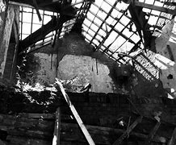
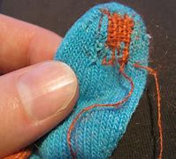

= eco 2020-08-15
:toc:

---

== Facing(v.) the world, blindfolded(v.) 用布蒙住眼睛

(eco 2020-8-15 / International / America’s State Department: The dereliction of diplomacy)

The dereliction 荒废；弃置；破旧不堪;玩忽职守；渎职 of American diplomacy(n.)外交；外交技巧；外交手腕

Donald Trump *dismisses* 不予考虑；摒弃；对…不屑一提 it *as* the “Deep State Department”. Yet America needs it more than ever

Aug 13th 2020 |

- dereliction : /ˌderəˈlɪkʃn/ +
=> dē- + re- + linquō ‎(“I leave”). +

- Deep State Department : 常见西方政论文中一词the Deep State，源于土耳其，或译为国中之国。其意指国家中少数精英在很大程度上依靠隐蔽方式以暴力和其它压力手段来操纵政治和经济，在貌似民 主的政治框架下确保特殊利益集团的利益得到满足。

THE AMERICAN embassy *escaped the blast* in Beirut’s port unscathed(a.)未受伤害；未受伤. Many Western countries *either* have missions 使团；代表团 in the city centre *or* diplomats 外交官 who live in the area. The wife of the Dutch ambassador was killed, as was a German diplomat. But America’s embassy sits in the mountain village of Awkar, five miles (8km) from the port. Security measures 安全措施 are onerous(a.)费力的；艰巨的；令人焦虑的, a hangover 遗留的感觉；沿袭下来的风俗（或思想等） from the bombing of the American embassy in Beirut in 1983, which killed 63 people. It took a week before the ambassador, Dorothy Shea, a career diplomat 职业外交官, toured 在…旅游；在…巡回演出（或做宣传广告等） the port. The embassy has been short-staffed(a.)人员配备不足；人手短缺 for much of the year because of covid-19. Even on social media it has been far quieter 更安静的 than other foreign powers. The ambassador has kept a low profile(印象；形象; 外形；轮廓)不惹人注目.

- onerous  : /ˈoʊnərəs,ˈɑːnərəs/ a. ( formal ) needing great effort; causing trouble or worry 费力的；艰巨的；令人焦虑的 +
=> 来自拉丁语onus的所有格oneris,负担，重担，词源同onus.引申词义费力的，艰巨的。 +

- hangover : n.  宿醉（过量喝酒后第二天的头痛以及恶心反应） / [ usually sing. ] *~ (from sth)* a feeling, custom, idea, etc. that remains from the past, although it is no longer practical or suitable 遗留的感觉；沿袭下来的风俗（或思想等）
.. *hangover(n.) laws* from the previous administration 从上届政府沿袭下来的法律

- *a high/low profile* : the amount of attention sb/sth has from the public 惹人╱不惹人注目；高╱低姿态

The low visibility 可见性；可见度 is a small sign of a wider malaise （广泛存在的）难以捉摸的问题，无法描述的问题 in American diplomacy. The country’s foreign service is damaged and demoralised 使泄气；使意志消沉；使士气低落. Last month Bob Menendez, the senior Democrat on the Senate Foreign Relations Committee 参议院外交关系委员会, *released a report* warning that the State Department was “at risk of catastrophic 灾难性的 failure”. The report is a catalogue  一连串 (尤指不幸的事);目录 of the damage *done to* America’s oldest federal agency, founded in 1789. It describes a department *haemorrhaging*(v.)内出血 talent 有才能的人；人才；天才 and influence 支配力；控制力；影响力. The litany （对一系列事件、原因等）枯燥冗长的陈述 of woes 麻烦；问题；困难;痛苦；苦恼；悲伤；悲哀 *is summed up* 总结；概括 in a leaked recording of a briefing on Washington last November by Colombia’s ambassador there, Francisco Santos, *to* his incoming foreign minister: “The US State Department 国务院, which used to be important, is destroyed, it doesn’t exist.”

- malaise :  /məˈleɪz/ n. the problems affecting a particular situation or group of people that are difficult to explain or identify （广泛存在的）难以捉摸的问题，无法描述的问题 / a general feeling of being ill/sick, unhappy or not satisfied, without signs of any particular problem 莫名的不适（或不快、不满等） +
=> 前缀mal-常表示负面含义，来自拉丁语malus“坏的”，所以我直接归为否定前缀，如malady（疾病），malaria（疟疾）；词根aise和单词ease（安逸）同源，来自同一个古法语单词；它的字面义为“不安逸，不舒服”，所以表“身体不适”。 +

- demoralize : /dɪˈmɔːrəlaɪz/ => de-, 不，非，使相反。moral, 道义，士气。即使士气低落。

- hemorrhage :  /ˈhemərɪdʒ/ n. v. A haemorrhage is serious bleeding inside a person's body. 严重内出血

- litany : /ˈlɪtəni/ n.  +
1. a series of prayers to God for use in church services, spoken by a priest, etc., with set responses by the people 连祷文，总祷文（连祷启应的祷文）
2. *~ (of sth)* ( formal ) a long boring account of a series of events, reasons, etc. （对一系列事件、原因等）枯燥冗长的陈述 +
=> 来自拉丁语litania,来自希腊语lite,祈祷，恳求。引申词义连祷文。 +

- State Department : 美国国务院. 美国国务院是美国 *主管外交, 并兼管部分内政事务的行政部门，* 直属美国政府管理的外事机构，*在政府各部中居首席地位。其行政负责人为国务卿(Secretary)。* +
*国务卿，由总统任命（经参议院同意）并对总统负责，是仅次于正、副总统的高级行政官员。* +
美国国务院的具体职责是, 主管美国在全世界的大使和领事馆, 以及涉外官员的工作，协助总统同外国签订条约和协定，安排总统接见外国使节，就承认新国家或新政府向总统提供意见，掌管美国国印等。

Hand-wringing 绝望 over `the state of State` 国家的现状 is hardly new. More than two dozen government agencies *now have people overseas* 在国外；向海外, *eroding* the State Department’s primacy 首要；至高无上. Nowadays, the boss of a global American company *may have a one-on-one  一对一;一对一的 with a `head of state`* 国家首脑 without *going through the embassy*, notes Stuart Holliday of Meridian, a centre for diplomacy in Washington, DC: “*There’s been a recognition 认出；认识；识别; 承认；认可 that* the diplomatic channel is not the channel (*through which* all American engagement （尤指正式的或与工作有关的）约定，约会，预约 *happens*).” In 2015, well before Donald Trump became president, the American Academy of Diplomacy, a club of senior ex-diplomats, warned that the country’s foreign service was in trouble because of its increasing politicisation 政治化, poor professional education and outdated career structure.

- 对国家状况的担忧并不是什么新鲜事。现在有二十多个政府机构在海外派驻人员，削弱了国务院的首要地位。位于华盛顿特区的外交中心Meridian的斯图尔特·霍利迪(Stuart Holliday)指出，如今，一家全球性美国公司的老板可能不需要通过大使馆就可以与国家元首进行一对一的接触：“人们已经认识到，外交渠道并不是美国所有接触发生的渠道。”2015年，早在唐纳德·特朗普(Donald Trump)就任总统之前，由高级前外交官组成的俱乐部美国外交学院(American Academy Of Diplomacy)警告称，由于日益政治化、糟糕的专业教育和过时的职业结构，美国的外交服务陷入了困境。

Mr Trump has tried to cut the department’s budget, most recently by 34%. Congress ignored 忽视；对…不予理会 him. But deep cuts came in the mid-1990s after the end of the cold war, when America thought it could *scale back*  缩减(活动、范围、数量等的等级) diplomacy -- resulting in problems [when the government found itself needing to deploy(v.)有效地利用；调动; 部署，调度（军队或武器）extra diplomats to Afghanistan and Iraq]. More belt-tightening 紧缩开支 followed under the Obama administration. In 2018 Barbara Stephenson, then head of the American Foreign Service Association (AFSA), which represents the country’s diplomats, pointed out that America’s spending on “core diplomatic capability” (excluding 不包括；除…外 outlays(n.)（启动新项目的）开支，费用 on security) *declined by nearly a quarter [in real terms* 扣除物价因素；按实质计算] between 2008 and 2016.

So the State Department was already wounded. “*It’s not an exaggeration 夸张；夸大；言过其实 to say* this is the most difficult time in a generation  （统称）一代人，同代人，同辈人,” says Eric Rubin, AFSA’s current president. Nicholas Burns, an ex-ambassador to NATO now running a project on the future of American diplomacy at Harvard (the project is non-partisan but Mr Burns is an adviser to Joe Biden), believes it is time to “ring(v.) the village bell 钟（声）”. William Burns, another former top diplomat, who heads the Carnegie Endowment(捐款；捐赠；资助)卡内基国际和平基金会 for International Peace, a think-tank in Washington, DC, decries the “demolition 拆毁” of the State Department and argues that the damage is “even more severe than we imagine”.

Three things have created a sense （对重大事情的）感觉，意识 of urgency. One is covid-19, the kind of crisis where America is expected to take a lead, but has faltered(v.)衰弱；衰退；衰落;蹒跚；摇晃；犹豫；畏缩. In future more global issues -- from climate change to cyber-security -- will need managing. “Diplomacy is becoming far more important globally now than it has been before,” argues Mr Burns from Harvard. But the diplomatic landscape is more contested 争取赢得（比赛、选举等）. “We’re going to have to fight for influence and for our priorities 优先；优先权；重点 in a way that maybe we didn’t have to in the past,” says Mr Rubin.

- falter :  /ˈfɔːltər/ v. to become weaker or less effective 衰弱；衰退；衰落 / （嗓音）颤抖；结巴地说；支吾其词 / to walk or behave in a way that shows that you are not confident 蹒跚；摇晃；犹豫；畏缩
SYN waver +
=> 可能来自fold, 折叠，打弯。引申词义衰弱。 +
.. The economy shows *no signs of faltering*. 经济没有衰退的迹象。
.. Her courage *never faltered*. 她从未气馁过。 +
image:../../+ img_单词图片/f/falter.jpg[100,100]

The second worry is the rise of China. Last year China overtook 赶上，超过 America as the country with the most embassies 大使及其随员; 大使馆 and consulates 领事馆 around the world, says a Global Diplomacy Index compiled(v.)编写（书、列表、报告等）；编纂 by the Lowy Institute, an Australian think-tank (see chart 1). Mr Trump has sought to slash(v.)大幅度削减；大大降低;（用利器）砍，劈 America’s spending on diplomacy; Xi Jinping doubled China’s between 2011 and 2018.

China’s advances are evident 清楚的；显而易见的；显然的 at the United Nations, where Chinese nationals （某国的）公民 now *head*(v.) four of 15 UN specialised agencies, compared with America’s one. America has started to push back. It stopped China claiming the leadership of a fifth agency, the World Intellectual Property Organisation -- the job *went to* a candidate from Singapore, a country, as Mr Pompeo said last month, that “actually gave a darn 织补处;织补；缝补 about intellectual-property rights”. But as America withdraws from bodies such as the World Health Organisation it gives China a chance to exert yet more influence.

- darn :  /dɑːrn/ => 1.织补，来自PIEdher, 固定，支撑，词源同endure, firm. 引申词义织补。 2.该死的，来自damn的委婉语。 +

American carnage

Hence the third reason for alarm over the state of American diplomacy: its undermining by its own government. A senior US diplomat says the White House is “blatantly 极其;明目张胆地；公然地 hostile” to the foreign service. Mr Trump publicly refers to “the Deep State Department”, *implying* its people are out *to sabotage*(v.)蓄意破坏（以防止敌方利用或表示抗议）; 刻意阻碍；妨碍；捣乱 him. “Diplomacy is simply not valued,” says Roberta Jacobson, who resigned 辞职；辞去（某职务） as American ambassador to Mexico in 2018. “`主` The only form of foreign policy that this administration seems to understand `系` is one of threats 威胁；恐吓.” Mr Trump’s threats *have sometimes targeted* his own diplomats -- including Marie Yovanovitch, who was his ambassador to Ukraine before being abruptly recalled. In the phone call in July 2019 that led to his impeachment by the House of Representatives, Mr Trump told Ukraine’s president, Volodymyr Zelensky, that she was “bad news” and that “she’s going to go through 经历，经受（尤指苦难或艰难时期） some things.”

- blatantly : /ˈbleɪtəntli/ ADV Blatantly is used to add emphasis when you are describing states or situations that you think are bad. 极其 +
=> blat, 同bleat, 羊叫，拟声词。指明目张胆的说坏话。 +
..  *It became blatantly obvious to me that* the band wasn't going to last.
我看得再清楚不过，这个乐队存在不了多久。

- sabotage : /ˈsæbətɑːʒ/ => 在资本主义发展初期阶段，当工人和工厂管理层发生矛盾时，往往会偷偷地把脚上的木鞋脱下来扔进机器里来破坏机器，从而衍生了sabotage这个英语单词，表示蓄意破坏。 sabot： ['sæbəʊ] n.木鞋，木屐，木底皮鞋

[In appointing(v.) ambassadors] Mr Trump *has favoured* political picks *over* career diplomats *to a degree that is unprecedented*(a.)前所未有的；空前的；没有先例的 in modern times. America has a long tradition of deploying(v.) political emissaries. They can have the authority 权力；威权；当权（地位） of a direct line 电话线路；电话号码 to the president. Many also have the financial means(n.) to entertain(v.)（尤指在自己家中）招待，款待 in some style. Don Beyer, a businessman appointed by Barack Obama as ambassador to Switzerland, now a congressman  （尤指美国众议院的）国会议员 for Virginia, says he spent about $1m of his own money on entertainment 招待；款待；娱乐 over four years. `主` The budget allocated 拨…（给）；划…（归）；分配…（给） by Congress `系` was a fraction of what he spent (“*I was just blessed 求上帝降福于；祝福 that* Obama didn’t send me to Paris or London, which I could never have afforded,” he *quips*(v.)讲俏皮话；讥讽；嘲弄；打趣).

quip => 来自拉丁语quippe,确实，当然，来自PIE*kwo,疑问代词词干，词源同quality,quantity.引申 词义切中要害的话或评论，后用于指俏皮话，妙语。

- 在任命大使方面，特朗普偏爱政治人选，而非职业外交官，这在现代是史无前例的。美国部署政治使者的传统由来已久。他们可以有直接联系总统的权力。许多人也有经济能力以某种方式招待客人。被巴拉克·奥巴马任命为驻瑞士大使的商人唐·拜尔(Don Beyer)现在是弗吉尼亚州的国会议员，他说他在四年的时间里花了大约100万美元的自有资金用于招待宾客。国会分配的预算只是他花费的一小部分(他打趣地说：“我很幸运，奥巴马没有把我送到巴黎或伦敦，这是我永远负担不起的)。”

Typically, between a quarter and a third of a president’s ambassadors *have been* political appointees, often hefty(钱的数额)很大的；超出一般的；可观的 campaign donors. [In Mr Trump’s case] the figure is 43%. The quality of those picks *can be as unsettling*(a.)令人不安（或紧张、担忧）的 for the career diplomats who serve under them *as* the quantity. Mr Trump’s ambassador to Iceland *has been through* seven deputy mission chiefs 首领，头目，最高领导人 in little over a year. His man in London, Woody Johnson, *removed* his deputy 副手；副职；代理 whose mistake *seems to have been* to have included a favourable anecdote 逸事；趣闻 about Mr Obama in a speech at an English university. *At Mr Trump’s behest*(n.)受某人的吩咐（或要求）, Mr Johnson reportedly *tried, unsuccessfully*, in 2018, *to help push* the British Open golf tournament *towards* the Trump Turnberry course 高尔夫球 in Scotland (Mr Trump *has denied* making the request).

-  *AT SB'S BEHEST* :  /bɪˈhest/
( old use ) ( formal ) because sb has ordered or requested it 受某人的吩咐（或要求） +
=> 前缀be-, 强调。hest, 命令，召唤，词源同cite, 引用， 传讯。

- Trump Turnberry，酒店名称，位于苏格兰西海岸，提供锦标赛高尔夫球场.

- 通常情况下，总统任命的大使中有四分之一到三分之一是政治任命的，通常是竞选活动的巨额捐款人。在特朗普的案例中，这一数字是43%。对于在他们手下服务的职业外交官来说，这些人选的质量问题可能与人数问题一样令人不安。特朗普驻冰岛大使, 在一年多一点的时间里更换了7名副使团团长。特朗普在伦敦的人伍迪·约翰逊(Woody Johnson)罢免了他的副手，后者的错误似乎是在一所英国大学的演讲中, 加入了一段对奥巴马有利的轶事。据报道，在特朗普的要求下，约翰逊在2018年曾试图帮助将英国高尔夫球公开赛, 转到苏格兰的特朗普Turnberry球场举办，但最终没有成功(特朗普否认了他提出过这一请求)。

Although ambassadors are the most visible sign of the politicisation of diplomacy, appointments (back home) *are* at least as significant. “The senior jobs in Washington *is* where policies are made,” says Ronald Neumann, president of the American Academy of Diplomacy. “There you have a wiping 擦；拭；抹；揩；蹭 out of the career service.” Between 1975 and 2014, `主` the share of career diplomats *in the 50 or so jobs* at assistant-secretary  助理秘书 level and above `谓` *shrank （使）缩小，收缩，减少 from about 60% to 30%*; now, says Mr Neumann, it is down to 8%. No career foreign-service professional currently *occupies* a Senate-confirmed assistant-secretary post; according to AFSA, that has never happened before. Talented diplomats *leave* because of the lack of senior jobs available to them (America’s foreign service, *like* its army, *operates* an “up or out” system).

- 尽管大使问题上, 是外交政治化最明显的标志，但国内的任命至少同样重要。美国外交学会(American Academy of Diplomacy)主席罗纳德•诺伊曼(Ronald Neumann)表示:“华盛顿的高层职位, 是制定政策的地方。”这样的话，你就会被职业服务扫地出去。从1975年到2014年，在助理秘书及以上级别的50多个职位中，职业外交官的比例从60%下降到30%;现在，Neumann先生说，这个数字下降到了8%。目前没有职业外交专业人士担任参议院批准的助理国务卿职位;据AFSA称，这种情况以前从未发生过。有才能的外交官因为缺少高级职位而离开(美国的外交部门，就像它的军队一样，实行的是一种“不上则退”的制度)。

These days it is also hard to spot any senior foreign-service officers working in the White House. Mr Burns of Harvard spent five years seconded to the White House under presidents George Bush senior and Bill Clinton. “Those opportunities are not happening,” he says, “so the State Department has been sidelined.”

Many posts requiring Senate confirmation have stayed unfilled for long periods, creating a sense of drift and neglect. The job of assistant secretary for Europe and Eurasian affairs has been without a nominee since February last year. The Trump administration has so far had no confirmed nomination for assistant secretary for South and Central Asian affairs. Hiring for Africa roles has been painfully slow.

All this has contributed to a hollowing out of expertise that has been particularly severe thanks to a hiring freeze introduced by Rex Tillerson, the former ExxonMobil boss whose brief tenure as Mr Trump’s first secretary of state was a disaster. “Tillerson did more damage to the State Department than I could have imagined was possible in one year, particularly in the loss of experienced senior people,” says Mr Neumann.

Mr Pompeo ended the hiring freeze and has sought to bring back “swagger” to the department. He has taken a lead in belligerent policies towards Iran and, especially, China. He has restored a degree of vigour at the top. But he has not soothed critics.

They worry that he asked Mr Trump to fire his department’s inspector-general, who was investigating complaints against Mr Pompeo himself. They grumble that hardly any career officers are involved in his staff meetings. And they question whether he really has his diplomats’ back. True, he has not actively added to his boss’s attacks on his own envoys—yet, mindful of the art of survival in the Trump administration, neither has he actively defended them. In Senate testimony last month, he refused to say whether Ms Yovanovitch was a talented ambassador. “Hey, look at you, smiling and laughing and calling it silly,” concluded Senator Tim Kaine, a Democrat. “I don’t think it’s silly to Marie Yovanovitch or the people who work for you.”

Making the foreign service great again

Staff surveys suggest that confidence in the department’s leaders has plunged. Some of its lawyers resorted to a rarely used “dissent channel” to question an agreement to designate Guatemala as a “safe third country” for migrants. The numbers of people taking the foreign-service entrance exam has fallen by more than half over the past ten years (see chart 2). The inflexibility of foreign-service career paths is a problem: how many high-flyers today are happy to envisage a 35-year stay with the same employer and to wait 15 years for a senior job? Linda Thomas-Greenfield, a former head of the foreign service, recalls the case of an African-American woman who asked for three years’ leave to do a Harvard Law degree but had to apply one year at a time; her second year’s request was turned down and she left the department.

Such experiences have not helped the department’s record on diversity. “As far as African-Americans are concerned, the numbers are appalling,” says Ms Thomas-Greenfield. Just 2.8% of the senior ranks are black; a few years ago the figure was “upwards of 8%”, still short of a representative share. Only three black Americans are currently serving overseas as ambassadors, and four Hispanics. Last month Karen Bass, the chair of the Congressional Black Caucus, introduced a bill, along with the heads of Congress’s Hispanic, Asian and Native American caucuses, that seeks to help the foreign service “reflect the rich composition” of the country’s citizenry.

“It’s really important to understand just how much more quickly the deterioration of the State Department has gone under this administration than under previous ones,” says Ms Jacobson. Seasoned diplomats (including a former secretary of state for a Republican president) think it may take a generation to repair the damage. But several efforts are under way to come up with ideas. In September the Council on Foreign Relations, a non-partisan think-tank, will suggest reforms for the months after the presidential election, whoever wins. At Harvard Mr Burns and three other ex-ambassadors are leading an ambitious project to reimagine the longer-term future of American diplomacy; they will publish their proposals after the election.

Some changes could come swiftly. A push to fill top positions and promote the brightest career diplomats would help. And a president who believed in diplomacy would be a powerful start in setting a different tone and direction. Clearly, that is not going to happen if Mr Trump is re-elected. A Biden presidency would seem to be a necessary condition for a real revival.

But it is not a sufficient one. The problems of American diplomacy run deeper than the Trump administration’s assault on it. Senator Elizabeth Warren’s campaign envisaged doubling the size of the foreign service—pointing out that “we employ more people to work in military grocery stores than we do foreign-service officers”—and professionalising its envoys instead of “selling swanky diplomatic posts to rich buffoons”. Mr Burns from Harvard also favours a drastic shift in the mix of ambassadors, with perhaps 90% career diplomats and only 10% political appointees.

Ambassadorships are just the tip of the iceberg. “A total review of the personnel system should be a top priority for the next secretary of state,” says Ms Thomas-Greenfield. An inflexible career structure means that the department forces some of its best and brightest out and then doesn’t let them back in. A nimbler entry-exam process, faster promotions and greater opportunities to enter at every level would all help.

So would better training. The State Department is lousy at it. Yet the skills diplomats need are only going to grow. America’s armed forces has about 15% of its officers in training at any given time. Reformers argue that America’s diplomatic service should create a similar “training float”, which would require hiring enough people and spending enough money to have that extra capacity.

Reformers also call for a deeper cultural change. Clunky procedures can require dozens of names to sign off a policy statement. “The State Department as an institution is rarely accused of being too agile or too full of initiative,” says Mr Burns from Carnegie. He thinks it should be stripped of layers of bureaucracy, with authority pushed down to regional heads and out to ambassadors overseas. The place has become risk-averse, and needs to question conventional wisdom, Mr Burns argues.

Diplomacy first

The scale of the transformation needed in American diplomacy leads some to believe that its mission should be codified in a new act of Congress. Three times in the past century Congress stepped in. At the time of its last reform, in 1980, Leonid Brezhnev was in power in Moscow, China was beginning its one-child policy and home computers were becoming common. There is a case today for Congress to issue new marching orders. But sceptics wonder when—or whether—lawmakers might agree on the terms of a broad new act for the foreign service. Reform cannot wait.

That means changing not only the way the State Department works, but the weight diplomacy carries in foreign policy. America will always rely on a mix of military might and smooth talking. The two complement each other. “If you don’t fund the State Department fully then I need to buy more ammunition,” General Jim Mattis, then head of US Central Command, told Congress in 2013. Since 9/11 the emphasis on military force has made the country’s foreign policy lopsided.

Reformers say America must make diplomacy a first resort. Robert Gates, who was defence secretary in 2006-11, writes in Foreign Affairs about the “overmilitarisation” of American foreign policy and the neglect of its non-military tools. “The State Department should be the central non-military instrument of US national-security policy,” Mr Gates argues. But if it is to be up to the job, it will need more money, more manpower and far better management.

---

== Facing the world, blindfolded

The dereliction of American diplomacy

Donald Trump dismisses it as the “Deep State Department”. Yet America needs it more than ever

Aug 13th 2020 |

THE AMERICAN embassy escaped the blast in Beirut’s port unscathed. Many Western countries either have missions in the city centre or diplomats who live in the area. The wife of the Dutch ambassador was killed, as was a German diplomat. But America’s embassy sits in the mountain village of Awkar, five miles (8km) from the port. Security measures are onerous, a hangover from the bombing of the American embassy in Beirut in 1983, which killed 63 people. It took a week before the ambassador, Dorothy Shea, a career diplomat, toured the port. The embassy has been short-staffed for much of the year because of covid-19. Even on social media it has been far quieter than other foreign powers. The ambassador has kept a low profile.

The low visibility is a small sign of a wider malaise in American diplomacy. The country’s foreign service is damaged and demoralised. Last month Bob Menendez, the senior Democrat on the Senate Foreign Relations Committee, released a report warning that the State Department was “at risk of catastrophic failure”. The report is a catalogue of the damage done to America’s oldest federal agency, founded in 1789. It describes a department haemorrhaging talent and influence. The litany of woes is summed up in a leaked recording of a briefing on Washington last November by Colombia’s ambassador there, Francisco Santos, to his incoming foreign minister: “The US State Department, which used to be important, is destroyed, it doesn’t exist.”

Hand-wringing over the state of State is hardly new. More than two dozen government agencies now have people overseas, eroding the State Department’s primacy. Nowadays, the boss of a global American company may have a one-on-one with a head of state without going through the embassy, notes Stuart Holliday of Meridian, a centre for diplomacy in Washington, DC: “There’s been a recognition that the diplomatic channel is not the channel through which all American engagement happens.” In 2015, well before Donald Trump became president, the American Academy of Diplomacy, a club of senior ex-diplomats, warned that the country’s foreign service was in trouble because of its increasing politicisation, poor professional education and outdated career structure.

Mr Trump has tried to cut the department’s budget, most recently by 34%. Congress ignored him. But deep cuts came in the mid-1990s after the end of the cold war, when America thought it could scale back diplomacy—resulting in problems when the government found itself needing to deploy extra diplomats to Afghanistan and Iraq. More belt-tightening followed under the Obama administration. In 2018 Barbara Stephenson, then head of the American Foreign Service Association (AFSA), which represents the country’s diplomats, pointed out that America’s spending on “core diplomatic capability” (excluding outlays on security) declined by nearly a quarter in real terms between 2008 and 2016.

So the State Department was already wounded. “It’s not an exaggeration to say this is the most difficult time in a generation,” says Eric Rubin, AFSA’s current president. Nicholas Burns, an ex-ambassador to NATO now running a project on the future of American diplomacy at Harvard (the project is non-partisan but Mr Burns is an adviser to Joe Biden), believes it is time to “ring the village bell”. William Burns, another former top diplomat, who heads the Carnegie Endowment for International Peace, a think-tank in Washington, DC, decries the “demolition” of the State Department and argues that the damage is “even more severe than we imagine”.

Three things have created a sense of urgency. One is covid-19, the kind of crisis where America is expected to take a lead, but has faltered. In future more global issues—from climate change to cyber-security—will need managing. “Diplomacy is becoming far more important globally now than it has been before,” argues Mr Burns from Harvard. But the diplomatic landscape is more contested. “We’re going to have to fight for influence and for our priorities in a way that maybe we didn’t have to in the past,” says Mr Rubin.

The second worry is the rise of China. Last year China overtook America as the country with the most embassies and consulates around the world, says a Global Diplomacy Index compiled by the Lowy Institute, an Australian think-tank (see chart 1). Mr Trump has sought to slash America’s spending on diplomacy; Xi Jinping doubled China’s between 2011 and 2018.

China’s advances are evident at the United Nations, where Chinese nationals now head four of 15 UN specialised agencies, compared with America’s one. America has started to push back. It stopped China claiming the leadership of a fifth agency, the World Intellectual Property Organisation—the job went to a candidate from Singapore, a country, as Mr Pompeo said last month, that “actually gave a darn about intellectual-property rights”. But as America withdraws from bodies such as the World Health Organisation it gives China a chance to exert yet more influence.

American carnage

Hence the third reason for alarm over the state of American diplomacy: its undermining by its own government. A senior US diplomat says the White House is “blatantly hostile” to the foreign service. Mr Trump publicly refers to “the Deep State Department”, implying its people are out to sabotage him. “Diplomacy is simply not valued,” says Roberta Jacobson, who resigned as American ambassador to Mexico in 2018. “The only form of foreign policy that this administration seems to understand is one of threats.” Mr Trump’s threats have sometimes targeted his own diplomats—including Marie Yovanovitch, who was his ambassador to Ukraine before being abruptly recalled. In the phone call in July 2019 that led to his impeachment by the House of Representatives, Mr Trump told Ukraine’s president, Volodymyr Zelensky, that she was “bad news” and that “she’s going to go through some things.”

In appointing ambassadors Mr Trump has favoured political picks over career diplomats to a degree that is unprecedented in modern times. America has a long tradition of deploying political emissaries. They can have the authority of a direct line to the president. Many also have the financial means to entertain in some style. Don Beyer, a businessman appointed by Barack Obama as ambassador to Switzerland, now a congressman for Virginia, says he spent about $1m of his own money on entertainment over four years. The budget allocated by Congress was a fraction of what he spent (“I was just blessed that Obama didn’t send me to Paris or London, which I could never have afforded,” he quips).

Typically, between a quarter and a third of a president’s ambassadors have been political appointees, often hefty campaign donors. In Mr Trump’s case the figure is 43%. The quality of those picks can be as unsettling for the career diplomats who serve under them as the quantity. Mr Trump’s ambassador to Iceland has been through seven deputy mission chiefs in little over a year. His man in London, Woody Johnson, removed his deputy whose mistake seems to have been to have included a favourable anecdote about Mr Obama in a speech at an English university. At Mr Trump’s behest, Mr Johnson reportedly tried, unsuccessfully, in 2018, to help push the British Open golf tournament towards the Trump Turnberry course in Scotland (Mr Trump has denied making the request).

Although ambassadors are the most visible sign of the politicisation of diplomacy, appointments back home are at least as significant. “The senior jobs in Washington is where policies are made,” says Ronald Neumann, president of the American Academy of Diplomacy. “There you have a wiping out of the career service.” Between 1975 and 2014, the share of career diplomats in the 50 or so jobs at assistant-secretary level and above shrank from about 60% to 30%; now, says Mr Neumann, it is down to 8%. No career foreign-service professional currently occupies a Senate-confirmed assistant-secretary post; according to AFSA, that has never happened before. Talented diplomats leave because of the lack of senior jobs available to them (America’s foreign service, like its army, operates an “up or out” system).

These days it is also hard to spot any senior foreign-service officers working in the White House. Mr Burns of Harvard spent five years seconded to the White House under presidents George Bush senior and Bill Clinton. “Those opportunities are not happening,” he says, “so the State Department has been sidelined.”

Many posts requiring Senate confirmation have stayed unfilled for long periods, creating a sense of drift and neglect. The job of assistant secretary for Europe and Eurasian affairs has been without a nominee since February last year. The Trump administration has so far had no confirmed nomination for assistant secretary for South and Central Asian affairs. Hiring for Africa roles has been painfully slow.

All this has contributed to a hollowing out of expertise that has been particularly severe thanks to a hiring freeze introduced by Rex Tillerson, the former ExxonMobil boss whose brief tenure as Mr Trump’s first secretary of state was a disaster. “Tillerson did more damage to the State Department than I could have imagined was possible in one year, particularly in the loss of experienced senior people,” says Mr Neumann.

Mr Pompeo ended the hiring freeze and has sought to bring back “swagger” to the department. He has taken a lead in belligerent policies towards Iran and, especially, China. He has restored a degree of vigour at the top. But he has not soothed critics.

They worry that he asked Mr Trump to fire his department’s inspector-general, who was investigating complaints against Mr Pompeo himself. They grumble that hardly any career officers are involved in his staff meetings. And they question whether he really has his diplomats’ back. True, he has not actively added to his boss’s attacks on his own envoys—yet, mindful of the art of survival in the Trump administration, neither has he actively defended them. In Senate testimony last month, he refused to say whether Ms Yovanovitch was a talented ambassador. “Hey, look at you, smiling and laughing and calling it silly,” concluded Senator Tim Kaine, a Democrat. “I don’t think it’s silly to Marie Yovanovitch or the people who work for you.”

Making the foreign service great again

Staff surveys suggest that confidence in the department’s leaders has plunged. Some of its lawyers resorted to a rarely used “dissent channel” to question an agreement to designate Guatemala as a “safe third country” for migrants. The numbers of people taking the foreign-service entrance exam has fallen by more than half over the past ten years (see chart 2). The inflexibility of foreign-service career paths is a problem: how many high-flyers today are happy to envisage a 35-year stay with the same employer and to wait 15 years for a senior job? Linda Thomas-Greenfield, a former head of the foreign service, recalls the case of an African-American woman who asked for three years’ leave to do a Harvard Law degree but had to apply one year at a time; her second year’s request was turned down and she left the department.

Such experiences have not helped the department’s record on diversity. “As far as African-Americans are concerned, the numbers are appalling,” says Ms Thomas-Greenfield. Just 2.8% of the senior ranks are black; a few years ago the figure was “upwards of 8%”, still short of a representative share. Only three black Americans are currently serving overseas as ambassadors, and four Hispanics. Last month Karen Bass, the chair of the Congressional Black Caucus, introduced a bill, along with the heads of Congress’s Hispanic, Asian and Native American caucuses, that seeks to help the foreign service “reflect the rich composition” of the country’s citizenry.

“It’s really important to understand just how much more quickly the deterioration of the State Department has gone under this administration than under previous ones,” says Ms Jacobson. Seasoned diplomats (including a former secretary of state for a Republican president) think it may take a generation to repair the damage. But several efforts are under way to come up with ideas. In September the Council on Foreign Relations, a non-partisan think-tank, will suggest reforms for the months after the presidential election, whoever wins. At Harvard Mr Burns and three other ex-ambassadors are leading an ambitious project to reimagine the longer-term future of American diplomacy; they will publish their proposals after the election.

Some changes could come swiftly. A push to fill top positions and promote the brightest career diplomats would help. And a president who believed in diplomacy would be a powerful start in setting a different tone and direction. Clearly, that is not going to happen if Mr Trump is re-elected. A Biden presidency would seem to be a necessary condition for a real revival.

But it is not a sufficient one. The problems of American diplomacy run deeper than the Trump administration’s assault on it. Senator Elizabeth Warren’s campaign envisaged doubling the size of the foreign service—pointing out that “we employ more people to work in military grocery stores than we do foreign-service officers”—and professionalising its envoys instead of “selling swanky diplomatic posts to rich buffoons”. Mr Burns from Harvard also favours a drastic shift in the mix of ambassadors, with perhaps 90% career diplomats and only 10% political appointees.

Ambassadorships are just the tip of the iceberg. “A total review of the personnel system should be a top priority for the next secretary of state,” says Ms Thomas-Greenfield. An inflexible career structure means that the department forces some of its best and brightest out and then doesn’t let them back in. A nimbler entry-exam process, faster promotions and greater opportunities to enter at every level would all help.

So would better training. The State Department is lousy at it. Yet the skills diplomats need are only going to grow. America’s armed forces has about 15% of its officers in training at any given time. Reformers argue that America’s diplomatic service should create a similar “training float”, which would require hiring enough people and spending enough money to have that extra capacity.

Reformers also call for a deeper cultural change. Clunky procedures can require dozens of names to sign off a policy statement. “The State Department as an institution is rarely accused of being too agile or too full of initiative,” says Mr Burns from Carnegie. He thinks it should be stripped of layers of bureaucracy, with authority pushed down to regional heads and out to ambassadors overseas. The place has become risk-averse, and needs to question conventional wisdom, Mr Burns argues.

Diplomacy first

The scale of the transformation needed in American diplomacy leads some to believe that its mission should be codified in a new act of Congress. Three times in the past century Congress stepped in. At the time of its last reform, in 1980, Leonid Brezhnev was in power in Moscow, China was beginning its one-child policy and home computers were becoming common. There is a case today for Congress to issue new marching orders. But sceptics wonder when—or whether—lawmakers might agree on the terms of a broad new act for the foreign service. Reform cannot wait.

That means changing not only the way the State Department works, but the weight diplomacy carries in foreign policy. America will always rely on a mix of military might and smooth talking. The two complement each other. “If you don’t fund the State Department fully then I need to buy more ammunition,” General Jim Mattis, then head of US Central Command, told Congress in 2013. Since 9/11 the emphasis on military force has made the country’s foreign policy lopsided.

Reformers say America must make diplomacy a first resort. Robert Gates, who was defence secretary in 2006-11, writes in Foreign Affairs about the “overmilitarisation” of American foreign policy and the neglect of its non-military tools. “The State Department should be the central non-military instrument of US national-security policy,” Mr Gates argues. But if it is to be up to the job, it will need more money, more manpower and far better management.

